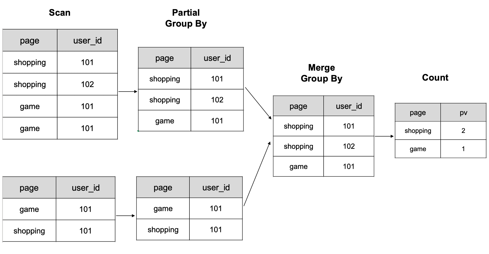

# Use Bitmap for exact count distinct

## Background

There are usually two ways to conduct  accurate de-duplication analysis in StarRocks.

* Detail-based de-duplication: This is  a traditional count distinct approach that is able to retain detailed data for flexible analysis. However,  it consumes huge computational and storage resources and is not friendly enough to support scenarios involving large-scale datasets and query latency-sensitive de-duplication.
* Precomputation-based de-duplication: This approach is also recommended by StarRocks. In some scenarios, users only want to get the results after de-duplication and care less about detailed data. Such a scenario can be analyzed by precomputation, which is essentially using space for time and resonates with the core idea of the MOLAP aggregation model. It is to calculate in the  process of data import, reducing the storage cost and the cost of on-site calculation during query. You can further reduce the size of datasets for on-site computation  by shrinking RollUp dimension.

## Traditional Count Distinct Calculation

StarRocks is implemented based on the MPP architecture that supports retaining detailed data when using count distinct calculation for accurate de-duplication t. However, because of the need for multiple data shuffles (transferring data between different nodes and calculating de-weighting) during query, it leads to a linear decrease in performance as the data volume increases.

In the following scenario, there are tables (dt, page, user_id) that need to calculate UV by detailed data.

|  dt   |   page  | user_id |
| :---: | :---: | :---:|
|   20191206  |   xiaoxiang  | 101 |
|   20191206  |   waimai  | 101 |
|   20191206  |   xiaoxiang  | 101 |
|   20191206  |   waimai  | 101 |
|   20191206  |   xiaoxiang  | 101 |
|   20191206  |   waimai  | 101 |

Count `uv` grouping by `page`

|  page   |   uv  |
| :---: | :---: |
|   xiaoxiang  |  1   |
|   waimai  |   2  |

```sql
 select page, count(distinct user_id) as uv from table group by page;
```

For the SQL of PV calculation, StarRocks will do the calculation according to the following figure. First, group by the page column and user_id column, and then count.



* Note: The figure shows a schematic of 6 rows of data computed on 2 BE nodes

Given that the data needs to be shuffled several times, it will require more computational resources and the query will be slower when the data volume gets larger. The Bitmap technology is used to  solve the performance problem of traditional count distinct calculation in such scenarios.

## De-duplication with Bitmap

Given an array A with values in the range [0, n) (note: not including n), a bitmap of byte length (n+7)/8 can be used to de-duplicate the array. First, initialize the bitmap to all zeros. Then process the elements of the array A one by one, using the value of the elements in A as the subscript of the bitmap and setting the bit of the subscript to 1. Finally, count the number of 1s in the bitmap. The number of 1s in the bitmap is the result of count distinct of array A.

## Advantages of bitmap de-duplication

1. Space advantage: Using one bit of a bitmap to indicate the existence of the corresponding subscript has a great space advantage. For example, for int32 de-duplication, the storage space required by a normal bitmap is only 1/32 of the traditional de-duplication. The implementation of Roaring Bitmap in StarRocks further significantly reduces storage usage through optimizing sparse bitmaps.
2. Time advantage: The bitmap de-duplication involves computation such as bit placement for a given subscript and counting the number of placed bitmaps, which are O(1) and O(n) operations respectively. The latter can be computed efficiently using clz, ctz and other instructions. In addition, bitmap de-duplication can be accelerated in parallel in the MPP execution engine, where each computing node computes a local sub-bitmap and uses the bitor operation to merge allsub-bitmaps into a final bitmap. Bitor operation is more efficient than sort-based or hash-based de-duplication in that it has no condition or data dependencies and supports vectorized execution.

Roaring Bitmap implementation, details can be found at: [specific paper and implementation](https://github.com/RoaringBitmap/RoaringBitmap)

## How to Use Bitmap

1. First of all, users should note that both bitmap index and bitmap de-duplication use the bitmap technique, but the motivation for introducing them and the problem they solve are completely different. The former is used to filter enumerated columns with a low base number, while the latter is used to calculate the number of non-repeating elements in the index column of data rows.
2. Currently Bitmap columns can only exist in the aggregate model, not in the duplicate model or the  update model.
3. When creating a table, specify the data type of the indicator column as BITMAP and the aggregation function as `BITMAP_UNION`.
4. When using count distinct on a Bitmap type column, StarRocks will automatically convert it to the BITMAP_UNION_COUNT calculation.

### Example

Take the UV statistics of a page as an example.

First, create a table with a BITMAP column, where `visit_users` is an aggregated column, the column type is `BITMAP`, and the aggregation function is `BITMAP_UNION`.

```sql
CREATE TABLE `page_uv` (
  `page_id` INT NOT NULL COMMENT '页面id',
  `visit_date` datetime NOT NULL COMMENT '访问时间',
  `visit_users` BITMAP BITMAP_UNION NOT NULL COMMENT '访问用户id'
) ENGINE=OLAP
AGGREGATE KEY(`page_id`, `visit_date`)
DISTRIBUTED BY HASH(`page_id`) BUCKETS 1
PROPERTIES (
  "replication_num" = "1",
  "storage_format" = "DEFAULT"
);
```

Import data into a table, using the insert into statement:

```sql
insert into page_uv values
(1, '2020-06-23 01:30:30', to_bitmap(13)),
(1, '2020-06-23 01:30:30', to_bitmap(23)),
(1, '2020-06-23 01:30:30', to_bitmap(33)),
(1, '2020-06-23 02:30:30', to_bitmap(13)),
(2, '2020-06-23 01:30:30', to_bitmap(23));
```

After the data import, in the row `page_id = 1, visit_date = '2020-06-23 01:30:30'`, the `visit_user` field contains 3 bitmap elements (13, 23, 33); in the data row `page_id = 1, visit_date = '2020-06-23 02:30 :30'`, the `visit_user` field contains 1 bitmap element (13); in the data row `page_id = 2, visit_date = '2020-06-23 01:30:30'`, the `visit_user` field contains 1 bitmap element (23).

Import using local files:

```shell
cat <<<'DONE' | \
    curl --location-trusted -u root: -H "label:label_1600960288796" \
        -H "column_separator:," \
        -H "columns:page_id,visit_date,visit_users, visit_users=to_bitmap(visit_users)" -T - \
        http://StarRocks_be0:8040/api/db0/page_uv/_stream_load
1,2020-06-23 01:30:30,130
1,2020-06-23 01:30:30,230
1,2020-06-23 01:30:30,120
1,2020-06-23 02:30:30,133
2,2020-06-23 01:30:30,234
DONE
```

Statistics of UV per page.

```sql
select page_id, count(distinct visit_users) from page_uv group by page_id;
```

Query Results.

```shell
mysql> select page_id, count(distinct visit_users) from page_uv group by page_id;

+-----------+------------------------------+
|  page_id  | count(DISTINCT `visit_user`) |
+-----------+------------------------------+
|         1 |                            3 |
+-----------+------------------------------+
|         2 |                            1 |
+-----------+------------------------------+
2 row in set (0.00 sec)
```

## Bitmap Global Dictionary

Currently, the Bitmap type-based de-duplication mechanism requires the input to be integer. If the user needs to use other data types as input to the Bitmap, then the user needs to build their own global dictionary to map other types of data (such as string types) to integer types. There are several ideas for building a global dictionary.

### Hive Table-based Global Dictionary

The global dictionary itself in this scheme is a Hive table, which has two columns, one for raw values and one for encoded Int values. The steps to generate the global dictionary are as follows:

1. De-duplicate the dictionary columns of the fact table to generate a temporary table
2. Left join the temporary table and the global dictionary, add `new value` to the temporary table.
3. Encode the `new value` and insert it into the global dictionary.
4. Left join the fact table and the updated global dictionary, replace the dictionary items with IDs.

In this way, the global dictionary can be updated and the value columns in the fact table can be replaced using Spark or MR. Compared with the trie tree-based global dictionary, this approach can be distributed and the global dictionary can be reused.

However, there are a few things to note: the original fact table is read multiple times, and there are two joins that consume a lot of extra resources during the calculation of the global dictionary.

### Build a global dictionary based on a trie tree

Users can also build their own global dictionaries using trie trees (aka prefix trees or dictionary trees). The trie tree has common prefixes for the descendants of nodes, which can be used to reduce query time and minimize string comparisons, and therefore is well suited for implementing dictionary encoding. However, the implementation of trie tree is not easy to distribute and can create performance bottlenecks when the data volume is relatively large.

By building a global dictionary and converting other types of data to integer data, you can use Bitmap to perform accurate de-duplication analysis of non-integer data columns.
