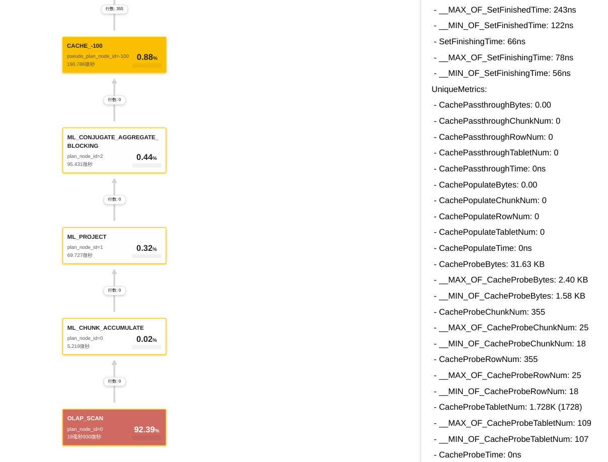
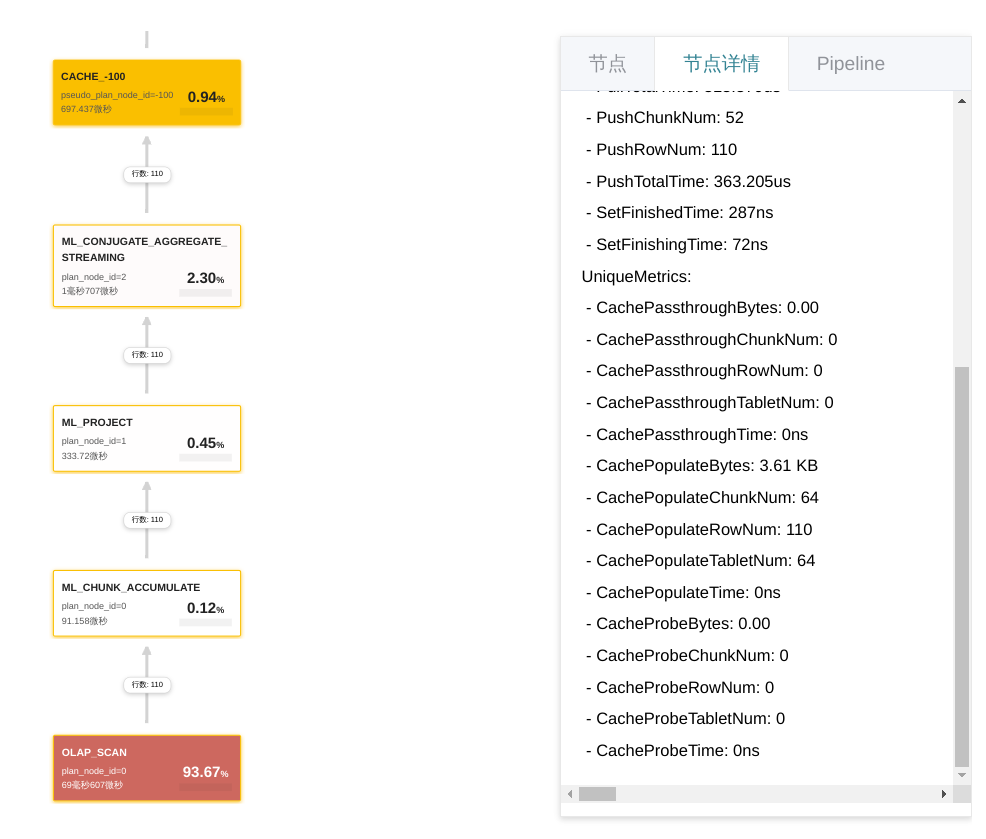
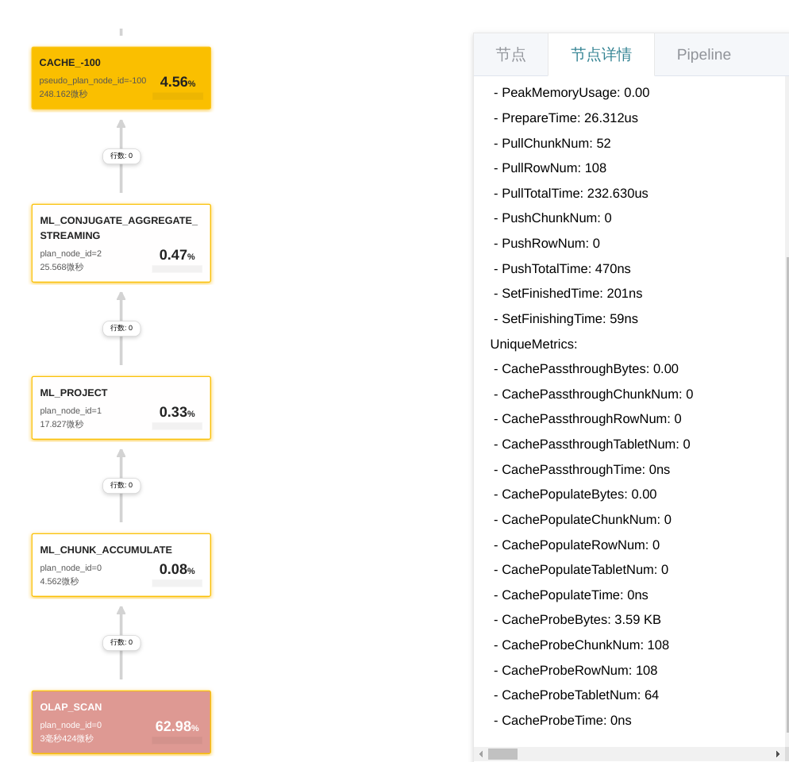
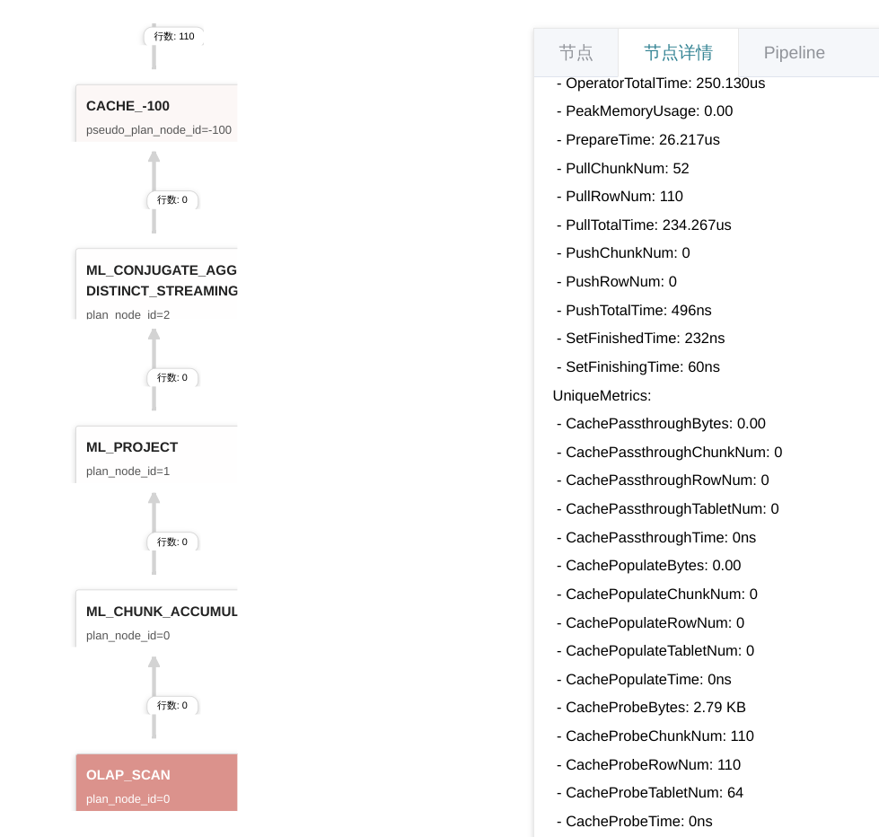
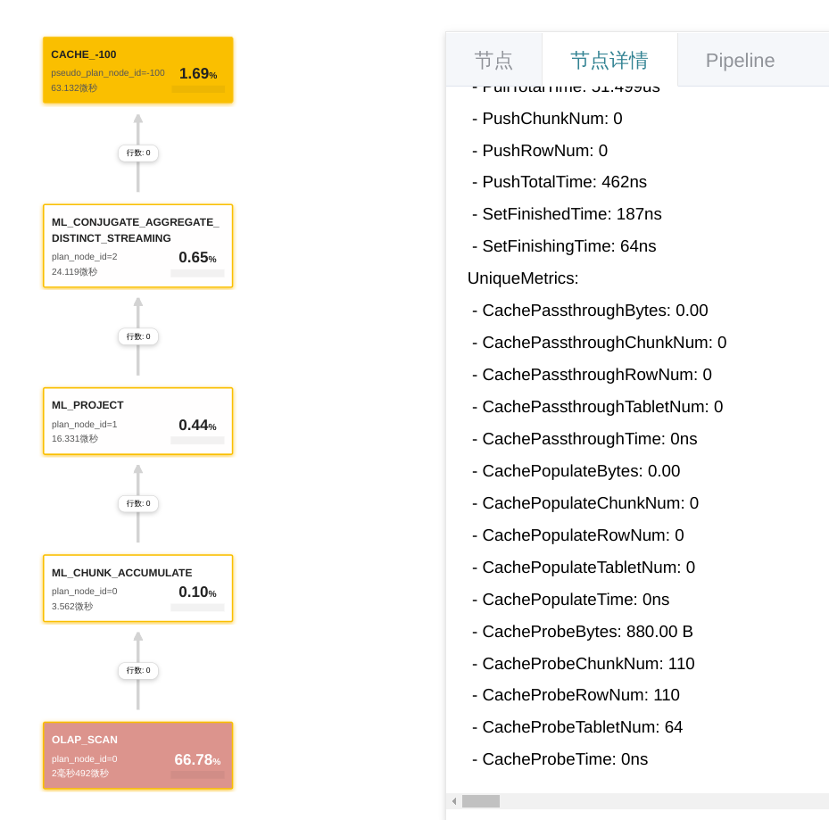
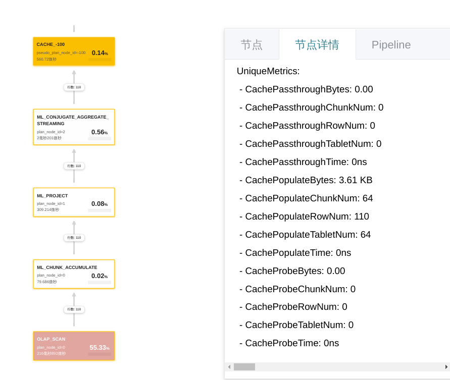
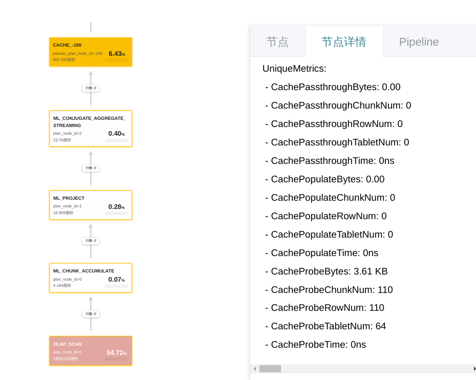
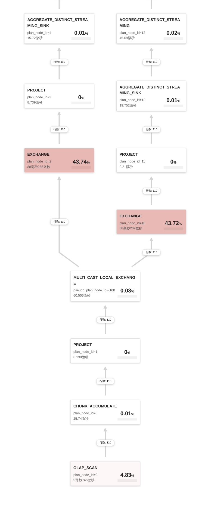
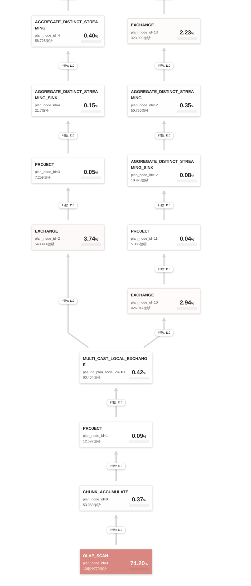
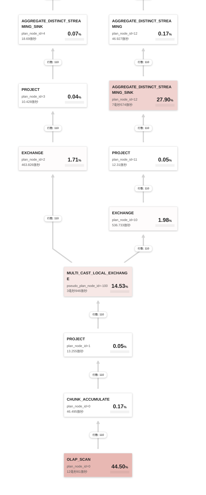

# Query Cache

The query cache can save the intermediate computation results of queries. New queries that are semantically equivalent to previous queries can reuse the cached computation results to accelerate computations. As such, QPS is increased and average latency is decreased for highly concurrent, simple aggregate queries.

You can use the FE session variable `enable_query_cache` to enable the query cache. See the "[FE session variables](../using_starrocks/query_cache.md#fe-session-variables)" section of this topic.

## Application scenarios

We recommend that you use the query cache in the following scenarios:

- You frequently run aggregate queries on a single flat table or on multiple tables joined in a star schema.
- Most of your aggregate queries are non-GROUP BY aggregate queries and low-cardinality GROUP BY aggregate queries.
- Your data is loaded in append mode by time partition and can be categorized as hot data and cold data based on access frequency.

The query cache supports queries that meet the following conditions:

- The query engine is Pipeline. To enable the Pipeline engine, set the session variable `enable_pipeline_engine` to `true`.

  > **NOTE**
  >
  > Other query engines do not support the query cache.

- The queries are on native OLAP tables. The query cache does not support queries on external tables or lake tables. The query cache also supports queries whose plans require access to single-table materialized views. However, the query cache does not support queries whose plans require access to multi-table materialized views.

- The queries are aggregate queries on a single table.

  **NOTE**
  >
  > The query cache will support aggregate queries on multiple tables that are joined by using colocate joins, broadcast joins, or bucket shuffle joins in the future.

- The queries do not include nondeterminstic functions such as `rand`, `random`, `uuid`, and `sleep`.

The query cache supports queries on tables that use any of the following partition policies: Unpartitioned, Multi-Column Partitioned, and Single-Column Partitioned.

## Feature boundaries

- The query cache is based on per-tablet computations of the Pipeline engine. Per-tablet computation means that a pipeline driver can process entire tables one by one rather than processing a portion of a tablet or many tablets interleaved together. When the actual number of tablets that are processed by a pipeline is greater than or equal to this pipeline's degree of parallelism (DOP) specified by the session variable `pipeline_dop`, the query cache works. If the number of tablets processed is smaller than the number of pipeline drivers, each pipeline driver processes only a portion of a specific tablet. In this situation, per-tablet computation results cannot be produced, and therefore the query cache does not work.
- In StarRocks, an aggregate query consists of at least four stages. Per-Tablet computation results generated by AggregateNode in the first stage can be cached only when OlapScanNode and AggregateNode compute data from the same fragment. Per-Tablet computation results generated by AggregateNode in the other stages cannot be cached. For some DISTINCT aggregate queries, if the session variable `cbo_cte_reuse` is set to `true`, the query cache does not work when OlapScanNode, which produces data, and the stage-1 AggregateNode, which consumes the produced data, compute data from different fragments and are bridged by an ExchangeNode. The following two examples show scenarios in which CTE optimizations are performed and therefore the query cache does not work:
  - The output columns are computed by using the aggregate function `avg(distinct)`.
  - The output columns are computed by multiple DISTINCT aggregate functions.

## Parameter configurations

This section describes the parameters and session variables that are used to enable and configure the query cache.

### FE session variables

| **Variable**                | **Default value** | **Can be dynamically configured** | **Description**                                              |
| --------------------------- | ----------------- | --------------------------------- | ------------------------------------------------------------ |
| enable_query_cache          | false             | Yes                               | Specifies whether to enable the query cache. Valid values: `true` and `false`. `true` specifies to enable this feature, and `false` specifies to disable this feature. When the query cache is enabled, it works only for queries that meet the conditions specified in the "[Application scenarios](../using_starrocks/query_cache.md#application-scenarios)" section of this topic. |
| query_cache_force_populate  | false             | Yes                               | Specifies whether to ignore the computation results saved in the query cache. Valid values: `true` and `false`. `true` specifies to enable this feature, and `false` specifies to disable this feature. If this feature is enabled, StarRocks ignores the cached computation results when it performs computations required by queries. In this case, StarRocks once again reads data from the source, computes the data, and updates the computation results saved in the query cache.<br>In this sense, the `query_cache_force_populate=true` setting resembles cache misses. |
| query_cache_entry_max_bytes | 4194304           | Yes                               | Specifies the threshold for triggering the Passthrough mode. Valid values: `0` to `9223372036854775807`. When the number of bytes or rows from the computation results of a specific tablet accessed by a query exceeds the threshold specified by the `query_cache_entry_max_bytes` or  `query_cache_entry_max_rows` parameter, the query is switched to Passthrough mode.<br>If the `query_cache_entry_max_bytes` or `query_cache_entry_max_rows` parameter is set to `0`, the Passthrough mode is used even when no computation results are generated from the involved tablets. |
| query_cache_entry_max_rows  | 409600            | Yes                               | Same as above                                                |

### BE parameters

You need to configure the following parameter in the BE configuration file **be.conf**. After you reconfigure this parameter for a BE, you must restart the BE to make the new parameter setting take effect.

| **Parameter**        | **Required** | **Description**                                              |
| -------------------- | ------------ | ------------------------------------------------------------ |
| query_cache_capacity | No           | Specifies the size of the query cache. Unit: bytes. The default size is 512 MB. The size cannot be less than 4 MB. If the memory capacity of the BE is insufficient to provision your expected query cache size, you can increase the memory capacity of the BE.<br>Each BE has its own storage for the query cache and populates or probes only its own query cache storage. |

## Concepts

### Semantic equivalence

When two queries are similar, do not need to be literally equivalent, and contain semantically equivalent snippets in their execution plans, they are semantically equivalent and can reuse each other's computation results. In a broad sense, two queries are semantically equivalent if they query data from the same source, use the same computation method, and have the same execution plan. StarRocks applies the following rules to evaluate whether two queries are semantically equivalent:

- If the two queries contain multiple aggregations, they are evaluated as semantically equivalent as long as their first aggregations are semantically equivalent. For example, the following two queries, Q1 and Q2, both contain multiple aggregations, but their first aggregations are semantically equivalent. Therefore, Q1 and Q2 are evaluated as semantically equivalent.

  - Q1

    ```SQL
    SELECT
        (
            ifnull(sum(murmur_hash3_32(hour)), 0) + ifnull(sum(murmur_hash3_32(k0)), 0) + ifnull(sum(murmur_hash3_32(__c_0)), 0)
        ) AS fingerprint
    FROM
        (
            SELECT
                date_trunc('hour', ts) AS hour,
                k0,
                sum(v1) AS __c_0
            FROM
                t0
            WHERE
                ts between '2022-01-03 00:00:00'
                and '2022-01-03 23:59:59'
            GROUP BY
                date_trunc('hour', ts),
                k0
        ) AS t;
    ```

  - Q2

    ```SQL
    SELECT
        date_trunc('hour', ts) AS hour,
        k0,
        sum(v1) AS __c_0
    FROM
        t0
    WHERE
        ts between '2022-01-03 00:00:00'
        and '2022-01-03 23:59:59'
    GROUP BY
        date_trunc('hour', ts),
        k0
    ```

- If the two queries both belong to one of the following query types, they can be evaluated as semantically equivalent. Note that queries that include a HAVING clause cannot be evaluated as semantically equivalent to queries that do not include a HAVING clause. However, the inclusion of an ORDER BY or LIMIT clause does not affect the evaluation of whether two queries are semantically equivalent.

  - GROUP BY aggregations

    ```SQL
    SELECT <GroupByItems>, <AggFunctionItems> 
    FROM <Table> 
    WHERE <Predicates> [and <PartitionColumnRangePredicate>]
    GROUP BY <GroupByItems>
    [HAVING <HavingPredicate>] 
    ```

    > **NOTE**
    >
    > In the preceding example, the HAVING clause is optional.

  - GROUP BY DISTINCT aggregations

    ```SQL
    SELECT DISTINCT <GroupByItems>, <Items> 
    FROM <Table> 
    WHERE <Predicates> [and <PartitionColumnRangePredicate>]
    GROUP BY <GroupByItems>
    HAVING <HavingPredicate>
    ```

    > **NOTE**
    >
    > In the preceding example, the HAVING clause is optional.

  - Non-GROUP BY aggregations

    ```SQL
    SELECT <AggFunctionItems> FROM <Table> 
    WHERE <Predicates> [and <PartitionColumnRangePredicate>]
    ```

  - Non-GROUP BY DISTINCT aggregations

    ```SQL
    SELECT DISTINCT <Items> FROM <Table> 
    WHERE <Predicates> [and <PartitionColumnRangePredicate>]
    ```

- If either query includes `PartitionColumnRangePredicate`, `PartitionColumnRangePredicate` is removed before the two queries are evaluated for semantic equivalence. `PartitionColumnRangePredicate` specifies one of the following types of predicates that reference a partitioning column:

  - `col between v1 and v2`: The values of the partitioning column fall within the [v1, v2] range, in which `v1` and `v2` are constant expressions.
  - `v1 < col and col < v2`: The values of the partitioning column fall within the (v1, v2) range, in which `v1` and `v2` are constant expressions.
  - `v1 < col and col <= v2`: The values of the partitioning column fall within the (v1, v2] range, in which `v1` and `v2` are constant expressions.
  - `v1 <= col and col < v2`: The values of the partitioning column fall within the [v1, v2) range, in which `v1` and `v2` are constant expressions.
  - `v1 <= col and col <= v2`: The values of the partitioning column fall within the [v1, v2] range, in which `v1` and `v2` are constant expressions.

- If the output columns of the SELECT clauses of the two queries are the same after they are rearranged, the two queries are evaluated as semantically equivalent.

- If the output columns of the GROUP BY clauses of the two queries are the same after they are rearranged, the two queries are evaluated as semantically equivalent.

- If the remaining predicates of the WHERE clauses of the two queries are semantically equivalent after `PartitionColumnRangePredicate` is removed, the two queries are evaluated as semantically equivalent.

- If the predicates in the HAVING clauses of the two queries are semantically equivalent, the two queries are evaluated as semantically equivalent.

Use the following table `lineorder_flat` as an example:

```SQL
CREATE TABLE `lineorder_flat`
(
    `lo_orderdate` date NOT NULL COMMENT "",
    `lo_orderkey` int(11) NOT NULL COMMENT "",
    `lo_linenumber` tinyint(4) NOT NULL COMMENT "",
    `lo_custkey` int(11) NOT NULL COMMENT "",
    `lo_partkey` int(11) NOT NULL COMMENT "",
    `lo_suppkey` int(11) NOT NULL COMMENT "",
    `lo_orderpriority` varchar(100) NOT NULL COMMENT "",
    `lo_shippriority` tinyint(4) NOT NULL COMMENT "",
    `lo_quantity` tinyint(4) NOT NULL COMMENT "",
    `lo_extendedprice` int(11) NOT NULL COMMENT "",
    `lo_ordtotalprice` int(11) NOT NULL COMMENT "",
    `lo_discount` tinyint(4) NOT NULL COMMENT "",
    `lo_revenue` int(11) NOT NULL COMMENT "",
    `lo_supplycost` int(11) NOT NULL COMMENT "",
    `lo_tax` tinyint(4) NOT NULL COMMENT "",
    `lo_commitdate` date NOT NULL COMMENT "",
    `lo_shipmode` varchar(100) NOT NULL COMMENT "",
    `c_name` varchar(100) NOT NULL COMMENT "",
    `c_address` varchar(100) NOT NULL COMMENT "",
    `c_city` varchar(100) NOT NULL COMMENT "",
    `c_nation` varchar(100) NOT NULL COMMENT "",
    `c_region` varchar(100) NOT NULL COMMENT "",
    `c_phone` varchar(100) NOT NULL COMMENT "",
    `c_mktsegment` varchar(100) NOT NULL COMMENT "",
    `s_name` varchar(100) NOT NULL COMMENT "",
    `s_address` varchar(100) NOT NULL COMMENT "",
    `s_city` varchar(100) NOT NULL COMMENT "",
    `s_nation` varchar(100) NOT NULL COMMENT "",
    `s_region` varchar(100) NOT NULL COMMENT "",
    `s_phone` varchar(100) NOT NULL COMMENT "",
    `p_name` varchar(100) NOT NULL COMMENT "",
    `p_mfgr` varchar(100) NOT NULL COMMENT "",
    `p_category` varchar(100) NOT NULL COMMENT "",
    `p_brand` varchar(100) NOT NULL COMMENT "",
    `p_color` varchar(100) NOT NULL COMMENT "",
    `p_type` varchar(100) NOT NULL COMMENT "",
    `p_size` tinyint(4) NOT NULL COMMENT "",
    `p_container` varchar(100) NOT NULL COMMENT ""
)
ENGINE=OLAP 
DUPLICATE KEY(`lo_orderdate`, `lo_orderkey`)
COMMENT "olap"
PARTITION BY RANGE(`lo_orderdate`)
(PARTITION p1 VALUES [('0000-01-01'), ('1993-01-01')),
PARTITION p2 VALUES [('1993-01-01'), ('1994-01-01')),
PARTITION p3 VALUES [('1994-01-01'), ('1995-01-01')),
PARTITION p4 VALUES [('1995-01-01'), ('1996-01-01')),
PARTITION p5 VALUES [('1996-01-01'), ('1997-01-01')),
PARTITION p6 VALUES [('1997-01-01'), ('1998-01-01')),
PARTITION p7 VALUES [('1998-01-01'), ('1999-01-01')))
DISTRIBUTED BY HASH(`lo_orderkey`) BUCKETS 48 
PROPERTIES 
(
    "replication_num" = "1",
    "colocate_with" = "groupxx1",
    "in_memory" = "false",
    "storage_format" = "DEFAULT",
    "enable_persistent_index" = "false",
    "compression" = "LZ4"
);
```

The following two queries, Q1 and Q2, on the table `lineorder_flat` are semantically equivalent after they are processed as follows:

1. Rearrange the output columns of the SELECT statement.
2. Rearrange the output columns of the GROUP BY clause.
3. Remove the output columns of the ORDER BY clause.
4. Rearrange the predicates in the WHERE clause.
5. Add `PartitionColumnRangePredicate`.

- Q1

  ```SQL
  SELECT sum(lo_revenue)), year(lo_orderdate) AS year,p_brand
  FROM lineorder_flat
  WHERE p_category = 'MFGR#12' AND s_region = 'AMERICA'
  GROUP BY year,p_brand
  ORDER BY year,p_brand;
  ```

- Q2

  ```SQL
  SELECT year(lo_orderdate) AS year, p_brand, sum(lo_revenue))
  FROM lineorder_flat
  WHERE s_region = 'AMERICA' AND p_category = 'MFGR#12' AND 
     lo_orderdate >= '1993-01-01' AND lo_orderdate <= '1993-12-31'
  GROUP BY p_brand, year(lo_orderdate)
  ```

Semantic equivalence is evaluated based on the physical plans of queries. Therefore, literal differences in queries do not impact the evaluation for semantic equivalence. Additionally, constant expressions are removed from queries, and `cast` expressions are removed during query optimizations. Therefore, these expressions do not impact the evaluation for semantic equivalence. Thirdly, the aliases of columns and relations do not impact the evaluation for semantic equivalence either.

### Predicate-based query splitting

Splitting queries based on predicate semantics help implement reuse of partial computation results. When a query contains a predicate that references the partitioning column of a table and the predicate specifies a value range, StarRocks can split the range into multiple intervals based on table partitioning. The computation results from each individual interval can be separately reused by other queries.

Use the following table `t0` as an example:

```SQL
CREATE TABLE if not exists t0
(
    ts DATETIME NOT NULL,
    k0 VARCHAR(10) NOT NULL,
    k1 BIGINT NOT NULL,
    v1 DECIMAL64(7, 2) NOT NULL 
)
ENGINE=OLAP
DUPLICATE KEY(`ts`, `k0`, `k1`)
COMMENT "OLAP"
PARTITION BY RANGE(ts)
(
  START ("2022-01-01 00:00:00") END ("2022-02-01 00:00:00") EVERY (INTERVAL 1 day) 
)
DISTRIBUTED BY HASH(`ts`, `k0`, `k1`) BUCKETS 1
PROPERTIES
(
    "replication_num" = "1", 
    "in_memory" = "false",
    "storage_format" = "default"
);
```

The table `t0` is partitioned by day, and the column `ts` is the table's partitioning column. Among the following four queries, Q2, Q3, and Q4 can reuse portions of the computation results cached for Q1:

- Q1

  ```SQL
  SELECT date_trunc('day', ts) as day, sum(v0)
  FROM t0
  WHERE ts BETWEEN '2022-01-02 12:30:00' AND '2022-01-14 23:59:59'
  GROUP BY day;
  ```

  The value range specified by the predicate `ts between '2022-01-02 12:30:00' and '2022-01-14 23:59:59'` of Q1 can be split into the following intervals:

  ```SQL
  1. [2022-01-02 12:30:00, 2022-01-03 00:00:00),
  2. [2022-01-03 00:00:00, 2022-01-04 00:00:00),
  3. [2022-01-04 00:00:00, 2022-01-05 00:00:00),
  ...
  12. [2022-01-13 00:00:00, 2022-01-14 00:00:00),
  13. [2022-01-15 00:00:00, 2022-01-15 00:00:00),
  ```

- Q2

  ```SQL
  SELECT date_trunc('day', ts) as day, sum(v0)
  FROM t0
  WHERE ts >= '2022-01-02 12:30:00' AND  ts < '2022-01-05 00:00:00'
  GROUP BY day;
  ```

  Q2 can reuse the computation results within the following intervals of Q1:

  ```SQL
  1. [2022-01-02 12:30:00, 2022-01-03 00:00:00),
  2. [2022-01-03 00:00:00, 2022-01-04 00:00:00),
  3. [2022-01-04 00:00:00, 2022-01-05 00:00:00),
  ```

- Q3

  ```SQL
  SELECT date_trunc('day', ts) as day, sum(v0)
  FROM t0
  WHERE ts >= '2022-01-01 12:30:00' AND  ts <= '2022-01-10 12:00:00'
  GROUP BY day;
  ```

  Q3 can reuse the computation results within the following intervals of Q1:

  ```SQL
  2. [2022-01-03 00:00:00, 2022-01-04 00:00:00),
  3. [2022-01-04 00:00:00, 2022-01-05 00:00:00),
  ...
  9. [2022-01-09 00:00:00, 2022-01-10 00:00:00),
  ```

- Q4

  ```SQL
  SELECT date_trunc('day', ts) as day, sum(v0)
  FROM t0
  WHERE ts BETWEEN '2022-01-02 12:30:00' and '2022-01-02 23:59:59'
  GROUP BY day;
  ```

  Q4 can reuse the computation results within the following intervals of Q1:

  ```SQL
  1. [2022-01-02 12:30:00, 2022-01-03 00:00:00),
  ```

The support for reuse of partial computation results varies depending on the partitioning policy used, as described in the following table.

| **Partitioning policy**   | **Support for reuse of partial computation results**         |
| ------------------------- | ------------------------------------------------------------ |
| Unpartitioned             | Not supported                                                |
| Multi-Column Partitioned  | Not supported<br>**NOTE**<br>This feature may be supported in the future. |
| Single-Column Partitioned | Supported                                                    |

### Multi-version caching

As data loads are made, new versions of tablets are generated. Consequently, the cached computation results that are generated from the previous versions of the tablets become stale and lag behind the latest tablet versions. In this situation, the multi-version caching mechanism tries to merge the stale results saved in the query cache and the incremental versions of the tablets stored on disk into the final results of the tablets so that new queries can carry the latest tablet versions. Multi-version caching is constrained by data models, query types, and data update types.

The support for multi-version caching varies depending on data models and query types, as described in the following table.

| **Data type**       | **Query** **type**                                           | **Support for multi-version caching**                        |
| ------------------- | ------------------------------------------------------------ | ------------------------------------------------------------ |
| Duplicate Key Model | <ul><li>Queries on base tables</li><li>Queries on single-table materialized views</li></ul> | <ul><li>Queries on base tables: supported in all situations except when incremental tablet versions contain data deletion records.</li><li>Queries on single-table materialized views: supported in all situations except when the GROUP BY, HAVING, or WHERE clauses of queries reference aggregation columns.</li></ul> |
| Aggregate Key Model | Queries on base tables or queries on single-table materialized views | Supported in all situations except the following:The schemas of base tables contain the aggregate function `replace`.The GROUP BY, HAVING, or WHERE clauses of queries reference aggregation columns.Incremental tablet versions contain data deletion records. |
| Unique Key Model    | N/A                                                          | Not supported. However, the query cache is supported.        |
| Primary Key Model   | N/A                                                          | Not supported. However, the query cache is supported.        |

The impact of data update types on multi-version caching is as follows:

- Data deletions

  Multi-version caching cannot work if incremental versions of tablets contain delete operations.

- Data insertions

  - If an empty version is generated for a tablet, the existing data of the tablet in the query cache remains valid and can still be retrieved.
  - If a non-empty version is generated for a tablet, the existing data of the tablet in the query cache remains valid, but its version lags behind the latest version of the tablet. In this situation, StarRocks reads the incremental data generated from the version of the existing data to the latest version of the tablet, merges the existing data with the incremental data, and populates the merged data into the query cache.

- Schema changes and tablet truncations

  If the schema of a table is changed or specific tablets of the table are truncated, new tablets are generated for the table. As a result, the existing data of the tablets of the table in the query cache becomes invalid.

### Passthrough

The query cache occupies a small amount of memory provided by the BE to save computation results. The size of the query cache defaults to 512 MB. Therefore, it is unsuitable for the query cache to save large-sized data items. Additionally, after you enable the query cache, query performance is decreased if the cache hit ratio is low. Therefore, if the size of computation results generated for a tablet exceeds the threshold specified by the `query_cache_entry_max_bytes` or `query_cache_entry_max_rows` parameter, the query cache no longer works for the query and the query is switched to Passthrough mode.

## Metrics

The profiles of queries for which the query cache works contain `CacheOperator` statistics, as shown in the following figure.



In the source plan of a query, if the pipeline contains `OlapScanOperator`, the names of `OlapScanOperator` and aggregate operators are prefixed with `ML_` to denote that the pipeline uses `MultilaneOperator` to perform per-tablet computations. `CacheOperator` is inserted preceding `ML_CONJUGATE_AGGREGATE` to process the logic that controls how the query cache runs in Passthrough, Populate, and Probe modes. The profile of the query contains the following `CacheOperator` metrics that help you understand the query cache usage.

| **Metric**                | **Description**                                              |
| ------------------------- | ------------------------------------------------------------ |
| CachePassthroughBytes     | The number of bytes generated in Passthrough mode.           |
| CachePassthroughChunkNum  | The number of chunks generated in Passthrough mode.          |
| CachePassthroughRowNum    | The number of rows generated in Passthrough mode.            |
| CachePassthroughTabletNum | The number of tablets generated in Passthrough mode.         |
| CachePassthroughTime:     | The amount of computation time taken in Passthrough mode.    |
| CachePopulateBytes        | The number of bytes generated in Populate mode.              |
| CachePopulateChunkNum     | The number of chunks generated in Populate mode.             |
| CachePopulateRowNum       | The number of rows generated in Populate mode.               |
| CachePopulateTabletNum    | The number of tablets generated in Populate mode.            |
| CachePopulateTime         | The amount of computation time taken in Populate mode.       |
| CacheProbeBytes           | The number of bytes generated for cache hits in Probe mode.  |
| CacheProbeChunkNum        | The number of chunks generated for cache hits in Probe mode. |
| CacheProbeRowNum          | The number of rows generated for cache hits in Probe mode.   |
| CacheProbeTabletNum       | The number of tablets generated for cache hits in Probe mode. |
| CacheProbeTime            | The amount of computation time taken in Probe mode.          |

`CachePopulate`*`XXX`* metrics provide statistics about query cache misses for which the query cache is updated.

`CachePassthrough`*`XXX`* metrics provide statistics about query cache misses for which the query cache is not updated because the size of per-tablet computation results generated is large.

`CacheProbe`*`XXX`* metrics provide statistics about query cache hits.

In the multi-version caching mechanism, `CachePopulate` metrics and `CacheProbe` metrics may contain the same tablet statistics, and `CachePassthrough` metrics and `CacheProbe` metrics may also contain the same tablet statistics. For example, when StarRocks computes the data of each tablet, it hits the computation results generated on the historical version of the tablet. In this situation, StarRocks reads the incremental data generated from the historical version to the latest version of the tablet, computes the data, and merges the incremental data with the cached data. If the size of the computation results generated after the merging does not exceed the threshold specified by the `query_cache_entry_max_bytes` or `query_cache_entry_max_rows` parameter, the statistics of the tablet are collected into `CachePopulate` metrics. Otherwise, the statistics of the tablet are collected into `CachePassthrough` metrics.

## RESTful API operations

- `metrics |grep query_cache`

  This API operation is used to query the metrics related to the query cache.

  ```Apache
  curl -s  http://<be_host>:<be_http_port>/metrics |grep query_cache
  
  # TYPE starrocks_be_query_cache_capacity gauge
  starrocks_be_query_cache_capacity 536870912
  # TYPE starrocks_be_query_cache_hit_count gauge
  starrocks_be_query_cache_hit_count 5084393
  # TYPE starrocks_be_query_cache_hit_ratio gauge
  starrocks_be_query_cache_hit_ratio 0.984098
  # TYPE starrocks_be_query_cache_lookup_count gauge
  starrocks_be_query_cache_lookup_count 5166553
  # TYPE starrocks_be_query_cache_usage gauge
  starrocks_be_query_cache_usage 0
  # TYPE starrocks_be_query_cache_usage_ratio gauge
  starrocks_be_query_cache_usage_ratio 0.000000
  ```

- `api/query_cache/stat`

  This API operation is used to query the usage of the query cache.

  ```Bash
  curl  http://<be_host>:<be_http_port>/api/query_cache/stat
  {
      "capacity": 536870912,
      "usage": 0,
      "usage_ratio": 0.0,
      "lookup_count": 5025124,
      "hit_count": 4943720,
      "hit_ratio": 0.983800598751394
  }
  ```

- `api/query_cache/invalidate_all`

  This API operation is used to clear the query cache.

  ```Bash
  curl  -XPUT http://<be_host>:<be_http_port>/api/query_cache/invalidate_all
  
  {
      "status": "OK"
  }
  ```

The parameters in the preceding API operations are as follows:

- `be_host`: the IP address of the node on which the BE resides.
- `be_http_port`: the HTTP port number of the node on which the BE resides.

## Precautions

- When the session variable `pipeline_dop` is set to `1`, StarRocks needs to populate the query cache with the computation results of queries that are initiated for the first time. As a result, the query performance may be slightly lower than expected, and the query latency is increased.
- If you configure a large query cache size, the amount of memory that can be provisioned to processes on the BE is decreased. We recommend that the query cache size do not exceed 1/6 of the memory capacity provisioned to processes.
- If the number of tablets processed by a pipeline is less than the value of the `pipeline_dop` parameter, the query cache does not work. To enable the query cache to work, you can set `pipeline_dop` to `1`.

## Examples

### Dataset

Log in to your StarRocks cluster, go to the destination database, and run the following command to create a table named `t0`:

```SQL
CREATE TABLE `t0` (
  `ts` datetime NOT NULL COMMENT "",
  `k0` varchar(10) NOT NULL COMMENT "",
  `k1` char(6) NOT NULL COMMENT "",
  `v0` bigint(20) NOT NULL COMMENT "",
  `v1` decimal64(7, 2) NOT NULL COMMENT ""
) ENGINE=OLAP 
DUPLICATE KEY(`ts`, `k0`, `k1`)
COMMENT "OLAP"
PARTITION BY RANGE(`ts`)
(
    START ("2022-01-01 00:00:00") END ("2022-02-01 00:00:00") EVERY (INTERVAL 1 DAY)
)
DISTRIBUTED BY HASH(`ts`, `k0`, `k1`) BUCKETS 64 
PROPERTIES (
"replication_num" = "1",
"in_memory" = "false",
"storage_format" = "DEFAULT",
"enable_persistent_index" = "false",
"compression" = "LZ4"
);
```

### Query examples

#### Query cache works for local aggregations at stage 1

This includes three situations:

- The query accesses only a single tablet.
- The query accesses multiple tablets from multiple partitions of a table that itself comprises a colocated group, and data does not need to be shuffled for aggregations.
- The query accesses multiple tablets from the same partition of a table, and data does not need to be shuffled for aggregations.

Query example:

```SQL
SELECT
    date_trunc('hour', ts) AS hour,
    k0,
    sum(v1) AS __c_0
FROM
    t0
WHERE
    ts between '2022-01-03 00:00:00'
    and '2022-01-03 23:59:59'
GROUP BY
    date_trunc('hour', ts),
    k0
```

The following figure shows the query cache-related metrics in the query profile.



#### Query cache does not work for remote aggregations at stage 1

When aggregations on multiple tablets are forcibly performed at stage 1, data is first shuffled and then aggregated.

Query example:

```SQL
SET new_planner_agg_stage = 1;

SELECT
    date_trunc('hour', ts) AS hour,
    v0 % 2 AS is_odd,
    sum(v1) AS __c_0
FROM
    t0
WHERE
    ts between '2022-01-03 00:00:00'
    and '2022-01-03 23:59:59'
GROUP BY
    date_trunc('hour', ts),
    is_odd
```

#### Query cache works for local aggregations at stage 2

This includes three situations:

- The aggregations at stage 2 of the query are compiled to compare the same type of data. The first aggregation is a local aggregation. After the first aggregation is complete, the results generated from the first aggregation are computed to perform a second aggregation, which is a global aggregation.
- The query is a SELECT DISTINCT query.
- The query includes one of the following DISTINCT aggregate functions: `sum(distinct)`, `count(distinct)`, and `avg(distinct)`. In most cases, aggregations are performed at stage 3 or 4 for such a query. However, you can run `set new_planner_agg_stage = 1` to forcibly perform aggregations at stage 2 for the query. If the query contains `avg(distinct)` and you want to perform aggregations at stage, you also need to run `set cbo_cte_reuse = false` to disable CTE optimizations.

Query example:

```SQL
SELECT
    date_trunc('hour', ts) AS hour,
    v0 % 2 AS is_odd,
    sum(v1) AS __c_0
FROM
    t0
WHERE
    ts between '2022-01-03 00:00:00'
    and '2022-01-03 23:59:59'
GROUP BY
    date_trunc('hour', ts),
    is_odd
```

The following figure shows the query cache-related metrics in the query profile.



#### Query cache works for local aggregations at stage 3

The query is a GROUP BY aggregate query that includes a single DISTINCT aggregate function.

The supported DISTINCT aggregate functions are `sum(distinct)`, `count(distinct)`, and `avg(distinct)`.

> **NOTICE**
>
> If the query includes `avg(distinct)`, you also need to run `set cbo_cte_reuse = false` to disable CTE optimizations.

Query example:

```SQL
SELECT
    date_trunc('hour', ts) AS hour,
    v0 % 2 AS is_odd,
    sum(distinct v1) AS __c_0
FROM
    t0
WHERE
    ts between '2022-01-03 00:00:00'
    and '2022-01-03 23:59:59'
GROUP BY
    date_trunc('hour', ts),
    is_odd;
```

The following figure shows the query cache-related metrics in the query profile.



#### Query cache works for local aggregations at stage 4

The query is a non-GROUP BY aggregate query that includes a single DISTINCT aggregate function. Such queries include classical queries that remove deduplicate data.

Query example:

```SQL
SELECT
    count(distinct v1) AS __c_0
FROM
    t0
WHERE
    ts between '2022-01-03 00:00:00'
    and '2022-01-03 23:59:59'
```

The following figure shows the query cache-related metrics in the query profile.



#### Cached results are reused for two queries whose first aggregations are semantically equivalent

Use the following two queries, Q1 and Q2, as an example. Q1 and Q2 both include multiple aggregations, but their first aggregations are semantically equivalent. Therefore, Q1 and Q2 are evaluated as semantically equivalent, and can reuse each other's computation results saved in the query cache.

- Q1

  ```SQL
  SELECT
      (
          ifnull(sum(murmur_hash3_32(hour)), 0) + ifnull(sum(murmur_hash3_32(k0)), 0) + ifnull(sum(murmur_hash3_32(__c_0)), 0)
        ) AS fingerprint
  FROM
      (
          SELECT
              date_trunc('hour', ts) AS hour,
              k0,
              sum(v1) AS __c_0
          FROM
              t0
          WHERE
              ts between '2022-01-03 00:00:00'
              and '2022-01-03 23:59:59'
          GROUP BY
              date_trunc('hour', ts),
              k0
      ) AS t;
  ```

- Q2

  ```SQL
  SELECT
      date_trunc('hour', ts) AS hour,
      k0,
      sum(v1) AS __c_0
  FROM
      t0
  WHERE
      ts between '2022-01-03 00:00:00'
      and '2022-01-03 23:59:59'
  GROUP BY
      date_trunc('hour', ts),
      k0
  ```

The following figure shows the `CachePopulate` metrics for Q1.



The following figure shows the `CacheProbe` metrics for Q2.



#### Query cache does not work for DISTINCT queries for which CTE optimizations are enabled

After you run `set cbo_cte_reuse = true` to enable CTE optimizations, the computation results for specific queries that include DISTINCT aggregate functions cannot be cached. A few examples are as follows:

- The query contains a single DISTINCT aggregate function `avg(distinct)`:

  ```SQL
  SELECT
      avg(distinct v1) AS __c_0
  FROM
      t0
  WHERE
      ts between '2022-01-03 00:00:00'
      and '2022-01-03 23:59:59';
  ```



- The query contains multiple DISTINCT aggregate functions that reference the same column:

  ```SQL
  SELECT
      avg(distinct v1) AS __c_0,
      sum(distinct v1) AS __c_1,
      count(distinct v1) AS __c_2
  FROM
      t0
  WHERE
      ts between '2022-01-03 00:00:00'
      and '2022-01-03 23:59:59';
  ```



- The query contains multiple DISTINCT aggregate functions that each reference a different column:

  ```SQL
  SELECT
      sum(distinct v1) AS __c_1,
      count(distinct v0) AS __c_2
  FROM
      t0
  WHERE
      ts between '2022-01-03 00:00:00'
      and '2022-01-03 23:59:59';
  ```


