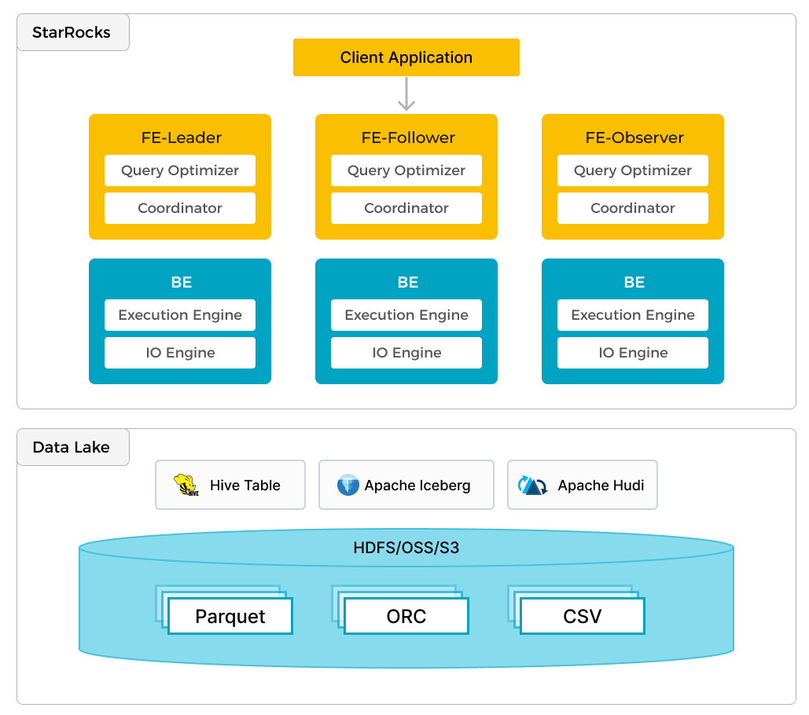

StarRocks 不仅能高效的分析本地存储的数据，也可以作为计算引擎直接分析数据湖中的数据。用户可以通过 StarRocks 提供的 External Catalog，轻松查询存储在 Apache Hive、Apache Iceberg、Apache Hudi、Delta Lake 等数据湖上的数据，无需进行数据迁移。支持的存储系统包括 HDFS、S3、OSS，支持的文件格式包括 Parquet、ORC、CSV。

如上图所示，在数据湖分析场景中，StarRocks 主要负责数据的计算分析，而数据湖则主要负责数据的存储、组织和维护。使用数据湖的优势在于可以使用开放的存储格式和灵活多变的 schema 定义方式，可以让 BI/AI/Adhoc/报表等业务有统一的 single source of truth。而 StarRocks 作为数据湖的计算引擎，可以充分发挥向量化引擎和 CBO 的优势，大大提升了数据湖分析的性能。
