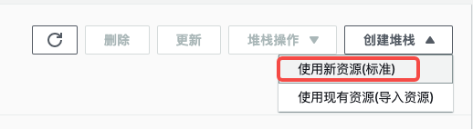
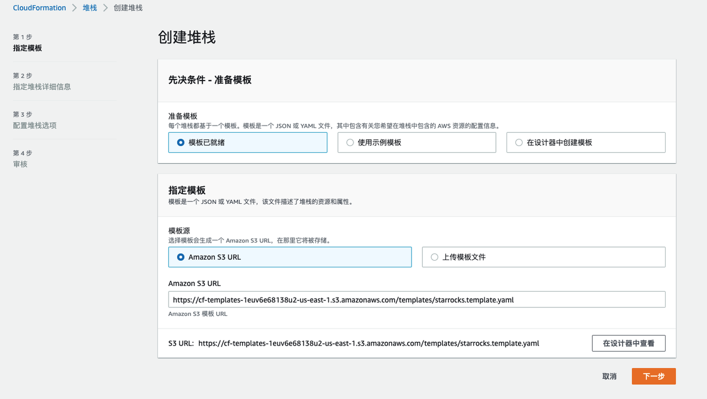
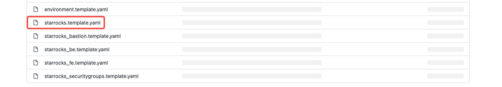
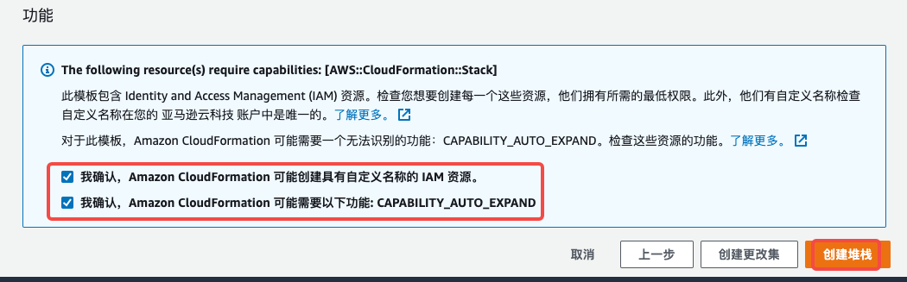

# 在 AWS 上使用 AWS CloudFormation 部署 StarRocks 集群

StarRocks 支持与 AWS CloudFormation 集成，您可以在 AWS 上使用 AWS CloudFormation 快速部署并使用 StarRocks 集群。

## AWS CloudFormation

AWS CloudFormation 是 AWS 提供的一项服务，支持简单且快速地对 AWS 资源和第三方资源（例如 StarRocks 集群）进行建模和配置，帮助您减少资源管理的时间成本，而花更多的时间在使用这些资源。您需要创建一个描述您所需的资源的模板，而 AWS CloudFormation 将负责为您配置这些资源。更多介绍，请参见[什么是 AWS CloudFormation](https://docs.aws.amazon.com/zh_tw/AWSCloudFormation/latest/UserGuide/Welcome.html)。

## 基本概念

### 模版

模板 (Template) 是 JSON 或 YAML 格式的文本文件，描述了 AWS 资源和第三方资源、以及这些资源的属性。更多介绍，请参见[模板](https://docs.aws.amazon.com/zh_cn/AWSCloudFormation/latest/UserGuide/cfn-whatis-concepts.html#w2aab5c15b7)。

### 堆栈

堆栈 (Stack) 用于创建和管理模板中描述的资源。您可通过创建、更新和删除堆栈来创建、更新和删除一组资源。堆栈中的所有资源均由堆栈的模板定义。假设您创建了一个模板，描述了各种资源。要创建这些资源，您可通过提交模板来创建堆栈，AWS CloudFormation 将会为您配置所有这些资源。更多介绍，请参见[堆栈](https://docs.aws.amazon.com/zh_cn/AWSCloudFormation/latest/UserGuide/cfn-whatis-concepts.html#w2aab5c15b9)。

## 操作步骤

1. 登录 [AWS CloudFormation 控制台](https://console.aws.amazon.com/cloudformation/)。

2. 选择**创建堆栈** > **使用新资源(标准)。**  
   
3. 按照如下步骤，指定模板。
   
   1. 在**先决条件-准备模版**部分，选择**模板已就绪。**
   2. 在**指定模版**部分，选择**模版源**为**Amazon S3 URL**。并在 **Amazon S3 URL** 中输入如下网址：
      `https://cf-templates-1euv6e68138u2-us-east-1.s3.amazonaws.com/templates/starrocks.template.yaml`
      > 说明：您也可以选择**模版源**为**上传模版文件**，然后单击**选择文件**，上传 **starrocks.template.yaml** 文件。文件下载地址，请参见 StarRocks 项目中 [aws-cloudformation 仓库](https://github.com/StarRocks/aws-cloudformation)。

   3. 单击**下一步**。

4. 指定堆栈详细信息，包括**堆栈名称**和**参数**，并单击**下一步**。
   1. 在**堆栈名称**框中输入堆栈名称。
      堆栈名称是帮助您从堆栈列表中查找特定堆栈的标识符。堆栈名称只能包含字母（区分大小写）、数字和连字符，长度不能超过 128 个字符，并且必须以字母开头。

   2. 参考如下信息，填写参数：

      | 类型               | 参数                                                         | 说明                                                         |
      | ------------------ | ------------------------------------------------------------ | ------------------------------------------------------------ |
      | 网络配置           | Availability Zones                                           | 选择一个可用区，用于部署 StarRocks 集群。更多说明，请参见[可用区](https://docs.aws.amazon.com/zh_cn/AWSEC2/latest/UserGuide/using-regions-availability-zones.html)。 |
      | EC2 配置           | Key pair name                                                | 密钥对，是由公有密钥和私有密钥组成的一组安全凭证，在连接到 Amazon EC2 实例时用来证明您的身份。更多说明，请参见[密钥对](https://docs.aws.amazon.com/zh_cn/AWSEC2/latest/UserGuide/ec2-key-pairs.html)。说明：如果未创建密钥对，请参考[创建密钥对](https://docs.aws.amazon.com/zh_cn/AWSEC2/latest/UserGuide/create-key-pairs.html)进行创建。 |
      | 环境配置           | Reference the latest Amazon Linux AMI in a CloudFormation template | 最新版本的 Amazon Machine Images (AMI) ID，架构为64 位 (`x86_64`) ，用于启动 Amazon EC2 实例。默认为 StarRocks 的共享 AMI  ID。说明：AMI 是由 AWS 提供的支持和维护映像，提供启动实例的信息。更多说明，请参见[Amazon Machine Images](https://docs.aws.amazon.com/zh_cn/AWSEC2/latest/UserGuide/AMIs.html)。 |
      |                    | URL of download JDK 1.8                                      | JDK 1.8 的下载地址。                                         |
      |                    | URL of StarRocks                                             | StarRocks 二进制包的下载地址。                               |
      | StarRocks 集群配置 | Number of StarRocks Fe                                       | FE 节点数量，默认为 **1**，取值范围为 **1** 或 **3**。       |
      |                    | Fe instance type                                             | FE 节点所属 Amazon EC2 的实例类型，默认为 **t2.micro**。实例类型的更多说明，请参见 [Amazon EC2 实例类型](https://aws.amazon.com/cn/ec2/instance-types/)。 |
      |                    | Number of StarRocks Be                                       | BE 节点数量，默认为 **3**，取值范围为 **3**～**6**。         |
      |                    | Be instance type                                             | BE 节点所属 Amazon EC2 的实例类型，默认为 **t2.micro**。实例类型的更多说明，请参见 [Amazon EC2 实例类型](https://aws.amazon.com/cn/ec2/instance-types/)。 |
      | FE 配置项          | Dir to save fe log                                           | FE 日志存储路径，必须为绝对路径。                            |
      |                    | Sys Log Level                                                | FE 日志级别，默认值为 **INFO**，取值为 **INFO**、**WARN**、 **ERROR**、**FATAL**。 |
      |                    | Meta data dir                                                | FE 元数据存储路径，且必须为绝对路径。默认为 **feDefaultMetaPath**，表示使用默认路径 **/home/starrocks/StarRocks/fe/meta**。 |
      | BE 配置项          | Dir to save be sys log                                       | BE 日志的存储路径，必须填写绝对路径。                        |
      |                    | Sys Log Level                                                | BE 日志级别，默认值为 **INFO**，取值为 **INFO**、**WARN**、 **ERROR**、**FATAL**。 |
      |                    | Volume type of Be nodes                                      | Amazon EBS 卷类型。Amazon EBS 卷（简称 EBS 卷）是块存储卷，挂载至Amazon EC2 实例上。更多介绍和类型说明，请参见[Amazon EBS 卷](https://docs.aws.amazon.com/zh_cn/AWSEC2/latest/UserGuide/ebs-volumes.html)。 |
      |                    | Volume size of Be nodes                                      | EBS 卷中可用于 BE 节点存储数据的容量，单位为 GB。            |

5. 设置堆栈更多选项。更多说明，请参见[设置 AWS CloudFormation 堆栈选项](https://docs.aws.amazon.com/zh_cn/AWSCloudFormation/latest/UserGuide/cfn-console-add-tags.html)。

    设置完成后，单击**下一步**。

6. 审核前面设置的堆栈信息，包括模板、详细信息、更多选项。并且，评估堆栈成本。更多说明，请参见[审查堆栈信息并评估堆栈成本](https://docs.aws.amazon.com/zh_cn/AWSCloudFormation/latest/UserGuide/cfn-using-console-create-stack-review.html)。

   > 说明：如果需要修改堆栈信息，请单击对应部分右上角的**编辑**，以返回相关页面。

7. 勾选如下两个复选框，并单击**创建堆栈**。

