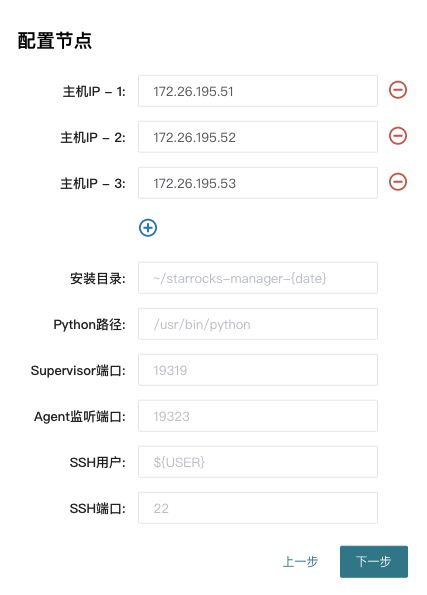
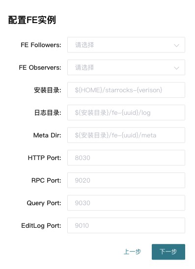
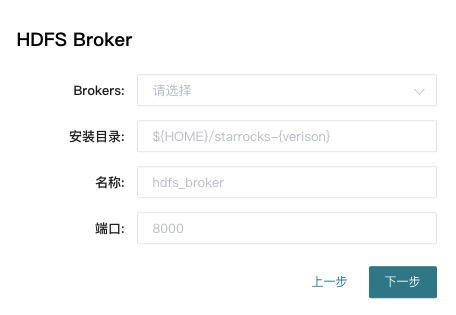

# 集群部署

StarRocks的集群部署分为两种模式，第一种是使用命令部署，第二种是使用 StarRocksManager 自动化部署。自动部署的版本只需要在页面上简单进行配置、选择、输入后批量完成，并且包含Supervisor进程管理、滚动升级、备份、回滚等功能。命令部署的方式适用于希望和自有运维系统打通的用户，有助于管理员理解StarRocks的内部运行机制，直接定位处理一些更复杂的问题。

>StarRocksManager 为企业版功能，需要试用的用户可以到 [StarRocks官网](https://www.starrocks.com/zh-CN/download) 咨询（网页最下面，点击「现在咨询」StarRocks企业版）。

<br/>

## 手动部署

手动部署参考 [StarRocks手动部署](../quick_start/Deploy.md)。

### FE高可用部署

FE的高可用集群采用主从复制架构, 可避免FE单点故障. FE采用了类raft的bdbje协议完成选主, 日志复制和故障切换. 在FE集群中, 多实例分为两种角色: follower和observer; 前者为复制协议的可投票成员, 参与选主和提交日志, 一般数量为奇数(2n+1), 使用多数派(n+1)确认, 可容忍少数派(n)故障; 而后者属于非投票成员, 用于异步订阅复制日志, observer的状态落后于follower, 类似其他复制协议中的learner角色。
<br/>

FE集群从follower中自动选出master节点, 所有更改状态操作都由master节点执行, 从FE的master节点可以读到最新的状态. 更改操作可以从非master节点发起, 继而转发给master节点执行,  非master节点记录最近一次更改操作在复制日志中的LSN, 读操作可以直接在非master节点上执行, 但需要等待非master节点的状态已经同步到最近一次更改操作的LSN, 因此读写非Master节点满足顺序一致性. Observer节点能够增加FE集群的读负载能力, 时效性要求放宽的非紧要用户可以读observer节点。
<br/>

注意：FE节点之间的时钟相差**不能超过5s**, 使用NTP协议校准时间。

一台机器上只可以部署单个FE节点。所有FE节点的http\_port需要相同。
<br/>

集群部署按照下列步骤逐个增加FE实例。

第一步: 分发二进制和配置文件, 配置文件和单实例情形相同。
<br/>

第二步: 使用MySQL客户端连接已有的FE,  添加新实例的信息，信息包括角色、ip、port：

```sql
mysql> ALTER SYSTEM ADD FOLLOWER "host:port";
```

或

```sql
mysql> ALTER SYSTEM ADD OBSERVER "host:port";
```

host为机器的IP，如果机器存在多个IP，需要选取priority\_networks里的IP，例如priority\_networks=192.168.1.0/24 可以设置使用192.168.1.x 这个子网进行通信。port为edit\_log\_port，默认为9010。

> StarRocks的FE和BE因为安全考虑都只会监听一个IP来进行通信，如果一台机器有多块网卡，可能StarRocks无法自动找到正确的IP，例如 ifconfig 命令能看到  eth0 ip为 192.168.1.1, docker0:  172.17.0.1 ，我们可以设置 192.168.1.0/24 这一个子网来指定使用eth0作为通信的IP，这里采用是[CIDR](https://en.wikipedia.org/wiki/Classless_Inter-Domain_Routing)的表示方法来指定IP所在子网范围，这样可以在所有的BE，FE上使用相同的配置。
> priority\_networks 是 FE 和 BE 相同的配置项，写在 fe.conf 和 be.conf 中。该配置项用于在 FE 或 BE 启动时，告诉进程应该绑定哪个IP。示例如下：
> `priority_networks=10.1.3.0/24`

如出现错误，需要删除FE，应用下列命令：

```sql
alter system drop follower "fe_host:edit_log_port";
alter system drop observer "fe_host:edit_log_port";
```

具体参考[扩容缩容](../administration/Scale_up_down.md)。
<br/>

第三步: FE节点之间需要两两互联才能完成复制协议选主, 投票，日志提交和复制等功能。 添加到已有集群的新FE节点**首次**启动时，需要指定现有集群中的一个节点作为helper节点, 从该节点获得集群的所有FE节点的配置信息，才能建立通信连接，因此首次启动需要指定--helper参数：

```shell
./bin/start_fe.sh --helper host:port --daemon
```

host为helper节点的IP，如果有多个IP，需要选取priority\_networks里的IP。port为edit\_log\_port，默认为9010。

当FE再次启动时，无须指定--helper参数，因为FE已经将其他FE的配置信息存储于本地目录, 因此可直接启动：

```shell
./bin/start_fe.sh --daemon
```

<br/>

第四步: 查看集群状态, 确认部署成功：

```Plain Text
mysql> SHOW PROC '/frontends'\G

********************* 1. row **********************
    Name: 172.26.108.172_9010_1584965098874
      IP: 172.26.108.172
HostName: starrocks-sandbox01
......
    Role: FOLLOWER
IsMaster: true
......
   Alive: true
......
********************* 2. row **********************
    Name: 172.26.108.174_9010_1584965098874
      IP: 172.26.108.174
HostName: starrocks-sandbox02
......
    Role: FOLLOWER
IsMaster: false
......
   Alive: true
......
********************* 3. row **********************
    Name: 172.26.108.175_9010_1584965098874
      IP: 172.26.108.175
HostName: starrocks-sandbox03
......
    Role: FOLLOWER
IsMaster: false
......
   Alive: true
......
3 rows in set (0.05 sec)
```

节点的Alive显示为true则说明添加节点成功。以上例子中，

172.26.108.172\_9010\_1584965098874 为主FE节点。

<br/>

## StarRocksManager部署

### 安装依赖

在所有需要部署StarRocks的节点上安装以下依赖:

* JDK (1.8 以上)  并且配置好JAVA_HOME (比如 `~/.bashrc` 中增加 `export` ).
* python (2.7 以上)
* python-setuptools (`yum install setuptools or apt-get install setuptools`)

另外StarRocksManager本身需要连接一个MySQL来存储Manager管理平台的数据。

### 安装StarRocksManager部署工具

解压以后

```shell
$ bin/install.sh -h
-[d install_path] install_path(default: /home/disk1/starrocks/starrocks-manager-20200101)
-[y python_bin_path] python_bin_path(default: /usr/bin/python)
-[p admin_console_port] admin_console_port(default: 19321)
-[s supervisor_http_port] supervisor_http_port(default: 19320)
$ bin/install.sh
```

该步骤会安装一个简单的web页面来帮助安装StarRocks数据库

### 安装部署StarRocks

* 首先需要配置一个安装好的MySQL数据库，此MySQL用于存储StarRocksManager的管理、查询、报警等信息


* 选择需要部署的节点，以及agent和supervisor的安装目录，agent负责采集机器的统计信息，Supervisor管理进程的启动停止，所有安装都在用户环境，不会影响系统环境。



* **安装FE**： `meta dir`是StarRocks的元数据目录，和命令安装类似，建议配置一个独立的starrocks-meta和fe的log 目录，FE follower建议配置1或者3个，在请求压力比较大的情况可以酌情增加observer



* **安装BE**： 端口的含义参考下面[端口列表](#端口列表)


* **安装Broker**，建议在所有节点上都安装Broker



* **安装Center service**： center service负责从agent拉取信息后汇总存储在MySQL中，并提供监控报警的服务。这里的邮件服务用来配置接收报警通知的邮箱，可以填空，以后再进行配置。


### 端口列表

|实例名称|端口名称|默认端口|通讯方向|说明|
|---|---|---|---|---|
|BE|be_port|9060|FE&nbsp;&nbsp; --> BE|BE 上 thrift server 的端口，<br/>用于接收来自 FE 的请求|
|BE|webserver_port|8040|BE `<-->` BE|BE 上的 http server 的端口|
|BE|heartbeat_service_port|9050|FE&nbsp;&nbsp; --> BE|BE 上心跳服务端口（thrift），<br/>用于接收来自 FE 的心跳|
|BE|brpc_port|8060|FE `<-->` BE<br/>BE `<-->` BE|BE 上的 brpc 端口，<br/>用于 BE 之间通讯|
|FE|**http_port**|**8030**|FE `<-->` 用户|FE 上的 http server 端口|
|FE|rpc_port|9020|BE&nbsp;&nbsp; --> FE<br/> FE `<-->` FE|FE 上的 thrift server 端口|
|FE|**query_port**|**9030**| FE `<-->` 用户|FE 上的 mysql server 端口|
|FE|edit_log_port|9010|FE `<-->` FE|FE 上的 bdbje 之间通信端口|
|Broker|broker_ipc_port|8000|FE&nbsp;&nbsp; --> Broker <br/>BE&nbsp;&nbsp; --> Broker|Broker 上的 thrift server，<br/>用于接收请求|

其中 http_port(8030)、query_port(9030) 是常用端口，前者用于网页访问 FE，后者用于 MySQL 客户端访问。

### FAQ

Q：如何设置 `ulimit`？
A：您可以通过在**所有机器**上运行 `ulimit -n 65536` 命令设置。如果系统提示您“没有权限”，请尝试以下方案：

首先，请在 **/etc/security/limits.conf** 添加如下配置：

```Plain Text
# 4个元素，具体可以参考 limits.conf 中的说明，*代表所有用户。
* soft nofile 65535
* hard nofile 65535
```

然后，请在 **/etc/pam.d/login** 和 **/etc/pam.d/sshd** 中添加如下配置：

```Plain Text
session  required  pam_limits.so
```

最后，请确认 **/etc/ssh/sshd_config** 中存在 **UsePAM yes**。如果没有，请添加该参数，并运行 `restart sshd`。

Q：安装 Python 时遇到问题 `__init__() takes 2 arguments (4 given)`，如何处理？
A：如果在安装 Python 时遇到问题 `__init__() takes 2 arguments (4 given)`，请执行如下步骤：

首先，请运行 `which python` 命令确认 Python 安装路径为 **/usr/bin/python**。
然后，请删除 python-setuptools 安装包：

```shell
yum remove python-setuptools
```

接下来，请删除 setuptool 相关文件。

```shell
rm /usr/lib/python2.7/site-packages/setuptool* -rf
```

最后，您需要获取 **ez_setup.py** 文件。

```shell
wget https://bootstrap.pypa.io/ez_setup.py -O - | python
```
