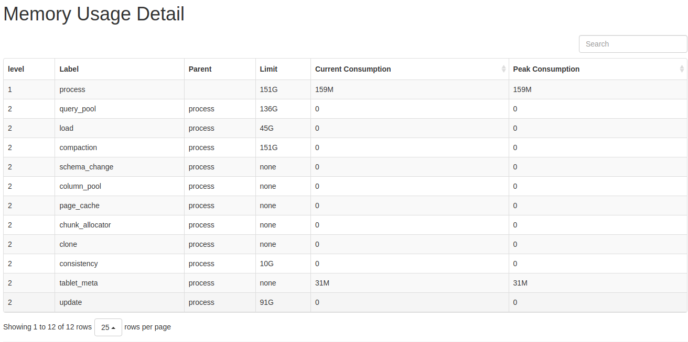

# 管理内存

本文介绍如何管理并调优内存资源。

## 查看内存使用

您可以通过以下方法查看分析 BE 内存使用。

* **通过浏览器或 curl 命令访问 Metrics 接口分析内存使用。**

Metrics 统计每 10 秒更新一次。

```bash
curl -XGET -s http://be_ip:8040/metrics | grep "^starrocks_be_.*_mem_bytes\|^starrocks_be_tcmalloc_bytes_in_use" 
```

> 说明：
>
> * 将以上 `be_ip` 改为 BE 节点实际的 IP 地址。
> * BE `webserver_port` 默认为 `8040`。

对应指标的含义参考 [内存分类](#内存分类)。

* **通过浏览器或 curl 命令访问 mem_tracker 接口分析 BE 内存使用。**

```bash
http://be_ip:8040/mem_tracker
```

> 说明：
>
> * 将以上 `be_ip` 改为 BE 节点实际的 IP 地址。
> * BE `webserver_port` 默认为 `8040`。



指标说明：

* `level`: MemTracker 为树型结构，第一级为 BE 使用总内存，第二级为分类内存使用。
* `Label`: 标识内存分类，对应指标的含义参考 [内存分类](#内存分类)。
* `Parent`: 父结点 Label。
* `Limit`: 内存使用限制，`-1` 表示没有限制。
* `Current Consumption`: 当前内存使用。
* `Peak Consumption`: 峰值内存使用。

* **通过浏览器或 curl 命令访问 TCmalloc 接口分析 BE 内存使用。**

```bash
http://be_ip:8040/memz
```

> 说明：
>
> * 将以上 `be_ip` 改为 BE 节点实际的 IP 地址。
> * BE `webserver_port` 默认为 `8040`。

示例：

```plain text
------------------------------------------------
MALLOC:      777276768 (  741.3 MiB) Bytes in use by application
MALLOC: +   8851890176 ( 8441.8 MiB) Bytes in page heap freelist
MALLOC: +    143722232 (  137.1 MiB) Bytes in central cache freelist
MALLOC: +     21869824 (   20.9 MiB) Bytes in transfer cache freelist
MALLOC: +    832509608 (  793.9 MiB) Bytes in thread cache freelists
MALLOC: +     58195968 (   55.5 MiB) Bytes in malloc metadata
MALLOC:   ------------
MALLOC: =  10685464576 (10190.5 MiB) Actual memory used (physical + swap)
MALLOC: +  25231564800 (24062.7 MiB) Bytes released to OS (aka unmapped)
MALLOC:   ------------
MALLOC: =  35917029376 (34253.1 MiB) Virtual address space used
MALLOC:
MALLOC:         112388              Spans in use
MALLOC:            335              Thread heaps in use
MALLOC:           8192              Tcmalloc page size
------------------------------------------------
Call ReleaseFreeMemory() to release freelist memory to the OS (via madvise()).
Bytes released to the OS take up virtual address space but no physical memory.
```

指标说明：

* `Bytes in use by application`: BE 实际使用的内存。
* `Bytes in page heap freelist`: BE 已不再使用，但是尚未归还给操作系统的内存。
* `Actual memory used`: 操作系统监测到 BE 实际内存使用（BE 会预留一些空闲内存，不还给操作系统或是缓慢返还给操作系统）。
* `Bytes released to OS`: BE 已设置为可回收状态，但是操作系统尚未回收的内存。

## 内存分类

StarRocks BE 中的内存分为以下几类。

| 标识 | Metric 名称 | 说明 | BE 相关配置 |
| --- | --- | --- | --- |
| process | starrocks_be_process_mem_bytes | BE 进程实际使用的内存（不包含预留的空闲内存）。| mem_limit |
| query_pool | starrocks_be_query_mem_bytes | BE 查询层使用总内存。 | |
| load | starrocks_be_load_mem_bytes | 导入使用的总内存。 | load_process_max_memory_limit_bytes, load_process_max_memory_limit_percent |
| table_meta | starrocks_be_tablet_meta_mem_bytes | 元数据总内存。 | |
| compaction | starrocks_be_compaction_mem_bytes | 版本合并总内存。 | compaction_max_memory_limit, compaction_max_memory_limit_percent |
| column_pool | starrocks_be_column_pool_mem_bytes | column pool 内存池，用于加速存储层数据读取的 Column Cache。 | |
| page_cache | starrocks_be_storage_page_cache_mem_bytes | BE 存储层 page 缓存。 | disable_storage_page_cache, storage_page_cache_limit |
| chunk_allocator | starrocks_be_chunk_allocator_mem_bytes | CPU per core 缓存，用于加速小块内存申请的 Cache。 | chunk_reserved_bytes_limit |
| consistency | starrocks_be_consistency_mem_bytes | 定期一致性校验使用的内存。 | consistency_max_memory_limit_percent, consistency_max_memory_limit |
| schema_change | starrocks_be_schema_change_mem_bytes | Schema Change 任务使用的总内存。 | memory_limitation_per_thread_for_schema_change |
| clone | starrocks_be_clone_mem_bytes | Tablet Clone 任务使用的总内存。 | |
| update | starrocks_be_update_mem_bytes | 主键模型使用的总内存。 | |

## 内存相关配置项

### BE 配置项

| 名称 | 默认值 | 说明|  
| --- | --- | --- |
| mem_limit | 90% | BE 进程内存上限。可设为比例上限（如 "80%"）或物理上限（如 "100G"）。默认硬上限为 BE 所在机器内存的 90%，软上限为 BE 所在机器内存的 80%。如果 BE 为独立部署，则无需配置，如果 BE 与其它占用内存较多的服务混合部署，则需要合理配置。|
| load_process_max_memory_limit_bytes | 107374182400 | 单节点上所有的导入线程占据的内存上限，取 mem_limit * load_process_max_memory_limit_percent / 100 和 load_process_max_memory_limit_bytes 中较小的值。如导入内存到达限制，则会触发刷盘和反压逻辑。|
| load_process_max_memory_limit_percent | 30 | 单节点上所有的导入线程占据的内存上限比例，取 mem_limit * load_process_max_memory_limit_percent / 100 和 load_process_max_memory_limit_bytes 中较小的值，导入内存到达限制，会触发刷盘和反压逻辑。|
<<<<<<< HEAD
| compaction_max_memory_limit | -1 | Compaction 内存上限，取 mem_limit * compaction_max_memory_limit_percent / 100 和 compaction_max_memory_limit 中较小的值，-1 表示没有限制。当前不建议修改默认配置。Compaction 内存到达限制，会导致 Compaction 任务失败。|
| compaction_max_memory_limit_percent | 100 | Compaction 内存百分比上限，取 mem_limit * compaction_max_memory_limit_percent / 100 和 compaction_max_memory_limit 中较小的值，-1 表示没有限制。当前不建议修改默认配置。Compaction 内存到达限制，会导致 Compaction 任务失败。|
| disable_storage_page_cache | false | 是否开启 PageCache。开启 PageCache 后，StarRocks 会缓存最近扫描过的数据，对于查询重复性高的场景，会大幅提升查询效率。`true` 表示不开启。该配置项与 storage_page_cache_limit 配合使用，在内存资源充足和有大数据量 Scan 的场景中启用能够加速查询性能。自 2.4 版本起，该参数默认值由 `TRUE` 变更为 `FALSE`。 |
=======
| compaction_max_memory_limit | -1 | 所有 Compaction 线程的最大内存使用量，取 mem_limit * compaction_max_memory_limit_percent/100 和 compaction_max_memory_limit 中较小的值，-1 表示没有限制。当前不建议修改默认配置。Compaction 内存到达限制，会导致 Compaction 任务失败。|
| compaction_max_memory_limit_percent | 100 | 所有 Compaction 线程的最大内存使用百分比，取 mem_limit * compaction_max_memory_limit_percent / 100 和 compaction_max_memory_limit 中较小的值，-1 表示没有限制。当前不建议修改默认配置。Compaction 内存到达限制，会导致 Compaction 任务失败。|
| disable_storage_page_cache | false | 是否开启 PageCache。开启 PageCache 后，StarRocks 会缓存最近扫描过的数据，对于查询重复性高的场景，会大幅提升查询效率。`true` 表示不开启。该配置项与 storage_page_cache_limit 配合使用，在内存资源充足和有大数据量 Scan 的场景中启用能够加速查询性能。自 2.4 版本起，该参数默认值由 `TRUE` 变更为 `FALSE`。 自 3.1 版本开始，该参数由静态变为动态。|
>>>>>>> d89fedd61f ([Doc] Add compaction parameter description (#39284))
| storage_page_cache_limit | 20% | BE 存储层 page 缓存可以使用的内存上限。|
| chunk_reserved_bytes_limit | 2147483648 | 用于加速小块内存分配的 Cache，默认上限为 2GB。您可以在内存资源充足的情况下打开。|
| consistency_max_memory_limit_percent | 20 | 一致性校验任务使用的内存上限，取 mem_limit * consistency_max_memory_limit_percent / 100 和 consistency_max_memory_limit 中较小的值。内存使用超限，会导致一致性校验任务失败。 |
| consistency_max_memory_limit | 10G | 一致性校验任务使用的内存上限，取 mem_limit * consistency_max_memory_limit_percent / 100 和 consistency_max_memory_limit 中较小的值。内存使用超限，会导致一致性校验任务失败。 |
| memory_limitation_per_thread_for_schema_change | 2 | 单个 Schema Change 任务的内存使用上限，内存使用超限，会导致 Schema Change 任务失败。|
| max_compaction_concurrency | -1 | Compaction 线程数上限（即 BaseCompaction + CumulativeCompaction 的最大并发）。该参数防止 Compaction 占用过多内存。 -1 代表没有限制。0 表示不允许 compaction。|

### Session 变量

| 名称| 默认值| 说明|
|  --- |  --- | --- |
| exec_mem_limit| 2147483648| 单个 Instance 的内存限制，单位是 Byte。一个查询可以使用的内存为 Instance 数量 * exec_mem_limit。只有在配置项 query_mem_limit 为 0 时，该配置项生效。 |
| load_mem_limit| 0| 单个导入任务的内存限制，单位是 Byte。如果此配置项被设置为 0，那么系统会使用 exec_mem_limit 来限制内存。 |
| query_mem_limit | 0 | 单个查询的内存限制，单位是 Byte。如果此配置项被设置为 0，那么系统会使用 exec_mem_limit 来限制内存。建议设置为 17179869184（16GB）以上。 |
