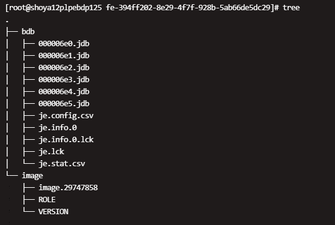
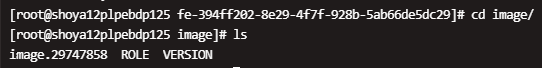
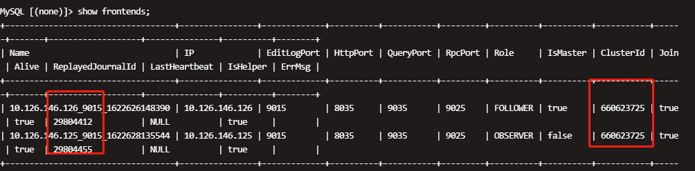

# 元数据恢复（此方法并不能根本解决问题，只是为了尽快恢复集群才需要如此操作，请联系官方人员协助）

FE 有可能因为某些原因出现无法启动 bdbje、FE 之间无法同步等问题。故障表现包括无法进行元数据写操作、没有 MASTER 等等，需要手动恢复 FE。

`注：元数据操作需要谨慎，错误的操作可能导致集群数据的不可逆丢失，因此普通的fe无法启动尽量去排查启动问题，非整个集群不可用，bdbje无法选主的情况，不要参考此文档操作。`

## 恢复原理

手动恢复 FE 的大致原理，是先通过当前 meta_dir 中的元数据，启动一个新的 MASTER，然后再逐台添加其他 FE。

## 恢复示例

请严格按照如下步骤操作：

1. 停止所有 FE 进程，同时停止一切业务访问。保证在元数据恢复期间，不会因为外部访问导致其他不可预期的问题。
2. 寻找元数据最新的FE节点

    * 先备份所有FE的meta_dir目录
    * 如果meta文件夹不在默认位置，路径可在`xxx/fe/conf/fe.conf`中找到,示例如下

    ```shell
        meta_dir = /home/disk1/sr/StarRocks-1.19.0/fe-3365df09-14bc-44a5-aabc-ccfaa5824d52/meta
    ```

    * meta_dir文件夹结构如下：

    

    * 通常情况下，Master FE 的元数据是最新的
    * 确保元数据最新，可以切换到fe安装目录下，执行以下操作，获取lastVLSN，数字越大则该节点元数据越新

    ```shell
        java -jar lib/je-7.3.7.jar DbPrintLog -h meta/bdb/ -vd 
    ```

    lastVLSN获取如下所示：

    

    * 比较各个fe节点上述操作获取的lastVLSN值大小，该值最大的节点为元数据最新的节点

3. 确认恢复节点角色

    * 进入image目录查看role文件，路径示例为`/xxx/StarRocks-xxx/fe-xxx/meta/image`

    

    * 之后，我们要使用这个拥有最新元数据的 FE 节点，进行恢复，建议尽量选择 FOLLOWER 节点恢复。

    `注:如果恢复的节点的role为 FOLLOWER 则参考第四部分内容，如果恢复的节点的role为 OBSERVER 则参考第五部分内容`

4. 以下操作在选出来的元数据最新的FE节点执行(恢复节点角色为 FOLLOWER )：

    * 在 fe.conf 中添加配置：`metadata_failure_recovery=true`。

    `metadata_failure_recovery=true` 的含义是，清空 BDBJE 中其他 FE 的元数据，只保留待恢复的 FE 的元数据。这样该 FE 就不会再联系其他的 FE，而作为一个独立的 FE 启动。这个参数只有在恢复启动时才需要设置为 true。恢复完成后，一定要设置为 false(后面有步骤说明)，否则一旦重启，bdbje 的元数据又会被清空，导致其他 FE 无法正常工作。
    * 执行`sh bin/start_fe.sh --daemon` 启动该FE，如果正常，这个 FE 会以 MASTER 的角色启动，在 fe.log 中会看到 `transfer from XXXX to MASTER` 等字样。
    * 启动完成后，先连接到这个 FE，执行一些查询导入，检查是否能够正常访问。如果不正常，有可能是操作有误，查看FE启动日志，排查问题后重新启动FE。
    * 如果成功，通过 `show frontends;` 命令，应该可以看到之前集群所添加的所有 FE，并且当前 FE 是 master。
    * 将 fe.conf 中的 `metadata_failure_recovery=true` 配置项删除，或者设置为 false，然后重启这个 FE(重要)。
    * 跳转至第六步骤继续执行恢复操作。

5. 以下操作在选出来的元数据最新的FE节点执行(恢复节点角色为 OBSERVER )：

    * 如果该节点是一个 OBSERVER，先将 meta_dir/image/ROLE 文件中的 `role=OBSERVER` 改为 `role=FOLLOWER`。
    * 在 fe.conf 中添加配置：`metadata_failure_recovery=true`。

    `metadata_failure_recovery=true` 的含义是，清空 BDBJE 中其他 FE 的元数据，只保留待恢复的 FE 的元数据。这样该 FE 就不会再联系其他的 FE，而作为一个独立的 FE 启动。这个参数只有在恢复启动时才需要设置为 true。恢复完成后，一定要设置为 false(后面有步骤说明)，否则一旦重启，bdbje 的元数据又会被清空，导致其他 FE 无法正常工作。
    * 执行`sh bin/start_fe.sh --daemon` 启动该FE，如果正常，这个 FE 会以 MASTER 的角色启动，在 fe.log 中会看到 `transfer from XXXX to MASTER` 等字样。
    * 启动完成后，先连接到这个 FE，执行一些查询导入，检查是否能够正常访问。如果不正常，有可能是操作有误，查看FE启动日志，排查问题后重新启动FE。
    * 如果成功，通过 `show frontends;` 命令，应该可以看到之前集群所添加的所有 FE，并且当前 FE 是 master。
    * 由于是用一个 OBSERVER 节点的元数据进行恢复的，导致完成上述步骤后，`show frontends;` 会发现，当前这个 FE 的角色为 OBSERVER，但是 IsMaster 显示为 true。这是因为，这里看到的 “OBSERVER” 是记录在 StarRocks 的元数据中的，而是否是 master，是记录在 bdbje 的元数据中的。我们是从一个 OBSERVER 节点恢复的，所以这里出现了不一致。这种内部不一致的状态，不能支持后续的导入等修改操作，所以，还需要继续按以下步骤修复：
    * 先把这个 “OBSERVER” conf中的`metadata_failure_recovery=true`注释掉，但不要重启该节点，以防止这个节点再加入集群的时候报错。
    * 把除了这个 “OBSERVER” 以外的所有 FE 节点 DROP 掉。
    * 通过 `ADD FOLLOWER` 命令，添加一个新的 FOLLOWER FE，假设在 hostA 上。
    * 在 hostA 上启动一个全新的 FE，通过 --helper 的方式加入集群。
    * 启动成功后，通过 `show frontends;` 语句，你应该能看到两个 FE，一个是之前的 OBSERVER，一个是新添加的 FOLLOWER，并且 OBSERVER 是 master。
    * 确认新的 FOLLOWER 是否可以正常工作，(观察如图所示的ID是否同步完成即可了解新的 FOLLOWER 是否正常工作)。

    

    * 确认这个新的 FOLLOWER 可以正常工作之后，跳转至第四步骤，用这个新的 FOLLOWER 的元数据，再执行一遍故障恢复操作。 以上这些步骤的目的，其实就是人为地制造出一个 FOLLOWER 节点的元数据，然后用这个元数据，重新开始故障恢复。这样就避免了从 OBSERVER 恢复元数据所遇到的不一致的问题。

6. 上述步骤完成后，我们就得到了一个存活的 FOLLOWER 角色的 MASTER，此时我们再通过 `ALTER SYSTEM DROP FOLLOWER/OBSERVER` 命令，将之前的其他的 FE 从元数据删除后，按加入全新 FE 的方式，即通过--helper启动的方式重新把这些 FE 添加一遍。如果通过--helper添加FE时对应fe启动失败，可以检查当前master节点的/fe/meta/bdb文件夹大小，如果bdb过大(超过fe.conf中jvm设置的一半)，则需要增大fe.conf中的jvm大小后重新启动。

7. 如果以上操作正常，则恢复完毕。
