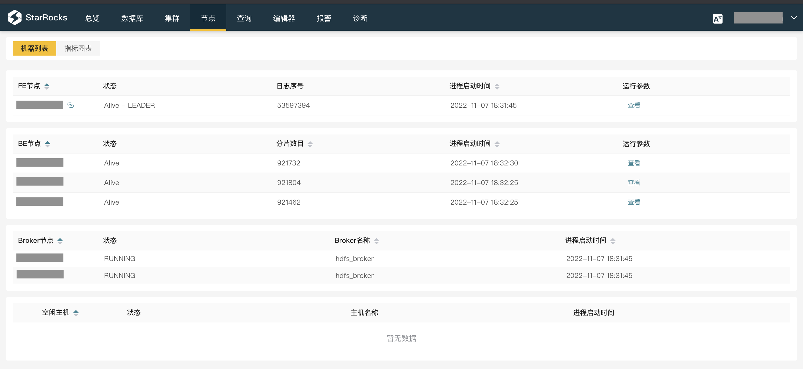
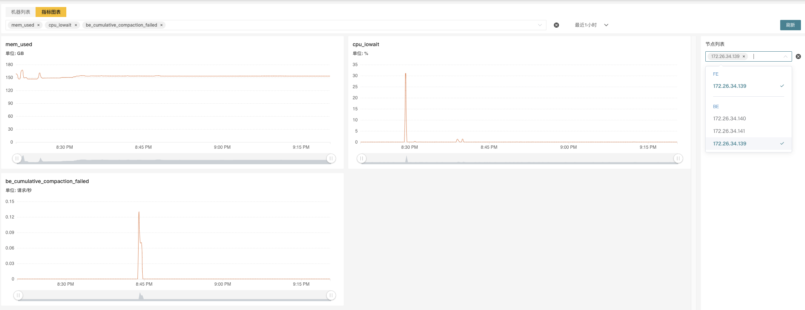
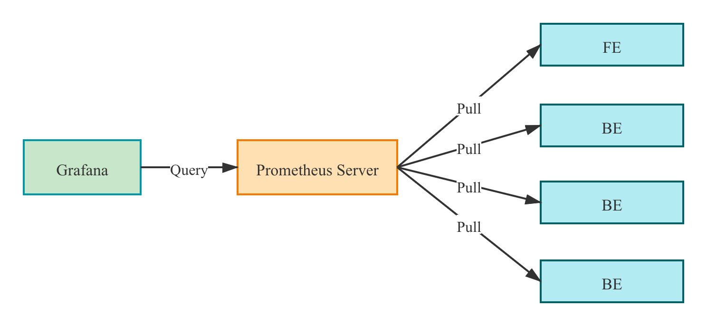
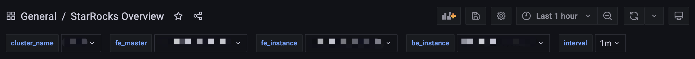

# 监控报警

本文介绍如何为 StarRocks 设置监控报警。

StarRocks 提供两种监控报警的方案。企业版用户可以使用内置的 StarRocksManager，其自带的 Agent 从各个 Host 采集监控信息，上报至 Center Service，然后做可视化展示。StarRocksManager 提供邮件和 Webhook 的方式发送报警通知。如果您有二次开发需求，需要自行搭建部署监控服务，也可以使用开源 Prometheus+Grafana 方案，StarRocks 提供了兼容 Prometheus 的信息采集接口，可以通过直接连接 BE 或 FE 的 HTTP 端口来获取集群的监控信息。

## 使用 StarRocksManager

StarRocksManager 的监控可以分成 **集群** 和 **节点** 两个维度。

您可以在集群页面可以看到下列监控项：

* 集群性能监控
  * CPU 使用率
  * 内存使用
  * 磁盘 I/O 使用率，磁盘使用量、磁盘空闲量
  * 发包带宽、收包带宽，发包数、收包数
* 集群查询监控
  * QPS
  * 平均响应时间
  * 50/75/90/95/99/999 分位响应时间
* 数据导入量监控
  * 发起导入次数
  * 导入行数
  * 导入数据量
* 数据组合并（Compaction）监控
  * 基线合并数据组速率
  * 基线合并数据量
  * 增量合并数据组速率
  * 增量合并数据量

在**节点**页面可以看到所有 BE/FE 的机器列表和状态等基础信息。



点击节点链接可以看到每一个节点的详细监控信息。在右侧的节点列表中选择多个节点同时展示，也可以在上方的下拉框中选择各类指标。



## 使用 Prometheus+Grafana

您可以使用 [Prometheus](https://prometheus.io/) 作为 StarRocks 监控数据存储方案，并使用 [Grafana](https://grafana.com/) 作为可视化组件。

Prometheus 是一个拥有多维度数据模型的、灵活的查询语句的时序数据库。它可以通过 Pull 或 Push 采集被监控系统的监控项，存入自身的时序数据库中。并且通过丰富的多维数据查询语言，满足用户的不同需求。

Grafana 是一个开源的 Metric 分析及可视化系统。支持多种数据源，详情可参考官网文档。通过对应的查询语句，从数据源中获取展现数据。通过灵活可配置的 Dashboard，快速的将这些数据以图表的形式展示给用户。

> 本文档仅提供基于 Prometheus 和 Grafana 实现的一种 StarRocks 可视化监控方案，原则上不维护和开发这些组件。更多详细的介绍和使用，请参考对应的官网文档。

### 监控架构



Prometheus 通过 Pull 方式访问 FE 或 BE 的 Metric 接口，然后将监控数据存入时序数据库。

用户可以通过 Grafana 配置 Prometheus 为数据源，自定义绘制 Dashboard。

### 部署 Prometheus

#### 下载并安装 Prometheus

**1.** 从 [Prometheus 官网](https://prometheus.io/download/)下载最新版本的 Prometheus。

以下示例以 prometheus-2.29.1.linux-amd64 版本为例。

```bash
wget https://github.com/prometheus/prometheus/releases/download/v2.29.1/prometheus-2.29.1.linux-amd64.tar.gz
tar -xf prometheus-2.29.1.linux-amd64.tar.gz
```

#### 配置 Prometheus

在 **prometheus.yml** 中添加 StarRocks 监控相关的配置。

```yml
# my global config
global:
  scrape_interval:     15s # 全局的采集间隔，默认是 1m，这里设置为 15s
  evaluation_interval: 15s # 全局的规则触发间隔，默认是 1m，这里设置 15s


scrape_configs:
  # The job name is added as a label `job=<job_name>` to any timeseries scraped from this config.
  - job_name: 'StarRocks_Cluster01' # 每一个集群称之为一个job，可以自定义名字作为StarRocks集群名
    metrics_path: '/metrics'    # 指定获取监控项目的Restful Api

    static_configs:
      - targets: ['fe_host1:http_port','fe_host3:http_port','fe_host3:http_port']
        labels:
          group: fe # 这里配置了 fe 的 group，该 group 中包含了 3 个 Frontends

      - targets: ['be_host1:be_http_port', 'be_host2:be_http_port', 'be_host3:be_http_port']
        labels:
          group: be # 这里配置了 be 的 group，该 group 中包含了 3 个 Backends
  - job_name: 'StarRocks_Cluster02' # 可以在Prometheus中监控多个StarRocks集群
    metrics_path: '/metrics'

    static_configs:
      - targets: ['fe_host1:http_port','fe_host3:http_port','fe_host3:http_port']
        labels:
          group: fe

      - targets: ['be_host1:be_http_port', 'be_host2:be_http_port', 'be_host3:be_http_port']
        labels:
          group: be
```

#### 启动 Prometheus

通过以下命令启动 Prometheus。

```bash
nohup ./prometheus \
    --config.file="./prometheus.yml" \
    --web.listen-address=":9090" \
    --log.level="info" &
```

该命令将后台运行 Prometheus，并指定其 Web 端口为 `9090`。启动后，即开始采集数据，并将数据存放在 **./data** 目录中。

#### 访问 Prometheus

您可以通过 Web 页面访问 Prometheus。通过浏览器打开 `9090` 端口，即可访问 Prometheus 的页面。依次点击导航栏中 **Status** 和 **Targets**，即可看到所有分组 Job 的监控主机节点。正常情况下，所有节点都应为 UP，表示数据采集正常。如果节点状态不为 UP，您可以访问 StarRocks 的 Metrics 接口（`http://fe_host:fe_http_port/metrics` 或 `http://be_host:be_http_port/metrics`）检查是否可以访问。如果仍无法解决，您可以查询 Prometheus 相关文档寻找解决方案。


至此，一个简单的 Prometheus 已经搭建、配置完毕。更多高级使用方式，请参阅[官方文档](https://prometheus.io/docs/introduction/overview/)

#### 数据接入自有 Prometheus

如果需要将监控数据接入自有的 Prometheus 系统，您可以通过下列接口访问：

* FE: `fe_host:fe_http_port/metrics`
* BE: `be_host:be_web_server_port/metrics`

如果需要 JSON 格式数据，您可以通过下列接口访问：

* FE: `fe_host:fe_http_port/metrics?type=json`
* BE: `be_host:be_web_server_port/metrics?type=json`

### 部署 Grafana

#### 下载并安装 Grafana

从 [Grafana 官网](https://grafana.com/grafana/download) 下载最新版本的 Grafana。

以下示例以 grafana-8.0.6.linux-amd64 版本为例。

```SHELL
wget https://dl.grafana.com/oss/release/grafana-8.0.6.linux-amd64.tar.gz
tar -zxf grafana-8.0.6.linux-amd64.tar.gz
```

#### 配置 Grafana

在 **./conf/defaults.ini** 中添加相关的配置。

```ini
...
[paths]
data = ./data
logs = ./data/log
plugins = ./data/plugins
[server]
http_port = 8000
domain = localhost
...
```

#### 启动 Grafana

通过以下命令启动 Grafana。

```Plain text
nohup ./bin/grafana-server \
    --config="./conf/defaults.ini" &
```

#### 配置 DashBoard

通过先前配置的地址（`http://grafana_host:8000`）登录 Grafana，默认用户名为 `admin`，密码为 `admin`。

**1.** 配置数据源。

依次点击 **Configuration**，**Data sources**，**Add data source**，和 **Prometheus**。

Data Source 配置项简介


* Name: 数据源的名称，自定义，比如 `starrocks_monitor`
* URL: Prometheus 的 web 地址，如 `http://prometheus_host:9090`
* Access: 选择 Server 方式，即通过 Grafana 进程所在服务器，访问 Prometheus。

其他配置项可使用默认设置。

点击最下方 **Save & Test** 保存配置，如果显示 *Data source is working*，即表示数据源可用。

**2.** 添加 Dashboard。

下载  Dashboard 模版。

> 说明：StarRocks 1.19.0 和 2.4.0 版本的监控 Metric Name 有调整，需要下载下面对应版本 DashBoard 模版。

* [StarRocks-1.19.0 之前版本 Dashboard 模版](http://starrocks-thirdparty.oss-cn-zhangjiakou.aliyuncs.com/StarRocks-Overview.json)
* [StarRocks-1.19.0 开始到 StarRocks-2.4.0 之前版本 DashBoard 模版](http://starrocks-thirdparty.oss-cn-zhangjiakou.aliyuncs.com/StarRocks-Overview-19.json)
* [StarRocks-2.4.0 及其之后版本 DashBoard 模版](http://starrocks-thirdparty.oss-cn-zhangjiakou.aliyuncs.com/StarRocks-Overview-24.json)

> 说明：Dashboard 模版会不定期更新。同时我们也欢迎您提供更优的 Dashboard 模板。

确认数据源可用后，点击左边导航栏的 **+** 号以添加 Dashboard。这里我们使用上文下载的 StarRocks 的 Dashboard 模板。依次点击左边的导航栏 **+** 号，**Import**，和 **Upload Json File**，导入 JSON 文件。

导入后，可以命名 Dashboard，默认是 `StarRocks Overview`。同时，需要选择数据源，这里选择之前创建的 `starrocks_monitor`。

点击 **Import** 完成导入。至此，您可以看到 StarRocks 的 Dashboard 展示。

#### 理解 Dashboard

本小节简要介绍 StarRocks Dashboard。

> 注意：Dashboard 的内容可能会随版本升级，不断更新，请参考上文 Dashboard 模版。

* **顶栏**



页面左上角为 Dashboard 名称，右上角显示当前监控时间范围。您可以下拉选择不同的时间范围，还可以指定定时刷新页面间隔。

* cluster_name: 即 Prometheus 配置文件中的各个 `job_name`，代表一个 StarRocks 集群。如果选择不同的 Cluster，下方的图表将展示对应集群的监控信息。
* fe_master: 对应集群的 Leader FE 节点。
* fe_instance: 对应集群的所有 FE 节点。选择不同的 FE，下方的图表将展示对应 FE 的监控信息。
* be_instance: 对应集群的所有 BE 节点。选择不同的 BE，下方的图表将展示对应 BE 的监控信息。
* interval: 部分图表展示了速率相关的监控项，这里可选择以特定间隔进行采样计算速率。

> 注意：建议您不要使用 15s 作为时间间隔，因其可能导致一些图表无法显示。

* **Row**


Grafana 中，Row 代表一组图表的集合。如上图中的 Overview、Cluster Overview 即两个不同的 Row。您可以通过点击当前 Row 以折叠该 Row。

当前 Dashboard 有如下 Row（持续更新中）：

* Overview: 所有 StarRocks 集群的汇总展示。
* Cluster Overview: 选定集群的汇总展示。
* Query Statistic: 选定集群的查询相关监控。
* Jobs: 导入任务相关监控。
* Transaction: 事务相关监控。
* FE JVM: 选定 FE 的 JVM 监控。
* BE: 选定集群 BE 的汇总展示。
* BE Task: 选定集群 BE 的任务信息展示。

* **图表**


一个典型的图表分为以下几部分：

* 鼠标悬停左上角的 **i** 图标，可以查看该图表的说明。
* 点击下方的图例，可以单独查看某一监控项。再次点击，则显示所有。
* 在图表中拖拽可以选定时间范围。
* 标题的 **[]** 中显示选定的集群名称。
* 部分数值对应左边的 Y 轴，部分对应右边的 Y 轴，可以通过图例末尾的 **-right** 区分。
* 依次点击 **图表名称** 和 **Edit**，可以对图表进行编辑。

## 监控指标

可供选择的 StarRocks 监控指标有：

|指标|单位|类型|描述|
|---|:---:|:---:|---|
|be_broker_count|个|平均值|Broker的数量。|
|be_brpc_endpoint_count|个|平均值|Brpc 中 StubCache 的数量。|
|be_bytes_read_per_second|bytes/s|平均值|BE 读取速度。|
|be_bytes_written_per_second|bytes/s|平均值|BE 写入速度。|
|be_base_compaction_bytes_per_second|bytes/s|平均值|BE 的基线合并速率。|
|be_cumulative_compaction_bytes_per_second|bytes/s|平均值|BE 的增量合并速率。|
|be_base_compaction_rowsets_per_second|rowsets/s|平均值|BE 的基线合并 rowsets 合并速率。|
|be_cumulative_compaction_rowsets_per_second|rowsets/s|平均值|BE 的增量合并 rowsets 合并速率。|
|be_base_compaction_failed|个/秒|平均值|BE 基线合并失败。|
|be_clone_failed|个/秒|平均值|BE 克隆失败|
|be_create_rollup_failed|个/秒|平均值|BE 创建物化视图失败。|
|be_create_tablet_failed|个/秒|平均值|BE 创建 tablet 失败。|
|be_cumulative_compaction_failed|个/秒|平均值|BE 增量合并失败。|
|be_delete_failed|个/秒|平均值|BE 删除失败。|
|be_finish_task_failed|个/秒|平均值|BE task 失败。|
|be_publish_failed|个/秒|平均值|BE 版本发布失败。|
|be_report_tables_failed|个/秒|平均值|BE 表上报失败。|
|be_report_disk_failed|个/秒|平均值|BE 磁盘上报失败。|
|be_report_tablet_failed|个/秒|平均值|BE 分片上报失败。|
|be_report_task_failed|个/秒|平均值|BE 任务上报失败。|
|be_schema_change_failed|个/秒|平均值|BE 修改表结构失败。|
|be_base_compaction_requests|个/秒|平均值|BE 基线合并请求。|
|be_clone_total_requests|个/秒|平均值|BE 克隆请求。|
|be_create_rollup_requests|个/秒|平均值|BE 创建物化视图请求。|
|be_create_tablet_requests|个/秒|平均值|BE 创建分片请求。|
|be_cumulative_compaction_requests|个/秒|平均值|BE 增量合并请求。|
|be_delete_requests|个/秒|平均值|BE 删除请求。|
|be_finish_task_requests|个/秒|平均值|BE 完成任务请求。|
|be_publish_requests|个/秒|平均值|BE 版本发布请求。|
|be_report_tablets_requests|个/秒|平均值|BE 分片上报请求。|
|be_report_disk_requests|个/秒|平均值|BE 磁盘上报请求。|
|be_report_tablet_requests|个/秒|平均值|BE 任务上报请求。|
|be_report_task_requests|个/秒|平均值|BE 任务上报请求。|
|be_schema_change_requests|个/秒|平均值|BE 表结构修改请求。|
|be_storage_migrate_requests|个/秒|平均值|BE 迁移请求。|
|be_fragment_endpoint_count|个|平均值|BE DataStream 数量。|
|be_fragment_request_latency_avg|ms|平均值|fragment 请求响应时间。|
|be_fragment_requests_per_second|个/秒|平均值|fragment 请求数。|
|be_http_request_latency_avg|ms|平均值|HTTP 请求响应时间。|
|be_http_requests_per_second|个/秒|平均值|HTTP 请求数。|
|be_http_request_send_bytes_per_second|bytes/s|平均值|HTTP 请求发送字节数。|
|fe_connections_per_second|connections/s|平均值|FE 的新增连接速率。|
|fe_connection_total|connections|累计值|FE 的总连接数量。|
|fe_edit_log_read|operations/s|平均值|FE edit log 读取速率。|
|fe_edit_log_size_bytes|bytes/s|平均值|FE edit log 大小。|
|fe_edit_log_write|bytes/s|平均值|FE edit log 写入速率。|
|fe_checkpoint_push_per_second|operations/s|平均值|FE checkpoint 数。|
|fe_pending_hadoop_load_job|个|平均值|Pending 的 hadoop job 数量。|
|fe_committed_hadoop_load_job|个|平均值|提交的 hadoop job 数量。|
|fe_loading_hadoop_load_job|个|平均值|加载中的 hadoop job 数量。|
|fe_finished_hadoop_load_job|个|平均值|完成的 hadoop job 数量。|
|fe_cancelled_hadoop_load_job|个|平均值|取消的 hadoop job 数量。|
|fe_pending_insert_load_job|个|平均值|Pending 的 insert job 数量。|
|fe_loading_insert_load_job|个|平均值|提交的 insert job 数量。|
|fe_committed_insert_load_job|个|平均值|加载中的 insert job 数量。|
|fe_finished_insert_load_job|个|平均值|完成的 insert job 数量。|
|fe_cancelled_insert_load_job|个|平均值|取消的 insert job 数量。|
|fe_pending_broker_load_job|个|平均值|Pending 的 broker job 数量。|
|fe_loading_broker_load_job|个|平均值|提交的 broker job 数量。|
|fe_committed_broker_load_job|个|平均值|加载中的 broker job 数量。|
|fe_finished_broker_load_job|个|平均值|完成的 broker job 数量。|
|fe_cancelled_broker_load_job|个|平均值|取消的 broker job 数量。|
|fe_pending_delete_load_job|个|平均值|Pending 的 delete job 数量。|
|fe_loading_delete_load_job|个|平均值|提交的 delete job 数量。|
|fe_committed_delete_load_job|个|平均值|加载中的 delete job 数量。|
|fe_finished_delete_load_job|个|平均值|完成的 delete job 数量。|
|fe_cancelled_delete_load_job|个|平均值|取消的 delete job 数量。|
|fe_rollup_running_alter_job|个|平均值|rollup 创建中的 job 数量。|
|fe_schema_change_running_job|个|平均值|表结构变更中的 job 数量。|
|cpu_util| 百分比|平均值|CPU 使用率。|
|cpu_system | 百分比|平均值|cpu_system 使用率。|
|cpu_user| 百分比|平均值|cpu_user 使用率。|
|cpu_idle| 百分比|平均值|cpu_idle 使用率。|
|cpu_guest| 百分比|平均值|cpu_guest 使用率。|
|cpu_iowait| 百分比|平均值|cpu_iowait 使用率。|
|cpu_irq| 百分比|平均值|cpu_irq 使用率。|
|cpu_nice| 百分比|平均值|cpu_nice 使用率。|
|cpu_softirq| 百分比|平均值|cpu_softirq 使用率。|
|cpu_steal| 百分比|平均值|cpu_steal 使用率。|
|disk_free|bytes|平均值|空闲磁盘容量。|
|disk_io_svctm|Ms|平均值|磁盘 IO 服务时间。|
|disk_io_util|百分比|平均值|磁盘使用率。|
|disk_used|bytes|平均值|已用磁盘容量。|
|starrocks_fe_query_resource_group|个|累计值|该资源组中查询任务的数量|
|starrocks_fe_query_resource_group_latency|秒|平均值|该资源组的查询延迟百分位数|
|starrocks_fe_query_resource_group_err|个|累计值|该资源组中报错的查询任务的数量|
|starrocks_fe_meta_log_count|个|瞬时值|未做 Checkpoint 的 Edit Log 数量，该值在 `100000` 以内为合理|
|starrocks_be_resource_group_cpu_limit_ratio|百分比|瞬时值|该资源组 CPU 配额比率的瞬时值|
|starrocks_be_resource_group_cpu_use_ratio|百分比|平均值|该资源组 CPU 使用时间占所有资源组 CPU 时间的比率|
|starrocks_be_resource_group_mem_limit_bytes|Byte|瞬时值|该资源组内存配额比率的瞬时值|
|starrocks_be_resource_group_mem_allocated_bytes|Byte|瞬时值|该资源组内存使用率瞬时值|

## 最佳实践

监控系统每间隔 15 秒收集一次信息。部分指标是是基于 15 秒间隔监控信息的平均值，单位为「个/秒」。其他指标则基于 15 秒的总值。

当前 P90、P99 等分位值监控信息均为基于 15 秒间隔。如果以更大粒度（1 分钟、5 分钟等）设置监控报警，系统只会以 “一共出现多少次” 或 “一共大于多少值” 作为指标，而非 “平均值为多少”。

当前最佳实践基于以下共识：

* 监控应当在异常状态下报警，并避免在正常状态下报警。
* 不同集群的资源（比如内存、磁盘）使用量不同，需要分别设置不同的值。此类 Gauge 值以百分比作为度量更具普适性。
* 针对任务失败次数等监控信息，应当对照任务总量总量，根据一定比例（比如针对 P90，P99，P999的量）来计算报警边界值。
* 针对 used 或 query 类的监控信息，可以按照 2 倍或以上些来作为增长上限预警值；或者设置为较峰值稍高的值。

> 注意：
>
> * 通常您需要共同监控 FE 和 BE，但部分监控信息为 FE 或 BE 所特有。
> * 当集群内的机器不是同构时，您需要分成多批监控。

### 规则设置参考样例

#### 低频操作报警

针对低频操作，您可以直接设置出现失败（次数大于等于 1 次）即报警。如果出现多次失败，则引发更高级报警。

例如，您可以为表结构修改等低频操作设置失败即报警。

#### 未启动任务

通常，未启动任务的监控信息在一段时间都是 `0`。但一旦有此类信息，后续将引发大量 success 和 failed。

您可以暂时先设置失败大于 1 次即报警，后续可以根据具体情况再修改。

#### 波动大小

针对波动较大的监控信息，您需要关注不同时间粒度的数据，因为粒度大的数据中的波峰波谷会被平均（未来我们将会为 StarRocksManager 增加 sum/min/max/average 等指标聚合值）。通常，您需要查看基于不同时间范围的的数据，例如 15 天、3 天、12 小时、3 小时、1 小时等。同时，您需要设置较长的监控间隔时间（例如 3 分钟或5 分钟等），以屏蔽波动引起的报警。

针对波动较小的监控信息，您可以设置更短的间隔时间，令系统可以更快地发出报警。

如果监控信息具有较高尖刺，您需要判断尖刺情况是否需要报警。如果尖刺较多，您可以适当放大间隔时间，以平滑尖刺；如果尖刺较少，您可以为其设置通知级别的报警。

#### 资源使用

针对低资源使用类的监控信息，您可以设置相对严格的阈值，例如，在 CPU 使用率较低的情况下（不足 20%），可以设置为 `cpu_idle<60%` 时报警。

针对高资源使用类的监控信息，您可以按照“预留一定资源”的方式设置报警，例如，为内存设置 `mem_avaliable<=20%` 时报警。

### 其他信息

#### P99 分位计算规则

各节点会以每 15 秒的间隔采集数据，并计算相应数值，当前 99 分位即该 15 秒内的 99 分位。当 QPS 较低时（例如 10 以下），此分位并不具有高准确率。同时，针对 1 分钟（4 个 15 秒间隔）内的 4 个值简单的求聚合（无论是 sum 或是 average）也不具有数学意义。

以上规则同样适用于 P50、P90 计算。

#### 集群错误性监控

您需要监控集群中一些非期望的错误项，以及时发现问题，并更快速地解决问题，使集群恢复正常状态。如果一些监控项不具有重要意义，但**暂时无法从重要错误项中剥离**（比如 SQL 语法错误等），建议您暂时保持监控，并在后期推动区分。
