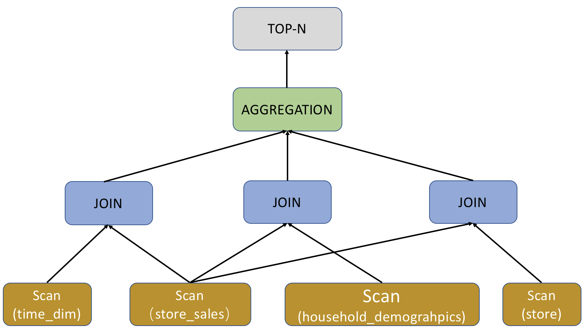
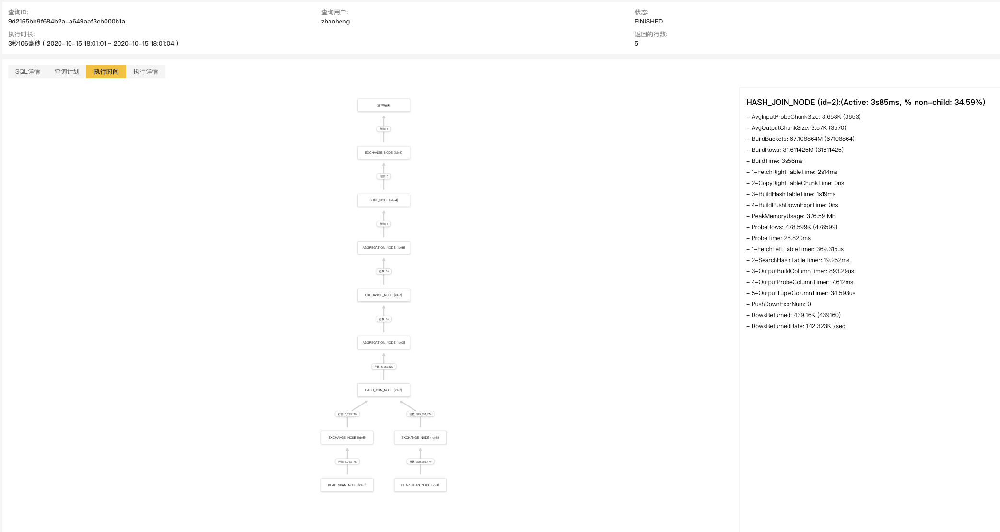
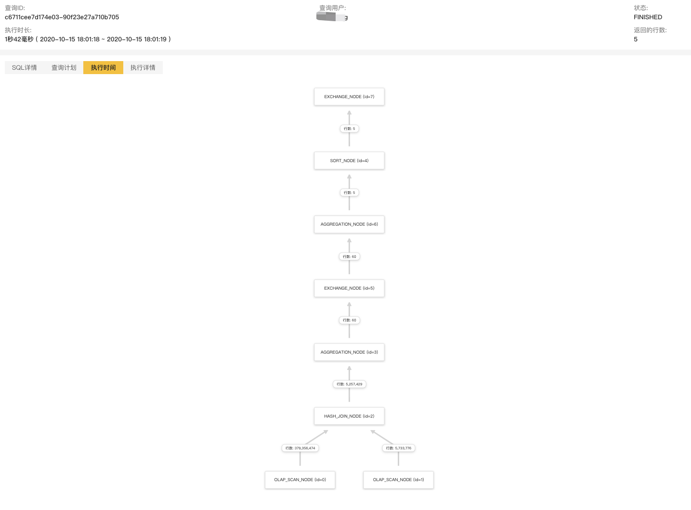

# 分析查询

本文介绍如何分析 StarRocks 中的查询。

为优化 StarRocks 集群性能，管理员需要定期针对慢查询进行分析并优化，以免慢查询影响整个集群的服务能力，进而影响用户体验。

您可以在 **fe/log/fe.audit.log** 中看到所有查询和慢查询信息，每个查询对应一个 QueryID。您可以在日志或者页面中查找到查询对应的 Query Plan 和 Profile。Query Plan 是 FE 通过解析 SQL 生成的执行计划，而 Profile 是 BE 执行查询后的结果，包含了每一步的耗时和数据处理量等数据。

同时，StarRocks 还支持对慢查询中的 SQL 语句进行归类，并为各类 SQL 语句计算出 SQL 指纹。

## 查看分析 Query Plan

SQL 语句在 StarRocks 中的生命周期可以分为查询解析（Query Parsing）、规划（Query Plan）、执行（Query Execution）三个阶段。通常对于 StarRocks 而言，查询解析不会成为查询性能的瓶颈，因为分析型需求的 QPS 普遍不高。

决定 StarRocks 中查询性能的关键就在于查询规划（Query Plan）和查询执行（Query Execution），二者的关系可以描述为 Query Plan 负责组织算子（Join/Order/Aggregation）之间的关系，Query Execution 负责执行具体算子。

Query Plan 可以为数据库管理者提供一个宏观的视角，从而获取查询执行的相关信息。优秀的 Query Plan 很大程度上决定了查询的性能，所以数据库管理者需要频繁查看 Query Plan，以确保其是否生成得当。本章以 TPC-DS 的 query96.sql 为例，展示如何查看StarRocks的Query Plan。

以下示例以 TPC-DS 的 query96.sql 为例，展示如何查看分析 StarRocks 的 Query Plan。

```SQL
-- query96.sql
select count(*)
from store_sales, 
    household_demographics, 
    time_dim, 
    store
where ss_sold_time_sk = time_dim.t_time_sk
    and ss_hdemo_sk = household_demographics.hd_demo_sk
    and ss_store_sk = s_store_sk
    and time_dim.t_hour = 8
    and time_dim.t_minute >= 30
    and household_demographics.hd_dep_count = 5
    and store.s_store_name = 'ese'
order by count(*) limit 100;
```

### 查看 Query Plan

Query Plan 可以分为逻辑执行计划（Logical Query Plan），和物理执行计划（Physical Query Plan），本章节所讲述的 Query Plan 默认指代的都是逻辑执行计划。

通过以下命令查看 Query Plan。

```sql
EXPLAIN sql_statement;
```

TPC-DS query96.sql 对应的 Query Plan 展示如下：

```plain text
mysql> EXPLAIN select count(*)
from store_sales, 
    household_demographics, 
    time_dim, 
    store
where ss_sold_time_sk = time_dim.t_time_sk
    and ss_hdemo_sk = household_demographics.hd_demo_sk
    and ss_store_sk = s_store_sk
    and time_dim.t_hour = 8
    and time_dim.t_minute >= 30
    and household_demographics.hd_dep_count = 5
    and store.s_store_name = 'ese'
order by count(*) limit 100;

+------------------------------------------------------------------------------+
| Explain String                                                               |
+------------------------------------------------------------------------------+
| PLAN FRAGMENT 0                                                              |
|  OUTPUT EXPRS:<slot 11>                                                      |
|   PARTITION: UNPARTITIONED                                                   |
|   RESULT SINK                                                                |
|   12:MERGING-EXCHANGE                                                        |
|      limit: 100                                                              |
|      tuple ids: 5                                                            |
|                                                                              |
| PLAN FRAGMENT 1                                                              |
|  OUTPUT EXPRS:                                                               |
|   PARTITION: RANDOM                                                          |
|   STREAM DATA SINK                                                           |
|     EXCHANGE ID: 12                                                          |
|     UNPARTITIONED                                                            |
|                                                                              |
|   8:TOP-N                                                                    |
|   |  order by: <slot 11> ASC                                                 |
|   |  offset: 0                                                               |
|   |  limit: 100                                                              |
|   |  tuple ids: 5                                                            |
|   |                                                                          |
|   7:AGGREGATE (update finalize)                                              |
|   |  output: count(*)                                                        |
|   |  group by:                                                               |
|   |  tuple ids: 4                                                            |
|   |                                                                          |
|   6:HASH JOIN                                                                |
|   |  join op: INNER JOIN (BROADCAST)                                         |
|   |  hash predicates:                                                        |
|   |  colocate: false, reason: left hash join node can not do colocate        |
|   |  equal join conjunct: `ss_store_sk` = `s_store_sk`                       |
|   |  tuple ids: 0 2 1 3                                                      |
|   |                                                                          |
|   |----11:EXCHANGE                                                           |
|   |       tuple ids: 3                                                       |
|   |                                                                          |
|   4:HASH JOIN                                                                |
|   |  join op: INNER JOIN (BROADCAST)                                         |
|   |  hash predicates:                                                        |
|   |  colocate: false, reason: left hash join node can not do colocate        |
|   |  equal join conjunct: `ss_hdemo_sk`=`household_demographics`.`hd_demo_sk`|
|   |  tuple ids: 0 2 1                                                        |
|   |                                                                          |
|   |----10:EXCHANGE                                                           |
|   |       tuple ids: 1                                                       |
|   |                                                                          |
|   2:HASH JOIN                                                                |
|   |  join op: INNER JOIN (BROADCAST)                                         |
|   |  hash predicates:                                                        |
|   |  colocate: false, reason: table not in same group                        |
|   |  equal join conjunct: `ss_sold_time_sk` = `time_dim`.`t_time_sk`         |
|   |  tuple ids: 0 2                                                          |
|   |                                                                          |
|   |----9:EXCHANGE                                                            |
|   |       tuple ids: 2                                                       |
|   |                                                                          |
|   0:OlapScanNode                                                             |
|      TABLE: store_sales                                                      |
|      PREAGGREGATION: OFF. Reason: `ss_sold_time_sk` is value column          |
|      partitions=1/1                                                          |
|      rollup: store_sales                                                     |
|      tabletRatio=0/0                                                         |
|      tabletList=                                                             |
|      cardinality=-1                                                          |
|      avgRowSize=0.0                                                          |
|      numNodes=0                                                              |
|      tuple ids: 0                                                            |
|                                                                              |
| PLAN FRAGMENT 2                                                              |
|  OUTPUT EXPRS:                                                               |
|   PARTITION: RANDOM                                                          |
|                                                                              |
|   STREAM DATA SINK                                                           |
|     EXCHANGE ID: 11                                                          |
|     UNPARTITIONED                                                            |
|                                                                              |
|   5:OlapScanNode                                                             |
|      TABLE: store                                                            |
|      PREAGGREGATION: OFF. Reason: null                                       |
|      PREDICATES: `store`.`s_store_name` = 'ese'                              |
|      partitions=1/1                                                          |
|      rollup: store                                                           |
|      tabletRatio=0/0                                                         |
|      tabletList=                                                             |
|      cardinality=-1                                                          |
|      avgRowSize=0.0                                                          |
|      numNodes=0                                                              |
|      tuple ids: 3                                                            |
|                                                                              |
| PLAN FRAGMENT 3                                                              |
|  OUTPUT EXPRS:                                                               |
|   PARTITION: RANDOM                                                          |
|   STREAM DATA SINK                                                           |
|     EXCHANGE ID: 10                                                          |
|     UNPARTITIONED                                                            |
|                                                                              |
|   3:OlapScanNode                                                             |
|      TABLE: household_demographics                                           |
|      PREAGGREGATION: OFF. Reason: null                                       |
|      PREDICATES: `household_demographics`.`hd_dep_count` = 5                 |
|      partitions=1/1                                                          |
|      rollup: household_demographics                                          |
|      tabletRatio=0/0                                                         |
|      tabletList=                                                             |
|      cardinality=-1                                                          |
|      avgRowSize=0.0                                                          |
|      numNodes=0                                                              |
|      tuple ids: 1                                                            |
|                                                                              |
| PLAN FRAGMENT 4                                                              |
|  OUTPUT EXPRS:                                                               |
|   PARTITION: RANDOM                                                          |
|   STREAM DATA SINK                                                           |
|     EXCHANGE ID: 09                                                          |
|     UNPARTITIONED                                                            |
|                                                                              |
|   1:OlapScanNode                                                             |
|      TABLE: time_dim                                                         |
|      PREAGGREGATION: OFF. Reason: null                                       |
|      PREDICATES: `time_dim`.`t_hour` = 8, `time_dim`.`t_minute` >= 30        |
|      partitions=1/1                                                          |
|      rollup: time_dim                                                        |
|      tabletRatio=0/0                                                         |
|      tabletList=                                                             |
|      cardinality=-1                                                          |
|      avgRowSize=0.0                                                          |
|      numNodes=0                                                              |
|      tuple ids: 2                                                            |
+------------------------------------------------------------------------------+
128 rows in set (0.02 sec)
```

### 分析 Query Plan

分析 Query Plan 将涉及以下概念。

|名称|解释|
|---|---|
|avgRowSize|扫描数据行的平均大小。|
|cardinality|扫描表的数据总行数。|
|colocate|表是否采用了 Colocate 形式。|
|numNodes|扫描涉及的节点数。|
|rollup|物化视图。|
|preaggregation|预聚合。|
|predicates|谓词，也就是查询过滤条件。|
|partitions|分区。|
|table|表。|

query96.sql 的 Query Plan 分为 5 个 Plan Fragment，编号从 0 至 4。您可以通过从下至上的方式查看 Query Plan。

以上示例中，最底部的 Plan Fragment 为 Fragment 4，它负责扫描 `time_dim` 表，并提前执行相关查询条件 `time_dim.t_hour = 8 and time_dim.t_minute >= 30`，即谓词下推。对于聚合表，StarRocks 会根据不同查询选择是否开启预聚合 PREAGGREGATION。以上示例中 `time_dim` 表的预聚合为关闭状态，此状态之下 StarRocks 会读取 `time_dim` 的全部维度列，如果当前表包含大量维度列，这可能会成为影响性能的一个关键因素。如果 `time_dim` 表被设置为根据 Range Partition 进行数据划分，Query Plan 中的 `partitions` 会表征查询命中的分区，无关分区被自动过滤，从而有效减少扫描数据量。如果当前表有物化视图，StarRocks 会根据查询去自动选择物化视图，如果没有物化视图，那么查询自动命中 base table，也就是以上示例中展示的 `rollup: time_dim`。您暂时无需关注其他字段。

当 `time_dim` 表数据扫描完成之后，Fragment 4 的执行过程也就随之结束，此时它将扫描得到的数据传递给其他 Fragment。以上示例中的 `EXCHANGE ID : 09` 表征了数据传递给了标号为 `9` 的接收节点。

对于 query96.sql 的 Query Plan 而言，Fragment 2，3，4功能类似，只是负责扫描的表不同。而查询中的 Order/Aggregation/Join 算子，都在 Fragment 1 中进行。

Fragment 1 集成了三个 Join 算子的执行，采用默认的 BROADCAST 方式进行执行，也就是小表向大表广播的方式进行。如果两个 Join 的表都是大表，建议采用 SHUFFLE 的方式进行。目前 StarRocks 只支持 HASH JOIN，也就是采用哈希算法进行 Join。以上示例中的 `colocate` 字段用来表述两张 Join 表采用同样的分区/分桶方式。如果分区/分桶方式相同，Join 的过程可以直接在本地执行，不用进行数据的移动。Join 执行完成之后，Fragment 1 就会执行上层的 Aggregation、Order by 和 TOP-N 算子。

抛开具体的表达式不谈，下图从宏观的角度展示了 query96.sql 的 Query Plan。



## 查看分析 Profile

在分析 Query Plan 后，您可以分析 BE 的执行结果 Profile 了解集群性能。

如果您是企业版用户，您可以在 StarRocksManager 中执行查询，然后点击 **查询历史**，就可看在 **执行详情** Tab 中看到 Profile 的详细文本信息，并在 **执行时间** Tab 中看到图形化的展示。以下使用 TPC-H 的 Q4 查询来作为例子。

以下示例以 TPCH 的 Q4 查询为例。

```sql
-- TPCH Q4
select  o_orderpriority,  count(*) as order_count
from  orders
where
  o_orderdate >= date '1993-07-01'
  and o_orderdate < date '1993-07-01' + interval '3' month
  and exists (
    select  * from  lineitem
    where  l_orderkey = o_orderkey and l_commitdate < l_receiptdate
  )
group by o_orderpriority
order by o_orderpriority;
```

以上查询包含了相关子查询，即 group by，order by 和 count 查询。其中 `order` 是订单表，`lineitem` 是货品明细表，这两张表均为数据量较大的的事实表。这个查询的含义是按照订单的优先级分组，统计每个分组的订单数量，同时有两个过滤条件：

* 订单创建时间处于 `1993 年 7 月` 至 `1993 年 10 月` 之间。
* 订单对应的产品的提交日期 `l_commitdate` 小于收货日期 `l_receiptadate`。

执行查询后，您可以查看当前查询的 **执行时间** Tab。


  
在页面左上角，您可以看到整个查询执行了 3.106s。通过点击每个节点，您可以看到每一部分的执行信息，`Active` 字段表示当前节点（包含其所有子节点）的执行时间。当前节点有两个子节点，即两个 Scan Node，二者分别扫描了 5,730,776 条和 379,364,474 条数据，并进行了一次 Shuffle Join，完成后输出 5,257,429 条数据，然后经过两层聚合，最后通过一个 Sort Node 后输出结果，其中 Exchange Node 是数据交换节点，在当前示例中进行了两次 Shuffle。

通常情况下，分析 Profile 的核心即找到执行时间最长的性能瓶颈所在的节点。您可以按照自上而下的方式依次查看。

在当前示例中，Hash Join Node 占了主要时间。

```plain text
HASH_JOIN_NODE (id=2):(Active: 3s85ms, % non-child: 34.59%)
- AvgInputProbeChunkSize: 3.653K (3653)
- AvgOutputChunkSize: 3.57K (3570)
- BuildBuckets: 67.108864M (67108864)
- BuildRows: 31.611425M (31611425)
- BuildTime: 3s56ms
    - 1-FetchRightTableTime: 2s14ms
    - 2-CopyRightTableChunkTime: 0ns
    - 3-BuildHashTableTime: 1s19ms
    - 4-BuildPushDownExprTime: 0ns
- PeakMemoryUsage: 376.59 MB
- ProbeRows: 478.599K (478599)
- ProbeTime: 28.820ms
    - 1-FetchLeftTableTimer: 369.315us
    - 2-SearchHashTableTimer: 19.252ms
    - 3-OutputBuildColumnTimer: 893.29us
    - 4-OutputProbeColumnTimer: 7.612ms
    - 5-OutputTupleColumnTimer: 34.593us
- PushDownExprNum: 0
- RowsReturned: 439.16K (439160)
- RowsReturnedRate: 142.323K /sec
```

在当前示例中的信息可以看出，Hash Join 的执行时间主要分成两部分，也就是 `BuildTime` 和 `ProbeTime`，`BuildTime` 是扫描右表并构建 Hash 表的过程，`ProbeTime` 是获取左表并搜索 Hash 表进行匹配并输出的过程。可以看出在当前节点的 `BuildTime` 中，`FetchRightTableTime` 和 `BuildHashTableTime` 占据了较大部分。对比先前扫描行数数据，可以发现当前查询的左表和右表的顺序并不理想，应该将左表设置为大表，如此右表构建 Hash 表的效果更好。除此之外，当前两表均为事实表，数据量较大，您也可以考虑采用 Colocate Join 来避免数据 Shuffle，同时减少 Join 的数据量。您可以参考 [Colocate Join](../using_starrocks/Colocate_join.md) 建立 Colocation 关系，改写 SQL 如下：

```sql
with t1 as (
    select l_orderkey from  lineitem
    where  l_commitdate < l_receiptdate
) select o_orderpriority,  count(*)as order_count from t1 right semi join orders_co  on l_orderkey = o_orderkey 
    where o_orderdate >= date '1993-07-01'
  and o_orderdate < date '1993-07-01' + interval '3' month
group by o_orderpriority
order by o_orderpriority;
```

执行结果如下所示：



新的 SQL 执行时间从 3.106s 降低至 1.042s。两张大表没有了 Exchange 节点，直接通过 Colocate Join 进行 Join。除此之外，调换左右表顺序后，整体性能大幅提升，新的 Join Node 信息如下：

```sql
HASH_JOIN_NODE (id=2):(Active: 996.337ms, % non-child: 52.05%)
- AvgInputProbeChunkSize: 2.588K (2588)
- AvgOutputChunkSize: 35
- BuildBuckets: 1.048576M (1048576)
- BuildRows: 478.171K (478171)
- BuildTime: 187.794ms
    - 1-FetchRightTableTime: 175.810ms
    - 2-CopyRightTableChunkTime: 5.942ms
    - 3-BuildHashTableTime: 5.811ms
    - 4-BuildPushDownExprTime: 0ns
- PeakMemoryUsage: 22.38 MB
- ProbeRows: 31.609786M (31609786)
- ProbeTime: 807.406ms
    - 1-FetchLeftTableTimer: 282.257ms
    - 2-SearchHashTableTimer: 457.235ms
    - 3-OutputBuildColumnTimer: 26.135ms
    - 4-OutputProbeColumnTimer: 16.138ms
    - 5-OutputTupleColumnTimer: 1.127ms
- PushDownExprNum: 0
- RowsReturned: 438.502K (438502)
- RowsReturnedRate: 440.114K /sec
```

## Query Hint

 StarRocks 支持提示（Hint）功能。Hint 是一种指令或注释，显式地向查询优化器建议如何执行查询。目前支持两种 Hint：系统变量 Hint 和 Join Hint。Hint 仅在单个查询范围内生效。

### 系统变量 Hint

在 SELECT、SUBMIT TASK 语句中通过 `/*+ ... */` 注释的形式设置一个或多个[系统变量](../reference/System_variable.md) Hint。其他语句中如果包含 SELECT 子句（如 CREATE MATERIALIZED VIEW AS SELECT，CREATE VIEW AS SELECT），则您也可以在该 SELECT 子句中使用系统变量 Hint。

#### 语法

```SQL
[...] SELECT [/*+ SET_VAR(key=value [, key = value]*) */] ...
SUBMIT [/*+ SET_VAR(key=value [, key = value]*) */] TASK ...
```

#### 示例

在聚合查询语句中通过系统变量 `streaming_preaggregation_mode` 和 `new_planner_agg_stage` 来设置聚合方式。

```SQL
SELECT /*+ SET_VAR (streaming_preaggregation_mode = 'force_streaming',new_planner_agg_stage = '2') */ SUM(sales_amount) AS total_sales_amount FROM sales_orders;
```

在 SUBMIT TASK 语句中通过系统变量 `query_timeout` 来设置查询执行超时时间。

```SQL
SUBMIT /*+ SET_VAR(query_timeout=3) */ TASK 
    AS CREATE TABLE temp AS SELECT count(*) AS cnt FROM tbl1;
```

创建物化视图时在 SELECT 子句中通过系统变量 `query_timeout` 来设置查询执行超时时间。

```SQL
CREATE MATERIALIZED VIEW mv 
    PARTITION BY dt 
    DISTRIBUTED BY HASH(`key`) 
    BUCKETS 10 
    REFRESH ASYNC 
    AS SELECT /*+ SET_VAR(query_timeout=500) */ * from dual;
```

### Join Hint

针对多表关联查询，优化器一般会主动选择最优的 Join 执行方式。在特殊情况下，您也可以使用 Join Hint 显式地向优化器建议 Join 执行方式、以及禁用 Join Reorder。目前 Join Hint 支持的 Join 执行方式有 Shuffle Join、Broadcast Join、Bucket Shuffle Join 和 Colocate Join。

当您使用 Join Hint 建议 Join 的执行方式后，优化器不会进行 Join Reorder，因此您需要确保右表为较小的表。并且当您所建议的 Join 执行方式为 [Colocate Join](../using_starrocks/Colocate_join.md) 或者 Bucket Shuffle Join 时，您需要确保表的数据分布情况满足这两种 Join 执行方式的要求，否则所建议的 Join 执行方式不生效。

#### 语法

```SQL
... JOIN { [BROADCAST] | [SHUFFLE] | [BUCKET] | [COLOCATE] | [UNREORDER]} ...
```

> **说明**
>
> 使用 Join Hint 时大小写不敏感。

#### 示例

* Shuffle Join

  如果需要将表 A、B 中分桶键取值相同的数据行 Shuffle 到相同机器上，再进行 Join 操作，则您可以设置 Join Hint 为 Shuffle Join。

  ```SQL
  select k1 from t1 join [SHUFFLE] t2 on t1.k1 = t2.k2 group by t2.k2;
  ```

* Broadcast Join
  
  如果表 A 是个大表，表 B 是个小表，则您可以设置 Join Hint 为 Broadcast Join。表 B 的数据全量广播到表 A 数据所在的机器上，再进行 Join 操作。Broadcast Join 相比较于 Shuffle Join，节省了 Shuffle 表 A 数据的开销。

  ```SQL
  select k1 from t1 join [BROADCAST] t2 on t1.k1 = t2.k2 group by t2.k2;
  ```

* Bucket Shuffle Join
  
  如果关联查询中 Join 等值表达式命中表 A 的分桶键 ，尤其是在表 A 和表 B 均是大表的情况下，您可以设置 Join Hint 为 Bucket Shuffle Join。表 B 数据会按照表 A 数据的分布方式，Shuffle 到表 A 数据所在机器上，再进行 Join 操作。Bucket Shuffle Join 是在 Broadcast Join 的基础上进一步优化，Shuffle B 表的数据量全局只有一份，比 Broadcast Join 少传输了很多倍数据量。

  ```SQL
  select k1 from t1 join [BUCKET] t2 on t1.k1 = t2.k2 group by t2.k2;
  ```

* Colocate Join
  
  如果建表时指定表 A 和 B 属于同一个 Colocation Group，则表 A 和表 B 分桶键取值相同的数据行一定分布在相同 BE 节点上。当关联查询中 Join 等值表达式命中表 A 和 B 的分桶键，则您可以设置 Join Hint 为 Colocate Join。 具有相同键值的数据直接在本地 Join，减少数据在节点间的传输耗时，从而提高查询性能。

  ```SQL
  select k1 from t1 join [COLOCATE] t2 on t1.k1 = t2.k2 group by t2.k2;
  ```

### 查看实际的 Join 执行方式

通过 `EXPLAIN` 命令来查看 Join Hint 是否生效。如果返回结果所显示的 Join 执行方式符合 Join Hint，则表示 Join Hint 生效。

```SQL
EXPLAIN select k1 from t1 join [COLOCATE] t2 on t1.k1 = t2.k2 group by t2.k2;
```


## 查看 SQL 指纹

StarRocks 支持规范化慢查询中 SQL 语句，归类并计算各个类型 SQL 语句的 MD5 哈希值。

您可以在 **fe.audit.log.slow_query** 中查看慢查询相关信息，其中 MD5 哈希值对应字段为 `Digest`。

```plain text
2021-12-27 15:13:39,108 [slow_query] |Client=172.26.xx.xxx:54956|User=root|Db=default_cluster:test|State=EOF|Time=2469|ScanBytes=0|ScanRows=0|ReturnRows=6|StmtId=3|QueryId=824d8dc0-66e4-11ec-9fdc-00163e04d4c2|IsQuery=true|feIp=172.26.92.195|Stmt=select count(*) from test_basic group by id_bigint|Digest=51390da6b57461f571f0712d527320f4
```

SQL 语句规范化仅保留重要的语法结构，对 SQL 语句进行以下操作：

* 保留对象标识符，如数据库和表的名称。
* 转换常量为 `?`。
* 删除注释并调整空格。

以下两个 SQL 语句，规范化后属于同一类SQL。

```sql
SELECT * FROM orders WHERE customer_id=10 AND quantity>20

SELECT * FROM orders WHERE customer_id = 20 AND quantity > 100
```

以下为规范化后 SQL 类型。

```sql
SELECT * FROM orders WHERE customer_id=? AND quantity>?
```
