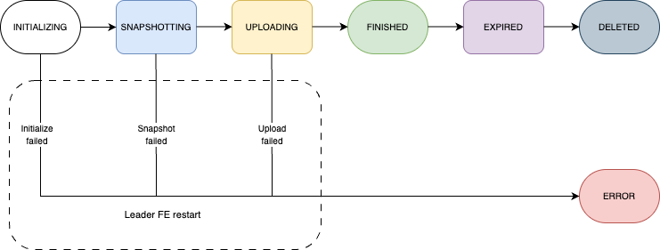

<head><meta name="docsearch:pagerank" content="100"/></head>

import Beta from '../_assets/commonMarkdown/_beta.mdx'
import ClusterSnapshotTerm from '../_assets/commonMarkdown/cluster_snapshot_term.mdx'
import ClusterSnapshotTermCRDR from '../_assets/commonMarkdown/cluster_snapshot_term_crdr.mdx'
import ClusterSnapshotSyntaxParam from '../_assets/commonMarkdown/cluster_snapshot_syntax_param.mdx'
import ClusterSnapshotPurge from '../_assets/commonMarkdown/cluster_snapshot_purge.mdx'
import ManualCreateDropClusterSnapshot from '../_assets/commonMarkdown/manual_cluster_snapshot.mdx'
import ClusterSnapshotWarning from '../_assets/commonMarkdown/cluster_snapshot_warning.mdx'
import ClusterSnapshotCrossRegionRecover from '../_assets/commonMarkdown/cluster_snapshot_cross_region_recover.mdx'
import ClusterSnapshotAfterRecover from '../_assets/commonMarkdown/cluster_snapshot_after_recover.mdx'
import ClusterSnapshotAppendix from '../_assets/commonMarkdown/cluster_snapshot_appendix.mdx'

# 集群快照

<Beta />

本文介绍如何在存算分离集群上使用集群快照进行灾难恢复。

此功能从 v3.4.2 开始支持，并且仅在存算分离集群上可用。

## 概述

存算分离集群的灾难恢复的基本思想是确保完整的集群状态（包括数据和元数据）存储在对象存储中。这样，如果集群发生故障，只要数据和元数据保持完整，就可以从对象存储中恢复。此外，云提供商提供的备份和跨区域复制等功能可以用于实现远程恢复和跨区域灾难恢复。

在存算分离集群中，CN 状态（数据）存储在对象存储中，但 FE 状态（元数据）仍然是本地的。为了确保对象存储中拥有所有用于恢复的集群状态，StarRocks 现在支持集群快照以保存数据和元数据。

### 工作流程



### 术语

- **集群快照**

  集群快照是指在某一时刻的集群状态的快照。它包含集群中的所有对象，如 catalogs、数据库、表、用户和权限、导入任务等。它不包括所有外部依赖对象，如 external catalog 的配置文件和本地 UDF JAR 包。

- **生成集群快照**

  系统自动维护紧随最新集群状态的快照。在创建最新快照后，历史快照将被删除，始终只保留一个快照。

  <ClusterSnapshotTerm />

- **集群恢复**

  从快照中恢复集群。

<ClusterSnapshotTermCRDR />

## 自动化集群快照

自动化集群快照默认是禁用的。

使用以下语句启用此功能：

<ClusterSnapshotSyntaxParam />

每次 FE 在完成元数据检查点后创建新的元数据镜像时，它会自动创建一个快照。快照的名称由系统生成，格式为 `automated_cluster_snapshot_{timestamp}`。

元数据快照存储在 `/{storage_volume_locations}/{service_id}/meta/image/automated_cluster_snapshot_timestamp` 下。数据快照存储在与原始数据相同的位置。

FE 配置项 `automated_cluster_snapshot_interval_seconds` 控制快照自动化周期。默认值为 600 秒（10 分钟）。

### 禁用自动化集群快照

使用以下语句禁用自动化集群快照：

```SQL
ADMIN SET AUTOMATED CLUSTER SNAPSHOT OFF
```

<ClusterSnapshotPurge />

<ManualCreateDropClusterSnapshot />

## 查看集群快照

您可以查询视图 `information_schema.cluster_snapshots` 来查看最新的集群快照和尚未删除的快照。

```SQL
SELECT * FROM information_schema.cluster_snapshots;
```

返回：

| 字段              | 描述                                                  |
| ------------------ | ------------------------------------------------------------ |
| snapshot_name      | 快照的名称。                                    |
| snapshot_type      | 快照的类型。有效值：`automated` 和 `manual`。 |
| created_time       | 快照创建的时间。                  |
| fe_journal_id      | FE 日志的 ID。                                    |
| starmgr_journal_id | StarManager 日志的 ID。                           |
| properties         | 应用于尚未可用的功能。                      |
| storage_volume     | 存储快照的存储卷。             |
| storage_path       | 存储快照的存储路径。         |

## 查看集群快照任务

您可以查询视图 `information_schema.cluster_snapshot_jobs` 来查看集群快照的任务信息。

```SQL
SELECT * FROM information_schema.cluster_snapshot_jobs;
```

返回：

| 字段              | 描述                                                  |
| ------------------ | ------------------------------------------------------------ |
| snapshot_name      | 快照的名称。                                    |
| job_id             | 任务的 ID。                                           |
| created_time       | 任务创建的时间。                       |
| finished_time      | 任务完成的时间。                      |
| state              | 任务的状态。有效值：`INITIALIZING`、`SNAPSHOTING`、`FINISHED`、`EXPIRED`、`DELETED` 和 `ERROR`。 |
| detail_info        | 当前执行阶段的具体进度信息。 |
| error_message      | 任务的错误信息（如果有）。                       |

## 恢复集群

<ClusterSnapshotWarning />

按照以下步骤使用集群快照恢复集群。

<ClusterSnapshotCrossRegionRecover />

2. 启动 Leader FE 节点。

   ```Bash
   ./fe/bin/start_fe.sh --cluster_snapshot --daemon
   ```

3. **清理 `meta` 目录后** 启动其他 FE 节点。

   ```Bash
   ./fe/bin/start_fe.sh --helper <leader_ip>:<leader_edit_log_port> --daemon
   ```

4. **清理 `storage_root_path` 目录后** 启动 CN 节点。

   ```Bash
   ./be/bin/start_cn.sh --daemon
   ```

如果您在步骤 1 中修改了 **cluster_snapshot.yaml**，节点和存储卷将根据文件中的信息在新集群中重新配置。

<ClusterSnapshotAfterRecover />

<ClusterSnapshotAppendix />

## 限制

- 目前不支持待机模式。Primary 集群和 Secondary 集群不能同时在线，否则无法保证 Secondary 集群的正常运行。
- 目前仅能保留一个自动集群快照。
