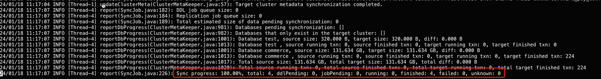
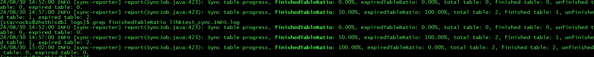

import Tabs from '@theme/Tabs';
import TabItem from '@theme/TabItem';

# 跨集群数据迁移工具

StarRocks 跨集群数据迁移工具由 StarRocks 社区提供。您可以使用该工具轻松地将数据从源集群迁移到目标集群。

| 迁移路径                                      | 支持信息                       |
| -------------------------------------------- | ----------------------------- |
| 从存算一体到存算一体                            | 从 v3.1.8 和 v3.2.3 起         |
| 从存算一体到存算分离                            | 从 v3.1.8 和 v3.2.3 起         |
| 从存算分离到存算分离                            | 从 v4.1 起                     |
| 从存算分离到存算一体                            | 不支持                         |

## 准备工作

<Tabs groupId="migrationPath">
<TabItem value="sourceNothing" label="从存算一体迁移" default>

### 在源集群上

无需在源集群上执行任何准备工作。

### 在目标集群上

数据迁移前，必须在目标集群上完成以下准备工作。

#### 开放端口

如果您已启用防火墙，则必须开放以下端口：

| **组件** | **端口**       | **默认值** |
| -------- | -------------- | ---------- |
| FE       | query_port     | 9030       |
| FE       | http_port      | 8030       |
| FE       | rpc_port       | 9020       |
| BE/CN    | be_http_port   | 8040       |
| BE/CN    | be_port        | 9060       |

</TabItem>

<TabItem value="sourceData" label="在存算分离间迁移">

### 在源集群上

迁移期间，源集群的 Auto-Vacuum 机制可能会删除目标 CN 仍需读取的历史数据版本。为防止这种情况发生，您必须通过动态设置 FE 配置项 `lake_autovacuum_grace_period_minutes` 为一个较大的值来延长 Auto-Vacuum 宽限期：

```SQL
ADMIN SET FRONTEND CONFIG("lake_autovacuum_grace_period_minutes"="10000000");
```

:::important

该设置会阻止源集群在迁移期间回收过期的对象存储文件，这将导致存储放大。建议尽量缩短迁移窗口，并在迁移完成后将该配置项重置为默认值 `30`：

```SQL
ADMIN SET FRONTEND CONFIG("lake_autovacuum_grace_period_minutes"="30");
```

:::

### 在目标集群上

数据迁移前，必须在目标集群上完成以下准备工作。

#### 开放端口

如果您已启用防火墙，则必须开放以下端口：

| **组件** | **端口**   | **默认值** |
| -------- | ---------- | ---------- |
| FE       | query_port | 9030       |
| FE       | http_port  | 8030       |
| FE       | rpc_port   | 9020       |

#### 禁用 Compaction

迁移期间必须在目标集群上禁用 Compaction，以防止与传入的复制数据发生冲突。

1. 动态禁用 Compaction：

   ```SQL
   ADMIN SET FRONTEND CONFIG("lake_compaction_max_tasks"="0");
   ```

2. 为防止集群重启后 Compaction 被重新启用，还需在 FE 配置文件 **fe.conf** 中添加以下配置：

   ```Properties
   lake_compaction_max_tasks = 0
   ```

:::important

迁移完成后，请从 **fe.conf** 中删除上述配置以重新启用 Compaction，并执行以下语句动态启用 Compaction：

```SQL
ADMIN SET FRONTEND CONFIG("lake_compaction_max_tasks"="-1");
```

:::

#### 在目标集群上创建源存储卷

迁移工具会识别每张源表使用的存储卷，并按照命名规范 `src_<source_volume_name>` 在目标集群上查找对应的存储卷。在启动迁移前，您必须预先创建这些存储卷。

:::important
这些存储卷**仅在迁移期间使用**，目的是让目标 CN 能够读取源集群的对象存储。迁移完成后，这些存储卷将不再需要，可以删除。
:::

1. 在**源集群**上，列出所有存储卷：

   ```SQL
   SHOW STORAGE VOLUMES;
   ```

2. 对于计划迁移的表所使用的每个存储卷，查看其配置信息：

   ```SQL
   DESCRIBE STORAGE VOLUME <volume_name>;
   ```

   示例输出：

   ```
   +---------------------+------+-----------+-------------------------------+-----------------------------+
   | Name                | Type | IsDefault | Location                      | Params                      |
   +---------------------+------+-----------+-------------------------------+-----------------------------+
   | builtin_storage_vol | S3   | true      | s3://my-bucket                | {"aws.s3.region":"...",...} |
   +---------------------+------+-----------+-------------------------------+-----------------------------+
   ```

3. 在**目标集群**上，使用相同的对象存储凭证创建一个镜像存储卷，但名称前缀为 `src_`：

   ```SQL
   CREATE STORAGE VOLUME src_<source_volume_name>
   TYPE = S3
   LOCATIONS = ("<same_location_as_source>")
   PROPERTIES
   (
       "enabled" = "true",
       "aws.s3.region" = "<region>",
       "aws.s3.endpoint" = "<endpoint>",
       "aws.s3.use_aws_sdk_default_behavior" = "false",
       "aws.s3.use_instance_profile" = "false",
       "aws.s3.access_key" = "<access_key>",
       "aws.s3.secret_key" = "<secret_key>",
       "aws.s3.enable_partitioned_prefix" = "false"
   );
   ```

   :::note
   - 无论源集群的设置如何，请将 `aws.s3.enable_partitioned_prefix` 设置为 `false`。迁移工具直接使用源分区的完整路径读取文件，因此不能对镜像存储卷应用分区前缀。
   - 对**每个**待迁移表所使用的唯一存储卷重复此步骤。例如，如果源集群使用 `builtin_storage_volume`，则在目标集群上创建 `src_builtin_storage_volume`。
   - 建议为源存储卷使用临时凭证（access key / secret key），迁移完成后可以将其吊销。
   :::

#### 准备 Range 分布迁移窗口

首个版本的 Range 分布迁移仅支持从存算分离源集群迁移到存算分离目标集群。两个集群的 StarRocks 服务端和迁移工具都必须包含本节所述的 Range 迁移协议。

表必须满足以下要求：

- 仅支持非 Colocate 的 Range 分布表，不支持 `range-colocate` 表。
- 不支持 `VARBINARY` 类型的 Range 分布列。首个版本的边界传输无法无损保留任意二进制值，因此目标集群会在提交分裂前拒绝此类表。
- Range 分布迁移要求源集群和目标集群均禁用透明数据加密（TDE）。目标集群会在复制数据前拒绝包含加密文件的源快照，以及需要在目标端加密的共享文件。
- 每个逻辑分区必须仅包含一个物理分区。
- 迁移快照必须覆盖所有逻辑分区和所有可见索引（包括 Rollup 索引），不完整的快照会被拒绝。
- 拓扑对齐仅支持分裂：目标布局可以与源布局相同，也可以通过精确的 Range 分裂细化为源布局。源端发生合并、目标布局比源布局更细，或任何需要在目标端执行合并的拓扑，都会在启动复制前被拒绝。

迁移工具从源集群 `SHOW PROC` 的 Tablet 输出中读取不透明的 `RangeEncoded` 列。它会向目标集群当前的 Leader FE 发出 `ADMIN EXECUTE ON FRONTEND` 语句，调用 `LocalMetastore.reconcileRangeTablets` 并提交完整的预期拓扑：

```SQL
ADMIN EXECUTE ON FRONTEND 'out.append(metastore.reconcileRangeTablets("<base64-request>"))';
```

不要解析供人工阅读的 `Range` 列，也不要手动执行此语句。工具会按列名发现 `RangeEncoded`，构造带版本的 Base64 请求，刷新目标 Leader FE，并校验结构化响应。

更改任何配置前，记录源集群和目标集群每个 FE 上的原始值。迁移完成后必须恢复这些记录的值，不要假定默认值。以下配置为动态配置。请使用 `WITH PERSISTENT` 设置，并在每次更改后使用 `ADMIN SHOW FRONTEND CONFIG` 确认每个 FE 都返回预期值。

1. 在**源集群**上禁用合并。保留源集群原有的 `tablet_reshard_target_size`；源 Tablet 必须继续按正常阈值自动分裂，目标集群才能跟随这些边界。

   ```SQL
   ADMIN SET FRONTEND CONFIG ("tablet_reshard_enable_tablet_merge" = "false") WITH PERSISTENT;
   ```

2. 在更改目标 Tablet 大小前，先在**目标集群**上禁用合并：

   ```SQL
   ADMIN SET FRONTEND CONFIG ("tablet_reshard_enable_tablet_merge" = "false") WITH PERSISTENT;
   ```

   继续操作前，请在两个集群上执行以下查询，并确认源集群和目标集群的每个 FE 均返回 `false`。在两个集群都已禁用并验证合并前，不要调大目标 Tablet 大小。

   ```SQL
   ADMIN SHOW FRONTEND CONFIG LIKE 'tablet_reshard_enable_tablet_merge';
   ```

3. 在**目标集群**上禁止独立的按大小分裂，并为工具创建的表启用 Range 分布：

   ```SQL
   ADMIN SET FRONTEND CONFIG ("tablet_reshard_target_size" = "9223372036854775807") WITH PERSISTENT;
   ADMIN SET FRONTEND CONFIG ("enable_range_distribution" = "true") WITH PERSISTENT;
   ```

4. 对迁移的目标 Range 表，必须选择以下一种方案：

   - 保证迁移期间没有独立导入写入这些表。此时保持三个集群级预分裂配置不变。
   - 如果无法做出上述保证，请在目标集群上禁用全部三个预分裂路径，并记录本方案更改了这些配置，以便迁移后恢复。

   如果选择第二种方案，请执行：

   ```SQL
   ADMIN SET FRONTEND CONFIG ("enable_tablet_pre_split_for_insert_from_files" = "false") WITH PERSISTENT;
   ADMIN SET FRONTEND CONFIG ("enable_tablet_pre_split_for_broker_load" = "false") WITH PERSISTENT;
   ADMIN SET FRONTEND CONFIG ("enable_tablet_pre_split_for_insert_from_table" = "false") WITH PERSISTENT;
   ```

本功能没有新增专用的 `enable_automatic_tablet_reshard` 配置。仅将目标集群的 `tablet_reshard_target_size` 设为 64 位有符号整数最大值即可抑制目标端按大小自动分裂，`tablet_reshard_enable_tablet_merge=false` 则抑制合并。源集群继续正常自动分裂，工具随后使用源端精确的 `RangeEncoded` 边界提交不重写数据的目标分裂。

`enable_execute_script_on_frontend` 是静态 FE 配置，不能通过 `ADMIN SET FRONTEND CONFIG` 更改。如果记录的原始值为 `false`，请在目标集群的每个 FE 的 **fe.conf** 中加入以下配置，并执行受支持的滚动重启：每次只重启一个 FE，等待其恢复健康后再重启下一个 FE。

```Properties
enable_execute_script_on_frontend = true
```

滚动重启完成后，在目标集群的每个 FE 上确认 `ADMIN SHOW FRONTEND CONFIG LIKE 'enable_execute_script_on_frontend'` 返回 `true`。迁移用户必须具有 SYSTEM OPERATE 权限。

:::warning

FE 脚本执行功能可以在 FE 进程中运行任意代码。请仅在有限的迁移窗口内启用此功能，严格限制迁移账号的使用；停止工具后，在 **fe.conf** 中恢复记录的 `enable_execute_script_on_frontend` 原始值并再次滚动重启。

:::

应用并验证配置后，等待已准入的 reshard 作业排空。请分别在源集群和目标集群上执行以下查询：

```SQL
SELECT JOB_ID, DB_NAME, TABLE_NAME, JOB_TYPE, JOB_STATE
FROM information_schema.tablet_reshard_jobs
WHERE JOB_STATE NOT IN ('FINISHED', 'ABORTED');
```

只有该查询在两个集群上均返回零行时，才能打开迁移窗口。该条件覆盖所有非终态作业，包括 `PENDING`、`PREPARING`、`RUNNING`、`CLEANING` 和 `ABORTING`。初始排空不意味着后续禁用源端自动分裂。增量复制事务活跃期间，源 Tablet 可以按正常阈值自动分裂；随后工具会刷新源拓扑。只有对应的目标分裂会在目标 `REPLICATION` 事务活跃期间被阻塞。

迁移期间，工具按下表处理对齐状态：

| 状态 | 运维操作 |
| ---- | -------- |
| `ALIGNED` | 目标完整拓扑与源端一致。工具完成常规元数据检查后可以继续复制。 |
| `SUBMITTED` | 已提交精确的目标分裂。保持工具运行，工具会刷新元数据并再次轮询。 |
| `RUNNING` | 对应的分裂仍在运行，继续轮询。 |
| `RETRYABLE_BUSY` | 存在临时冲突，例如 Leader 切换、其他 reshard 作业或活跃复制事务。刷新元数据后重试。 |
| `INCOMPATIBLE` | 无法仅通过目标分裂得到精确拓扑，或违反了支持范围。工具失败时默认拒绝该拓扑（fail-closed）；修正拓扑后再重试。 |
| `FAILED` | 请求或服务端处理失败。工具失败时默认拒绝该拓扑（fail-closed）；排查返回的消息后再重试。 |

`SUBMITTED`、`RUNNING` 和 `RETRYABLE_BUSY` 是进度状态，不代表可以为该表启动另一个复制任务。两个门控条件相互独立：在每个分区和索引组对齐前不会提交复制；目标 `REPLICATION` 事务活跃时不会提交目标分裂。如果 `RETRYABLE_BUSY` 由复制导致，请使用工具报告的事务 ID 执行 `SHOW TRANSACTION`，等待目标事务变为 `VISIBLE` 或 `ABORTED`，再由下一轮元数据刷新重试目标分裂。

</TabItem>
</Tabs>

#### 为复制启用旧版兼容性

StarRocks 在新旧版本之间的行为可能存在差异，从而导致跨集群数据迁移过程中出现问题。因此，在数据迁移前，您必须在目标集群上启用旧版兼容性，并在数据迁移完成后将其禁用。

1. 您可以使用以下语句检查是否已为复制启用旧版兼容性：

   ```SQL
   ADMIN SHOW FRONTEND CONFIG LIKE 'enable_legacy_compatibility_for_replication';
   ```

   如果返回 `true`，则表示已为复制启用旧版兼容性。

2. 动态启用复制旧版兼容性：

   ```SQL
   ADMIN SET FRONTEND CONFIG("enable_legacy_compatibility_for_replication"="true");
   ```

3. 为防止在数据迁移过程中集群重启导致旧版兼容性自动禁用，还需在 FE 配置文件 **fe.conf** 中添加以下配置项：

   ```Properties
   enable_legacy_compatibility_for_replication = true
   ```

:::important

数据迁移完成后，您需要从配置文件中删除 `enable_legacy_compatibility_for_replication = true`，并使用以下语句动态禁用复制旧版兼容性：

```SQL
ADMIN SET FRONTEND CONFIG("enable_legacy_compatibility_for_replication"="false");
```

:::

#### 配置数据迁移（可选）

您可以使用以下 FE 和 BE 参数配置数据迁移操作。在大多数情况下，默认配置即可满足需求。如果您希望使用默认配置，可以跳过此步骤。

:::note

请注意，增大以下配置项的值可以加速迁移，但也会增加源集群的负载压力。

:::

#### FE 参数

以下 FE 参数为动态配置项。有关如何修改，请参阅[配置 FE 动态参数](../administration/management/FE_configuration.md#配置-fe-动态参数)。

| **参数**                                | **默认值** | **单位** | **描述**                                                     |
| --------------------------------------- | ---------- | -------- | ------------------------------------------------------------ |
| replication_max_parallel_table_count    | 100        | -        | 允许并发的数据同步任务最大数量。StarRocks 为每张表创建一个同步任务。 |
| replication_max_parallel_replica_count  | 10240      | -        | 允许并发同步的 tablet 副本最大数量。                         |
| replication_max_parallel_data_size_mb   | 1048576    | MB       | 允许并发同步的数据最大大小。                                 |
| replication_transaction_timeout_sec     | 86400      | 秒       | 同步任务的超时时长。                                         |

#### BE 参数

以下 BE 参数为动态配置项。有关如何修改，请参阅[配置 BE 动态参数](../administration/management/BE_configuration.md)。

| **参数**            | **默认值** | **单位** | **描述**                                                     |
| ------------------- | ---------- | -------- | ------------------------------------------------------------ |
| replication_threads | 0          | -        | 执行同步任务的线程数。`0` 表示将线程数设置为 BE 所在机器 CPU 核数的 4 倍。 |

## 步骤一：安装工具

建议将迁移工具安装在目标集群所在的服务器上。

1. 启动终端，下载工具的二进制包。

   ```Bash
   wget https://releases.starrocks.io/starrocks/starrocks-cluster-sync.tar.gz
   ```

2. 解压安装包。

   ```Bash
   tar -xvzf starrocks-cluster-sync.tar.gz
   ```

## 步骤二：配置工具

### 与迁移相关的配置

进入解压后的目录，修改配置文件 **conf/sync.properties**。

```Bash
cd starrocks-cluster-sync
vi conf/sync.properties
```

文件内容如下：

```Properties
# 如果为 true，所有表将只同步一次，程序完成后自动退出。
one_time_run_mode=false

source_fe_host=
source_fe_query_port=9030
source_cluster_user=root
source_cluster_password=
source_cluster_password_secret_key=

# 如果要在存算分离源集群之间迁移数据，可以留空或省略此项。
source_cluster_token=

target_fe_host=
target_fe_query_port=9030
target_cluster_user=root
target_cluster_password=
target_cluster_password_secret_key=

jdbc_connect_timeout_ms=30000
jdbc_socket_timeout_ms=60000

# 以逗号分隔的数据库名或表名列表，格式为 <db_name> 或 <db_name.table_name>
# 示例：db1,db2.tbl2,db3
# 生效顺序：1. include 2. exclude
include_data_list=
exclude_data_list=

# 如无特殊需求，请保持以下配置的默认值。
target_cluster_storage_volume=
# 此配置项仅用于存算分离集群之间的迁移。
target_cluster_use_builtin_storage_volume_only=false
target_cluster_replication_num=-1
target_cluster_max_disk_used_percent=80
# 为与源集群保持一致，请使用 null。
target_cluster_enable_persistent_index=

max_replication_data_size_per_job_in_gb=1024

meta_job_interval_seconds=180
meta_job_threads=4
ddl_job_interval_seconds=10
ddl_job_batch_size=10

# table config
ddl_job_allow_drop_target_only=false
ddl_job_allow_drop_schema_change_table=true
ddl_job_allow_drop_inconsistent_partition=true
ddl_job_allow_drop_inconsistent_time_partition = true
ddl_job_allow_drop_partition_target_only=true
# index config
enable_bitmap_index_sync=false
ddl_job_allow_drop_inconsistent_bitmap_index=true
ddl_job_allow_drop_bitmap_index_target_only=true
# MV config
enable_materialized_view_sync=false
ddl_job_allow_drop_inconsistent_materialized_view=true
ddl_job_allow_drop_materialized_view_target_only=false
# View config
enable_view_sync=false
ddl_job_allow_drop_inconsistent_view=true
ddl_job_allow_drop_view_target_only=false

replication_job_interval_seconds=10
replication_job_batch_size=10
report_interval_seconds=300

enable_table_property_sync=false
```

各参数说明如下：

| **参数**                                          | **描述**                                                     |
| ------------------------------------------------- | ------------------------------------------------------------ |
| one_time_run_mode                                 | 是否启用一次性同步模式。启用后，迁移工具只执行全量同步而不进行增量同步。 |
| source_fe_host                                    | 源集群 FE 的 IP 地址或 FQDN（全限定域名）。                  |
| source_fe_query_port                              | 源集群 FE 的查询端口（`query_port`）。                       |
| source_cluster_user                               | 登录源集群使用的用户名。该用户必须被授予 SYSTEM 级别的 OPERATE 权限。 |
| source_cluster_password                           | 登录源集群使用的用户密码。                                   |
| source_cluster_password_secret_key                | 用于加密源集群登录用户密码的密钥。默认值为空字符串，表示登录密码不加密。如需加密 `source_cluster_password`，可以通过 SQL 语句 `SELECT TO_BASE64(AES_ENCRYPT('<source_cluster_password>','<source_cluster_password_ secret_key>'))` 获取加密后的 `source_cluster_password` 字符串。 |
| source_cluster_token                              | 源集群的 Token。有关如何获取集群 Token，请参阅下方的[获取集群 Token](#获取集群-token)。<br />**注意**<br />在存算分离集群之间迁移时不需要集群 Token，因为文件直接从对象存储读取。如果要在存算分离源集群之间迁移数据，可以留空或省略此项。 |
| target_fe_host                                    | 目标集群 FE 的 IP 地址或 FQDN（全限定域名）。                |
| target_fe_query_port                              | 目标集群 FE 的查询端口（`query_port`）。                     |
| target_cluster_user                               | 登录目标集群使用的用户名。该用户必须被授予 SYSTEM 级别的 OPERATE 权限。 |
| target_cluster_password                           | 登录目标集群使用的用户密码。                                 |
| target_cluster_password_secret_key                | 用于加密目标集群登录用户密码的密钥。默认值为空字符串，表示登录密码不加密。如需加密 `target_cluster_password`，可以通过 SQL 语句 `SELECT TO_BASE64(AES_ENCRYPT('<target_cluster_password>','<target_cluster_password_ secret_key>'))` 获取加密后的 `target_cluster_password` 字符串。 |
| jdbc_connect_timeout_ms                           | FE 查询的 JDBC 连接超时时间，单位为毫秒。默认值：`30000`。   |
| jdbc_socket_timeout_ms                            | FE 查询的 JDBC socket 超时时间，单位为毫秒。默认值：`60000`。 |
| include_data_list                                 | 需要迁移的数据库和表，多个对象之间用逗号（`,`）分隔。例如：`db1, db2.tbl2, db3`。此项优先于 `exclude_data_list` 生效。如果要迁移集群中的所有数据库和表，则无需配置此项。 |
| exclude_data_list                                 | 不需要迁移的数据库和表，多个对象之间用逗号（`,`）分隔。例如：`db1, db2.tbl2, db3`。`include_data_list` 优先于此项生效。如果要迁移集群中的所有数据库和表，则无需配置此项。 |
| target_cluster_storage_volume                     | 目标集群为存算分离集群时，用于存储目标集群中表的存储卷。如果要使用默认存储卷，无需指定此项。 |
| target_cluster_use_builtin_storage_volume_only    | 是否在目标集群中使用 `builtin_storage_volume` 进行迁移。该项仅用于存算分离集群之间的迁移。当此项设置为 `true` 时，目标集群中创建的表将统一使用 `builtin_storage_volume`，而不是沿用源集群的 `storage_volume` 配置。当源集群有多个自定义存储卷，但您希望在目标集群中将所有表统一到一个存储卷下时，此项非常有用。 |
| target_cluster_replication_num                    | 在目标集群中创建表时指定的副本数。如果要使用与源集群相同的副本数，无需指定此项。 |
| target_cluster_max_disk_used_percent              | 目标集群为存算一体时，目标集群 BE 节点的磁盘使用率阈值。当目标集群任意 BE 的磁盘使用率超过该阈值时，迁移将终止。默认值为 `80`，即 80%。 |
| meta_job_interval_seconds                         | 迁移工具从源集群和目标集群获取元数据的时间间隔，单位为秒。可以使用此项的默认值。 |
| meta_job_threads                                  | 迁移工具从源集群和目标集群获取元数据所使用的线程数。可以使用此项的默认值。 |
| ddl_job_interval_seconds                          | 迁移工具在目标集群上执行 DDL 语句的时间间隔，单位为秒。可以使用此项的默认值。 |
| ddl_job_batch_size                                | 在目标集群上执行 DDL 语句的批量大小。可以使用此项的默认值。  |
| ddl_job_allow_drop_target_only                    | 是否允许迁移工具删除仅存在于目标集群而不存在于源集群的数据库或表。默认值为 `false`，表示不删除。可以使用此项的默认值。 |
| ddl_job_allow_drop_schema_change_table            | 是否允许迁移工具删除源集群和目标集群之间 Schema 不一致的表。默认值为 `true`，表示将被删除。可以使用此项的默认值。迁移工具将在迁移期间自动同步被删除的表。 |
| ddl_job_allow_drop_inconsistent_partition         | 是否允许迁移工具删除源集群和目标集群之间数据分布不一致的分区。默认值为 `true`，表示将被删除。可以使用此项的默认值。迁移工具将在迁移期间自动同步被删除的分区。 |
| ddl_job_allow_drop_partition_target_only          | 是否允许迁移工具删除在源集群中已删除的分区，以保持源集群和目标集群之间的分区一致性。默认值为 `true`，表示将被删除。可以使用此项的默认值。 |
| replication_job_interval_seconds                  | 迁移工具触发数据同步任务的时间间隔，单位为秒。可以使用此项的默认值。 |
| replication_job_batch_size                        | 迁移工具触发数据同步任务的批量大小。可以使用此项的默认值。   |
| max_replication_data_size_per_job_in_gb           | 迁移工具触发数据同步任务的数据大小阈值，单位为 GB。如果待迁移分区的大小超过该值，将触发多个数据同步任务。默认值为 `1024`。可以使用此项的默认值。 |
| report_interval_seconds                           | 迁移工具打印进度信息的时间间隔，单位为秒。默认值：`300`。可以使用此项的默认值。 |
| target_cluster_enable_persistent_index            | 是否在目标集群中启用持久化索引。如果未指定此项，目标集群将与源集群保持一致。<br />**注意**<br />在两个存算分离集群之间迁移数据时，工具会自动将主键表 CREATE TABLE 语句中的 `persistent_index_type = LOCAL` 转换为 `CLOUD_NATIVE`，无需手动操作。 |
| ddl_job_allow_drop_inconsistent_time_partition    | 是否允许迁移工具删除源集群和目标集群之间时间不一致的分区。默认值为 `true`，表示将被删除。可以使用此项的默认值。迁移工具将在迁移期间自动同步被删除的分区。 |
| enable_bitmap_index_sync                          | 是否启用 Bitmap 索引的同步。                                 |
| ddl_job_allow_drop_inconsistent_bitmap_index      | 是否允许迁移工具删除源集群和目标集群之间不一致的 Bitmap 索引。默认值为 `true`，表示将被删除。可以使用此项的默认值。迁移工具将在迁移期间自动同步被删除的索引。 |
| ddl_job_allow_drop_bitmap_index_target_only       | 是否允许迁移工具删除在源集群中已删除的 Bitmap 索引，以保持源集群和目标集群之间的索引一致性。默认值为 `true`，表示将被删除。可以使用此项的默认值。 |
| enable_materialized_view_sync                     | 是否启用物化视图的同步。                                     |
| ddl_job_allow_drop_inconsistent_materialized_view | 是否允许迁移工具删除源集群和目标集群之间不一致的物化视图。默认值为 `true`，表示将被删除。可以使用此项的默认值。迁移工具将在迁移期间自动同步被删除的物化视图。 |
| ddl_job_allow_drop_materialized_view_target_only  | 是否允许迁移工具删除在源集群中已删除的物化视图，以保持源集群和目标集群之间的物化视图一致性。默认值为 `true`，表示将被删除。可以使用此项的默认值。 |
| enable_view_sync                                  | 是否启用视图的同步。                                         |
| ddl_job_allow_drop_inconsistent_view              | 是否允许迁移工具删除源集群和目标集群之间不一致的视图。默认值为 `true`，表示将被删除。可以使用此项的默认值。迁移工具将在迁移期间自动同步被删除的视图。 |
| ddl_job_allow_drop_view_target_only               | 是否允许迁移工具删除在源集群中已删除的视图，以保持源集群和目标集群之间的视图一致性。默认值为 `true`，表示将被删除。可以使用此项的默认值。 |
| enable_table_property_sync                        | 是否启用表属性的同步。                                       |

<Tabs groupId="migrationPath">
<TabItem value="sourceNothing" label="从存算一体迁移" default>

### 获取集群 Token

:::note
在存算分离集群之间迁移时不需要集群 Token。如果要在存算分离源集群之间迁移数据，可以跳过此步骤。
:::

集群 Token 存储在 FE 元数据中。登录 FE 节点所在的服务器，运行以下命令：

```Bash
cat fe/meta/image/VERSION | grep token
```

输出：

```Properties
token=wwwwwwww-xxxx-yyyy-zzzz-uuuuuuuuuu
```

</TabItem>

<TabItem value="sourceData" label="在存算分离间迁移">

### 映射存储卷

迁移工具在目标集群上创建表时，按以下优先顺序确定表的存储卷：

1. 如果 `target_cluster_use_builtin_storage_volume_only` 设置为 `true`，则所有表使用 `builtin_storage_volume`。
2. 如果 `target_cluster_storage_volume` 设置为特定存储卷，则所有表使用该指定存储卷。
3. 否则，默认情况下保留源表的存储卷属性。来自不同源存储卷的表将在目标集群上对应存储卷下创建，前提是这些存储卷在目标集群上存在。

因此，如果您希望保留源集群中每张表的存储卷属性，可以在目标集群中预先创建相同的存储卷。迁移完成后，目标集群中的每张表将继承其在源集群中的存储卷属性。

请注意，带有 `src_` 前缀的存储卷用途不同：它们**仅在迁移期间使用**，目的是让目标 CN 能够读取源集群的对象存储。迁移完成后，`src_<name>` 存储卷将不再需要，可以删除。

</TabItem>
</Tabs>

### 网络相关配置（可选）

<Tabs groupId="migrationPath">
<TabItem value="sourceNothing" label="从存算一体迁移" default>

数据迁移期间，迁移工具需要访问源集群和目标集群的**所有** FE 节点，目标集群需要访问源集群的**所有** BE 和 CN 节点。

您可以通过在对应集群上执行以下语句来获取这些节点的网络地址：

```SQL
-- 获取集群中 FE 节点的网络地址。
SHOW FRONTENDS;
-- 获取集群中 BE 节点的网络地址。
SHOW BACKENDS;
-- 获取集群中 CN 节点的网络地址。
SHOW COMPUTE NODES;
```

如果这些节点使用了无法从集群外部访问的私有地址（例如 Kubernetes 集群内的内部网络地址），则需要将这些私有地址映射为可从外部访问的地址。

进入工具的解压目录，修改配置文件 **conf/hosts.properties**。

```Bash
cd starrocks-cluster-sync
vi conf/hosts.properties
```

文件的默认内容如下，描述了如何配置网络地址映射：

```Properties
# <SOURCE/TARGET>_<host>=<mappedHost>[;<srcPort>:<dstPort>[,<srcPort>:<dstPort>...]]
```

:::note
`<host>` 必须与 `SHOW FRONTENDS`、`SHOW BACKENDS` 或 `SHOW COMPUTE NODES` 返回结果中 `IP` 列显示的地址一致。
:::

以下示例执行了以下操作：

1. 将源集群的私有网络地址 `192.1.1.1` 和 `192.1.1.2` 分别映射到 `10.1.1.1` 和 `10.1.1.2`。
2. 将 `10.1.1.1` 上源集群的 FE 端口 `8030` 和 `9030` 分别映射到 `38030` 和 `39030`。
3. 将目标集群的私有网络地址 `fe-0.starrocks.svc.cluster.local` 映射到 `10.1.2.1` 并重映射端口 `9030`。

```Properties
# <SOURCE/TARGET>_<host>=<mappedHost>[;<srcPort>:<dstPort>[,<srcPort>:<dstPort>...]]
SOURCE_192.1.1.1=10.1.1.1;8030:38030,9030:39030
SOURCE_192.1.1.2=10.1.1.2
TARGET_fe-0.starrocks.svc.cluster.local=10.1.2.1;9030:19030
```

</TabItem>

<TabItem value="sourceData" label="在存算分离间迁移">

数据迁移期间，迁移工具需要访问源集群和目标集群的**所有** FE 节点。

:::note
与从存算一体集群迁移不同，您**无需**配置从目标集群到源集群 CN 节点的网络访问，因为数据直接在对象存储系统之间传输。
:::

您可以通过在对应集群上执行以下语句来获取 FE 网络地址：

```SQL
-- FE 节点
SHOW FRONTENDS;
```

如果 FE 节点使用了无法从集群外部访问的私有地址（例如 Kubernetes 集群内的内部网络地址），则需要将这些私有地址映射为可从外部访问的地址。

进入工具的解压目录，修改配置文件 **conf/hosts.properties**。

```Bash
cd starrocks-cluster-sync
vi conf/hosts.properties
```

文件的默认内容如下，描述了如何配置网络地址映射：

```Properties
# <SOURCE/TARGET>_<host>=<mappedHost>[;<srcPort>:<dstPort>[,<srcPort>:<dstPort>...]]
```

:::note
`<host>` 必须与 `SHOW FRONTENDS` 返回结果中 `IP` 列显示的地址一致。
:::

以下示例将目标集群的 Kubernetes 内部 FQDN 映射到可访问的 IP：

```Properties
TARGET_frontend-0.frontend.mynamespace.svc.cluster.local=10.1.2.1;9030:19030
```

</TabItem>
</Tabs>

## 步骤三：启动迁移工具

配置完成后，启动迁移工具以开始数据迁移过程。

```Bash
./bin/start.sh
```

:::note

- 如果您要从存算一体集群迁移数据，请确保源集群和目标集群的 BE 节点能够通过网络正常通信。
- 运行期间，迁移工具会定期检查目标集群的数据是否落后于源集群。如果存在落后，则发起数据迁移任务。
- 如果源集群持续有新数据写入，数据同步将一直持续，直到目标集群的数据与源集群一致。
- 迁移期间可以查询目标集群中的表，但请勿向表中写入新数据，否则可能导致目标集群与源集群的数据不一致。目前，迁移工具不会禁止在迁移期间向目标集群写入数据。
- 请注意，数据迁移不会自动终止。您需要手动检查并确认迁移完成后，再停止迁移工具。

:::

## 查看迁移进度

### 查看迁移工具日志

您可以通过迁移工具日志 **log/sync.INFO.log** 查看迁移进度。

示例 1：查看任务进度。



重要指标说明如下：

- `Sync job progress`：数据迁移进度。迁移工具定期检查目标集群的数据是否落后于源集群，因此进度 100% 仅表示当前检查间隔内数据同步已完成。如果源集群持续有新数据写入，下一个检查间隔内进度可能会下降。
- `total`：本次迁移操作中所有类型作业的总数。
- `ddlPending`：待执行的 DDL 作业数量。
- `jobPending`：待执行的数据同步作业数量。
- `sent`：已从源集群发送但尚未开始的数据同步作业数量。理论上该值不应过大，如果该值持续增大，请联系我们的工程师。
- `running`：当前正在运行的数据同步作业数量。
- `finished`：已完成的数据同步作业数量。
- `failed`：失败的数据同步作业数量。失败的数据同步作业将被重新发送，因此在大多数情况下可以忽略此指标。如果该值明显偏大，请联系我们的工程师。
- `unknown`：状态未知的作业数量。理论上该值始终应为 `0`。如果该值不为 `0`，请联系我们的工程师。

示例 2：查看表迁移进度。



- `Sync table progress`：表迁移进度，即本次迁移任务中已迁移的表数量与需要迁移的表总数之比。
- `finishedTableRatio`：至少有一次成功同步任务执行的表的比例。
- `expiredTableRatio`：数据已过期的表的比例。
- `total table`：本次数据迁移中涉及的表总数。
- `finished table`：至少有一次成功同步任务执行的表的数量。
- `unfinished table`：尚未执行任何同步任务的表的数量。
- `expired table`：数据已过期的表的数量。

### 查看迁移事务状态

迁移工具为每张表开启一个事务。您可以通过查看对应事务的状态来了解该表的迁移状态。

```SQL
SHOW PROC "/transactions/<db_name>/running";
```

`<db_name>` 是表所在数据库的名称。

### 查看分区数据版本

您可以通过比较源集群和目标集群中对应分区的数据版本来查看该分区的迁移状态。

```SQL
SHOW PARTITIONS FROM <table_name>;
```

`<table_name>` 是该分区所属表的名称。

### 查看数据量

您可以通过比较源集群和目标集群的数据量来查看迁移状态。

```SQL
SHOW DATA;
```

### 查看表行数

您可以通过比较源集群和目标集群中各表的行数来查看每张表的迁移状态。

```SQL
SELECT 
  TABLE_NAME, 
  TABLE_ROWS 
FROM INFORMATION_SCHEMA.TABLES 
WHERE TABLE_TYPE = 'BASE TABLE' 
ORDER BY TABLE_NAME;
```

## 迁移后

当 `Sync job progress` 稳定保持在 100% 且业务已准备好切换时，按以下步骤完成切换：

1. 停止向源集群写入数据。
2. 验证停止写入后 `Sync job progress` 达到并保持在 100%。
3. 停止迁移工具。
4. 将您的应用程序指向目标集群地址。
5. 如果您在存算分离集群之间迁移了数据，请在源集群上恢复 Auto-Vacuum 设置：

   ```SQL
   ADMIN SET FRONTEND CONFIG("lake_autovacuum_grace_period_minutes"="30");
   ```

6. 如果您在存算分离集群之间迁移了数据，请在目标集群上重新启用 Compaction。从 **fe.conf** 中删除 `lake_compaction_max_tasks = 0` 并执行：

   ```SQL
   ADMIN SET FRONTEND CONFIG("lake_compaction_max_tasks"="-1");
   ```

7. 在目标集群上禁用复制旧版兼容性。从 **fe.conf** 中删除 `enable_legacy_compatibility_for_replication = true` 并执行：

   ```SQL
   ADMIN SET FRONTEND CONFIG("enable_legacy_compatibility_for_replication"="false");
   ```

8. 如果迁移了 Range 分布表，请先停止工具，等待所有 `REPLICATION` 事务变为 `VISIBLE` 或 `ABORTED`。在两个集群上执行准备流程中的 `information_schema.tablet_reshard_jobs` 排空查询，并等待其返回零行。在目标集群每个 FE 的 **fe.conf** 中恢复记录的 `enable_execute_script_on_frontend` 原始值并完成滚动重启。然后使用 `WITH PERSISTENT` 恢复动态配置，并在每个阶段后验证所有 FE。

   **恢复顺序：**

   1. 恢复目标集群的 `tablet_reshard_target_size`。

      ```SQL
      ADMIN SET FRONTEND CONFIG ("tablet_reshard_target_size" = "<recorded-target-value>") WITH PERSISTENT;
      ```

   2. 恢复目标集群的 `enable_range_distribution`。仅当您使用第二种导入控制方案禁用了预分裂配置时，才恢复 `enable_tablet_pre_split_for_insert_from_files`、`enable_tablet_pre_split_for_broker_load` 和 `enable_tablet_pre_split_for_insert_from_table`。

      ```SQL
      ADMIN SET FRONTEND CONFIG ("enable_range_distribution" = "<recorded-target-value>") WITH PERSISTENT;
      ADMIN SET FRONTEND CONFIG ("enable_tablet_pre_split_for_insert_from_files" = "<recorded-target-value>") WITH PERSISTENT;
      ADMIN SET FRONTEND CONFIG ("enable_tablet_pre_split_for_broker_load" = "<recorded-target-value>") WITH PERSISTENT;
      ADMIN SET FRONTEND CONFIG ("enable_tablet_pre_split_for_insert_from_table" = "<recorded-target-value>") WITH PERSISTENT;
      ```

   3. 恢复目标集群的 `tablet_reshard_enable_tablet_merge`。

      ```SQL
      ADMIN SET FRONTEND CONFIG ("tablet_reshard_enable_tablet_merge" = "<recorded-target-value>") WITH PERSISTENT;
      ```

   4. 最后恢复源集群的 `tablet_reshard_enable_tablet_merge`。

      ```SQL
      ADMIN SET FRONTEND CONFIG ("tablet_reshard_enable_tablet_merge" = "<recorded-source-value>") WITH PERSISTENT;
      ```

## 限制

目前支持同步的对象列表如下（未列出的对象表示不支持同步）：

- 数据库
- 内部表及其数据
- 物化视图的 Schema 及其构建语句（物化视图中的数据不会被同步。如果物化视图的基表未同步到目标集群，物化视图的后台刷新任务将报错。）
- 逻辑视图

对于存算分离集群之间的迁移：

- 目标集群必须运行 v4.1 或更高版本。
- 不支持从存算分离集群迁移到存算一体目标集群。
- 源集群表使用的每个存储卷都必须在目标集群上预先创建对应的 `src_<volume_name>` 存储卷。
- 不支持包含 TDE 加密存储文件的源快照。对于引用分裂共享文件的 Range 分布迁移，目标集群也必须禁用 TDE。
- Range 分布迁移仅支持分裂，以及每个逻辑分区仅有一个物理分区且 Range 分布列不含 `VARBINARY` 的非 Colocate 表。不支持 `range-colocate`、`VARBINARY` Range Key、源端合并和需要目标端合并的拓扑。
