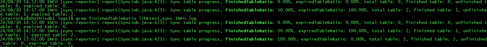

# 跨集群数据迁移工具

StarRocks 跨集群数据迁移工具是社区提供的 StarRocks 数据迁移工具。您可以使用该工具将数据从源集群一键式迁移到目标集群。

:::note

- StarRocks 跨集群数据迁移工具仅支持从存算一体集群迁移数据到存算一体集群或者存算分离集群。
- 数据迁移的目标集群必须为 v3.1.8 或 v3.2.3 及以上版本。

:::

## 准备工作

以下准备工作需要在数据迁移的目标集群中进行。

### 开启迁移旧版本兼容

新旧版本的集群间可能存在行为差异，从而导致跨集群数据迁移时出现问题。因此在数据迁移前，您需要为目标集群开启旧版本兼容，并在数据迁移完成后关闭。

1. 您可以通过以下语句查看当前集群是否开启旧版本兼容：

   ```SQL
   ADMIN SHOW FRONTEND CONFIG LIKE 'enable_legacy_compatibility_for_replication';
   ```

   如果返回值为 `true` 则表示已经开启旧版本兼容。

2. 动态开启旧版本兼容：

   ```SQL
   ADMIN SET FRONTEND CONFIG("enable_legacy_compatibility_for_replication"="true");
   ```

3. 为防止数据迁移过程中集群重启后旧版本兼容自动关闭，您还需要在 FE 配置文件 **fe.conf** 中添加以下配置项：

   ```Properties
   enable_legacy_compatibility_for_replication = true
   ```

数据迁移完成后，您需要删除配置文件中的 `enable_legacy_compatibility_for_replication = true`，并通过以下语句动态关闭旧版本兼容：

```SQL
ADMIN SET FRONTEND CONFIG("enable_legacy_compatibility_for_replication"="false");
```

### 配置数据迁移（可选）

您可以通过以下 FE 和 BE 参数配置数据迁移操作。通常情况下，默认配置即可满足需求。如果您想保留默认配置，可以选择跳过该步骤。

:::note

请注意，增大以下配置项可以加速迁移，但同样会增加源集群负载压力。

:::

#### FE 参数

以下 FE 参数为动态参数。修改方式请参考 [配置 FE 动态参数](../administration/management/FE_configuration.md#配置-fe-动态参数)。

| **参数名**                            | **默认值** | **单位** | **描述**                                                     |
| ------------------------------------- | ---------- | -------- | ------------------------------------------------------------ |
| replication_max_parallel_table_count  | 100        | -        | 允许并发执行的数据同步任务数。StarRocks 为一张表创建一个同步任务。 |
| replication_max_parallel_replica_count| 10240      | -        | 允许并发同步的 tablet 副本数。                               |
| replication_max_parallel_data_size_mb | 1048576    | MB       | 允许并发同步的数据量。                                       |
| replication_transaction_timeout_sec   | 86400      | 秒       | 同步任务的超时时间。                                         |

#### BE 参数

以下 BE 参数为动态参数。修改方式请参考 [配置 BE 动态参数](../administration/management/BE_configuration.md)。

| **参数名**          | **默认值** | **单位** | **描述**                                                     |
| ------------------- | ---------- | -------- | ------------------------------------------------------------ |
| replication_threads | 0          | -        | 执行同步任务的线程数。`0` 表示设置线程数为 BE 所在机器的 CPU 核数的 4 倍。 |

## 第一步：安装工具

推荐您在数据迁移目标集群所在的服务器上安装迁移工具。

1. 打开终端，下载工具安装包。

   ```Bash
   wget https://releases.starrocks.io/starrocks/starrocks-cluster-sync.tar.gz
   ```

2. 解压安装包。

   ```Bash
   tar -xvzf starrocks-cluster-sync.tar.gz
   ```

## 第二步：配置工具

### 迁移相关的配置

进入解压后的文件夹，并修改配置文件 **conf/sync.properties**。

```Bash
cd starrocks-cluster-sync
vi conf/sync.properties
```

文件内容如下：

```Properties
# If true, all tables will be synchronized only once, and the program will exit automatically after completion.
one_time_run_mode=false

source_fe_host=
source_fe_query_port=9030
source_cluster_user=root
source_cluster_password=
source_cluster_password_secret_key=
source_cluster_token=

target_fe_host=
target_fe_query_port=9030
target_cluster_user=root
target_cluster_password=
target_cluster_password_secret_key=

# Comma-separated list of database names or table names like <db_name> or <db_name.table_name>
# example: db1,db2.tbl2,db3
# Effective order: 1. include 2. exclude
include_data_list=
exclude_data_list=

# If there are no special requirements, please maintain the default values for the following configurations.
target_cluster_storage_volume=
target_cluster_replication_num=-1
target_cluster_max_disk_used_percent=80

max_replication_data_size_per_job_in_gb=-1

meta_job_interval_seconds=180
meta_job_threads=4
ddl_job_interval_seconds=10
ddl_job_batch_size=10
ddl_job_allow_drop_target_only=false
ddl_job_allow_drop_schema_change_table=true
ddl_job_allow_drop_inconsistent_partition=true
ddl_job_allow_drop_partition_target_only=true
replication_job_interval_seconds=10
replication_job_batch_size=10
report_interval_seconds=300
```

参数说明如下：

| **参数名**                                | **描述**                                                     |
| ----------------------------------------- | ------------------------------------------------------------ |
| one_time_run_mode                         | 是否开启一次性同步模式。开启一次性同步模式后，迁移工具只进行全量同步，不进行增量同步。 |
| source_fe_host                            | 源集群 FE 的 IP 地址或 FQDN。                                |
| source_fe_query_port                      | 源集群 FE 的查询端口（`query_port`）。                       |
| source_cluster_user                       | 用于登录源集群的用户名。此用户需要有 SYSTEM 级 OPERATE 权限。 |
| source_cluster_password                   | 用于登录源集群的用户密码。                                   |
| source_cluster_password_secret_key        | 用于对源集群登录用户密码加密的密钥。默认值为空，代表不对登录密码进行加密。如果需要对 `source_cluster_password` 加密，可以通过 SQL 语句 `SELECT TO_BASE64(AES_ENCRYPT('<source_cluster_password>','<source_cluster_password_secret_key>'))` 获得加密后的 `source_cluster_password`。 |
| source_cluster_token                      | 源集群的 Token。关于如何获取集群 Token，见以下[获取集群 Token](#获取集群-token)部分。 |
| target_fe_host                            | 目标集群 FE 的 IP 地址或 FQDN。                              |
| target_fe_query_port                      | 目标集群 FE 的查询端口（`query_port`）。                     |
| target_cluster_user                       | 用于登录目标集群的用户名。此用户需要有 SYSTEM 级 OPERATE 权限。 |
| target_cluster_password                   | 用于登录目标集群的用户密码。                                 |
| target_cluster_password_secret_key        | 用于对目标集群登录用户密码加密的密钥。默认值为空，代表不对登录密码进行加密。如果需要对 `target_cluster_password` 加密，可以通过 SQL 语句 `SELECT TO_BASE64(AES_ENCRYPT('<target_cluster_password>','<target_cluster_password_secret_key>'))` 获得加密后的 `target_cluster_password`。 |
| include_data_list                         | 需要迁移的数据库和表，多个对象使用逗号（`,`）分隔。示例：`db1,db2.tbl2,db3`。此项优先于 `exclude_data_list` 生效。如果您需要迁移集群中所有数据库和表，则无须配置该项。 |
| exclude_data_list                         | 不需要迁移的数据库和表，多个对象使用逗号（`,`）分隔。示例：`db1,db2.tbl2,db3`。`include_data_list` 优先于此项生效。如果您需要迁移集群中所有数据库和表，则无须配置该项。 |
| target_cluster_storage_volume             | 目标集群为存算分离集群时，建表使用的 Storage Volume。使用默认 Storage Volume 时无须配置该项。|
| target_cluster_replication_num            | 目标集群建表使用的副本数（replication number）。默认值表示使用与源集群相同的副本数。|
| target_cluster_max_disk_used_percent      | 目标集群为存算一体时，目标集群 BE 节点磁盘使用百分比阈值。当目标集群中有任意一个 BE 的磁盘使用量超过个该阈值则终止同步。默认值为 `80`，表示 80%。 |
| meta_job_interval_seconds                 | 迁移工具获取源集群和目标集群元数据的周期，单位为秒。此项您可以使用默认值。 |
| meta_job_threads                          | 迁移工具获取源集群和目标集群元数据使用的线程数。此项您可以使用默认值。 |
| ddl_job_interval_seconds                  | 迁移工具在目标集群执行 DDL 的周期，单位为秒。此项您可以使用默认值。 |
| ddl_job_batch_size                        | 迁移工具在目标集群执行 DDL 的批大小。此项您可以使用默认值。  |
| ddl_job_allow_drop_target_only            | 迁移工具是否自动删除仅在目标集群存在而源集群不存在的数据库或表。默认为 `false`，即不删除。此项您可以使用默认值。 |
| ddl_job_allow_drop_schema_change_table    | 迁移工具是否自动删除源集群和目标集群 Schema 不一致的表，默认为 `true`，即删除。此项您可以使用默认值。迁移工具会在同步过程中自动同步删除的表。 |
| ddl_job_allow_drop_inconsistent_partition | 迁移工具是否自动删除源集群和目标集群数据分布方式不一致的分区，默认为 `true`，即删除。此项您可以使用默认值。迁移工具会在同步过程中自动同步删除的分区。 |
| ddl_job_allow_drop_partition_target_only  | 迁移工具是否自动删除目标集群上在源集群中已删除的分区，保持目标集群与源集群上表的分区一致。默认为 `true`，即删除。此项您可以使用默认值。 |
| replication_job_interval_seconds          | 迁移工具触发数据同步任务的周期，单位为秒。此项您可以使用默认值。 |
| replication_job_batch_size                | 迁移工具触发数据同步任务的批大小。此项您可以使用默认值。 |
| max_replication_data_size_per_job_in_gb   | 迁移工具触发数据同步任务的（分区）数据大小阈值。单位：GB。如果要迁移的数据大小超过此值，将触发多个数据同步任务。默认值为 `-1`，表示没有限制，即一个数据同步任务同步一个表的所有分区。如果要迁移的表的数据量较大，可以设置此参数来限制每个任务的数据大小。 |
| report_interval_seconds                   | 迁移工具打印 Progress 信息的周期。单位：秒。默认值：`300`。此项您可以使用默认值。 |

### 获取集群 Token

通过 FE 节点的元数据获取集群 Token。登录  FE 节点所在的服务器，运行以下命令：

```Bash
cat fe/meta/image/VERSION | grep token
```

返回如下：

```Properties
token=wwwwwwww-xxxx-yyyy-zzzz-uuuuuuuuuu
```

### 网络相关的配置（可选）

在数据迁移期间，迁移工具需要访问源和目标集群的**所有** FE 节点，并且目标集群需要访问源集群的**所有** BE 和 CN 节点。

您可以通过在相应集群上执行以下语句来获取这些节点的网络地址：

```SQL
-- 获取集群中 FE 节点的网络地址。
SHOW FRONTENDS;
-- 获取集群中 BE 节点的网络地址。
SHOW BACKENDS;
-- 获取集群中 CN 节点的网络地址。
SHOW COMPUTE NODES;
```

如果这些节点使用了无法从集群外部访问的私有地址（例如 Kubernetes 集群的内部网络地址），您需要将这些私有地址映射到可以从外部访问的地址。

进入解压后的文件夹，并修改配置文件 **conf/hosts.properties**。

```Bash
cd starrocks-cluster-sync
vi conf/hosts.properties
```

默认文件内容如下，说明了网络地址映射的配置方式：

```Properties
# <SOURCE/TARGET>_<domain>=<IP>
```

以下示例执行如下操作：

1. 将源集群的私有网络地址 `192.1.1.1` 和 `192.1.1.2` 映射到 `10.1.1.1` 和 `10.1.1.2`。
2. 将目标集群的私有网络地址 `fe-0.starrocks.svc.cluster.local` 映射到 `10.1.2.1`。

```Properties
# <SOURCE/TARGET>_<domain>=<IP>
SOURCE_192.1.1.1=10.1.1.1
SOURCE_192.1.1.2=10.1.1.2
TARGET_fe-0.starrocks.svc.cluster.local=10.1.2.1
```

## 第三步：启动迁移工具

配置完成后，启动迁移工具开始数据迁移。

```Bash
./bin/start.sh
```

:::note

- 请务必确保源集群与目标集群的 BE 节点已通过网络连通。
- 运行期间，迁移工具会周期性地检查目标集群的数据是否落后于源集群，如果落后则会发起数据迁移任务。
- 如果源集群持续有新数据导入，数据同步会一直进行，直至目标集群与源集群数据一致。
- 您可以查询目标集群中处于迁移过程中的表，但请不要导入新数据（当前迁移工具未禁止导入），否则会导致目标集群数据与源集群不一致。
- 请注意数据迁移不会自动结束。您需要手动检查确认迁移完成后停止迁移工具。

:::

## 查看迁移进度

### 查看迁移工具日志

您可以通过迁移工具日志 **log/sync.INFO.log** 查看迁移进度。

示例 1：查看任务进度


主要指标如下：

- `Sync job progress`：数据迁移进度。由于迁移工具会周期性地检查目标集群的数据是否落后于源集群，所以当进度为 100% 时，仅代表当前检查周期内数据同步完成。如果源集群持续有新数据导入，该进度可能在下次检查周期内变小。
- `total`：本次迁移操作的各类 Job 总数。
- `ddlPending`：所有待执行的 DDL Job 数量。
- `jobPending`：所有待执行的数据同步 Job 数量。
- `sent`：已从源集群发送但未开始运行的数据同步 Job 数量。理论上该值不会太大，若出现该值持续增加的情况，请联系研发人员。
- `running`：正在执行的数据同步 Job 数量。
- `finished`：执行成功的数据同步 Job 数量。
- `failed`：执行失败的数据同步 Job 数量。失败的数据同步 Job 将会重新发送。因此，通常情况下您可以忽略该指标。若出现该值较大的情况，请联系研发人员。
- `unknown`：未知状态 Job 的数量。理论上该值恒常为 `0`。若出现该值不为 `0` 的情况，请联系研发人员。

示例 2：查看表迁移进度



- `Sync table progress`：表迁移进度。本次迁移任务中已经完成迁移的表在所有需要迁移的表的占比。
- `finishedTableRatio`: 至少有一次同步任务执行成功过的数据表占比.
- `expiredTableRatio`: 数据过期的数据表占比.
- `total table`: 此次数据迁移涉及的数据表总数。
- `finished table`: 至少有一次同步任务执行成功过的数据表数量。
- `unfinished table`: 还未进行过数据同步的数据表数量。
- `expired table`: 数据过期的数据表数量。

### 查看迁移事务状态

迁移工具会为每张表开启一个事务。您可以通过查看该事务的状态了解该表迁移的状态。

```SQL
SHOW PROC "/transactions/<db_name>/running";
```

其中 `<db_name>` 为该表所在数据库的名称。

### 查看分区数据版本

您可以对比源集群和目标集群中对应分区的数据版本了解该分区的迁移状态。

```SQL
SHOW PARTITIONS FROM <table_name>;
```

其中 `<table_name>` 为该分区所属表的名称。

### 查看数据量

您可以对比源集群和目标集群的数据量了解迁移的状态。

```SQL
SHOW DATA;
```

### 查看表行数

您可以对比源集群和目标集群中表的行数了解各表迁移的状态。

```SQL
SELECT 
  TABLE_NAME, 
  TABLE_ROWS 
FROM INFORMATION_SCHEMA.TABLES 
WHERE TABLE_TYPE = 'BASE TABLE' 
ORDER BY TABLE_NAME;
```

## 使用限制

当前版本支持同步的对象列表如下，未包含的则表示不支持同步：

- 数据库
- 内表及其数据
- 物化视图表结构及构建语句（物化视图中的数据不会被同步。并且如果物化视图对应的基表没有同步到目标集群，则物化视图后台刷新任务报错。）
- 逻辑视图

## Q&A

### Q1：集群间需要开通哪些端口？

如果您开启了防火墙，则需要开通以下端口：

| **组件**     | **端口**       | **默认端口**  |
| ----------- | -------------- | ----------- |
| FE          | query_port     | 9030 |
| FE          | http_port      | 8030 |
| FE          | rpc_port       | 9020 |
| BE          | be_http_port   | 8040 |
| BE          | be_port        | 9060 |
