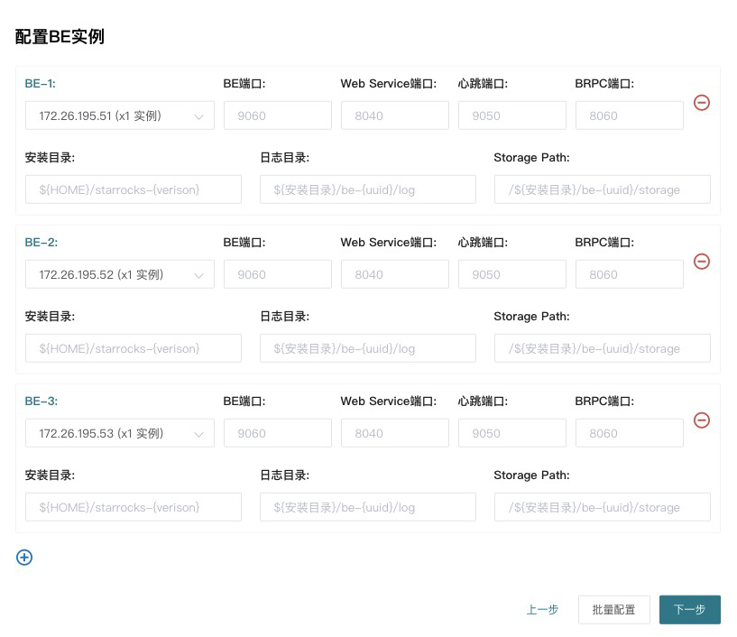

# 通过 StarRocks Manager 自动部署 StarRocks 集群

本文介绍如何使用 StarRocks Manager 自动部署 StarRocks 集群。

> **说明**
>
> StarRocks Manager 为企业版功能，如需试用，请至 [下载页面](https://www.mirrorship.cn/zh-CN/download/community) 下方点击「现在咨询」获取。

## 前提条件

您需要在所有拟部署 StarRocks 的节点上安装以下依赖：

|依赖|说明|
|----|----|
|Python（2.7 或以上）|Linux操作系统自带的 Python 2 版本已满足 Manager 部署要求。 |
|python-setuptools|可执行 `easy_install --version` 命令进行检查，有返回值即可，对版本无特别要求。若无返回值，您可以通过 `yum install setuptools` 或 `apt-get install setuptools` 安装。|
|MySQL（5.5 或以上）|您需要通过 MySQL 存储 StarRocks Manager 平台的数据。|

## 安装 StarRocks Manager

下载并解压 StarRocks Manager 安装包。

解压完成后，安装 StarRocks Manager。

```shell
bin/install.sh -h \
-d /home/disk1/starrocks/starrocks-manager-20200101 \
-y  /usr/bin/python -p 19321 -s 19320
```

* `-d`：StarRocks Manager 的安装路径。
* `-y`：Python 路径。
* `-p`：`admin_console_port`，默认为 `19321`。
* `-s`：`supervisor_http_port`，默认为 `19320`。

## 安装部署 StarRocks

完成安装 StarRocks Manager 后，您可以在 Web 页面中安装部署 StarRocks 集群。

### 配置 MySQL 数据库

首先，您需要配置一个安装好的 MySQL 数据库，用于存储 StarRocks Manager 的管理、查询、报警等信息。


### 配置节点信息

添加需要部署的节点，并配置 Agent 和 Supervisor 安装目录和端口，Python 路径以及其他信息。

> 说明
> Agent 负责采集机器的统计信息，Supervisor 管理进程的启动与停止。两者均安装在用户环境，不会影响系统环境。


### 安装 FE 节点

配置 FE 节点相关信息。端口的含义参考下方[端口列表](#端口列表)。

建议您配置 3 个 Follower FE。如果请求压力较大，建议您酌情增加 Observer FE  数量。


`Meta Dir`：StarRocks 的元数据目录。建议您配置独立的 **meta** 和 FE 节点 log 目录。

### 安装 BE 节点

配置 FE 节点相关信息。端口的含义参考下方[端口列表](#端口列表)。



### 安装 Broker

建议您在所有 BE 节点上安装 Broker。端口的含义参考下方[端口列表](#端口列表)。


### 安装中心服务

中心服务负责从 Agent 拉取并汇总信息后存储在 MySQL 中，并提供监控报警的服务。此处邮件服务是指通过邮箱接收报警通知。邮件服务可以稍后配置。

配置中心服务以及邮件服务的相关信息。


## 端口列表

|实例名称|端口名称|默认端口|通讯方向|说明|
|---|---|---|---|---|
|BE|be_port|9060|FE --&gt; BE|BE 上 thrift server 的端口，<br/>用于接收来自 FE 的请求。|
|BE|be_http_port|8040|BE &lt;--&gt; BE|BE 上的 http server 的端口。|
|BE|heartbeat_service_port|9050|FE --&gt; BE|BE 上心跳服务端口（thrift），<br/>用于接收来自 FE 的心跳。|
|BE|brpc_port|8060|BE &lt;--&gt; BE|BE 上的 bRPC 端口，<br/>用于 BE 之间通讯。|
|FE|**http_port**|**8030**|FE &lt;--&gt; 用户|FE 上的 http server 端口。|
|FE|rpc_port|9020|BE --&gt; FE<br/> FE &lt;--&gt; FE|FE 上的 thrift server 端口。|
|FE|**query_port**|**9030**| FE &lt;--&gt; 用户|FE 上的 mysql server 端口。|
|FE|edit_log_port|9010|FE &lt;--&gt; FE|FE 上的 BDBJE 之间通信端口。|
|Broker|broker_ipc_port|8000|FE --&gt; Broker <br/>BE --&gt; Broker|Broker 上的 thrift server，<br/>用于接收请求。|
|Drms|admin_console_port|19321|Drms对外|对外Web端口，nginx做了端口转发|
|Supervisor|supervisor_http_port|19320/19319|supervisor内部|supervisor管理进程|
|Agent|agent_port|19323|Agent --&gt; Center|Agent和center service通讯，用户上报监控信息|

其中 `http_port`、`query_port` 是常用端口，前者用于网页访问 FE，后者用于 MySQL 客户端访问。

## FAQ

**Q**：如何设置 `ulimit`？

**A**：您可以通过在**所有机器**上运行 `ulimit -n 65536` 命令设置。如果系统提示您“没有权限”，请尝试以下方案：
  
首先，请在 **/etc/security/limits.conf** 添加如下配置：
  
```Plain Text
# 4个元素，具体可以参考 limits.conf 中的说明，*代表所有用户。
* soft nofile 65535
* hard nofile 65535
```
  
然后，请在 **/etc/pam.d/login** 和 **/etc/pam.d/sshd** 中添加如下配置：
  
```Plain Text
session  required  pam_limits.so
```
  
最后，请确认 **/etc/ssh/sshd_config** 中存在 **UsePAM yes**。如果没有，请添加该参数，并运行 `restart sshd`。

**Q**：安装 Python 时遇到问题 `__init__() takes 2 arguments (4 given)`，如何处理？

**A**：如果在安装 Python 时遇到问题 `__init__() takes 2 arguments (4 given)`，请执行如下步骤：

首先，请运行 `which python` 命令确认 Python 安装路径为 **/usr/bin/python**。

然后，请删除 python-setuptools 安装包：

```shell
yum remove python-setuptools
```

接下来，请删除 setuptool 相关文件。

```shell
rm /usr/lib/python2.7/site-packages/setuptool* -rf
```

最后，您需要获取 **ez_setup.py** 文件。

```shell
wget https://bootstrap.pypa.io/ez_setup.py -O - | python
```
