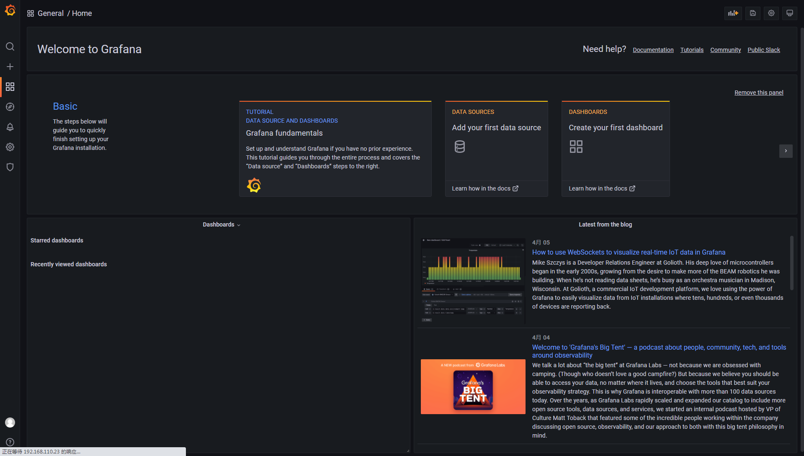
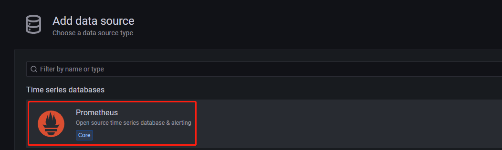
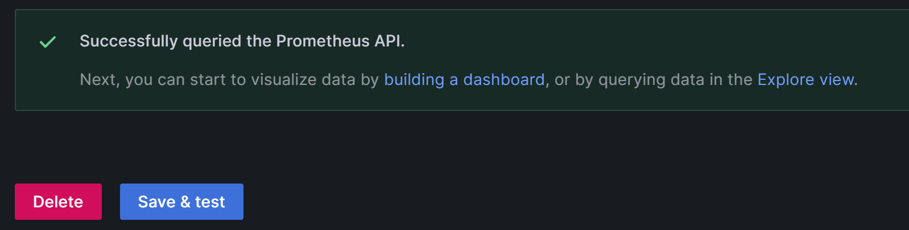
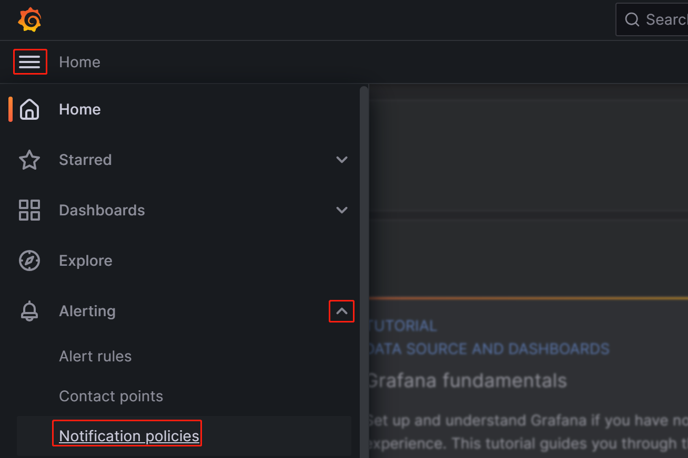
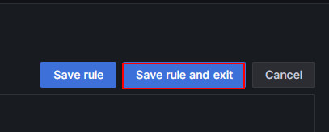

# 使用 Prometheus 和 Grafana 监控报警

StarRocks 支持基于 Prometheus 和 Grafana 实现可视化监控。该方式允许您可视化集群的运行情况，便于监控和故障排除。

## 概述

StarRocks 提供了兼容 Prometheus 的信息采集接口，Prometheus 可以通过连接 BE 和 FE 节点的 HTTP 端口来获取集群监控指标的指标信息，存储在自身的时序数据库中。Grafana 则可以将 Prometheus 作为数据源将指标信息可视化。搭配 StarRocks 提供的 Dashboard 模板，您可以便捷的实现 StarRocks 集群监控指标的统计展示和阈值报警。


具体操作按照以下步骤展开：

1. 安装监控组件
2. 理解核心监控项
3. 配置邮件报警

## 一、安装监控组件

默认情况下，Prometheus 和 Grafana 的端口不与 StarRocks 的端口冲突，但建议您将生产集群的监控组件单独部署，以此减少服务资源占用冲突，同时规避混合部署导致当前服务器异常宕机而外部无法及时感知的风险。

此外，Prometheus 和 Grafana 是无法监控自身服务的存活状态的，因此生产环境中建议您搭配 Supervisor 设置心跳服务，以下不做展开。

以下教程在监控节点（IP：192.168.110.23）使用操作系统 root 用户部署监控组件，对以下 StarRocks 集群进行监控（StarRocks 集群使用默认端口）。您在参考该指南为自己的集群配置监控时，通常只需替换 IP。

| Host   | IP              | 操作系统用户 | 部署服务  |
| ------ | --------------- | ------------ | ----------- |
| node01 | 192.168.110.101 | root         | 1 FE + 1 BE |
| node02 | 192.168.110.102 | root         | 1 FE + 1 BE |
| node03 | 192.168.110.103 | root         | 1 FE + 1 BE |

> **说明**
>
> Prometheus+Grafana 当前只能监控 StarRocks 的 FE、BE 和 CN 节点，不能监控 Broker 节点。

### 1.1 部署 Prometheus

#### 1.1.1 下载 Prometheus

StarRocks 的监控报警服务只需要使用 Prometheus 的 Server 安装包。您只需将安装包下载至监控节点。

[点此下载 Prometheus](https://prometheus.io/download/)。

以 LTS 版本 v2.45.0 为例，直接点击下载。


您也可以运行以下命令通过 `wget` 下载 Prometheus：

```Bash
# 此处以 LTS 版本 v2.45.0 为例。您也可以替换命令行中的版本号下载其他版本。
wget https://github.com/prometheus/prometheus/releases/download/v2.45.0/prometheus-2.45.0.linux-amd64.tar.gz
```

在下载完成后，将安装包上传或拷贝至监控节点的 **/opt** 路径下。

#### 1.1.2 安装 Prometheus

1. 进入 **/opt** 路径下，解压 Prometheus 安装包。

   ```Bash
   cd /opt
   tar xvf prometheus-2.45.0.linux-amd64.tar.gz
   ```

2. 为方便后续管理，将解压缩后的路径重命名为 **prometheus**:

   ```Bash
   mv prometheus-2.45.0.linux-amd64 prometheus
   ```

3. 为 Prometheus 创建数据存储路径。

   ```Bash
   mkdir prometheus/data
   ```

4. 由于 Prometheus 官方只提供了二进制文件压缩包，为了方便管理，您可以为 Prometheus 创建系统服务启动文件。

   ```Bash
   vim /etc/systemd/system/prometheus.service
   ```

   在文件中添加以下内容：

   ```Properties
   [Unit]
   Description=Prometheus service
   After=network.target

   [Service]
   User=root
   Type=simple
   ExecReload=/bin/sh -c "/bin/kill -1 `/usr/bin/pgrep prometheus`"
   ExecStop=/bin/sh -c "/bin/kill -9 `/usr/bin/pgrep prometheus`"
   ExecStart=/opt/prometheus/prometheus --config.file=/opt/prometheus/prometheus.yml --storage.tsdb.path=/opt/prometheus/data --storage.tsdb.retention.time=30d --storage.tsdb.retention.size=30GB

   [Install]
   WantedBy=multi-user.target
   ```

   添加完成后保存退出。

   > **说明**
   >
   > 如果您使用其他路径部署 Prometheus，请注意同步修改以上文件中 ExecStart 命令的路径。此外，以上文件在启动参数中还配置了 Prometheus 中数据存储的过期条件为 “30 天以上” 或 “大于 30 GB”，您可以按需修改。

5. 修改 Prometheus 配置文件 **prometheus/prometheus.yml**。由于该文件对于配置内容的格式要求严格，请在修改时特别注意空格和缩进。

   ```Bash
   vim prometheus/prometheus.yml
   ```

   在文件中添加以下内容：

   ```YAML
   global:
     scrape_interval: 15s # 全局的采集间隔，默认是 1 min，此处设置为 15 sec。
     evaluation_interval: 15s # 全局的规则触发间隔，默认是 1 min，此处设置为 15 sec。

   scrape_configs:
     - job_name: 'StarRocks_Cluster01' # 监控每一个集群称之为一个 job，您可以在此自定义 StarRocks 集群名。
       metrics_path: '/metrics'    # 指定获取监控项目的 Restful API。
 
       static_configs:
       # 当前部分配置了 FE 群组，其中包含了 3 个 FE 节点，您需填写各个 FE 对应的 IP 和 HTTP 端口。
       # 如果您在部署集群时修改过 HTTP 端口，请注意进行调整。
         - targets: ['192.168.110.101:8030','192.168.110.102:8030','192.168.110.103:8030']
           labels:
             group: fe
 
       # 当前部分配置了 BE 群组，其中包含了 3 个 BE 节点，您需填写各个 BE 对应的 IP 和 HTTP 端口。
       # 如果您在部署集群时修改过 HTTP 端口，请注意进行调整。
         - targets: ['192.168.110.101:8040','192.168.110.102:8040','192.168.110.103:8040']
           labels:
             group: be
   ```

   配置文件修改完成后，您可以使用 `promtool` 检查配置文件语法是否合规。

   ```Bash
   ./prometheus/promtool check config prometheus/prometheus.yml
   ```

   当看到以下提示，确认检查通过后，再执行后续操作。

   ```Bash
   SUCCESS: prometheus/prometheus.yml is valid prometheus config file syntax
   ```

6. 启动 Prometheus。

   ```Bash
   systemctl daemon-reload
   systemctl start prometheus.service
   ```

7. 查看服务状态。

   ```Bash
   systemctl status prometheus.service
   ```

   如果显示 `Active: active (running)` 即表明 Prometheus 启动成功。

   您还可以通过 `netstat` 命令查看 Prometheus 默认端口（9090）的状态。

   ```Bash
   netstat -nltp | grep 9090
   ```

8. 为 Prometheus 设置开机启动。

   ```Bash
   systemctl enable prometheus.service
   ```

**其他相关命令**：

- 停止 Prometheus。

  ```Bash
  systemctl stop prometheus.service
  ```

- 重启 Prometheus。

  ```Bash
  systemctl restart prometheus.service
  ```

- 热加载配置。

  ```Bash
  systemctl reload prometheus.service
  ```

- 禁用开机启动。

  ```Bash
  systemctl disable prometheus.service
  ```

#### 1.1.3 访问 Prometheus

您可以通过浏览器访问 Prometheus 的 Web UI，默认端口为 9090。以本教程中的监控节点为例，您需要访问`192.168.110.23:9090`。

在 UI 主页的导航栏中选择 **Status**-->**Targets**，您可以看到配置文件 **prometheus.yml** 中所有分组 Job 的监控主机节点。正常情况下，所有节点都应为 UP，表示服务通信正常。


至此，Prometheus 配置完成。详细信息可以参阅 [Prometheus 官方文档](https://prometheus.io/docs/introduction/overview/)。

### 1.2 部署 Grafana

#### 1.2.1 下载 Grafana

[点此下载 Grafana](https://grafana.com/grafana/download)。

您也可以运行以下命令通过 `wget` 下载 Grafana 的 RPM 安装包。

```Bash
# 此处以 LTS 版本 v10.0.3 为例。您也可以替换命令行中的版本号下载其他版本。
wget https://dl.grafana.com/enterprise/release/grafana-enterprise-10.0.3-1.x86_64.rpm
```

#### 1.2.2 安装 Grafana

1. 使用 `yum` 命令安装 Grafana，该命令将自动安装 Grafana 所需依赖。

   ```Bash
   yum -y install grafana-enterprise-10.0.3-1.x86_64.rpm
   ```

2. 启动 Grafana。

   ```Bash
   systemctl start grafana-server.service
   ```

3. 查看运行状态。

   ```Bash
   systemctl status grafana-server.service
   ```

   如果显示 `Active: active (running)`，即表明 Grafana 启动成功。

   您还可以通过 `netstat` 命令查看 Grafana 默认端口（3000）的状态。

   ```Bash
   netstat -nltp | grep 3000
   ```

4. 为 Grafana 设置开机启动。

   ```Bash
   systemctl enable grafana-server.service
   ```

**其他相关命令**：

- 停止 Grafana。

  ```Bash
  systemctl stop grafana-server.service
  ```

- 重启 Grafana。

  ```Bash
  systemctl restart grafana-server.service
  ```

- 禁用开机启动。

  ```Bash
  systemctl disable grafana-server.service
  ```

更多信息，请参阅 [Grafana 官方文档](https://grafana.com/docs/grafana/latest/)。

#### 1.2.3 登录 Grafana

您可以通过浏览器访问 Grafana Web UI，默认端口为 3000。以本教程中的监控节点为例，您需要访问 `192.168.110.23:3000`。登录所需的用户名密码默认均为 `admin`。初次登录时，Grafana 会提示您修改默认的登录密码，若暂时不希望修改密码，可以点击 **Skip** 跳过。然后即可进入到 Grafana Web UI 主页。



#### 1.2.4 配置数据源

点击左上角菜单按钮，展开 **Administration**，然后选择 **Data sources**。


在出现的页面中点击 **Add data source**，然后选择 **Prometheus**。




为了将 Grafana 与您的 Prometheus 服务集成，您需要修改以下配置：

- **Name**：数据源的名称。您可以为数据源自定义名称。

  

- **Prometheus Server URL**：Prometheus 服务器的 URL，此教程中为 `http://192.168.110.23:9090`。

  

配置完成后，点击 **Save & test** 保存并测试配置项。如果显示 **Successfully queried the Prometheus API**，即表明数据源可用。



#### 1.2.5 配置 Dashboard

1. 请根据您的 StarRocks 版本下载对应的 Dashboard 模板。

   - [StarRocks-1.19.0 之前版本 Dashboard 模版](http://starrocks-thirdparty.oss-cn-zhangjiakou.aliyuncs.com/StarRocks-Overview.json)
   - [StarRocks-1.19.0 开始到 StarRocks-2.4.0 之前版本 Dashboard 模版](http://starrocks-thirdparty.oss-cn-zhangjiakou.aliyuncs.com/StarRocks-Overview-19.json)
   - [StarRocks-2.4.0 及其之后版本 Dashboard 模版](http://starrocks-thirdparty.oss-cn-zhangjiakou.aliyuncs.com/StarRocks-Overview-24-new.json)
   - [存算分离 Dashboard 模版 - General](http://starrocks-thirdparty.oss-cn-zhangjiakou.aliyuncs.com/StarRocks-Shared_data-General.json)
   - [存算分离 Dashboard 模版 - Starlet](http://starrocks-thirdparty.oss-cn-zhangjiakou.aliyuncs.com/StarRocks-Shared_data-Starlet.json)

   > **注意**
   >
   > 由于模板文件需要通过 Grafana Web UI 上传，所以请将模板文件下载至您用于访问 Grafana 的机器上，而非监控节点本身。

2. 配置 Dashboard 模板。

   点击左上角菜单按钮，选择 **Dashboards**。

   

   在出现的页面上，展开 **New** 按钮，选择 **Import**。

   

   在新页面上点击 **Upload Dashboard JSON file**，上传先前下载的模板文件。

   

   导入后，您可以重新命名 Dashboard，默认是 `StarRocks Overview`。然后需要选择数据源，即之前创建的 `starrocks_monitor`。点击 **Import** 即可完成导入。

   

   导入完成后，您可以看到 StarRocks 的 Dashboard 展示。

   

#### 1.2.6 通过 Grafana 监控 StarRocks

登录 Grafana Web UI，点击左上角菜单按钮，选择 **Dashboards**。


在出现的页面上，从 **General** 目录中选择 **StarRocks Overview**。


进入 StarRocks 的监控 Dashboard 后，您可以在页面右上方手动刷新或设置 Dashboard 的自动刷新间隔来观测 StarRocks 集群状态。


## 二、核心监控项

为了同时满足开发、运维和 DBA 等需求，StarRocks 提供了大量监控指标。本章节仅介绍部分业务常用的重要报警指标，以及它们的报警规则。其他指标内容，请参考 [监控指标](./metrics.md)。

### 2.1 FE/BE状态监控

| **报警项**       | **说明**                                                     | **报警规则**                                                 | **备注**                                            |
| ---------------- | ------------------------------------------------------------ | ------------------------------------------------------------ | --------------------------------------------------- |
| Frontends Status | FE 节点状态。存活（alive）的节点状态为 `1`，宕机（DEAD）的节点会显示为 `0`。 | 所有 FE 节点状态需均为alive，任一 FE 节点状态为 DEAD 都应触发报警。 | FE 或 BE 宕机都属于异常行为，需要及时排查宕机原因。 |
| Backends Status  | BE 节点状态。存活（alive）的节点状态为 `1`，宕机（DEAD）的节点会显示为 `0`。 | 所有 BE 节点状态需均为 alive，任一 BE 节点状态为 DEAD 都应触发报警。 |                                                     |

### 2.2 查询失败监控

| **报警项**  | **说明**                                                     | **报警规则**                                                 | **备注**                                                     |
| ----------- | ------------------------------------------------------------ | ------------------------------------------------------------ | ------------------------------------------------------------ |
| Query Error | 一分钟内失败的查询率（包括 Timeout）。其值即为一分钟内失败的查询条数除以 60 秒。 | 您可以结合业务实际的 QPS 来配置。初步可将该项报警阈值设置在 5% 左右，后续再调整。 | 正常情况下，查询失败率不应太高。将阈值设为 5% 表示每分钟最多允许 3 条查询失败。如果该项报警，您可以排查资源占用情况或合理配置查询超时时间。 |

### 2.3 外部感知失败监控

| **报警项**    | **说明**                   | **报警规则**                                                 | **备注**                                                     |
| ------------- | -------------------------- | ------------------------------------------------------------ | ------------------------------------------------------------ |
| Schema Change | Schema Change 操作失败率。 | 由于 Schema Change 是较低频的操作，建议您将该项配置为出现失败立即报警。 | 正常情况下，Schema Change 操作不应该失败。如果该项报警，您可以调大变更表操作可用的内存上限，默认为 2G。 |

### 2.4 内部操作失败监控

| **报警项**          | **说明**                                                   | **报警规则**                                                 | **备注**                                                     |
| ------------------- | ---------------------------------------------------------- | ------------------------------------------------------------ | ------------------------------------------------------------ |
| BE Compaction Score | 所有 BE 最大的Compaction Score，表示当前 Compaction 压力。 | 通常离线场景下，该值小于 100。但当有大量导入任务存在时，Compaction Score 会有明显增高。通常当该值大于 800 的时候需要干预。 | 通常，Compaction Score大于 1000 时就会报错，StarRocks 会报错 “Too many versions”。您可以调低导入并发和导入频率。 |
| Clone               | BE 的 Clone 任务失败率。                                   | 建议您将该项配置为出现失败立即报警。                         | 如果该项报警，您可以检查 BE 状态、磁盘状态和网络状态。       |

### 2.5 服务可用性监控

| **报警项**     | **说明**                      | **报警规则**                             | **备注**                                                     |
| -------------- | ----------------------------- | ---------------------------------------- | ------------------------------------------------------------ |
| Meta Log Count | FE 节点 BDB 元数据 Log 条数。 | 建议您将该项配置为大于 100000 立即报警。 | Leader FE 节点的 Log 数量默认超过 50000 条会触发 CheckPoint 进行落盘。如果该值远超 50000，通常代表 CheckPoint 失败。您可以排查 **fe.conf** 中的 Xmx 堆内存配置是否合理。 |

### 2.6 机器过载监控项

| **报警项**           | **说明**                                        | **报警规则**                                       | **备注**                                                     |
| -------------------- | ----------------------------------------------- | -------------------------------------------------- | ------------------------------------------------------------ |
| BE CPU Idle          | BE CPU 空闲率。                                 | 建议您将该项配置为空闲率小于 10% 持续30 秒则报警。 | 该项主要用于监测 CPU 资源瓶颈。CPU 占用率的波动性比较大，如果统计间隔太小会导致误报。所以您需要结合业务实际情况调整该项，如果确实存在多个大任务的批量处理或较多的查询，可调低该阈值。 |
| BE Mem               | 各个 BE 节点的内存使用情况。                    | 建议您将该项配置为各个 BE 可用内存大小的90%。      | 该值与 Process Mem 取值相同，BE 默认内存上限为 **be.conf** 中的`mem_limit=90%`，即 BE 所在服务器内存的 90%。如果您同时在该服务器上混部其他服务，请注意调整该值，避免 OOM。而该项的报警阈值则需要设为该上限的 90%，以确认 BE 内存资源是否已达到瓶颈。 |
| Disks Avail Capacity | 各 BE 节点本地磁盘容量可用比例（百分比）。      | 建议您将该项配置为小于 20% 立即报警。              | 建议您根据业务需求为集群保留充足可用空间。                   |
| FE JVM Heap Stat     | StarRocks 集群各个 FE 的 JVM 堆内存使用百分比。 | 建议您将该项配置为大于等于 80% 立即报警。          | 堆内存报警后建议调大 **fe.conf** 中的 Xmx 堆内存，否则容易影响查询效率或出现 FE OOM。 |

## 三、配置邮件报警

### 3.1 配置 SMTP 服务

Grafana 支持通过邮件、Webhook 等多种报警方案。本教程以邮件报警为例。

如需启用邮件报警，您首先需要在 Grafana 中配置 SMTP 信息，允许 Grafana 向您的邮箱发送邮件。常用的邮箱都支持 SMTP 服务，您需要提前为邮箱开启 SMTP 服务并获取授权码。

完成以上步骤后，在部署 Grafana 的节点上，修改 Grafana 配置文件。

```bash
vim /usr/share/grafana/conf/defaults.ini
```

示例：

```Properties
###################### SMTP / Emailing #####################
[smtp]
enabled = true
host = <smtp_server_address_and_port>
user = johndoe@gmail.com
# If the password contains # or ; you have to wrap it with triple quotes.Ex """#password;"""
password = ABCDEFGHIJKLMNOP  # 开启邮箱 SMTP 后获取到的授权密码。
cert_file =
key_file =
skip_verify = true  ## Verify SSL for SMTP server
from_address = johndoe@gmail.com  ## Address used when sending out emails.
from_name = Grafana
ehlo_identity =
startTLS_policy =

[emails]
welcome_email_on_sign_up = false
templates_pattern = emails/*.html, emails/*.txt
content_types = text/html
```

您需要修改以下配置项：

- `enabled`：是否允许 Grafana 发送邮件报警。将此项设置为 `true`。
- `host`：如果启用 SMTP，请填写您邮箱的 SMTP 服务器地址及端口，用冒号（`:`）分隔。示例：`smtp.gmail.com:465`。
- `user`：SMTP 用户名。
- `password`：开启 SMTP 后获取到的授权密码。
- `skip_verify`：是否跳过 SMTP 服务器的 SSL 验证。将此项设置为 `true`。
- `from_address`：用于发送报警邮件的邮箱地址。

配置完成后，重启 Grafana。

```bash
systemctl daemon-reload
systemctl restart grafana-server.service
```

### 3.2 创建报警渠道

您需要在 Grafana 中创建报警渠道（Contact Point）以选择报警触发时通知联系人的方式。

1. 登录 Grafana Web UI，点击左上角菜单按钮，展开 **Alerting**，选择 **Contact Points**。在  **Contact points** 页面点击 **Add contact point** 按钮创建新的报警渠道。

   

2. 在 **Name** 字段中自定义报警渠道的名称，然后在 **Integration** 下拉菜单中，选择 **Email**。

   

3. 在 **Addresses** 字段中输入接收报警用户的邮箱地址。当邮件收件人为多个邮箱地址使用分号（`;`），逗号（`,`）或者换行分隔。

   页面中其他的配置都可先使用默认值。但您需要配置以下两个选项：

   - **Single email**：在启用后，当目标收件人是多个时，报警邮件会通过一封邮件发出。通常建议启用该选项。
   - **Disable resolved message**：在默认情况下，当报警涉及的项恢复时，Grafana 会再发送一次报警提示服务恢复，若您不需要这个恢复提示，可以勾选该选项禁用。通常不建议禁用该选项。

4. 配置完成后，点击页面右上方的 **Test** 按钮，再点击弹出框中的 **Sent test notification**。若您的 SMTP 服务和地址配置都正确，目标邮箱中就可以收到标题为 **TestAlert Grafana** 的提示邮件。确认可以正常收到报警提示邮件后，点击页面下方的 **Save contact point** 按钮完成配置。

   

   

每个报警渠道都允许通过 **Add contact point integration** 来配置多种通知方式的，以下不再展开。关于 Contact points 的更多细节，可参考 [Grafana 官方文档](https://grafana.com/docs/grafana-cloud/alerting-and-irm/alerting/fundamentals/notifications/contact-points/)

为了便于后续演示，假设您在这一步使用不同的邮箱创建了 “**StarRocksDev**” 和 “**StarRocksOp**” 两个报警渠道。

### 3.3 设置通知策略

Grafana 通过通知策略（Notification policies）来关联报警渠道和报警规则（Alert rule）。通知策略使用标签匹配器（Matching label）提供了一种将不同报警路由到不同接收者的灵活方法，可以实现运维过程中常规的报警分组（Alert group）。

1. 登录 Grafana Web UI，点击左上角菜单按钮，展开 **Alerting**，选择 **Notification policies**。

   

2. 在 **Notification policies** 页面，点击 **Default policy** 右边的更多（**...**）图标，选择 **Edit** 以编辑 Default policy。

   

   

   Notification policies 使用树状结构，Default policy 即表示默认的根策略。在未设置其他策略时，所有的报警规则都会默认匹配至该策略，然后使用其中配置的默认报警渠道（Default contact point）进行报警。

   1. 首先在 **Default contact point** 字段中选择前面创建好的报警渠道，例如先前创建的 “StarRocksOp”。

   2. 分组（**Group by**）是 Grafana Alerting 中的一个关键概念，它会将具有相似性质的报警实例分类到单个漏斗中。当前演示的场景暂时不考虑分组，您可以使用默认的分组。

      

   3. 展开 **Timing options** 字段，配置 **Group wait**、**Group interval** 和 **Repeat interval**。

      - **Group wait**：从新报警创建新 Group 到发送初始通知的等待时间。默认为 30 秒。
      - **Group interval**：为已有 Group 发送报警的最小间隔时间。默认为 5 分钟，即从上次发送报警起，无论该 Group 报警规则间隔是否更低，通知都不会在 5 分钟（默认值）内发送。
      - **Repeat interval**：在上一次报警成功发送后，重新发送报警的等待时间。默认为 4 小时，即报警通知将每 4 小时（默认值）重新发送一次。

      针对 StarRocks 集群，您可以将以上参数按照下图配置，其效果为：在**满足报警条件**后的 0 秒（Group wait），Grafana 会首次发送报警邮件，之后每经过 1 分钟（Group interval + Repeat interval），会再次发送报警邮件。

      

      > **说明**
      >
      > 上文提到的是“满足报警条件”而非“达到报警阈值”，这是因为为了避免误报警，在配置报警规则时，通常需要设置为“触发报警阈值”后持续一段时间才视为“满足报警条件”。

3. 配置完成后，点击 **Update default policy**。

4. 如果您需要继续创建一个子策略（nested policy），在 **Notification policies** 页面点击 **New nested policy**。

   子策略使用 Label 表示匹配规则。在子策略中定义的 Label，可以在后续配置报警规则时作为条件进行匹配。以下示例配置 Label 为 `Group=Development_team`。

   

   在 **Contact point** 字段中，选择报警渠道为“StarRocksDev”。如此，后续在报警规则中配置 Label 为`Group=Development_team` 的报警项，就会使用“StarRocksDev”这个渠道进行报警。

   您可以让子策略继承父策略的 Timing options。配置完成后点击 **Save policy** 保存策略。

   

如果您对通知策略的细节感兴趣，或者业务中有更复杂的报警场景要求，可以参考[官方文档](https://grafana.com/docs/grafana/latest/alerting/fundamentals/notification-policies/notifications/)。

### 3.4 创建报警规则

通知策略设置完成后，您还需要为 StarRocks 设置报警规则。

登录 Grafana Web UI，在页面顶部的搜索栏中搜索并快速访问先前配置的 StarRocks Overview Dashboard。


#### 3.4.1 FE/BE 异常监控

对于 StarRocks 集群，所有 FE 和 BE 节点状态都必须为 alive，任一节点状态为 DEAD 都应触发报警，以便运维或开发人员及时排查异常原因。

为方便演示，以下示例选用 StarRocks Overview 下的 Frontends Status 和 Backends Status 指标项配置对 FE 和 BE 的状态监控。由于您可以在 Prometheus 中配置多套 StarRocks 集群，因此需注意 Frontends Status 和 Backends Status 指标项是针对全部集群的而非单个集群的。如果您需要针对单套集群进行配置，可以使用 Cluster Overview 下的监控项自行配置。

##### 配置 FE 报警规则

按照以下步骤对 **Frontends Status** 配置报警：

1. 点击 **Frontends Status** 监控项右边的更多（**...**）图标，选择 **Edit**。

   

2. 在新的页面中选择 **Alert**，然后点击 **Create alert rule from this panel** 进入规则创建页面。

   

3. 在 **Rule name** 字段设置规则名称。默认取值为监控项的 title。如果您有多个集群，则可以添加集群名作为前缀进行区分。

   

4. 设置报警规则。

   1. 选择 **Grafana managed alert**。
   2. 对于 B 区域，修改规则为 `(up{group="fe"})`。
   3. 点击 A 区域右边的删除图标以删除 A 区域。
   4. 对于 C 区域，修改 **Input** 字段为 **B**。
   5. 对于 D 区域，修改条件为 **IS BELOW 1**。

   设置完成后，页面如下图所示：

   

   <details>
     <summary>点击查看**详细说明**</summary>

   在 Grafana 中配置报警规则通常可分为三步：

   1. 通过 PromQL 查询获取 Prometheus 中指标项的值。PromQL 是 Prometheus 自己开发的数据查询 DSL 语言，在 Dashboard 的 JSON 模板中也有使用到。每个监控项的 `expr` 属性即为对应的 PromQL。您可以在规则设置页面点击 **Run queries** 按钮查看查询结果。
   2. 对以上查询的结果数据做函数和模式的处理。通常您需要使用 Last 函数获取最新的值，使用 Strict 严格模式来保证若返回值为非数值数据可以展示为 `NaN`。
   3. 对处理过的查询结果设置判断规则。以 FE 为例，如果 FE 节点状态正常，则输出结果为 `1`。若 FE 节点宕机，则结果为 `0`。因此您可以设置判断规则为“小于1”，即 **IS BELOW 1**，出现该情况时即会触发报警。
   </details>

5. 设置报警评估规则。

   根据 Grafana 文档，您需要配置评估报警规则的频率以及更改其状态的速度。简单来说就是配置“多久使用上面的报警规则进行一次检查”，以及“发现异常后，这个异常情况持续多久才触发报警（避免单次的抖动引起误报）”。每个 Evaluation group 都包含一个独立的评估间隔，用于确定检查报警规则的频率。您可以单独为 StarRocks 生产集群创建新的文件夹 **PROD**，并在其中创建新的 Evaluation group `01`。然后，为该组配置检查周期为每 `10` 秒一次，异常持续 `30` 秒后“满足报警条件”触发报警。

   

   > **说明**
   >
   > 先前配置报警渠道章节中提到的 Disable resolved message 选项，在集群“对应服务异常恢复”到“发送服务恢复”的邮件的时间受上图 **Evaluate every** 参数影响，也即 Grafana 进行新的检查发现服务恢复后，就会触发邮件发送。

6. 添加报警说明。

   在 **Add details for your alert rule** 区域，点击 **Add annotation** 配置报警邮件的内容信息。注意请不要修改 **Dashboard UID** 和 **Panel ID** 字段。

   

   在 **Choose** 下拉框中选择 **Description**，自定义添加报警邮件中的描述内容，例如：“生产集群 FE 异常，请尽快处理！”。

7. 匹配通知策略。

   为报警规则指定之前步骤中设置的通知策略。默认情况下，所有报警规则都会匹配到 Default policy。在满足报警条件后，Grafana 就会使用 Default policy 中配置的 “StarRocksOp” 报警渠道，向其中配置的邮箱群发报警信息。

   

   如果您想使用新建的子策略，此处 Label 需要对应该子策略，即 `Group=Development_team`。

   示例：

   

   当满足报警条件，邮件就会发送至“StarRocksDev”，而 Default policy 策略的 “StarRocksOp” 报警渠道不会再收到邮件。

8. 全部配置完成后，点击 **Save rule and exit**。

   

##### 测试报警触发

您可以手动停止一个 FE 节点进行报警测试。此时 Frontends Status 右侧的心形符号会由绿变为黄再变为红。

**绿色**：指在上次周期检查时，该指标项各实例状态正常，未触发报警。绿色状态并不保证当前节点状态正常。在节点服务出现异常后，状态变更会有一定延迟，但通常延迟都不会到分钟级。


**黄色：**指在上次周期检查发现该指标项有实例出现了异常，但异常时间还未达到上面配置的“异常持续时间”。此时 Grafana 不会发送报警，会继续周期检查，直到异常时间达到了“异常持续时间”。在此期间，若状态恢复，则符号会变回绿色。


**红色：**当异常状态达到“异常持续时间”后，提示符变为红色，Grafana 将发送邮件报警。直至异常解除后，符号恢复绿色。


##### 手动暂停报警

如果异常需要较长时间处理，或其他原因导致报警持续触发，为避免 Grafana 持续发送报警邮件，您可以临时暂停对此报警规则的评估。

通过 Dashboard 进入该指标项对应的 Alert 菜单，编辑报警规则：


在 **Alert evaluation behavior** 区域，打开 **Pause evaluation** 开关。


> **注意**
>
> 暂停评估后，您会收到服务恢复的邮件提示。

##### 配置 BE 报警规则

您可以依照以上过程配置 BE 报警规则。

编辑指标项 **Backends Status** 的配置。

1. 在 **Set an alert rule name** 区域，配置名称为 “[PROD]Backends Status”。
2. 在 **Set a query and alert condition** 区域，设置 PromSQL 为 `(up{group="be"})`，其他配置与 FE 报警规则相同。
3. 在 **Alert evaluation behavior** 区域，选择上文创建的 **PROD** 目录和 **01** 组，“异常持续时间”配置为 30s。
4. 在 **Add details for your alert rule** 区域，点击 **Add annotation**，选择 **Description**，输入报警内容，例如：“生产集群 BE 服务异常，请尽快恢复服务。BE 发生异常后的堆栈信息会打印在 BE 日志文件 **be.out** 中，您可根据日志定位原因。”
5. 在 **Notifications** 区域，**Labels** 配置与 FE 报警规则相同 。若不配置 Label，Granfana 将使用 Default policy，将报警邮件发送至 “StarRocksOp” 报警渠道。

#### 3.4.2 查询失败监控

查询失败对应的指标项为 **Query Statistic** 下的 **Query Error**。

编辑指标项 **Query Error** 的配置。

1. 在 **Set an alert rule name** 区域，配置名称为 “[PROD] Query Error”。
2. 在 **Set a query and alert condition** 区域，删除 **B 区域**。A 区域中设置 Input 为 **C****。C 区域**中 PromQL 使用默认值 `rate(starrocks_fe_query_err{job="StarRocks_Cluster01"}[1m])`，表示每分钟失败的查询条数除以 60s。除失败外，超时的查询也会被计入该项。然后在 **D** 中配置规则为 `A IS ABOVE 0.05`。
3. 在 **Alert evaluation behavior** 区域，选择上文创建的 **PROD** 目录和 **01** 组，“异常持续时间”配置为 30s。
4. 在 **Add details for your alert rule** 区域，点击 **Add annotation**，选择 **Description**，输入报警内容，例如：“查询失败率较高，需尽快排查资源占用情况或合理配置查询超时时间。如果查询因为超时导致失败，您可以通过设置系统变量`query_timeout` 调整查询超时时间。”。
5. 在 **Notifications** 区域，**Labels** 配置与 FE 报警规则相同 。若不配置 Label，Granfana 将使用 Default policy，将报警邮件发送至 “StarRocksOp” 报警渠道。

#### 3.4.3 外部感知失败监控

该项主要监控 Schema Change 操作失败的速率，对应的指标项为 BE tasks 下的 Schema Change，需要设置为大于 0 即报警。

1. 在 **Set an alert rule name** 区域，配置名称为 “[PROD] Schema Change”。
2. 在 **Set a query and alert condition** 区域，删除 **A 区域**，在 **C** 中设置 **Input** 为 **B**，**B** 中 PromQL 使用默认值`irate(starrocks_be_engine_requests_total{job="StarRocks_Cluster01", type="create_rollup", status="failed"}[1m])`，表示每分钟失败的 Schema Change 任务数除以 60s。然后在 **D** 中配置规则为 `C IS ABOVE 0`。
3. 在 **Alert evaluation behavior** 区域，选择上文创建的 **PROD** 目录和 **01** 组，“异常持续时间”配置为 30s。
4. 在 **Add details for your alert rule** 区域，点击 **Add annotation**，选择 **Description**，输入报警内容，例如：“发现变更表任务失败，请尽快排查。您可以调大 Schema Change 可用的内存上限，对应参数为 BE 配置项 `memory_limitation_per_thread_for_schema_change`，默认为 2GB。”。
5. 在 **Notifications** 区域，**Labels** 配置与 FE 报警规则相同 。若不配置 Label，Granfana 将使用 Default policy，将报警邮件发送至 “StarRocksOp” 报警渠道。

#### 3.4.4 内部操作失败监控

##### BE Compaction Score

该项对应 Cluster Overview 下的 BE Compaction Score，主要用于监控集群的 Compaction 压力。

1. 在 **Set an alert rule name** 区域，配置名称为 “[PROD] BE Compaction Score”。
2. 在 **Set a query and alert condition** 区域，在 **C** 中配置规则为 `B`` IS ABOVE 0`。其他项您可以使用默认值。
3. 在 **Alert evaluation behavior** 区域，选择上文创建的 **PROD** 目录和 **01** 组，“异常持续时间”配置为 30s。
4. 在 **Add details for your alert rule** 区域，点击 **Add annotation**，选择 **Description**，输入报警内容，例如：“集群 Compaction 压力过大，请排查是否存在高频或高并发的导入行为，并降低导入频率。若集群 CPU、内存和 I/O 资源充足，可适当加快集群 Compaction 策略。
5. 在 **Notifications** 区域，**Labels** 配置与 FE 报警规则相同 。若不配置 Label，Granfana 将使用 Default policy，将报警邮件发送至 “StarRocksOp” 报警渠道。

##### Clone

该项对应 BE tasks 中的 Clone，主要监控 StarRocks 内部副本均衡或副本修复操作，通常不会失败。

1. 在 **Set an alert rule name** 区域，配置名称为 “[PROD] Clone”。
2. 在 **Set a query and alert condition** 区域，删除 **A 区域**，在 **C** 中设置 Input 为 **B**，**B** 中 PromQL 使用默认值 `irate(starrocks_be_engine_requests_total{job="StarRocks_Cluster01", type="clone", status="failed"}[1m])`，表示每分钟失败的 Clone 任务数除以 60s 的结果。然后在 **D** 中配置规则为 `C IS ABOVE 0`。
3. 在 **Alert evaluation behavior** 区域，选择上文创建的 **PROD** 目录和 **01** 组，“异常持续时间”配置为 30s。
4. 在 **Add details for your alert rule** 区域，点击 **Add annotation**，选择 **Description**，输入报警内容，例如：“监测到出现克隆任务失败，请检查集群BE状态、磁盘状态、网络状态”。
5. 在 **Notifications** 区域，**Labels** 配置与 FE 报警规则相同 。若不配置 Label，Granfana 将使用 Default policy，将报警邮件发送至 “StarRocksOp” 报警渠道。

#### 3.4.5 服务可用性监控

以下内容仅监控 BDB 中元数据日志条数，对应 Cluster Overview 下的 Meta Log Count 监控项。

1. 在 **Set an alert rule name** 区域，配置名称为 “[PROD] Meta Log Count”。
2. 在 **Set a query and alert condition** 区域，在 **C** 中配置规则为 `B`` IS ABOVE 100000`。其他项您可以使用默认值。
3. 在 **Alert evaluation behavior** 区域，选择上文创建的 **PROD** 目录和 **01** 组，“异常持续时间”配置为 30s。
4. 在 **Add details for your alert rule** 区域，点击 **Add annotation**，选择 **Description**，输入报警内容，例如：“监测到 FE BDB 中元数据条数远大于期望值，这通常代表 Checkpoint 操作失败，请尽快排查 FE 配置文件 **fe.conf** 中的 Xmx 堆内存配置是否合理”。
5. 在 **Notifications** 区域，**Labels** 配置与 FE 报警规则相同 。若不配置 Label，Granfana 将使用 Default policy，将报警邮件发送至 “StarRocksOp” 报警渠道。

#### 3.4.6 机器过载监控项

##### BE CPU Idle

BE 节点的 CPU Idle，即 CPU 空闲率。

1. 在 **Set an alert rule name** 区域，配置名称为 “[PROD] BE CPU Idle”。
2. 在 **Set a query and alert condition** 区域，在 **C** 中配置规则为 `B`` IS BELOW 10`。其他项您可以使用默认值。
3. 在 **Alert evaluation behavior** 区域，选择上文创建的 **PROD** 目录和 **01** 组，“异常持续时间”配置为 30s。
4. 在 **Add details for your alert rule** 区域，点击 **Add annotation**，选择 **Description**，输入报警内容，例如：“BE CPU 负载持续过高，这将严重影响集群中的其他业务，请排查集群是否异常或是否存在 CPU 资源瓶颈”。
5. 在 **Notifications** 区域，**Labels** 配置与 FE 报警规则相同 。若不配置 Label，Granfana 将使用 Default policy，将报警邮件发送至 “StarRocksOp” 报警渠道。

##### BE Memory

该项对应 BE 下的 BE Mem 项，监控 BE 的内存使用量。

1. 在 **Set an alert rule name** 区域，配置名称为 “[PROD] BE Mem”。
2. 在 **Set a query and alert condition** 区域，配置 PromSQL 为 `starrocks_be_process_mem_bytes{job="StarRocks_Cluster01"}/(<be_mem_limit>*1024*1024*1024)`，其中 `<be_mem_limit>` 需要替换为当前 BE 节点可用内存上限，即该服务器内存大小乘以 BE 配置项 `mem_limit` 的值。示例：`starrocks_be_process_mem_bytes{job="StarRocks_Cluster01"}/(49*1024*1024*1024)`。然后在 **C** 中配置规则为 `B IS ABOVE 0.9`。
3. 在 **Alert evaluation behavior** 区域，选择上文创建的 **PROD** 目录和 **01** 组，“异常持续时间”配置为 30s。
4. 在 **Add details for your alert rule** 区域，点击 **Add annotation**，选择 **Description**，输入报警内容，例如：“BE内存占用已接近 BE 可用内存上限，为避免业务失败，请尽快拓展内存或增加BE节点”。
5. 在 **Notifications** 区域，**Labels** 配置与 FE 报警规则相同 。若不配置 Label，Granfana 将使用 Default policy，将报警邮件发送至 “StarRocksOp” 报警渠道。

##### Disks Avail Capacity

该项对应 BE 下的 Disk Usage，监控 BE 存储路径所在目录的剩余空间比例。

1. 在 **Set an alert rule name** 区域，配置名称为 “[PROD] Disks Avail Capacity”。
2. 在 **Set a query and alert condition** 区域，在 **C** 中配置规则为 `B`` IS BELOW 0.2`。其他项您可以使用默认值。
3. 在 **Alert evaluation behavior** 区域，选择上文创建的 **PROD** 目录和 **01** 组，“异常持续时间”配置为 30s。
4. 在 **Add details for your alert rule** 区域，点击 **Add annotation**，选择 **Description**，输入报警内容，例如：“BE 磁盘可用空间已低于 20%，请尽快清理释放磁盘空间或扩容磁盘”。
5. 在 **Notifications** 区域，**Labels** 配置与 FE 报警规则相同 。若不配置 Label，Granfana 将使用 Default policy，将报警邮件发送至 “StarRocksOp” 报警渠道。

##### FE JVM Heap Stat

该项对应 Overview 下的 Cluster FE JVM Heap Stat，用于监控 FE 使用的 JVM 内存占 FE 堆内存上限的比例。

1. 在 **Set an alert rule name** 区域，配置名称为 “[PROD] FE JVM Heap Stat”。
2. 在 **Set a query and alert condition** 区域，在 **C** 中配置规则为 `B IS ABOVE 80`。其他项您可以使用默认值。
3. 在 **Alert evaluation behavior** 区域，选择上文创建的 **PROD** 目录和 **01** 组，“异常持续时间”配置为 30s。
4. 在 **Add details for your alert rule** 区域，点击 **Add annotation**，选择 **Description**，输入报警内容，例如：“FE 堆内存使用率过高，请在 FE 配置文件 **fe.conf** 中调整堆内存上限”。
5. 在 **Notifications** 区域，**Labels** 配置与 FE 报警规则相同 。若不配置 Label，Granfana 将使用 Default policy，将报警邮件发送至 “StarRocksOp” 报警渠道。

## Q&A

### Q：为什么 Dashboard 无法感知异常？

A：Grafana Dashboard 依赖所在服务器的系统时间获取监控项的值。如果集群异常后 Grafana Dashboard 页面保持不变，您可以排查服务器时钟是否为同步，然后进行集群时间校准。

### Q：如何实现报警分级？

A：以 Query Error 项为例，您可以为其创建两个报警规则，设置不同的报警阈值。例如：

- **风险**：设置失败率大于 0.05 时，提示为风险，报警发送给开发团队。
- **严重**：设置失败率大于 0.20 时，提示为严重，报警发送给运维团队。此时报警通知将同时发送给开发团队和运维团队。
