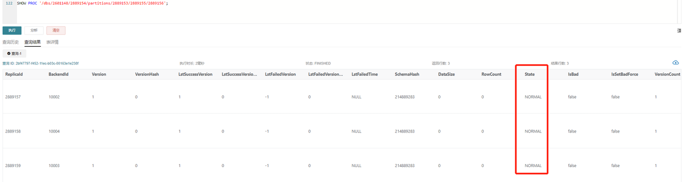
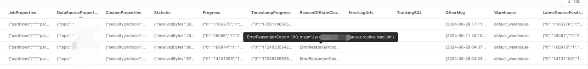
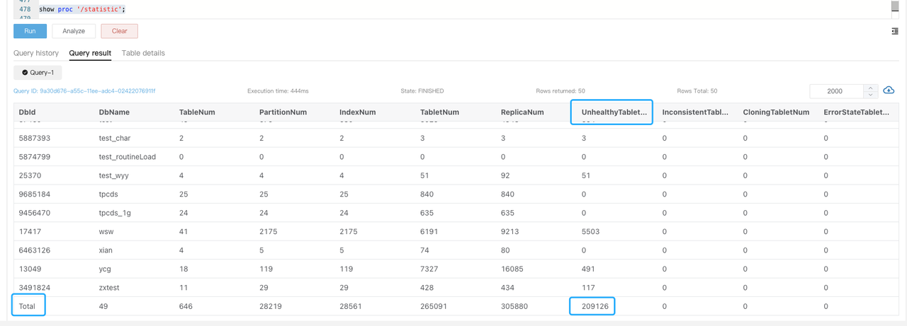

# 报警管理

本文从业务持续性、集群可用性、机器负载等多个维度介绍需要关注的报警项及其处理办法。

:::note

以下示例中，所有变量均以 `$` 为前缀，请自行根据业务环境自行替换。例如，`$job_name` 需替换为 Prometheus 配置中对应的 Job Name，`$fe_leader` 需替换为对应 Leader FE 的 IP 地址。

:::

## 服务挂起报警

### FE 服务挂起

**PromSQL**

```Plain
count(up{group="fe", job="$job_name"}) >= 3
```

**报警描述**

当存活的 FE 节点个数小于该值时发送报警。您可以根据实际 FE 节点个数调整。

**处理办法**

尝试拉起挂掉的 FE 节点。

### BE 服务挂起

**PromSQL**

```Plain
node_info{type="be_node_num", job="$job_name",state="dead"} > 1
```

**报警描述**

当挂起的 BE 节点个数大于 1 时发送报警。

**处理办法**

尝试拉起挂掉的 BE 节点。问题排查参考 [BE Crash 问题排查](https://forum.mirrorship.cn/t/topic/4930)。

## 机器负载报警

### BE CPU 报警

**PromSQL**

```Plain
(1-(sum(rate(starrocks_be_cpu{mode="idle", job="$job_name",instance=~".*"}[5m])) by (job, instance)) / (sum(rate(starrocks_be_cpu{job="$job_name",host=~".*"}[5m])) by (job, instance))) * 100 > 90
```

**报警描述**

当 BE CPU Utilization 超过 90% 时发送报警。

**处理办法**

查看当下是否有大查询或者进行过大量数据导入，并发送给支持人员进行定位。

1. 通过 `top` 命令查看进程的资源占用状况。

   ```Bash
   top -Hp $be_pid
   ```

2. 通过 `perf` 命令收集分析性能数据。

   ```Bash
   # 建议执行以下命令 1-2 分钟，然后通过 CTRL+C 终止。
   sudo perf top -p $be_pid -g >/tmp/perf.txt
   ```

:::note

紧急情况下，为尽快恢复服务，可尝试在保留 Stack 后重启对应的 BE 节点。此处紧急情况是指 BE 节点进程 CPU 监控持续异常打满，无法通过有效手段定位异常并降低 CPU 使用率。

:::

### 内存报警

**PromSQL**

```Plain
(1-node_memory_MemAvailable_bytes{instance=~".*"}/node_memory_MemTotal_bytes{instance=~".*"})*100 > 90
```

**报警描述**

当内存使用率超过 90% 时发送报警。

**处理办法**

您可以参考 [内存问题排查](https://forum.mirrorship.cn/t/topic/9867/27) 或者 [获取 Heap Profile](https://github.com/StarRocks/starrocks/pull/35322) 排查。

:::note

- 紧急情况下，为尽快恢复服务，可尝试重启对应的 BE 服务。此处紧急情况是指 BE 节点进程内存监控持续异常打满，无法通过有效手段定位异常并降低内存使用。
- 如果是其他混合部署的服务影响了系统，紧急情况下可优先考虑终止其他服务。

:::

### 磁盘报警

#### 磁盘负载报警

**PromSQL**

```SQL
rate(node_disk_io_time_seconds_total{instance=~".*"}[1m]) * 100 > 90
```

**报警描述**

当磁盘负载超过 90% 时发送报警。

**处理办法**

如果集群发送了 `node_disk_io_time_seconds_total` 的报警，首先需要确认业务是否存在变更。如果存在变更，需考虑能否回滚变更，维持先前的资源平衡条件。如果不存在变更或不能回滚，则需考虑是否是正常的业务增长导致需要扩容资源。您可以使用 `iotop` 工具分析监视磁盘 I/O 使用状况，`iotop` 具有与 `top` 相似的 UI，其中包括 `pid`、`user`、`I/O`、进程等相关信息。除此之外，您也可以通过以下 SQL 语句获取当前系统中耗费 I/O 的 Tablet，进而定位到具体的任务和表。

```SQL
-- all 表示所有服务，10 表示采集过程持续 10 秒，3 表示获取 top3 结果。
ADMIN EXECUTE ON $backend_id 'System.print(ExecEnv.io_profile_and_get_topn_stats("all", 10, 3))';
```

#### 根目录空间容量报警

**PromSQL**

```SQL
node_filesystem_free_bytes{mountpoint="/"} /1024/1024/1024 < 5
```

**报警描述**

当根目录空间容量剩余不足 5GB 时发送报警。

**处理办法**

通常情况下，可能占用较大空间的目录包括 **/var**、**/opt** 以及 **/tmp**。

您可以使用以下命令分析查看占用较多空间，并及时清理不需要的文件。

```Bash
du -sh / --max-depth=1
```

#### 数据盘磁盘容量报警

**PromSQL**

```Bash
(SUM(starrocks_be_disks_total_capacity{job="$job"}) by (host, path) - SUM(starrocks_be_disks_avail_capacity{job="$job"}) by (host, path)) / SUM(starrocks_be_disks_total_capacity{job="$job"}) by (host, path) * 100 > 90
```

**报警描述**

当磁盘容量使用率超过 90% 时发送报警。

**处理办法**

1. 查看导入数据量是否有变化。

   可以关注 Grafana 监控中的 `load_bytes` 监控项，如果新增大量数据导入，建议您扩容系统资源。

2. 查看是否有 DROP 操作。

   如果数据导入量没有发生太大变化，可在系统中运行 `SHOW BACKENDS`。如果返回的磁盘使用量和实际不一致，您可以通过 FE Audit Log 查看近期是否进行过 DROP DATABASE、TABLE 或者 PARTITION 的操作。

   这些操作涉及的元数据信息会在 FE 内存中保留 1 天，因此您一天之内可以通过 RECOVER 语句恢复数据，避免误操作。RECOVER 操作后可能会出现实际磁盘占用大于 `SHOW BACKENDS` 中显示的已用空间的情况。

   被删除数据保留在内存中的时间可通过 FE 动态参数 `catalog_trash_expire_second`（默认值：86400）调整：

   ```Bash
   ADMIN SET FRONTEND CONFIG ("catalog_trash_expire_second"="86400");
   ```

   如需持久化该修改，需要在 FE 配置文件 **fe.conf** 中添加该配置项。

   此后，被删除数据将被转移至 BE 节点的 **trash** 目录下（`$storage_root_path/trash`）。默认设置下，被删除数据会在 **trash** 目录中保留 1 天。该情况也导致实际磁盘占用大于 `SHOW BACKENDS` 中显示的已用空间的情况。

   被删除数据保留在 **trash** 目录中保留时间可通过 BE 动态参数 `trash_file_expire_time_sec`（默认值：86400）调整：

   ```Bash
   curl http://$be_ip:$be_http_port/api/update_config?trash_file_expire_time_sec=86400
   ```

#### FE 元数据磁盘容量报警

**PromSQL**

```Bash
node_filesystem_free_bytes{mountpoint="${meta_path}"} /1024/1024/1024 < 10
```

**报警描述**

FE 元数据磁盘容量剩余不足 10GB 时发送报警。

**处理办法**

您可以使用以下命令分析空间占用较多的目录，并及时清理不需要的文件。元数据路径为 fe.conf 中配置项 `meta_dir` 指定的路径。

```Bash
du -sh /${meta_dir} --max-depth=1
```

如果元数据目录占用空间比较大，通常是因为 **bdb** 目录占用比较大，可能是由于 CheckPoint 失败导致。您可以参考 [CheckPoint 失败报警](#checkpoint-失败报警)排查。如果该方式仍然无法解决，请联系支持人员。

## 集群服务异常报警

### Compaction 失败报警

#### Cumulative Compaction 失败报警

**PromSQL**

```Bash
increase(starrocks_be_engine_requests_total{job="$job_name" ,status="failed",type="cumulative_compaction"}[1m]) > 3
increase(starrocks_be_engine_requests_total{job="$job_name" ,status="failed",type="base_compaction"}[1m]) > 3
```

**报警描述**

最近 1 分钟内有三次 Cumulative Compaction 失败或三次 Base Compaction 失败时发送报警。

**处理办法**

在对应 BE 节点日志中搜索以下关键字，确定失败涉及的 Tablet。

```Bash
grep -E 'compaction' be.INFO | grep failed
```

如果有如下日志，则表示存在 Compaction 失败。

```Plain
W0924 17:52:56:537041 123639 comaction_task_cpp:193] compaction task:8482. tablet:8423674 failed.
```

您可以获取该 Tablet 对应日志的上下文排查失败原因。通常情况下，失败可能是在 Compaction 过程中进行了 DROP TABLE 或 PARTITION 操作导致。系统内部有 Compaction 重试策略，您也可以手动设置 Tablet 状态为 BAD 并触发重新 Clone 任务以修复。

:::note

进行以下操作前需保证当前表至少有三个副本完整。

:::

```Bash
ADMIN SET REPLICA STATUS PROPERTIES("tablet_id" = "$tablet_id", "backend_id" = "$backend_id", "status" = "bad");
```

#### Compaction 压力大报警

**PromSQL**

```Bash
starrocks_fe_max_tablet_compaction_score{job="$job_name",instance="$fe_leader"} > 100
```

**报警描述**

当最大 Compaction Score 超过 100，即 Compaction 压力较大时发送报警。

**处理办法**

该报警通常是由于发起了高频率（每秒 1 次）的导入、INSERT INTO VALUES 或 DELETE 任务所导致。建议为导入或 DELETE 任务设置 5 秒以上的间隔。不建议高并发提交 DELETE 任务。

#### 版本个数超限制报警

**PromSQL**

```Bash
starrocks_be_max_tablet_rowset_num{job="$job_name"} > 700
```

**报警描述**

当有 BE 节点中 Tablet 最大的版本个数超过 700 时发送报警。

**处理办法**

通过以下语句查看版本数过多的 Tablet：

```SQL
SELECT BE_ID,TABLET_ID FROM information_schema.be_tablets WHERE NUM_ROWSET>700;
```

以下以 ID 为 `2889156` 的 Tablet 为例：

```SQL
SHOW TABLET 2889156;
```

执行 `DetailCmd` 字段中返回的指令：

```SQL
SHOW PROC '/dbs/2601148/2889154/partitions/2889153/2889155/2889156';
```



正常情况下，如图所示，三副本都应该为 `NORMAL` 状态，且其余指标基本保持一致，例如 `RowCount` 以及`DataSize`。如果只有一个副本版本数超过 700，则可以通过如下指令触发基于其他副本的 Clone 任务：

```SQL
ADMIN SET REPLICA STATUS PROPERTIES("tablet_id" = "$tablet_id", "backend_id" = "$backend_id", "status" = "bad");
```

如果有 2 个以上副本都超过了版本限制，您可暂时调大版本个数限制：

```Bash
# 以下 be_ip 为上述过程中查到版本超过限制的 BE 节点的 IP，be_http_port 默认为 8040。
# tablet_max_versions 默认值为 1000。
curl -XPOST http://$be_ip:$be_http_port/api/update_config?tablet_max_versions=2000
```

### CheckPoint 失败报警

**PromSQL**

```Bash
starrocks_fe_meta_log_count{job="$job_name",instance="$fe_master"} > 100000
```

**报警描述**

当 FE 节点 BDB 日志数量超过 100000 时发送报警。默认设置下，BDB 日志数量超过 50000 时，系统会进行 CheckPoint。BDB 日志数量将会重置为 0 并重新累加。

**处理办法**

该报警是由于未进行 CheckPoint 导致，需要通过 FE 日志排查 CheckPoint 的情况并解决问题：

在 Leader FE 节点的 **fe.log** 中搜索是否存在 `begin to generate new image: image.xxxx` 条目。如果存在，则表明系统已开始生成 Image。继续查看该线程的后续日志，如果出现 `checkpoint finished save image.xxxx` 条目，则说明 Image 写入成功，如果出现 `Exception when generate new image file`，则表示 Image 生成失败。随后您需要根据具体的错误信息 ，谨慎操作元数据。建议在此之前联系支持人员进行分析。

### FE 线程数高报警

**PromSQL**

```Bash
starrocks_fe_thread_pool{job="$job_name", type!="completed_task_count"} > 3000
```

**报警描述**

当 FE 线程池大小超过 3000 时发送报警。

**处理办法**

FE 和 BE 节点的线程数默认是 4096。通常情况下，大量的 UNION ALL 查询会导致过高的线程数。建议您调低 UNION ALL 查询的并发，并调整系统变量 `pipeline_dop`。如果无法调整 SQL 粒度，可以全局调整`pipeline_dop`：

```SQL
SET GLOBAL pipeline_dop=8;
```

:::note

紧急情况下，为尽快恢复服务，可以选择调大 FE 动态参数 `thrift_server_max_worker_threads`（默认值：4096）。

```SQL
ADMIN SET FRONTEND CONFIG ("thrift_server_max_worker_threads"="8192");
```

:::

### FE JVM 使用率高报警

**PromSQL**

```SQL
sum(jvm_heap_size_bytes{job="$job_name", type="used"}) * 100 / sum(jvm_heap_size_bytes{job="$job_name", type="max"}) > 90
```

**报警描述**

当 FE 节点 JVM 使用率超过 90% 时发送报警。

**处理办法**

该报警表示 JVM 使用率过高。您可以执行 `jmap` 命令分析具体情况。由于当前指标的详细监控信息还在开发过程中，因而缺少可以直观看出占用信息的方式。您可以执行以下操作并把结果给发送给支持人员进行定位：

```SQL
# 注意：以下命令中指定 live 可能会导致 FE 重启。
jmap -histo[:live] $fe_pid > jmap.dump
```

:::note

紧急情况下，为尽快恢复服务，可以重启对应的 FE 节点或者调大 JVM（Xmx）后重启 FE 服务。

:::

## 业务可用性报警

### 导入异常报警

#### 导入失败报警

**PromSQL**

```SQL
rate(starrocks_fe_txn_failed{job="$job_name",instance="$fe_master"}[5m]) * 100 > 5
```

**报警描述**

当导入失败事务个数超过总量的 5% 时发送报警。

**处理办法**

查看 Leader FE 日志搜索导入报错的相关信息。您可以搜索 `status: ABORTED` 关键字，查看失败的导入任务。可参考 [导入失败问题排查](https://forum.mirrorship.cn/t/topic/4923/18)。

```Plain
2024-04-09 18:34:02.363+08:00 INFO (thrift-server-pool-8845163|12111749) [DatabaseTransactionMgr.abortTransaction():1279] transaction:[TransactionState. txn_id: 7398864, label: 967009-2f20a55e-368d-48cf-833a-762cf1fe07c5, db id: 10139, table id list: 155532, callback id: 967009, coordinator: FE: 192.168.2.1, transaction status: ABORTED, error replicas num: 0, replica ids: , prepare time: 1712658795053, commit time: -1, finish time: 1712658842360, total cost: 47307ms, reason: [E1008]Reached timeout=30000ms @192.168.1.1:8060 attachment: RLTaskTxnCommitAttachment [filteredRows=0, loadedRows=0, unselectedRows=0, receivedBytes=1033110486, taskExecutionTimeMs=0, taskId=TUniqueId(hi:3395895943098091727, lo:-8990743770681178171), jobId=967009, progress=KafkaProgress [partitionIdToOffset=2_1211970882|7_1211893755]]] successfully rollback
```

#### Routine Load 消费延迟报警

**PromSQL**

```SQL
(sum by (job_name)(starrocks_fe_routine_load_max_lag_of_partition{job="$job_name",instance="$fe_mater"})) > 300000
starrocks_fe_routine_load_jobs{job="$job_name",host="$fe_mater",state="NEED_SCHEDULE"} > 3
starrocks_fe_routine_load_jobs{job="$job_name",host="$fe_mater",state="PAUSED"} > 0
starrocks_fe_routine_load_jobs{job="$job_name",host="$fe_mater",state="UNSTABLE"} > 0
```

**报警描述**

- 当消费延迟超过 300000 条时发送报警。
- 当待调度的 Routine Load 任务个数超过 3 时发送报警。
- 当有状态为 PAUSED 的任务时发送报警。
- 当有状态为 UNSTABLE 的任务时发送报警。

**处理办法**

1. 首先排查 Routine Load 任务状态是否为 RUNNING。

   ```SQL
   SHOW ROUTINE LOAD FROM $db;
   ```

   您需要关注返回的 `State` 字段。

2. 如果有 Routine Load 任务状态为 PAUSED，需进一步关注返回的 `ReasonOfStateChanged`、`ErrorLogUrls` 和 `TrackingSQL` 字段。通常执行 `TrackingSQL` 对应的 SQL 可以查看具体的报错信息。
   示例：

   

3. 如果 Routine Load 任务状态为 RUNNING，您可尝试调大任务并行度。单个 Routine Load Job 的并发度由以下四个值的最小值决定：
   - `kafka_partition_num`：Kafka Topic 的分区个数。
   - `desired_concurrent_number`：任务设置的并行度。
   - `alive_be_num`：存活的 BE 节点数量。
   - `max_routine_load_task_concurrent_num`：FE 配置项，默认值为 `5`。

通常情况下，您需要调整任务并行度或者 Kafka Topic 的分区个数（需要联系 Kafka 技术支持人员）。

调整任务并行度的方法：

```SQL
ALTER ROUTINE LOAD FOR ${routine_load_jobname}
PROPERTIES
(
    "desired_concurrent_number" = "5"
);
```

#### 单个 DB 中导入事务超限报警

**PromSQL**

```SQL
sum(starrocks_fe_txn_running{job="$job_name"}) by(db) > 900
```

**报警描述**

当单个 DB 导入事务个数超过 900 （v3.1 之前为 100）时发送报警。

**处理办法**

通常该报警是由新增较多的导入任务导致，您可以临时调大单个 DB 导入事务限制：

```SQL
ADMIN SET FRONTEND CONFIG ("max_running_txn_num_per_db" = "2000");
```

### 查询异常报警

#### 查询延迟报警

**PromSQL**

```SQL
starrocks_fe_query_latency_ms{job="$job_name", quantile="0.95"} > 5000
```

**报警描述**

当查询耗时 P95 大于 5 秒时发送报警。

**处理办法**

1. 排查是否存在大查询。

   您需要查看在监控指标异常的时间段，是否有部分大查询占用了大量的机器资源导致其他查询超时失败或者失败。

   - 您可以执行 `show proc '/current_queries';` 查看大查询的 `QueryId`。如需快速恢复服务，可以通过 KILL 语句终止执行时间最长的查询。

      ```SQL
        mysql> SHOW PROC '/current_queries';
        +--------------------------------------+--------------+------------+------+-----------+----------------+----------------+------------------+----------+
        | QueryId                              | ConnectionId | Database   | User | ScanBytes | ProcessRows    | CPUCostSeconds | MemoryUsageBytes | ExecTime |
        +--------------------------------------+--------------+------------+------+-----------+----------------+----------------+------------------+----------+
        | 7c56495f-ae8b-11ed-8ebf-00163e00accc | 4            | tpcds_100g | root | 37.88 MB  | 1075769 Rows   | 11.13 Seconds  | 146.70 MB        | 3804     |
        | 7d543160-ae8b-11ed-8ebf-00163e00accc | 6            | tpcds_100g | root | 13.02 GB  | 487873176 Rows | 81.23 Seconds  | 6.37 GB          | 2090     |
        +--------------------------------------+--------------+------------+------+-----------+----------------+----------------+------------------+----------+
        2 rows in set (0.01 sec)
        ```

   - 您也可以选择直接重启 CPU 利用率较高的 BE 节点。

2. 查看机器资源是否充足。

   您需要确认异常对应时间段的 CPU、内存、Disk I/O、网络流量监控信息是否正常。如果对应时间段内有异常，可以通过峰值流量的变化、集群资源的使用等方式来确认查询失败或卡住的原因。如果异常持续，您可以重启对应的节点。

:::note

紧急情况下，为尽快恢复服务，可以通过以下方式处理：

- 如果是异常峰值流量激增导致资源占用高引起的查询失败，可通过紧急减少业务流量，并重启对应的 BE 节点释放积压的查询。
- 如果是正常情况下资源占用高触发报警，则可以考虑扩容节点。

:::

#### 查询失败报警

**PromSQL**

```Plain
sum by (job,instance)(starrocks_fe_query_err_rate{job="$job_name"}) * 100 > 10

# 该 PromSQL 自 v3.1.15、v3.2.11 及 v3.3.3 起支持。
increase(starrocks_fe_query_internal_err{job="$job_name"})[1m] >10
```

**报警描述**

当查询失败率高于 0.1/秒或者 1 分钟内查询失败新增 10 个时发送报警。

**处理办法**

当该报警被触发时，您可以首先通过日志来确认有哪些查询报错：

```Bash
grep 'State=ERR' fe.audit.log
```

如果您安装了 AuditLoder 插件，则可以通过如下方式查找对应的查询：

```Bash
SELECT stmt FROM starrocks_audit_db__.starrocks_audit_tbl__ WHERE state='ERR';
```

需要注意的是，当前语法错误、超时等类型的查询也会被记录为 `starrocks_fe_query_err_rate` 中失败的查询。

对于系统内核异常导致查询失败的查询，您需要通过在 **fe.log** 中搜索报错的查询获取完整的异常栈和 [Query Dump](../../../faq/Dump_query.md) 联系支持人员排查。

#### 查询过载报警

**PromSQL**

```Bash
abs((sum by (exported_job)(rate(starrocks_fe_query_total{process="FE",job="$job_name"}[3m]))-sum by (exported_job)(rate(starrocks_fe_query_total{process="FE",job="$job_name"}[3m] offset 1m)))/sum by (exported_job)(rate(starrocks_fe_query_total{process="FE",job="$job_name"}[3m]))) * 100 > 100
abs((sum(starrocks_fe_connection_total{job="$job_name"})-sum(starrocks_fe_connection_total{job="$job_name"} offset 3m))/sum(starrocks_fe_connection_total{job="$job_name"})) * 100 > 100
```

**报警描述**

当最近 1 分钟的 QPS 或连接数环比增加 100% 时发送报警。

**处理办法**

查看 **fe.audit.log** 中高频出现的查询是否符合预期。如果业务上有正常行为变更（比如新业务上线了或业务数据量变更），需要关注机器负载并及时扩容 BE 节点。

#### 用户粒度连接数超限报警

**PromSQL**

```Bash
sum(starrocks_fe_connection_total{job="$job_name"}) by(user) > 90
```

**报警描述**

当用户粒度连接数大于 90 时发送报警。（用户粒度连接数从 v3.1.16、v3.2.12 及 v3.3.4 起支持）

**处理办法**

您可通过 SQL 语句 `SHOW PROCESSLIST` 查看当前连接数是否符合预期，并通过 KILL 语句终止不符合预期的连接。此后需检查是否前端有业务侧使用不当导致连接长时间未释放，也可通过调整系统变量 `wait_timeout` （单位：秒）加速系统自动终止空闲时间过久的连接。

```Bash
SET wait_timeout = 3600;
```

:::note

紧急情况下，为尽快恢复服务，可以通过调大对应用户的连接数限制解决：

- v3.1.16、v3.2.12 及 v3.3.4 及其以后版本：

  ```Bash
  ALTER USER 'jack' SET PROPERTIES ("max_user_connections" = "1000");
  ```

- v2.5 及上述版本以前版本：

  ```Bash
  SET PROPERTY FOR 'jack' 'max_user_connections' = '1000';
  ```

:::

### Schema Change 异常报警

**PromSQL**

```Bash
increase(starrocks_be_engine_requests_total{job="$job_name",type="schema_change", status="failed"}[1m]) > 1
```

**报警描述**

当最近一分钟失败的 Schema Change 任务个数超过 1 时发送报警。

**处理办法**

运行以下语句，查看字段 `Msg` 是否有对应的对应的报错信息：

```Bash
SHOW ALTER COLUMN FROM $db;
```

如果没有，则需要在 Leader FE 日志中搜索上一步返回的 JobId，获取日志上下文。

- Schema Change 内存不足

  如出现 Schema Change 内存不足的问题，可在对应时间节点的 **be.WARNING** 日志中搜索是否存在 `failed to process the version`、`failed to process the schema change. from tablet` 或 `Memory of schema change task exceed limit` 的内容，确认上下文中是否有 `fail to execute schema change:` 的内容。

  内存超限错误日志为： 

  ```Bash
  fail to execute schema change: Memory of schema change task exceed limit. DirectSchemaChange Used: 2149621304, Limit: 2147483648. You can change the limit by modify BE config [memory_limitation_per_thread_for_schema_change]
  ```

  该报错是由于单次 Schema Change 使用的内存超过了默认的内存限制（2GB）引起的。该默认值是由 BE 动态参数 `memory_limitation_per_thread_for_schema_change` 控制，可通过以下方式修改：

  ```Bash
  curl -XPOST http://be_host:http_port/api/update_config?memory_limitation_per_thread_for_schema_change=8
  ```

- Schema Change 超时

  除新增列是轻量级实现外，其他的 Schema Change 的实现方式是创建大量新的 Tablet，然后将原来的数据重写，最终通过 SWAP 实现。

  ```Plain
  Create replicas failed. Error: Error replicas:21539953=99583471, 21539953=99583467, 21539953=99599851
  ```

  您可以通过以下方式解决：

  - 调大创建 Tablet 的超时时间（默认为 10 秒）：

    ```Bash
    ADMIN SET FRONTEND CONFIG ("tablet_create_timeout_second"="60");
    ```

  - 调大创建 Tablet 的线程数（默认为 3）：

    ```Bash
    curl -XPOST http://be_host:http_port/api/update_config?alter_tablet_worker_count=6
    ```

- 存在状态不为 Normal 的 Tablet

  1. 如出现该问题，您可在 **be.WARNING** 日志中搜索是否存在 `tablet is not normal` 信息，并运行 `SHOW PROC '/statistic'` 查看集群级别的 `UnhealthyTabletNum` 信息。

     

  2. 运行 `SHOW PROC '/statistic/$DbId'` 查看指定 DB 内的不健康副本数。

     

  3. 运行 `SHOW TABLET $tablet_id` 查看对应表信息。

    

  4. 执行 `DetailCmd` 字段中的命令来确认不健康副本的原因。

     

  通常情况下，不健康以及不一致副本通常由高频导入导致，不同副本写入进度不同步。您可以检查该表是否有大量实时写入，并通过降低导入频率或者暂时暂停服务可减少异常副本，此后重试该任务。

:::note

紧急情况下，为尽快恢复服务，可以通过将非 Normal 副本设置为 Bad 触发 Clone 任务。

```Bash
ADMIN SET REPLICA STATUS PROPERTIES("tablet_id" = "$tablet_id", "backend_id" = "$backend_id", "status" = "bad");
```

执行该操作前需保证当前表至少有三个副本完整且只有一个非 Normal 副本。

:::

### 物化视图刷新异常报警

**PromSQL**

```Bash
increase(starrocks_fe_mv_refresh_total_failed_jobs[5m]) > 0
```

**报警描述**

最近 5 分钟新增物化视图刷新失败次数超过 1 时发送报警。

**处理办法**

1. 查看刷新失败的物化视图：

   ```SQL
   SELECT TABLE_NAME,IS_ACTIVE,INACTIVE_REASON,TASK_NAME FROM information_schema.materialized_views WHERE LAST_REFRESH_STATE !=" SUCCESS";
   ```

2. 尝试手动刷新该物化视图：

   ```SQL
   REFRESH MATERIALIZED VIEW $mv_name;
   ```

3. 如果物化视图状态为 INACTIVE，可通过以下方式尝试置为激活：

   ```SQL
   ALTER MATERIALIZED VIEW $mv_name ACTIVE;
   ```

4. 排查刷新失败的原因：

   ```SQL
   SELECT * FROM information_schema.task_runs WHERE task_name ='mv-112517' \G
   ```
