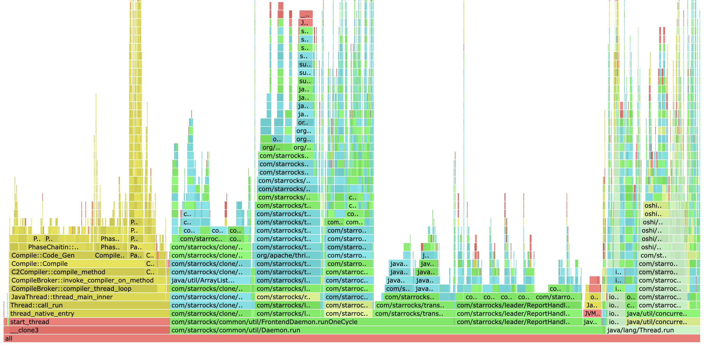

# 进程分析 (Proc Profile)

**进程分析** (Proc Profile) 功能提供了一种内置机制，用于收集和可视化 StarRocks 前端 (FE) 和后端 (BE) 进程的性能分析数据。通过生成 CPU、内存分配的火焰图，它帮助开发人员和管理员直接通过 Web UI 诊断性能瓶颈、高资源利用率和复杂的运行时问题。

## 概览

进程分析是一种系统级的诊断工具，它捕获 StarRocks 进程在一段时间内的状态。与侧重于单个 SQL 执行的查询分析 (Query Profile) 不同，进程分析提供了进程正在执行的任务的整体视图，包括后台任务、元数据管理和内部同步。

## 页面示例

进程分析界面集成在 StarRocks Web UI 的 **proc profiles** 选项卡下。

### 分析列表视图

主页面显示了所选节点的已收集分析文件列表。
您可以使用顶部的选项卡在 FE 和不同的 BE 节点之间切换。


### 火焰图




火焰图（Flame Graph）是一种可视化分析工具，用于展示程序中各函数或代码路径的资源消耗分布情况。它以层叠矩形（通常是横向排列的“火焰”形状）表示调用堆栈，其中：

- **每一个方块代表一个函数（或方法）调用。**
- **方块的宽度表示该函数消耗的资源量（如 CPU 时间、内存分配频率或锁等待时间），宽度越宽表示消耗越多。**
- **纵向堆叠表示调用关系，最底层为入口函数，向上是被依次调用的子函数。**

火焰图可以帮助开发与运维人员快速识别系统中资源消耗最多的代码热点、性能瓶颈和调用链路，常用于性能调优与问题排查。

在 StarRocks 进程分析功能中，火焰图可用于直观展示 CPU 使用、内存分配以及（BE 场景下的）锁竞争的数据分布，协助定位耗时最多的代码段或调用路径。


## 使用场景

- **CPU 热点分析**：确定哪些代码路径或函数消耗了最多的 CPU 周期。
- **内存分配分析**：跟踪内存频繁分配的位置，以找出潜在的内存压力来源。
- **研发排查**：协助开发人员分析生产环境中的复杂错误或性能回退，而无需外部分析工具。

## 功能说明

### 如何使用

1. **访问**：打开 StarRocks Web UI（默认端口 8030），然后单击 **proc profiles** 选项卡。
2. **选择节点**：选择 **FE** 选项卡或特定的 **BE** 节点选项卡。
3. **可视化**：单击任何条目的 **View** 链接。
   - 对于 **FE**，它提取并显示预生成的 HTML 火焰图。
   - 对于 **BE**，它可能会实时将原始 `pprof` 文件转换为 SVG 火焰图（由于执行转换，第一次查看可能需要几秒钟）。
4. **交互**：使用火焰图缩放到特定的调用栈、搜索函数名称或分析栈深度。

### 显示信息

- **类型 (Type)**：CPU、内存分配 (Memory) 或 锁竞争 (Contention，仅 BE)。
- **时间戳 (Timestamp)**：分析收集完成的时间。
- **文件大小 (File Size)**：压缩后的分析数据大小。
- **火焰图 (Flame Graph)**：分层可视化图表，其中每个框的宽度表示相对资源消耗（CPU 时间、分配频率或锁等待时间）。

## 相关参数配置

该功能基于函数粒度的采样，通过火焰图进行可视化展示。

### 前端 (FE) 配置

FE 分析由内部守护进程管理，并使用 **AsyncProfiler** 采集数据。您可以在 `fe.conf` 中配置这些参数。

| 参数 | 默认值 | 说明 |
| :--- | :--- | :--- |
| `proc_profile_cpu_enable` | `true` | 是否启用 FE 的自动 CPU 分析。 |
| `proc_profile_mem_enable` | `true` | 是否启用 FE 的自动内存分配分析。 |
| `proc_profile_collect_time_s` | `120` | 每次分析收集的持续时间（秒）。 |
| `proc_profile_jstack_depth` | `128` | 收集的最大 Java 栈深度。 |
| `proc_profile_file_retained_days` | `1` | 分析文件的保留天数。 |
| `proc_profile_file_retained_size_bytes` | `2147483648` (2GB) | 保留分析文件的最大总大小。 |

### 后端 (BE) 配置

BE 分析使用内置的 **gperftools** 采集数据，通常通过后台脚本或手动触发收集。随后使用 **pprof** 工具将采样数据转换为火焰图。

#### `be.conf` 配置参数

| 参数 | 默认值 | 说明 |
| :--- | :--- | :--- |
| `brpc_port` | `8060` | 收集脚本从 BE 获取数据所使用的端口。 |
| `sys_log_dir` | `${STARROCKS_HOME}/log` | 存储已收集分析的基础目录（存储在 `proc_profile` 子目录中）。 |
| `flamegraph_tool_dir` | `${STARROCKS_HOME}/bin/flamegraph` | 转换工具（**pprof**、`flamegraph.pl`）的路径。 |
| `COLLECT_BE_PROFILE_INTERVAL` | `60` | 以守护进程模式运行 `collect_be_profile.sh` 脚本时的收集间隔（秒）。 |

#### BE 采集脚本选项

`collect_be_profile.sh` 脚本支持以下命令行选项：

| 选项 | 默认值 | 说明 |
| :--- | :--- | :--- |
| `--profiling-type` | `cpu` | 采集类型：`cpu`、`contention` 或 `both`。 |
| `--duration` | `10` | 每次分析采集的持续时间（秒）。 |
| `--interval` | `60` | 守护进程模式下两次采集之间的间隔（秒）。 |
| `--cleanup-days` | `1` | 分析文件的保留天数。 |
| `--cleanup-size` | `2147483648` (2GB) | 保留分析文件的最大总大小。 |
| `--daemon` | - | 在后台以守护进程模式运行采集脚本。 |

### 手动 BE 收集示例
您可以使用提供的脚本触发或计划 BE 收集：

```bash
# 收集 30 秒的 CPU 分析
./bin/collect_be_profile.sh --profiling-type cpu --duration 30

# 以守护进程模式运行，每小时收集一次分析
./bin/collect_be_profile.sh --daemon --interval 3600
```

