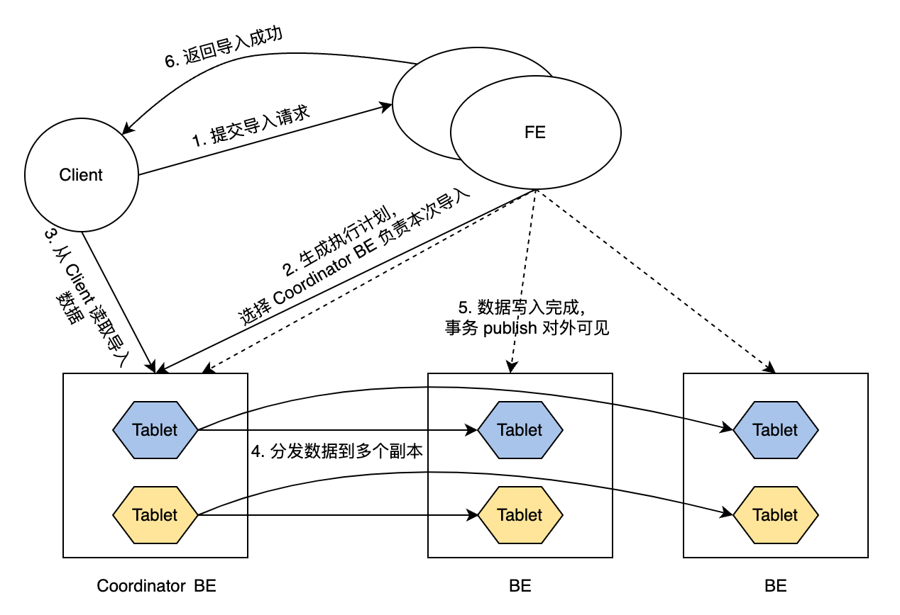
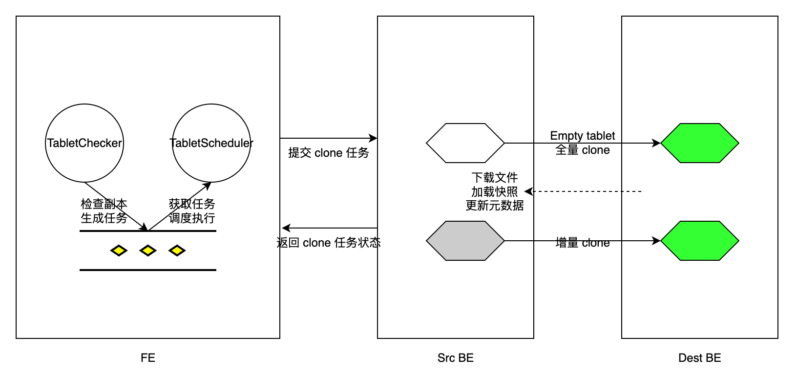

# 管理副本

本文描述如何管理 StarRocks 集群中的数据副本。

## 概述

StarRocks 采用多副本策略来保证数据的高可用性。当您创建表时，必须通过配置 `replication_num` （默认值：`3`）属性（Property）指定表的副本数量。发起导入事务后，数据会同时导入到指定数量的副本中，即在数据写入多数副本后，事务才会返回成功。详情请参考[导入数据安全等级（Write quorum）](#导入数据安全等级write-quorum)。StarRocks 允许您设置导入更少的副本即可返回导入成功，从而实现更好的导入性能。

StarRocks 将多个副本存储在不同的 BE 节点上。例如，如果您想要为一个表存储三个副本，则必须在 StarRocks 集群中部署至少三个 BE 节点。如果任何副本发生故障，StarRocks 会从另一个 BE 节点克隆一个健康的副本的部分或全部数据来修复故障的副本。StarRocks 采用多版本并发控制（MVCC）技术，通过复制这些多版本数据的物理副本，保证版本修复的高效进行。

### 多副本写入



导入事务的常规流程如下：

1. 客户端提交导入请求至 FE。

2. FE 节点选择一个 BE 节点作为该导入事务的 Coordinator BE 节点，并为该事务生成执行计划。

3. Coordinator 节点从客户端读取要导入的数据。

4. Coordinator 节点将数据分发到所有副本的 Tablet 中。

   > **说明**
   >
   > Tablet 是表的逻辑分片。一张表可以有多个 Tablet，每个 Tablet 有 `replication_num` 个副本。一张表中 Tablet 的数量由建表属性 `bucket_size` 决定。

5. 数据导入并存储到所有 Tablet 后，FE 将导入的数据变为可见。

6. FE 向客户端返回导入成功。

以上流程确保了即使在极端情况下服务可用性依然不受影响。

### 导入数据安全等级（Write quorum）

将数据导入到多副本表的过程可能非常耗时。如果您希望提高导入性能并且能够容忍相对较低的数据可用性，可以为该表设置较低的导入数据安全等级。导入数据安全等级是指需要多少数据副本导入成功后 StarRocks 可返回导入成功。您可以在创建表时通过添加属性 `write_quorum` 来指定导入数据安全等级，或者通过 ALTER TABLE 为已有的表添加该属性。该属性从 v2.5 开始支持。

`write_quorum` 的取值及其对应描述如下：

- `MAJORITY`：默认值。当**多数**数据副本导入成功时，StarRocks 返回导入成功，否则返回失败。
- `ONE`：当**一个**数据副本导入成功时，StarRocks 返回导入成功，否则返回失败。
- `ALL`：当**所有**数据副本导入成功时，StarRocks 返回导入成功，否则返回失败。

## 自动副本修复

BE 节点崩溃或导入任务失败都可能导致副本异常。StarRocks 会自动修复这些异常的副本。

每隔 `tablet_sched_checker_interval_seconds` 中指定的周期，默认 20 秒，FE 中的 Tablet Checker 就会扫描 StarRocks 集群中所有表的 Tablet 副本，通过检查当前 Visible 的数据版本号和 BE 节点的健康状态来判断副本是否健康。如果一个副本的 Visible 版本落后于其他副本，StarRocks 会执行增量克隆以修复该落后的副本。如果一个后端节点无法接收心跳信号或被从集群中移除，或副本过于落后无法通过增量克隆修复，StarRocks 会执行全量克隆以修复丢失的副本。

在检测到需要修复的 Tablet 副本后，FE 生成 Tablet 调度任务，并将任务添加到调度任务队列中。FE 的 Tablet Scheduler 从队列中接收调度任务，为每个异常副本创建其所需类型的克隆任务，并将任务分配给 Executor BE 节点。

克隆任务本质上是从源 BE 节点（即拥有健康副本的节点）复制数据，并将数据导入到目标 BE 节点（即拥有异常副本的节点）。对于数据版本落后的副本，FE 会分配增量克隆任务给存储异常副本的 Executor BE 节点，并通知该节点可以从哪个 BE 节点找到健康副本克隆新数据。对于已丢失的副本，FE 会选择一个存活的 BE 节点作为 Executor 节点，在该 BE 节点创建一个空的副本，并为该 BE 节点分配全量克隆任务。

对于每个克隆任务，无论其类型如何，Executor BE 节点都会从健康副本中复制数据文件，然后更新相应元数据。克隆任务完成后，Executor BE 节点会向 FE 的 Tablet Scheduler 返回任务成功。在移除多余的 Tablet 副本后，FE 会更新其元数据，标志副本修复完成。



在修复 Tablet 期间，StarRocks 仍然可以执行查询。只要健康副本数满足 `write_quorum`，导入就可以正常进行。

## 手动修复副本

手动副本修复包括两个步骤：

1. 检查副本状态。
2. 设置副本优先级。

### 检查副本状态

按照以下步骤检查副本状态，寻找状态为 Unhealthy（异常）的副本。

1. **检查集群中所有副本的状态。**

   ```SQL
   SHOW PROC '/statistic';
   ```

   示例：

    ```Plain
    mysql> SHOW PROC '/statistic';
    +----------+-----------------------------+----------+--------------+----------+-----------+------------+--------------------+-----------------------+
    | DbId     | DbName                      | TableNum | PartitionNum | IndexNum | TabletNum | ReplicaNum | UnhealthyTabletNum | InconsistentTabletNum |
    +----------+-----------------------------+----------+--------------+----------+-----------+------------+--------------------+-----------------------+
    | 35153636 | default_cluster:DF_Newrisk  | 3        | 3            | 3        | 96        | 288        | 0                  | 0                     |
    | 48297972 | default_cluster:PaperData   | 0        | 0            | 0        | 0         | 0          | 0                  | 0                     |
    | 5909381  | default_cluster:UM_TEST     | 7        | 7            | 10       | 320       | 960        | 1                  | 0                     |
    | Total    | 240                         | 10       | 10           | 13       | 416       | 1248       | 1                  | 0                     |
    +----------+-----------------------------+----------+--------------+----------+-----------+------------+--------------------+-----------------------+
    ```

   - `UnhealthyTabletNum`：表示对应数据库中异常 Tablet 的数量。
   - `InconsistentTabletNum`：表示副本不一致的 Tablet 数量。

   如果某个数据库中的 `UnhealthyTabletNum` 或 `InconsistentTabletNum` 的值不为 `0`，您可以通过其 `DbId` 检查该数据库中的异常 Tablet。

   ```SQL
   SHOW PROC '/statistic/<DbId>'
   ```

   示例：

    ```Plain
    mysql> SHOW PROC '/statistic/5909381';
    +------------------+---------------------+
    | UnhealthyTablets | InconsistentTablets |
    +------------------+---------------------+
    | [40467980]       | []                  |
    +------------------+---------------------+
    ```

   Unhealthy Tablet 的 ID 会在 `UnhealthyTablets` 字段中返回。

2. **检查特定表或分区中的 Tablet 状态。**

   您可以通过结合 ADMIN SHOW REPLICA STATUS 和 WHERE 子句来筛选具有特定状态的 Tablet。

    ```SQL
    ADMIN SHOW REPLICA STATUS FROM <table_name> 
    [PARTITION (<partition_name_1>[, <partition_name_2>, ...])]
    [WHERE STATUS = {'OK'|'DEAD'|'VERSION_ERROR'|'SCHEMA_ERROR'|'MISSING'}]
    ```

   示例：

    ```Plain
    mysql> ADMIN SHOW REPLICA STATUS FROM tbl PARTITION (p1, p2) WHERE STATUS = "OK";
    +----------+-----------+-----------+---------+-------------------+--------------------+------------------+------------+------------+-------+--------+--------+
    | TabletId | ReplicaId | BackendId | Version | LastFailedVersion | LastSuccessVersion | CommittedVersion | SchemaHash | VersionNum | IsBad | State  | Status |
    +----------+-----------+-----------+---------+-------------------+--------------------+------------------+------------+------------+-------+--------+--------+
    | 29502429 | 29502432  | 10006     | 2       | -1                | 2                  | 1                | -1         | 2          | false | NORMAL | OK     |
    | 29502429 | 36885996  | 10002     | 2       | -1                | -1                 | 1                | -1         | 2          | false | NORMAL | OK     |
    | 29502429 | 48100551  | 10007     | 2       | -1                | -1                 | 1                | -1         | 2          | false | NORMAL | OK     |
    | 29502433 | 29502434  | 10001     | 2       | -1                | 2                  | 1                | -1         | 2          | false | NORMAL | OK     |
    | 29502433 | 44900737  | 10004     | 2       | -1                | -1                 | 1                | -1         | 2          | false | NORMAL | OK     |
    | 29502433 | 48369135  | 10006     | 2       | -1                | -1                 | 1                | -1         | 2          | false | NORMAL | OK     |
    +----------+-----------+-----------+---------+-------------------+--------------------+------------------+------------+------------+-------+--------+--------+
    ```

   如果 `IsBad` 字段为 `true`，则表示该 Tablet 已损坏。

   有关 `Status` 字段提供的详细信息，参考 [ADMIN SHOW REPLICA STATUS](../../../sql-reference/sql-statements/cluster-management/tablet_replica/ADMIN_SHOW_REPLICA_STATUS.md)。

   您可以使用 [SHOW TABLET](../../../sql-reference/sql-statements/table_bucket_part_index/SHOW_TABLET.md) 进一步查看表中 Tablet 的详细信息。

   ```SQL
   SHOW TABLET FROM <table_name>
   ```

   示例：

    ```Plain
    mysql> SHOW TABLET FROM tbl1;
    +----------+-----------+-----------+------------+---------+-------------+-------------------+-----------------------+------------------+----------------------+---------------+----------+----------+--------+-------------------------+--------------+----------------------+--------------+----------------------+----------------------+----------------------+
    | TabletId | ReplicaId | BackendId | SchemaHash | Version | VersionHash | LstSuccessVersion | LstSuccessVersionHash | LstFailedVersion | LstFailedVersionHash | LstFailedTime | DataSize | RowCount | State  | LstConsistencyCheckTime | CheckVersion |     CheckVersionHash | VersionCount | PathHash             | MetaUrl              | CompactionStatus     |
    +----------+-----------+-----------+------------+---------+-------------+-------------------+-----------------------+------------------+----------------------+---------------+----------+----------+--------+-------------------------+--------------+----------------------+--------------+----------------------+----------------------+----------------------+
    | 29502429 | 29502432  | 10006     | 1421156361 | 2       | 0           | 2                 | 0                     | -1               | 0                    | N/A           | 784      | 0        | NORMAL | N/A                     | -1           |     -1               | 2            | -5822326203532286804 | url                  | url                  |
    | 29502429 | 36885996  | 10002     | 1421156361 | 2       | 0           | -1                | 0                     | -1               | 0                    | N/A           | 784      | 0        | NORMAL | N/A                     | -1           |     -1               | 2            | -1441285706148429853 | url                  | url                  |
    | 29502429 | 48100551  | 10007     | 1421156361 | 2       | 0           | -1                | 0                     | -1               | 0                    | N/A           | 784      | 0        | NORMAL | N/A                     | -1           |     -1               | 2            | -4784691547051455525 | url                  | url                  |
    +----------+-----------+-----------+------------+---------+-------------+-------------------+-----------------------+------------------+----------------------+---------------+----------+----------+--------+-------------------------+--------------+----------------------+--------------+----------------------+----------------------+----------------------+
    ```

   返回的结果显示了 Tablet 的大小、行数、版本和 URL。

   SHOW TABLET 返回的 `State` 字段指示 Tablet 任务状态，包括 `CLONE`、`SCHEMA_CHANGE` 和 `ROLLUP`。

   您还可以使用 [ADMIN SHOW REPLICA DISTRIBUTION](../../../sql-reference/sql-statements/cluster-management/tablet_replica/ADMIN_SHOW_REPLICA_DISTRIBUTION.md) 检查特定表或分区的副本分布，以检查副本是否分布均匀。

   ```SQL
   ADMIN SHOW REPLICA DISTRIBUTION FROM <table_name>
   ```

   示例：

    ```Plain
    mysql> ADMIN SHOW REPLICA DISTRIBUTION FROM tbl1;
    +-----------+------------+-------+---------+
    | BackendId | ReplicaNum | Graph | Percent |
    +-----------+------------+-------+---------+
    | 10000     | 7          |       | 7.29 %  |
    | 10001     | 9          |       | 9.38 %  |
    | 10002     | 7          |       | 7.29 %  |
    | 10003     | 7          |       | 7.29 %  |
    | 10004     | 9          |       | 9.38 %  |
    | 10005     | 11         | >     | 11.46 % |
    | 10006     | 18         | >     | 18.75 % |
    | 10007     | 15         | >     | 15.62 % |
    | 10008     | 13         | >     | 13.54 % |
    +-----------+------------+-------+---------+
    ```

   返回的结果显示了每个 BE 节点上的 Tablet 副本数量及其对应的百分比。

3. **检查特定 Tablet 的副本状态。**

   通过此前获得的 `TabletId` 可以检查异常副本的状态。

   ```SQL
   SHOW TABLET <TabletId>
   ```

   示例：

    ```Plain
    mysql> SHOW TABLET 29502553;
    +------------------------+-----------+---------------+-----------+----------+----------+-------------+----------+--------+---------------------------------------------------------------------------+
    | DbName                 | TableName | PartitionName | IndexName | DbId     | TableId  | PartitionId | IndexId  | IsSync | DetailCmd                                                                 |
    +------------------------+-----------+---------------+-----------+----------+----------+-------------+----------+--------+---------------------------------------------------------------------------+
    | default_cluster:test   | test      | test          | test      | 29502391 | 29502428 | 29502427    | 29502428 | true   | SHOW PROC '/dbs/29502391/29502428/partitions/29502427/29502428/29502553'; |
    +------------------------+-----------+---------------+-----------+----------+----------+-------------+----------+--------+---------------------------------------------------------------------------+
    ```

   返回的结果展示了关于 Tablet 的数据库、表、分区和索引（Rollup）的详细信息。

   您可以复制运行 `DetailCmd` 字段中的 SQL 语句，进一步检查 Tablet 的副本状态。

   示例：

    ```Plain
    mysql> SHOW PROC '/dbs/29502391/29502428/partitions/29502427/29502428/29502553';
    +-----------+-----------+---------+-------------+-------------------+-----------------------+------------------+----------------------+---------------+------------+----------+----------+--------+-------+--------------+----------------------+----------+------------------+
    | ReplicaId | BackendId | Version | VersionHash | LstSuccessVersion | LstSuccessVersionHash | LstFailedVersion | LstFailedVersionHash | LstFailedTime | SchemaHash | DataSize | RowCount | State  | IsBad | VersionCount | PathHash             | MetaUrl  | CompactionStatus |
    +-----------+-----------+---------+-------------+-------------------+-----------------------+------------------+----------------------+---------------+------------+----------+----------+--------+-------+--------------+----------------------+----------+------------------+
    | 43734060  | 10004     | 2       | 0           | -1                | 0                     | -1               | 0                    | N/A           | -1         | 784      | 0        | NORMAL | false | 2            | -8566523878520798656 | url      | url              |
    | 29502555  | 10002     | 2       | 0           | 2                 | 0                     | -1               | 0                    | N/A           | -1         | 784      | 0        | NORMAL | false | 2            | 1885826196444191611  | url      | url              |
    | 39279319  | 10007     | 2       | 0           | -1                | 0                     | -1               | 0                    | N/A           | -1         | 784      | 0        | NORMAL | false | 2            | 1656508631294397870  | url      | url              |
    +-----------+-----------+---------+-------------+-------------------+-----------------------+------------------+----------------------+---------------+------------+----------+----------+--------+-------+--------------+----------------------+----------+------------------+
    ```

   返回的结果展示了该 Tablet 的所有副本。

### 设置副本优先级

Tablet Scheduler 会自动为每种不同类型的克隆任务分配不同的优先级级别。

如果您希望尽快修复某个表或分区中的 Tablet，您可以使用 [ADMIN REPAIR TABLE](../../../sql-reference/sql-statements/cluster-management/tablet_replica/ADMIN_REPAIR.md) 手动将 Tablet 的优先级设置为 `VERY_HIGH`。

```SQL
ADMIN REPAIR TABLE <table_name>
[PARTITION (<partition_name_1>[, <partition_name_2>, ...])]
```

> **说明**
>
> - 此命令仅是一个 Hint，并不能保证副本一定能修复成功。
> - 副本的优先级仍会随 Tablet Scheduler 的调度而发生变化。
> - 当 Leader FE 节点切换或重启后，该命令所包含的信息会丢失。

您可以通过 [ADMIN CANCEL REPAIR TABLE](../../../sql-reference/sql-statements/cluster-management/tablet_replica/ADMIN_CANCEL_REPAIR.md) 取消该操作：

```SQL
ADMIN CANCEL REPAIR TABLE <table_name>
[PARTITION (<partition_name_1>[, <partition_name_2>, ...])]
```

## 均衡副本

StarRocks 会自动进行集群内的副本均衡。

副本均衡的本质是将一个 Tablet 从负载高的节点移动到负载低的节点。StarRocks 首先在负载低的节点上为该 Tablet 创建一个副本，然后在负载高的节点上删除相应的副本。如果集群中使用了不同类型的存储介质，StarRocks 会根据存储介质类型对所有 BE 节点进行分类。StarRocks 会尽可能地将 Tablet 在相同存储介质类型的 BE 节点之间移动。同一个 Tablet 的副本存储在不同的 BE 节点上。

### BE 负载

StarRocks 通过 `ClusterLoadStatistics` (CLS) 展示集群中每个 BE 节点的负载统计信息。Tablet Scheduler 基于 ClusterLoadStatistics 触发副本均衡。StarRocks 会评估每个 BE 节点的**磁盘利用率**和**副本数量**，并计算相应的负载分数。BE 节点的负载分数越高，该节点的负载越大。Tablet Scheduler 每一分钟更新一次 `ClusterLoadStatistics`。

`capacityCoefficient` 和 `replicaNumCoefficient` 是磁盘利用率和副本数量的权重系数，两者的和为 `1`。`capacityCoefficient` 会根据实际磁盘使用情况动态调整。当 BE 节点的整体磁盘利用率低于 50% 时，`capacityCoefficient` 值为 `0.5`。当磁盘利用率超过 `75%` 时，该值为 `1`。您可以通过 FE 配置项`capacity_used_percent_high_water` 配置此限制。如果利用率在 `50%` 和 `75%` 之间，`capacityCoefficient` 根据以下公式平滑增加：

```SQL
capacityCoefficient= 2 * Disk utilization - 0.5
```

`capacityCoefficient` 保证了当磁盘使用率过高时，该 BE 节点的负载分数会增加，从而迫使系统尽快减轻该 BE 节点的负载。

### 均衡策略

Tablet Scheduler 调度 Tablet 时，会选择一定数量的正常 Tablet 作为候选 Tablet。调度 Tablet 时，Tablet Scheduler 会通过 Load Balancer 平衡这些正常的 Tablet。

### 查看 Tablet 调度任务

您可以查看状态为等待执行、正在执行或已完成的 Tablet 调度任务。

- **查看等待执行的调度任务。**

  ```SQL
  SHOW PROC '/cluster_balance/pending_tablets';
  ```

  示例

  ```Plain
  +----------+--------+-----------------+---------+----------+----------+-------+---------+--------+----------+---------+---------------------+---------------------+---------------------+----------+------+-------------+---------------+---------------------+------------+---------------------+--------+---------------------+-------------------------------+
  | TabletId | Type   | Status          | State   | OrigPrio | DynmPrio | SrcBe | SrcPath | DestBe | DestPath | Timeout | Create              | LstSched            | LstVisit            | Finished | Rate | FailedSched | FailedRunning | LstAdjPrio          | VisibleVer | VisibleVerHash      | CmtVer | CmtVerHash          | ErrMsg                        |
  +----------+--------+-----------------+---------+----------+----------+-------+---------+--------+----------+---------+---------------------+---------------------+---------------------+----------+------+-------------+---------------+---------------------+------------+---------------------+--------+---------------------+-------------------------------+
  | 4203036  | REPAIR | REPLICA_MISSING | PENDING | HIGH     | LOW      | -1    | -1      | -1     | -1       | 0       | 2019-02-21 15:00:20 | 2019-02-24 11:18:41 | 2019-02-24 11:18:41 | N/A      | N/A  | 2           | 0             | 2019-02-21 15:00:43 | 1          | 0                   | 2      | 0                   | unable to find source replica |
  +----------+--------+-----------------+---------+----------+----------+-------+---------+--------+----------+---------+---------------------+---------------------+---------------------+----------+------+-------------+---------------+---------------------+------------+---------------------+--------+---------------------+-------------------------------+
  ```

  - `TabletId`：等待调度的 Tablet 的 ID。一个调度任务只针对一个 Tablet。
  - `Type`：任务类型，可以是 REPAIR（修复） 或 BALANCE（均衡）。
  - `Status`：该 Tablet 当前的状态，如 REPLICA_MISSING（副本缺失）。
  - `State`：该调度任务的状态，可能为 PENDING、RUNNING、FINISHED、CANCELLED、TIMEOUT、UNEXPECTED。
  - `OrigPrio`：初始的优先级。
  - `DynmPrio`：当前动态调整后的优先级。
  - `SrcBe`：源端 BE 节点的 ID。
  - `SrcPath`：源端 BE 节点的路径的 hash 值。
  - `DestBe`：目的端 BE 节点的 ID。
  - `DestPath`：目的端 BE 节点的路径的 hash 值。
  - `Timeout`：当任务被调度成功后，这里会显示任务的超时时间，单位秒。
  - `Create`：任务被创建的时间。
  - `LstSched`：上一次任务被调度的时间。
  - `LstVisit`：上一次任务被访问的时间。这里“被访问”指包括被调度，任务执行汇报等和这个任务相关的被处理的时间点。
  - `Finished`：任务结束时间。
  - `Rate`：clone 任务的数据拷贝速率。
  - `FailedSched`：任务调度失败的次数。
  - `FailedRunning`：任务执行失败的次数。
  - `LstAdjPrio`：上一次优先级调整的时间。
  - `CmtVer`、`CmtVerHash`、`VisibleVer`、`VisibleVerHash`：用于执行 Clone 任务的数据版本信息。
  - `ErrMsg`：任务被调度和运行过程中，出现的错误信息。

- **查看正在运行的调度任务。**

  ```SQL
  SHOW PROC '/cluster_balance/running_tablets';
  ```

  其结果中各列的含义和 `pending_tablets` 相同。

- **查看已结束的调度任务。**

  ```SQL
  SHOW PROC '/cluster_balance/history_tablets';
  ```

  其结果中各列的含义和 `pending_tablets` 相同。如果 `State` 列为 `FINISHED`，则说明任务正常完成。如果为其他，则可以根据 `ErrMsg` 列的错误信息查看具体原因。

## 资源控制

无论是副本修复还是均衡，都是通过副本在各个 BE 之间拷贝完成的。如果同一台 BE 同一时间执行过多的任务，则会带来较大的 I/O 压力。因此，StarRocks 在调度时控制了每个节点上能够执行的任务数目。最小的资源控制单位是磁盘（即在 **be.conf** 中指定的一个数据路径）。StarRocks 默认为每块磁盘配置两个 Slot 用于副本修复。一个克隆任务会占用源端和目的端各一个 Slot。如果 Slot 数目为零，则不会再对这块磁盘分配任务。该 Slot 数可以通过 FE 动态参数 `tablet_sched_slot_num_per_path` 配置。

另外，StarRocks 默认为每块磁盘提供 2 个单独的 Slot 用于均衡任务，目的是防止高负载的节点因为 Slot 被修复任务占用，而无法通过均衡释放空间。

