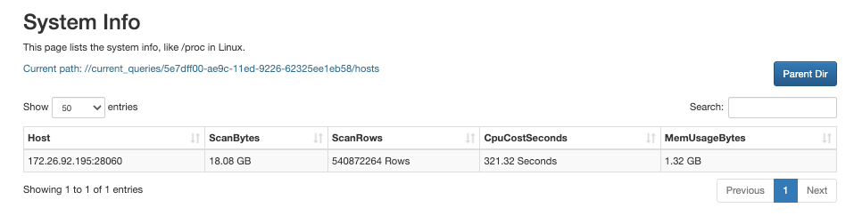

# 监控管理大查询

本文介绍如何监控和管理 StarRocks 集群中的大查询。

大查询包括扫描大量数据或占用过多 CPU 和内存资源的查询。如果不施加限制，大查询很容易耗尽集群资源并导致系统过载。为了解决这个问题，StarRocks 提供了一系列措施来监控和管理大查询，防止大查询独占集群资源。

处理 StarRocks 大查询的总体思路如下：

1. 通过资源组和查询队列对大查询设置自动预防措施。
2. 实时监控大查询，并及时终止绕过预防措施的大查询。
3. 分析审计日志和大查询日志，研究大查询的模式，优化先前设置的预防机制参数。

该功能从 3.0 版本开始支持。

## 设置大查询防御机制

StarRocks 提供了两种预防工具处理大查询——资源组和查询队列。您可以使用资源组来过滤并熔断大查询。而查询队列可以帮助您在系统达到并发阈值或资源限制时对新查询请求进行排队，从而防止系统过载。

### 通过资源组滤除大查询

资源组可以自动识别和终止大查询。在创建资源组时，您可以指定单个查询可以使用的 CPU 时间、内存使用量或 Scan 行数的上限。在命中资源组的所有查询中，任何要求更多资源的查询都将被拒绝执行并返回错误。详细信息，请参阅 [资源隔离](../administration/resource_group.md)。

在创建资源组之前，执行以下语句启用资源组功能依赖的 Pipeline 引擎功能：

```SQL
SET GLOBAL enable_pipeline_engine = true;
```

以下示例创建了一个名为 `bigQuery` 的资源组，将 CPU 时间上限限制为 `100` 秒，扫描行数上限为 `100000`，内存使用上限为 `1073741824` 字节（1 GB）：

```SQL
CREATE RESOURCE GROUP bigQuery
TO 
    (db='sr_hub')
WITH (
    'cpu_core_limit' = '10',
    'mem_limit' = '20%',
    'big_query_cpu_second_limit' = '100',
    'big_query_scan_rows_limit' = '100000',
    'big_query_mem_limit' = '1073741824'
);
```

如果一个查询所需的资源超过了以上任何一个限制，StarRocks 将不会执行该查询并返回错误。以下示例显示了当查询 Scan 行数超过限制时返回的错误消息：

```Plain
ERROR 1064 (HY000): exceed big query scan_rows limit: current is 4 but limit is 1
```

如果这是您首次设置资源组，我们建议您设置相对较高的限制，以免阻碍常规查询。在更好地了解集群中大查询的模式之后，您可以进一步优化这些限制。

### 通过查询队列缓解系统过载

查询队列用于在集群资源占用超过预定阈值时防止系统过载情况恶化。您可以为最大并发数、内存使用率和 CPU 使用率设置阈值。当系统资源占用达到其中任何一个阈值时，StarRocks 会自动对新增查询进行排队。待处理查询在队列中等待执行，或在达到资源阈值时被取消。有关详细信息，请参阅 [查询队列](../administration/query_queues.md)。

执行以下语句为 SELECT 查询启用查询队列功能：

```SQL
SET GLOBAL enable_query_queue_select = true;
```

启用查询队列功能后，您可以定义触发查询队列的规则。

- 指定触发查询队列的查询并发阈值。

  以下示例将并发阈值设置为 `100`：

  ```SQL
  SET GLOBAL query_queue_concurrency_limit = 100;
  ```

- 指定触发查询队列的内存使用率阈值。

  以下示例将内存使用率阈值设置为 `0.9`：

  ```SQL
  SET GLOBAL query_queue_mem_used_pct_limit = 0.9;
  ```

- 指定触发查询队列的 CPU 使用率阈值。

  以下示例将 CPU 千分比使用率（CPU 使用率 * 1000）阈值设置为 `800`：

  ```SQL
  SET GLOBAL query_queue_cpu_used_permille_limit = 800;
  ```

您还可以通过配置最大队列长度和队列中每个待处理查询的超时时间来决定如何处理队列中的查询。

- 指定最大查询队列长度。当队列长度达到此阈值时，新增查询将被拒绝执行。

  以下示例将查询队列长度设置为 `100`：

  ```SQL
  SET GLOBAL query_queue_max_queued_queries = 100;
  ```

- 指定队列中等待处理的查询的最大超时时间。当达到这个阈值时，该查询将被拒绝执行。

  以下示例将最大超时时间设置为 `480` 秒：

  ```SQL
  SET GLOBAL query_queue_pending_timeout_second = 480;
  ```

您可以使用 [SHOW PROCESSLIST](../sql-reference/sql-statements/Administration/SHOW_PROCESSLIST.md) 查看查询是否为待处理（Pending）状态。

```Plain
mysql> SHOW PROCESSLIST;
+------+------+---------------------+-------+---------+---------------------+------+-------+-------------------+-----------+
| Id   | User | Host                | Db    | Command | ConnectionStartTime | Time | State | Info              | IsPending |
+------+------+---------------------+-------+---------+---------------------+------+-------+-------------------+-----------+
|    2 | root | xxx.xx.xxx.xx:xxxxx |       | Query   | 2022-11-24 18:08:29 |    0 | OK    | SHOW PROCESSLIST  | false     |
+------+------+---------------------+-------+---------+---------------------+------+-------+-------------------+-----------+
```

如果 `IsPending` 为 `true`，则对应的查询在查询队列中为待处理状态。

## 实时监控大查询

从 3.0 版本开始，StarRocks 支持查看集群中当前正在处理的查询以及其占用的资源。您可以实时监控集群，以防有大查询绕过预防措施并意外导致系统过载。

### 通过 MySQL 客户端监控

1. 您可以使用 [SHOW PROC](../sql-reference/sql-statements/Administration/SHOW_PROC.md) 查看当前正在处理的查询 `current_queries`。

   ```SQL
   SHOW PROC '/current_queries';
   ```

   StarRocks 返回每个查询的 ID（`QueryId`）、对应连接 ID（`ConnectionId`），以及其资源消耗，包括扫描的数据大小（`ScanBytes`）、处理的数据行数（`ProcessRows`）、CPU 时间（`CPUCostSeconds`）、内存使用量（`MemoryUsageBytes`）和执行时间（`ExecTime`）。

   ```Plain
   mysql> SHOW PROC '/current_queries';
   +--------------------------------------+--------------+------------+------+-----------+----------------+----------------+------------------+----------+
   | QueryId                              | ConnectionId | Database   | User | ScanBytes | ProcessRows    | CPUCostSeconds | MemoryUsageBytes | ExecTime |
   +--------------------------------------+--------------+------------+------+-----------+----------------+----------------+------------------+----------+
   | 7c56495f-ae8b-11ed-8ebf-00163e00accc | 4            | tpcds_100g | root | 37.88 MB  | 1075769 Rows   | 11.13 Seconds  | 146.70 MB        | 3804     |
   | 7d543160-ae8b-11ed-8ebf-00163e00accc | 6            | tpcds_100g | root | 13.02 GB  | 487873176 Rows | 81.23 Seconds  | 6.37 GB          | 2090     |
   +--------------------------------------+--------------+------------+------+-----------+----------------+----------------+------------------+----------+
   2 rows in set (0.01 sec)
   ```

2. 您可以通过指定查询 ID 进一步查看该查询在每个 BE 节点上的资源消耗。

   ```SQL
   SHOW PROC '/current_queries/<QueryId>/hosts';
   ```

   StarRocks 返回该查询在每个 BE 节点上的扫描数据大小（`ScanBytes`）、扫描数据行数（`ScanRows`）、CPU 时间（`CPUCostSeconds`）和内存使用量（`MemUsageBytes`）。

   ```Plain
   mysql> show proc '/current_queries/7c56495f-ae8b-11ed-8ebf-00163e00accc/hosts';
   +--------------------+-----------+-------------+----------------+---------------+
   | Host               | ScanBytes | ScanRows    | CpuCostSeconds | MemUsageBytes |
   +--------------------+-----------+-------------+----------------+---------------+
   | 172.26.34.185:8060 | 11.61 MB  | 356252 Rows | 52.93 Seconds  | 51.14 MB      |
   | 172.26.34.186:8060 | 14.66 MB  | 362646 Rows | 52.89 Seconds  | 50.44 MB      |
   | 172.26.34.187:8060 | 11.60 MB  | 356871 Rows | 52.91 Seconds  | 48.95 MB      |
   +--------------------+-----------+-------------+----------------+---------------+
   3 rows in set (0.00 sec)
   ```

### 通过 FE 控制台监控

除了 MySQL 客户端，您还可以使用 FE 控制台进行可视化、交互式的监控。

1. 在浏览器中输入以下 URL 进入 FE 控制台：

   ```Bash
   http://<fe_IP>:<fe_http_port>/system?path=//current_queries
   ```

   

   您可以在 **System Info** 页面上查看当前正在处理的查询及其资源消耗。

2. 点击对应查询的 **QueryID**。

   

   您可以在新页面中查看该查询在各节点上的资源消耗信息。

### 手动终止大查询

如果有大查询绕过了您设置的预防措施并威胁到系统可用性，您可以通过在 [KILL](../sql-reference/sql-statements/Administration/KILL.md) 语句中使用该查询对应的连接 ID 手动终止该查询：

```SQL
KILL QUERY <ConnectionId>;
```

## 分析大查询日志

从 3.0 版本开始，StarRocks 支持大查询日志，保存在 **fe/log/fe.big_query.log** 文件中。与 StarRocks 审计日志相比，大查询日志额外打印以下三个字段：

- `bigQueryLogCPUSecondThreshold`
- `bigQueryLogScanBytesThreshold`
- `bigQueryLogScanRowsThreshold`

这三个字段对应您定义的资源消耗阈值，用于确定查询是否为大查询。

执行以下语句启用大查询日志：

```SQL
SET GLOBAL enable_big_query_log = true;
```

启用大查询日志后，您可以定义触发打印大查询日志的规则。

- 指定触发 Big Query Logs 的 CPU 时间阈值。

  以下示例将 CPU 时间阈值设置为 `600` 秒：

  ```SQL
  SET GLOBAL big_query_log_cpu_second_threshold = 600;
  ```

- 指定触发大查询日志的扫描数据大小阈值。

  以下示例将扫描数据大小阈值设置为 `10737418240` Byte (10 GB)：

  ```SQL
  SET GLOBAL big_query_log_scan_bytes_threshold = 10737418240;
  ```

- 指定触发大查询日志的扫描数据行数阈值。

  以下示例将扫描数据行数阈值设置为 `1500000000`：

  ```SQL
  SET GLOBAL big_query_log_scan_rows_threshold = 1500000000;
  ```

## 微调防御机制

从实时监控和大查询日志中获得的统计数据中，您可以了解集群中被遗漏的大查询（或被错误当成大查询的常规查询）的模式，然后优化资源组和查询队列的设置。

如果有较大部分的大查询符合某种 SQL 模式，而您想永久禁止这种 SQL 模式，您可以将这种模式添加到 SQL 黑名单中。StarRocks 不会执行与 SQL 黑名单中任意模式相匹配的查询，并返回错误。详细信息，请参阅 [管理 SQL 黑名单](../administration/Blacklist.md)。

执行以下语句启用SQL 黑名单：

```SQL
ADMIN SET FRONTEND CONFIG ("enable_sql_blacklist" = "true");
```

然后，您可以使用 [ADD SQLBLACKLIST](../sql-reference/sql-statements/Administration/ADD_SQLBLACKLIST.md) 语句将代表这种 SQL 模式的正则表达式添加到 SQL 黑名单。

以下示例将 `COUNT(DISTINCT)` 添加到 SQL 黑名单：

```SQL
ADD SQLBLACKLIST "SELECT COUNT(DISTINCT .+) FROM .+";
```
