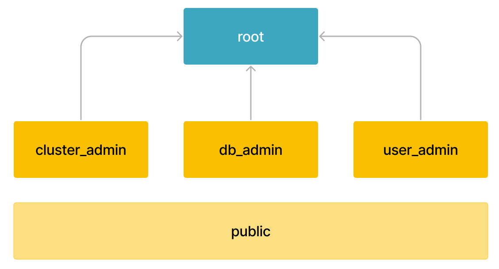
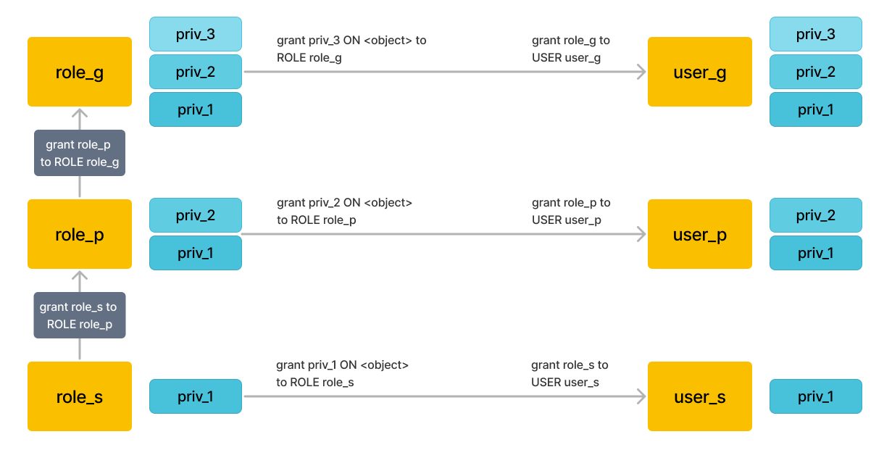

# 权限系统总览

本文介绍 StarRocks 中权限系统的基本概念。权限决定了哪些用户可以对哪些特定对象执行哪些特定的操作，从而方便您更加安全地管控数据和资源。

> **版本提示**：本文介绍的权限管理系统从 3.0 版本开始提供。升级后的权限框架、语法与旧的系统无法兼容，请以 3.0 版本的操作说明为准。升级后，除个别操作外，您在原有系统上的大部分操作权限仍然保留。具体差异请见权限项文档的[升级注意事项](privilege_item.md#升级注意事项)。

StarRocks 采用了两种权限模型：

- 基于角色的访问控制 (RBAC: role-based access control)：权限通过角色来进行管理，即可以将权限赋予给角色，从而通过角色传递给用户。
- 基于用户标识的访问控制 (IBAC: identity-based access control)：权限可以直接赋予给用户标识。

因此，每个用户标识拥有的最大权限范围为：它所拥有的角色权限及自身权限的并集。

基础概念：

- 对象 (Object) 是一个可以被授权访问的实体。除非进行授权，否则拒绝访问。例如 CATALOG、DATABASE、TABLE、VIEW 等。
- 权限项 (Privilege) 是一个对象的访问级别。不同的权限项代表着对目标对象的不同操作。例如 SELECT、ALTER、DROP 等。有关 StarRocks 支持的对象和权限项，参见 [权限项](privilege_item.md)。
- 用户标识 (User Identity)：用户的唯一标识，同时也是可以被授权的实体。用户标识以 `username@'userhost'` 的方式呈现，由指定的用户名和用户登录的 IP 组成。用户标识简化了属性配置，相同用户名的用户标识共享一个属性。只需将属性配置给用户名，该属性会对所有包含该用户名的用户标识生效。
- 角色 (Role)：权限的抽象合集，同时也是可以被授权的实体。可以将角色授予给用户，也可以将角色授予给其他角色产生嵌套，从而将其权限向下传递。StarRocks 提供系统预置角色，您也可以根据业务需求创建自定义角色。

下图展示了在 RBAC 和 IBAC 两种权限模型下的权限管理示例。

## 对象与权限

对象在逻辑上存在层级，这与他们所代表的概念有关。例如 Database 包含在 Catalog 中，而 Table、View、Materialized View、Function 又包含在 Database 中。下图展示了 StarRocks 系统中的对象层级关系。

对于每个对象，都有一组可以被授权的权限项，更多细节请查阅[权限项文档](privilege_item.md)。您可以通过 [GRANT](../sql-reference/sql-statements/account-management/GRANT.md) 和 [REVOKE](../sql-reference/sql-statements/account-management/REVOKE.md) 命令来对角色或用户进行权限的发放和收回。

## 用户

### 用户标识

在 StarRocks 中，每个用户都拥有唯一的用户标识。由用户登录的 IP（userhost） 和用户名（username）组成，写做：`username@'userhost'`。StarRocks 会将拥有相同用户名，但来自不同 IP 的用户识别为不同的用户标识，即 `user1@'starrocks.com'` 和 `user1@'mirrorship.com'` 是两个用户标识。

用户标识的另一种表现方式为 `username@['domain']`，其中 `domain` 为域名，可以通过 DNS 解析为一组 IP。最终表现为一组 `username@'userhost'`。其中，`userhost` 的部分可以使用 `%` 来进行模糊匹配。如果不指定 `userhost`，默认为 `'%'`，即表示从任意 host 连接到 StarRocks 的同名用户。

### 为用户授权

用户是可以被授权的实体，权限和角色均可以被赋予给用户。用户拥有的最大权限合集为自身权限与所拥有角色权限的并集。StarRocks 保证每个用户只能执行被授权的操作。

StarRocks 建议您在大部分情况下使用**角色**来分发权限。即，根据业务场景创建角色，将权限赋予给角色后，再将角色赋予给用户。对于特定用户拥有的临时、或特殊权限，通过将权限直接赋予给用户的方式进行管理。这样可以最大程度简化权限管理流程，并提供一定的灵活性。

## 角色

角色可以看做是一组权限的集合。为达到管理的简洁性，StarRocks 建议您将绝大部分日常权限尽量**通过角色来进行管理**，以避免重复性操作，保证一致性。对于特殊、临时的权限，可以直接赋予给用户。

为了方便管理，StarRocks 预置了几类具有特定权限的角色，你可以使用此类角色来满足日常管理需求。您也可以根据实际需求，灵活配置自定义角色。

角色激活后，用户可以执行对应角色拥有权限的操作。您可以为每个用户设置登录时自动激活的默认角色 (default role)，用户也可以在当前会话中手动激活拥有的角色 (active role)。

### 系统预置角色

StarRocks 提供了几类预置角色（system-defined roles）：

- `root`：拥有全局权限。root 用户默认拥有 `root` 角色。
  StarRocks 集群最初创建时，系统会自动生成 root 用户，该用户拥有 root 权限。由于 root 用户、角色的权限范围过大，建议您在后续使用和维护集群时创建新的用户和角色，避免直接使用此用户和角色。root 用户的密码请您妥善保管。
- `cluster_admin`：拥有集群的管理权限。包含对节点的操作权限，如增加、减少节点。
  `cluster_admin` 角色拥有对集群节点的上、下线权限，请妥善赋权。建议您不要将 `cluster_admin` 或任何包含此角色的自定义角色设置为用户的默认角色，防止因误操作而导致的节点变更。
- `db_admin`：拥有数据库的管理权限。包含所有 CATALOG、数据库、表、视图、物化视图、函数及全局函数、资源组、插件等对象的所有操作权限。
- `user_admin`：拥有用户和角色的管理权限。包含创建用户、角色、赋权等权限。

  上述系统预置角色旨在将复杂的数据库权限进行高度集合，以方便您的日常管理，**上述角色的权限范围不可以修改。**

  除此之外，如果您需要将某些权限赋予给所有用户，StarRocks 还提供一个预置角色 `public`。

- `public`：任何用户都拥有、并在任何会话下都默认激活此角色，包含新增用户。`public` 角色默认不拥有任何权限，您可以对此角色的权限范围进行修改。

### 用户自定义角色

您可以根据业务场景创建自定义角色，并修改其权限范围。同时，为了方便管理，您可以通过将角色赋予给角色来产生权限的继承。

#### 角色的继承关系

下图展示了权限继承的例子。

> 注意：一个角色的最多继承层数为 16。角色的继承关系不能是双向的，比如将角色 A 赋予给 B，不能同时又把 B 赋予给 A，可能会造成继承关系不清楚。

如图所示，将角色赋予给用户，用户也对应拥有了角色的权限。

- 因 `role_s` 被赋予给了 `role_p`，因此 `role_p` 隐含继承了 `role_s` 的 `priv_1`；
- 因 `role_p` 被赋予给了 `role_g`，因此 `role_g` 隐含继承了 `role_p` 的 `priv_2` 和 `role_s` 的 `priv_1`。

### 激活角色

通过激活角色 (Active Role)，用户可以将该角色的权限应用在当前会话下。您可以通过 [SELECT CURRENT_ROLE()](../sql-reference/sql-functions/utility-functions/current_role.md) 来查看当前会话内激活的角色。

#### 默认激活角色

默认角色（Default Role）即为用户登录集群时自动激活的角色，可以是 1 个或多个用户拥有的角色。管理员可以在创建用户时通过 CREATE USER 的 `DEFAULT ROLE` 关键字进行设置，也可以在后续通过 ALTER USER 进行更改。

同时用户也可以通过 [SET DEFAULT ROLE](../sql-reference/sql-statements/account-management/SET_DEFAULT_ROLE.md) 更改自己的默认角色。

默认角色为用户提供了一道基础的权限屏障。例如，用户 A 拥有 role_query 和 role_delete 两个角色，分别包含了查询和删除的权限。StarRocks 建议您仅将 role_query 作为默认角色，以防止误执行 DELETE 或 TRUNCATE 等高危操作而导致数据丢失。当您确认需要执行上述操作时，可以在手动设置激活角色后执行。

当用户没有默认角色时，在登录集群后自动激活系统预置的 `public` 角色。

#### 手动激活角色

除了默认角色，用户也可以在会话内手动选择激活一个或多个已拥有的角色。您可以通过 [SHOW GRANTS](../sql-reference/sql-statements/account-management/SHOW_GRANTS.md) 命令查看当前用户拥有的权限和可以激活的角色，并通过 [SET ROLE](../sql-reference/sql-statements/account-management/SET_ROLE.md) 命令来设置当前的激活角色，生效范围为当前会话。

SET ROLE 命令是覆盖的。例如，用户登录时是默认激活了 default_role，执行 `SET ROLE role_s`之后，用户此时拥有的是 role_s 的权限和自身权限。

## 相关文档

[管理用户权限](./User_privilege.md)
