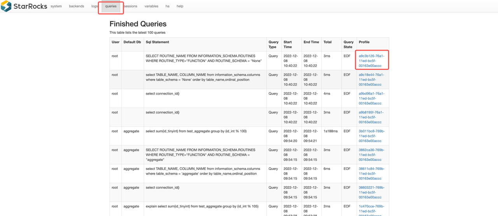

# 查看分析 Query Profile

本文介绍如何查看并分析 Query Profile。Query Profile 记录了查询中涉及的所有工作节点的执行信息。您可以通过 Query Profile 快速识别影响 StarRocks 集群查询性能的瓶颈。

## 启用 Query Profile

针对 StarRocks v2.5 之前的版本，您可以通过将变量 `is_report_success` 设置为 `true` 以启用 Query Profile：

```SQL
set is_report_success = true;
```

针对 StarRocks v2.5 或更高版本，您可以通过将变量 `enable_profile` 设置为 `true` 以启用 Query Profile：

```SQL
set enable_profile = true;
```

## 获取 Query Profile

请按照以下步骤获取 Query Profile：

1. 在浏览器中访问 `http://<fe_ip>:<fe_http_port>`。
2. 在显示的页面上，单击顶部导航中的 **queries**。
3. 在 **Finished Queries** 列表中，选择您要分析的查询并单击 **Profile** 列中的链接。



页面将跳转至相应 Query Profile。


## 分析 Query Profile

### Query Profile 结构

以下是示例 Query Profile：

```SQL
Query:
  Summary:
  Planner:
  Execution Profile 7de16a85-761c-11ed-917d-00163e14d435:
    Fragment 0:
      Pipeline (id=2):
        EXCHANGE_SINK (plan_node_id=18):
        LOCAL_MERGE_SOURCE (plan_node_id=17):
      Pipeline (id=1):
        LOCAL_SORT_SINK (plan_node_id=17):
        AGGREGATE_BLOCKING_SOURCE (plan_node_id=16):
      Pipeline (id=0):
        AGGREGATE_BLOCKING_SINK (plan_node_id=16):
        EXCHANGE_SOURCE (plan_node_id=15):
    Fragment 1:
       ...
    Fragment 2:
       ...
```

 Query Profile 由以下三部分组成：

- Fragment：执行树。一个查询由一个或多个 Fragment 组成。
- Pipeline：执行链。执行链没有分支。一个 Fragment 可分为多个 Pipeline。
- Operator：算子。一个 Pipeline 由多个 Operator 组成。


### 重要指标

Query Profile 包含大量查询执行详细信息的指标。在大多数情况下，您只需关注运算符的执行时间以及处理的数据量大小即可。找到瓶颈后，您就可以有针对性地解决它们。

#### Summary 指标

| 指标         | 说明                                                         |
| ------------ | ------------------------------------------------------------ |
| Total        | 查询消耗的总时间，包括 Planning、Executing 以及 Profiling 阶段耗时。 |
| QueryCpuCost | 查询累积 CPU 使用时间。所有并发进程累加，因此该指标会大于实际的执行时间。 |
| QueryMemCost | 查询的总内存消耗。                                           |

#### Operator 通用指标

| 指标              | 说明                    |
| ----------------- | ----------------------- |
| OperatorTotalTime | Operator 消耗的总时间。 |
| PushRowNum        | Operator 累积输入行数。 |
| PullRowNum        | Operator 累积输出行数。 |

#### Unique 指标

| 指标              | 说明                        |
| ----------------- | -------------------------- |
| IOTaskExecTime    | 所有 I/O Task 的累计执行时间。 |
| IOTaskWaitTime    | 所有 I/O Task 的累计等待时间。 |
| MorselsCount      | I/O Task 的总数。            |

#### Scan operator

| 指标                            | 说明                                              |
| ------------------------------- | ------------------------------------------------- |
| Table                           | 表名称。                                          |
| ScanTime                        | Scan 累计时间。Scan 操作在异步 I/O 线程池中完成。 |
| TabletCount                     | Tablet 数量。                                     |
| PushdownPredicates              | 下推的谓词数量。                                  |
| BytesRead                       | 读取数据的大小。                                  |
| CompressedBytesRead             | 读取压缩数据的大小。                              |
| IOTime                          | 累计 I/O 时间。                                   |
| BitmapIndexFilterRows           | Bitmap 索引过滤的数据行数。                       |
| BloomFilterFilterRows           | Bloomfilter 过滤的数据行数。                      |
| SegmentRuntimeZoneMapFilterRows | Runtime Zone Map 过滤的数据行数。                 |
| SegmentZoneMapFilterRows        | Zone Map 过滤的数据行数。                         |
| ShortKeyFilterRows              | Short Key 过滤的数据行数。                        |
| ZoneMapIndexFilterRows          | Zone Map 索引过滤的数据行数。                     |

#### Exchange operator

| 指标              | 说明                                                         |
| ----------------- | ------------------------------------------------------------ |
| PartType          | 数据分布模式，包括：`UNPARTITIONED`、`RANDOM`、`HASH_PARTITIONED` 以及 `BUCKET_SHUFFLE_HASH_PARTITIONED`。 |
| BytesSent         | 发送的数据大小。                                             |
| OverallThroughput | 吞吐速率。                                                   |
| NetworkTime       | 数据包传输时间（不包括接收后处理时间）。请参阅下方 FAQ，了解有关指标计算以及潜在异常的更多信息。 |
| WaitTime          | 由于发送端队列满而导致的等待时间。                           |

#### Aggregate operator

| 指标               | 说明               |
| ------------------ | ------------------ |
| GroupingKeys       | GROUP BY 列。      |
| AggregateFunctions | 聚合函数。         |
| AggComputeTime     | 聚合函数计算耗时。 |
| ExprComputeTime    | 表达式计算耗时。   |
| HashTableSize      | Hash Table 大小。  |

#### Join operator

| 指标                      | 说明                        |
| ------------------------- | --------------------------- |
| JoinPredicates            | Join 谓词。                 |
| JoinType                  | Join 类型。                 |
| BuildBuckets              | Hash Table 的 Bucket 数量。 |
| BuildHashTableTime        | 构建 Hash Table 耗时。      |
| ProbeConjunctEvaluateTime | Probe Conjunct 耗时。       |
| SearchHashTableTimer      | 查询 Hash Table 耗时。      |

#### Window Function operator

| 指标               | 说明               |
| ------------------ | ------------------ |
| ComputeTime        | 窗口函数计算耗时。 |
| PartitionKeys      | 分区列。           |
| AggregateFunctions | 聚合函数。         |

#### Sort operator

| 指标     | 说明                                            |
| -------- | ----------------------------------------------- |
| SortKeys | 排序键。                                        |
| SortType | 查询结果排序方式：全排序或者排序 Top N 个结果。 |

#### TableFunction operator

| 指标                   | 说明                      |
| ---------------------- | ------------------------- |
| TableFunctionExecTime  | Table Function 计算耗时。 |
| TableFunctionExecCount | Table Function 执行次数。 |

#### Project operator

| 指标                     | 说明                   |
| ------------------------ | ---------------------- |
| ExprComputeTime          | 表达式计算耗时。       |
| CommonSubExprComputeTime | 公共子表达式计算耗时。 |

#### LocalExchange operator

| 指标       | 说明                                                         |
| ---------- | ------------------------------------------------------------ |
| Type       | Local Exchange 类型，包括：`Passthrough`、Partition` 以及 `Broadcast`。 |
| ShuffleNum | Shuffle 数量。该指标仅当 `Type` 为 `Partition` 时有效。      |

#### Hive Connector

| 指标                      | 说明                        |
| ------------------------- | --------------------------- |
| ScanRanges                | 扫描的数据分片总数。             |
| ReaderInit                | Reader 初始化时间。           |
| ColumnReadTime            | Reader 读取和解析数据时间。    |
| ExprFilterTime            | 表达式过滤时间。              |
| RowsRead                  | 读取的数据行数。                |

#### Input Stream

| 指标                      | 说明                        |
| ------------------------- | --------------------------- |
| AppIOBytesRead            | 应用层读取的数据量。            |
| AppIOCounter              | 应用层读取的 I/O 次数。          |
| AppIOTime                 | 应用层累计读取时间。          |
| FSBytesRead               | 存储系统读取的数据量。          |
| FSIOCounter               | 存储层读取的 I/O 次数。          |
| FSIOTime                  | 存储层累计读取时间。        |

### Operator 耗时

- 对于 OlapScan 和 ConnectorScan Operator，其耗时相当于 `OperatorTotalTime + ScanTime`。因为 Scan Operator 在异步 I/O 线程池中进行 I/O 操作，所以 ScanTime 为异步 I/O 时间。
- Exchange Operator 的耗时相当于 `OperatorTotalTime + NetworkTime`。因为 Exchange Operator 在 bRPC 线程池中收发数据包，NetworkTime 即为网络传输消耗的时间。
- 对于其他 Operator，其耗时为 `OperatorTotalTime`。

### Metric 合并以及 MIN/MAX 值

Pipeline Engine 是并行计算引擎。每个 Fragment 被分发到多台机器上并行处理，每台机器上的 Pipeline 作为多个并发实例同时执行。因此，在统计 Profile 时，StarRocks 会合并相同的指标，并记录所有并发实例中每个指标的最小值和最大值。

不同种类的指标采用了不同的合并策略：

- 时间类指标求平均值。例如：
  - `OperatorTotalTime` 是所有并发实例的平均耗时。
  - `__MAX_OF_OperatorTotalTime` 是所有并发实例中的最大耗时。
  - `__MIN_OF_OperatorTotalTime` 是所有并发实例中的最小耗时。

```SQL
             - OperatorTotalTime: 2.192us
               - __MAX_OF_OperatorTotalTime: 2.502us
               - __MIN_OF_OperatorTotalTime: 1.882us
```

- 非时间类指标求和。例如：
  - `PullChunkNum` 是该指标在所有并发实例的和。
  - `__MAX_OF_PullChunkNum` 是该指标在所有并发实例中的最大值。
  - `__MIN_OF_PullChunkNum` 是该指标在所有并发实例中的最小值。

```SQL
             - PullChunkNum: 146.66K (146660)
               - __MAX_OF_PullChunkNum: 24.45K (24450)
               - __MIN_OF_PullChunkNum: 24.435K (24435)
```

- 个别没有最值的指标在所有并发实例中的值相同，例如：`DegreeOfParallelism`。

#### MIN 和 MAX 值差异过大

通常，MIN 和 MAX 值之间如果有明显差异，则表明数据有很大几率存在倾斜。可能的场景包括聚合和 Join 等。

```SQL
             - OperatorTotalTime: 2m48s
               - __MAX_OF_OperatorTotalTime: 10m30s
               - __MIN_OF_OperatorTotalTime: 279.170us
```

## 可视化 Query Profile

如果您是 StarRocks 企业版用户，则可以通过 StarRocks Manager 可视化您的 Query Profile。

**执行概览**页面显示了一些 Summary 指标，包括总执行时间`ExecutionWallTime`、I/O 指标、网络传输大小以及 CPU 和 I/O 耗时比例。


单击 Operator（节点）的卡片，可以在页面右侧的选项卡中查看其详细信息。共有三个选项卡：

- **节点**：该 Operator 的核心指标。
- **节点详情**: 该 Operator 的所有指标。
- **Pipeline**: 该 Operator 所属 Pipeline 指标。该选项卡中的指标仅与调度相关，您无需过多关注。


### 确认查询瓶颈

Operator 花费的时间比例越大，其对应卡片的颜色就越深。您可借此轻松确认查询的瓶颈。


### 确认数据是否倾斜

点击占用时间占比较大的 Operator 卡片，查看其 `MaxTime` 和 `MinTime` 指标。通常，`MaxTime` 和 `MinTime` 之间如果存在明显差异，则表示数据存在倾斜。


然后，单击**节点详情**选项卡，并查看是否有任何异常指标。在以下示例中，聚合运算符的指标 `PushRowNum` 显示数据倾斜。


### 确认分桶或分区裁剪是否生效

您可以通过 `EXPLAIN <sql_statement>` 语句查看查询对应的 Query Plan 以查看分区或分桶裁剪是否生效。


### 确认物化视图选择是否正确

单击相应的 Scan Operator 的卡片并查看**节点详情**选项卡上的 `Rollup` 字段。


### 确认 Join 左右表 Plan 是否合理

通常，StarRocks 会选择较小的表作为 Join 的右表。如果 Query Profile 显示右表的数据量明显大于左表，则该 Join Plan 异常。


### 确认 Join 分布方式是否正确

按照数据分布类型，Exchange Operator 可分为三类：

- `UNPARTITIONED`：Broadcast。数据被拷贝多份，然后发送至多台 BE。
- `RANDOM`：Round robin。
- `HASH_PARTITIONED` 和 `BUCKET_SHUFFLE_HASH_PARTITIONED`：Shuffle。`HASH_PARTITIONED` 和 `BUCKET_SHUFFLE_HASH_PARTITIONED` 区别在于计算 Hash Code 所使用的 Hash 函数不同。

对于 Inner Join，右表可以是 `HASH_PARTITIONED` 和`BUCKET_SHUFFLE_HASH_PARTITIONED` 类型或者 `UNPARTITIONED` 类型。通常只有在右表行数小于 100K 时才采用 `UNPARTITIONED` 类型。

在以下示例中，Exchange Operator 的类型是 Broadcast，但是该 Operator 传输的数据量远远超过了阈值。


### 确认 JoinRuntimeFilter 是否生效

当 Join 的右孩子构建 Hash Table 时，会构建 Runtime Filter，该 Runtime Filter 会被投递到左子树，并尽可能地下推到 Scan Operator。您可以在 Scan Operator 的**节点详情**选项卡上查看与 JoinRuntimeFilter 相关的指标。


## FAQ

### 为什么 Exchange Operator 时间异常？


Exchange Operator 的耗时由两部分组成：CPU 时间和网络时间。网络时间依赖于系统时钟。网络时间计算方式如下：

1. 发送端在调用 bRPC 接口发送包之前记录 `send_timestamp`。
2. 接收端从 bRPC 接口收到包后记录 `receive_timestamp`（不包括接收后处理时间）。
3. 处理完成后，接收端发送 Response 并计算网络延迟。数据包传输时延等于 `receive_timestamp` - `send_timestamp`。

如果不同机器的系统时钟不一致，Exchange Operator 的耗时就会出现异常。

### 为什么各 Operator 时间之和远小于查询实际的执行时间？

可能原因：在高并发场景下，有些 Pipeline Driver 虽然可以调度，但可能会因为排队而无法及时执行。等待时间不会记录在 Operator 的指标中，而是记录在 `PendingTime`、`ScheduleTime` 和 `IOTaskWaitTime` 中。

示例：

从 Pipeline Profile 中可以看到 `ExecutionWallTime` 大约为 463 毫秒。但是，所有 Operator 的总耗时却不足 20 毫秒，明显小于 `ExecutionWallTime`。


