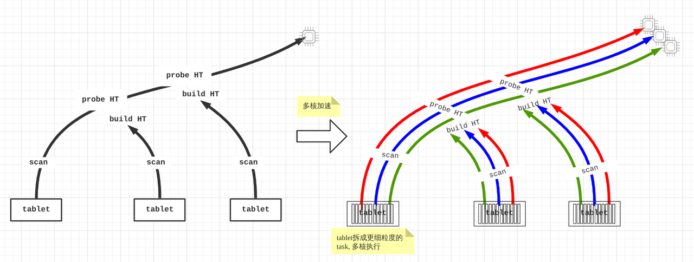

# Query Profile 结构与详细指标

## Query Profile 的结构

Query Profile 的结构与执行引擎的设计密切相关，由以下五部分组成：

- Fragment：执行树。一个查询由一个或多个 Fragment 组成。
- FragmentInstance：每个 Fragment 可以有多个实例，每个实例称为 FragmentInstance，分别由不同的计算节点来执行。
- Pipeline：一个 FragmentInstance 会被拆分成多个 Pipeline。Pipeline 是一个执行链，有一组收尾相接的 Operator 构成。
- PipelineDriver：一个 Pipeline 可以有多个实例，每个实例称为 PipelineDriver，以充分利用多个计算核心。
- Operator：算子。一个 PipelineDriver 由多个 Operator 组成。



### Query Profile 的合并策略

通过分析上述结构，我们可以轻易观察到，同一个 Fragment 关联的多个 FragmentInstance 在结构上具有高度相似性。同样的，归属于同一 Pipeline 的多个 PipelineDriver 也展现出类似的结构特征。为了减少 Query Profile 的体积，我们可以考虑将 FragmentInstance 层进行合并，同样的方法也适用于 PipelineDriver 层。经过这样的合并处理，原本的五层结构便简化为三层，具体表现为：

- Fragment
- Pipeline
- Operator

我们可以通过一个 Session 变量 `pipeline_profile_level` 来控制这个合并行为，其可选值有2个：

- `1`：合并，即三层结构。默认值。
- `2`：不合并，即保留原始的五层结构
- 其他任何数值都会被当成默认值 `1` 来处理

通常，我们并不推荐将该参数设置为 `2`。原因在于，五层结构的 Query Profile 面临众多限制，如无法借助任何工具进行可视化分析，只能依靠人工直接观察来分析。因此，除非合并过程中导致了关键信息的丢失，否则通常没有必要调整这个参数。

### Metric 合并以及 MIN/MAX 值

在 FragmentInstance 和 PipelineDriver 进行合并时，需要对所有同名的指标进行合并，并记录所有并发实例中每个指标的最小值和最大值。不同种类的指标采用了不同的合并策略：

- 时间类指标求平均值。例如：
  - `OperatorTotalTime` 是所有并发实例的平均耗时。
  - `__MAX_OF_OperatorTotalTime` 是所有并发实例中的最大耗时。
  - `__MIN_OF_OperatorTotalTime` 是所有并发实例中的最小耗时。

```SQL
             - OperatorTotalTime: 2.192us
               - __MAX_OF_OperatorTotalTime: 2.502us
               - __MIN_OF_OperatorTotalTime: 1.882us
```

- 非时间类指标求和。例如：
  - `PullChunkNum` 是该指标在所有并发实例的和。
  - `__MAX_OF_PullChunkNum` 是该指标在所有并发实例中的最大值。
  - `__MIN_OF_PullChunkNum` 是该指标在所有并发实例中的最小值。

```SQL
             - PullChunkNum: 146.66K (146660)
               - __MAX_OF_PullChunkNum: 24.45K (24450)
               - __MIN_OF_PullChunkNum: 24.435K (24435)
```

- 个别没有最值的指标在所有并发实例中的值相同，例如：`DegreeOfParallelism`。


通常，MIN 和 MAX 值之间如果有明显差异，则表明数据有很大几率存在倾斜。可能的场景包括聚合和 Join 等。

```SQL
             - OperatorTotalTime: 2m48s
               - __MAX_OF_OperatorTotalTime: 10m30s
               - __MIN_OF_OperatorTotalTime: 279.170us
```

## Query Profile 指标清单

Query Profile 包含大量查询执行详细信息的指标。在大多数情况下，您只需关注运算符的执行时间以及处理的数据量大小即可。找到瓶颈后，您就可以有针对性地解决它们。

### Summary 指标

| 指标 | 说明 |
| --- | --- |
| Total | 查询消耗的总时间，包括 Planning、Executing 以及 Profiling 阶段耗时。 |
| Query State | 查询状态，可能状态包括 Finished、Error 以及 Running。  |

### Execution Overview 指标

| 指标 | 说明 |
| --- | --- |
| FrontendProfileMergeTime | Query Profile 在 FE 侧的处理时间 |
| QueryAllocatedMemoryUsage | 所有计算节点，累计分配内存之和 |
| QueryDeallocatedMemoryUsage | 所有计算节点，累计释放内存之和 |
| QueryPeakMemoryUsage | 所有计算节点中，峰值内存的最大值 |
| QueryExecutionWallTime | 执行的墙上时间 |
| QueryCumulativeCpuTime | 所有计算节点，累计 CPU 耗时之和 |
| QueryCumulativeOperatorTime | 所有节点耗时之和。这里是简单的线性累加，但实际上，不同的算子的执行时间可能是有重叠的。该参数作为计算算子时间占比的分母 |
| QueryCumulativeNetworkTime | 所有 Exchange 节点的网络时间之和。这里是简单的线性累加，但实际上，不同 Exchange 的执行时间可能是有重叠的 |
| QueryCumulativeScanTime | 所有 Scan 节点的 IO 时间之和。这里是简单的线性累加，但实际上，不同 Scan 的执行时间可能是有重叠的 |
| QueryPeakScheduleTime | 所有Pipeline中，ScheduleTime 指标的最大值 |
| QuerySpillBytes | Spill字节数量 |
| ResultDeliverTime | 传输结果的额外耗时，对于查询语句，这个参数是指数据传回客户端的时间；对于插入语句，这个参数是指数据写入到存储层的时间 |

### Fragment 指标

| 指标 | 说明 |
| --- | --- |
| InstanceNum | 该 Fragment 的所有 FragmentInstance 的数量 |
| InstanceIds | 该 Fragment 的所有 FragmentInstance ID |
| BackendNum | 参与该 Fragment 执行的 BE 的数量 |
| BackendAddresses | 参与该 Fragment 执行的所有 BE 的地址信息 |
| InstanceIds | 该 Fragment 的所有 FragmentInstance ID |
| FragmentInstancePrepareTime | Fragment Prepare 阶段的耗时 |
| InstanceAllocatedMemoryUsage | 该 Fragment 下所有 FragmentInstance 的累计分配内存 |
| InstanceDeallocatedMemoryUsage | 该 Fragment 下所有 FragmentInstance 的累计释放内存 |

### Pipeline 指标

核心指标的关系如下图所示：

- DriverTotalTime = ActiveTime + PendingTime + ScheduleTime
- ActiveTime = ∑ OperatorTotalTime + OverheadTime
- PendingTime = InputEmptyTime + OutputFullTime + PreconditionBlockTime + PendingFinishTime
- InputEmptyTime = FirstInputEmptyTime + FollowupInputEmptyTime


| 指标              | 说明                    |
| ----------------- | ----------------------- |
| DegreeOfParallelism | 并行度。 |
| TotalDegreeOfParallelism | 并行度之和。由于同一个 Pipeline 会在多个机器执行，这里就把所有的并行度累加起来。 |
| DriverPrepareTime | 执行 Prepare 的时间，该时间不包括在 DriverTotalTime 中。 |
| DriverTotalTime | Pipeline 的执行总时间。不包括 prepare 阶段的耗时。 |
| ActiveTime | Pipeline 的执行时间，包括各个算子的执行时间，以及整个框架的 Overhead，包括调用has_output，need_input 这些方法时间。 |
| PendingTime | Pipeline 由于各种原因，无法被调度执行而阻塞的时间。 |
| InputEmptyTime | Pipeline 由于输入队列为空而导致被阻塞的时间。 |
| FirstInputEmptyTime | Pipeline 第一次由于输入队列为空导致的阻塞时间。单独把第一次提出来是因为，第一次等待，大概率是由于 Pipeline 的依赖关系产生的。 |
| FollowupInputEmptyTime | Pipeline 后续（第二次开始）所有因为输入队列为空导致的阻塞时间。 |
| OutputFullTime | Pipeline 由于输出队列满而导致被阻塞的时间。 |
| PreconditionBlockTime | Pipeline 由于依赖条件未满足而导致被阻塞的时间。 |
| PendingFinishTime | Pipeline 由于等待异步任务结束执行而导致被阻塞的时间。 |
| ScheduleTime | Pipeline 的调度时间，即进入就绪队列，到被调度执行的这段时间。 |
| BlockByInputEmpty | 由于 InputEmpty 从而被 Block 的次数。 |
| BlockByOutputFull | 由于 OutputFull 从而被 Block 的次数。 |
| BlockByPrecondition | 由于前置依赖未就绪从而被 Block 的次数。 |

### Operator 通用指标

| 指标 | 说明 |
| --- | --- |
| OperatorAllocatedMemoryUsage | Operator 累计分配的内存。 |
| OperatorDeallocatedMemoryUsage | Operator 累计释放的内存。 |
| OperatorPeakMemoryUsage | Operator 的峰值内存。该指标仅对于部分物化算子有意义，例如聚合、排序、Join 等。而对于 Project 等算子无意义，因为内存在当前算子分配，在后续算子释放，对于当前算子来说，峰值内存就等同于累计分配的内存。 |
| PrepareTime | Prepare 的时间。 |
| OperatorTotalTime | Operator 消耗的总时间。且满足：OperatorTotalTime = PullTotalTime + PushTotalTime + SetFinishingTime + SetFinishedTime + CloseTime。不包含 Prepare 的时间。 |
| PullTotalTime | Operator 执行 push_chunk 的总时间。 |
| PushTotalTime | Operator 执行 pull_chunk 的总时间。 |
| SetFinishingTime | Operator 执行 set_finishing 的总时间。 |
| SetFinishedTime | Operator 执行 set_finished 的总时间。 |
| PushRowNum | Operator 累积输入行数。 |
| PullRowNum | Operator 累积输出行数。 |
| JoinRuntimeFilterEvaluate | Join Runtime Filter 执行的次数。 |
| JoinRuntimeFilterHashTime | Join Runtime Filter 计算Hash的时间。 |
| JoinRuntimeFilterInputRows | Join Runtime Filter 的输入行数。 |
| JoinRuntimeFilterOutputRows | Join Runtime Filter 的输出行数。 |
| JoinRuntimeFilterTime | Join Runtime Filter 的耗时。 |

### Unique 指标

### Scan Operator

Scan Operator 会使用一个额外的线程池来执行 IO 任务，因此该节点的时间指标的关系如下：


#### OLAP Scan Operator

为了帮助大家更好地理解 Scan Operator 中的各项指标，以下图形将清晰展示这些指标与存储结构之间的关联。


| 一级指标 | 二级指标 | 三级指标 | 说明 |
| --- | --- | --- | --- |
| Table |  |  | 表名称。 |
| Rollup |  |  | 物化视图名称。如果没有命中物化视图的话，等同于表名称。 |
| SharedScan |  |  | 是否启用了 enable_shared_scan Session 变量。 |
| TabletCount |  |  | Tablet 数量。 |
| MorselsCount |  |  | Morsel 数量。 |
| PushdownPredicates |  |  | 下推的谓词数量。 |
| Predicates |  |  | 谓词表达式。 |
| BytesRead |  |  | 读取数据的大小。 |
| CompressedBytesRead |  |  | 从磁盘上读取的压缩数据的大小。 |
| UncompressedBytesRead |  |  | 从磁盘上读取的未压缩数据的大小。 |
| RowsRead |  |  | 读取的行数（谓词过滤后的行数）。 |
| RawRowsRead |  |  | 读取的原始行数（谓词过滤前的行数）。 |
| ReadPagesNum |  |  | 读取 Page 的数量。 |
| CachedPagesNum |  |  | 缓存的 Page 数量。 |
| ChunkBufferCapacity |  |  | Chunk Buffer 的容量。 |
| DefaultChunkBufferCapacity |  |  | Chunk Buffer 的默认容量。 |
| PeakChunkBufferMemoryUsage |  |  | Chunk Buffer 的峰值内存。 |
| PeakChunkBufferSize |  |  | Chunk Buffer 的峰值大小。 |
| PrepareChunkSourceTime |  |  | Chunk Source 的 Prepare 时间。 |
| ScanTime |  |  | Scan 累计时间。Scan 操作在异步 I/O 线程池中完成。 |
| IOTaskExecTime |  |  | IO 任务的执行时间。 |
|  | CreateSegmentIter |  | 创建 Segment 迭代器的时间。 |
|  | GetDelVec |  | 加载 DelVec（删除向量）的时间。 |
|  | GetDeltaColumnGroup |  | 加载 DelVecColumnGroup 的时间。 |
|  | GetRowsets |  | 加载 RowSet 的时间。 |
|  | IOTime |  | 文件 IO 的时间。 |
|  | LateMaterialize |  | 延迟物化的时间。 |
|  | ReadPKIndex |  | 读取 PK 索引的时间。 |
|  | SegmentInit |  | Segment 初始化的时间。 |
|  |  | BitmapIndexFilter | Bitmap 索引过滤时间。 |
|  |  | BitmapIndexFilterRows | Bitmap 索引过滤行数。 |
|  |  | BloomFilterFilter | Bloom 索引过滤时间。 |
|  |  | BloomFilterFilterRows | Bloom 索引过滤行数。 |
|  |  | ColumnIteratorInit | Column 迭代器初始化的时间。 |
|  |  | ShortKeyFilter | ShortKey 索引的过滤时间。 |
|  |  | ShortKeyFilterRows | ShortKey 索引的过滤行数。 |
|  |  | ShortKeyRangeNumber | ShortKey Range 的数量。 |
|  |  | RemainingRowsAfterShortKeyFilter | ShortKey 索引过滤后的剩余行数。 |
|  |  | ZoneMapIndexFiter | ZoneMap 索引过滤时间。 |
|  |  | ZoneMapIndexFilterRows | ZoneMap 索引过滤行数。 |
|  |  | SegmentZoneMapFilterRows | Segment ZoneMap 索引过滤行数。 |
|  |  | SegmentRuntimeZoneMapFilterRows | Segment Runtime ZoneMap 索引过滤行数。 |
|  | SegmentRead |  | Segment 读取时间。 |
|  |  | BlockFetch | Block 读取时间。 |
|  |  | BlockFetchCount | Block 读取次数。 |
|  |  | BlockSeek | Block 搜索时间。 |
|  |  | BlockSeekCount | Block 搜索次数。 |
|  |  | ChunkCopy | Chunk 拷贝时间。 |
|  |  | DecompressT | 解压缩的时间。 |
|  |  | DelVecFilterRows |  |
|  |  | PredFilter | 谓词过滤时间。 |
|  |  | PredFilterRows | 谓词过滤行数。 |
|  |  | RowsetsReadCount | Rowset 读取次数。 |
|  |  | SegmentsReadCount | Segment 读取次数。 |
|  |  | TotalColumnsDataPageCount | Column Data Page 的数量。 |
| IOTaskWaitTime |  |  | IO 任务从投递成功到被调度执行的等待时间。 |
| SubmitTaskCount |  |  | 提交 IO 任务的次数。 |
| SubmitTaskTime |  |  | 提交任务的耗时。 |
| PeakIOTasks |  |  | IO 任务的峰值数量。 |
| PeakScanTaskQueueSize |  |  | IO 任务队列的峰值大小。 |

#### Connector Scan Operator

| 一级指标 | 二级指标 | 三级指标 | 说明 |
| --- | --- | --- | --- |
| DataSourceType |  |  | 数据源类型，可以是 HiveDataSource，ESDataSource 等等。 |
| Table |  |  | 表名称。 |
| TabletCount |  |  | Tablet 数量。 |
| MorselsCount |  |  | Morsel 数量。 |
| Predicates |  |  | 谓词表达式。 |
| PredicatesPartition |  |  | 作用在分区上的谓词表达式。 |
| SharedScan |  |  | 是否启用了 enable_shared_scan Session 变量。 |
| ChunkBufferCapacity |  |  | Chunk Buffer 的容量。 |
| DefaultChunkBufferCapacity |  |  | Chunk Buffer 的默认容量。 |
| PeakChunkBufferMemoryUsage |  |  | Chunk Buffer 的峰值内存。 |
| PeakChunkBufferSize |  |  | Chunk Buffer 的峰值大小。 |
| PrepareChunkSourceTime |  |  | Chunk Source 的 Prepare 时间。 |
| ScanTime |  |  | Scan 累计时间。Scan 操作在异步 I/O 线程池中完成。 |
| IOTaskExecTime |  |  | IO 任务的执行时间。 |
|  | ColumnConvertTime |  | Column 转换的耗时。 |
|  | ColumnReadTime |  | Reader 读取和解析数据时间。 |
|  | ExprFilterTime |  | 表达式过滤时间。 |
|  | InputStream |  |  |
|  |  | AppIOBytesRead | 应用层读取的数据量。 |
|  |  | AppIOCounter | 应用层读取的 I/O 次数。 |
|  |  | AppIOTime | 应用层累计读取时间。 |
|  |  | FSIOBytesRead | 存储系统读取的数据量。 |
|  |  | FSIOCounter | 存储层读取的 I/O 次数。 |
|  |  | FSIOTime | 存储层累计读取时间。 |
|  | ORC |  |  |
|  |  | IcebergV2FormatTimer | 格式转换的耗时。 |
|  |  | StripeNumber | ORC 文件的数量。 |
|  |  | StripeSizes | ORC 文件每个 stripe 的平均大小。 |
|  | OpenFile |  | 打开文件的耗时。 |
|  | ReaderInit |  | 初始化 Reader的耗时。 |
|  | RowsRead |  | 读取数据的行数。 |
|  | RowsSkip |  | 跳过的行数。 |
|  | ScanRanges |  | 扫描的数据分片总数。 |
|  | SharedBuffered |  |  |
|  |  | DirectIOBytes | 直接 IO 读取的数据量。 |
|  |  | DirectIOCount | 直接 IO 的次数。|
|  |  | DirectIOTime | 直接 IO 的耗时。 |
|  |  | SharedIOBytes | 共享 IO 读取的数据量 |
|  |  | SharedIOCount | 共享 IO 的次数。 |
|  |  | SharedIOTime | 共享 IO 的耗时。 |
| IOTaskWaitTime |  |  | IO 任务从投递成功到被调度执行的等待时间。 |
| SubmitTaskCount |  |  | 提交 IO 任务的次数。 |
| SubmitTaskTime |  |  | 提交任务的耗时。 |
| PeakIOTasks |  |  | IO 任务的峰值数量。 |
| PeakScanTaskQueueSize |  |  | IO 任务队列的峰值大小。 |


### Exchange Operator

#### Exchange Sink Operator

| 指标 | 说明 |
| --- | --- |
| ChannelNum | Channel 数量。一般来说，有几个接收端，就有几个Channel。 |
| DestFragments | 接收端 FragmentInstance ID 列表。 |
| DestID | 接收端节点 ID。 |
| PartType | 数据分布模式，包括：UNPARTITIONED、RANDOM、HASH_PARTITIONED 以及 BUCKET_SHUFFLE_HASH_PARTITIONED。 |
| SerializeChunkTime | 序列化 Chunk 的耗时。 |
| SerializedBytes | 序列化的数据大小。 |
| ShuffleChunkAppendCounter | 当 PartType 为 HASH_PARTITIONED 或 BUCKET_SHUFFLE_HASH_PARTITIONED 时，Chunk Append 的次数。 |
| ShuffleChunkAppendTime | 当 PartType 为 HASH_PARTITIONED 或 BUCKET_SHUFFLE_HASH_PARTITIONED 时，Chunk Append 的耗时。 |
| ShuffleHashTime | 当 PartType 为 HASH_PARTITIONED 或 BUCKET_SHUFFLE_HASH_PARTITIONED 时，计算 Hash 的耗时。 |
| RequestSent | 发送的数据包的数量。 |
| RequestUnsent | 未发送的数据包的数量。存在短路逻辑时，该指标不为0。其他情况下，该指标为0。 |
| BytesSent | 发送的数据大小。 |
| BytesUnsent | 未发送数据大小。存在短路逻辑时，该指标不为0。其他情况下，该指标为0。 |
| BytesPassThrough | 当目的节点就是当前节点时，不再通过网络传输数据，即PassThrough的数据大小。通过 enable_exchange_pass_through 开启 PassThrough。 |
| PassThroughBufferPeakMemoryUsage | PassThrough Buffer的峰值内存。 |
| CompressTime | 压缩时间。 |
| CompressedBytes | 压缩数据大小。 |
| OverallThroughput | 吞吐速率。 |
| NetworkTime | 数据包传输时间（不包括接收后处理时间）。请参阅下方 FAQ，了解有关指标计算以及潜在异常的更多信息。 |
| NetworkBandwidth | 网络带宽估算值。 |
| WaitTime | 由于发送端队列满而导致的等待时间。 |
| OverallTime | 整个传输过程的总耗时。即，发送第一个数据包，到确认最后一个数据包已被正确接收的这段时间。 |
| RpcAvgTime | Rpc的平均耗时。 |
| RpcCount | Rpc的总次数。 |

#### Exchange Source Operator

| 指标 | 说明 |
| --- | --- |
| RequestReceived | 接收的数据包的大小。 |
| BytesReceived | 接收的数据大小。 |
| DecompressChunkTime | 解压缩的耗时。 |
| DeserializeChunkTime | 反序列化的耗时。 |
| ClosureBlockCount | 阻塞的 Closure 的数量。 |
| ClosureBlockTime | Closure 的阻塞时间。 |
| ReceiverProcessTotalTime | 接收端处理的耗时。 |
| WaitLockTime | 锁的等待时间。 |

### Aggregate Operator

| 指标 | 说明 |
| --- | --- |
| GroupingKeys | GROUP BY 列。 |
| AggregateFunctions | 聚合函数计算耗时。 |
| AggComputeTime | AggregateFunctions +  Group By耗时。 |
| ChunkBufferPeakMem | Chunk Buffer 峰值内存。 |
| ChunkBufferPeakSize | Chunk Buffer 峰值大小。 |
| ExprComputeTime | 表达式计算耗时。 |
| ExprReleaseTime | 表达式 Release 耗时。 |
| GetResultsTime | 提取聚合结果的耗时。 |
| HashTableSize | Hash Table 大小。 |
| HashTableMemoryUsage | Hash Table 的内存大小。 |
| InputRowCount | 输入行数。 |
| PassThroughRowCount | Streaming 模式下，由于聚合度不高，导致退化成 Streaming 模式后，处理的数据量。 |
| ResultAggAppendTime | 聚合结果列 Append 的耗时。 |
| ResultGroupByAppendTime | Group By 列 Append 的耗时。 |
| ResultIteratorTime | 迭代 Hash Table 的耗时 |
| StreamingTime | Streaming 模式下的处理耗时。 |

### Join Operator

| 指标 | 说明 |
| --- | --- |
| DistributionMode | 分布类型。包括：BROADCAST，PARTITIONED，COLOCATE等等。 |
| JoinPredicates | Join 谓词。 |
| JoinType | Join 类型。 |
| BuildBuckets | Hash Table 的 Bucket 数量。 |
| BuildKeysPerBucket | 每个 Bucket 中 Key 的数量。 |
| BuildConjunctEvaluateTime | Conjunct 的耗时。 |
| BuildHashTableTime | 构建 Hash Table 的耗时。 |
| ProbeConjunctEvaluateTime | Probe Conjunct 的耗时。 |
| SearchHashTableTimer | 查询 Hash Table 的耗时。 |
| CopyRightTableChunkTime | 拷贝右表 Chunk 的耗时。 |
| HashTableMemoryUsage | Hash Table 内存的占用。 |
| RuntimeFilterBuildTime | 构建 Runtime Filter 的耗时。 |
| RuntimeFilterNum | Runtime Filter 的数量。 |

### Window Function Operator

| 指标 | 说明 |
| --- | --- |
| ProcessMode | 执行模式。包含两部分：第一个部分包括：Materializing，Streaming；第二部分包括：Cumulative，RemovableCumulative，ByDefinition。 |
| ComputeTime | 窗口函数计算耗时。 |
| PartitionKeys | 分区列。 |
| AggregateFunctions | 聚合函数。 |
| ColumnResizeTime | Column 缩容或扩容的耗时。 |
| PartitionSearchTime | 搜索 Partition 边界的耗时。 |
| PeerGroupSearchTime | 搜索 Peer Group 边界的耗时。仅在窗口类型为 RANGE 时有意义。 |
| PeakBufferedRows | Buffer 的峰值行数。 |
| RemoveUnusedRowsCount | 移除无用 Buffer 的次数。 |
| RemoveUnusedTotalRows | 移除无用 Buffer 的行数。 |

### Sort Operator

| 指标 | 说明 |
| --- | --- |
| SortKeys | 排序键。 |
| SortType | 查询结果排序方式：全排序或者排序 Top N 个结果。 |
| MaxBufferedBytes | 缓存的数据的峰值大小。 |
| MaxBufferedRows | 缓存的数据的峰值行数。 |
| NumSortedRuns | 有序片段的数量。 |
| BuildingTime | 维护排序时所用到的一些内部数据结构的耗时。 |
| MergingTime | 排序时，会将一个大的序列，切分成多个小序列，然后对每个小序列进行排序。最后再将这些序列合并起来。因此，这个指标表示的是合并的耗时。 |
| SortingTime | 排序的耗时。 |
| OutputTime | 构建输出有序序列的耗时。 |

### Merge Operator

为了方便理解各项指标，Merge 可以表示成如下状态机：

```
                   ┌────────── PENDING ◄──────────┐
                   │                              │
                   │                              │
                   ├──────────────◄───────────────┤
                   │                              │
                   ▼                              │
       INIT ──► PREPARE ──► SPLIT_CHUNK ──► FETCH_CHUNK ──► FINISHED
                   ▲
                   |
                   | one traverse from leaf to root
                   |
                   ▼
                PROCESS
```

| 一级指标 | 二级指标 | 三级指标 | 说明 |
| --- | --- | --- | --- |
| Limit |  |  | Limit。 |
| Offset |  |  | Offset。 |
| StreamingBatchSize |  |  | Merge 以 Streaming 模式进行，每次处理的数据量的大小。 |
| LateMaterializationMaxBufferChunkNum |  |  | 启用延迟物化时，Buffer 的最大 Chunk 数量。 |
| OverallStageCount |  |  | 各阶段的执行次数总和。 |
|  | 1-InitStageCount |  | Init 阶段执行次数。 |
|  | 2-PrepareStageCount |  | Prepare 阶段执行次数。 |
|  | 3-ProcessStageCount |  | Process 阶段执行次数。 |
|  | 4-SplitChunkStageCount |  | Split 阶段执行次数。 |
|  | 5-FetchChunkStageCount |  | Fetch 阶段执行次数。 |
|  | 6-PendingStageCount |  | Pending 阶段执行次数。 |
|  | 7-FinishedStageCount |  | Finished 阶段执行次数。 |
| OverallStageTime |  |  | 各个阶段执行总耗时。 |
|  | 1-InitStageTime |  | Init 阶段执行耗时。 |
|  | 2-PrepareStageTime |  | Prepare 阶段执行耗时。 |
|  | 3-ProcessStageTime |  | Process 阶段执行耗时。 |
|  |  | LateMaterializationGenerateOrdinalTime | 延迟物化构建 ID 列的耗时。 |
|  |  | SortedRunProviderTime | 从 Provider 获取数据的耗时。 |
|  | 4-SplitChunkStageTime |  | Split 阶段的耗时。 |
|  | 5-FetchChunkStageTime |  | Fetch 阶段的耗时。 |
|  | 6-PendingStageTime |  | Pending 阶段的耗时。 |
|  | 7-FinishedStageTime |  | Finished 阶段的耗时。 |

### TableFunction Operator

| 指标 | 说明 |
| --- | --- |
| TableFunctionExecTime | Table Function 计算耗时。 |
| TableFunctionExecCount | Table Function 执行次数。 |

### Project Operator

| 指标 | 说明 |
| --- | --- |
| ExprComputeTime | 表达式计算耗时。 |
| CommonSubExprComputeTime | 公共子表达式计算耗时。 |

### LocalExchange Operator

| 指标 | 说明 |
| --- | --- |
| Type | Local Exchange 类型，包括：`Passthrough`、Partition` 以及 `Broadcast`。 |
| ShuffleNum | Shuffle 数量。该指标仅当 `Type` 为 `Partition` 时有效。|
| LocalExchangePeakMemoryUsage | 峰值内存。 |
