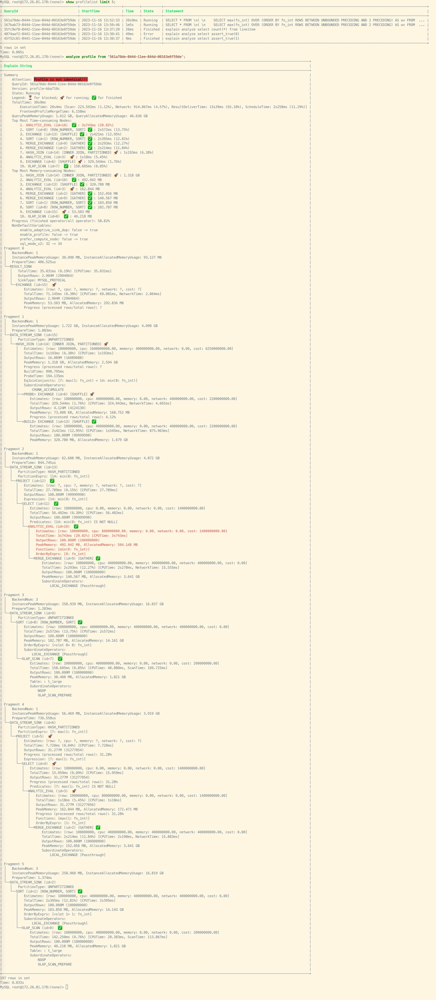
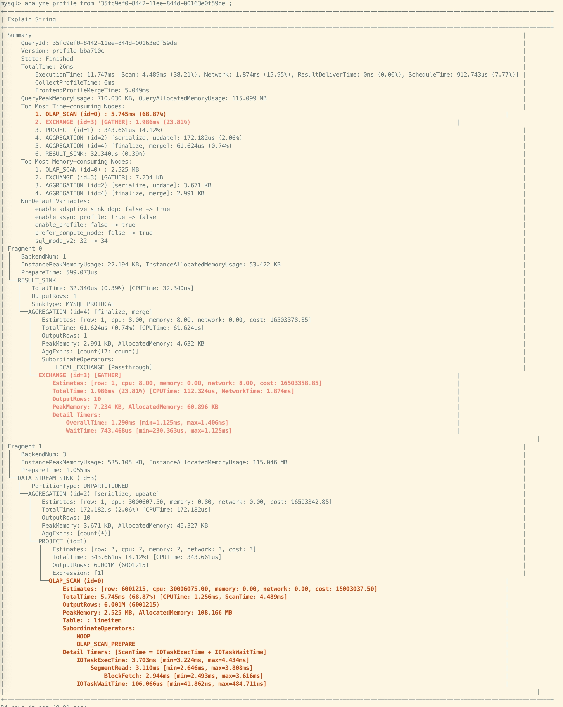

# 文本可视化 Query Profile

本文介绍了，如何使用 mysql 客户端对 Query Profile 进行分析

## 使用 ANALYZE PROFILE 语句进行分析

首先，我们需要通过 SHOW PROFILELIST 语句来获取查询的概要信息，该命令会列出所有正常结束、异常结束，以及仍在运行（运行10s以上仍未结束）的查询。通过这个语句，我们主要是为了获取到对应的 Query ID，方便进行后续的 Query Profile 分析。语法如下：

```
SHOW PROFILELIST [LIMIT <num>];
```

示例如下：

```SQL
SHOW PROFILELIST;
SHOW PROFILELIST LIMIT 5;
```

```
+--------------------------------------+---------------------+-------+----------+-----------------------------------------------------------------------------------------------------------------------------------+
| QueryId                              | StartTime           | Time  | State    | Statement                                                                                                                         |
+--------------------------------------+---------------------+-------+----------+-----------------------------------------------------------------------------------------------------------------------------------+
| a40456b2-8428-11ee-8d02-6a32f8c68848 | 2023-11-16 10:34:18 | 21ms  | Finished | SELECT ROUTINE_NAME FROM INFORMATION_SCHEMA.ROUTINES\n    WHERE ROUTINE_TYPE="FUNCTION" AND ROUTINE_SCHEMA = "None"               |
| a3fc4060-8428-11ee-8d02-6a32f8c68848 | 2023-11-16 10:34:17 | 39ms  | Finished | select TABLE_NAME, COLUMN_NAME from information_schema.columns\n                                    where table_schema = 'Non ... |
| a3f7d38d-8428-11ee-8d02-6a32f8c68848 | 2023-11-16 10:34:17 | 15ms  | Finished | select connection_id()                                                                                                            |
| a3efbd3b-8428-11ee-8d02-6a32f8c68848 | 2023-11-16 10:34:17 | 16ms  | Finished | select connection_id()                                                                                                            |
| a26ec286-8428-11ee-8d02-6a32f8c68848 | 2023-11-16 10:34:15 | 269ms | Error    | EXPLAIN ANALYZE  SELECT c_nation, s_nation, year(lo_orderdate) AS year , SUM(lo_revenue) AS revenue FROM lineorder_flat WHER ...  |
+--------------------------------------+---------------------+-------+----------+-----------------------------------------------------------------------------------------------------------------------------------+
```

在拿到 Query ID 后，我们可以通过 ANALYZE PROFILE 语句对 Query Profile 进行下一步的分析，其语法如下：

- Query ID：可以通过 SHOW PROFILELIST 语句获取
- Node ID：0 个或者多个 Node ID，默认情况下，输出结果仅包含概要信息。对于指定了 Node ID 的节点，会输出所有的指标信息

```SQL
ANALYZE PROFILE FROM '<Query ID>' [, <Node ID>]...
```

其输出内容包含如下几个部分：

- Summary：
    - 版本信息
    - 状态，可选值包括：Finished/Error/Running
    - 总时间
    - 内存使用情况
    - CPU 占比最高的10个节点
    - Memory 占比最高的10个节点
    - 与默认值不同的 SessionVariable
- Fragments：以 Fragment 为单位，依次展示每个 Fragment 中各个节点的指标
    - 每个节点会展示包括耗时、内存占用、Cost估算信息，输出行数等等内容
    - 当节点的耗时占比超过 30%，该节点会用红色加粗标出
    - 当节点的耗时占比超过 15% 且小于 30%，该节点会用粉红色加粗标出

示例1：不指定节点id


示例2：指定节点id。这里会把 Node ID 为 0 的节点的所有详细指标全部显示出来，并且高亮显示占比较高的指标，便于定位问题


此外，该命令也支持 Runtime Query Profile 的展示分析。对于开启了 Query Profile 功能，且运行超过 10s 仍未结束的查询，我们可以通过 ANALYZE PROFILE 来进行分析

步骤如下：

1. 通过 SHOW PROFILELIST，查找查询对应的 Query ID
2. 通过 ANALYZE PROFILE 以及指定的 Query ID 进行分析
  1. 算子状态展示：
    1. ⏳：未启动的算子。可能由于依赖关系，尚未开始执行的算子
    2. 🚀：运行中的算子
    3. ✅：已结束执行的算子
  2. 整体进度展示：根据 `运行中的算子数量/所有算子数量` 计算得到。由于没有考虑到行数信息，这个进度可能有点失真
  3. 算子进度展示：根据 `已经处理的行数/总行数` 计算得到，若无法计算总行数，则该进度显示为 `?`

示例：




## 使用 EXPLAIN ANALYZE 语句模拟分析查询

StarRocs 提供了 EXPLAIN ANALYZE 语句，方便您对查询直接进行模拟分析，语法如下：

```SQL
EXPLAIN ANALYZE <original sql>
```

通过上述语句执行Sql时，会默认打开当前会话的 Query Profile 功能。

目前，EXPLAIN ANALYZE 支持两种类型的 SQL 语句：查询（SELECT）语句和 INSERT INTO 语句。您只能在 StarRocks 内表上模拟 INSERT INTO 语句并分析其 Query Profile。请注意，当您模拟并分析 INSERT INTO 语句的 Query Profile 时，实际上不会导入任何数据。默认情况下，导入事务会被中止，以确保在分析过程中不会对数据进行意外更改。

示例1：SELECT 语句，查询返回结果会被丢弃


示例2：INSERT INTO 语句，直接结束后，导入事务会被中止。


## 限制

1. 为了获得更好的视觉效果，输出文本中包含了 ANSI 字符，以提供颜色、高亮等功能，客户端推荐使用 mycli。对于不兼容 ANSI 功能的客户端，比如 mysql 客户端，可能会出现右侧边界未对齐的现象，但并不影响使用，例如：
    - 
1. EXPLAIN ANALYZE INSERT INTO 语句，仅支持内表


