# 可视化 Query Profile

如果您是 StarRocks 企业版用户，则可以通过 StarRocks Manager 可视化您的 Query Profile。

**执行概览**页面**左侧边栏**分别列出了 CPU 占比前 10 的算子，Memory 占比前 10 的算子，点击条目即可跳转到相应的节点上

**执行概览**页面**右侧边栏**显示了一些 Summary 指标，包括：

- 总执行时间（墙上时间） Execution Wall Time
- CPU 耗时
- 执行调度耗时
- Scan 耗时
- 网络耗时
- 结果传输耗时
    - 对于 SELECT 语句，指的是结果从执行节点传回客户端的额外耗时
    - 对于 INSERT 等导入语句，指的是数据写入存储层的额外耗时

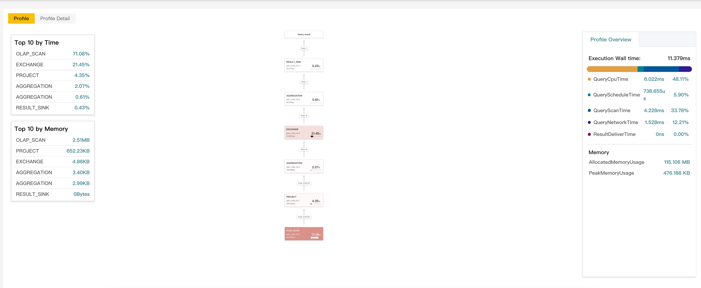

单击 Operator（节点）的卡片，可以在页面右侧的选项卡中查看其详细信息。共有三个选项卡：

- **Node**：该节点的核心指标，不同类型的节点包含不同的展示信息。您需要重点关注
- **Node Detail**: 该节点的所有原生、衍生算子，以及各个算子的所有详细指标。该选项卡包含众多实现细节，您无需过多关注。
- **Pipeline**: 该节点所关联的所有 Pipeline 指标。该选项卡中的指标仅与调度相关，您无需过多关注。

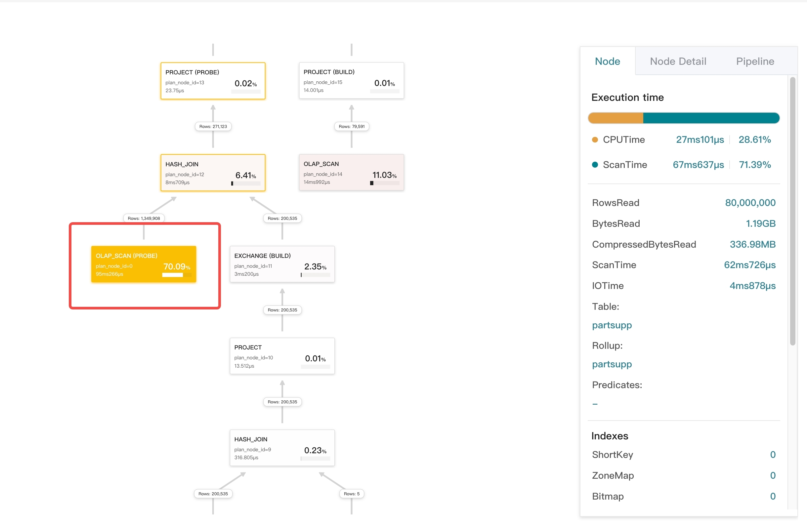

## 确认查询瓶颈

Operator 花费的时间比例越大，其对应卡片的颜色就越深。您可借此轻松确认查询的瓶颈。

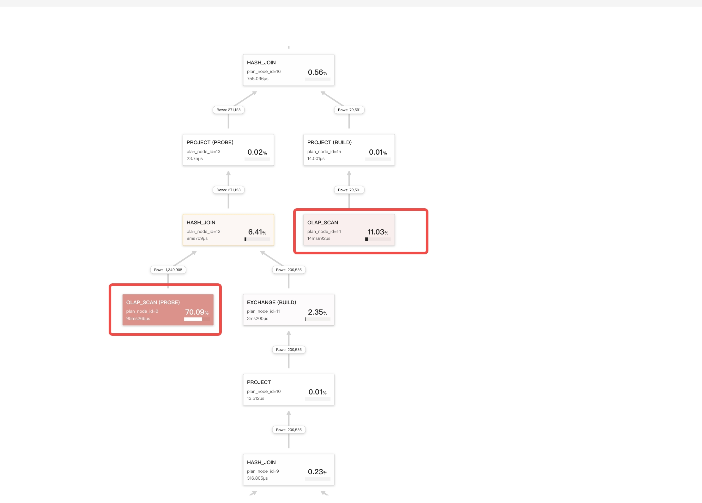

请点击颜色较深的 Operator，然后在节点（Node） 选项卡中滚动至页面底部。在这里，您将看到列出了所有导致节点处理时间延长的具体指标。您可以通过查看这些指标来详细了解节点处理耗时的具体原因。

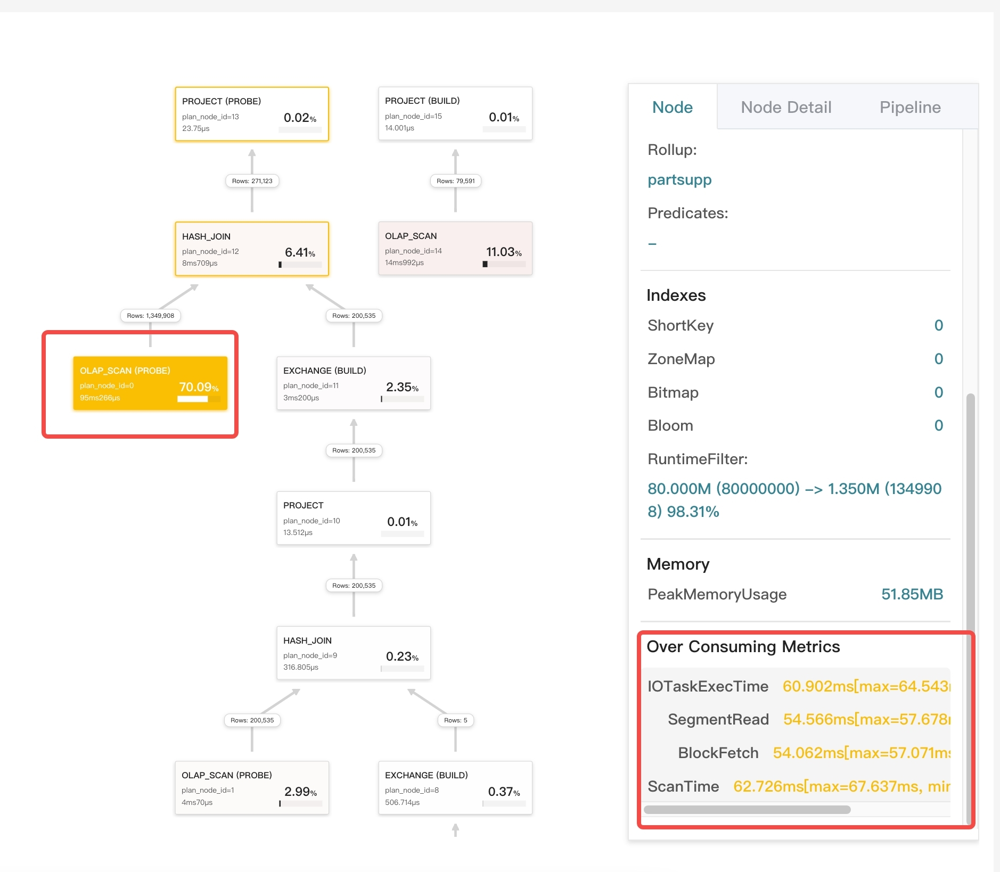

## 确认数据是否倾斜

单击**Node Detail**选项卡，并查看是否有任何异常指标。在以下示例中，聚合运算符的指标 `PushRowNum` 显示数据倾斜。

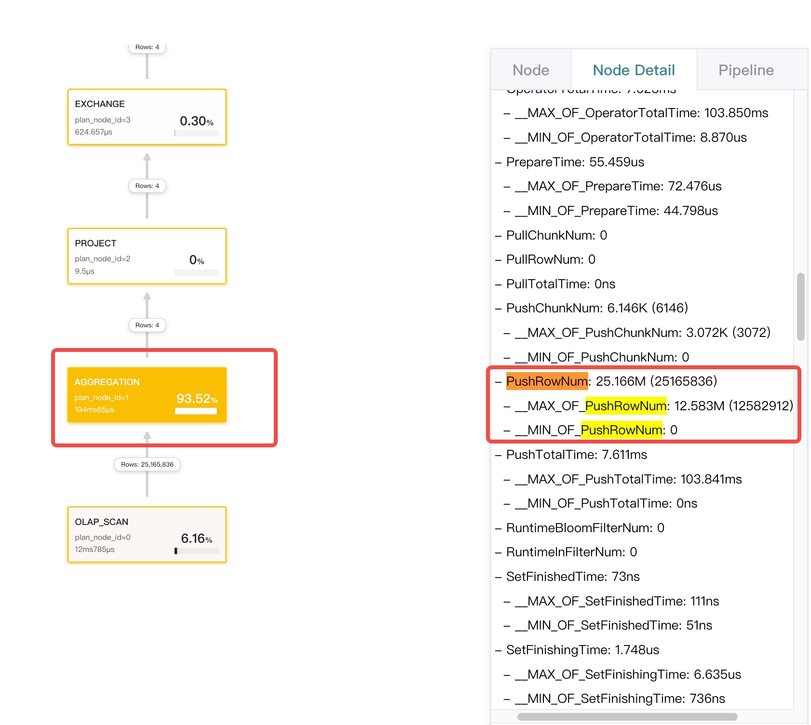

## 确认分桶或分区裁剪是否生效

您可以通过 `EXPLAIN <sql_statement>` 语句查看查询对应的 Query Plan 以查看分区或分桶裁剪是否生效。

## 确认物化视图选择是否正确

单击相应的 Scan Operator 的卡片并查看**Node Detail**选项卡上的 `Rollup` 字段。

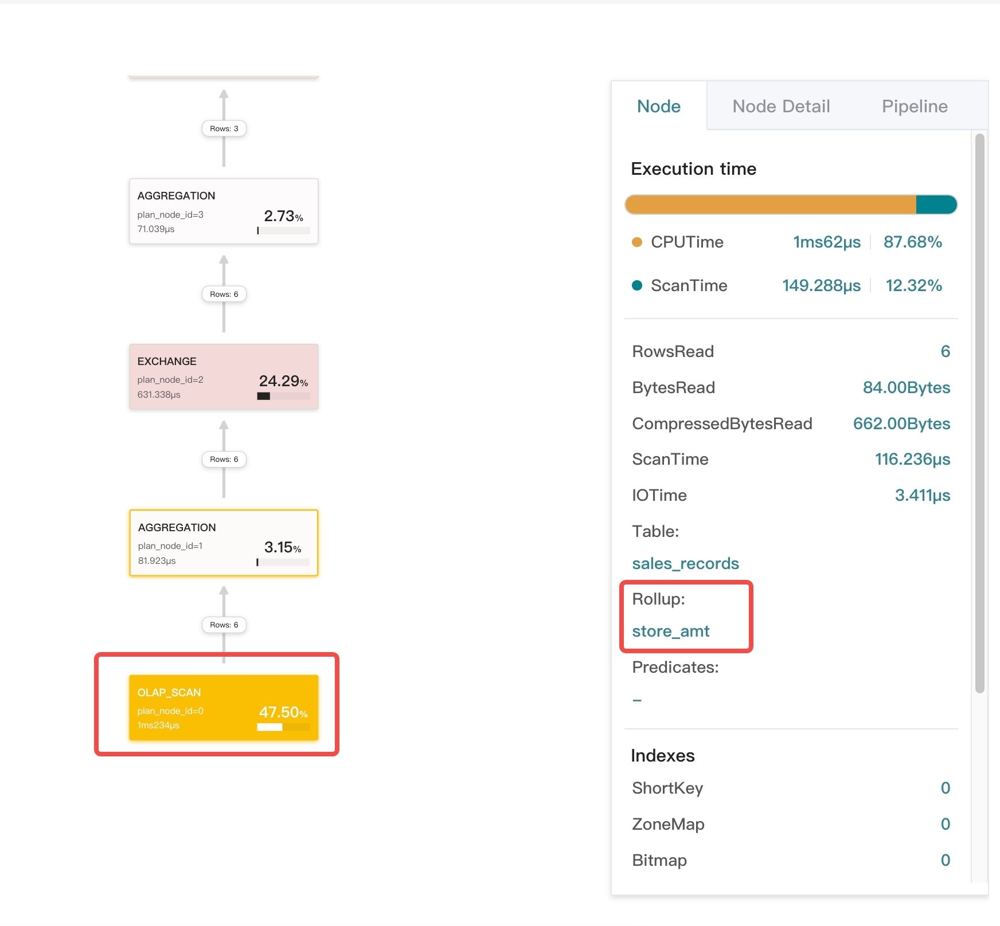

## 确认 Join 左右表 Plan 是否合理

通常，StarRocks 会选择较小的表作为 Join 的右表。如果 Query Profile 显示右表的数据量明显大于左表，则该 Join Plan 异常。

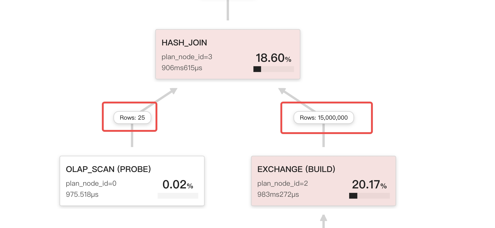

## 确认 Join 分布方式是否正确

按照数据分布类型，Exchange Operator 可分为三类：

- `UNPARTITIONED`：Broadcast。数据被拷贝多份，然后发送至多台 BE。
- `RANDOM`：Round robin。
- `HASH_PARTITIONED` 和 `BUCKET_SHUFFLE_HASH_PARTITIONED`：Shuffle。`HASH_PARTITIONED` 和 `BUCKET_SHUFFLE_HASH_PARTITIONED` 区别在于计算 Hash Code 所使用的 Hash 函数不同。

对于 Inner Join，右表可以是 `HASH_PARTITIONED` 和`BUCKET_SHUFFLE_HASH_PARTITIONED` 类型或者 `UNPARTITIONED` 类型。通常只有在右表行数小于 100K 时才采用 `UNPARTITIONED` 类型。

在以下示例中，Exchange Operator 的类型是 Broadcast，但是该 Operator 传输的数据量远远超过了阈值。

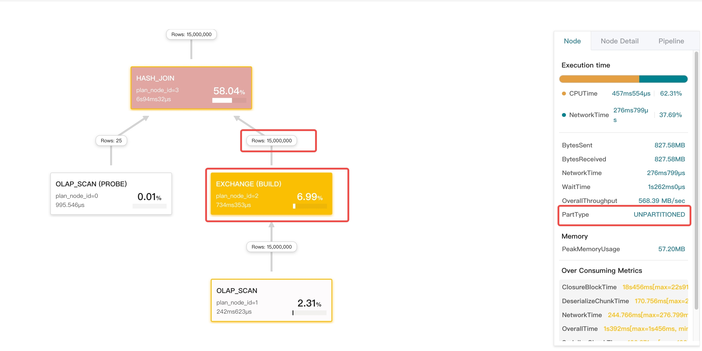

## 确认 JoinRuntimeFilter 是否生效

当 Join 的右孩子构建 Hash Table 时，会构建 Runtime Filter，该 Runtime Filter 会被投递到左子树，并尽可能地下推到 Scan Operator。您可以在 Scan Operator 的**节点**选项卡上查看与 RuntimeFilter 相关的指标。如果不存在这个指标，就说明没有生成 RuntimeFilter，或者 RuntimeFilter 没有下推到这个节点。

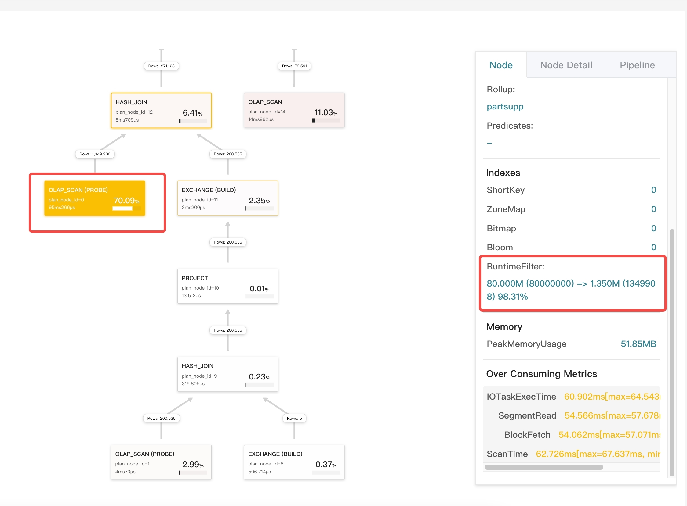

## 节点耗时的计算方式

- 对于 Scan 节点（可以是 OLAP_SCAN、HDFS_SCAN 等等），其耗时相当于 `OperatorTotalTime + ScanTime`。因为 Scan Operator 在异步 I/O 线程池中进行 I/O 操作，所以 ScanTime 为异步 I/O 时间。
- 对于 Exchange 节点，其耗时相当于 `OperatorTotalTime + NetworkTime`。因为 Exchange Operator 在 BRPC 线程池中收发数据包，NetworkTime 即为网络传输消耗的时间。
- 对于其他 Operator，其耗时为 `OperatorTotalTime`。

## Runtime Query Profile

[Query Profile 概述](query_profile_overview.md) 中介绍了 Runtime Query Profile 的使用方式，这里不再赘述。

对于开启了 Query Profile 功能，且运行超过 10s 仍未结束的查询，我们可以像正常 Query Profile 一样对其进行可视化分析，如下图所示：

* 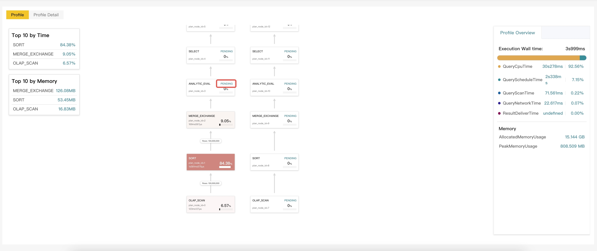
* 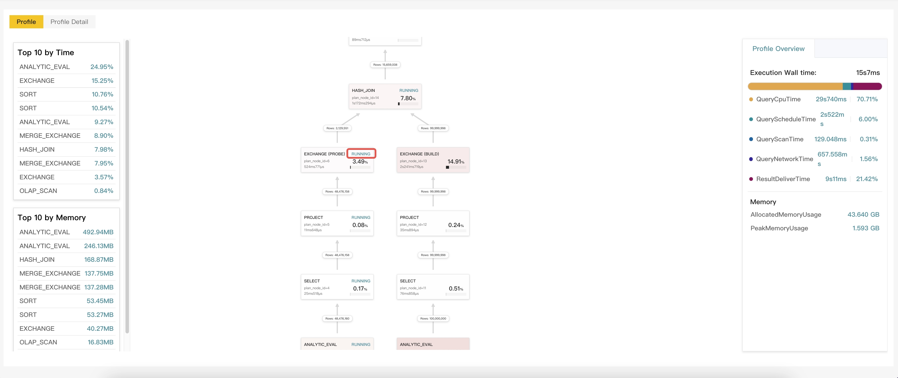

此外，Runtime Query Profile 除了包含普通 Query Profile 的所有功能外，还对节点状态进行额外的标记，便于您识别尚在运行中的节点：

* 无标记：已经执行完毕的节点
* Pending：由于依赖关系，尚未开始执行的节点
* Running：已经开始执行，且尚未结束执行的节点
