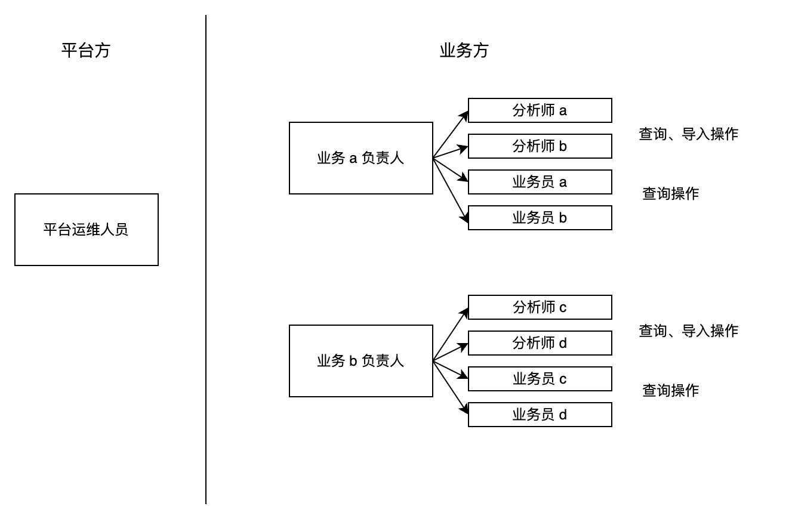
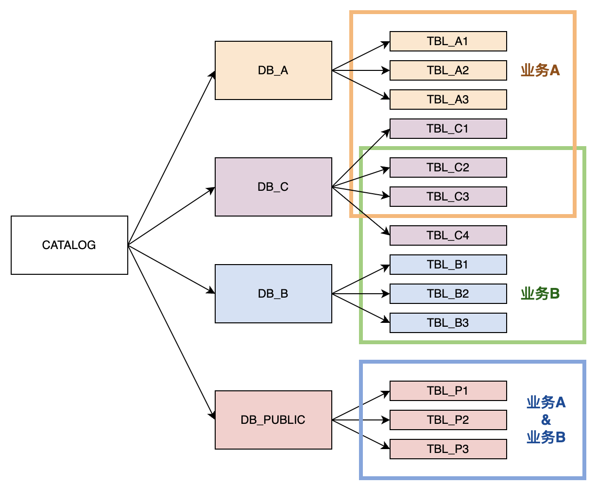
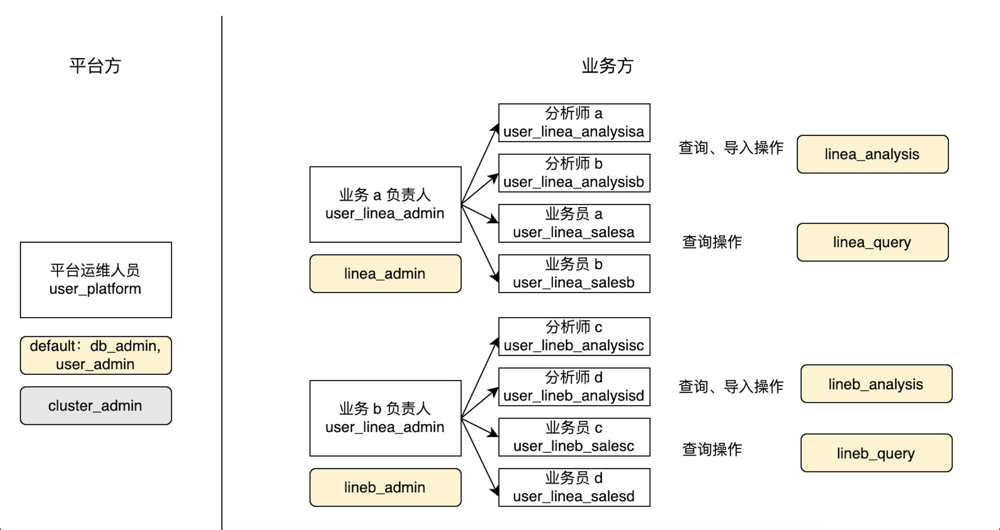

# 管理用户权限

import UserPrivilegeCase from '../../../_assets/commonMarkdown/userPrivilegeCase.md'
import GrantToGroup from '../../../_assets/commonMarkdown/grant_to_group.mdx'

本文介绍如何在 StarRocks 中管理用户、角色和权限。

StarRocks 使用基于角色的访问控制（RBAC）和基于身份的访问控制（IBAC）来管理 StarRocks 集群中的权限，使集群管理员能够轻松地在不同的粒度级别上限制集群内的权限。

在 StarRocks 集群中，可以将权限授予用户或角色。角色是可以根据需要分配给集群中的用户或其他角色的一组权限。用户可以被授予一个或多个角色，这些角色决定了他们对不同对象的权限。

## 查看权限和角色信息

具有系统定义角色 `user_admin` 的用户可以查看 StarRocks 集群中的所有用户和角色信息。

### 查看权限信息

您可以使用 [SHOW GRANTS](../../../sql-reference/sql-statements/account-management/SHOW_GRANTS.md) 查看授予用户或角色的权限。

- 查看当前用户的权限。

  ```SQL
  SHOW GRANTS;
  ```

  > **注意**
  >
  > 任何用户都可以查看自己的权限，而无需任何权限。

- 查看特定用户的权限。

  以下示例显示了用户 `jack` 的权限：

  ```SQL
  SHOW GRANTS FOR jack@'172.10.1.10';
  ```

- 查看特定角色的权限。

  以下示例显示了角色 `example_role` 的权限：

  ```SQL
  SHOW GRANTS FOR ROLE example_role;
  ```

### 查看角色

您可以使用 [SHOW ROLES](../../../sql-reference/sql-statements/account-management/SHOW_ROLES.md) 查看 StarRocks 集群中的所有角色。

```SQL
SHOW ROLES;
```

## 管理角色

具有系统定义角色 `user_admin` 的用户可以在 StarRocks 中创建、授予、撤销或删除角色。

### 创建角色

您可以使用 [CREATE ROLE](../../../sql-reference/sql-statements/account-management/CREATE_ROLE.md) 创建角色。默认情况下，用户最多可以拥有 64 个角色。您可以使用 FE 动态参数 `privilege_max_total_roles_per_user` 调整此设置。角色最多可以有 16 个继承级别。您可以使用 FE 动态参数 `privilege_max_role_depth` 调整此设置。

以下示例创建了角色 `example_role`：

```SQL
CREATE ROLE example_role;
```

### 授予角色

您可以使用 [GRANT](../../../sql-reference/sql-statements/account-management/GRANT.md) 将角色授予用户或其他角色。

- 将角色授予用户。

  以下示例将角色 `example_role` 授予用户 `jack`：

  ```SQL
  GRANT example_role TO USER jack@'172.10.1.10';
  ```

- 将角色授予另一个角色。

  以下示例将角色 `example_role` 授予角色 `test_role`：

  ```SQL
  GRANT example_role TO ROLE test_role;
  ```

<GrantToGroup />

### 更改用户的默认角色

用户的默认角色在连接到 StarRocks 时会自动激活。有关如何在连接后为用户启用所有（默认和授予的）角色的说明，请参见 [启用所有角色](#enable-all-roles)。

您可以使用 [SET DEFAULT ROLE](../../../sql-reference/sql-statements/account-management/SET_DEFAULT_ROLE.md) 或 [ALTER USER](../../../sql-reference/sql-statements/account-management/ALTER_USER.md) 设置用户的默认角色。

以下两个示例将 `jack` 的默认角色设置为 `db1_admin`。请注意，`db1_admin` 必须已分配给 `jack`。

- 使用 SET DEFAULT ROLE 设置默认角色：

  ```SQL
  SET DEFAULT ROLE 'db1_admin' TO jack@'172.10.1.10';
  ```

- 使用 ALTER USER 设置默认角色：

  ```SQL
  ALTER USER jack@'172.10.1.10' DEFAULT ROLE 'db1_admin';
  ```

### 撤销角色

您可以使用 [REVOKE](../../../sql-reference/sql-statements/account-management/REVOKE.md) 从用户或其他角色撤销角色。

> **注意**
>
> 您不能从用户中撤销系统定义的默认角色 `PUBLIC`。

- 从用户中撤销角色。

  以下示例从用户 `jack` 中撤销角色 `example_role`：

  ```SQL
  REVOKE example_role FROM USER jack@'172.10.1.10';
  ```

- 从另一个角色中撤销角色。

  以下示例从角色 `test_role` 中撤销角色 `example_role`：

  ```SQL
  REVOKE example_role FROM ROLE test_role;
  ```

### 删除角色

您可以使用 [DROP ROLE](../../../sql-reference/sql-statements/account-management/DROP_ROLE.md) 删除角色。

以下示例删除了角色 `example_role`：

```SQL
DROP ROLE example_role;
```

> **注意**
>
> 系统定义的角色不能被删除。

### 启用所有角色

用户的默认角色是在用户连接到 StarRocks 集群时自动激活的角色。

如果您希望在 StarRocks 用户连接到 StarRocks 集群时启用所有角色（默认和授予的角色），可以执行以下操作。

此操作需要系统权限 OPERATE。

```SQL
SET GLOBAL activate_all_roles_on_login = TRUE;
```

您还可以使用 SET ROLE 激活分配给您的角色。例如，用户 `jack@'172.10.1.10'` 拥有角色 `db_admin` 和 `user_admin`，但它们不是用户的默认角色，并且在用户连接到 StarRocks 时不会自动激活。如果 `jack@'172.10.1.10'` 需要激活 `db_admin` 和 `user_admin`，他可以运行 `SET ROLE db_admin, user_admin;`。请注意，SET ROLE 会覆盖原始角色。如果您想启用所有角色，请运行 SET ROLE ALL。

## 管理权限

具有系统定义角色 `user_admin` 的用户可以在 StarRocks 中授予或撤销权限。

### 授予权限

您可以使用 [GRANT](../../../sql-reference/sql-statements/account-management/GRANT.md) 将权限授予用户或角色。

- 将权限授予用户。

  以下示例将表 `sr_member` 上的 SELECT 权限授予用户 `jack`，并允许 `jack` 将此权限授予其他用户或角色（通过在 SQL 中指定 WITH GRANT OPTION）：

  ```SQL
  GRANT SELECT ON TABLE sr_member TO USER jack@'172.10.1.10' WITH GRANT OPTION;
  ```

- 将权限授予角色。

  以下示例将表 `sr_member` 上的 SELECT 权限授予角色 `example_role`：

  ```SQL
  GRANT SELECT ON TABLE sr_member TO ROLE example_role;
  ```

### 撤销权限

您可以使用 [REVOKE](../../../sql-reference/sql-statements/account-management/REVOKE.md) 从用户或角色中撤销权限。

- 从用户中撤销权限。

  以下示例从用户 `jack` 中撤销表 `sr_member` 上的 SELECT 权限，并禁止 `jack` 将此权限授予其他用户或角色：

  ```SQL
  REVOKE SELECT ON TABLE sr_member FROM USER jack@'172.10.1.10';
  ```

- 从角色中撤销权限。

  以下示例从角色 `example_role` 中撤销表 `sr_member` 上的 SELECT 权限：

  ```SQL
  REVOKE SELECT ON TABLE sr_member FROM ROLE example_role;
  ```

## 最佳实践

### 多服务访问控制

通常，公司拥有的 StarRocks 集群由一个服务提供商管理，并维护多条业务线（LOB），每条业务线使用一个或多个数据库。

如下所示，StarRocks 集群的用户包括服务提供商和两个 LOB（A 和 B）的成员。每个 LOB 由两个角色操作 - 分析师和高管。分析师生成和分析业务报表，高管查询报表。



LOB A 独立管理数据库 `DB_A`，LOB B 管理数据库 `DB_B`。LOB A 和 LOB B 在 `DB_C` 中使用不同的表。`DB_PUBLIC` 可以被两个 LOB 的所有成员访问。



由于不同的成员在不同的数据库和表上执行不同的操作，我们建议您根据其服务和职位创建角色，仅为每个角色应用必要的权限，并将这些角色分配给相应的成员。如下所示：



1. 将系统定义的角色 `db_admin`、`user_admin` 和 `cluster_admin` 分配给集群维护人员，将 `db_admin` 和 `user_admin` 设置为他们日常维护的默认角色，并在需要操作集群节点时手动激活角色 `cluster_admin`。

   示例：

   ```SQL
   GRANT db_admin, user_admin, cluster_admin TO USER user_platform;
   ALTER USER user_platform DEFAULT ROLE db_admin, user_admin;
   ```

2. 为每个 LOB 的成员创建用户，并为每个用户设置复杂的密码。
3. 为每个 LOB 的职位创建角色，并为每个角色应用相应的权限。

   对于每个 LOB 的主管，授予其角色 LOB 所需权限的最大集合，以及相应的 GRANT 权限（通过在语句中指定 WITH GRANT OPTION）。因此，他们可以将这些权限分配给其 LOB 的成员。如果他们的日常工作需要，将角色设置为其默认角色。

   示例：

   ```SQL
   GRANT SELECT, ALTER, INSERT, UPDATE, DELETE ON ALL TABLES IN DATABASE DB_A TO ROLE linea_admin WITH GRANT OPTION;
   GRANT SELECT, ALTER, INSERT, UPDATE, DELETE ON TABLE TABLE_C1, TABLE_C2, TABLE_C3 TO ROLE linea_admin WITH GRANT OPTION;
   GRANT linea_admin TO USER user_linea_admin;
   ALTER USER user_linea_admin DEFAULT ROLE linea_admin;
   ```

   对于分析师和高管，分配给他们具有相应权限的角色。

   示例：

   ```SQL
   GRANT SELECT ON ALL TABLES IN DATABASE DB_A TO ROLE linea_query;
   GRANT SELECT ON TABLE TABLE_C1, TABLE_C2, TABLE_C3 TO ROLE linea_query;
   GRANT linea_query TO USER user_linea_salesa;
   GRANT linea_query TO USER user_linea_salesb;
   ALTER USER user_linea_salesa DEFAULT ROLE linea_query;
   ALTER USER user_linea_salesb DEFAULT ROLE linea_query;
   ```

4. 对于可以被所有集群用户访问的数据库 `DB_PUBLIC`，将 `DB_PUBLIC` 上的 SELECT 权限授予系统定义的角色 `public`。

   示例：

   ```SQL
   GRANT SELECT ON ALL TABLES IN DATABASE DB_PUBLIC TO ROLE public;
   ```

您可以将角色分配给其他角色以在复杂场景中实现角色继承。

例如，如果分析师需要在 `DB_PUBLIC` 中写入和查询表的权限，而高管只能查询这些表，您可以创建角色 `public_analysis` 和 `public_sales`，为角色应用相关权限，并将它们分配给分析师和高管的原始角色。

示例：

```SQL
CREATE ROLE public_analysis;
CREATE ROLE public_sales;
GRANT SELECT, ALTER, INSERT, UPDATE, DELETE ON ALL TABLES IN DATABASE DB_PUBLIC TO ROLE public_analysis;
GRANT SELECT ON ALL TABLES IN DATABASE DB_PUBLIC TO ROLE public_sales;
GRANT public_analysis TO ROLE linea_analysis;
GRANT public_analysis TO ROLE lineb_analysis;
GRANT public_sales TO ROLE linea_query;
GRANT public_sales TO ROLE lineb_query;
```

### 根据场景自定义角色

<UserPrivilegeCase />