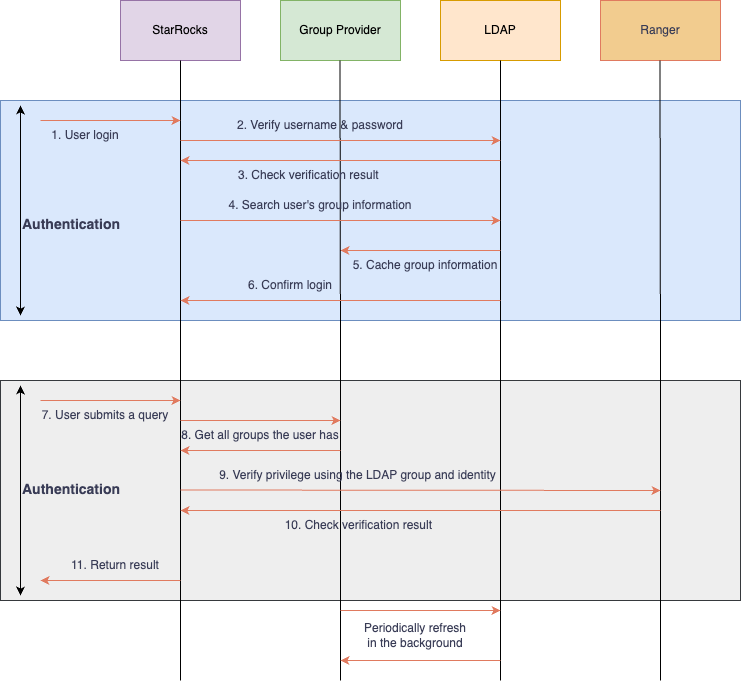

# 认证用户组

在 StarRocks 中启用 Group Provider 以认证和授权来自外部认证系统的用户组。

从 v3.5.0 开始，StarRocks 支持 Group Provider 从外部认证系统收集组信息以进行用户组管理。

## 概述

为了加深与外部用户认证和授权系统（如 LDAP、OpenID Connect、OAuth 2.0 和 Apache Ranger）的集成，StarRocks 支持收集用户组信息，以便在集体用户管理上提供更好的体验。

通过 Group Provider，您可以从外部用户系统中获取组信息以用于不同目的。组信息是独立的，可以灵活地集成到认证、授权或其他流程中，而无需与任何特定工作流紧密耦合。

Group Provider 本质上是用户和组之间的映射。任何需要组信息的过程都可以根据需要查询此映射。

### 工作流程

下图使用 LDAP 和 Apache Ranger 作为示例来解释 Group Provider 的工作流程。



## 创建 Group Provider

StarRocks 支持三种类型的 Group Provider：
- **LDAP  Group Provider**：在您的 LDAP 服务中搜索和匹配用户与组
- **Unix  Group Provider**：在您的操作系统中搜索和匹配用户与组
- **File Group Provider**：通过文件定义的用户与组进行搜索和匹配

### 语法

```SQL
-- LDAP  Group Provider
CREATE GROUP PROVIDER <group_provider_name> 
PROPERTIES (
    "type" = "ldap",
    ldap_info,
    ldap_search_group_arg,
    ldap_search_attr,
    [ldap_cache_attr]
)

ldap_info ::=
    "ldap_conn_url" = "",
    "ldap_bind_root_dn" = "",
    "ldap_bind_root_pwd" = "",
    "ldap_bind_base_dn" = "",
    ["ldap_conn_timeout" = "",]
    ["ldap_conn_read_timeout" = ""]
    ["ldap_ssl_conn_allow_insecure" = ""]
    ["ldap_ssl_conn_trust_store_path" = ""]
    ["ldap_ssl_conn_trust_store_pwd" = ""]

ldap_search_group_arg ::= 
    { "ldap_group_dn" = "" 
    | "ldap_group_filter" = "" }, 
    "ldap_group_identifier_attr" = ""

ldap_search_user_arg ::=
    "ldap_group_member_attr" = "",
    "ldap_user_search_attr" = ""

ldap_cache_arg ::= 
    "ldap_cache_refresh_interval" = ""

-- Unix  Group Provider
CREATE GROUP PROVIDER <group_provider_name> 
PROPERTIES (
    "type" = "unix"
)

-- File Group Provider
CREATE GROUP PROVIDER <group_provider_name> 
PROPERTIES (
    "type" = "file",
    "group_file_url" = ""
)
```

### 参数

#### `type`

要创建的 Group Provider 的类型。有效值：
- `ldap`：创建一个 LDAP Group Provider。当设置此值时，您需要指定 `ldap_info`、`ldap_search_group_arg`、`ldap_search_user_arg`，并可选指定 `ldap_cache_arg`。
- `unix`：创建一个 Unix Group Provider。
- `file`：创建一个 File Group Provider。当设置此值时，您需要指定 `group_file_url`。

#### `ldap_info` 参数组

用于连接到您的 LDAP 服务的信息。

##### `ldap_conn_url`

您的 LDAP 服务器的 URL。格式：`ldap://<ldap_server_host>:<ldap_server_port>)`。

##### `ldap_bind_root_dn`

您的 LDAP 服务的管理员 DN。

##### `ldap_bind_root_pwd`

您的 LDAP 服务的管理员密码。

##### `ldap_bind_base_dn`

集群搜索的 LDAP 用户的基本 DN。

##### `ldap_conn_timeout`

可选。连接到您的 LDAP 服务的超时时间。

##### `ldap_conn_read_timeout`

可选。连接到您的 LDAP 服务的读取操作的超时时间。

##### `ldap_ssl_conn_allow_insecure`

可选。是否允许使用非加密方式连接到 LDAP 服务器。默认值：`true`。将此值设置为 `false` 表示访问 LDAP 需要使用 SSL 加密。

##### `ldap_ssl_conn_trust_store_path`

可选。存储 LDAP 服务器的 SSL CA 证书的本地路径。支持 pem 和 jks 格式。如果证书是由受信机构颁发的，则无需配置。

##### `ldap_ssl_conn_trust_store_pwd`

可选。访问本地存储的 LDAP 服务器的 SSL CA 证书所用的密码。pem 格式证书不需要密码，只有 jsk 格式证书需要。

#### `ldap_search_group_arg` 参数组

用于控制 StarRocks 如何搜索组的参数。

:::note
您只能指定 `ldap_group_dn` 或 `ldap_group_filter` 之一。不支持同时指定两者。
:::

##### `ldap_group_dn`

要搜索的组的 DN。将使用此 DN 直接查询该组。示例：`"cn=ldapgroup1,ou=Group,dc=starrocks,dc=com;cn=ldapgroup2,ou=Group,dc=starrocks,dc=com"`。

##### `ldap_group_filter`

LDAP 服务器可以识别的自定义组过滤器。它将被直接发送到您的 LDAP 服务器以搜索该组。示例：`(&(objectClass=groupOfNames)(cn=testgroup))`。

##### `ldap_group_identifier_attr`

用作组名称标识符的属性。

#### `ldap_search_user_arg` 参数组

用于控制 StarRocks 如何识别组中用户的参数。

##### `ldap_group_member_attr`

表示组成员的属性。有效值：`member` 和 `memberUid`。

##### `ldap_user_search_attr`

指定如何从成员属性值中提取用户标识符。您可以显式定义一个属性（例如，`cn` 或 `uid`）或使用正则表达式。

:::note

**DN 匹配机制**

- **如配置了 `ldap_user_search_attr`**，则从组成员 DN 中提取指定属性的值作为用户名，组查找时使用登录用户名作为 Key。
- **如未配置 `ldap_user_search_attr`**，则直接使用完整的 DN 作为用户标识，组查找时使用认证时记录的 DN 作为 Key。

这种设计使得 LDAP Group Provider 能够适应不同的 LDAP 环境，特别是 Microsoft AD 等复杂环境。

:::

#### `ldap_cache_arg` 参数组

用于定义 LDAP 组信息缓存行为的参数。

##### `ldap_cache_refresh_interval`

可选。StarRocks 自动刷新缓存的 LDAP 组信息的间隔。单位：秒。默认值：`900`。

#### `group_file_url`

定义用户组的文件的 URL 或相对路径（在 `fe/conf` 下）。

:::note

组文件包含组及其成员的列表。您可以在每行中定义一个组，其中组名称和成员用冒号分隔。多个用户用逗号分隔。示例：`group_name:user_1,user_2,user_3`。

:::

### 示例

假设一个 LDAP 服务器包含以下组和成员信息。

```Plain
-- 组信息
# testgroup, Group, starrocks.com
dn: cn=testgroup,ou=Group,dc=starrocks,dc=com
objectClass: groupOfNames
cn: testgroup
member: uid=test,ou=people,dc=starrocks,dc=com
member: uid=tom,ou=people,dc=starrocks,dc=com

-- 用户信息
# test, People, starrocks.com
dn: cn=test,ou=People,dc=starrocks,dc=com
objectClass: inetOrgPerson
cn: test
uid: test
sn: FTE
userPassword:: 
```

为 `testgroup` 中的成员创建一个 Group Provider `ldap_group_provider`：

```SQL
CREATE GROUP PROVIDER ldap_group_provider 
PROPERTIES(
    "type"="ldap", 
    "ldap_conn_url"="ldap://xxxx:xxx",
    "ldap_bind_root_dn"="cn=admin,dc=starrocks,dc=com",
    "ldap_bind_root_pwd"="123456",
    "ldap_bind_base_dn"="dc=starrocks,dc=com",
    "ldap_group_filter"="(&(objectClass=groupOfNames)(cn=testgroup))",
    "ldap_group_identifier_attr"="cn",
    "ldap_group_member_attr"="member",
    "ldap_user_search_attr"="uid=([^,]+)"
)
```

上述示例使用 `ldap_group_filter` 搜索具有 `groupOfNames` objectClass 和 `cn` 为 `testgroup` 的组。因此，在 `ldap_group_identifier_attr` 中指定 `cn` 以识别该组。`ldap_group_member_attr` 设置为 `member`，以便在 `groupOfNames` objectClass 中使用 `member` 属性识别成员。`ldap_user_search_attr` 设置为表达式 `uid=([^,]+)`，用于识别 `member` 属性中的用户。

### Microsoft AD 环境示例

假设一个 Microsoft AD 服务器包含以下组和成员信息：

```Plain
-- 组信息
# ADGroup, Groups, company.com
dn: CN=ADGroup,OU=Groups,DC=company,DC=com
objectClass: group
cn: ADGroup
member: CN=John Doe,OU=Users,DC=company,DC=com
member: CN=Jane Smith,OU=Users,DC=company,DC=com

-- 用户信息
# John Doe, Users, company.com
dn: CN=John Doe,OU=Users,DC=company,DC=com
objectClass: user
cn: John Doe
sAMAccountName: johndoe
```

为 Microsoft AD 环境创建一个 Group Provider：

```SQL
CREATE GROUP PROVIDER ad_group_provider 
PROPERTIES(
    "type"="ldap", 
    "ldap_conn_url"="ldap://ad.company.com:389",
    "ldap_bind_root_dn"="CN=admin,OU=Users,DC=company,DC=com",
    "ldap_bind_root_pwd"="password",
    "ldap_bind_base_dn"="DC=company,DC=com",
    "ldap_group_filter"="(&(objectClass=group)(cn=ADGroup))",
    "ldap_group_identifier_attr"="cn",
    "ldap_group_member_attr"="member"
    -- 注意：不配置 ldap_user_search_attr，系统将使用完整 DN 进行匹配
)
```

在这个示例中，由于没有配置 `ldap_user_search_attr`，系统将：
1. 在组缓存构建时，直接使用完整的 DN（如 `CN=John Doe,OU=Users,DC=company,DC=com`）作为用户标识。
2. 在组查找时，使用认证时记录的 DN 作为 key 来查找用户所属的组。

这种方式特别适合 Microsoft AD 环境，因为 AD 中的组成员可能缺少简单的用户名属性。

## 将 Group Provider 与安全集成结合

创建 Group Provider 后，您可以将其与安全集成结合，以允许 Group Provider 指定的用户登录到 StarRocks。有关创建安全集成的更多信息，请参见[通过安全集成进行认证](./authentication/security_integration.md)。

### 语法

```SQL
ALTER SECURITY INTEGRATION <security_integration_name> SET
(
    "group_provider" = "",
    "permitted_groups" = ""
)
```

### 参数

#### `group_provider`

要与安全集成结合的 Group Provider 名称。多个 Group Provider 用逗号分隔。一旦设置，StarRocks 将在用户登录时记录每个指定提供者下的用户组信息。

#### `permitted_groups`

可选。允许其成员登录到 StarRocks 的组名称。多个组用逗号分隔。确保指定的组可以通过组合的 Group Provider 检索到。

### 示例

```SQL
ALTER SECURITY INTEGRATION LDAP SET
(
        "group_provider"="ldap_group_provider",
        "permitted_groups"="testgroup"
);
```

## 将 Group Provider 与外部授权系统（Apache Ranger）结合

一旦您在安全集成中配置了关联的 Group Provider，StarRocks 将在用户登录时记录用户的组信息。然后，这些组信息将自动包含在与 Ranger 的授权过程中，无需额外配置。

有关将 StarRocks 与 Ranger 集成的更多说明，请参见[使用 Apache Ranger 管理权限](./authorization/ranger_plugin.md)。
