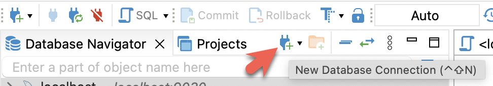
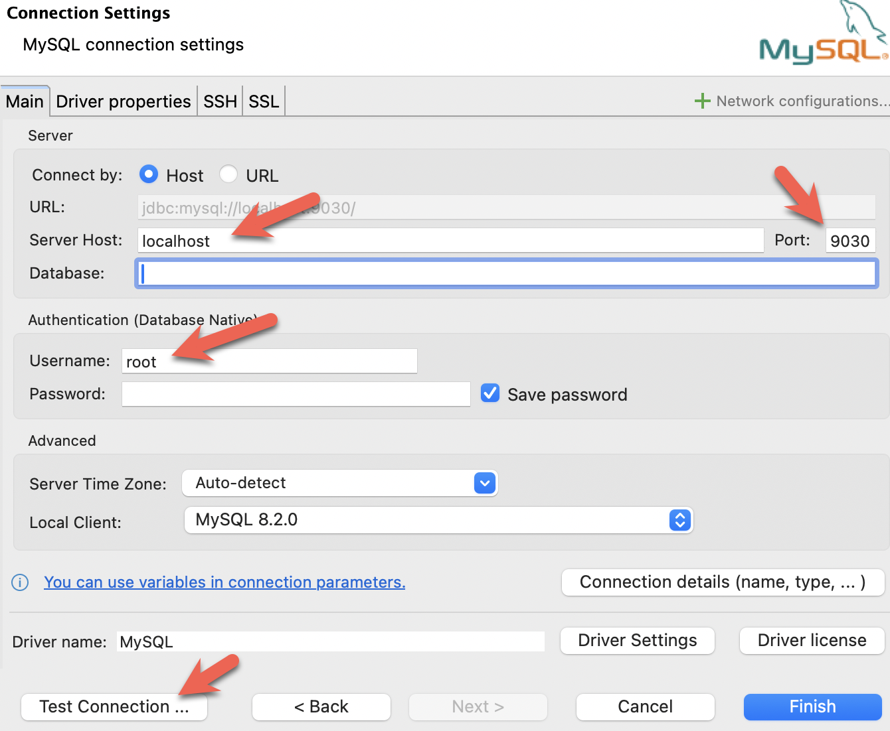

import Tabs from '@theme/Tabs';
import TabItem from '@theme/TabItem';

当前教程可以使用以下三个客户端进行测试，您只需选择其中一个：

- MySQL CLI：您可以从 Docker 环境或您的本机运行此客户端。
- [DBeaver](https://dbeaver.io/download/)（社区版或专业版）
- [MySQL Workbench](https://dev.mysql.com/downloads/workbench/)

#### 配置客户端

<Tabs groupId="client">
<TabItem value="mysqlCLI" label="mysql CLI" default>

您可以从 StarRocks FE 节点容器 `starrocks-fe` 中直接运行 MySQL Client：

```bash
docker compose exec starrocks-fe \
mysql -P 9030 -h 127.0.0.1 -u root --prompt="StarRocks > "
```

:::tip
所有 `docker compose` 命令必须从包含 `docker-compose.yml` 文件的目录中运行。
:::

如果您需要安装 MySQL Client，请点击展开以下 **安装 MySQL 客户端** 部分：

<details>

<summary>安装 MySQL 客户端</summary>

- macOS：如果您使用 Homebrew 并且不需要安装 MySQL 服务器，请运行 `brew install mysql` 安装 MySQL Client。
- Linux：请检查您的 `mysql` 客户端的 Repository。例如，运行 `yum install mariadb`。
- Microsoft Windows：安装 [MySQL Community Server](https://dev.mysql.com/downloads/mysql/) 后，运行提供的客户端，或在 WSL 中运行 `mysql`。

</details>

</TabItem>

<TabItem value="DBeaver" label="DBeaver" >

1. 安装 [DBeaver](https://dbeaver.io/download/) 并连接 StarRocks。
   
2. 配置端口、IP 地址和用户名，并点击 **Test Connection** 测试连接。如果测试成功，请点击 **Finish** 完成配置。
   

</TabItem>
<TabItem value="MySQLWorkbench" label="MySQL Workbench">

1. 安装 [MySQL Workbench](https://dev.mysql.com/downloads/workbench/) 并连接 StarRocks。
2. 配置端口、IP 地址和用户名，并点击 **Test Connection** 测试连接。
   
3. 在 Workbench 检查 MySQL 版本时，会弹出以下警告。您可以忽略这些警告，并选择不再提示：
   
</TabItem>

</Tabs>
