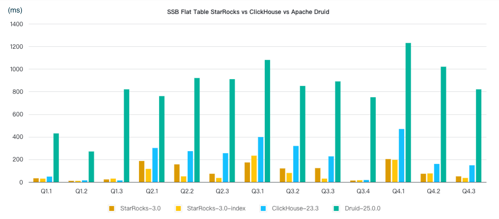

# SSB Flat Table 性能测试

## 测试结论

Star Schema Benchmark（以下简称 SSB）是学术界和工业界广泛使用的一个星型模型测试集（来源[论文](https://www.cs.umb.edu/~poneil/StarSchemaB.PDF)），通过这个测试集合可以方便的对比各种 OLAP 产品的基础性能指标。ClickHouse 通过改写 SSB，将星型模型打平转化成宽表 (flat table)，改造成了一个单表测试 benchmark（参考[链接](https://clickhouse.tech/docs/en/getting-started/example-datasets/star-schema/)）。本报告记录了 StarRocks、ClickHouse 和 Apache Druid 在 SSB 单表数据集上的性能对比结果，测试结论如下：

- 在标准测试数据集的 13 个查询上，StarRocks 整体查询性能是 ClickHouse 的 2.1 倍，Apache Druid 的 8.7 倍。
- StarRocks 启用 Bitmap Index 后整体查询性能是未启用的 1.3 倍，此时整体查询性能是 ClickHouse 的 2.8 倍，Apache Druid 的 11.4 倍。



本文在 SSB 单表场景下对比了 StarRocks、ClickHouse 和 Apache Druid 的查询性能。采用 3x16core 64GB 内存的云主机，在 6 亿行的数据规模进行测试。

## 测试准备

### 硬件环境

| 机器     | 3台 阿里云主机                                               |
| -------- | ------------------------------------------------------------ |
| CPU      | 16core Intel(R) Xeon(R) Platinum 8269CY CPU @ 2.50GHz <br />Cache size: 36608 KB |
| 内存     | 64GB                                                         |
| 网络带宽 | 5 Gbits/s                                                    |
| 磁盘     | ESSD 云盘                                                    |

### 软件环境

StarRocks，ClickHouse 和 Apache Druid 部署在相同配置的机器上分别进行测试。

- StarRocks 部署 1 个 FE 和 3 个 BE。FE 可以单独部署也可以和 BE 混合部署。
- ClickHouse 部署三个节点后建立分布式表。
- Apache Druid 三个节点都部署 Data Servers，同时选择一个节点混合部署 Master Servers，另一个节点混合部署 Query Servers。

内核版本：Linux 3.10.0-1160.59.1.el7.x86_64

操作系统版本：CentOS Linux release 7.9.2009

软件版本：StarRocks 社区版 3.0，ClickHouse 23.3，Apache Druid 25.0.0

## 测试数据与结果

### 测试数据

| 表名           | 行数   | 说明             |
| -------------- | ------ | ---------------- |
| lineorder      | 6 亿   | SSB 商品订单表   |
| customer       | 300 万 | SSB 客户表       |
| part           | 140 万 | SSB 零部件表     |
| supplier       | 20 万  | SSB 供应商表     |
| dates          | 2556   | 日期表           |
| lineorder_flat | 6 亿   | SSB 打平后的宽表 |

### 测试结果

> 查询时间的单位是 ms。StarRocks 与 ClickHouse、Druid 的查询性能对比，分别使用 ClickHouse、Druid 的查询时间除以 StarRocks 的查询时间，结果数字越大代表 StarRocks 性能越好。

|      | StarRocks-3.0 | StarRocks-3.0-index | ClickHouse-23.3 | ClickHouse vs StarRocks | Druid-25.0.0 | Druid vs StarRocks |
| ---- | ------------- | ------------------- | --------------- | ----------------------- | -------------| ------------------ |
| Q1.1 | 33            | 30                  | 48              | 1.45                    | 430          | 13.03              |
| Q1.2 | 10            | 10                  | 15              | 1.50                    | 270          | 27.00              |
| Q1.3 | 23            | 30                  | 14              | 0.61                    | 820          | 35.65              |
| Q2.1 | 186           | 116                 | 301             | 1.62                    | 760          | 4.09               |
| Q2.2 | 156           | 50                  | 273             | 1.75                    | 920          | 5.90               |
| Q2.3 | 73            | 36                  | 255             | 3.49                    | 910          | 12.47              |
| Q3.1 | 173           | 233                 | 398             | 2.30                    | 1080         | 6.24               |
| Q3.2 | 120           | 80                  | 319             | 2.66                    | 850          | 7.08               |
| Q3.3 | 123           | 30                  | 227             | 1.85                    | 890          | 7.24               |
| Q3.4 | 13            | 16                  | 18              | 1.38                    | 750          | 57.69              |
| Q4.1 | 203           | 196                 | 469             | 2.31                    | 1230         | 6.06               |
| Q4.2 | 73            | 76                  | 160             | 2.19                    | 1020         | 13.97              |
| Q4.3 | 50            | 36                  | 148             | 2.96                    | 820          | 16.40              |
| SUM  | 1236          | 939                 | 2645            | 2.14                    | 10750        | 8.70               |

## 测试步骤

ClickHouse 的建表导入参考 [官方文档](https://clickhouse.tech/docs/en/getting-started/example-datasets/star-schema/)，StarRocks 的数据生成导入流程如下：

### 生成数据

首先下载 ssb-poc 工具包并编译。

```Bash
wget https://starrocks-public.oss-cn-zhangjiakou.aliyuncs.com/ssb-poc-1.0.zip
unzip ssb-poc-1.0.zip
cd ssb-poc-1.0/
make && make install
cd output/
```

编译完成后，所有相关工具都安装在 output 目录下，后续所有操作都在 output 目录下进行。

首先生成 SSB 标准测试集`scale factor=100`的数据。

```Bash
sh bin/gen-ssb.sh 100 data_dir
```

### 创建表结构

修改配置文件 `conf/starrocks.conf`，指定脚本操作的集群地址，重点关注 `mysql_host`和`mysql_port`，然后执行建表操作。

```SQL
sh bin/create_db_table.sh ddl_100
```

### 导入数据

使用 Stream Load 导入多表数据，然后使用 INSERT INTO 将多表打平成单表。

```Bash
sh bin/flat_insert.sh data_dir
```

### 查询数据

```Bash
sh bin/benchmark.sh ssb-flat
```

### 启用 Bitmap Index

StarRocks 在启用 Bitmap Index 的情况下，性能更胜一筹，尤其在 Q2.2 Q2.3 Q3.3 上有显著提升。如果您希望测试启用 Bitmap Index 下的性能，可以对所有字符串列创建 Bitmap Index，具体操作如下:

1. `lineorder_flat` 重新建表，建表时创建所有 Bitmap Index。

    ```SQL
    sh bin/create_db_table.sh ddl_100_bitmap_index
    ```

2. 在所有 BE 节点的配置文件中新增如下参数，然后重启 BE。

    ```SQL
    bitmap_max_filter_ratio=1000
    ```

3. 重新执行导入命令。

    ```SQL
    sh bin/flat_insert.sh data_dir
    ```

导入完成后需要等待 compaction 完成，再重新执行步骤 [4.4](#查询数据)，此时就是启用 Bitmap Index 后的查询结果。

可以通过 `select CANDIDATES_NUM from information_schema.be_compactions` 命令查看 compaction 进度。对于 3 个 BE 节点，如下结果说明 compaction 完成：

```SQL
mysql> select CANDIDATES_NUM from information_schema.be_compactions;
+----------------+
| CANDIDATES_NUM |
+----------------+
|              0 |
|              0 |
|              0 |
+----------------+
3 rows in set (0.01 sec)
```

## 测试 SQL 与建表语句

### 测试 SQL

```SQL
--Q1.1 
SELECT sum(lo_extendedprice * lo_discount) AS `revenue` 
FROM lineorder_flat 
WHERE lo_orderdate >= '1993-01-01' and lo_orderdate <= '1993-12-31'
AND lo_discount BETWEEN 1 AND 3 AND lo_quantity < 25; 
 
--Q1.2 
SELECT sum(lo_extendedprice * lo_discount) AS revenue FROM lineorder_flat  
WHERE lo_orderdate >= '1994-01-01' and lo_orderdate <= '1994-01-31'
AND lo_discount BETWEEN 4 AND 6 AND lo_quantity BETWEEN 26 AND 35; 
 
--Q1.3 
SELECT sum(lo_extendedprice * lo_discount) AS revenue 
FROM lineorder_flat 
WHERE weekofyear(lo_orderdate) = 6
AND lo_orderdate >= '1994-01-01' and lo_orderdate <= '1994-12-31' 
AND lo_discount BETWEEN 5 AND 7 AND lo_quantity BETWEEN 26 AND 35; 
 
--Q2.1 
SELECT sum(lo_revenue), year(lo_orderdate) AS year,  p_brand 
FROM lineorder_flat 
WHERE p_category = 'MFGR#12' AND s_region = 'AMERICA' 
GROUP BY year, p_brand 
ORDER BY year, p_brand; 
 
--Q2.2
SELECT 
sum(lo_revenue), year(lo_orderdate) AS year, p_brand 
FROM lineorder_flat 
WHERE p_brand >= 'MFGR#2221' AND p_brand <= 'MFGR#2228' AND s_region = 'ASIA' 
GROUP BY year, p_brand 
ORDER BY year, p_brand; 
  
--Q2.3
SELECT sum(lo_revenue), year(lo_orderdate) AS year, p_brand 
FROM lineorder_flat 
WHERE p_brand = 'MFGR#2239' AND s_region = 'EUROPE' 
GROUP BY year, p_brand 
ORDER BY year, p_brand; 
 
--Q3.1
SELECT
    c_nation,
    s_nation,
    year(lo_orderdate) AS year,
    sum(lo_revenue) AS revenue FROM lineorder_flat 
WHERE c_region = 'ASIA' AND s_region = 'ASIA' AND lo_orderdate >= '1992-01-01'
AND lo_orderdate <= '1997-12-31' 
GROUP BY c_nation, s_nation, year 
ORDER BY  year ASC, revenue DESC; 
 
--Q3.2 
SELECT c_city, s_city, year(lo_orderdate) AS year, sum(lo_revenue) AS revenue
FROM lineorder_flat 
WHERE c_nation = 'UNITED STATES' AND s_nation = 'UNITED STATES'
AND lo_orderdate  >= '1992-01-01' AND lo_orderdate <= '1997-12-31' 
GROUP BY c_city, s_city, year 
ORDER BY year ASC, revenue DESC; 
 
--Q3.3 
SELECT c_city, s_city, year(lo_orderdate) AS year, sum(lo_revenue) AS revenue 
FROM lineorder_flat 
WHERE c_city in ( 'UNITED KI1' ,'UNITED KI5') AND s_city in ('UNITED KI1', 'UNITED KI5')
AND lo_orderdate  >= '1992-01-01' AND lo_orderdate <= '1997-12-31' 
GROUP BY c_city, s_city, year 
ORDER BY year ASC, revenue DESC; 
 
--Q3.4 
SELECT c_city, s_city, year(lo_orderdate) AS year, sum(lo_revenue) AS revenue 
FROM lineorder_flat 
WHERE c_city in ('UNITED KI1', 'UNITED KI5') AND s_city in ('UNITED KI1', 'UNITED KI5')
AND lo_orderdate  >= '1997-12-01' AND lo_orderdate <= '1997-12-31' 
GROUP BY c_city, s_city, year 
ORDER BY year ASC, revenue DESC; 
 
--Q4.1 
SELECT year(lo_orderdate) AS year, c_nation, sum(lo_revenue - lo_supplycost) AS profit
FROM lineorder_flat 
WHERE c_region = 'AMERICA' AND s_region = 'AMERICA' AND p_mfgr in ('MFGR#1', 'MFGR#2') 
GROUP BY year, c_nation 
ORDER BY year ASC, c_nation ASC; 
 
--Q4.2 
SELECT year(lo_orderdate) AS year, 
    s_nation, p_category, sum(lo_revenue - lo_supplycost) AS profit 
FROM lineorder_flat 
WHERE c_region = 'AMERICA' AND s_region = 'AMERICA'
AND lo_orderdate >= '1997-01-01' and lo_orderdate <= '1998-12-31'
AND p_mfgr in ( 'MFGR#1' , 'MFGR#2') 
GROUP BY year, s_nation, p_category 
ORDER BY year ASC, s_nation ASC, p_category ASC; 
 
--Q4.3 
SELECT year(lo_orderdate) AS year, s_city, p_brand, 
    sum(lo_revenue - lo_supplycost) AS profit 
FROM lineorder_flat 
WHERE s_nation = 'UNITED STATES'
AND lo_orderdate >= '1997-01-01' and lo_orderdate <= '1998-12-31'
AND p_category = 'MFGR#14' 
GROUP BY year, s_city, p_brand 
ORDER BY year ASC, s_city ASC, p_brand ASC; 
```

### 建表语句

#### `lineorder_flat` 默认建表

这个建表语句是为了匹配当前集群和数据规格（3 个 BE，scale factor = 100）。如果您的集群有更多的 BE 节点，或者更大的数据规格，可以调整分桶数，重新建表和导数据，可实现更好的测试效果。

```SQL
CREATE TABLE `lineorder_flat` (
  `LO_ORDERDATE` date NOT NULL COMMENT "",
  `LO_ORDERKEY` int(11) NOT NULL COMMENT "",
  `LO_LINENUMBER` tinyint(4) NOT NULL COMMENT "",
  `LO_CUSTKEY` int(11) NOT NULL COMMENT "",
  `LO_PARTKEY` int(11) NOT NULL COMMENT "",
  `LO_SUPPKEY` int(11) NOT NULL COMMENT "",
  `LO_ORDERPRIORITY` varchar(100) NOT NULL COMMENT "",
  `LO_SHIPPRIORITY` tinyint(4) NOT NULL COMMENT "",
  `LO_QUANTITY` tinyint(4) NOT NULL COMMENT "",
  `LO_EXTENDEDPRICE` int(11) NOT NULL COMMENT "",
  `LO_ORDTOTALPRICE` int(11) NOT NULL COMMENT "",
  `LO_DISCOUNT` tinyint(4) NOT NULL COMMENT "",
  `LO_REVENUE` int(11) NOT NULL COMMENT "",
  `LO_SUPPLYCOST` int(11) NOT NULL COMMENT "",
  `LO_TAX` tinyint(4) NOT NULL COMMENT "",
  `LO_COMMITDATE` date NOT NULL COMMENT "",
  `LO_SHIPMODE` varchar(100) NOT NULL COMMENT "",
  `C_NAME` varchar(100) NOT NULL COMMENT "",
  `C_ADDRESS` varchar(100) NOT NULL COMMENT "",
  `C_CITY` varchar(100) NOT NULL COMMENT "",
  `C_NATION` varchar(100) NOT NULL COMMENT "",
  `C_REGION` varchar(100) NOT NULL COMMENT "",
  `C_PHONE` varchar(100) NOT NULL COMMENT "",
  `C_MKTSEGMENT` varchar(100) NOT NULL COMMENT "",
  `S_NAME` varchar(100) NOT NULL COMMENT "",
  `S_ADDRESS` varchar(100) NOT NULL COMMENT "",
  `S_CITY` varchar(100) NOT NULL COMMENT "",
  `S_NATION` varchar(100) NOT NULL COMMENT "",
  `S_REGION` varchar(100) NOT NULL COMMENT "",
  `S_PHONE` varchar(100) NOT NULL COMMENT "",
  `P_NAME` varchar(100) NOT NULL COMMENT "",
  `P_MFGR` varchar(100) NOT NULL COMMENT "",
  `P_CATEGORY` varchar(100) NOT NULL COMMENT "",
  `P_BRAND` varchar(100) NOT NULL COMMENT "",
  `P_COLOR` varchar(100) NOT NULL COMMENT "",
  `P_TYPE` varchar(100) NOT NULL COMMENT "",
  `P_SIZE` tinyint(4) NOT NULL COMMENT "",
  `P_CONTAINER` varchar(100) NOT NULL COMMENT ""
) ENGINE=OLAP
DUPLICATE KEY(`LO_ORDERDATE`, `LO_ORDERKEY`)
COMMENT "OLAP"
PARTITION BY date_trunc('year', `LO_ORDERDATE`)
DISTRIBUTED BY HASH(`LO_ORDERKEY`) BUCKETS 48
PROPERTIES ("replication_num" = "1");
```

#### `lineorder_flat` 创建 Bitmap Index 表

```SQL
CREATE TABLE `lineorder_flat` (
  `LO_ORDERDATE` date NOT NULL COMMENT "",
  `LO_ORDERKEY` int(11) NOT NULL COMMENT "",
  `LO_LINENUMBER` tinyint(4) NOT NULL COMMENT "",
  `LO_CUSTKEY` int(11) NOT NULL COMMENT "",
  `LO_PARTKEY` int(11) NOT NULL COMMENT "",
  `LO_SUPPKEY` int(11) NOT NULL COMMENT "",
  `LO_ORDERPRIORITY` varchar(100) NOT NULL COMMENT "",
  `LO_SHIPPRIORITY` tinyint(4) NOT NULL COMMENT "",
  `LO_QUANTITY` tinyint(4) NOT NULL COMMENT "",
  `LO_EXTENDEDPRICE` int(11) NOT NULL COMMENT "",
  `LO_ORDTOTALPRICE` int(11) NOT NULL COMMENT "",
  `LO_DISCOUNT` tinyint(4) NOT NULL COMMENT "",
  `LO_REVENUE` int(11) NOT NULL COMMENT "",
  `LO_SUPPLYCOST` int(11) NOT NULL COMMENT "",
  `LO_TAX` tinyint(4) NOT NULL COMMENT "",
  `LO_COMMITDATE` date NOT NULL COMMENT "",
  `LO_SHIPMODE` varchar(100) NOT NULL COMMENT "",
  `C_NAME` varchar(100) NOT NULL COMMENT "",
  `C_ADDRESS` varchar(100) NOT NULL COMMENT "",
  `C_CITY` varchar(100) NOT NULL COMMENT "",
  `C_NATION` varchar(100) NOT NULL COMMENT "",
  `C_REGION` varchar(100) NOT NULL COMMENT "",
  `C_PHONE` varchar(100) NOT NULL COMMENT "",
  `C_MKTSEGMENT` varchar(100) NOT NULL COMMENT "",
  `S_NAME` varchar(100) NOT NULL COMMENT "",
  `S_ADDRESS` varchar(100) NOT NULL COMMENT "",
  `S_CITY` varchar(100) NOT NULL COMMENT "",
  `S_NATION` varchar(100) NOT NULL COMMENT "",
  `S_REGION` varchar(100) NOT NULL COMMENT "",
  `S_PHONE` varchar(100) NOT NULL COMMENT "",
  `P_NAME` varchar(100) NOT NULL COMMENT "",
  `P_MFGR` varchar(100) NOT NULL COMMENT "",
  `P_CATEGORY` varchar(100) NOT NULL COMMENT "",
  `P_BRAND` varchar(100) NOT NULL COMMENT "",
  `P_COLOR` varchar(100) NOT NULL COMMENT "",
  `P_TYPE` varchar(100) NOT NULL COMMENT "",
  `P_SIZE` tinyint(4) NOT NULL COMMENT "",
  `P_CONTAINER` varchar(100) NOT NULL COMMENT "",
  index bitmap_lo_orderpriority (lo_orderpriority) USING BITMAP,
  index bitmap_lo_shipmode (lo_shipmode) USING BITMAP,
  index bitmap_c_name (c_name) USING BITMAP,
  index bitmap_c_address (c_address) USING BITMAP,
  index bitmap_c_city (c_city) USING BITMAP,
  index bitmap_c_nation (c_nation) USING BITMAP,
  index bitmap_c_region (c_region) USING BITMAP,
  index bitmap_c_phone (c_phone) USING BITMAP,
  index bitmap_c_mktsegment (c_mktsegment) USING BITMAP,
  index bitmap_s_region (s_region) USING BITMAP,
  index bitmap_s_nation (s_nation) USING BITMAP,
  index bitmap_s_city (s_city) USING BITMAP,
  index bitmap_s_name (s_name) USING BITMAP,
  index bitmap_s_address (s_address) USING BITMAP,
  index bitmap_s_phone (s_phone) USING BITMAP,
  index bitmap_p_name (p_name) USING BITMAP,
  index bitmap_p_mfgr (p_mfgr) USING BITMAP,
  index bitmap_p_category (p_category) USING BITMAP,
  index bitmap_p_brand (p_brand) USING BITMAP,
  index bitmap_p_color (p_color) USING BITMAP,
  index bitmap_p_type (p_type) USING BITMAP,
  index bitmap_p_container (p_container) USING BITMAP
) ENGINE=OLAP
DUPLICATE KEY(`LO_ORDERDATE`, `LO_ORDERKEY`)
COMMENT "OLAP"
PARTITION BY date_trunc('year', `LO_ORDERDATE`)
DISTRIBUTED BY HASH(`LO_ORDERKEY`) BUCKETS 48
PROPERTIES ("replication_num" = "1");
```
