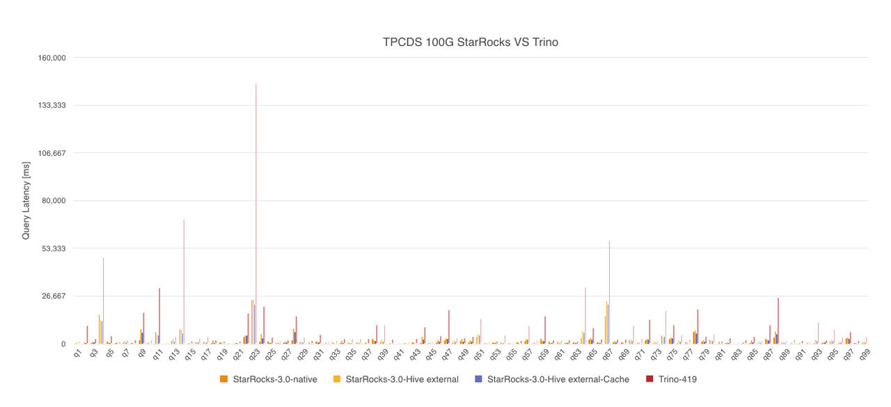

# TPC-DS 性能测试

TPC-DS 是美国交易处理效能委员会 TPC（Transaction Processing Performance Council）组织制定的用来模拟决策支持系统的测试集。与 TPC-H 相比，TPC-DS 是一个更加复杂和全面的基准测试集。

TPC-DS 是一套决策支持系统的基准测试，它对决策支持系统的几个通用方面进行建模，包括查询和数据维护，用于衡量大数据产品的分析性能。TPC-DS 模拟了零售企业三种销售渠道（实体店、互联网、目录）的销售和退货业务，除了建立相关销售和退货模型的表格，它还包括一个简单的库存系统和一个促销系统。该测试共包含 24 张表，数据量可设定从 1 GB 到 3 TB 不等。基准测试共包含 99 个复杂查询，主要的评价指标为各个查询的响应时间，即从提交查询到结果返回所需时间。

## 1. 测试结论

在 TPC-DS 100 GB 规模的数据集上进行对比测试，共 99 个查询，测试结果如下：



StarRocks 测试了使用本地存储查询和 Hive 外表查询两种方式，其中 StarRocks Hive 外表查询和 Trino 查询的是同一份数据，数据采用 Parquet 格式存储，LZ4 格式压缩。

最终，StarRocks 本地存储查询总耗时为 174s，StarRocks Hive 外表查询总耗时为 239s，StarRocks Hive 外表查询开启 Data Cache 后查询总耗时为 176s，**Trino 查询总耗时为 892s**。

**StarRocks 本地存储查询性能是 Trino 的 5.1 倍，StarRocks Hive 外表查询是 Trino 的 3.7 倍，StarRocks Hive 外表查询开启 Data Cache 后查询性能是 Trino 的 5 倍。**

## 2. 测试准备

### 2.1 硬件环境

| 机器     | 4 台阿里云主机                                       |
| -------- | ---------------------------------------------------- |
| CPU      | 8core Intel(R) Xeon(R) Platinum 8269CY CPU @ 2.50GHz |
| 内存      | 32 GB                                                 |
| 网络带宽   | 5 Gbits/s                                            |
| 磁盘      | ESSD 云盘                                             |

### 2.2 软件环境

StarRocks 和 Trino 部署在相同配置的机器上进行测试，StarRocks 部署 1 个 FE 和 3 个 BE，Trino 部署 1 个 Coordinator 和 3 个 Worker。

- 内核版本：Linux 3.10.0-1127.13.1.el7.x86_64

- 操作系统版本：CentOS Linux release 7.8.2003

- 软件版本：StarRocks 社区版 3.0，Trino-419， Hive-3.1.2

## 3. 测试数据与结果

### 3.1 测试数据

| 表                     | 行数      |
| ---------------------- | --------- |
| call_center            | 30        |
| catalog_page           | 20400     |
| catalog_returns        | 14404374  |
| catalog_sales          | 143997065 |
| customer_address       | 1000000   |
| customer_demographics  | 1920800   |
| customer               | 2000000   |
| date_dim               | 73049     |
| household_demographics | 7200      |
| income_band            | 20        |
| inventory              | 399330000 |
| item                   | 204000    |
| promotion              | 1000      |
| reason                 | 55        |
| ship_mode              | 20        |
| store                  | 402       |
| store_returns          | 28795080  |
| store_sales            | 287997024 |
| time_dim               | 86400     |
| warehouse              | 15        |
| web_page               | 2040      |
| web_returns            | 7197670   |
| web_sales              | 72001237  |
| web_site               | 24        |

### 3.2 测试结果

> 说明：
>
> - 查询结果的单位是 ms。
> - 所有查询预热一次，执行三次取平均值作为结果。
> - `StarRocks-3.0.5-native` 表示使用 StarRocks 本地存储，`StarRocks-3.0-Hive external` 表示通过 Catalog 查询 Hive 外表，`StarRocks-3.0-Hive external-Cache` 表示通过 Catalog 查询 Hive 外表并开启 StarRocks 的 Data Cache 特性。
> - StarRocks 开启聚合下推优化 `SET global cbo_push_down_aggregate_mode = 0`。

| **Query** | **StarRocks-3.0.5-native** | **StarRocks-3.0-Hive external** | **StarRocks-3.0-Hive external-Cache** | **Trino-419** |
| --------- | -------------------------- | ------------------------------- | ------------------------------------- | ------------- |
| SUM       | 174157                     | 238590                          | 175970                                | 891892        |
| Q1        | 274                        | 780                             | 254                                   | 1681          |
| Q2        | 338                        | 676                             | 397                                   | 10200         |
| Q3        | 455                        | 1156                            | 628                                   | 3156          |
| Q4        | 16180                      | 13229                           | 12623                                 | 48176         |
| Q5        | 1162                       | 773                             | 506                                   | 4490          |
| Q6        | 397                        | 606                             | 165                                   | 1349          |
| Q7        | 898                        | 1707                            | 724                                   | 2300          |
| Q8        | 532                        | 447                             | 141                                   | 2330          |
| Q9        | 2113                       | 7998                            | 6336                                  | 17734         |
| Q10       | 588                        | 847                             | 285                                   | 2498          |
| Q11       | 6465                       | 5086                            | 4665                                  | 31333         |
| Q12       | 149                        | 302                             | 135                                   | 728           |
| Q13       | 1573                       | 2661                            | 1349                                  | 4370          |
| Q14       | 7928                       | 7811                            | 5955                                  | 69729         |
| Q15       | 323                        | 461                             | 199                                   | 1522          |
| Q16       | 639                        | 1278                            | 661                                   | 3282          |
| Q17       | 1157                       | 898                             | 682                                   | 4102          |
| Q18       | 540                        | 1746                            | 521                                   | 2471          |
| Q19       | 667                        | 639                             | 230                                   | 1701          |
| Q20       | 209                        | 369                             | 144                                   | 849           |
| Q21       | 466                        | 586                             | 306                                   | 1591          |
| Q22       | 3876                       | 4704                            | 4536                                  | 17422         |
| Q23       | 24500                      | 24746                           | 21707                                 | 145850        |
| Q24       | 1256                       | 5220                            | 3219                                  | 21234         |
| Q25       | 1037                       | 792                             | 542                                   | 3702          |
| Q26       | 393                        | 834                             | 360                                   | 1737          |
| Q27       | 742                        | 1303                            | 696                                   | 2396          |
| Q28       | 1864                       | 8600                            | 6564                                  | 15837         |
| Q29       | 1097                       | 1134                            | 888                                   | 4024          |
| Q30       | 194                        | 669                             | 242                                   | 1922          |
| Q31       | 1149                       | 1070                            | 834                                   | 5431          |
| Q32       | 222                        | 718                             | 104                                   | 1706          |
| Q33       | 922                        | 735                             | 327                                   | 2048          |
| Q34       | 544                        | 1392                            | 576                                   | 3185          |
| Q35       | 974                        | 897                             | 574                                   | 3050          |
| Q36       | 630                        | 1009                            | 464                                   | 3056          |
| Q37       | 246                        | 791                             | 273                                   | 3258          |
| Q38       | 2831                       | 2017                            | 1695                                  | 10913         |
| Q39       | 1057                       | 2312                            | 1324                                  | 10665         |
| Q40       | 331                        | 560                             | 209                                   | 2678          |
| Q41       | 57                         | 148                             | 79                                    | 776           |
| Q42       | 463                        | 559                             | 106                                   | 1213          |
| Q43       | 885                        | 602                             | 342                                   | 2914          |
| Q44       | 506                        | 3783                            | 2306                                  | 9705          |
| Q45       | 439                        | 777                             | 309                                   | 1012          |
| Q46       | 868                        | 1746                            | 1037                                  | 4766          |
| Q47       | 1816                       | 2979                            | 2684                                  | 19111         |
| Q48       | 635                        | 2038                            | 1202                                  | 3635          |
| Q49       | 1440                       | 2754                            | 1168                                  | 3435          |
| Q50       | 836                        | 2053                            | 1305                                  | 4375          |
| Q51       | 3966                       | 5258                            | 4466                                  | 14283         |
| Q52       | 483                        | 436                             | 100                                   | 1126          |
| Q53       | 698                        | 802                             | 391                                   | 1648          |
| Q54       | 794                        | 970                             | 534                                   | 5146          |
| Q55       | 463                        | 540                             | 97                                    | 963           |
| Q56       | 874                        | 695                             | 240                                   | 2110          |
| Q57       | 1717                       | 2723                            | 2372                                  | 10203         |
| Q58       | 554                        | 727                             | 242                                   | 2053          |
| Q59       | 2764                       | 1581                            | 1368                                  | 15697         |
| Q60       | 1053                       | 557                             | 389                                   | 2421          |
| Q61       | 1353                       | 1026                            | 439                                   | 2334          |
| Q62       | 453                        | 659                             | 427                                   | 2422          |
| Q63       | 709                        | 943                             | 374                                   | 1624          |
| Q64       | 3209                       | 6968                            | 6175                                  | 31994         |
| Q65       | 2147                       | 3043                            | 2451                                  | 9334          |
| Q66       | 688                        | 805                             | 437                                   | 2598          |
| Q67       | 15486                      | 23743                           | 21975                                 | 58091         |
| Q68       | 965                        | 1702                            | 776                                   | 2710          |
| Q69       | 600                        | 703                             | 263                                   | 2872          |
| Q70       | 2376                       | 2217                            | 1588                                  | 10272         |
| Q71       | 702                        | 691                             | 348                                   | 3074          |
| Q72       | 1764                       | 2733                            | 2305                                  | 13973         |
| Q73       | 576                        | 1145                            | 484                                   | 1899          |
| Q74       | 4615                       | 3884                            | 3776                                  | 18749         |
| Q75       | 2661                       | 3479                            | 3137                                  | 10858         |
| Q76       | 450                        | 2001                            | 1014                                  | 5297          |
| Q77       | 1109                       | 743                             | 317                                   | 2810          |
| Q78       | 6540                       | 7198                            | 5890                                  | 19671         |
| Q79       | 1116                       | 1953                            | 1121                                  | 4406          |
| Q80       | 2290                       | 1973                            | 1480                                  | 5865          |
| Q81       | 247                        | 1024                            | 317                                   | 1729          |
| Q82       | 392                        | 929                             | 407                                   | 3605          |
| Q83       | 134                        | 313                             | 158                                   | 1209          |
| Q84       | 107                        | 820                             | 228                                   | 2448          |
| Q85       | 460                        | 2045                            | 621                                   | 4311          |
| Q86       | 433                        | 999                             | 387                                   | 1693          |
| Q87       | 2873                       | 2159                            | 1779                                  | 10709         |
| Q88       | 3616                       | 7076                            | 5432                                  | 26002         |
| Q89       | 735                        | 785                             | 454                                   | 1997          |
| Q90       | 174                        | 898                             | 232                                   | 2585          |
| Q91       | 113                        | 495                             | 139                                   | 1745          |
| Q92       | 203                        | 627                             | 91                                    | 1016          |
| Q93       | 529                        | 2508                            | 1422                                  | 12265         |
| Q94       | 475                        | 811                             | 598                                   | 2153          |
| Q95       | 1059                       | 1993                            | 1526                                  | 8058          |
| Q96       | 395                        | 1197                            | 681                                   | 3976          |
| Q97       | 3000                       | 3459                            | 2860                                  | 6818          |
| Q98       | 419                        | 486                             | 344                                   | 2090          |
| Q99       | 755                        | 1070                            | 740                                   | 4332          |

## 4. 测试流程

### 4.1 StarRocks 本地表测试流程

#### 4.1.1 生成数据

下载 tpcds-poc 工具包生成 TPC-DS 标准测试集 `scale factor=100` 的数据。

```Bash
wget https://starrocks-public.oss-cn-zhangjiakou.aliyuncs.com/tpcds-poc-1.0.zip
unzip tpcds-poc-1.0
cd tpcds-poc-1.0

sh bin/gen_data/gen-tpcds.sh 100 data_100
```

#### 4.1.2 创建表结构

修改配置文件 `conf/starrocks.conf`，指定脚本操作的集群地址，重点关注 `mysql_host` 和 `mysql_port`，然后执行建表操作。

```SQL
sh bin/create_db_table.sh ddl_100
```

#### 4.1.3 导入数据

```Python
sh bin/stream_load.sh data_100
```

#### 4.1.4 查询数据

```Python
sh bin/benchmark.sh -p -d tpcds
```

### 4.2 StarRocks Hive 外表测试流程

#### 4.2.1 创建表结构

在 Hive 中创建外部表，外部表存储格式是 Parquet，压缩格式是 LZ4。详细建表语句见 [5.3 创建 Parquet 格式 Hive 外表](#53-hive-外部表建表parquet-格式)，这个 Hive 外部表就是 StarRocks 和 Trino 对比测试查询的表。

#### 4.2.2 导入数据

将 [4.1.1 StarRocks 本地表测试](#411-生成数据) 中生成的 TPC-DS CSV 原始数据上传到 HDFS 指定路径，本文以路径 `/user/tmp/csv/` 为例，然后在 Hive 中创建 CSV 格式外部表，存储路径为 `/user/tmp/csv/`，详细建表语句见 [5.4 创建 CSV 格式 Hive 外表](#54-hive-外部表建表-csv-格式)。

通过 INSERT INTO 命令将 CSV 格式外部表的数据导入到 Parquet 格式外部表中，这样就得到了存储格式为 Parquet，压缩格式为 LZ4 的数据，导入命令如下：

```SQL
use tpcds_100g_parquet_lz4;

insert into call_center select * from tpcds_100g_csv.call_center order by cc_call_center_sk;
insert into catalog_page select * from tpcds_100g_csv.catalog_page order by cp_catalog_page_sk;
insert into catalog_returns select * from tpcds_100g_csv.catalog_returns order by cr_returned_date_sk, cr_item_sk;
insert into date_dim select * from tpcds_100g_csv.date_dim order by D_DATE_SK;
insert into household_demographics select * from tpcds_100g_csv.household_demographics order by HD_DEMO_SK;
insert into income_band select * from tpcds_100g_csv.income_band order by IB_INCOME_BAND_SK;
insert into item select * from tpcds_100g_csv.item order by I_ITEM_SK;
insert into promotion select * from tpcds_100g_csv.promotion  order by P_PROMO_SK;
insert into reason select * from tpcds_100g_csv.reason a order by a.R_REASON_SK;
insert into ship_mode select * from tpcds_100g_csv.ship_mode order by SM_SHIP_MODE_SK;
insert into store select * from tpcds_100g_csv.store order by S_STORE_SK;
insert into time_dim select * from tpcds_100g_csv.time_dim order by T_TIME_SK;
insert into warehouse select * from tpcds_100g_csv.warehouse order by W_WAREHOUSE_SK;
insert into web_page select * from tpcds_100g_csv.web_page order by WP_WEB_PAGE_SK;
insert into web_site select * from tpcds_100g_csv.web_site order by WEB_SITE_SK;
insert into customer_demographics select * from tpcds_100g_csv.customer_demographics order by CD_DEMO_SK;
insert into customer select * from tpcds_100g_csv.customer order by C_CUSTOMER_SK;
insert into customer_address select * from tpcds_100g_csv.customer_address order by CA_ADDRESS_SK;
insert into web_sales select * from tpcds_100g_csv.web_sales order by WS_SOLD_DATE_SK, WS_ITEM_SK;
insert into web_returns select * from tpcds_100g_csv.web_returns order by WR_RETURNED_DATE_SK, WR_ITEM_SK;
insert into inventory select * from tpcds_100g_csv.inventory order by INV_DATE_SK, INV_ITEM_SK;
insert into catalog_sales select * from tpcds_100g_csv.catalog_sales order by CS_SOLD_DATE_SK, CS_ITEM_SK;
insert into store_returns select * from tpcds_100g_csv.store_returns order by SR_RETURNED_DATE_SK, SR_ITEM_SK;
insert into store_sales select * from tpcds_100g_csv.store_sales order by SS_SOLD_DATE_SK, SS_ITEM_SK;
```

#### 4.2.3 收集统计信息

StarRocks 3.0 版本不支持收集外部表的统计信息，使用 Hive 收集列级别统计信息。

```SQL
use tpcds_100g_parquet_lz4;

analyze table call_center compute statistics FOR COLUMNS;
analyze table catalog_page compute statistics FOR COLUMNS;
analyze table catalog_returns compute statistics FOR COLUMNS;
analyze table catalog_sales compute statistics FOR COLUMNS;
analyze table customer compute statistics FOR COLUMNS;
analyze table customer_address compute statistics FOR COLUMNS;
analyze table customer_demographics compute statistics FOR COLUMNS;
analyze table date_dim compute statistics FOR COLUMNS;
analyze table household_demographics compute statistics FOR COLUMNS;
analyze table income_band compute statistics FOR COLUMNS;
analyze table inventory compute statistics FOR COLUMNS;
analyze table item compute statistics FOR COLUMNS;
analyze table promotion compute statistics FOR COLUMNS;
analyze table reason compute statistics FOR COLUMNS;
analyze table ship_mode compute statistics FOR COLUMNS;
analyze table store compute statistics FOR COLUMNS;
analyze table store_returns compute statistics FOR COLUMNS;
analyze table store_sales compute statistics FOR COLUMNS;
analyze table time_dim compute statistics FOR COLUMNS;
analyze table warehouse compute statistics FOR COLUMNS;
analyze table web_page compute statistics FOR COLUMNS;
analyze table web_returns compute statistics FOR COLUMNS;
analyze table web_sales compute statistics FOR COLUMNS;
analyze table web_site compute statistics FOR COLUMNS;
```

#### 4.2.4 查询数据

StarRocks 使用 Catalog 功能查询 Hive 外表数据，详细操作见 [Hive catalog](../data_source/catalog/hive_catalog.md)。

StarRocks 开启 [Data Cache](../data_source/data_cache.md) 的测试场景，在当前机器配置和集群规模下，推荐使用如下配置

```SQL
block_cache_mem_size = 5368709120
block_cache_disk_size = 193273528320
```

## 5. 查询语句和建表语句

### 5.1 TPC-DS 查询 SQL

99 条详细的查询 SQL，参见 [TPC-DS SQL](./tpc_ds_99_sql.md)。

### 5.2 StarRocks Native 建表

```SQL
create table call_center
(
    cc_call_center_sk         integer               not null,
    cc_call_center_id         char(16)              not null,
    cc_rec_start_date         date                          ,
    cc_rec_end_date           date                          ,
    cc_closed_date_sk         integer                       ,
    cc_open_date_sk           integer                       ,
    cc_name                   varchar(50)                   ,
    cc_class                  varchar(50)                   ,
    cc_employees              integer                       ,
    cc_sq_ft                  integer                       ,
    cc_hours                  char(20)                      ,
    cc_manager                varchar(40)                   ,
    cc_mkt_id                 integer                       ,
    cc_mkt_class              char(50)                      ,
    cc_mkt_desc               varchar(100)                  ,
    cc_market_manager         varchar(40)                   ,
    cc_division               integer                       ,
    cc_division_name          varchar(50)                   ,
    cc_company                integer                       ,
    cc_company_name           char(50)                      ,
    cc_street_number          char(10)                      ,
    cc_street_name            varchar(60)                   ,
    cc_street_type            char(15)                      ,
    cc_suite_number           char(10)                      ,
    cc_city                   varchar(60)                   ,
    cc_county                 varchar(30)                   ,
    cc_state                  char(2)                       ,
    cc_zip                    char(10)                      ,
    cc_country                varchar(20)                   ,
    cc_gmt_offset             decimal(5,2)                  ,
    cc_tax_percentage         decimal(5,2)
)
duplicate key (cc_call_center_sk)
distributed by hash(cc_call_center_sk) buckets 1
properties(
    "replication_num" = "1"
);

create table catalog_page
(
    cp_catalog_page_sk        integer               not null,
    cp_catalog_page_id        char(16)              not null,
    cp_start_date_sk          integer                       ,
    cp_end_date_sk            integer                       ,
    cp_department             varchar(50)                   ,
    cp_catalog_number         integer                       ,
    cp_catalog_page_number    integer                       ,
    cp_description            varchar(100)                  ,
    cp_type                   varchar(100)
)
duplicate key (cp_catalog_page_sk)
distributed by hash(cp_catalog_page_sk) buckets 1
properties(
    "replication_num" = "1"
);

create table catalog_returns
(
    cr_item_sk                integer               not null,
    cr_order_number           integer               not null,
    cr_returned_date_sk       integer                       ,
    cr_returned_time_sk       integer                       ,
    cr_refunded_customer_sk   integer                       ,
    cr_refunded_cdemo_sk      integer                       ,
    cr_refunded_hdemo_sk      integer                       ,
    cr_refunded_addr_sk       integer                       ,
    cr_returning_customer_sk  integer                       ,
    cr_returning_cdemo_sk     integer                       ,
    cr_returning_hdemo_sk     integer                       ,
    cr_returning_addr_sk      integer                       ,
    cr_call_center_sk         integer                       ,
    cr_catalog_page_sk        integer                       ,
    cr_ship_mode_sk           integer                       ,
    cr_warehouse_sk           integer                       ,
    cr_reason_sk              integer                       ,
    cr_return_quantity        integer                       ,
    cr_return_amount          decimal(7,2)                  ,
    cr_return_tax             decimal(7,2)                  ,
    cr_return_amt_inc_tax     decimal(7,2)                  ,
    cr_fee                    decimal(7,2)                  ,
    cr_return_ship_cost       decimal(7,2)                  ,
    cr_refunded_cash          decimal(7,2)                  ,
    cr_reversed_charge        decimal(7,2)                  ,
    cr_store_credit           decimal(7,2)                  ,
    cr_net_loss               decimal(7,2)
)
duplicate key (cr_item_sk, cr_order_number)
distributed by hash(cr_item_sk, cr_order_number) buckets 16
properties(
    "replication_num" = "1"
);

create table catalog_sales
(
    cs_item_sk                integer               not null,
    cs_order_number           integer               not null,
    cs_sold_date_sk           integer                       ,
    cs_sold_time_sk           integer                       ,
    cs_ship_date_sk           integer                       ,
    cs_bill_customer_sk       integer                       ,
    cs_bill_cdemo_sk          integer                       ,
    cs_bill_hdemo_sk          integer                       ,
    cs_bill_addr_sk           integer                       ,
    cs_ship_customer_sk       integer                       ,
    cs_ship_cdemo_sk          integer                       ,
    cs_ship_hdemo_sk          integer                       ,
    cs_ship_addr_sk           integer                       ,
    cs_call_center_sk         integer                       ,
    cs_catalog_page_sk        integer                       ,
    cs_ship_mode_sk           integer                       ,
    cs_warehouse_sk           integer                       ,
    cs_promo_sk               integer                       ,
    cs_quantity               integer                       ,
    cs_wholesale_cost         decimal(7,2)                  ,
    cs_list_price             decimal(7,2)                  ,
    cs_sales_price            decimal(7,2)                  ,
    cs_ext_discount_amt       decimal(7,2)                  ,
    cs_ext_sales_price        decimal(7,2)                  ,
    cs_ext_wholesale_cost     decimal(7,2)                  ,
    cs_ext_list_price         decimal(7,2)                  ,
    cs_ext_tax                decimal(7,2)                  ,
    cs_coupon_amt             decimal(7,2)                  ,
    cs_ext_ship_cost          decimal(7,2)                  ,
    cs_net_paid               decimal(7,2)                  ,
    cs_net_paid_inc_tax       decimal(7,2)                  ,
    cs_net_paid_inc_ship      decimal(7,2)                  ,
    cs_net_paid_inc_ship_tax  decimal(7,2)                  ,
    cs_net_profit             decimal(7,2)
)
duplicate key (cs_item_sk, cs_order_number)
distributed by hash(cs_item_sk) buckets 192
properties(
    "replication_num" = "1"
);

create table customer_address
(
    ca_address_sk             integer               not null,
    ca_address_id             char(16)              not null,
    ca_street_number          char(10)                      ,
    ca_street_name            varchar(60)                   ,
    ca_street_type            char(15)                      ,
    ca_suite_number           char(10)                      ,
    ca_city                   varchar(60)                   ,
    ca_county                 varchar(30)                   ,
    ca_state                  char(2)                       ,
    ca_zip                    char(10)                      ,
    ca_country                varchar(20)                   ,
    ca_gmt_offset             decimal(5,2)                  ,
    ca_location_type          char(20)
)
duplicate key(ca_address_sk)
distributed by hash(ca_address_sk) buckets 10
properties(
    "replication_num" = "1"
);

create table customer_demographics
(
    cd_demo_sk                integer  not null,
    cd_gender                 char(1)  not null,
    cd_marital_status         char(1)  not null,
    cd_education_status       char(20) not null,
    cd_purchase_estimate      integer  not null,
    cd_credit_rating          char(10) not null,
    cd_dep_count              integer  not null,
    cd_dep_employed_count     integer  not null,
    cd_dep_college_count      integer  not null
)
duplicate key (cd_demo_sk)
distributed by hash(cd_demo_sk) buckets 10
properties(
    "replication_num" = "1"
);

create table customer
(
    c_customer_sk             integer               not null,
    c_customer_id             char(16)              not null,
    c_current_cdemo_sk        integer                       ,
    c_current_hdemo_sk        integer                       ,
    c_current_addr_sk         integer                       ,
    c_first_shipto_date_sk    integer                       ,
    c_first_sales_date_sk     integer                       ,
    c_salutation              char(10)                      ,
    c_first_name              char(20)                      ,
    c_last_name               char(30)                      ,
    c_preferred_cust_flag     char(1)                       ,
    c_birth_day               integer                       ,
    c_birth_month             integer                       ,
    c_birth_year              integer                       ,
    c_birth_country           varchar(20)                   ,
    c_login                   char(13)                      ,
    c_email_address           char(50)                      ,
    c_last_review_date        char(10)
)
duplicate key (c_customer_sk)
distributed by hash(c_customer_sk) buckets 10
properties(
    "replication_num" = "1"
);

create table date_dim
(
    d_date_sk                 integer   not null,
    d_date_id                 char(16)  not null,
    d_date                    date      not null,
    d_month_seq               integer   not null,
    d_week_seq                integer   not null,
    d_quarter_seq             integer   not null,
    d_year                    integer   not null,
    d_dow                     integer   not null,
    d_moy                     integer   not null,
    d_dom                     integer   not null,
    d_qoy                     integer   not null,
    d_fy_year                 integer   not null,
    d_fy_quarter_seq          integer   not null,
    d_fy_week_seq             integer   not null,
    d_day_name                char(9)   not null,
    d_quarter_name            char(6)   not null,
    d_holiday                 char(1)   not null,
    d_weekend                 char(1)   not null,
    d_following_holiday       char(1)   not null,
    d_first_dom               integer   not null,
    d_last_dom                integer   not null,
    d_same_day_ly             integer   not null,
    d_same_day_lq             integer   not null,
    d_current_day             char(1)   not null,
    d_current_week            char(1)   not null,
    d_current_month           char(1)   not null,
    d_current_quarter         char(1)   not null,
    d_current_year            char(1)   not null
)
duplicate key (d_date_sk)
distributed by hash(d_date_sk) buckets 5
properties(
    "replication_num" = "1"
);

create table household_demographics
(
    hd_demo_sk                integer  not null,
    hd_income_band_sk         integer  not null,
    hd_buy_potential          char(15) not null,
    hd_dep_count              integer  not null,
    hd_vehicle_count          integer  not null
)
duplicate key (hd_demo_sk)
distributed by hash(hd_demo_sk) buckets 1
properties(
    "replication_num" = "1"
);

create table income_band
(
    ib_income_band_sk         integer               not null,
    ib_lower_bound            integer                       ,
    ib_upper_bound            integer
)
duplicate key (ib_income_band_sk)
distributed by hash(ib_income_band_sk) buckets 1
properties(
    "replication_num" = "1"
);

create table inventory
(
    inv_item_sk               integer               not null,
    inv_date_sk               integer               not null,
    inv_warehouse_sk          integer               not null,
    inv_quantity_on_hand      integer
)
duplicate key (inv_item_sk, inv_date_sk, inv_warehouse_sk)
distributed by hash(inv_item_sk) buckets 32
properties(
    "replication_num" = "1"
);

create table item
(
    i_item_sk                 integer               not null,
    i_item_id                 char(16)              not null,
    i_rec_start_date          date                          ,
    i_rec_end_date            date                          ,
    i_item_desc               varchar(200)                  ,
    i_current_price           decimal(7,2)                  ,
    i_wholesale_cost          decimal(7,2)                  ,
    i_brand_id                integer                       ,
    i_brand                   char(50)                      ,
    i_class_id                integer                       ,
    i_class                   char(50)                      ,
    i_category_id             integer                       ,
    i_category                char(50)                      ,
    i_manufact_id             integer                       ,
    i_manufact                char(50)                      ,
    i_size                    char(20)                      ,
    i_formulation             char(20)                      ,
    i_color                   char(20)                      ,
    i_units                   char(10)                      ,
    i_container               char(10)                      ,
    i_manager_id              integer                       ,
    i_product_name            char(50)
)
duplicate key (i_item_sk)
distributed by hash(i_item_sk) buckets 10
properties(
    "replication_num" = "1"
);

create table promotion
(
    p_promo_sk                integer               not null,
    p_promo_id                char(16)              not null,
    p_start_date_sk           integer                       ,
    p_end_date_sk             integer                       ,
    p_item_sk                 integer                       ,
    p_cost                    decimal(15,2)                 ,
    p_response_target         integer                       ,
    p_promo_name              char(50)                      ,
    p_channel_dmail           char(1)                       ,
    p_channel_email           char(1)                       ,
    p_channel_catalog         char(1)                       ,
    p_channel_tv              char(1)                       ,
    p_channel_radio           char(1)                       ,
    p_channel_press           char(1)                       ,
    p_channel_event           char(1)                       ,
    p_channel_demo            char(1)                       ,
    p_channel_details         varchar(100)                  ,
    p_purpose                 char(15)                      ,
    p_discount_active         char(1)
)
duplicate key (p_promo_sk)
distributed by hash(p_promo_sk) buckets 1
properties(
    "replication_num" = "1"
);

create table reason
(
    r_reason_sk               integer               not null,
    r_reason_id               char(16)              not null,
    r_reason_desc             char(100)
)
duplicate key (r_reason_sk)
distributed by hash(r_reason_sk) buckets 1
properties(
    "replication_num" = "1"
);

create table ship_mode
(
    sm_ship_mode_sk           integer               not null,
    sm_ship_mode_id           char(16)              not null,
    sm_type                   char(30)                      ,
    sm_code                   char(10)                      ,
    sm_carrier                char(20)                      ,
    sm_contract               char(20)
)
duplicate key (sm_ship_mode_sk)
distributed by hash(sm_ship_mode_sk) buckets 1
properties(
    "replication_num" = "1"
);

create table store_returns
(
    sr_item_sk                integer               not null,
    sr_ticket_number          integer               not null,
    sr_returned_date_sk       integer                       ,
    sr_return_time_sk         integer                       ,
    sr_customer_sk            integer                       ,
    sr_cdemo_sk               integer                       ,
    sr_hdemo_sk               integer                       ,
    sr_addr_sk                integer                       ,
    sr_store_sk               integer                       ,
    sr_reason_sk              integer                       ,
    sr_return_quantity        integer                       ,
    sr_return_amt             decimal(7,2)                  ,
    sr_return_tax             decimal(7,2)                  ,
    sr_return_amt_inc_tax     decimal(7,2)                  ,
    sr_fee                    decimal(7,2)                  ,
    sr_return_ship_cost       decimal(7,2)                  ,
    sr_refunded_cash          decimal(7,2)                  ,
    sr_reversed_charge        decimal(7,2)                  ,
    sr_store_credit           decimal(7,2)                  ,
    sr_net_loss               decimal(7,2)
)
duplicate key (sr_item_sk, sr_ticket_number)
distributed by hash(sr_item_sk, sr_ticket_number) buckets 10
properties(
    "replication_num" = "1"
);

create table store_sales
(
    ss_item_sk                integer               not null,
    ss_ticket_number          integer               not null,
    ss_sold_date_sk           integer                       ,
    ss_sold_time_sk           integer                       ,
    ss_customer_sk            integer                       ,
    ss_cdemo_sk               integer                       ,
    ss_hdemo_sk               integer                       ,
    ss_addr_sk                integer                       ,
    ss_store_sk               integer                       ,
    ss_promo_sk               integer                       ,
    ss_quantity               integer                       ,
    ss_wholesale_cost         decimal(7,2)                  ,
    ss_list_price             decimal(7,2)                  ,
    ss_sales_price            decimal(7,2)                  ,
    ss_ext_discount_amt       decimal(7,2)                  ,
    ss_ext_sales_price        decimal(7,2)                  ,
    ss_ext_wholesale_cost     decimal(7,2)                  ,
    ss_ext_list_price         decimal(7,2)                  ,
    ss_ext_tax                decimal(7,2)                  ,
    ss_coupon_amt             decimal(7,2)                  ,
    ss_net_paid               decimal(7,2)                  ,
    ss_net_paid_inc_tax       decimal(7,2)                  ,
    ss_net_profit             decimal(7,2)
)
duplicate key (ss_item_sk, ss_ticket_number)
distributed by hash(ss_item_sk) buckets 192
properties(
    "replication_num" = "1"
);

create table store
(
    s_store_sk                integer               not null,
    s_store_id                char(16)              not null,
    s_rec_start_date          date                          ,
    s_rec_end_date            date                          ,
    s_closed_date_sk          integer                       ,
    s_store_name              varchar(50)                   ,
    s_number_employees        integer                       ,
    s_floor_space             integer                       ,
    s_hours                   char(20)                      ,
    s_manager                 varchar(40)                   ,
    s_market_id               integer                       ,
    s_geography_class         varchar(100)                  ,
    s_market_desc             varchar(100)                  ,
    s_market_manager          varchar(40)                   ,
    s_division_id             integer                       ,
    s_division_name           varchar(50)                   ,
    s_company_id              integer                       ,
    s_company_name            varchar(50)                   ,
    s_street_number           varchar(10)                   ,
    s_street_name             varchar(60)                   ,
    s_street_type             char(15)                      ,
    s_suite_number            char(10)                      ,
    s_city                    varchar(60)                   ,
    s_county                  varchar(30)                   ,
    s_state                   char(2)                       ,
    s_zip                     char(10)                      ,
    s_country                 varchar(20)                   ,
    s_gmt_offset              decimal(5,2)                  ,
    s_tax_precentage          decimal(5,2)
)
duplicate key (s_store_sk)
distributed by hash(s_store_sk) buckets 1
properties(
    "replication_num" = "1"
);

create table time_dim
(
    t_time_sk                 integer               not null,
    t_time_id                 char(16)              not null,
    t_time                    integer               not null,
    t_hour                    integer               not null,
    t_minute                  integer               not null,
    t_second                  integer               not null,
    t_am_pm                   char(2)               not null,
    t_shift                   char(20)              not null,
    t_sub_shift               char(20)              not null,
    t_meal_time               char(20)
)
duplicate key (t_time_sk)
distributed by hash(t_time_sk) buckets 5
properties(
    "replication_num" = "1"
);

create table warehouse
(
    w_warehouse_sk            integer               not null,
    w_warehouse_id            char(16)              not null,
    w_warehouse_name          varchar(20)                   ,
    w_warehouse_sq_ft         integer                       ,
    w_street_number           char(10)                      ,
    w_street_name             varchar(60)                   ,
    w_street_type             char(15)                      ,
    w_suite_number            char(10)                      ,
    w_city                    varchar(60)                   ,
    w_county                  varchar(30)                   ,
    w_state                   char(2)                       ,
    w_zip                     char(10)                      ,
    w_country                 varchar(20)                   ,
    w_gmt_offset              decimal(5,2)
)
duplicate key (w_warehouse_sk)
distributed by hash(w_warehouse_sk) buckets 1
properties(
    "replication_num" = "1"
);

create table web_page
(
    wp_web_page_sk            integer               not null,
    wp_web_page_id            char(16)              not null,
    wp_rec_start_date         date                          ,
    wp_rec_end_date           date                          ,
    wp_creation_date_sk       integer                       ,
    wp_access_date_sk         integer                       ,
    wp_autogen_flag           char(1)                       ,
    wp_customer_sk            integer                       ,
    wp_url                    varchar(100)                  ,
    wp_type                   char(50)                      ,
    wp_char_count             integer                       ,
    wp_link_count             integer                       ,
    wp_image_count            integer                       ,
    wp_max_ad_count           integer
)
duplicate key (wp_web_page_sk)
distributed by hash(wp_web_page_sk) buckets 1
properties(
    "replication_num" = "1"
);

create table web_returns
(
    wr_item_sk                integer               not null,
    wr_order_number           integer               not null,
    wr_returned_date_sk       integer                       ,
    wr_returned_time_sk       integer                       ,
    wr_refunded_customer_sk   integer                       ,
    wr_refunded_cdemo_sk      integer                       ,
    wr_refunded_hdemo_sk      integer                       ,
    wr_refunded_addr_sk       integer                       ,
    wr_returning_customer_sk  integer                       ,
    wr_returning_cdemo_sk     integer                       ,
    wr_returning_hdemo_sk     integer                       ,
    wr_returning_addr_sk      integer                       ,
    wr_web_page_sk            integer                       ,
    wr_reason_sk              integer                       ,
    wr_return_quantity        integer                       ,
    wr_return_amt             decimal(7,2)                  ,
    wr_return_tax             decimal(7,2)                  ,
    wr_return_amt_inc_tax     decimal(7,2)                  ,
    wr_fee                    decimal(7,2)                  ,
    wr_return_ship_cost       decimal(7,2)                  ,
    wr_refunded_cash          decimal(7,2)                  ,
    wr_reversed_charge        decimal(7,2)                  ,
    wr_account_credit         decimal(7,2)                  ,
    wr_net_loss               decimal(7,2)
)
duplicate key (wr_item_sk, wr_order_number)
distributed by hash(wr_item_sk, wr_order_number) buckets 10
properties(
    "replication_num" = "1"
);

create table web_sales
(
    ws_item_sk                integer               not null,
    ws_order_number           integer               not null,
    ws_sold_date_sk           integer                       ,
    ws_sold_time_sk           integer                       ,
    ws_ship_date_sk           integer                       ,
    ws_bill_customer_sk       integer                       ,
    ws_bill_cdemo_sk          integer                       ,
    ws_bill_hdemo_sk          integer                       ,
    ws_bill_addr_sk           integer                       ,
    ws_ship_customer_sk       integer                       ,
    ws_ship_cdemo_sk          integer                       ,
    ws_ship_hdemo_sk          integer                       ,
    ws_ship_addr_sk           integer                       ,
    ws_web_page_sk            integer                       ,
    ws_web_site_sk            integer                       ,
    ws_ship_mode_sk           integer                       ,
    ws_warehouse_sk           integer                       ,
    ws_promo_sk               integer                       ,
    ws_quantity               integer                       ,
    ws_wholesale_cost         decimal(7,2)                  ,
    ws_list_price             decimal(7,2)                  ,
    ws_sales_price            decimal(7,2)                  ,
    ws_ext_discount_amt       decimal(7,2)                  ,
    ws_ext_sales_price        decimal(7,2)                  ,
    ws_ext_wholesale_cost     decimal(7,2)                  ,
    ws_ext_list_price         decimal(7,2)                  ,
    ws_ext_tax                decimal(7,2)                  ,
    ws_coupon_amt             decimal(7,2)                  ,
    ws_ext_ship_cost          decimal(7,2)                  ,
    ws_net_paid               decimal(7,2)                  ,
    ws_net_paid_inc_tax       decimal(7,2)                  ,
    ws_net_paid_inc_ship      decimal(7,2)                  ,
    ws_net_paid_inc_ship_tax  decimal(7,2)                  ,
    ws_net_profit             decimal(7,2)
)
duplicate key (ws_item_sk, ws_order_number)
distributed by hash(ws_item_sk, ws_order_number) buckets 192
properties(
    "replication_num" = "1"
);

create table web_site
(
    web_site_sk               integer               not null,
    web_site_id               char(16)              not null,
    web_rec_start_date        date                          ,
    web_rec_end_date          date                          ,
    web_name                  varchar(50)                   ,
    web_open_date_sk          integer                       ,
    web_close_date_sk         integer                       ,
    web_class                 varchar(50)                   ,
    web_manager               varchar(40)                   ,
    web_mkt_id                integer                       ,
    web_mkt_class             varchar(50)                   ,
    web_mkt_desc              varchar(100)                  ,
    web_market_manager        varchar(40)                   ,
    web_company_id            integer                       ,
    web_company_name          char(50)                      ,
    web_street_number         char(10)                      ,
    web_street_name           varchar(60)                   ,
    web_street_type           char(15)                      ,
    web_suite_number          char(10)                      ,
    web_city                  varchar(60)                   ,
    web_county                varchar(30)                   ,
    web_state                 char(2)                       ,
    web_zip                   char(10)                      ,
    web_country               varchar(20)                   ,
    web_gmt_offset            decimal(5,2)                  ,
    web_tax_percentage        decimal(5,2)
)
duplicate key (web_site_sk)
distributed by hash(web_site_sk) buckets 1
properties(
    "replication_num" = "1"
);
```

### 5.3 Hive 外部表建表（Parquet 格式）

```SQL
use tpcds_100g_parquet_lz4;

CREATE EXTERNAL TABLE IF NOT EXISTS customer_address
 (
  ca_address_sk int
  ,ca_address_id varchar(16)
  ,ca_street_number varchar(10)
  ,ca_street_name varchar(60)
  ,ca_street_type varchar(15)
  ,ca_suite_number varchar(10)
  ,ca_city varchar(60)
  ,ca_county varchar(30)
  ,ca_state varchar(2)
  ,ca_zip varchar(10)
  ,ca_country varchar(20)
  ,ca_gmt_offset decimal(5,2)
  ,ca_location_type varchar(20)
 )
stored as PARQUET
LOCATION '/user/tmp/parquet/customer_address/'
tblproperties("parquet.compression"="Lz4");

CREATE EXTERNAL TABLE IF NOT EXISTS customer_demographics
 (
  cd_demo_sk int
 ,cd_gender varchar(1)
 ,cd_marital_status varchar(1)
 ,cd_education_status varchar(20)
 ,cd_purchase_estimate   int
 ,cd_credit_rating varchar(10)
 ,cd_dep_count int
 ,cd_dep_employed_count int
 ,cd_dep_college_count int
 )
stored as PARQUET
LOCATION '/user/tmp/parquet/customer_demographics/'
tblproperties("parquet.compression"="Lz4");

CREATE EXTERNAL TABLE IF NOT EXISTS date_dim
 (
  d_date_sk int
  ,d_date_id varchar(16)
  ,d_date date
  ,d_month_seq int
  ,d_week_seq int
  ,d_quarter_seq int
  ,d_year int
  ,d_dow int
  ,d_moy int
  ,d_dom int
  ,d_qoy int
  ,d_fy_year int
  ,d_fy_quarter_seq int
  ,d_fy_week_seq int
  ,d_day_name varchar(9)
  ,d_quarter_name varchar(6)
  ,d_holiday varchar(1)
  ,d_weekend varchar(1)
  ,d_following_holiday varchar(1)
  ,d_first_dom int
  ,d_last_dom int
  ,d_same_day_ly int
  ,d_same_day_lq int
  ,d_current_day varchar(1)
  ,d_current_week varchar(1)
  ,d_current_month varchar(1)
  ,d_current_quarter varchar(1)
  ,d_current_year varchar(1)
 )
stored as PARQUET
LOCATION '/user/tmp/parquet/date_dim/'
tblproperties("parquet.compression"="Lz4");

CREATE EXTERNAL TABLE IF NOT EXISTS warehouse
 (
  w_warehouse_sk int
  ,w_warehouse_id varchar(16)
  ,w_warehouse_name varchar(20)
  ,w_warehouse_sq_ft int
  ,w_street_number varchar(10)
  ,w_street_name varchar(60)
  ,w_street_type varchar(15)
  ,w_suite_number varchar(10)
  ,w_city varchar(60)
  ,w_county varchar(30)
  ,w_state varchar(2)
  ,w_zip varchar(10)
  ,w_country varchar(20)
  ,w_gmt_offset decimal(5,2)
 )
stored as PARQUET
LOCATION '/user/tmp/parquet/warehouse/'
tblproperties("parquet.compression"="Lz4");

CREATE EXTERNAL TABLE IF NOT EXISTS ship_mode
 (
  sm_ship_mode_sk int
  ,sm_ship_mode_id varchar(16)
  ,sm_type varchar(30)
  ,sm_code varchar(10)
  ,sm_carrier varchar(20)
  ,sm_contract varchar(20)
 )
stored as PARQUET
LOCATION '/user/tmp/parquet/ship_mode/'
tblproperties("parquet.compression"="Lz4");

CREATE EXTERNAL TABLE IF NOT EXISTS time_dim
 (
  t_time_sk int
  ,t_time_id varchar(16)
  ,t_time int
  ,t_hour int
  ,t_minute int
  ,t_second int
  ,t_am_pm varchar(2)
  ,t_shift varchar(20)
  ,t_sub_shift varchar(20)
  ,t_meal_time varchar(20)
 )
stored as PARQUET
LOCATION '/user/tmp/parquet/time_dim/'
tblproperties("parquet.compression"="Lz4");

CREATE EXTERNAL TABLE IF NOT EXISTS reason
 (
  r_reason_sk int
  ,r_reason_id varchar(16)
  ,r_reason_desc varchar(100)
 )
stored as PARQUET
LOCATION '/user/tmp/parquet/reason/'
tblproperties("parquet.compression"="Lz4");

CREATE EXTERNAL TABLE IF NOT EXISTS income_band
 (
  ib_income_band_sk integer ,
  ib_lower_bound integer ,
  ib_upper_bound integer
 )
stored as PARQUET
LOCATION '/user/tmp/parquet/income_band/'
tblproperties("parquet.compression"="Lz4");

CREATE EXTERNAL TABLE IF NOT EXISTS item
 (
  i_item_sk int
  ,i_item_id varchar(16)
  ,i_rec_start_date date
  ,i_rec_end_date date
  ,i_item_desc varchar(200)
  ,i_current_price decimal(7,2)
  ,i_wholesale_cost decimal(7,2)
  ,i_brand_id int
  ,i_brand varchar(50)
  ,i_class_id int
  ,i_class varchar(50)
  ,i_category_id int
  ,i_category varchar(50)
  ,i_manufact_id int
  ,i_manufact varchar(50)
  ,i_size varchar(20)
  ,i_formulation varchar(20)
  ,i_color varchar(20)
  ,i_units varchar(10)
  ,i_container varchar(10)
  ,i_manager_id int
  ,i_product_name varchar(50)
 )
stored as PARQUET
LOCATION '/user/tmp/parquet/item/'
tblproperties("parquet.compression"="Lz4");

CREATE EXTERNAL TABLE IF NOT EXISTS store
 (
  s_store_sk int
  ,s_store_id varchar(16)
  ,s_rec_start_date date
  ,s_rec_end_date date
  ,s_closed_date_sk int
  ,s_store_name varchar(50)
  ,s_number_employees int
  ,s_floor_space int
  ,s_hours varchar(20)
  ,s_manager varchar(40)
  ,s_market_id int
  ,s_geography_class varchar(100)
  ,s_market_desc varchar(100)
  ,s_market_manager varchar(40)
  ,s_division_id int
  ,s_division_name varchar(50)
  ,s_company_id int
  ,s_company_name varchar(50)
  ,s_street_number varchar(10)
  ,s_street_name varchar(60)
  ,s_street_type varchar(15)
  ,s_suite_number varchar(10)
  ,s_city varchar(60)
  ,s_county varchar(30)
  ,s_state varchar(2)
  ,s_zip varchar(10)
  ,s_country varchar(20)
  ,s_gmt_offset decimal(5,2)
  ,s_tax_precentage decimal(5,2)
 )
stored as PARQUET
LOCATION '/user/tmp/parquet/store/'
tblproperties("parquet.compression"="Lz4");

CREATE EXTERNAL TABLE IF NOT EXISTS call_center
 (
  cc_call_center_sk int
  ,cc_call_center_id varchar(16)
  ,cc_rec_start_date date
  ,cc_rec_end_date date
  ,cc_closed_date_sk int
  ,cc_open_date_sk int
  ,cc_name varchar(50)
  ,cc_class varchar(50)
  ,cc_employees int
  ,cc_sq_ft int
  ,cc_hours varchar(20)
  ,cc_manager varchar(40)
  ,cc_mkt_id int
  ,cc_mkt_class varchar(50)
  ,cc_mkt_desc varchar(100)
  ,cc_market_manager varchar(40)
  ,cc_division int
  ,cc_division_name varchar(50)
  ,cc_company int
  ,cc_company_name varchar(50)
  ,cc_street_number varchar(10)
  ,cc_street_name varchar(60)
  ,cc_street_type varchar(15)
  ,cc_suite_number varchar(10)
  ,cc_city varchar(60)
  ,cc_county varchar(30)
  ,cc_state varchar(2)
  ,cc_zip varchar(10)
  ,cc_country varchar(20)
  ,cc_gmt_offset decimal(5,2)
  ,cc_tax_percentage decimal(5,2)
 )
stored as PARQUET
LOCATION '/user/tmp/parquet/call_center/'
tblproperties("parquet.compression"="Lz4");

CREATE EXTERNAL TABLE IF NOT EXISTS customer
 (
  c_customer_sk int
  ,c_customer_id varchar(16)
  ,c_current_cdemo_sk int
  ,c_current_hdemo_sk int
  ,c_current_addr_sk int
  ,c_first_shipto_date_sk    int
  ,c_first_sales_date_sk     int
  ,c_salutation varchar(10)
  ,c_first_name varchar(20)
  ,c_last_name varchar(30)
  ,c_preferred_cust_flag     varchar(1)
  ,c_birth_day int
  ,c_birth_month int
  ,c_birth_year int
  ,c_birth_country varchar(20)
  ,c_login varchar(13)
  ,c_email_address varchar(50)
  ,c_last_review_date varchar(10)
 )
stored as PARQUET
LOCATION '/user/tmp/parquet/customer/'
tblproperties("parquet.compression"="Lz4");

CREATE EXTERNAL TABLE IF NOT EXISTS web_site
 (
  web_site_sk int
  ,web_site_id varchar(16)
  ,web_rec_start_date date
  ,web_rec_end_date date
  ,web_name varchar(50)
  ,web_open_date_sk int
  ,web_close_date_sk int
  ,web_class varchar(50)
  ,web_manager varchar(40)
  ,web_mkt_id int
  ,web_mkt_class varchar(50)
  ,web_mkt_desc varchar(100)
  ,web_market_manager varchar(40)
  ,web_company_id int
  ,web_company_name varchar(50)
  ,web_street_number varchar(10)
  ,web_street_name varchar(60)
  ,web_street_type varchar(15)
  ,web_suite_number varchar(10)
  ,web_city varchar(60)
  ,web_county varchar(30)
  ,web_state varchar(2)
  ,web_zip varchar(10)
  ,web_country varchar(20)
  ,web_gmt_offset decimal(5,2)
  ,web_tax_percentage decimal(5,2)
 )
stored as PARQUET
LOCATION '/user/tmp/parquet/web_site/'
tblproperties("parquet.compression"="Lz4");

CREATE EXTERNAL TABLE IF NOT EXISTS store_returns
 (
  sr_item_sk int
  ,sr_ticket_number int
  ,sr_returned_date_sk int
  ,sr_return_time_sk int
  ,sr_customer_sk int
  ,sr_cdemo_sk int
  ,sr_hdemo_sk int
  ,sr_addr_sk int
  ,sr_store_sk int
  ,sr_reason_sk int
  ,sr_return_quantity int
  ,sr_return_amt decimal(7,2)
  ,sr_return_tax decimal(7,2)
  ,sr_return_amt_inc_tax decimal(7,2)
  ,sr_fee decimal(7,2)
  ,sr_return_ship_cost decimal(7,2)
  ,sr_refunded_cash decimal(7,2)
  ,sr_reversed_charge decimal(7,2)
  ,sr_store_credit decimal(7,2)
  ,sr_net_loss decimal(7,2)
 )
stored as PARQUET
LOCATION '/user/tmp/parquet/store_returns/'
tblproperties("parquet.compression"="Lz4");

CREATE EXTERNAL TABLE IF NOT EXISTS household_demographics
 (
  hd_demo_sk int
  ,hd_income_band_sk int
  ,hd_buy_potential varchar(15)
  ,hd_dep_count int
  ,hd_vehicle_count int
 )
stored as PARQUET
LOCATION '/user/tmp/parquet/household_demographics/'
tblproperties("parquet.compression"="Lz4");

CREATE EXTERNAL TABLE IF NOT EXISTS web_page
 (
  wp_web_page_sk int
  ,wp_web_page_id varchar(16)
  ,wp_rec_start_date date
  ,wp_rec_end_date date
  ,wp_creation_date_sk int
  ,wp_access_date_sk int
  ,wp_autogen_flag varchar(1)
  ,wp_customer_sk int
  ,wp_url varchar(100)
  ,wp_type varchar(50)
  ,wp_char_count int
  ,wp_link_count int
  ,wp_image_count int
  ,wp_max_ad_count int
 )
stored as PARQUET
LOCATION '/user/tmp/parquet/web_page/'
tblproperties("parquet.compression"="Lz4");

CREATE EXTERNAL TABLE IF NOT EXISTS promotion
 (
  p_promo_sk int
  ,p_promo_id varchar(16)
  ,p_start_date_sk int
  ,p_end_date_sk int
  ,p_item_sk int
  ,p_cost decimal(15,2)
  ,p_response_target int
  ,p_promo_name varchar(50)
  ,p_channel_dmail varchar(1)
  ,p_channel_email varchar(1)
  ,p_channel_catalog varchar(1)
  ,p_channel_tv varchar(1)
  ,p_channel_radio varchar(1)
  ,p_channel_press varchar(1)
  ,p_channel_event varchar(1)
  ,p_channel_demo varchar(1)
  ,p_channel_details varchar(100)
  ,p_purpose varchar(15)
  ,p_discount_active varchar(1)
 )
stored as PARQUET
LOCATION '/user/tmp/parquet/promotion/'
tblproperties("parquet.compression"="Lz4");

CREATE EXTERNAL TABLE IF NOT EXISTS catalog_page
 (
  cp_catalog_page_sk int
  ,cp_catalog_page_id varchar(16)
  ,cp_start_date_sk int
  ,cp_end_date_sk int
  ,cp_department varchar(50)
  ,cp_catalog_number int
  ,cp_catalog_page_number    int
  ,cp_description varchar(100)
  ,cp_type varchar(100)
 )
stored as PARQUET
LOCATION '/user/tmp/parquet/catalog_page/'
tblproperties("parquet.compression"="Lz4");

CREATE EXTERNAL TABLE IF NOT EXISTS inventory
 (
  inv_date_sk integer ,
  inv_item_sk integer ,
  inv_warehouse_sk integer ,
  inv_quantity_on_hand integer
 )
stored as PARQUET
LOCATION '/user/tmp/parquet/inventory/'
tblproperties("parquet.compression"="Lz4");

CREATE EXTERNAL TABLE IF NOT EXISTS catalog_returns
 (
  cr_item_sk int
  ,cr_order_number int
  ,cr_returned_date_sk int
  ,cr_returned_time_sk int
  ,cr_refunded_customer_sk int
  ,cr_refunded_cdemo_sk  int
  ,cr_refunded_hdemo_sk  int
  ,cr_refunded_addr_sk int
  ,cr_returning_customer_sk int
  ,cr_returning_cdemo_sk     int
  ,cr_returning_hdemo_sk     int
  ,cr_returning_addr_sk  int
  ,cr_call_center_sk int
  ,cr_catalog_page_sk int
  ,cr_ship_mode_sk int
  ,cr_warehouse_sk int
  ,cr_reason_sk int
  ,cr_return_quantity int
  ,cr_return_amount decimal(7,2)
  ,cr_return_tax decimal(7,2)
  ,cr_return_amt_inc_tax     decimal(7,2)
  ,cr_fee decimal(7,2)
  ,cr_return_ship_cost  decimal(7,2)
  ,cr_refunded_cash decimal(7,2)
  ,cr_reversed_charge decimal(7,2)
  ,cr_store_credit decimal(7,2)
  ,cr_net_loss decimal(7,2)
 )
stored as PARQUET
LOCATION '/user/tmp/parquet/catalog_returns/'
tblproperties("parquet.compression"="Lz4");

CREATE EXTERNAL TABLE IF NOT EXISTS web_returns
 (
  wr_item_sk int
  ,wr_order_number int
  ,wr_returned_date_sk int
  ,wr_returned_time_sk int
  ,wr_refunded_customer_sk   int
  ,wr_refunded_cdemo_sk  int
  ,wr_refunded_hdemo_sk int
  ,wr_refunded_addr_sk int
  ,wr_returning_customer_sk  int
  ,wr_returning_cdemo_sk     int
  ,wr_returning_hdemo_sk     int
  ,wr_returning_addr_sk  int
  ,wr_web_page_sk int
  ,wr_reason_sk int
  ,wr_return_quantity int
  ,wr_return_amt decimal(7,2)
  ,wr_return_tax decimal(7,2)
  ,wr_return_amt_inc_tax     decimal(7,2)
  ,wr_fee decimal(7,2)
  ,wr_return_ship_cost decimal(7,2)
  ,wr_refunded_cash decimal(7,2)
  ,wr_reversed_charge decimal(7,2)
  ,wr_account_credit decimal(7,2)
  ,wr_net_loss decimal(7,2)
 )
stored as PARQUET
LOCATION '/user/tmp/parquet/web_returns/'
tblproperties("parquet.compression"="Lz4");

CREATE EXTERNAL TABLE IF NOT EXISTS web_sales
 (
  ws_item_sk int
  ,ws_order_number int
  ,ws_sold_date_sk int
  ,ws_sold_time_sk int
  ,ws_ship_date_sk int
  ,ws_bill_customer_sk int
  ,ws_bill_cdemo_sk int
  ,ws_bill_hdemo_sk int
  ,ws_bill_addr_sk int
  ,ws_ship_customer_sk int
  ,ws_ship_cdemo_sk int
  ,ws_ship_hdemo_sk int
  ,ws_ship_addr_sk int
  ,ws_web_page_sk int
  ,ws_web_site_sk int
  ,ws_ship_mode_sk int
  ,ws_warehouse_sk int
  ,ws_promo_sk int
  ,ws_quantity int
  ,ws_wholesale_cost decimal(7,2)
  ,ws_list_price decimal(7,2)
  ,ws_sales_price decimal(7,2)
  ,ws_ext_discount_amt decimal(7,2)
  ,ws_ext_sales_price decimal(7,2)
  ,ws_ext_wholesale_cost decimal(7,2)
  ,ws_ext_list_price decimal(7,2)
  ,ws_ext_tax decimal(7,2)
  ,ws_coupon_amt decimal(7,2)
  ,ws_ext_ship_cost decimal(7,2)
  ,ws_net_paid decimal(7,2)
  ,ws_net_paid_inc_tax  decimal(7,2)
  ,ws_net_paid_inc_ship  decimal(7,2)
  ,ws_net_paid_inc_ship_tax  decimal(7,2)
  ,ws_net_profit decimal(7,2)
 )
stored as PARQUET
LOCATION '/user/tmp/parquet/web_sales/'
tblproperties("parquet.compression"="Lz4");

CREATE EXTERNAL TABLE IF NOT EXISTS catalog_sales
 (
  cs_item_sk int
  ,cs_order_number int
  ,cs_sold_date_sk int
  ,cs_sold_time_sk int
  ,cs_ship_date_sk int
  ,cs_bill_customer_sk int
  ,cs_bill_cdemo_sk int
  ,cs_bill_hdemo_sk int
  ,cs_bill_addr_sk int
  ,cs_ship_customer_sk int
  ,cs_ship_cdemo_sk int
  ,cs_ship_hdemo_sk int
  ,cs_ship_addr_sk int
  ,cs_call_center_sk int
  ,cs_catalog_page_sk int
  ,cs_ship_mode_sk int
  ,cs_warehouse_sk int
  ,cs_promo_sk int
  ,cs_quantity int
  ,cs_wholesale_cost decimal(7,2)
  ,cs_list_price decimal(7,2)
  ,cs_sales_price decimal(7,2)
  ,cs_ext_discount_amt decimal(7,2)
  ,cs_ext_sales_price decimal(7,2)
  ,cs_ext_wholesale_cost decimal(7,2)
  ,cs_ext_list_price decimal(7,2)
  ,cs_ext_tax decimal(7,2)
  ,cs_coupon_amt decimal(7,2)
  ,cs_ext_ship_cost decimal(7,2)
  ,cs_net_paid decimal(7,2)
  ,cs_net_paid_inc_tax  decimal(7,2)
  ,cs_net_paid_inc_ship  decimal(7,2)
  ,cs_net_paid_inc_ship_tax decimal(7,2)
  ,cs_net_profit decimal(7,2)
 )
stored as PARQUET
LOCATION '/user/tmp/parquet/catalog_sales/'
tblproperties("parquet.compression"="Lz4");

CREATE EXTERNAL TABLE IF NOT EXISTS store_sales
 (
  ss_item_sk int
  ,ss_ticket_number int
  ,ss_sold_date_sk int
  ,ss_sold_time_sk int
  ,ss_customer_sk int
  ,ss_cdemo_sk int
  ,ss_hdemo_sk int
  ,ss_addr_sk int
  ,ss_store_sk int
  ,ss_promo_sk int
  ,ss_quantity int
  ,ss_wholesale_cost decimal(7,2)
  ,ss_list_price decimal(7,2)
  ,ss_sales_price decimal(7,2)
  ,ss_ext_discount_amt decimal(7,2)
  ,ss_ext_sales_price decimal(7,2)
  ,ss_ext_wholesale_cost decimal(7,2)
  ,ss_ext_list_price decimal(7,2)
  ,ss_ext_tax decimal(7,2)
  ,ss_coupon_amt decimal(7,2)
  ,ss_net_paid decimal(7,2)
  ,ss_net_paid_inc_tax decimal(7,2)
  ,ss_net_profit decimal(7,2)
 )
stored as PARQUET
LOCATION '/user/tmp/parquet/store_sales/'
tblproperties("parquet.compression"="Lz4");
```

### 5.4 Hive 外部表建表 （CSV 格式）

```SQL
use tpcds_100g_csv;

CREATE EXTERNAL TABLE IF NOT EXISTS customer_address
 (
  ca_address_sk int
  ,ca_address_id varchar(16)
  ,ca_street_number varchar(10)
  ,ca_street_name varchar(60)
  ,ca_street_type varchar(15)
  ,ca_suite_number varchar(10)
  ,ca_city varchar(60)
  ,ca_county varchar(30)
  ,ca_state varchar(2)
  ,ca_zip varchar(10)
  ,ca_country varchar(20)
  ,ca_gmt_offset decimal(5,2)
  ,ca_location_type varchar(20)
 )
row format delimited fields terminated by '|'
LOCATION '/user/tmp/csv/customer_address/';

CREATE EXTERNAL TABLE IF NOT EXISTS customer_demographics
 (
  cd_demo_sk int
 ,cd_gender varchar(1)
 ,cd_marital_status varchar(1)
 ,cd_education_status varchar(20)
 ,cd_purchase_estimate   int
 ,cd_credit_rating varchar(10)
 ,cd_dep_count int
 ,cd_dep_employed_count int
 ,cd_dep_college_count int
 )
row format delimited fields terminated by '|'
LOCATION '/user/tmp/csv/customer_demographics/';

CREATE EXTERNAL TABLE IF NOT EXISTS date_dim
 (
  d_date_sk int
  ,d_date_id varchar(16)
  ,d_date date
  ,d_month_seq int
  ,d_week_seq int
  ,d_quarter_seq int
  ,d_year int
  ,d_dow int
  ,d_moy int
  ,d_dom int
  ,d_qoy int
  ,d_fy_year int
  ,d_fy_quarter_seq int
  ,d_fy_week_seq int
  ,d_day_name varchar(9)
  ,d_quarter_name varchar(6)
  ,d_holiday varchar(1)
  ,d_weekend varchar(1)
  ,d_following_holiday varchar(1)
  ,d_first_dom int
  ,d_last_dom int
  ,d_same_day_ly int
  ,d_same_day_lq int
  ,d_current_day varchar(1)
  ,d_current_week varchar(1)
  ,d_current_month varchar(1)
  ,d_current_quarter varchar(1)
  ,d_current_year varchar(1)
 )
row format delimited fields terminated by '|'
LOCATION '/user/tmp/csv/date_dim/';

CREATE EXTERNAL TABLE IF NOT EXISTS warehouse
 (
  w_warehouse_sk int
  ,w_warehouse_id varchar(16)
  ,w_warehouse_name varchar(20)
  ,w_warehouse_sq_ft int
  ,w_street_number varchar(10)
  ,w_street_name varchar(60)
  ,w_street_type varchar(15)
  ,w_suite_number varchar(10)
  ,w_city varchar(60)
  ,w_county varchar(30)
  ,w_state varchar(2)
  ,w_zip varchar(10)
  ,w_country varchar(20)
  ,w_gmt_offset decimal(5,2)
 )
row format delimited fields terminated by '|'
LOCATION '/user/tmp/csv/warehouse/';

CREATE EXTERNAL TABLE IF NOT EXISTS ship_mode
 (
  sm_ship_mode_sk int
  ,sm_ship_mode_id varchar(16)
  ,sm_type varchar(30)
  ,sm_code varchar(10)
  ,sm_carrier varchar(20)
  ,sm_contract varchar(20)
 )
row format delimited fields terminated by '|'
LOCATION '/user/tmp/csv/ship_mode/';

CREATE EXTERNAL TABLE IF NOT EXISTS time_dim
 (
  t_time_sk int
  ,t_time_id varchar(16)
  ,t_time int
  ,t_hour int
  ,t_minute int
  ,t_second int
  ,t_am_pm varchar(2)
  ,t_shift varchar(20)
  ,t_sub_shift varchar(20)
  ,t_meal_time varchar(20)
 )
row format delimited fields terminated by '|'
LOCATION '/user/tmp/csv/time_dim/';

CREATE EXTERNAL TABLE IF NOT EXISTS reason
 (
  r_reason_sk int
  ,r_reason_id varchar(16)
  ,r_reason_desc varchar(100)
 )
row format delimited fields terminated by '|'
LOCATION '/user/tmp/csv/reason/';

CREATE EXTERNAL TABLE IF NOT EXISTS income_band
 (
  ib_income_band_sk integer ,
  ib_lower_bound integer ,
  ib_upper_bound integer
 )
row format delimited fields terminated by '|'
LOCATION '/user/tmp/csv/income_band/';

CREATE EXTERNAL TABLE IF NOT EXISTS item
 (
  i_item_sk int
  ,i_item_id varchar(16)
  ,i_rec_start_date date
  ,i_rec_end_date date
  ,i_item_desc varchar(200)
  ,i_current_price decimal(7,2)
  ,i_wholesale_cost decimal(7,2)
  ,i_brand_id int
  ,i_brand varchar(50)
  ,i_class_id int
  ,i_class varchar(50)
  ,i_category_id int
  ,i_category varchar(50)
  ,i_manufact_id int
  ,i_manufact varchar(50)
  ,i_size varchar(20)
  ,i_formulation varchar(20)
  ,i_color varchar(20)
  ,i_units varchar(10)
  ,i_container varchar(10)
  ,i_manager_id int
  ,i_product_name varchar(50)
 )
row format delimited fields terminated by '|'
LOCATION '/user/tmp/csv/item/';

CREATE EXTERNAL TABLE IF NOT EXISTS store
 (
  s_store_sk int
  ,s_store_id varchar(16)
  ,s_rec_start_date date
  ,s_rec_end_date date
  ,s_closed_date_sk int
  ,s_store_name varchar(50)
  ,s_number_employees int
  ,s_floor_space int
  ,s_hours varchar(20)
  ,s_manager varchar(40)
  ,s_market_id int
  ,s_geography_class varchar(100)
  ,s_market_desc varchar(100)
  ,s_market_manager varchar(40)
  ,s_division_id int
  ,s_division_name varchar(50)
  ,s_company_id int
  ,s_company_name varchar(50)
  ,s_street_number varchar(10)
  ,s_street_name varchar(60)
  ,s_street_type varchar(15)
  ,s_suite_number varchar(10)
  ,s_city varchar(60)
  ,s_county varchar(30)
  ,s_state varchar(2)
  ,s_zip varchar(10)
  ,s_country varchar(20)
  ,s_gmt_offset decimal(5,2)
  ,s_tax_precentage decimal(5,2)
 )
row format delimited fields terminated by '|'
LOCATION '/user/tmp/csv/store/';

CREATE EXTERNAL TABLE IF NOT EXISTS call_center
 (
  cc_call_center_sk int
  ,cc_call_center_id varchar(16)
  ,cc_rec_start_date date
  ,cc_rec_end_date date
  ,cc_closed_date_sk int
  ,cc_open_date_sk int
  ,cc_name varchar(50)
  ,cc_class varchar(50)
  ,cc_employees int
  ,cc_sq_ft int
  ,cc_hours varchar(20)
  ,cc_manager varchar(40)
  ,cc_mkt_id int
  ,cc_mkt_class varchar(50)
  ,cc_mkt_desc varchar(100)
  ,cc_market_manager varchar(40)
  ,cc_division int
  ,cc_division_name varchar(50)
  ,cc_company int
  ,cc_company_name varchar(50)
  ,cc_street_number varchar(10)
  ,cc_street_name varchar(60)
  ,cc_street_type varchar(15)
  ,cc_suite_number varchar(10)
  ,cc_city varchar(60)
  ,cc_county varchar(30)
  ,cc_state varchar(2)
  ,cc_zip varchar(10)
  ,cc_country varchar(20)
  ,cc_gmt_offset decimal(5,2)
  ,cc_tax_percentage decimal(5,2)
 )
row format delimited fields terminated by '|'
LOCATION '/user/tmp/csv/call_center/';

CREATE EXTERNAL TABLE IF NOT EXISTS customer
 (
  c_customer_sk int
  ,c_customer_id varchar(16)
  ,c_current_cdemo_sk int
  ,c_current_hdemo_sk int
  ,c_current_addr_sk int
  ,c_first_shipto_date_sk    int
  ,c_first_sales_date_sk     int
  ,c_salutation varchar(10)
  ,c_first_name varchar(20)
  ,c_last_name varchar(30)
  ,c_preferred_cust_flag     varchar(1)
  ,c_birth_day int
  ,c_birth_month int
  ,c_birth_year int
  ,c_birth_country varchar(20)
  ,c_login varchar(13)
  ,c_email_address varchar(50)
  ,c_last_review_date varchar(10)
 )
row format delimited fields terminated by '|'
LOCATION '/user/tmp/csv/customer/';

CREATE EXTERNAL TABLE IF NOT EXISTS web_site
 (
  web_site_sk int
  ,web_site_id varchar(16)
  ,web_rec_start_date date
  ,web_rec_end_date date
  ,web_name varchar(50)
  ,web_open_date_sk int
  ,web_close_date_sk int
  ,web_class varchar(50)
  ,web_manager varchar(40)
  ,web_mkt_id int
  ,web_mkt_class varchar(50)
  ,web_mkt_desc varchar(100)
  ,web_market_manager varchar(40)
  ,web_company_id int
  ,web_company_name varchar(50)
  ,web_street_number varchar(10)
  ,web_street_name varchar(60)
  ,web_street_type varchar(15)
  ,web_suite_number varchar(10)
  ,web_city varchar(60)
  ,web_county varchar(30)
  ,web_state varchar(2)
  ,web_zip varchar(10)
  ,web_country varchar(20)
  ,web_gmt_offset decimal(5,2)
  ,web_tax_percentage decimal(5,2)
 )
row format delimited fields terminated by '|'
LOCATION '/user/tmp/csv/web_site/';

CREATE EXTERNAL TABLE IF NOT EXISTS store_returns
 (
  sr_item_sk int
  ,sr_ticket_number int
  ,sr_returned_date_sk int
  ,sr_return_time_sk int
  ,sr_customer_sk int
  ,sr_cdemo_sk int
  ,sr_hdemo_sk int
  ,sr_addr_sk int
  ,sr_store_sk int
  ,sr_reason_sk int
  ,sr_return_quantity int
  ,sr_return_amt decimal(7,2)
  ,sr_return_tax decimal(7,2)
  ,sr_return_amt_inc_tax decimal(7,2)
  ,sr_fee decimal(7,2)
  ,sr_return_ship_cost decimal(7,2)
  ,sr_refunded_cash decimal(7,2)
  ,sr_reversed_charge decimal(7,2)
  ,sr_store_credit decimal(7,2)
  ,sr_net_loss decimal(7,2)
 )
row format delimited fields terminated by '|'
LOCATION '/user/tmp/csv/store_returns/';

CREATE EXTERNAL TABLE IF NOT EXISTS household_demographics
 (
  hd_demo_sk int
  ,hd_income_band_sk int
  ,hd_buy_potential varchar(15)
  ,hd_dep_count int
  ,hd_vehicle_count int
 )
row format delimited fields terminated by '|'
LOCATION '/user/tmp/csv/household_demographics/';

CREATE EXTERNAL TABLE IF NOT EXISTS web_page
 (
  wp_web_page_sk int
  ,wp_web_page_id varchar(16)
  ,wp_rec_start_date date
  ,wp_rec_end_date date
  ,wp_creation_date_sk int
  ,wp_access_date_sk int
  ,wp_autogen_flag varchar(1)
  ,wp_customer_sk int
  ,wp_url varchar(100)
  ,wp_type varchar(50)
  ,wp_char_count int
  ,wp_link_count int
  ,wp_image_count int
  ,wp_max_ad_count int
 )
row format delimited fields terminated by '|'
LOCATION '/user/tmp/csv/web_page/';

CREATE EXTERNAL TABLE IF NOT EXISTS promotion
 (
  p_promo_sk int
  ,p_promo_id varchar(16)
  ,p_start_date_sk int
  ,p_end_date_sk int
  ,p_item_sk int
  ,p_cost decimal(15,2)
  ,p_response_target int
  ,p_promo_name varchar(50)
  ,p_channel_dmail varchar(1)
  ,p_channel_email varchar(1)
  ,p_channel_catalog varchar(1)
  ,p_channel_tv varchar(1)
  ,p_channel_radio varchar(1)
  ,p_channel_press varchar(1)
  ,p_channel_event varchar(1)
  ,p_channel_demo varchar(1)
  ,p_channel_details varchar(100)
  ,p_purpose varchar(15)
  ,p_discount_active varchar(1)
 )
row format delimited fields terminated by '|'
LOCATION '/user/tmp/csv/promotion/';

CREATE EXTERNAL TABLE IF NOT EXISTS catalog_page
 (
  cp_catalog_page_sk int
  ,cp_catalog_page_id varchar(16)
  ,cp_start_date_sk int
  ,cp_end_date_sk int
  ,cp_department varchar(50)
  ,cp_catalog_number int
  ,cp_catalog_page_number    int
  ,cp_description varchar(100)
  ,cp_type varchar(100)
 )
row format delimited fields terminated by '|'
LOCATION '/user/tmp/csv/catalog_page/';

CREATE EXTERNAL TABLE IF NOT EXISTS inventory
 (
  inv_date_sk integer ,
  inv_item_sk integer ,
  inv_warehouse_sk integer ,
  inv_quantity_on_hand integer
 )
row format delimited fields terminated by '|'
LOCATION '/user/tmp/csv/inventory/';

CREATE EXTERNAL TABLE IF NOT EXISTS catalog_returns
 (
  cr_item_sk int
  ,cr_order_number int
  ,cr_returned_date_sk int
  ,cr_returned_time_sk int
  ,cr_refunded_customer_sk int
  ,cr_refunded_cdemo_sk  int
  ,cr_refunded_hdemo_sk  int
  ,cr_refunded_addr_sk int
  ,cr_returning_customer_sk int
  ,cr_returning_cdemo_sk     int
  ,cr_returning_hdemo_sk     int
  ,cr_returning_addr_sk  int
  ,cr_call_center_sk int
  ,cr_catalog_page_sk int
  ,cr_ship_mode_sk int
  ,cr_warehouse_sk int
  ,cr_reason_sk int
  ,cr_return_quantity int
  ,cr_return_amount decimal(7,2)
  ,cr_return_tax decimal(7,2)
  ,cr_return_amt_inc_tax     decimal(7,2)
  ,cr_fee decimal(7,2)
  ,cr_return_ship_cost  decimal(7,2)
  ,cr_refunded_cash decimal(7,2)
  ,cr_reversed_charge decimal(7,2)
  ,cr_store_credit decimal(7,2)
  ,cr_net_loss decimal(7,2)
 )
row format delimited fields terminated by '|'
LOCATION '/user/tmp/csv/catalog_returns/';

CREATE EXTERNAL TABLE IF NOT EXISTS web_returns
 (
  wr_item_sk int
  ,wr_order_number int
  ,wr_returned_date_sk int
  ,wr_returned_time_sk int
  ,wr_refunded_customer_sk   int
  ,wr_refunded_cdemo_sk  int
  ,wr_refunded_hdemo_sk int
  ,wr_refunded_addr_sk int
  ,wr_returning_customer_sk  int
  ,wr_returning_cdemo_sk     int
  ,wr_returning_hdemo_sk     int
  ,wr_returning_addr_sk  int
  ,wr_web_page_sk int
  ,wr_reason_sk int
  ,wr_return_quantity int
  ,wr_return_amt decimal(7,2)
  ,wr_return_tax decimal(7,2)
  ,wr_return_amt_inc_tax     decimal(7,2)
  ,wr_fee decimal(7,2)
  ,wr_return_ship_cost decimal(7,2)
  ,wr_refunded_cash decimal(7,2)
  ,wr_reversed_charge decimal(7,2)
  ,wr_account_credit decimal(7,2)
  ,wr_net_loss decimal(7,2)
 )
row format delimited fields terminated by '|'
LOCATION '/user/tmp/csv/web_returns/';

CREATE EXTERNAL TABLE IF NOT EXISTS web_sales
 (
  ws_item_sk int
  ,ws_order_number int
  ,ws_sold_date_sk int
  ,ws_sold_time_sk int
  ,ws_ship_date_sk int
  ,ws_bill_customer_sk int
  ,ws_bill_cdemo_sk int
  ,ws_bill_hdemo_sk int
  ,ws_bill_addr_sk int
  ,ws_ship_customer_sk int
  ,ws_ship_cdemo_sk int
  ,ws_ship_hdemo_sk int
  ,ws_ship_addr_sk int
  ,ws_web_page_sk int
  ,ws_web_site_sk int
  ,ws_ship_mode_sk int
  ,ws_warehouse_sk int
  ,ws_promo_sk int
  ,ws_quantity int
  ,ws_wholesale_cost decimal(7,2)
  ,ws_list_price decimal(7,2)
  ,ws_sales_price decimal(7,2)
  ,ws_ext_discount_amt decimal(7,2)
  ,ws_ext_sales_price decimal(7,2)
  ,ws_ext_wholesale_cost decimal(7,2)
  ,ws_ext_list_price decimal(7,2)
  ,ws_ext_tax decimal(7,2)
  ,ws_coupon_amt decimal(7,2)
  ,ws_ext_ship_cost decimal(7,2)
  ,ws_net_paid decimal(7,2)
  ,ws_net_paid_inc_tax  decimal(7,2)
  ,ws_net_paid_inc_ship  decimal(7,2)
  ,ws_net_paid_inc_ship_tax  decimal(7,2)
  ,ws_net_profit decimal(7,2)
 )
row format delimited fields terminated by '|'
LOCATION '/user/tmp/csv/web_sales/';

CREATE EXTERNAL TABLE IF NOT EXISTS catalog_sales
 (
  cs_item_sk int
  ,cs_order_number int
  ,cs_sold_date_sk int
  ,cs_sold_time_sk int
  ,cs_ship_date_sk int
  ,cs_bill_customer_sk int
  ,cs_bill_cdemo_sk int
  ,cs_bill_hdemo_sk int
  ,cs_bill_addr_sk int
  ,cs_ship_customer_sk int
  ,cs_ship_cdemo_sk int
  ,cs_ship_hdemo_sk int
  ,cs_ship_addr_sk int
  ,cs_call_center_sk int
  ,cs_catalog_page_sk int
  ,cs_ship_mode_sk int
  ,cs_warehouse_sk int
  ,cs_promo_sk int
  ,cs_quantity int
  ,cs_wholesale_cost decimal(7,2)
  ,cs_list_price decimal(7,2)
  ,cs_sales_price decimal(7,2)
  ,cs_ext_discount_amt decimal(7,2)
  ,cs_ext_sales_price decimal(7,2)
  ,cs_ext_wholesale_cost decimal(7,2)
  ,cs_ext_list_price decimal(7,2)
  ,cs_ext_tax decimal(7,2)
  ,cs_coupon_amt decimal(7,2)
  ,cs_ext_ship_cost decimal(7,2)
  ,cs_net_paid decimal(7,2)
  ,cs_net_paid_inc_tax  decimal(7,2)
  ,cs_net_paid_inc_ship  decimal(7,2)
  ,cs_net_paid_inc_ship_tax decimal(7,2)
  ,cs_net_profit decimal(7,2)
 )
row format delimited fields terminated by '|'
LOCATION '/user/tmp/csv/catalog_sales/';

CREATE EXTERNAL TABLE IF NOT EXISTS store_sales
 (
  ss_item_sk int
  ,ss_ticket_number int
  ,ss_sold_date_sk int
  ,ss_sold_time_sk int
  ,ss_customer_sk int
  ,ss_cdemo_sk int
  ,ss_hdemo_sk int
  ,ss_addr_sk int
  ,ss_store_sk int
  ,ss_promo_sk int
  ,ss_quantity int
  ,ss_wholesale_cost decimal(7,2)
  ,ss_list_price decimal(7,2)
  ,ss_sales_price decimal(7,2)
  ,ss_ext_discount_amt decimal(7,2)
  ,ss_ext_sales_price decimal(7,2)
  ,ss_ext_wholesale_cost decimal(7,2)
  ,ss_ext_list_price decimal(7,2)
  ,ss_ext_tax decimal(7,2)
  ,ss_coupon_amt decimal(7,2)
  ,ss_net_paid decimal(7,2)
  ,ss_net_paid_inc_tax decimal(7,2)
  ,ss_net_profit decimal(7,2)
 )
row format delimited fields terminated by '|'
LOCATION '/user/tmp/csv/store_sales/';
```
