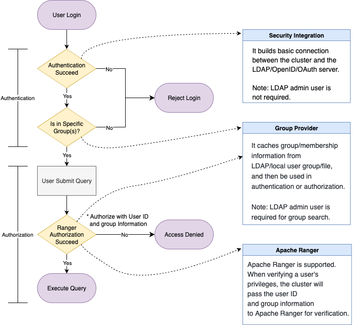

# 认证与授权

本文旨在为开发您自己的身份验证和授权工作流提供一个连贯的最佳实践指南。

有关以下涉及的各个操作的详细说明，请参阅[另请参阅](#另请参阅)中的链接。

## 真实企业场景

大型企业通常具有复杂的组织结构和大量使用各种平台和工具的员工。从 IT 治理的角度来看，拥有统一的身份、身份验证和授权系统带来了显著的优势：

- **简化的用户管理**：管理员不再需要在多个系统中手动创建或删除用户并分配权限。用户生命周期管理（例如，入职/离职）变得无缝且易于审计。
- **提高的安全性**：单点登录（Single Sign-on, SSO）机制消除了用户管理多个凭据的需求，减少了攻击面。
- **角色对齐的访问控制**：访问权限通常与用户的角色或部门相关联。结构良好的身份系统可以更轻松、更准确地进行授权决策。

### 示例

假设有三名新员工加入一家 SaaS 公司的不同部门：一名市场专员和两名解决方案架构师。

- **组织上**，他们属于不同的团队。
- **从身份角度**，他们的电子邮件帐户作为其在内部平台上的登录凭据。
- **按访问权限**，三人分别被授予不同平台的访问权限：
  - 市场专员可以登录 Hubspot 后台查看新线索。
  - 解决方案架构师可以访问服务控制台，并为指定客户管理服务。

尽管三人使用相同的身份提供者，但其访问权限受到严格执行：

  - 市场专员仅能访问 Hubspot。
  - 解决方案架构师可以访问服务控制台，但不能访问未分配给他们的用户的服务，也不能访问 Hubspot。

## 三层访问控制

此示例突出了企业身份和访问流程中的三个关键组件：

1. **身份验证** – “我是彼得，一名经过验证的 SaaS 公司员工。”
2. **访问验证** – “作为解决方案架构师，我被授权登录服务控制台。”（并非所有经过验证的员工都应访问所有服务。）
3. **操作授权** – “作为 SaaS 公司的客户，我可以查看我们自己的服务信息，但不能查看其他客户的。”

### 基于数据库背景

这些访问控制层也适用于数据库系统：

1. **身份验证**：确认用户是有效员工，并拥有自己的密码。
2. **访问验证**：验证用户或其组是否有权限登录特定集群。
3. **操作授权**：检查用户是否可以运行查询、导入数据等。

如您所见，身份验证和授权在实践中是紧密结合的。用户的身份验证请求通常意味着更广泛的访问控制要求。因此，了解完整的访问流程至关重要。

## 关键概念

### LDAP

轻量级目录访问协议（Lightweight Directory Access Protocol，LDAP）是一种用于访问和维护分布式目录信息的协议。您可以将其视为组织的全局地址簿：

- 每个用户都有一个唯一的路径（专有名称，DN）。
- LDAP 存储基本的用户信息，包括密码。
- LDAP 还管理组结构和成员关系。
- `ldapsearch` 查询可以检索用户或组。

LDAP 可以用作：

- **身份验证**来源（验证用户名和密码）。
- 用于访问控制的**组信息**提供者。

### UNIX Groups

出于安全或隔离的原因，有时用户会在本地（主机操作系统上）镜像 LDAP 组，以避免与外部 LDAP 服务器直接通信。这些本地 UNIX 组可用于身份验证或访问控制执行。

### OAuth、OIDC 和 JWT

:::tip

**术语解释**

- **ID Token**: 身份证明（我是我。）
- **Access Token**: 访问某些资源的权限证明（我可以做某些事情。）
- **OAuth 2.0**: 提供访问令牌的授权框架。
- **OIDC**: OAuth 之上的身份验证层。提供 ID 和访问令牌。
- **JWT**: 令牌格式。同时被 OAuth 和 OIDC 使用。

:::

**实际应用：**

- **基于 OAuth 的登录**：重定向到外部登录页面（例如，Google），然后返回集群。需要提前设置浏览器访问和重定向 URL。
- **基于 JWT 的登录**：用户直接将令牌传递给集群，这需要提前设置公钥或端点。

## 功能

系统支持所有三层访问控制：

1. **用户身份验证** – “我就是我所说的那个人。”
2. **登录授权** – “我被允许访问此集群。”（这取决于个人或组成员身份。）
3. **操作授权** – “我可以运行此查询或导入此数据集。”（授权可以基于身份或组关系。）

从 v3.5 开始，StarRocks 提供了一个模块化、可组合的模型，以支持各种身份和访问管理组件的结合。

*功能映射*


从功能的角度来看：

1. **身份验证提供者** – 支持的协议：本地用户、LDAP、OIDC 和 OAuth 2.0。
2. **Group Provider** – 支持的来源：LDAP、操作系统和基于文件的配置。
3. **授权系统** – 支持的系统：内置 RBAC & IBAC 和 Apache Ranger。

### 身份验证

支持的身份验证模式比较：

| 方法       | CREATE USER（本地用户）                                                                                                        | CREATE SECURITY INTEGRATION（基于会话的虚拟用户）                                                               |
| -------- | ------------------------------------------------------------------------------------------------------------------------ | ---------------------------------------------------------------------------------------------------- |
| 描述       | 在集群中手动创建用户，可与外部认证系统关联。该用户在集群中以显式方式存在。                                                                                    | 定义一个外部认证集成。集群本身不保存任何用户信息。可选地结合 Group Provider（用户组提供者）使用，用于定义允许访问的用户组。                                |
| 登录过程     | 用户必须事先在集群中创建。在登录时，StarRocks 会通过自身或配置的外部认证系统（如 LDAP、JWT）对用户进行认证。只有预先创建的用户才能登录。                                            | 用户登录时，StarRocks 通过外部身份认证系统验证用户身份。若验证成功，系统会在内部创建一个临时的、会话级别的“虚拟用户”，该用户在会话结束后即被销毁。                      |
| 授权过程     | 因为用户在集群中是持久存在的，所以可以提前通过本地授权系统或 Apache Ranger 为其分配权限。                                                                     | 虽然用户不会在集群中持久化，但可以预先定义角色与用户组之间的映射关系。用户登录后，系统会根据其所属用户组自动分配角色，从而实现基于角色的访问控制（RBAC）。Apache Ranger 也可同时使用。 |
| 优缺点及适用场景 | <ul><li>**优点**：灵活性高——同时支持本地和外部授权系统。</li><li>**缺点**：需要手动创建用户，维护成本较高。</li><li>**适用场景**：适用于用户规模较小或由集群自身管理访问控制的场景。</li></ul> | <ul><li>**优点**：配置简便，仅需设置外部认证和允许访问的用户组。</li><li>**适用场景**：适用于用户规模较大、采用角色-组映射管理权限的场景。</li></ul>         |

这些身份验证模式可以共存。当用户尝试登录时：

1. 集群首先检查用户是否为本地用户，并尝试相应地进行身份验证。
2. 如果未找到用户，集群将按照配置中定义的 `authentication_chain` 继续进行。

这种混合模式提供了灵活性和控制力，适合不同的组织需求。

#### 选项一：使用外部身份验证系统创建本地用户

例如，您可以使用以下语法创建一个使用 OAuth2.0 认证的本地用户：

```SQL
CREATE USER <username> IDENTIFIED WITH authentication_oauth2 AS 
'{
  "auth_server_url": "<auth_server_url>",
  "token_server_url": "<token_server_url>",
  "client_id": "<client_id>",
  "client_secret": "<client_secret>",
  "redirect_url": "<redirect_url>",
  "jwks_url": "<jwks_url>",
  "principal_field": "<principal_field>",
  "required_issuer": "<required_issuer>",
  "required_audience": "<required_audience>"
}';
```

然后，您可以使用 `GRANT` 语句授予权限或角色给用户，或将授权委托给外部系统，如 Apache Ranger。

#### 选项二：使用与外部身份验证系统的安全集成

您还可以创建一个安全集成，以允许外部身份验证服务访问集群。

```SQL
CREATE SECURITY INTEGRATION <security_integration_name> 
PROPERTIES (
    "type" = "oauth2",
    "auth_server_url" = "",
    "token_server_url" = "",
    "client_id" = "",
    "client_secret" = "",
    "redirect_url" = "",
    "jwks_url" = "",
    "principal_field" = "",
    "required_issuer" = "",
    "required_audience" = ""
    "comment" = ""
);
```

之后，您需要配置 FE 参数 `authentication_chain` 并为您的集群启用安全集成。

```SQL
ADMIN SET FRONTEND CONFIG (
    "authentication_chain" = "<security_integration_name>[... ,]"
);
```

### Group Provider（可选但推荐）

集群中的组信息与身份验证和授权系统**解耦**。它作为一个共享层，可以独立配置，然后在登录控制和访问控制中使用。

#### 组的使用方式

- **身份验证阶段**

  当与安全集成一起使用时，组成员身份可以定义允许登录的范围。只有通过身份验证并属于指定组的用户才被允许访问集群。

- **授权阶段**

  在授权过程中，组成员身份会自动被考虑。如果权限被授予某个组，组内的所有用户将在访问检查中继承这些权限。

#### 配置注意事项

- 配置 Group Provider 时，您应指定：
  - 用于定义**谁可以登录**的组（登录范围）
  - 用于定义**谁可以访问特定资源**的组（授权）
- **重要**：Group Provider 返回的用户身份（例如，用户名或 ID）**必须匹配**在身份验证和授权期间使用的身份。不一致的标识符将导致权限或登录失败。

#### 示例

以下示例基于 LDAP。

1. 创建一个 Group Provider。

   ```SQL
   -- LDAP Group Provider
   CREATE GROUP PROVIDER <group_provider_name> 
   PROPERTIES (
       "type" = "ldap",
       ldap_info,
       ldap_search_group_arg,
       ldap_search_attr,
       [ldap_cache_attr]
   )
   
   ldap_info ::=
       "ldap_conn_url" = "",
       "ldap_bind_root_dn" = "",
       "ldap_bind_root_pwd" = "",
       "ldap_bind_base_dn" = "",
       ["ldap_conn_timeout" = "",]
       ["ldap_conn_read_timeout" = ""]
   
   ldap_search_group_arg ::= 
       { "ldap_group_dn" = "" 
       | "ldap_group_filter" = "" }, 
       "ldap_group_identifier_attr" = ""
   
   ldap_search_user_arg ::=
       "ldap_group_member_attr" = "",
       "ldap_user_search_attr" = ""
   
   ldap_cache_arg ::= 
       "ldap_cache_refresh_interval" = ""
   ```

2. 将 Group Provider 与安全集成结合。

   ```SQL
   ALTER SECURITY INTEGRATION <security_integration_name> SET
   (
       "group_provider" = "",
       "permitted_groups" = ""
   )
   ```

3. 将 Group Provider 与授权系统结合。您可以使用内置授权系统或 Apache Ranger。

   - 内置授权：

     角色可分配给用户组。登录时，系统会根据组成员身份自动为用户分配角色。

     ```sql
     GRANT role TO EXTERNAL GROUP <group_name>
     ```

   - Apache Ranger：

     用户登录后，StarRocks 将组信息传递至 Ranger 进行策略评估。

### 授权

StarRocks支持**内部和外部授权机制**，可以独立使用或结合使用：

- **内部授权**

  StarRocks 提供了内置的 **RBAC（基于角色的访问控制）**和 **IBAC（基于身份的访问控制）**系统。

  - **RBAC**：为用户或组分配角色，并为这些角色授予权限。
  - **IBAC**：直接向用户授予权限。

- **外部授权**

  StarRocks 与 **Apache Ranger** 集成，以支持集中和统一的授权管理。

Apache Ranger 可以作为一个完整的解决方案本身使用，也可以与 StarRocks 的本地授权系统一起使用。

- **完全 Ranger 授权** 内部表和外部表（例如 Hive）通过 Ranger 授权。
  - 内部表权限使用 StarRocks Ranger 插件。
  - 外部表权限可以通过 StarRocks Ranger 插件或其他外部服务插件（例如 Hive 插件）管理。
- **混合授权**
  - **内部表**：由 StarRocks 的内置系统（RBAC/IBAC）授权。
  - **外部表**：通过 Ranger 授权。外部表权限仍然可以使用 StarRocks 插件或通过适当的外部服务（例如 Hive 或 HDFS）进行管理。

这种灵活性允许组织逐步迁移到集中授权或维护适合其当前基础设施和安全策略的混合模型。

## 组合解决方案

您可以根据完成身份验证和授权工作流来选择解决方案。

### 解决方案一：外部身份验证 + 外部授权

您可以充分利用外部身份验证和授权系统来控制集群的登录和访问权限。整体流程如下：

1. 使用**安全集成**与外部身份验证系统建立连接。
2. 在 **Group Provider** 中配置身份验证和授权所需的组信息。
3. 在**安全集成**中定义允许登录集群的组。属于这些组的用户将被授予登录权限。
4. 在 **Apache Ranger** 中创建一个 **StarRocks Service**，以管理内部和外部表的访问控制。对于外部表，您还可以重用现有服务进行授权。
5. 当用户提交查询时，系统将用户的身份及其组成员关系（如在 Group Provider 中配置）发送给 Ranger 进行授权。
6. 如果授权检查通过，系统将继续执行查询。

:::note

您必须确保在整个过程中，用户 ID 和组名在所有集成系统中保持一致。

:::



### 解决方案二：外部身份验证（本地用户） + 内部授权

如果您希望使用**内置授权系统**，同时仍依赖**外部身份验证**，可以遵循以下方法：

1. **手动创建用户**并为每个用户指定外部身份验证方法。
2. 用户创建后，使用标准的 `GRANT` 语句分配角色或权限。
3. 一旦身份验证通过，用户将根据集群的本地权限系统进行授权。

:::tip

虽然手动创建的用户仍然可以与 **Group Provider** 和 **Ranger** 集成，但与使用**安全集成**相比，这种方法更复杂且自动化程度较低。因此，**这不是推荐的最佳实践**。

:::

### 方案三：外部认证（外部身份）+ 内部授权

若您希望在使用 **StarRocks 内置授权系统**的同时仍依赖**外部认证**，可采用以下方法：

1. 使用**安全集成**与外部身份验证系统建立连接。
2. 在 **Group Provider** 中配置身份验证和授权所需的组信息。
3. 在**安全集成**中定义允许登录集群的组。属于这些组的用户将被授予登录权限。
4. 在 StarRocks 中**创建必要角色**并**授予外部组**。
5. 用户登录时需同时通过身份验证且属于授权组。登录成功后，StarRocks 将根据组成员身份自动分配相应角色。
6. 查询执行期间，StarRocks 将如常执行**基于内部 RBAC 的授权**。
7. 此外可将 **Ranger** 与本方案结合使用，例如，采用 **StarRocks 原生 RBAC** 进行内部表授权，同时使用 **Ranger** 管理外部表授权。通过 Ranger 执行授权时，StarRocks 仍会将**用户 ID 及对应组信息**传递至 Ranger 进行访问控制。


## 另请参阅

- **认证**
  - [Native Authentication](../administration/user_privs/authentication/native_authentication.md)
  - [Security Integration](../administration/user_privs/authentication/security_integration.md)
  - [LDAP Authentication](../administration/user_privs/authentication/ldap_authentication.md)
  - [OAuth 2.0 Authentication](../administration/user_privs/authentication/oauth2_authentication.md)
  - [JSON Web Token Authentication](../administration/user_privs/authentication/jwt_authentication.md)
- [**Group Provider**](../administration/user_privs/group_provider.md)
- **授权**
  - [Native Authorization](../administration/user_privs/authorization/User_privilege.md)
  - [Apache Ranger Plugin](../administration/user_privs/authorization/ranger_plugin.md)
