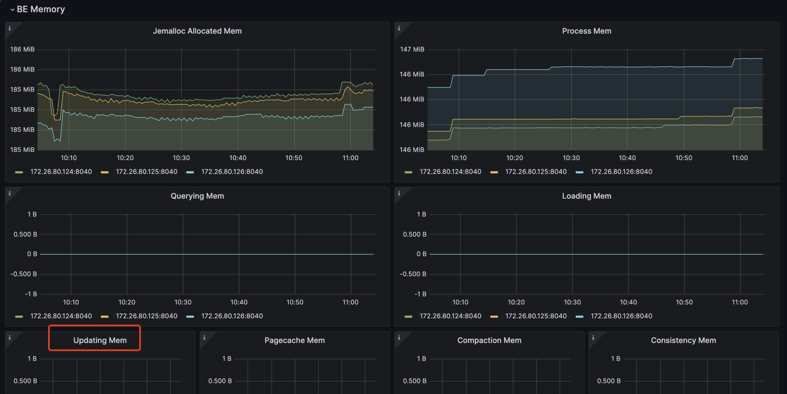

# 主键表

主键表使用了StarRocks设计的新存储引擎。其主要优势在于支持实时数据更新，同时确保复杂即席查询的高效性能。在实时业务分析中，决策可以从主键表中受益，因为它使用最新的数据进行实时分析，从而减轻数据分析中的数据延迟。
然而，主键并不是免费的午餐。如果使用不当，可能导致不必要的资源浪费。

因此，在本节中，我们将指导您如何更有效地使用主键模型以达到预期效果。

## 选择主键索引

主索引是主键表中最关键的组件。主键索引用于存储主键值与由主键值标识的数据行位置之间的映射。

目前，我们支持三种类型的主键索引：
1. 全内存主键索引。
```sql
PROPERTIES (
    "enable_persistent_index" = "false"
);
```
2. 基于本地磁盘的持久化主键索引。
```sql
PROPERTIES (
    "enable_persistent_index" = "true",
    "persistent_index_type" = "LOCAL"
);
```
3. 云原生持久化主键索引。
```sql
PROPERTIES (
    "enable_persistent_index" = "true",
    "persistent_index_type" = "CLOUD_NATIVE"
);
```

我们不推荐使用内存索引，因为它可能导致显著的内存资源浪费。

如果您使用的是存算分离（弹性）StarRocks集群，我们建议选择云原生持久化主键索引。与基于本地磁盘的持久化主键索引不同，它将完整的索引数据存储在远程对象存储中，本地磁盘仅作为缓存。与基于本地磁盘的持久化主键索引相比，其优势包括：
1. 不依赖于本地磁盘容量。
2. 数据分片重新平衡后无需重建索引。

## 选择主键

主键通常不帮助加速查询。您可以使用 `ORDER BY` 子句指定与主键不同的列作为排序键以加速查询。因此，在选择主键时，您只需考虑在数据导入和更新过程中的唯一性。

主键越大，消耗的内存、I/O和其他资源就越多。因此，通常建议避免选择过多或过大的列作为主键。主键的默认最大大小为128字节，由 `be.conf` 中的 `primary_key_limit_size` 参数控制。

您可以增加 `primary_key_limit_size` 来选择更大的主键，但请注意，这将导致更高的资源消耗。

持久化索引将占用多少存储和内存空间？

### 存储空间成本公式

`(key size + 8 bytes) * row count * 50% `

:::note
50% 是估计的压缩效率，实际压缩效果取决于数据本身。
:::

### 内存成本公式

`min(l0_max_mem_usage * tablet cnt, update_memory_limit_percent * BE process memory);`

## 内存使用

主键表使用的内存可以通过 mem_tracker 监控：

```
//查看整体内存统计
http://be_ip:be_http_port/mem_tracker

// 查看主键表内存统计
http://be_ip:be_http_port/mem_tracker?type=update

// 查看主键表内存统计的更多细节
http://be_ip:be_http_port/mem_tracker?type=update&upper_level=4
```

`mem_tracker` 中的 `update` 项记录了主键表使用的全部内存，例如主键索引、Delete Vector 等。
您还可以通过指标监控服务监控此 `update` 项。例如，在 Grafana 中，您可以通过（红框中的项目）查看更新项：

   

> 更多关于使用 Prometheus 和 Grafana 的监控和告警信息： https://docs.starrocks.io/docs/administration/management/monitoring/Monitor_and_Alert/

如果您对内存使用敏感，并希望在主键表的导入过程中减少内存消耗，可以通过以下配置实现：

```
be.conf

l0_max_mem_usage = (一些小于 104857600 的值，默认是 104857600)
skip_pk_preload = true

// 存算一体集群
transaction_apply_worker_count = (一些小于 CPU 核心数的值，默认是 CPU 核心数)

// 存算分离集群
transaction_publish_version_worker_count = (一些小于 CPU 核心数的值，默认是 CPU 核心数)
```

`l0_max_mem_usage` 控制每个 tablet 的持久化主键索引的最大内存使用量。`transaction_apply_worker_count` 和 `transaction_publish_version_worker_count` 都控制用于处理主键表中的 upsert 和 delete 的最大线程数。

但需要记住，减少 `l0_max_mem_usage` 可能会增加 I/O 压力，而减少 `transaction_apply_worker_count` 或 `transaction_publish_version_worker_count` 可能会减慢数据摄取速度。

## 在 Compaction 资源、数据新鲜度和查询延迟之间的权衡

与其他模型中的表相比，主键表在数据导入、更新和删除期间需要额外的操作来进行主键索引查找和 Delete Vector 生成，这会引入额外的资源开销。
因此，您需要在以下三个因素之间进行权衡：
- Compaction 资源限制。
- 数据新鲜度
- 查询延迟

#### 数据新鲜度 & 查询延迟

如果您希望获得更好的数据新鲜度和更好的查询延迟，这意味着您将引入高频写入，并且还希望确保它们能够尽快进行 Compaction。
那么您将需要更多的 Compaction 资源来处理这些写入：
```
// 存算分离
be.conf
compact_threads = 4

// 存算一体
be.conf
update_compaction_num_threads_per_disk = 1
update_compaction_per_tablet_min_interval_seconds = 120
```

您可以增加 `compact_threads` 和 `update_compaction_num_threads_per_disk`，或减少 `update_compaction_per_tablet_min_interval_seconds` 来引入更多的 Compaction 资源以处理高频写入。

如何知道当前的 Compaction 资源和设置是否能够处理当前的高频写入？您可以通过以下方式观察：

1. 对于存算分离集群，如果 Compaction 无法跟上摄取速度，可能会导致摄取减速甚至写入失败错误和摄取停止。
  a. 摄取减速。
  您可以使用 `show proc /transactions/{db_name}/running';` 来检查当前正在运行的事务，如果有任何减速消息，如：
```
Partition's compaction score is larger than 100.0, delay commit for xxxms. You can try to increase compaction concurrency
```
  出现在 ErrMsg 字段中，这意味着发生了摄取减速。
  例如：
```sql
mysql> show proc '/transactions/test_pri_load_c/running';
+---------------+----------------------------------------------+------------------+-------------------+--------------------+---------------------+------------+-------------+------------+----------------------------------------------------------------------------------------------------------------------------+--------------------+------------+-----------+--------+
| TransactionId | Label                                        | Coordinator      | TransactionStatus | LoadJobSourceType  | PrepareTime         | CommitTime | PublishTime | FinishTime | Reason                                                                                                                     | ErrorReplicasCount | ListenerId | TimeoutMs | ErrMsg |
+---------------+----------------------------------------------+------------------+-------------------+--------------------+---------------------+------------+-------------+------------+----------------------------------------------------------------------------------------------------------------------------+--------------------+------------+-----------+--------+
| 1034          | stream_load_d2753fbaa0b343acadd5f13de92d44c1 | FE: 172.26.94.39 | PREPARE           | FRONTEND_STREAMING | 2024-10-24 13:05:01 | NULL       | NULL        | NULL       | Partition's compaction score is larger than 100.0, delay commit for 6513ms. You can try to increase compaction concurrency, | 0                  | 11054      | 86400000  |        |
+---------------+----------------------------------------------+------------------+-------------------+--------------------+---------------------+------------+-------------+------------+----------------------------------------------------------------------------------------------------------------------------+--------------------+------------+-----------+--------+
```
  b. 摄取停止。
   如果有摄取错误，如：
```
Failed to load data into partition xxx, because of too large compaction score, current/limit: xxx/xxx. You can reduce the loading job concurrency, or increase compaction concurrency 
```
  这意味着由于 Compaction 无法跟上当前的高频写入，摄取停止。

2. 对于存算一体集群，没有摄取减速策略，如果 Compaction 无法跟上当前的高频写入，摄取将失败并返回错误消息：
```
Failed to load data into tablet xxx, because of too many versions, current/limit: xxx/xxx. You can reduce the loading job concurrency, or increase loading data batch size. If you are loading data with Routine Load, you can increase FE configs routine_load_task_consume_second and max_routine_load_batch_size.
```

#### 数据新鲜度 & Compaction 资源限制
如果您有有限的 Compaction 资源但仍需要保持足够的数据新鲜度，这意味着您需要牺牲一些查询延迟。

您可以进行以下配置更改以实现这一目标：
- 存算分离集群
```
fe.conf

lake_ingest_slowdown_threshold = xxx (默认是 100，您可以增加它)
lake_compaction_score_upper_bound = xxx (默认是 2000，您可以增加它)
```

`lake_ingest_slowdown_threshold` 参数控制触发摄取减速的阈值。当分区的 Compaction 分数超过此阈值时，系统将开始减慢数据摄取速度。类似地，`lake_compaction_score_upper_bound` 确定触发摄取停止的阈值。

- 存算一体集群
```
be.conf

tablet_max_versions = xxx (默认是 1000，您可以增加它)
```

`tablet_max_versions` 确定触发摄取停止的阈值。

通过增加这些配置，系统可以容纳更多的小数据文件并减少 Compaction 频率，但这也会影响查询延迟。

#### 查询延迟 & Compaction 资源限制
如果您希望在有限的 Compaction 资源下实现良好的查询延迟，您需要减少写入频率并创建更大的数据批次进行摄取。

有关具体实现，请参考不同摄取方法的章节，其中详细介绍了如何减少摄取频率和增加批次大小。