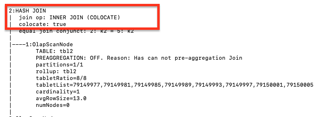

# 查询提示

查询提示是指示或注释，用于明确建议查询优化器如何执行查询。目前，StarRocks 支持三种类型的提示：系统变量提示 (`SET_VAR`)、用户自定义变量提示 (`SET_USER_VARIABLE`) 和 Join 提示。提示仅在单个查询中生效。

## 系统变量提示

您可以在 SELECT 和 SUBMIT TASK 语句中使用 `SET_VAR` 提示来设置一个或多个[系统变量](../../sql-reference/System_variable.md)，然后执行这些语句。您还可以在其他语句中包含的 SELECT 子句中使用 `SET_VAR` 提示，例如 CREATE MATERIALIZED VIEW AS SELECT 和 CREATE VIEW AS SELECT。请注意，如果在 CTE 的 SELECT 子句中使用 `SET_VAR` 提示，即使语句成功执行，`SET_VAR` 提示也不会生效。

与[系统变量的一般用法](../../sql-reference/System_variable.md)相比，`SET_VAR` 提示在语句级别生效，不会影响整个会话。

### 语法

```SQL
[...] SELECT /*+ SET_VAR(key=value [, key = value]) */ ...
SUBMIT [/*+ SET_VAR(key=value [, key = value]) */] TASK ...
```

### 示例

要为聚合查询指定聚合模式，可以在聚合查询中使用 `SET_VAR` 提示设置系统变量 `streaming_preaggregation_mode` 和 `new_planner_agg_stage`。

```SQL
SELECT /*+ SET_VAR (streaming_preaggregation_mode = 'force_streaming',new_planner_agg_stage = '2') */ SUM(sales_amount) AS total_sales_amount FROM sales_orders;
```

要为 SUBMIT TASK 语句指定执行超时，可以在 SUBMIT TASK 语句中使用 `SET_VAR` 提示设置系统变量 `insert_timeout`。

```SQL
SUBMIT /*+ SET_VAR(insert_timeout=3) */ TASK AS CREATE TABLE temp AS SELECT count(*) AS cnt FROM tbl1;
```

要为创建物化视图指定子查询执行超时，可以在 SELECT 子句中使用 `SET_VAR` 提示设置系统变量 `query_timeout`。

```SQL
CREATE MATERIALIZED VIEW mv 
PARTITION BY dt 
DISTRIBUTED BY HASH(`key`) 
BUCKETS 10 
REFRESH ASYNC 
AS SELECT /*+ SET_VAR(query_timeout=500) */ * from dual;
```

## 用户自定义变量提示

您可以在 SELECT 语句或 INSERT 语句中使用 `SET_USER_VARIABLE` 提示来设置一个或多个[用户自定义变量](../../sql-reference/user_defined_variables.md)。如果其他语句包含 SELECT 子句，您也可以在该 SELECT 子句中使用 `SET_USER_VARIABLE` 提示。其他语句可以是 SELECT 语句和 INSERT 语句，但不能是 CREATE MATERIALIZED VIEW AS SELECT 语句和 CREATE VIEW AS SELECT 语句。请注意，如果在 CTE 的 SELECT 子句中使用 `SET_USER_VARIABLE` 提示，即使语句成功执行，`SET_USER_VARIABLE` 提示也不会生效。从 v3.2.4 开始，StarRocks 支持用户自定义变量提示。

与[用户自定义变量的一般用法](../../sql-reference/user_defined_variables.md)相比，`SET_USER_VARIABLE` 提示在语句级别生效，不会影响整个会话。

### 语法

```SQL
[...] SELECT /*+ SET_USER_VARIABLE(@var_name = expr [, @var_name = expr]) */ ...
INSERT /*+ SET_USER_VARIABLE(@var_name = expr [, @var_name = expr]) */ ...
```

### 示例

以下 SELECT 语句引用了标量子查询 `select max(age) from users` 和 `select min(name) from users`，因此您可以使用 `SET_USER_VARIABLE` 提示将这两个标量子查询设置为用户自定义变量，然后运行查询。

```SQL
SELECT /*+ SET_USER_VARIABLE (@a = (select max(age) from users), @b = (select min(name) from users)) */ * FROM sales_orders where sales_orders.age = @a and sales_orders.name = @b;
```

## Join 提示

对于多表 Join 查询，优化器通常会选择最佳的 Join 执行方法。在特殊情况下，您可以使用 Join 提示明确建议优化器使用的 Join 执行方法或禁用 Join Reorder。目前，Join 提示支持建议 Shuffle Join、Broadcast Join、Bucket Shuffle Join 或 Colocate Join 作为 Join 执行方法。当使用 Join 提示时，优化器不会执行 Join Reorder。因此，您需要选择较小的表作为右表。此外，当建议使用 [Colocate Join](../../using_starrocks/Colocate_join.md) 或 Bucket Shuffle Join 作为 Join 执行方法时，请确保连接表的数据分布符合这些 Join 执行方法的要求。否则，建议的 Join 执行方法无法生效。

### 语法

```SQL
... JOIN { [BROADCAST] | [SHUFFLE] | [BUCKET] | [COLOCATE] | [UNREORDER]} ...
```

:::note
Join 提示不区分大小写。
:::

### 示例

- Shuffle Join

  如果需要在执行 Join 操作之前将具有相同分桶键值的数据行从表 A 和表 B 洗牌到同一台机器上，可以将 Join 执行方法提示为 Shuffle Join。

  ```SQL
  select k1 from t1 join [SHUFFLE] t2 on t1.k1 = t2.k2 group by t2.k2;
  ```

- Broadcast Join
  
  如果表 A 是一个大表，表 B 是一个小表，可以将 Join 执行方法提示为 Broadcast Join。表 B 的数据完全广播到表 A 所在的机器上，然后执行 Join 操作。与 Shuffle Join 相比，Broadcast Join 节省了洗牌表 A 数据的成本。

  ```SQL
  select k1 from t1 join [BROADCAST] t2 on t1.k1 = t2.k2 group by t2.k2;
  ```

- Bucket Shuffle Join
  
  如果 Join 查询中的等值连接表达式包含表 A 的分桶键，尤其是当表 A 和表 B 都是大表时，可以将 Join 执行方法提示为 Bucket Shuffle Join。表 B 的数据根据表 A 的数据分布洗牌到表 A 所在的机器上，然后执行 Join 操作。与 Broadcast Join 相比，Bucket Shuffle Join 显著减少了数据传输，因为表 B 的数据只需全局洗牌一次。参与 Bucket Shuffle Join 的表必须是非分区的或同置的。

  ```SQL
  select k1 from t1 join [BUCKET] t2 on t1.k1 = t2.k2 group by t2.k2;
  ```

- Colocate Join
  
  如果表 A 和表 B 属于在创建表时指定的同一 Colocation Group，具有相同分桶键值的数据行从表 A 和表 B 分布在同一 BE 节点上。当 Join 查询中的等值连接表达式包含表 A 和表 B 的分桶键时，可以将 Join 执行方法提示为 Colocate Join。具有相同键值的数据直接在本地连接，减少了节点之间的数据传输时间，提高了查询性能。

  ```SQL
  select k1 from t1 join [COLOCATE] t2 on t1.k1 = t2.k2 group by t2.k2;
  ```

### 查看 Join 执行方法

使用 `EXPLAIN` 命令查看实际的 Join 执行方法。如果返回的结果显示 Join 执行方法与 Join 提示匹配，则表示 Join 提示有效。

```SQL
EXPLAIN select k1 from t1 join [COLOCATE] t2 on t1.k1 = t2.k2 group by t2.k2;
```

