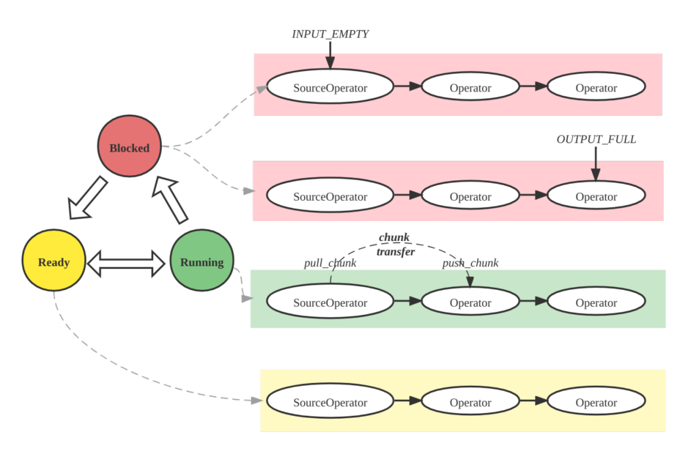

# 查询计划

优化查询性能是分析系统中的一个常见挑战。慢查询会影响用户体验和整个集群的性能。在StarRocks中，理解和解释查询计划和查询分析是诊断和改进慢查询的基础。这些工具可以帮助你：
- 识别瓶颈和昂贵的操作
- 发现次优的连接策略或缺失的索引
- 理解数据是如何被过滤、聚合和移动的
- 排查和优化资源使用

**查询计划** 是由StarRocks FE生成的详细路线图，描述了你的SQL语句将如何执行。它将查询分解为一系列操作，如扫描、连接、聚合和排序，并确定执行这些操作的最有效方式。

StarRocks提供了几种查看查询计划的方法：

1. **EXPLAIN 语句**:  
   使用 `EXPLAIN` 显示查询的逻辑或物理执行计划。你可以添加选项来控制输出：
   - `EXPLAIN LOGICAL <query>`: 显示简化的计划。
   - `EXPLAIN <query>`: 显示基本的物理计划。
   - `EXPLAIN VERBOSE <query>`: 显示带有详细信息的物理计划。
   - `EXPLAIN COSTS <query>`: 包含每个操作的估计成本，用于诊断统计问题。

2. **EXPLAIN ANALYZE**:  
   使用 `EXPLAIN ANALYZE <query>` 执行查询并显示实际执行计划以及真实的运行时统计信息。详情请参阅 [Explain Analyze](./query_profile_text_based_analysis.md) 文档。

   示例：
   ```sql
   EXPLAIN ANALYZE SELECT * FROM sales_orders WHERE amount > 1000;
   ```

3. **Query Profile**:  
   在运行查询后，你可以查看其详细的执行分析，包括时间、资源使用和操作级别的统计信息。请参阅 [Query Profile](./query_profile_overview.md) 文档，了解如何访问和解释这些信息。
   - **SQL命令**: `SHOW PROFILELIST` 和 `ANALYZE PROFILE FOR <query_id>`: 可用于检索特定查询的执行分析。
   - **FE HTTP 服务**: 通过StarRocks FE的Web UI访问查询分析，导航到 **Query** 或 **Profile** 部分，在那里你可以搜索和检查查询执行细节。
   - **托管版本**: 在云或托管部署中，使用提供的Web控制台或监控仪表板查看查询计划和分析，通常具有增强的可视化和过滤选项。

通常，查询计划用于诊断与查询计划和优化相关的问题，而查询分析有助于识别查询执行期间的性能问题。在接下来的部分中，我们将探讨查询执行的关键概念，并通过一个具体的示例来分析查询计划。

## 查询执行流程

在StarRocks中，查询的生命周期由三个主要阶段组成：
1. **规划**: 查询经过解析、分析和优化，最终生成查询计划。
2. **调度**: 调度器和协调器将计划分发给所有参与的后端节点。
3. **执行**: 使用管道执行引擎执行计划。


**计划结构**

StarRocks计划是分层的：
- **Fragment**: 顶层工作片段；每个Fragment在不同的后端节点上生成多个 **FragmentInstances**。
- **Pipeline**: 在一个实例中，管道将操作符串联在一起；多个 **PipelineDrivers** 在不同的CPU核心上并发运行相同的管道。
- **Operator**: 原子步骤——扫描、连接、聚合——实际处理数据。


**管道执行引擎**

管道引擎以并行和高效的方式执行查询计划，处理复杂的计划和大数据量，以实现高性能和可扩展性。



**指标合并策略**

默认情况下，StarRocks合并FragmentInstance和PipelineDriver层以减少分析体积，形成简化的三层结构：
- Fragment
- Pipeline
- Operator

你可以通过会话变量 `pipeline_profile_level` 控制这种合并行为。

## 示例

### 如何阅读查询计划和分析

1. **理解结构**: 查询计划分为多个片段，每个片段代表一个执行阶段。从下往上阅读：首先是扫描节点，然后是连接、聚合，最后是结果。

2. **整体分析**:
   - 检查总运行时间、内存使用和CPU/墙时间比率。
   - 通过按操作符时间排序找到慢操作符。
   - 确保过滤器尽可能下推。
   - 查找数据倾斜（不均匀的操作符时间或行数）。
   - 监控高内存或磁盘溢出；如有必要，调整连接顺序或使用汇总视图。
   - 根据需要使用物化视图和查询提示（`BROADCAST`、`SHUFFLE`、`COLOCATE`）进行优化。

2. **扫描操作**: 查找 `OlapScanNode` 或类似节点。注意扫描了哪些表，应用了哪些过滤器，以及是否使用了预聚合或物化视图。

3. **连接操作**: 确定连接类型（`HASH JOIN`、`BROADCAST`、`SHUFFLE`、`COLOCATE`、`BUCKET SHUFFLE`）。连接方法影响性能：
   - **Broadcast**: 小表发送到所有节点；适用于小表。
   - **Shuffle**: 行被分区和洗牌；适用于大表。
   - **Colocate**: 表按相同方式分区；支持本地连接。
   - **Bucket Shuffle**: 仅一个表被洗牌以减少网络成本。

4. **聚合和排序**: 查找 `AGGREGATE`、`TOP-N` 或 `ORDER BY`。这些操作在数据量大或高基数时可能开销较大。

5. **数据移动**: `EXCHANGE` 节点显示片段或节点之间的数据传输。过多的数据移动会影响性能。

6. **谓词下推**: 早期应用的过滤器（在扫描时）减少下游数据。检查 `PREDICATES` 或 `PushdownPredicates` 以查看哪些过滤器被下推。

### 示例查询计划

:::tip
这是 TPC-DS 基准测试中的第 96 个查询。
:::

```sql
EXPLAIN select  count(*)
from store_sales
    ,household_demographics
    ,time_dim
    , store
where ss_sold_time_sk = time_dim.t_time_sk
    and ss_hdemo_sk = household_demographics.hd_demo_sk
    and ss_store_sk = s_store_sk
    and time_dim.t_hour = 8
    and time_dim.t_minute >= 30
    and household_demographics.hd_dep_count = 5
    and store.s_store_name = 'ese'
order by count(*) limit 100;
```

输出是一个分层计划，显示StarRocks将如何执行查询，分为片段和操作符。以下是一个简化的查询计划片段示例：

```
PLAN FRAGMENT 1
  6:HASH JOIN (BROADCAST)
    |-- 4:HASH JOIN (BROADCAST)
    |     |-- 2:HASH JOIN (BROADCAST)
    |     |     |-- 0:OlapScanNode (store_sales)
    |     |     |-- 1:OlapScanNode (time_dim)
    |     |-- 3:OlapScanNode (household_demographics)
    |-- 5:OlapScanNode (store)
```

- **OlapScanNode**: 扫描一个表，可能带有过滤器和预聚合。
- **HASH JOIN (BROADCAST)**: 通过广播较小的表来连接两个表。
- **Fragments**: 每个片段可以在不同的节点上并行执行。

查询96的查询计划分为五个片段，从0到4编号。查询计划可以自下而上逐一阅读。

片段4负责扫描 `time_dim` 表并提前执行相关查询条件（即 `time_dim.t_hour = 8 and time_dim.t_minute >= 30`）。这一步也称为谓词下推。StarRocks决定是否为聚合表启用 `PREAGGREGATION`。在前面的图中，`time_dim` 的预聚合被禁用。在这种情况下，`time_dim` 的所有维度列都被读取，如果表中有很多维度列，可能会对性能产生负面影响。如果 `time_dim` 表选择 `range partition` 进行数据划分，查询计划中将命中几个分区，并自动过滤掉不相关的分区。如果存在物化视图，StarRocks将根据查询自动选择物化视图。如果没有物化视图，查询将自动命中基表（例如，前图中的 `rollup: time_dim`）。

扫描完成后，片段4结束。数据将传递给其他片段，如前图中所示的 EXCHANGE ID : 09，传递到标记为9的接收节点。

对于查询96的查询计划，片段2、3和4具有相似的功能，但它们负责扫描不同的表。具体来说，查询中的 `Order/Aggregation/Join` 操作在片段1中执行。

片段1使用 `BROADCAST` 方法执行 `Order/Aggregation/Join` 操作，即将小表广播到大表。如果两个表都很大，我们建议使用 `SHUFFLE` 方法。目前，StarRocks仅支持 `HASH JOIN`。`colocate` 字段用于显示两个连接的表是以相同方式分区和分桶的，因此可以在本地执行连接操作而无需迁移数据。当连接操作完成后，将执行上层的 `aggregation`、`order by` 和 `top-n` 操作。

通过去除特定表达式（仅保留操作符），查询计划可以以更宏观的视角呈现，如下图所示。


