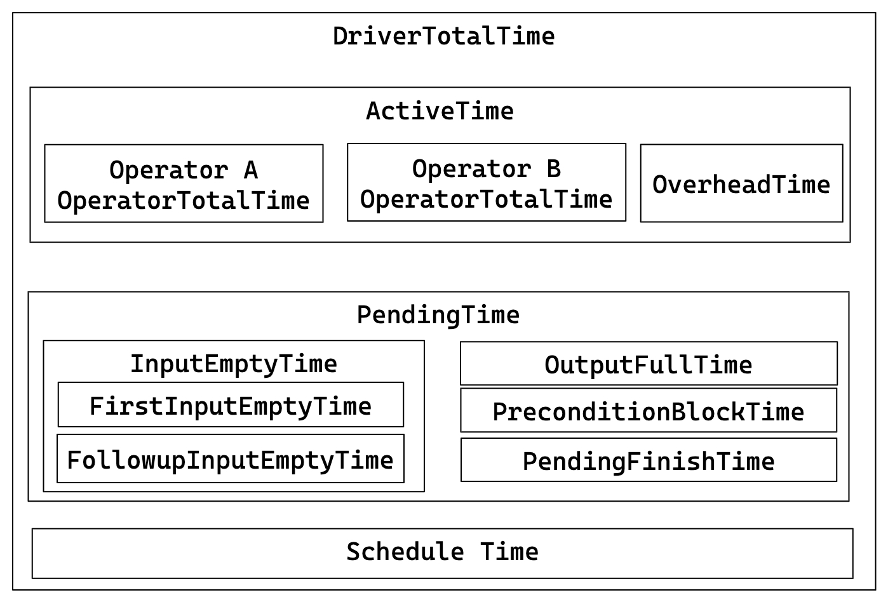

# 查询概要指标

> **StarRocks Query Profile** 发出的原始指标的权威参考，按 operator 分组。  
> 可用作词汇表；如需故障排除指南，请跳转到 **query_profile_tuning_recipes.md**。

### 概要指标

关于查询执行的基本信息：

| 指标 | 描述 |
|--------|-------------|
| Total | 查询消耗的总时间，包括计划、执行和分析阶段的持续时间。 |
| Query State | 查询状态，可能的状态包括 Finished、Error 和 Running。 |
| Query ID | 查询的唯一标识符。 |
| Start Time | 查询开始的时间戳。 |
| End Time | 查询结束的时间戳。 |
| Total | 查询的总持续时间。 |
| Query Type | 查询的类型。 |
| Query State | 查询的当前状态。 |
| StarRocks Version | 使用的 StarRocks 版本。 |
| User | 执行查询的用户。 |
| Default Db | 查询使用的默认数据库。 |
| Sql Statement | 执行的 SQL 语句。 |
| Variables | 查询中使用的重要变量。 |
| NonDefaultSessionVariables | 查询中使用的非默认会话变量。 |
| Collect Profile Time | 收集概要所花费的时间。 |
| IsProfileAsync | 指示概要收集是否为异步。 |

### 计划器指标

提供计划器的全面概述。通常，如果在计划器上花费的总时间少于 10ms，则无需担心。

在某些情况下，计划器可能需要更多时间：
1. 复杂查询可能需要额外的时间进行解析和优化，以确保最佳执行计划。
2. 存在大量物化视图时，可能会增加查询重写所需的时间。
3. 当多个并发查询耗尽系统资源并使用查询队列时，`Pending` 时间可能会延长。
4. 涉及外部表的查询可能会因与外部元数据服务器的通信而增加额外时间。

示例：
```
     - -- Parser[1] 0
     - -- Total[1] 3ms
     -     -- Analyzer[1] 0
     -         -- Lock[1] 0
     -         -- AnalyzeDatabase[1] 0
     -         -- AnalyzeTemporaryTable[1] 0
     -         -- AnalyzeTable[1] 0
     -     -- Transformer[1] 0
     -     -- Optimizer[1] 1ms
     -         -- MVPreprocess[1] 0
     -         -- MVTextRewrite[1] 0
     -         -- RuleBaseOptimize[1] 0
     -         -- CostBaseOptimize[1] 0
     -         -- PhysicalRewrite[1] 0
     -         -- DynamicRewrite[1] 0
     -         -- PlanValidate[1] 0
     -             -- InputDependenciesChecker[1] 0
     -             -- TypeChecker[1] 0
     -             -- CTEUniqueChecker[1] 0
     -             -- ColumnReuseChecker[1] 0
     -     -- ExecPlanBuild[1] 0
     - -- Pending[1] 0
     - -- Prepare[1] 0
     - -- Deploy[1] 2ms
     -     -- DeployLockInternalTime[1] 2ms
     -         -- DeploySerializeConcurrencyTime[2] 0
     -         -- DeployStageByStageTime[6] 0
     -         -- DeployWaitTime[6] 1ms
     -             -- DeployAsyncSendTime[2] 0
     - DeployDataSize: 10916
    Reason:
```

### 执行概览指标

高层次的执行统计：

| 指标 | 描述 | 经验法则 |
|--------|-------------|---------------|
| FrontendProfileMergeTime | FE 端概要处理时间 | < 10ms 正常 |
| QueryAllocatedMemoryUsage | 节点间分配的总内存 | |
| QueryDeallocatedMemoryUsage | 节点间释放的总内存 | |
| QueryPeakMemoryUsagePerNode | 每个节点的最大内存峰值 | < 80% 容量正常 |
| QuerySumMemoryUsage | 节点间的总内存峰值 | |
| QueryExecutionWallTime | 执行的墙钟时间 | |
| QueryCumulativeCpuTime | 节点间的总 CPU 时间 | 与 `walltime * totalCpuCores` 比较 |
| QueryCumulativeOperatorTime | operator 执行的总时间 | operator 时间百分比的分母 |
| QueryCumulativeNetworkTime | Exchange 节点的总网络时间 | |
| QueryCumulativeScanTime | Scan 节点的总 IO 时间 | |
| QueryPeakScheduleTime | 最大 Pipeline 调度时间 | 简单查询 < 1s 正常 |
| QuerySpillBytes | 溢出到磁盘的数据 | < 1GB 正常 |

### Fragment 指标

Fragment 级别的执行细节：

| 指标 | 描述 |
|--------|-------------|
| InstanceNum | FragmentInstances 的数量 |
| InstanceIds | 所有 FragmentInstances 的 ID |
| BackendNum | 参与的 BE 数量 |
| BackendAddresses | BE 地址 |
| FragmentInstancePrepareTime | Fragment 准备阶段的持续时间 |
| InstanceAllocatedMemoryUsage | 实例分配的总内存 |
| InstanceDeallocatedMemoryUsage | 实例释放的总内存 |
| InstancePeakMemoryUsage | 实例间的内存峰值 |

### Pipeline 指标

Pipeline 执行细节和关系：



关键关系：
- DriverTotalTime = ActiveTime + PendingTime + ScheduleTime
- ActiveTime = ∑ OperatorTotalTime + OverheadTime
- PendingTime = InputEmptyTime + OutputFullTime + PreconditionBlockTime + PendingFinishTime
- InputEmptyTime = FirstInputEmptyTime + FollowupInputEmptyTime

| 指标 | 描述 |
|--------|-------------|
| DegreeOfParallelism | Pipeline 执行的并行度。 |
| TotalDegreeOfParallelism | 并行度的总和。由于同一 Pipeline 可能在多台机器上执行，此项汇总了所有值。 |
| DriverPrepareTime | 准备阶段所花费的时间。此指标不包含在 DriverTotalTime 中。 |
| DriverTotalTime | Pipeline 的总执行时间，不包括准备阶段所花费的时间。 |
| ActiveTime | Pipeline 的执行时间，包括每个 operator 的执行时间和整体框架开销，如调用 has_output、need_input 等方法的时间。 |
| PendingTime | Pipeline 因各种原因被阻止调度的时间。 |
| InputEmptyTime | Pipeline 因输入队列为空而被阻止的时间。 |
| FirstInputEmptyTime | Pipeline 首次因输入队列为空而被阻止的时间。首次阻止时间单独计算，因为首次阻止主要由 Pipeline 依赖关系引起。 |
| FollowupInputEmptyTime | Pipeline 随后因输入队列为空而被阻止的时间。 |
| OutputFullTime | Pipeline 因输出队列已满而被阻止的时间。 |
| PreconditionBlockTime | Pipeline 因未满足的依赖关系而被阻止的时间。 |
| PendingFinishTime | Pipeline 因等待异步任务完成而被阻止的时间。 |
| ScheduleTime | Pipeline 的调度时间，从进入就绪队列到被调度执行。 |
| BlockByInputEmpty | Pipeline 因 InputEmpty 被阻止的次数。 |
| BlockByOutputFull | Pipeline 因 OutputFull 被阻止的次数。 |
| BlockByPrecondition | Pipeline 因未满足的前提条件而被阻止的次数。 |

### Operator 指标

| 指标 | 描述 |
|--------|-------------|
| PrepareTime | 准备所花费的时间。 |
| OperatorTotalTime | Operator 消耗的总时间。满足方程：OperatorTotalTime = PullTotalTime + PushTotalTime + SetFinishingTime + SetFinishedTime + CloseTime。排除准备所花费的时间。 |
| PullTotalTime | Operator 执行 push_chunk 所花费的总时间。 |
| PushTotalTime | Operator 执行 pull_chunk 所花费的总时间。 |
| SetFinishingTime | Operator 执行 set_finishing 所花费的总时间。 |
| SetFinishedTime | Operator 执行 set_finished 所花费的总时间。 |
| PushRowNum | Operator 的输入行数累计。 |
| PullRowNum | Operator 的输出行数累计。 |
| JoinRuntimeFilterEvaluate | Join Runtime Filter 的评估次数。 |
| JoinRuntimeFilterHashTime | 计算 Join Runtime Filter 哈希所花费的时间。 |
| JoinRuntimeFilterInputRows | Join Runtime Filter 的输入行数。 |
| JoinRuntimeFilterOutputRows | Join Runtime Filter 的输出行数。 |
| JoinRuntimeFilterTime | Join Runtime Filter 所花费的时间。 |

### Scan Operator

#### OLAP Scan Operator

OLAP_SCAN Operator 负责从 StarRocks 内表中读取数据。

| 指标 | 描述 |
|--------|-------------|
| Table | 表名。 |
| Rollup | 物化视图名称。如果没有命中物化视图，则等同于表名。 |
| SharedScan | 是否启用了 enable_shared_scan 会话变量。 |
| TabletCount | tablet 的数量。 |
| MorselsCount | morsels 的数量，即基本 IO 执行单元。 |
| PushdownPredicates | 下推谓词的数量。 |
| Predicates | 谓词表达式。 |
| BytesRead | 读取的数据大小。 |
| CompressedBytesRead | 从磁盘读取的压缩数据大小。 |
| UncompressedBytesRead | 从磁盘读取的解压缩数据大小。 |
| RowsRead | 读取的行数（经过谓词过滤后）。 |
| RawRowsRead | 读取的原始行数（谓词过滤前）。 |
| ReadPagesNum | 读取的页数。 |
| CachedPagesNum | 缓存的页数。 |
| ChunkBufferCapacity | Chunk Buffer 的容量。 |
| DefaultChunkBufferCapacity | Chunk Buffer 的默认容量。 |
| PeakChunkBufferMemoryUsage | Chunk Buffer 的内存使用峰值。 |
| PeakChunkBufferSize | Chunk Buffer 的大小峰值。 |
| PrepareChunkSourceTime | 准备 Chunk Source 所花费的时间。 |
| ScanTime | 累计扫描时间。扫描操作在异步 I/O 线程池中完成。 |
| IOTaskExecTime | IO 任务的执行时间。 |
| IOTaskWaitTime | IO 任务从成功提交到调度执行的等待时间。 |
| SubmitTaskCount | IO 任务提交的次数。 |
| SubmitTaskTime | 任务提交所花费的时间。 |
| PeakIOTasks | IO 任务的峰值数量。 |
| PeakScanTaskQueueSize | IO 任务队列的峰值大小。 |

#### Connector Scan Operator

类似于 OLAP_SCAN operator，但用于扫描外部表，如 Iceberg/Hive/Hudi/Detal。

| 指标 | 描述 |
|--------|-------------|
| DataSourceType | 数据源类型，可以是 HiveDataSource、ESDataSource 等。 |
| Table | 表名。 |
| TabletCount | tablet 的数量。 |
| MorselsCount | morsels 的数量。 |
| Predicates | 谓词表达式。 |
| PredicatesPartition | 应用于分区的谓词表达式。 |
| SharedScan | 是否启用了 `enable_shared_scan` 会话变量。 |
| ChunkBufferCapacity | Chunk Buffer 的容量。 |
| DefaultChunkBufferCapacity | Chunk Buffer 的默认容量。 |
| PeakChunkBufferMemoryUsage | Chunk Buffer 的内存使用峰值。 |
| PeakChunkBufferSize | Chunk Buffer 的大小峰值。 |
| PrepareChunkSourceTime | 准备 Chunk Source 所花费的时间。 |
| ScanTime | 累计扫描时间。扫描操作在异步 I/O 线程池中完成。 |
| IOTaskExecTime | I/O 任务的执行时间。 |
| IOTaskWaitTime | I/O 任务从成功提交到调度执行的等待时间。 |
| SubmitTaskCount | I/O 任务提交的次数。 |
| SubmitTaskTime | 任务提交所花费的时间。 |
| PeakIOTasks | I/O 任务的峰值数量。 |
| PeakScanTaskQueueSize | I/O 任务队列的峰值大小。 |

### Exchange Operator

Exchange Operator 负责在 BE 节点之间传输数据。可以有几种交换操作：GATHER/BROADCAST/SHUFFLE。

可能使 Exchange Operator 成为查询瓶颈的典型场景：
1. Broadcast Join：这是一种适合小表的方法。然而，在某些情况下，当优化器选择了次优的查询计划时，可能导致网络带宽显著增加。
2. Shuffle Aggregation/Join：对大表进行 Shuffle 可能导致网络带宽显著增加。

#### Exchange Sink Operator

| 指标 | 描述 |
|--------|-------------|
| ChannelNum | 通道数量。通常，通道数量等于接收者数量。 |
| DestFragments | 目标 FragmentInstance ID 列表。 |
| DestID | 目标节点 ID。 |
| PartType | 数据分布模式，包括：UNPARTITIONED、RANDOM、HASH_PARTITIONED 和 BUCKET_SHUFFLE_HASH_PARTITIONED。 |
| SerializeChunkTime | 序列化 chunk 所花费的时间。 |
| SerializedBytes | 序列化数据的大小。 |
| ShuffleChunkAppendCounter | 当 PartType 为 HASH_PARTITIONED 或 BUCKET_SHUFFLE_HASH_PARTITIONED 时，Chunk Append 操作的次数。 |
| ShuffleChunkAppendTime | 当 PartType 为 HASH_PARTITIONED 或 BUCKET_SHUFFLE_HASH_PARTITIONED 时，Chunk Append 操作所花费的时间。 |
| ShuffleHashTime | 当 PartType 为 HASH_PARTITIONED 或 BUCKET_SHUFFLE_HASH_PARTITIONED 时，计算哈希所花费的时间。 |
| RequestSent | 发送的数据包数量。 |
| RequestUnsent | 未发送的数据包数量。当存在短路逻辑时，此指标为非零；否则为零。 |
| BytesSent | 发送的数据大小。 |
| BytesUnsent | 未发送的数据大小。当存在短路逻辑时，此指标为非零；否则为零。 |
| BytesPassThrough | 如果目标节点是当前节点，数据将不会通过网络传输，这称为 passthrough 数据。此指标指示此类 passthrough 数据的大小。Passthrough 由 `enable_exchange_pass_through` 控制。 |
| PassThroughBufferPeakMemoryUsage | PassThrough Buffer 的内存使用峰值。 |
| CompressTime | 压缩时间。 |
| CompressedBytes | 压缩数据的大小。 |
| OverallThroughput | 吞吐率。 |
| NetworkTime | 数据包传输所花费的时间（不包括接收后的处理时间）。 |
| NetworkBandwidth | 估计的网络带宽。 |
| WaitTime | 由于发送者队列已满而等待的时间。 |
| OverallTime | 整个传输过程的总时间，即从发送第一个数据包到确认最后一个数据包正确接收的时间。 |
| RpcAvgTime | RPC 的平均时间。 |
| RpcCount | RPC 的总次数。 |

#### Exchange Source Operator

| 指标 | 描述 |
|--------|-------------|
| RequestReceived | 接收的数据包大小。 |
| BytesReceived | 接收的数据大小。 |
| DecompressChunkTime | 解压缩 chunk 所花费的时间。 |
| DeserializeChunkTime | 反序列化 chunk 所花费的时间。 |
| ClosureBlockCount | 被阻止的 Closure 数量。 |
| ClosureBlockTime | Closure 被阻止的时间。 |
| ReceiverProcessTotalTime | 接收端处理所花费的总时间。 |
| WaitLockTime | 锁等待时间。 |

### Aggregate Operator

**指标列表**

| 指标 | 描述 |
|--------|-------------|
| `GroupingKeys` | `GROUP BY` 列。 |
| `AggregateFunctions` | 聚合函数计算所花费的时间。 |
| `AggComputeTime` | 聚合函数 + Group By 的时间。 |
| `ChunkBufferPeakMem` | Chunk Buffer 的内存使用峰值。 |
| `ChunkBufferPeakSize` | Chunk Buffer 的大小峰值。 |
| `ExprComputeTime` | 表达式计算的时间。 |
| `ExprReleaseTime` | 表达式释放的时间。 |
| `GetResultsTime` | 提取聚合结果的时间。 |
| `HashTableSize` | 哈希表的大小。 |
| `HashTableMemoryUsage` | 哈希表的内存大小。 |
| `InputRowCount` | 输入行数。 |
| `PassThroughRowCount` | 在自动模式下，低聚合导致降级为流模式后以流模式处理的数据行数。 |
| `ResultAggAppendTime` | 追加聚合结果列所花费的时间。 |
| `ResultGroupByAppendTime` | 追加 Group By 列所花费的时间。 |
| `ResultIteratorTime` | 遍历哈希表的时间。 |
| `StreamingTime` | 流模式下的处理时间。 |

### Join Operator

**指标列表**

| 指标 | 描述 |
|--------|-------------|
| `DistributionMode` | 分布类型，包括：BROADCAST、PARTITIONED、COLOCATE 等。 |
| `JoinPredicates` | Join 谓词。 |
| `JoinType` | Join 类型。 |
| `BuildBuckets` | 哈希表中的桶数量。 |
| `BuildKeysPerBucket` | 哈希表中每个桶的键数量。 |
| `BuildConjunctEvaluateTime` | 构建阶段连接评估所花费的时间。 |
| `BuildHashTableTime` | 构建哈希表所花费的时间。 |
| `ProbeConjunctEvaluateTime` | 探测阶段连接评估所花费的时间。 |
| `SearchHashTableTimer` | 搜索哈希表所花费的时间。 |
| `CopyRightTableChunkTime` | 从右表复制 chunk 所花费的时间。 |
| `OutputBuildColumnTime` | 输出构建侧列所花费的时间。 |
| `OutputProbeColumnTime` | 输出探测侧列所花费的时间。 |
| `HashTableMemoryUsage` | 哈希表的内存使用。 |
| `RuntimeFilterBuildTime` | 构建运行时过滤器所花费的时间。 |
| `RuntimeFilterNum` | 运行时过滤器的数量。 |

### Window Function Operator

| 指标 | 描述 |
|--------|-------------|
| `ProcessMode` | 执行模式，包括两个部分：第一部分包括 Materializing 和 Streaming；第二部分包括 Cumulative、RemovableCumulative、ByDefinition。 |
| `ComputeTime` | 窗口函数计算所花费的时间。 |
| `PartitionKeys` | 分区列。 |
| `AggregateFunctions` | 聚合函数。 |
| `ColumnResizeTime` | 列调整大小所花费的时间。 |
| `PartitionSearchTime` | 搜索分区边界所花费的时间。 |
| `PeerGroupSearchTime` | 搜索同级组边界所花费的时间。仅当窗口类型为 `RANGE` 时有意义。 |
| `PeakBufferedRows` | 缓冲区中的行数峰值。 |
| `RemoveUnusedRowsCount` | 移除未使用缓冲区的次数。 |
| `RemoveUnusedTotalRows` | 从未使用缓冲区中移除的总行数。 |

### Sort Operator

| 指标 | 描述 |
|--------|-------------|
| `SortKeys` | 排序键。 |
| `SortType` | 查询结果的排序方法：全排序或排序前 N 个结果。 |
| `MaxBufferedBytes` | 缓冲数据的峰值大小。 |
| `MaxBufferedRows` | 缓冲行数的峰值。 |
| `NumSortedRuns` | 排序运行的次数。 |
| `BuildingTime` | 排序期间维护内部数据结构所花费的时间。 |
| `MergingTime` | 排序期间合并排序运行所花费的时间。 |
| `SortingTime` | 排序所花费的时间。 |
| `OutputTime` | 构建输出排序序列所花费的时间。 |

### Merge Operator

| 指标 | 描述 | 级别 |
|--------|-------------|-------|
| `Limit` | 限制。 | 主要 |
| `Offset` | 偏移。 | 主要 |
| `StreamingBatchSize` | 当在流模式下执行合并时，每次合并操作处理的数据大小 | 主要 |
| `LateMaterializationMaxBufferChunkNum` | 启用延迟物化时缓冲区中的最大 chunk 数量。 | 主要 |
| `OverallStageCount` | 所有阶段的总执行次数。 | 主要 |
| `OverallStageTime` | 每个阶段的总执行时间。 | 主要 |
| `1-InitStageCount` | Init 阶段的执行次数。 | 次要 |
| `2-PrepareStageCount` | Prepare 阶段的执行次数。 | 次要 |
| `3-ProcessStageCount` | Process 阶段的执行次数。 | 次要 |
| `4-SplitChunkStageCount` | SplitChunk 阶段的执行次数。 | 次要 |
| `5-FetchChunkStageCount` | FetchChunk 阶段的执行次数。 | 次要 |
| `6-PendingStageCount` | Pending 阶段的执行次数。 | 次要 |
| `7-FinishedStageCount` | Finished 阶段的执行次数。 | 次要 |
| `1-InitStageTime` | Init 阶段的执行时间。 | 次要 |
| `2-PrepareStageTime` | Prepare 阶段的执行时间。 | 次要 |
| `3-ProcessStageTime` | Process 阶段的执行时间。 | 次要 |
| `4-SplitChunkStageTime` | Split 阶段所花费的时间。 | 次要 |
| `5-FetchChunkStageTime` | Fetch 阶段所花费的时间。 | 次要 |
| `6-PendingStageTime` | Pending 阶段所花费的时间。 | 次要 |
| `7-FinishedStageTime` | Finished 阶段所花费的时间。 | 次要 |
| `LateMaterializationGenerateOrdinalTime` | 延迟物化期间生成序数列所花费的时间。 | 第三级 |
| `SortedRunProviderTime` | 在 Process 阶段从提供者检索数据所花费的时间。 | 第三级 |

### TableFunction Operator

| 指标 | 描述 |
|--------|-------------|
| `TableFunctionExecTime` | 表函数的计算时间。 |
| `TableFunctionExecCount` | 表函数的执行次数。 |

### Project Operator

Project Operator 负责执行 `SELECT <expr>`。如果查询中有一些耗时的表达式，此 operator 可能会花费大量时间。

| 指标 | 描述 |
|--------|-------------|
| `ExprComputeTime` | 表达式的计算时间。 |
| `CommonSubExprComputeTime` | 公共子表达式的计算时间。 |

### LocalExchange Operator

| 指标 | 描述 |
|--------|-------------|
| Type | Local Exchange 的类型，包括：`Passthrough`、`Partition` 和 `Broadcast`。 |
| `ShuffleNum` | Shuffle 的次数。此指标仅在 `Type` 为 `Partition` 时有效。 |
| `LocalExchangePeakMemoryUsage` | 内存使用峰值。 |
| `LocalExchangePeakBufferSize` | 缓冲区的大小峰值。 |
| `LocalExchangePeakBufferMemoryUsage` | 缓冲区的内存使用峰值。 |
| `LocalExchangePeakBufferChunkNum` | 缓冲区中的 chunk 数量峰值。 |
| `LocalExchangePeakBufferRowNum` | 缓冲区中的行数峰值。 |
| `LocalExchangePeakBufferBytes` | 缓冲区中的数据大小峰值。 |
| `LocalExchangePeakBufferChunkSize` | 缓冲区中的 chunk 大小峰值。 |
| `LocalExchangePeakBufferChunkRowNum` | 缓冲区中每个 chunk 的行数峰值。 |
| `LocalExchangePeakBufferChunkBytes` | 缓冲区中每个 chunk 的数据大小峰值。 |

### OlapTableSink Operator

OlapTableSink Operator 负责执行 `INSERT INTO <table>` 操作。

:::tip
- 如果 `OlapTableSink` 的 `PushChunkNum` 指标的最大值和最小值之间差异过大，表明上游 operator 中的数据倾斜，可能导致导入性能瓶颈。
- `RpcClientSideTime` 等于 `RpcServerSideTime` 加上网络传输时间和 RPC 框架处理时间。如果 `RpcClientSideTime` 和 `RpcServerSideTime` 之间有显著差异，考虑启用压缩以减少传输时间。
:::

| 指标 | 描述 |
|--------|-------------|
| `IndexNum` | 为目标表创建的同步物化视图的数量。 |
| `ReplicatedStorage` | 是否启用了单领导者复制。 |
| `TxnID` | 导入事务的 ID。 |
| `RowsRead` | 从上游 operator 读取的行数。 |
| `RowsFiltered` | 由于数据质量不足而被过滤掉的行数。 |
| `RowsReturned` | 写入目标表的行数。 |
| `RpcClientSideTime` | 客户端记录的导入的总 RPC 时间消耗。 |
| `RpcServerSideTime` | 服务器端记录的导入的总 RPC 时间消耗。 |
| `PrepareDataTime` | 数据准备阶段的总时间消耗，包括数据格式转换和数据质量检查。 |
| `SendDataTime` | 发送数据的本地时间消耗，包括序列化和压缩数据的时间，以及将任务提交到发送者队列的时间。 |