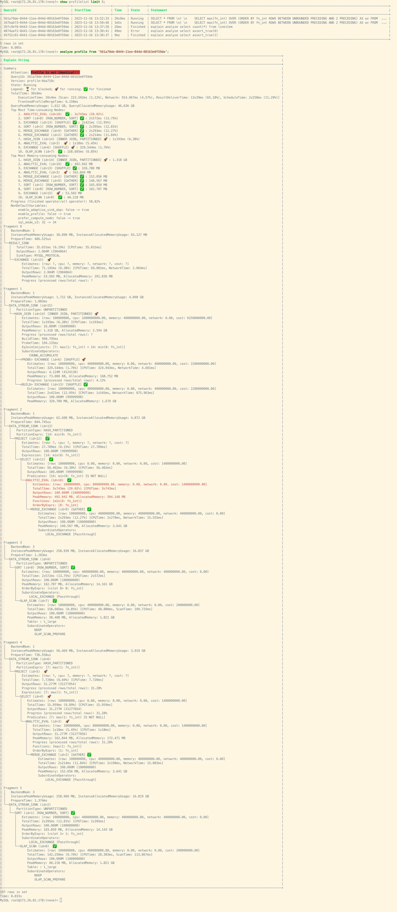

# Explain Analyze

本文档解释了如何在StarRocks中获取和分析基于文本的Query Profiles。它将帮助您理解查询性能，并找到优化SQL查询的方法。

## 使用ANALYZE PROFILE分析现有查询的Profiles

要分析集群中现有（历史或正在运行）查询的基于文本的Profile，您首先需要使用[SHOW PROFILELIST](../../sql-reference/sql-statements/cluster-management/plan_profile/SHOW_PROFILELIST.md)语句获取查询的摘要。此命令列出了所有已成功完成、因错误失败以及仍在运行（超过10秒且尚未完成）的查询。通过此语句，您可以获取用于后续分析的相应Query ID。语法如下：

```SQL
SHOW PROFILELIST [LIMIT <num>];
```

示例：

```SQL
SHOW PROFILELIST;
SHOW PROFILELIST LIMIT 5;
```

输出：

```plaintext
+--------------------------------------+---------------------+-------+----------+-----------------------------------------------------------------------------------------------------------------------------------+
| QueryId                              | StartTime           | Time  | State    | Statement                                                                                                                         |
+--------------------------------------+---------------------+-------+----------+-----------------------------------------------------------------------------------------------------------------------------------+
| a40456b2-8428-11ee-8d02-6a32f8c68848 | 2023-11-16 10:34:18 | 21ms  | Finished | SELECT ROUTINE_NAME FROM INFORMATION_SCHEMA.ROUTINES\n    WHERE ROUTINE_TYPE="FUNCTION" AND ROUTINE_SCHEMA = "None"               |
| a3fc4060-8428-11ee-8d02-6a32f8c68848 | 2023-11-16 10:34:17 | 39ms  | Finished | select TABLE_NAME, COLUMN_NAME from information_schema.columns\n                                    where table_schema = 'Non ... |
| a3f7d38d-8428-11ee-8d02-6a32f8c68848 | 2023-11-16 10:34:17 | 15ms  | Finished | select connection_id()                                                                                                            |
| a3efbd3b-8428-11ee-8d02-6a32f8c68848 | 2023-11-16 10:34:17 | 16ms  | Finished | select connection_id()                                                                                                            |
| a26ec286-8428-11ee-8d02-6a32f8c68848 | 2023-11-16 10:34:15 | 269ms | Error    | EXPLAIN ANALYZE  SELECT c_nation, s_nation, year(lo_orderdate) AS year , SUM(lo_revenue) AS revenue FROM lineorder_flat WHERE ...  |
+--------------------------------------+---------------------+-------+----------+-----------------------------------------------------------------------------------------------------------------------------------+
```

一旦您获得了Query ID，就可以使用[ANALYZE PROFILE](../../sql-reference/sql-statements/cluster-management/plan_profile/ANALYZE_PROFILE.md)语句进行Query Profile分析。语法如下：

```SQL
ANALYZE PROFILE FROM '<Query_ID>' [, <Node_ID> [, ...] ]
```

- `Query_ID`：通过`SHOW PROFILELIST`语句获得的查询对应的ID。
- `Node_ID`：Profile节点ID。对于指定ID的节点，StarRocks返回这些节点的详细度量信息。对于未指定ID的节点，StarRocks仅返回摘要信息。

Profile包括以下部分：

- Summary：Profile的摘要信息。
  - QueryID
  - 版本信息
  - 查询状态，包括`Finished`、`Error`和`Running`。
  - 总查询时间。
  - 内存使用情况
  - CPU使用率最高的前10个节点。
  - 内存使用率最高的前10个节点。
  - 与默认值不同的会话变量。
- Fragments：显示每个Fragment中每个节点的度量。
  - 每个节点的时间、内存使用、成本估算信息和输出行数。
  - 时间使用百分比超过30%的节点以红色突出显示。
  - 时间使用百分比超过15%且小于30%的节点以粉色突出显示。

示例1：查询不指定节点ID的Query Profile。


示例2：查询指定节点ID为`0`的Query Profile。StarRocks返回节点ID `0`的所有详细度量，并突出显示高使用率的度量以便于问题识别。


此外，上述方法还支持运行时Query Profile的显示和分析，即为正在运行的查询生成的Profile。当启用Query Profile功能时，您可以使用此方法获取运行超过10秒的查询的Profile。

与已完成查询的相比，正在运行查询的基于文本的Query Profile包含以下信息：

- Operator状态：
  - ⏳：尚未启动的Operators。这些Operators可能由于依赖关系尚未开始执行。
  - 🚀：正在运行的Operators。
  - ✅：已完成执行的Operators。

- 总体进度：基于`已完成执行的Operators数量/总Operators数量`计算。由于缺乏数据行的详细信息，此值可能略有失真。

- Operator进度：基于`已处理行数/总行数`计算。如果无法计算总行数，进度显示为`?`。

示例：



## 使用EXPLAIN ANALYZE模拟查询进行Profile分析

StarRocks提供了[EXPLAIN ANALYZE](../../sql-reference/sql-statements/cluster-management/plan_profile/EXPLAIN_ANALYZE.md)语句，允许您直接模拟和分析查询的Profile。语法如下：

```SQL
EXPLAIN ANALYZE <sql_statement>
```

执行`EXPLAIN ANALYZE`时，StarRocks默认会为当前会话启用Query Profile功能。

目前，`EXPLAIN ANALYZE`支持两种类型的SQL语句：SELECT语句和INSERT INTO语句。您只能在StarRocks的default catalog中的内部表上模拟和分析INSERT INTO语句的Query Profile。请注意，在模拟和分析INSERT INTO语句的Query Profile时，不会实际加载数据。默认情况下，导入事务将被中止，以确保在分析过程中不会对数据进行意外更改。

示例1：模拟和分析SELECT语句。查询结果将被丢弃。


示例2：模拟和分析INSERT INTO语句。加载事务将被中止。


## 限制

- `EXPLAIN ANALYZE INSERT INTO`语句仅支持default catalog中的表。
- 为了获得更好的视觉效果，输出文本包含ANSI字符以提供颜色、高亮和其他功能。建议使用MyCLI客户端。对于不支持ANSI功能的客户端，如MySQL客户端，可能会有一些轻微的显示错乱。通常，它们不会影响使用。例如：

