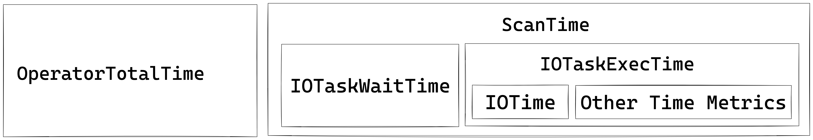

# 查询优化方案

> 一个实用的操作手册：**症状 → 根本原因 → 经过验证的解决方案**。  
> 当你打开一个 profile 并发现一个警示指标，但仍需回答“_接下来怎么办？_”时使用。

---

## 1 · 快速诊断流程

1. **浏览执行概览**  
   如果 `QueryPeakMemoryUsagePerNode > 80 %` 或 `QuerySpillBytes > 1 GB`，直接跳到内存和溢出方案。

2. **找到最慢的 Pipeline / Operator**  
   ⟶ 在 *Query Profile UI* 中点击 **Sort by OperatorTotalTime %**。  
   最热的 operator 告诉你接下来要阅读哪个方案块（Scan, Join, Aggregate, …）。

3. **确认瓶颈子类型**  
   每个方案以其*特征*指标模式开始。在尝试解决方案之前匹配这些模式。

---

## 2 · 按 Operator 分类的方案

### 2.1 OLAP / Connector Scan  [[metrics]](./query_profile_operator_metrics.md#scan-operator)

为了更好地理解 Scan Operator 中的各种指标，以下图示展示了这些指标与存储结构之间的关联。


为了从磁盘检索数据并应用谓词，存储引擎使用了几种技术：
1. **数据存储**：编码和压缩的数据以段的形式存储在磁盘上，并附带各种索引。
2. **索引过滤**：引擎利用 BitmapIndex、BloomfilterIndex、ZonemapIndex、ShortKeyIndex 和 NGramIndex 等索引来跳过不必要的数据。
3. **下推谓词**：简单的谓词，如 `a > 1`，被下推到特定列进行评估。
4. **延迟物化**：仅从磁盘中检索所需的列和过滤后的行。
5. **非下推谓词**：无法下推的谓词会被评估。
6. **投影表达式**：计算诸如 `SELECT a + 1` 的表达式。

Scan Operator 使用一个额外的线程池来执行 IO 任务。因此，该节点的时间指标关系如下图所示：



#### 常见性能瓶颈

**冷或慢存储** – 当 `BytesRead`、`ScanTime` 或 `IOTaskExecTime` 占主导地位且磁盘 I/O 徘徊在 80-100% 时，扫描正在命中冷或配置不足的存储。将热数据移动到 NVMe/SSD，启用存储缓存，或者如果你正在扫描 S3/HDFS，提高 `remote_cache_capacity`。

**缺少过滤下推** – 如果 `PushdownPredicates` 接近 0 而 `ExprFilterRows` 很高，谓词没有到达存储层。将它们重写为简单比较（避免 `%LIKE%` 和宽 `OR` 链）或添加 zonemap/Bloom 索引或物化视图以便下推。

**线程池饥饿** – 高 `IOTaskWaitTime` 以及低 `PeakIOTasks` 表明 I/O 线程池已饱和。增加 BE 上的 `max_io_threads` 或扩大缓存以让更多任务并行运行。

**tablet 数据倾斜** – 最大和最小 `OperatorTotalTime` 之间的巨大差距意味着某些 tablets 的工作量比其他的多。重新分桶到更高基数的键或增加桶数以分散负载。

**Rowset/segment 碎片化** – 爆炸性的 `RowsetsReadCount`/`SegmentsReadCount` 加上长时间的 `SegmentInitTime` 表示有许多小的 rowsets。触发手动 compaction 并批量小型导入以便段提前合并。

**累积的软删除** – 大量的 `DeleteFilterRows` 表示大量使用软删除。运行 BE compaction 以清除墓碑并合并删除位图。

### 2.2 聚合  [[metrics]](./query_profile_operator_metrics.md#aggregate-operator)


Aggregate Operator 负责执行聚合函数、`GROUP BY` 和 `DISTINCT`。

**多种形式的聚合算法**

| 形式 | 规划器选择的条件 | 内部数据结构 | 亮点 / 注意事项 |
|------|-----------------|--------------|-----------------|
| 哈希聚合 | 键适合内存；基数不极端 | 使用 SIMD 探测的紧凑哈希表 | 默认路径，非常适合适中键数 |
| 排序聚合 | 输入已经按 GROUP BY 键排序 | 简单的行比较 + 运行状态 | 零哈希表成本，通常在探测重偏斜时快 2-3 倍 |
| 可溢出聚合 (3.2+) | 哈希表超出内存限制 | 混合哈希/合并与磁盘溢出分区 | 防止 OOM，保持管道并行度 |

**多阶段分布式聚合**

在 StarRocks 中，聚合以分布式方式实现，具体取决于查询模式和优化器的决策，可以是多阶段的。

```
┌─────────┐        ┌──────────┐        ┌────────────┐        ┌────────────┐
│ Stage 0 │ local  │ Stage 1  │ shard/ │ Stage 2    │ gather/│ Stage 3    │ final
│ Partial │───►    │ Update   │ hash   │ Merge      │ shard  │ Finalize   │ output
└─────────┘        └──────────┘        └────────────┘        └────────────┘
```

| 阶段 | 使用条件 | 发生了什么 |
|------|----------|------------|
| 单阶段 | `DISTRIBUTED BY` 是 `GROUP BY` 的子集，分区是共置的 | 部分聚合立即成为最终结果。 |
| 两阶段（本地 + 全局） | 典型的分布式 `GROUP BY` | Stage 0 在每个 BE 内部自适应地折叠重复项；Stage 1 基于 `GROUP BY` 洗牌数据然后执行全局聚合 |
| 三阶段（本地 + 洗牌 + 最终） | 重 `DISTINCT` 和高基数 `GROUP BY` | Stage 0 如上；Stage 1 按 `GROUP BY` 洗牌，然后按 `GROUP BY` 和 `DISTINCT` 聚合；Stage 2 合并部分状态为 `GROUP BY` |
| 四阶段（本地 + 部分 + 中间 + 最终） | 重 `DISTINCT` 和低基数 `GROUP BY` | 引入额外阶段按 `GROUP BY` 和 `DISTINCT` 洗牌以避免单点瓶颈 |

#### 常见性能瓶颈

**高基数 GROUP BY** – 当 `HashTableSize` 或 `HashTableMemoryUsage` 膨胀到内存限制时，分组键太宽或太独特。启用排序流聚合（`enable_streaming_preaggregation = true`），创建汇总物化视图，或将宽字符串键转换为 `INT`。

**洗牌倾斜** – 各片段之间 `HashTableSize` 或 `InputRowCount` 的巨大差异揭示了不平衡的洗牌。向键添加盐列或使用 `DISTINCT [skew]` 提示以便行均匀分布。

**状态重的聚合函数** – 如果 `AggregateFunctions` 主导运行时间且函数包括 `HLL_`、`BITMAP_` 或 `COUNT(DISTINCT)`，则巨大的状态对象正在被移动。在导入期间预计算 HLL/bitmap 草图或切换到近似变体。

**部分聚合降级** – 巨大的 `InputRowCount` 和适中的 `AggComputeTime`，加上上游 EXCHANGE 中巨大的 `BytesSent`，意味着预聚合被绕过。通过 `SET streaming_preaggregation_mode = "force_preaggregation"` 强制重新启用。

**昂贵的键表达式** – 当 `ExprComputeTime` 与 `AggComputeTime` 相当时，GROUP BY 键是逐行计算的。在子查询中物化这些表达式或将它们提升为生成列。

### 2.3 Join  [[metrics]](./query_profile_operator_metrics.md#join-operator)


Join Operator 负责实现显式连接或隐式连接。

在执行过程中，join operator 被分为构建（哈希表构建）和探测阶段，这些阶段在管道引擎中并行运行。向量块（最多 4096 行）使用 SIMD 批量哈希；消耗的键生成运行时过滤器——Bloom 或 IN 过滤器——被推回上游扫描以提前减少探测输入。

**Join 策略**

StarRocks 依赖于一个向量化的、管道友好的哈希连接核心，可以连接到四种物理策略中，成本优化器在计划时会权衡这些策略：

| 策略 | 优化器选择的条件 | 使其快速的原因 |
|------|-----------------|----------------|
| Colocate Join | 两个表属于同一个共置组（相同的桶键、桶数和副本布局）。 | 无网络洗牌：每个 BE 仅连接其本地桶。 |
| Bucket-Shuffle Join | 其中一个连接表具有与连接键相同的桶键 | 只需洗牌一个连接表，可以减少网络成本 |
| Broadcast Join | 构建端非常小（行/字节阈值或显式提示）。 | 小表被复制到每个探测节点；避免洗牌大表。 |
| Shuffle (Hash) Join | 一般情况，键不对齐。 | 在连接键上对每行进行哈希分区，以便探测在 BEs 之间均衡分布。 |

#### 常见性能瓶颈

**构建端过大** – `BuildHashTableTime` 和 `HashTableMemoryUsage` 的峰值显示构建端已超出内存。交换探测/构建表，预过滤构建表，或启用哈希溢出。

**缓存不友好的探测** – 当 `SearchHashTableTime` 占主导地位时，探测端不是缓存高效的。对探测行按连接键排序并启用运行时过滤器。

**洗牌倾斜** – 如果单个片段的 `ProbeRows` 远超其他片段，数据是倾斜的。切换到更高基数的键或附加盐，如 `key || mod(id, 16)`。

**意外广播** – 连接类型 **BROADCAST** 伴随巨大的 `BytesSent` 意味着你认为小的表并不小。降低 `broadcast_row_limit` 或使用 `SHUFFLE` 提示强制洗牌。

**缺少运行时过滤器** – 微小的 `JoinRuntimeFilterEvaluate` 以及全表扫描表明运行时过滤器从未传播。将连接重写为纯等式并确保列类型对齐。

**非等式回退** – 当 operator 类型是 `CROSS` 或 `NESTLOOP` 时，不等式或函数阻止了哈希连接。添加一个真正的等式谓词或预过滤较大的表。

### 2.4 Exchange (网络)  [[metrics]](./query_profile_operator_metrics.md#exchange-operator)

**过大的洗牌或广播** – 如果 `NetworkTime` 超过 30% 且 `BytesSent` 很大，查询正在传输过多的数据。重新评估连接策略或启用 exchange compaction（`pipeline_enable_exchange_compaction`）。

**接收器积压** – 接收器无法跟上时，接收器的高 `WaitTime` 以及发送者队列始终满。增加接收器线程池（`brpc_num_threads`）并确认 NIC 带宽和 QoS 设置。

### 2.5 排序 / 合并 / 窗口

为了便于理解各种指标，合并可以表示为以下状态机制：

```plaintext
               ┌────────── PENDING ◄──────────┐
               │                              │
               │                              │
               ├──────────────◄───────────────┤
               │                              │
               ▼                              │
   INIT ──► PREPARE ──► SPLIT_CHUNK ──► FETCH_CHUNK ──► FINISHED
               ▲
               |
               | one traverse from leaf to root
               |
               ▼
            PROCESS
```

**排序溢出** – 当 `MaxBufferedBytes` 上升到大约 2 GB 以上或 `SpillBytes` 非零时，排序阶段正在溢出到磁盘。添加 `LIMIT`，在上游预聚合，或如果机器有足够的内存，提高 `sort_spill_threshold`。

**合并饥饿** – 高 `PendingStageTime` 表示合并正在等待上游块。首先优化生产者 operator 或扩大管道缓冲区。

**宽窗口分区** – 窗口 operator 内巨大的 `PeakBufferedRows` 指向非常宽的分区或缺少帧限制的 ORDER BY。更细粒度地分区，添加 `RANGE BETWEEN` 边界，或物化中间聚合。

---

## 3 · 内存和溢出速查表

| 阈值 | 关注点 | 实际行动 |
| --- | --- | --- |
| **80 %** 的 BE 内存 | `QueryPeakMemoryUsagePerNode` | 降低会话 `exec_mem_limit` 或增加 BE 内存 |
| 检测到溢出（`SpillBytes` > 0） | `QuerySpillBytes`，每个 operator 的 `SpillBlocks` | 增加内存限制；升级到 SR 3.2+ 以获得混合哈希/合并溢出 |

---

## 4 · 事后分析模板

```text
1. 症状
   – 慢阶段：Aggregate (OperatorTotalTime 68 %)
   – 红旗：HashTableMemoryUsage 9 GB (> exec_mem_limit)
2. 根本原因
   – GROUP BY 高基数 UUID
3. 应用的修复
   – 添加排序流聚合 + 汇总 MV
4. 结果
   – 查询运行时间从 95 s 降至 8 s；内存峰值 0.7 GB```