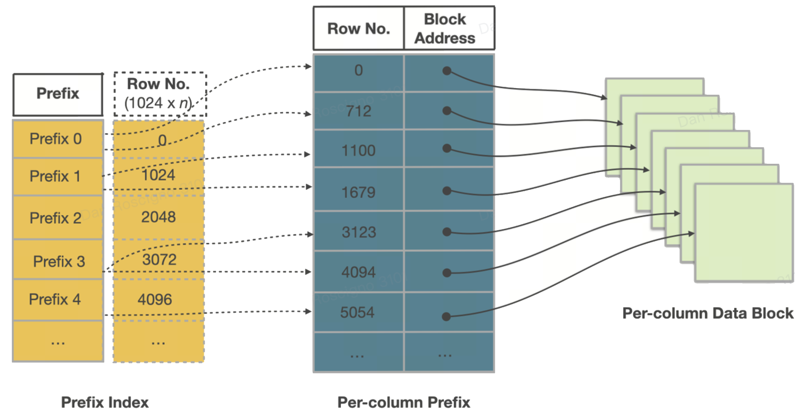

# 表聚类

精心设计的排序键是 StarRocks 中最具杠杆效应的物理设计调节器。本指南解释了排序键在底层的工作原理、它所解锁的系统性优势，以及为您的工作负载选择有效键的具体操作手册。

## 示例

假设您运行一个遥测系统，每天接收数十亿行数据，每行数据都标记有 `device_id` 和 `ts`（时间戳）。在您的事实表上定义 `ORDER BY (device_id, ts)` 可以确保：

- 对 `device_id` 的点查询能在毫秒内返回。
- 仪表板过滤每个设备的最近时间窗口，从而裁剪大部分数据。
- 像 `GROUP BY device_id` 这样的聚合受益于流式聚合。
- 由于每个设备的时间戳相邻，压缩效果得到改善。

这个简单的两列排序键 `ORDER BY (device_id, ts)` 在数十亿行数据中提供了 I/O 减少、CPU 节省和更稳定的查询性能。

```sql
CREATE TABLE telemetry (
  device_id VARCHAR,
  ts DATETIME,
  value DOUBLE
)
ENGINE=OLAP
PRIMARY KEY(device_id, ts)
PARTITION BY date_trunc('day', ts)
DISTRIBUTED BY HASH(device_id) BUCKETS 16
ORDER BY (device_id, ts);
```
---

## 深入探讨的好处

1. 大规模 I/O 消除—Segment 和页面裁剪

    工作原理：

    每个 segment 和 64 KB 页面存储所有列的最小/最大值。如果谓词超出该范围，StarRocks 会跳过整个块，不会触碰磁盘。

    示例：

    ```sql
    SELECT count(*)
    FROM events
    WHERE tenant_id = 42
      AND ts BETWEEN '2025-05-01' AND '2025-05-07';
    ```

    使用 `ORDER BY (tenant_id, ts)`，只有第一个键等于 42 的 segment 被考虑，并且在这些 segment 中，只有 ts 窗口与那七天重叠的页面被考虑。一个 100 B 行的表可能扫描不到 1 B 行，将分钟级的查询时间缩短到秒级。

---
2. 毫秒级点查询—稀疏前缀索引

    工作原理：

    稀疏前缀索引存储每 ~1 K 个排序键值。二分搜索定位到正确的页面，然后单次磁盘读取（通常已缓存）返回行。

    示例：

    ```sql
    SELECT *
    FROM orders
    WHERE order_id = 982347234;
    ```

    使用 `ORDER BY (order_id)`，在 50 B 行的表中探测需要 ≈ 50 次键比较——即使在冷数据缓存上也能实现低于 10 ms 的延迟。

---
3. 更快的排序聚合

    工作原理：

    当排序键与 GROUP BY 子句对齐时，StarRocks 在扫描时执行流式聚合——无需排序或哈希表。

    这种排序聚合计划按排序键顺序扫描行，并即时发出组，利用 CPU 缓存局部性并跳过中间物化。

    示例：

    ```sql
    SELECT device_id, COUNT(*)
    FROM   telemetry
    WHERE  ts BETWEEN '2025-01-01' AND '2025-01-31'
    GROUP  BY device_id;
    ```

    如果表是 `ORDER BY (device_id, ts)`，引擎在流入时对行进行分组——无需构建哈希表或重新排序。对于像 device_id 这样高基数的键，这可以显著减少 CPU 和内存使用。

    使用排序输入的流式聚合通常比哈希聚合在大组基数情况下提高 2–3 倍的吞吐量。

---
4. 更高的压缩和更热的缓存

    工作原理：

    排序数据显示出小的增量或长的连续运行，加速了字典、RLE 和参考帧编码。紧凑的页面顺序流经 CPU 缓存。

    示例：

    一个按 (device_id, ts) 排序的遥测表实现了 1.8 倍更好的压缩（LZ4）和 25 % 更低的 CPU/扫描消耗，相比于未排序的数据。

---

## 排序键的工作原理

排序键的影响从行写入的那一刻开始，并在每次读取优化中持续。本节将介绍这一生命周期——写入路径 ➜ 存储层次结构 ➜ segment 内部 ➜ 读取路径——以展示每一层如何累积排序的价值。

1.  写入路径
    1. 采集：行进入 MemTable，按声明的排序键排序，然后作为一个或多个有序 Segment 的新 Rowset 刷新。
    2. Compaction：后台累积/基础作业将多个小 Rowset 合并为更大的 Rowset，回收删除并降低 segment 数量，无需重新排序，因为每个源 Rowset 已经共享相同的顺序。
    3. 复制：每个 Tablet（拥有 Rowset 的分片）同步复制到对等的后端节点，确保排序顺序在副本之间一致。

   

2. 存储层次结构

| 对象      | 定义     | 对排序键的重要性 |
| ------------- | ------------- | ------------------------------ |
| Partition | 表的粗粒度逻辑切片（例如，日期或 tenant_id）。 | 启用计划时分区裁剪并隔离生命周期操作（TTL，批量导入）。 |
| Tablet | 分区内的哈希/随机桶，独立复制到后端节点。 | 其行按排序键物理排序的单元；所有分区内裁剪从这里开始。 |
| MemTable | 内存写缓冲区（约 96 MB），在刷新到磁盘前按声明的键排序。 | 确保每个磁盘上的 Segment 已经排序——无需后续外部排序。 |
| Rowset | 由刷新、流式导入或 Compaction 周期生成的一个或多个 Segment 的不可变捆绑。 | 追加设计使 StarRocks 可以同时导入，而读者保持无锁。 |
| Segment | Rowset 内部的自包含列式文件（约 512 MB），携带数据页面和裁剪索引。 | Segment 级别的区域映射和前缀索引依赖于 MemTable 阶段建立的顺序。 |

3.  Segment 文件内部

   

每个 Segment 都是自描述的。从上到下，您会发现：

    - 列数据页面 64 KB 块编码（字典、RLE、Delta）并压缩（默认 LZ4）。
    - 序号索引 将行序号映射到页面偏移量，以便引擎可以直接跳转到页面 n。
    - 区域映射索引 每个页面和整个 Segment 的最小值、最大值和是否有空值——裁剪的第一道防线。
    - 短键（前缀）索引 每 ~1 K 行的排序键前 36 字节的稀疏二分搜索表——支持毫秒级点/范围查找。
    - 页脚和魔术数字 每个索引的偏移量和完整性校验和；让 StarRocks 仅内存映射尾部以发现其余部分。

因为页面已经按键排序，这些索引虽然小但非常有效。

4. 读取路径

    1. 分区裁剪（计划时） 如果 WHERE 子句限制了分区键（例如 `dt BETWEEN '2025‑05‑01' AND '2025‑05‑07'`），优化器仅打开匹配的分区目录。
    2. Tablet 裁剪（计划时） 当等式过滤器包含哈希分布列时，StarRocks 计算目标 tablet ID 并仅调度这些 Tablets。
    3. 前缀索引查找 在前导排序列上的稀疏短键索引定位到确切的 segment 或页面。
    4. 区域映射裁剪 每个 Segment 和 64 KB 页面的最小/最大元数据丢弃不符合谓词窗口的块。
    5. 向量化扫描和延迟物化 存活的列页面顺序流经 CPU 缓存；仅物化引用的行和列，保持内存紧凑。

    因为数据在每次刷新时按键顺序提交，每个读取时裁剪层在前一层的基础上累积，提供对数十亿行表的亚秒级扫描。

---
## 如何选择有效的排序键

1.  从工作负载情报开始

    首先分析前 N 个查询模式：

    - 等式谓词（`=` / `IN`）。几乎总是通过等式过滤的列是理想的领先候选者。
    - 范围谓词。时间戳和数值范围通常跟随等式列在排序键中。
    - 聚合键。如果一个范围列也出现在 `GROUP BY` 子句中，将其放在键的前面（在选择性过滤器之后）可以启用排序聚合。
    - 连接/分组键。如果连接或分组键常见，考虑将它们放在前面。

    测量列基数：高基数列（数百万个不同值）裁剪效果最好。

2.  经验法则和经验法则

    1. 顺序规则： (高选择性等式列) → (主要范围列) → (聚类辅助列)。
    2. 基数排序：将低基数列放在高基数列之前可以增强数据压缩。
    3. 宽度：保持在 3‑5 列。非常宽的键会减慢导入速度并超出 36 字节前缀索引限制。
    4. 字符串列：一个长的前导字符串列可能占据前缀索引中大部分或全部 36 字节限制，阻止排序键中后续列被有效索引。

    这会降低前缀索引的裁剪能力并降低点查询性能。

3.  与其他设计调节器协调
    - 分区：选择一个比前导排序列更粗的分区键（例如，`PARTITION BY date`，`ORDER BY (tenant_id, ts)`）。这样分区裁剪首先移除整个日期范围，而排序裁剪则在内部清理。
    - 分桶：使用相同的列进行分桶和聚类服务于不同的目的。分桶确保数据在集群中的均匀分布，而排序则实现高效的 I/O 消除。
    - 表模型：主键表默认使用主键作为排序键，但它们也可以指定其他列来优化物理顺序并增强裁剪。聚合和重复表应遵循上述分析谓词驱动的排序键策略。

---
4.  参考模板

| 场景 | 分区 | 排序键 | 理由 |
| -------- | --------- | -------- | --------- |
| B2C 订单 | date_trunc('day', order_ts) | (user_id, order_ts) | 大多数查询首先按用户过滤，然后按最近时间范围过滤。| 
| 物联网遥测 | date_trunc('day', ts)| (device_id, ts) | 设备范围的时间序列读取占主导地位。 | 
| SaaS 多租户 | tenant_id | (dt, event_id) | 通过分区实现租户隔离；按天排序以便于仪表板展示。 | 
| 维度查找 | 无 | (dim_id) | 小表，纯点查询——单列即可。 |

---
## 结论

精心设计的排序键以小而可预测的导入开销换取扫描延迟、存储效率和 CPU 利用率的显著改善。通过基于工作负载现实、尊重基数并使用 `EXPLAIN` 验证您的选择，即使数据和用户数量增长 10 倍及以上，您也可以让 StarRocks 保持高效运行。