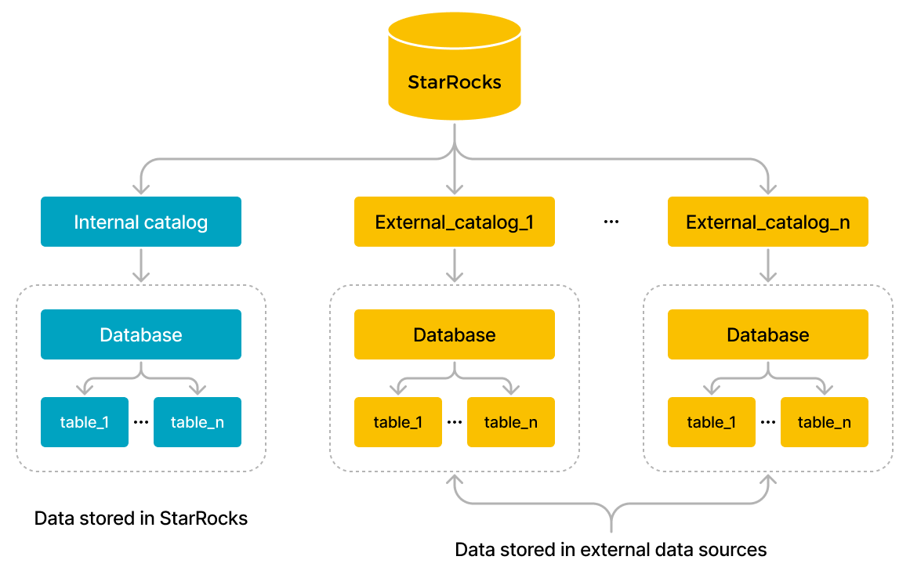

# 概览

本文介绍什么是 catalog，以及如何使用 catalog 管理和查询内部数据和外部数据。

StarRocks 从 v2.3 版本开始支持 catalog 功能。通过 catalog，您可以在一个系统中管理内部和外部数据，并以一种灵活的方式轻松查询和分析存储在各种外部系统中的数据。

## 基本概念

- **内部数据**：指存储在 StarRocks 中的数据。
- **外部数据**：指存储在外部数据源中的数据，例如 Apache Hive™、Apache Iceberg、Apache Hudi、Delta Lake 和 JDBC。

## Catalog

目前，StarRocks 提供两种类型的 catalog：内部 catalog 和外部 catalog。



- **内部 catalog** 管理 StarRocks 的内部数据。例如，如果您执行 CREATE DATABASE 或 CREATE TABLE 语句来创建数据库或表，则数据库或表将存储在内部 catalog 中。每个 StarRocks 集群只有一个内部 catalog，名为 [default_catalog](../catalog/default_catalog.md)。

- **外部 catalog** 类似于指向外部管理的元数据存储的链接，这使得 StarRocks 可以直接访问外部数据源。您可以直接查询外部数据，而无需进行数据导入或迁移。目前，StarRocks 支持以下类型的外部 catalog：
  - [Hive catalog](../catalog/hive_catalog.md)：用于查询 Hive 中的数据。
  - [Iceberg catalog](./iceberg/iceberg_catalog.md)：用于查询 Iceberg 中的数据。
  - [Hudi catalog](../catalog/hudi_catalog.md)：用于查询 Hudi 中的数据。
  - [Delta Lake catalog](../catalog/deltalake_catalog.md)：用于查询 Delta Lake 中的数据。
  - [JDBC catalog](../catalog/jdbc_catalog.md)：用于查询 JDBC 兼容的数据源中的数据。
  - [Benchmark catalog](../catalog/benchmark_catalog.md)：用于查询 TPC-H、TPC-DS 和 SSB schema 的实时生成数据集。
  - [Elasticsearch catalog](../catalog/elasticsearch_catalog.md)：用于查询 Elasticsearch 中的数据。StarRocks 从 v3.1 开始支持 Elasticsearch catalog。
  - [Paimon catalog](../catalog/paimon_catalog.md)：用于查询 Paimon 中的数据。StarRocks 从 v3.1 开始支持 Paimon catalog。
  - [Unified catalog](../catalog/unified_catalog.md)：用于将来自 Hive、Iceberg、Hudi 和 Delta Lake 数据源的数据作为统一数据源进行查询。StarRocks 从 v3.2 开始支持 Unified catalog。

  当您查询外部数据时，StarRocks 与外部数据源的以下两个组件进行交互：

  - **Metastore service**：FE 用于访问外部数据源的元数据。FE 基于元数据生成查询执行计划。
  - **数据存储系统**：用于存储外部数据。分布式文件系统和对象存储系统都可以用作数据存储系统，以存储各种格式的数据文件。在 FE 将查询执行计划分发给所有 BE 或 CN 后，所有 BE 或 CN 并行扫描目标外部数据，执行计算，然后返回查询结果。

## 访问 catalog

您可以使用 [SET CATALOG](../../sql-reference/sql-statements/Catalog/SET_CATALOG.md) 语句在当前会话中切换到指定的 catalog。然后，您可以使用该 catalog 查询数据。

## 查询数据

### 查询内部数据

要查询 StarRocks 中的数据，请参见 [Default catalog](../catalog/default_catalog.md)。

### 查询外部数据

要查询外部数据源中的数据，请参见 [Query external data](../catalog/query_external_data.md)。

### 跨 catalog 查询

要从当前 catalog 执行跨 catalog 的联邦查询，请以 `catalog_name.database_name` 或 `catalog_name.database_name.table_name` 格式指定要查询的数据。

- 当当前会话为 `default_catalog.olap_db` 时，查询 `hive_db` 中的 `hive_table`。

    ```SQL
    SELECT * FROM hive_catalog.hive_db.hive_table;
    ```

- 当当前会话为 `hive_catalog.hive_db` 时，查询 `default_catalog` 中的 `olap_table`。

   ```SQL
    SELECT * FROM default_catalog.olap_db.olap_table;
    ```

- 当当前会话为 `hive_catalog.hive_db` 时，对 `hive_catalog` 中的 `hive_table` 和 `default_catalog` 中的 `olap_table` 执行 JOIN 查询。

    ```SQL
    SELECT * FROM hive_table h JOIN default_catalog.olap_db.olap_table o WHERE h.id = o.id;
    ```

- 当当前会话是另一个 catalog 时，使用 JOIN 子句对 `hive_catalog` 中的 `hive_table` 和 `default_catalog` 中的 `olap_table` 执行 JOIN 查询。

    ```SQL
    SELECT * FROM hive_catalog.hive_db.hive_table h JOIN default_catalog.olap_db.olap_table o WHERE h.id = o.id;
    ```