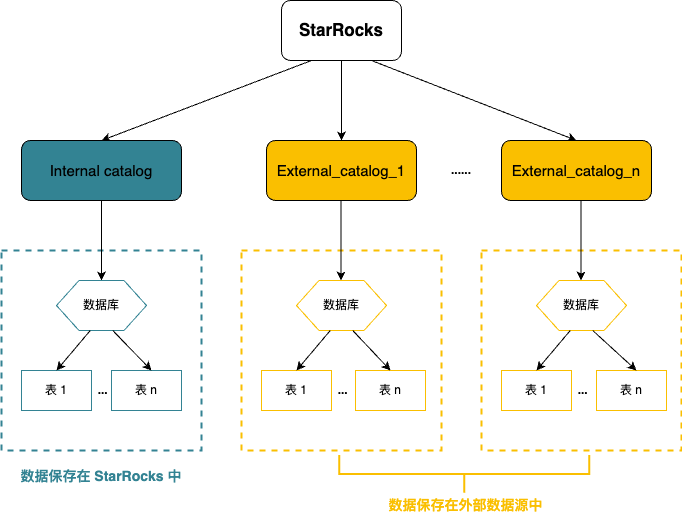

# 概述

本文介绍什么是 Catalog， 以及如何使用 Catalog 管理和查询内外部数据。

StarRocks 自 2.3 版本起支持 Catalog（数据目录）功能，实现在一套系统内同时维护内、外部数据，方便您轻松访问并查询存储在各类外部源的数据。

## 基本概念

- **内部数据**：指保存在 StarRocks 中的数据。
- **外部数据**：指保存在外部数据源（如 Apache Hive™、Apache Iceberg、Apache Hudi、Delta Lake）中的数据。

## Catalog

当前 StarRocks 提供两种类型 Catalog：internal catalog 和 external catalog。



- **Internal catalog**: 内部数据目录，用于管理 StarRocks 所有内部数据。例如，执行 CREATE DATABASE 和 CREATE TABLE 语句创建的数据库和数据表都由 internal catalog 管理。 每个 StarRocks 集群都有且只有一个 internal catalog 名为 [default catalog](../catalog/default_catalog.md)。
- **External catalog**: 外部数据目录，用于连接外部 metastore。在 StarRocks 中，您可以通过 external catalog 直接查询外部数据，无需进行数据导入或迁移。当前支持创建以下类型的 external catalog：
  - [Hive catalog](../catalog/hive_catalog.md)：用于查询 Hive 数据。
  - [Iceberg catalog](../catalog/iceberg_catalog.md)：用于查询 Iceberg 数据。
  - [Hudi catalog](../catalog/hudi_catalog.md)：用于查询 Hudi 数据。
  - [Delta Lake catalog](../catalog/deltalake_catalog.md)：用于查询 Delta Lake 数据。

  使用 external catalog 查询数据时，StarRocks 会用到外部数据源的两个组件：

  - **元数据服务**：用于将元数据暴露出来供 StarRocks 的 FE 进行查询规划。
  - **存储系统**：用于存储数据。数据文件以不同的格式存储在分布式文件系统或对象存储系统中。当 FE 将生成的查询计划分发给各个 BE 后，各个 BE 会并行扫描 Hive 存储系统中的目标数据，并执行计算返回查询结果。

## 查询数据

### 查询内部数据

如要查询存储在 StarRocks 中的数据，请参见 [Default catalog](../catalog/default_catalog.md)。

### 查询外部数据

如要查询存储在外部数据源中的数据，请参见[查询外部数据](../catalog/query_external_data.md)。

### 跨 catalog 查询数据

如想在一个 catalog 中查询其他 catalog 中数据，可通过 `catalog_name.db_name` 或 `catalog_name.db_name.table_name` 的格式来引用目标数据。举例：

- 在 `default_catalog.olap_db` 下查询 `hive_catalog` 中的 `hive_table`。

  ```SQL
  SELECT * FROM hive_catalog.hive_db.hive_table;
  ```

- 在 `hive_catalog.hive_db` 下查询 `default_catalog` 中的 `olap_table`。

  ```SQL
  SELECT * FROM default_catalog.olap_db.olap_table;
  ```

- 在 `hive_catalog.hive_db` 中，对 `hive_table` 和 `default_catalog` 中的 `olap_table` 进行联邦查询。

  ```SQL
  SELECT * FROM hive_table h JOIN default_catalog.olap_db.olap_table o WHERE h.id = o.id;
  ```

- 在其他目录下，对 `hive_catalog` 中的 `hive_table` 和 `default_catalog` 中的 `olap_table` 进行联邦查询。

  ```SQL
  SELECT * FROM hive_catalog.hive_db.hive_table h JOIN default_catalog.olap_db.olap_table o WHERE h.id = o.id;
  ```
