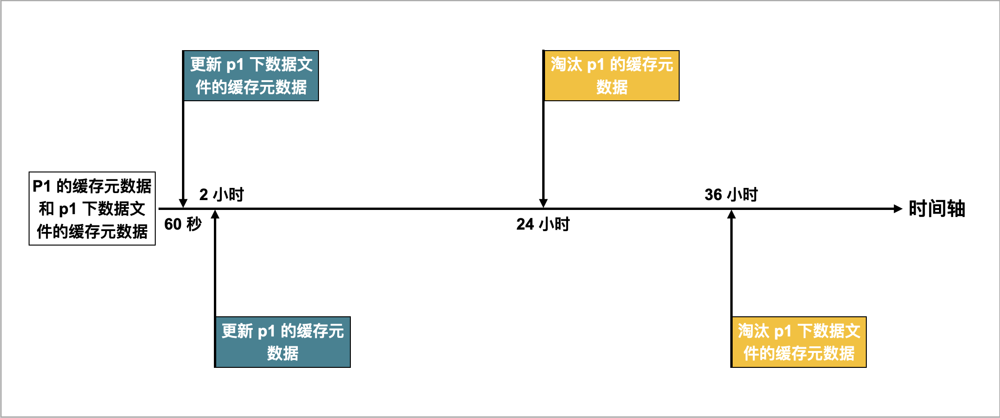

# Hive catalog

Hive Catalog 是一种 External Catalog。通过 Hive Catalog，您不需要执行数据导入就可以直接查询 Apache Hive™ 里的数据。

此外，您还可以基于 Hive Catalog ，结合 [INSERT INTO](../../sql-reference/sql-statements/data-manipulation/INSERT.md) 能力来实现数据转换和导入。StarRocks 从 2.3 版本开始支持 Hive Catalog。

为保证正常访问 Hive 内的数据，StarRocks 集群必须集成以下两个关键组件：

- 对象存储或分布式文件系统，如 AWS S3 或 HDFS
- 元数据服务，如 Hive Metastore（以下简称 HMS）或 AWS Glue

## 使用说明

- StarRocks 查询 Hive 数据时，支持 Parquet、ORC 和 CSV 三种文件格式，其中：

  - Parquet 文件支持 SNAPPY、LZ4、ZSTD、GZIP 和 NO_COMPRESSION 压缩格式。
  - ORC 文件支持 ZLIB、SNAPPY、LZO、LZ4、ZSTD 和 NO_COMPRESSION 压缩格式。

- StarRocks 查询 Hive 数据时，不支持 INTERVAL、BINARY 和 UNION 三种数据类型。此外，对于 CSV 格式的 Hive 表，StarRocks 不支持 MAP、STRUCT 数据类型。
- Hive Catalog 仅支持查询 Hive 数据，不支持针对 Hive 的写/删操作。

## 准备工作

在创建 Hive Catalog 之前，请确保 StarRocks 集群能够正常访问 Hive 的文件存储及元数据服务。

### AWS IAM

如果 Hive 使用 AWS S3 作为文件存储或使用 AWS Glue 作为元数据服务，您需要选择一种合适的认证鉴权方案，确保 StarRocks 集群可以访问相关的 AWS 云资源。

您可以选择如下认证鉴权方案：

- Instance Profile（推荐）
- Assumed Role
- IAM User

有关 StarRocks 访问 AWS 认证鉴权的详细内容，参见[配置 AWS 认证方式 - 准备工作](../../integrations/authenticate_to_aws_resources.md#准备工作)。

### HDFS

如果使用 HDFS 作为文件存储，则需要在 StarRocks 集群中做如下配置：

- （可选）设置用于访问 HDFS 集群和 HMS 的用户名。 您可以在每个 FE 的 **fe/conf/hadoop_env.sh** 文件、以及每个 BE 的 **be/conf/hadoop_env.sh** 文件最开头增加 `export HADOOP_USER_NAME="<user_name>"` 来设置该用户名。配置完成后，需重启各个 FE 和 BE 使配置生效。如果不设置该用户名，则默认使用 FE 和 BE 进程的用户名进行访问。每个 StarRocks 集群仅支持配置一个用户名。
- 查询 Hive 数据时，StarRocks 集群的 FE 和 BE 会通过 HDFS 客户端访问 HDFS 集群。一般情况下，StarRocks 会按照默认配置来启动 HDFS 客户端，无需手动配置。但在以下场景中，需要进行手动配置：
  - 如果 HDFS 集群开启了高可用（High Availability，简称为“HA”）模式，则需要将 HDFS 集群中的 **hdfs-site.xml** 文件放到每个 FE 的 **$FE_HOME/conf** 路径下、以及每个 BE 的 **$BE_HOME/conf** 路径下。
  - 如果 HDFS 集群配置了 ViewFs，则需要将 HDFS 集群中的 **core-site.xml** 文件放到每个 FE 的 **$FE_HOME/conf** 路径下、以及每个 BE 的 **$BE_HOME/conf** 路径下。

> **注意**
>
> 如果查询时因为域名无法识别 (Unknown Host) 而发生访问失败，您需要将 HDFS 集群中各节点的主机名及 IP 地址之间的映射关系配置到 **/etc/hosts** 路径中。

### Kerberos 认证

如果 HDFS 集群或 HMS 开启了 Kerberos 认证，则需要在 StarRocks 集群中做如下配置：

- 在每个 FE 和 每个 BE 上执行 `kinit -kt keytab_path principal` 命令，从 Key Distribution Center (KDC) 获取到 Ticket Granting Ticket (TGT)。执行命令的用户必须拥有访问 HMS 和 HDFS 的权限。注意，使用该命令访问 KDC 具有时效性，因此需要使用 cron 定期执行该命令。
- 在每个 FE 的 **$FE_HOME/conf/fe.conf** 文件和每个 BE 的 **$BE_HOME/conf/be.conf** 文件中添加 `JAVA_OPTS="-Djava.security.krb5.conf=/etc/krb5.conf"`。其中，`/etc/krb5.conf` 是 **krb5.conf** 文件的路径，可以根据文件的实际路径进行修改。

## 创建 Hive Catalog

### 语法

```SQL
CREATE EXTERNAL CATALOG <catalog_name>
[COMMENT <comment>]
PROPERTIES
(
    "type" = "hive",
    GeneralParams,
    MetastoreParams,
    StorageCredentialParams,
    MetadataUpdateParams
)
```

### 参数说明

#### catalog_name

Hive Catalog 的名称。命名要求如下：

- 必须由字母 (a-z 或 A-Z)、数字 (0-9) 或下划线 (_) 组成，且只能以字母开头。
- 总长度不能超过 1023 个字符。
- Catalog 名称大小写敏感。

#### comment

Hive Catalog 的描述。此参数为可选。

#### type

数据源的类型。设置为 `hive`。

#### GeneralParams

指定通用设置的一组参数。

`GeneralParams` 包含如下参数。

| 参数                      | 是否必须  | 说明                                                         |
| ------------------------ | -------- | ------------------------------------------------------------ |
| enable_recursive_listing | 否       | 指定 StarRocks 是否递归读取表或者分区目录（包括子目录）中文件的数据。取值范围：`true` 和 `false`。默认值：`false`。取值为 `true` 表示递归遍历，取值为 `false` 表示只读取表或者分区目录当前层级中文件的数据。 |

#### MetastoreParams

StarRocks 访问 Hive 集群元数据服务的相关参数配置。

##### Hive metastore

如果选择 HMS 作为 Hive 集群的元数据服务，请按如下配置 `MetastoreParams`：

```SQL
"hive.metastore.type" = "hive",
"hive.metastore.uris" = "<hive_metastore_uri>"
```

> **说明**
>
> 在查询 Hive 数据之前，必须将所有 HMS 节点的主机名及 IP 地址之间的映射关系添加到 **/etc/hosts** 路径。否则，发起查询时，StarRocks 可能无法访问 HMS。

`MetastoreParams` 包含如下参数。

| 参数                | 是否必须   | 说明                                                         |
| ------------------- | -------- | ------------------------------------------------------------ |
| hive.metastore.type | 是       | Hive 集群所使用的元数据服务的类型。设置为 `hive`。           |
| hive.metastore.uris | 是       | HMS 的 URI。格式：`thrift://<HMS IP 地址>:<HMS 端口号>`。<br />如果您的 HMS 开启了高可用模式，此处可以填写多个 HMS 地址并用逗号分隔，例如：`"thrift://<HMS IP 地址 1>:<HMS 端口号 1>,thrift://<HMS IP 地址 2>:<HMS 端口号 2>,thrift://<HMS IP 地址 3>:<HMS 端口号 3>"`。 |

##### AWS Glue

如果选择 AWS Glue 作为 Hive 集群的元数据服务，请按如下配置 `MetastoreParams`：

- 基于 Instance Profile 进行认证和鉴权

  ```SQL
  "hive.metastore.type" = "glue",
  "aws.glue.use_instance_profile" = "true",
  "aws.glue.region" = "<aws_glue_region>"
  ```

- 基于 Assumed Role 进行认证和鉴权

  ```SQL
  "hive.metastore.type" = "glue",
  "aws.glue.use_instance_profile" = "true",
  "aws.glue.iam_role_arn" = "<iam_role_arn>",
  "aws.glue.region" = "<aws_glue_region>"
  ```

- 基于 IAM User 进行认证和鉴权

  ```SQL
  "hive.metastore.type" = "glue",
  "aws.glue.use_instance_profile" = "false",
  "aws.glue.access_key" = "<iam_user_access_key>",
  "aws.glue.secret_key" = "<iam_user_secret_key>",
  "aws.glue.region" = "<aws_s3_region>"
  ```

`MetastoreParams` 包含如下参数。

| 参数                          | 是否必须   | 说明                                                         |
| ----------------------------- | -------- | ------------------------------------------------------------ |
| hive.metastore.type           | 是       | Hive 集群所使用的元数据服务的类型。设置为 `glue`。           |
| aws.glue.use_instance_profile | 是       | 指定是否开启 Instance Profile 和 Assumed Role 两种鉴权方式。取值范围：`true` 和 `false`。默认值：`false`。 |
| aws.glue.iam_role_arn         | 否       | 有权限访问 AWS Glue Data Catalog 的 IAM Role 的 ARN。采用 Assumed Role 鉴权方式访问 AWS Glue 时，必须指定此参数。 |
| aws.glue.region               | 是       | AWS Glue Data Catalog 所在的地域。示例：`us-west-1`。        |
| aws.glue.access_key           | 否       | IAM User 的 Access Key。采用 IAM User 鉴权方式访问 AWS Glue 时，必须指定此参数。 |
| aws.glue.secret_key           | 否       | IAM User 的 Secret Key。采用 IAM User 鉴权方式访问 AWS Glue 时，必须指定此参数。 |

有关如何选择用于访问 AWS Glue 的鉴权方式、以及如何在 AWS IAM 控制台配置访问控制策略，参见[访问 AWS Glue 的认证参数](../../integrations/authenticate_to_aws_resources.md#访问-aws-glue-的认证参数)。

#### StorageCredentialParams

StarRocks 访问 Hive 集群文件存储的相关参数配置。

只有当 Hive 集群使用 AWS S3 作为文件存储时，才需要配置 `StorageCredentialParams`。

如果 Hive 集群使用 AWS S3 以外的其他文件存储，则可以忽略 `StorageCredentialParams`。

##### AWS S3

如果选择 AWS S3 作为 Hive 集群的文件存储，请按如下配置 `StorageCredentialParams`：

- 基于 Instance Profile 进行认证和鉴权

  ```SQL
  "aws.s3.use_instance_profile" = "true",
  "aws.s3.region" = "<aws_s3_region>"
  ```

- 基于 Assumed Role 进行认证和鉴权

  ```SQL
  "aws.s3.use_instance_profile" = "true",
  "aws.s3.iam_role_arn" = "<iam_role_arn>",
  "aws.s3.region" = "<aws_s3_region>"
  ```

- 基于 IAM User 进行认证和鉴权

  ```SQL
  "aws.s3.use_instance_profile" = "false",
  "aws.s3.access_key" = "<iam_user_access_key>",
  "aws.s3.secret_key" = "<iam_user_secret_key>",
  "aws.s3.region" = "<aws_s3_region>"
  ```

`StorageCredentialParams` 包含如下参数。

| 参数                        | 是否必须   | 说明                                                         |
| --------------------------- | -------- | ------------------------------------------------------------ |
| aws.s3.use_instance_profile | 是       | 指定是否开启 Instance Profile 和 Assumed Role 两种鉴权方式。取值范围：`true` 和 `false`。默认值：`false`。 |
| aws.s3.iam_role_arn         | 否       | 有权限访问 AWS S3 Bucket 的 IAM Role 的 ARN。采用 Assumed Role 鉴权方式访问 AWS S3 时，必须指定此参数。 |
| aws.s3.region               | 是       | AWS S3 Bucket 所在的地域。示例：`us-west-1`。                |
| aws.s3.access_key           | 否       | IAM User 的 Access Key。采用 IAM User 鉴权方式访问 AWS S3 时，必须指定此参数。 |
| aws.s3.secret_key           | 否       | IAM User 的 Secret Key。采用 IAM User 鉴权方式访问 AWS S3 时，必须指定此参数。 |

有关如何选择用于访问 AWS S3 的鉴权方式、以及如何在 AWS IAM 控制台配置访问控制策略，参见[访问 AWS S3 的认证参数](../../integrations/authenticate_to_aws_resources.md#访问-aws-s3-的认证参数)。

##### 兼容 S3 协议的对象存储

Hive Catalog 从 2.5 版本起支持兼容 S3 协议的对象存储。

如果选择兼容 S3 协议的对象存储（如 MinIO）作为 Hive 集群的文件存储，请按如下配置 `StorageCredentialParams`：

```SQL
"aws.s3.enable_ssl" = "{true | false}",
"aws.s3.enable_path_style_access" = "{true | false}",
"aws.s3.endpoint" = "<s3_endpoint>",
"aws.s3.access_key" = "<iam_user_access_key>",
"aws.s3.secret_key" = "<iam_user_secret_key>"
```

`StorageCredentialParams` 包含如下参数。

| 参数                             | 是否必须   | 说明                                                  |
| -------------------------------- | -------- | ------------------------------------------------------------ |
| aws.s3.enable_ssl                | Yes      | 是否开启 SSL 连接。<br />取值范围：`true` 和 `false`。默认值：`true`。 |
| aws.s3.enable_path_style_access  | Yes      | 是否开启路径类型访问 (Path-Style Access)。<br />取值范围：`true` 和 `false`。默认值：`false`。对于 MinIO，必须设置为 `true`。<br />路径类型 URL 使用如下格式：`https://s3.<region_code>.amazonaws.com/<bucket_name>/<key_name>`。例如，如果您在美国西部（俄勒冈）区域中创建一个名为 `DOC-EXAMPLE-BUCKET1` 的存储桶，并希望访问该存储桶中的 `alice.jpg` 对象，则可使用以下路径类型 URL：`https://s3.us-west-2.amazonaws.com/DOC-EXAMPLE-BUCKET1/alice.jpg`。 |
| aws.s3.endpoint                  | Yes      | 用于访问兼容 S3 协议的对象存储的 Endpoint。 |
| aws.s3.access_key                | Yes      | IAM User 的 Access Key。 |
| aws.s3.secret_key                | Yes      | IAM User 的 Secret Key。 |

#### MetadataUpdateParams

指定缓存元数据更新策略的一组参数。StarRocks 根据该策略更新缓存的 Hive 元数据。此组参数为可选。

StarRocks 默认采用[自动异步更新策略](#附录理解元数据自动异步更新策略)，开箱即用。因此，一般情况下，您可以忽略 `MetadataUpdateParams`，无需对其中的策略参数进行调优。

如果 Hive 数据更新频率较高，那么您可以对这些参数进行调优，从而优化自动异步更新策略的性能。

| 参数                                   | 是否必须 | 说明                                                         |
| -------------------------------------- | -------- | ------------------------------------------------------------ |
| enable_metastore_cache            | 否       | 指定 StarRocks 是否缓存 Hive 表的元数据。取值范围：`true` 和 `false`。默认值：`true`。取值为 `true` 表示开启缓存，取值为 `false` 表示关闭缓存。 |
| enable_remote_file_cache               | 否       | 指定 StarRocks 是否缓存 Hive 表或分区的数据文件的元数据。取值范围：`true` 和 `false`。默认值：`true`。取值为 `true` 表示开启缓存，取值为 `false` 表示关闭缓存。 |
| metastore_cache_refresh_interval_sec   | 否       | StarRocks 异步更新缓存的 Hive 表或分区的元数据的时间间隔。单位：秒。默认值：`7200`，即 2 小时。 |
| remote_file_cache_refresh_interval_sec | 否       | StarRocks 异步更新缓存的 Hive 表或分区的数据文件的元数据的时间间隔。单位：秒。默认值：`60`。 |
| metastore_cache_ttl_sec                | 否       | StarRocks 自动淘汰缓存的 Hive 表或分区的元数据的时间间隔。单位：秒。默认值：`86400`，即 24 小时。 |
| remote_file_cache_ttl_sec              | 否       | StarRocks 自动淘汰缓存的 Hive 表或分区的数据文件的元数据的时间间隔。单位：秒。默认值：`129600`，即 36 小时。 |
| enable_cache_list_names                | 否       | 指定 StarRocks 是否缓存 Hive Partition Names。取值范围：`true` 和 `false`。默认值：`false`。取值为 `true` 表示开启缓存，取值为 `false` 表示关闭缓存。 |

### 示例

以下示例创建了一个名为 `hive_catalog_hms` 或 `hive_catalog_glue` 的 Hive Catalog，用于查询 Hive 集群里的数据。

#### HDFS

使用 HDFS 作为存储时，可以按如下创建 Hive Catalog：

```SQL
CREATE EXTERNAL CATALOG hive_catalog_hms
PROPERTIES
(
    "type" = "hive",
    "hive.metastore.type" = "hive",
    "hive.metastore.uris" = "thrift://xx.xx.xx.xx:9083"
);
```

#### AWS S3

##### 如果基于 Instance Profile 进行鉴权和认证

- 如果 Hive 集群使用 HMS 作为元数据服务，可以按如下创建 Hive Catalog：

  ```SQL
  CREATE EXTERNAL CATALOG hive_catalog_hms
  PROPERTIES
  (
      "type" = "hive",
      "hive.metastore.type" = "hive",
      "hive.metastore.uris" = "thrift://xx.xx.xx.xx:9083",
      "aws.s3.use_instance_profile" = "true",
      "aws.s3.region" = "us-west-2"
  );
  ```

- 如果 Amazon EMR Hive 集群使用 AWS Glue 作为元数据服务，可以按如下创建 Hive Catalog：

  ```SQL
  CREATE EXTERNAL CATALOG hive_catalog_glue
  PROPERTIES
  (
      "type" = "hive",
      "hive.metastore.type" = "glue",
      "aws.glue.use_instance_profile" = "true",
      "aws.glue.region" = "us-west-2",
      "aws.s3.use_instance_profile" = "true",
      "aws.s3.region" = "us-west-2"
  );
  ```

##### 如果基于 Assumed Role 进行鉴权和认证

- 如果 Hive 集群使用 HMS 作为元数据服务，可以按如下创建 Hive Catalog：

  ```SQL
  CREATE EXTERNAL CATALOG hive_catalog_hms
  PROPERTIES
  (
      "type" = "hive",
      "hive.metastore.type" = "hive",
      "hive.metastore.uris" = "thrift://xx.xx.xx.xx:9083",
      "aws.s3.use_instance_profile" = "true",
      "aws.s3.iam_role_arn" = "arn:aws:iam::081976408565:role/test_s3_role",
      "aws.s3.region" = "us-west-2"
  );
  ```

- 如果 Amazon EMR Hive 集群使用 AWS Glue 作为元数据服务，可以按如下创建 Hive Catalog：

  ```SQL
  CREATE EXTERNAL CATALOG hive_catalog_glue
  PROPERTIES
  (
      "type" = "hive",
      "hive.metastore.type" = "glue",
      "aws.glue.use_instance_profile" = "true",
      "aws.glue.iam_role_arn" = "arn:aws:iam::081976408565:role/test_glue_role",
      "aws.glue.region" = "us-west-2",
      "aws.s3.use_instance_profile" = "true",
      "aws.s3.iam_role_arn" = "arn:aws:iam::081976408565:role/test_s3_role",
      "aws.s3.region" = "us-west-2"
  );
  ```

##### 如果基于 IAM User 进行鉴权和认证

- 如果 Hive 集群使用 HMS 作为元数据服务，可以按如下创建 Hive Catalog：

  ```SQL
  CREATE EXTERNAL CATALOG hive_catalog_hms
  PROPERTIES
  (
      "type" = "hive",
      "hive.metastore.type" = "hive",
      "hive.metastore.uris" = "thrift://xx.xx.xx.xx:9083",
      "aws.s3.use_instance_profile" = "false",
      "aws.s3.access_key" = "<iam_user_access_key>",
      "aws.s3.secret_key" = "<iam_user_access_key>",
      "aws.s3.region" = "us-west-2"
  );
  ```

- 如果 Amazon EMR Hive 集群使用 AWS Glue 作为元数据服务，可以按如下创建 Hive Catalog：

  ```SQL
  CREATE EXTERNAL CATALOG hive_catalog_glue
  PROPERTIES
  (
      "type" = "hive",
      "hive.metastore.type" = "glue",
      "aws.glue.use_instance_profile" = "false",
      "aws.glue.access_key" = "<iam_user_access_key>",
      "aws.glue.secret_key" = "<iam_user_secret_key>",
      "aws.glue.region" = "us-west-2",
      "aws.s3.use_instance_profile" = "false",
      "aws.s3.access_key" = "<iam_user_access_key>",
      "aws.s3.secret_key" = "<iam_user_secret_key>",
      "aws.s3.region" = "us-west-2"
  );
  ```

#### 兼容 S3 协议的对象存储

以 MinIO 为例，可以按如下创建 Hive Catalog：

```SQL
CREATE EXTERNAL CATALOG hive_catalog_hms
PROPERTIES
(
    "type" = "hive",
    "hive.metastore.type" = "hive",
    "hive.metastore.uris" = "thrift://xx.xx.xx.xx:9083",
    "aws.s3.enable_ssl" = "true",
    "aws.s3.enable_path_style_access" = "true",
    "aws.s3.endpoint" = "<s3_endpoint>",
    "aws.s3.access_key" = "<iam_user_access_key>",
    "aws.s3.secret_key" = "<iam_user_secret_key>"
);
```

## 查看 Hive 表结构

您可以通过如下方法查看 Hive 表的表结构：

- 查看表结构

  ```SQL
  DESC[RIBE] <catalog_name>.<database_name>.<table_name>
  ```

- 从 CREATE 命令查看表结构和表文件存放位置

  ```SQL
  SHOW CREATE TABLE <catalog_name>.<database_name>.<table_name>
  ```

## 查询 Hive 表数据

1. 使用如下语法查看指定 Catalog 所属的 Hive 集群中的数据库：

   ```SQL
   SHOW DATABASES FROM <catalog_name>
   ```

2. 使用如下语法连接到目标 Hive 数据库：

   ```SQL
   USE <catalog_name>.<database_name>
   ```

3. 使用如下语法查询 Hive 表的数据：

   ```SQL
   SELECT count(*) FROM <table_name> LIMIT 10
   ```

## 导入 Hive 数据

假设有一个 OLAP 表，表名为 `olap_tbl`。您可以这样来转换该表中的数据，并把数据导入到 StarRocks 中：

```SQL
INSERT INTO default_catalog.olap_db.olap_tbl SELECT * FROM hive_table
```

## 手动或自动更新元数据缓存

### 手动更新

默认情况下，StarRocks 会缓存 Hive 的元数据、并以异步模式自动更新缓存的元数据，从而提高查询性能。此外，在对 Hive 表做了表结构变更或其他表更新后，您也可以使用 [REFRESH EXTERNAL TABLE](../../sql-reference/sql-statements/data-definition/REFRESH_EXTERNAL_TABLE.md) 手动更新该表的元数据，从而确保 StarRocks 第一时间生成合理的查询计划：

```SQL
REFRESH EXTERNAL TABLE <table_name>
```

以下情况适用于执行手动更新元数据：

- 已有分区内的数据文件发生变更，如执行过 `INSERT OVERWRITE ... PARTITION ...` 命令。
- Hive 表有 Schema 变更。
- Hive 表被 DROP 后重建一个同名 Hive 表。
- 创建 Hive Catalog 时在 `PROPERTIES` 中指定了 `"enable_cache_list_names" = "true"`。在 Hive 侧新增分区后，需要查询新增分区。
  > **说明**
  >
  > 自 2.5.5 版本起，StarRocks 支持周期性刷新 Hive 元数据缓存。参见本文下面”[周期性刷新元数据缓存](#周期性刷新元数据缓存)“小节。开启 Hive 元数据缓存周期性刷新功能以后，默认情况下 StarRocks 每 10 分钟刷新一次 Hive 元数据缓存。因此，一般情况下，无需执行手动更新。您只有在新增分区后，需要立即查询新增分区的数据时，才需要执行手动更新。

注意 REFRESH EXTERNAL TABLE 只会更新 FE 中已缓存的表和分区。

### 自动增量更新

与自动异步更新策略不同，在自动增量更新策略下，FE 可以定时从 HMS 读取各种事件，进而感知 Hive 表元数据的变更情况，如增减列、增减分区和更新分区数据等，无需手动更新 Hive 表的元数据。
此功能会对 HMS 产生较大压力，请慎重使用。推荐使用[周期性刷新元数据缓存](#周期性刷新元数据缓存) 来感知数据变更。

开启自动增量更新策略的步骤如下：

#### 步骤 1：在 HMS 上配置事件侦听器

HMS 2.x 和 3.x 版本均支持配置事件侦听器。这里以配套 HMS 3.1.2 版本的事件侦听器配置为例。将以下配置项添加到 **$HiveMetastore/conf/hive-site.xml** 文件中，然后重启 HMS：

```XML
<property>
    <name>hive.metastore.event.db.notification.api.auth</name>
    <value>false</value>
</property>
<property>
    <name>hive.metastore.notifications.add.thrift.objects</name>
    <value>true</value>
</property>
<property>
    <name>hive.metastore.alter.notifications.basic</name>
    <value>false</value>
</property>
<property>
    <name>hive.metastore.dml.events</name>
    <value>true</value>
</property>
<property>
    <name>hive.metastore.transactional.event.listeners</name>
    <value>org.apache.hive.hcatalog.listener.DbNotificationListener</value>
</property>
<property>
    <name>hive.metastore.event.db.listener.timetolive</name>
    <value>172800s</value>
</property>
<property>
    <name>hive.metastore.server.max.message.size</name>
    <value>858993459</value>
</property>
```

配置完成后，可以在 FE 日志文件中搜索 `event id`，然后通过查看事件 ID 来检查事件监听器是否配置成功。如果配置失败，则所有 `event id` 均为 `0`。

#### 步骤 2：在 StarRocks 上开启自动增量更新策略

您可以给 StarRocks 集群中某一个 Hive Catalog 开启自动增量更新策略，也可以给 StarRocks 集群中所有 Hive Catalog 开启自动增量更新策略。

- 如果要给单个 Hive Catalog 开启自动增量更新策略，则需要在创建该 Hive Catalog 时把 `PROPERTIES` 中的 `enable_hms_events_incremental_sync` 参数设置为 `true`，如下所示：

  ```SQL
  CREATE EXTERNAL CATALOG <catalog_name>
  [COMMENT <comment>]
  PROPERTIES
  (
      "type" = "hive",
      "hive.metastore.uris" = "thrift://xx.xx.xx.xx:9083",
       ....
      "enable_hms_events_incremental_sync" = "true"
  );
  ```
  
- 如果要给所有 Hive Catalog 开启自动增量更新策略，则需要把 `enable_hms_events_incremental_sync` 参数添加到每个 FE 的 **$FE_HOME/conf/fe.conf** 文件中，并设置为 `true`，然后重启 FE，使参数配置生效。

您还可以根据业务需求在每个 FE 的 **$FE_HOME/conf/fe.conf** 文件中对以下参数进行调优，然后重启 FE，使参数配置生效。

| Parameter                         | Description                                                  |
| --------------------------------- | ------------------------------------------------------------ |
| hms_events_polling_interval_ms    | StarRocks 从 HMS 中读取事件的时间间隔。默认值：`5000`。单位：毫秒。 |
| hms_events_batch_size_per_rpc     | StarRocks 每次读取事件的最大数量。默认值：`500`。            |
| enable_hms_parallel_process_evens | 指定 StarRocks 在读取事件时是否并行处理读取的事件。取值范围：`true` 和 `false`。默认值：`true`。取值为 `true` 则开启并行机制，取值为 `false` 则关闭并行机制。 |
| hms_process_events_parallel_num   | StarRocks 每次处理事件的最大并发数。默认值：`4`。            |

## 周期性刷新元数据缓存

自 2.5.5 版本起，StarRocks 可以周期性刷新经常访问的 Hive 外部数据目录的元数据缓存，达到感知数据更新的效果。您可以通过以下 [FE 参数](../../administration/Configuration.md#fe-配置项)配置 Hive 元数据缓存周期性刷新：

| 配置名称                                                      | 默认值                        | 说明                                  |
| ------------------------------------------------------------ | ---------------------------- | ------------------------------------ |
| enable_background_refresh_connector_metadata                 | v3.0 为 true，v2.5 为 false   | 是否开启 Hive 元数据缓存周期性刷新。开启后，StarRocks 会轮询 Hive 集群的元数据服务（HMS 或 AWS Glue），并刷新经常访问的 Hive 外部数据目录的元数据缓存，以感知数据更新。`true` 代表开启，`false` 代表关闭。[FE 动态参数](../../administration/Configuration.md#配置-fe-动态参数)，可以通过 [ADMIN SET FRONTEND CONFIG](../../sql-reference/sql-statements/Administration/ADMIN_SET_CONFIG.md) 命令设置。 |
| background_refresh_metadata_interval_millis                  | 600000（10 分钟）             | 接连两次 Hive 元数据缓存刷新之间的间隔。单位：毫秒。[FE 动态参数](../../administration/Configuration.md#配置-fe-动态参数)，可以通过 [ADMIN SET FRONTEND CONFIG](../../sql-reference/sql-statements/Administration/ADMIN_SET_CONFIG.md) 命令设置。 |
| background_refresh_metadata_time_secs_since_last_access_secs | 86400（24 小时）              | Hive 元数据缓存刷新任务过期时间。对于已被访问过的 Hive Catalog，如果超过该时间没有被访问，则停止刷新其元数据缓存。对于未被访问过的 Hive Catalog，StarRocks 不会刷新其元数据缓存。单位：秒。[FE 动态参数](../../administration/Configuration.md#配置-fe-动态参数)，可以通过 [ADMIN SET FRONTEND CONFIG](../../sql-reference/sql-statements/Administration/ADMIN_SET_CONFIG.md) 命令设置。 |

元数据缓存周期性刷新与元数据自动异步更新策略配合使用，可以进一步加快数据访问速度，降低从外部数据源读取数据的压力，提升查询性能。

## 附录：理解元数据自动异步更新策略

自动异步更新策略是 StarRocks 用于更新 Hive Catalog 中元数据的默认策略。

默认情况下（即当 `enable_metastore_cache` 参数和 `enable_remote_file_cache` 参数均设置为 `true` 时），如果一个查询命中 Hive 表的某个分区，则 StarRocks 会自动缓存该分区的元数据、以及该分区下数据文件的元数据。缓存的元数据采用懒更新 (Lazy Update) 策略。

例如，有一张名为 `table2` 的 Hive 表，该表的数据分布在四个分区：`p1`、`p2`、`p3` 和 `p4`。当一个查询命中 `p1` 时，StarRocks 会自动缓存 `p1` 的元数据、以及 `p1` 下数据文件的元数据。假设当前缓存元数据的更新和淘汰策略设置如下：

- 异步更新 `p1` 的缓存元数据的时间间隔（通过 `metastore_cache_refresh_interval_sec` 参数指定）为 2 小时。
- 异步更新 `p1` 下数据文件的缓存元数据的时间间隔（通过 `remote_file_cache_refresh_interval_sec` 参数指定）为 60 秒。
- 自动淘汰 `p1` 的缓存元数据的时间间隔（通过 `metastore_cache_ttl_sec` 参数指定）为 24 小时。
- 自动淘汰 `p1` 下数据文件的缓存元数据的时间间隔（通过 `remote_file_cache_ttl_sec` 参数指定）为 36 小时。

如下图所示。



StarRocks 采用如下策略更新和淘汰缓存的元数据：

- 如果另有查询再次命中 `p1`，并且当前时间距离上次更新的时间间隔不超过 60 秒，则 StarRocks 既不会更新 `p1` 的缓存元数据，也不会更新 `p1` 下数据文件的缓存元数据。
- 如果另有查询再次命中 `p1`，并且当前时间距离上次更新的时间间隔超过 60 秒，则 StarRocks 会更新 `p1` 下数据文件的缓存元数据。
- 如果另有查询再次命中 `p1`，并且当前时间距离上次更新的时间间隔超过 2 小时，则 StarRocks 会更新 `p1` 的缓存元数据。
- 如果继上次更新结束后，`p1` 在 24 小时内未被访问，则 StarRocks 会淘汰 `p1` 的缓存元数据。后续有查询再次命中 `p1` 时，会重新缓存 `p1` 的元数据。
- 如果继上次更新结束后，`p1` 在 36 小时内未被访问，则 StarRocks 会淘汰 `p1` 下数据文件的缓存元数据。后续有查询再次命中 `p1` 时，会重新缓存 `p1` 下数据文件的元数据。
