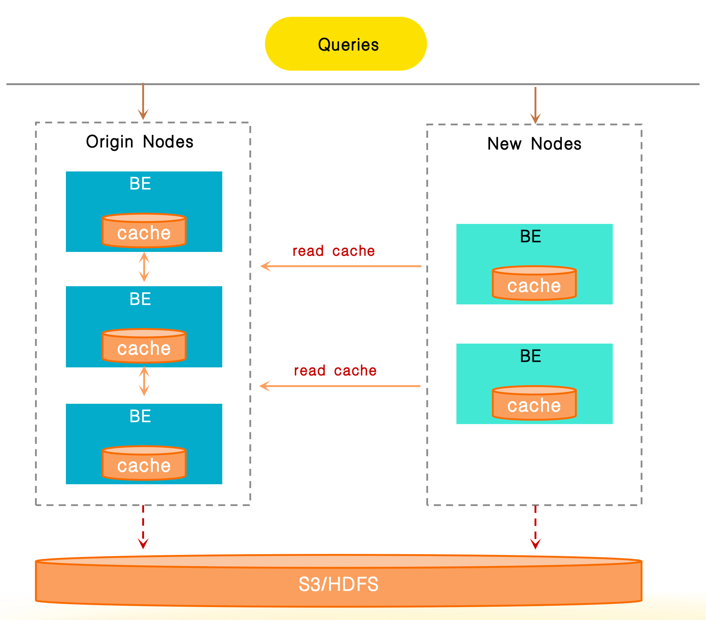

# Data Cache

了解 Data Cache 的核心原理以及如何通过 Data Cache 加速数据查询。

Data Cache 用于缓存内表和外部表的数据。该功能从 v3.3.0 开始默认启用。从 v4.0 开始，内存缓存和磁盘缓存已统一集成到 Data Cache 系统中，以便于管理。

Data Cache 由两个组件组成：Page Cache（内存缓存）和 Block Cache（磁盘缓存）。

## Page Cache 原理

作为内存缓存，Page Cache 负责存储解压后的内表和外部表的数据页。这些页的大小不固定。目前，Page Cache 支持缓存以下类型的数据：

- 内表的数据页和索引页
- 外部表数据文件的页脚信息
- 外部表的部分解压数据页

Page Cache 目前使用 LRU（最近最少使用）策略进行数据淘汰。

## Block Cache 原理

Block Cache 是基于磁盘的缓存，其主要功能是将数据文件（来自外部表，以及存算分离集群中的存算分离表）缓存到本地磁盘。这减少了远程数据访问延迟并提高查询效率。每个数据块的大小是固定的。

### 背景和价值

在数据湖分析和存算分离表场景中，StarRocks 作为一个 OLAP 查询引擎，需要扫描存储在 HDFS 或对象存储中的数据文件（以下简称“远端存储系统”）。此过程面临两个主要性能瓶颈：

- 查询需要读取的文件越多，远程 I/O 开销越大。
- 在即席查询场景中，频繁访问相同数据导致冗余的远程 I/O 消耗。

为了解决这些问题，Block Cache 功能在 v2.5 中引入。它根据特定策略将远端存储系统中的原始数据拆分为多个块，并将这些块缓存到 BE 或 CN 节点的本地磁盘中。通过避免重复检索远程数据，显著提高了对热点数据的查询性能。

### 场景

- 使用 External Catalog（除 JDBC Catalog 外）查询远端存储系统中的数据。
- 在存算分离集群中查询存算分离表。

### 核心机制

#### 数据拆分和缓存单元

当系统缓存远程文件时，它根据配置的策略将原始文件拆分为大小相等的块。一个块是最小的缓存单元，其大小是可定制的。

示例：

如果块大小配置为 1 MB，当在 Amazon S3 上查询一个 128 MB 的 Parquet 文件时，该文件将被拆分为 128 个连续的块（即 `[0, 1 MB)`，`[1 MB, 2 MB)`，...，`[127 MB, 128 MB)`）。

每个块被分配一个全局唯一的缓存标识符（缓存键），由以下三部分组成：

hash(filename) + fileModificationTime + blockId

| **组件**              | **描述**                                      |
| -------------------- | ---------------------------------------------- |
| filename             | 数据文件的名称。                               |
| fileModificationTime | 数据文件的最后修改时间。                       |
| blockId              | 数据文件拆分时分配给每个块的 ID。此 ID 在单个文件内是唯一的，但不是全局唯一的。 |

#### 缓存命中和读取过程

假设查询命中了范围 `[1 MB, 2 MB)` 内的块，Block Cache 的处理流程如下：

1. 系统首先检查本地 BE 节点的 Block Cache 中是否存在该块（通过匹配缓存键）。
2. 如果找到（缓存命中），则直接从本地磁盘读取该块。
3. 如果未找到（缓存未命中），则从远程存储中获取该块，并同步到本地 BE 节点的 Block Cache 以供后续查询重用。

### 缓存介质

Block Cache 使用 BE 或 CN 节点的本地磁盘作为其存储介质，缓存加速效果与磁盘性能直接相关：

- 建议使用高性能本地磁盘（例如 NVMe 磁盘）以最小化缓存读写延迟。
- 如果磁盘性能不佳，可以增加磁盘数量以实现负载均衡并减少单个磁盘的 I/O 压力。

### 缓存替换策略

Block Cache 支持两种数据缓存和淘汰策略：LRU 和 SLRU（分段 LRU）。

#### LRU

LRU 策略基于“最近最少使用”原则——淘汰最长时间未被访问的块。实现简单，适用于访问模式稳定的场景。

#### SLRU

SLRU 策略将缓存空间分为淘汰段和保护段，均遵循 LRU 规则：

1. 数据首次访问时进入淘汰段。
2. 淘汰段中的数据再次访问时提升到保护段。
3. 从保护段淘汰的数据回退到淘汰段，而从淘汰段淘汰的数据直接从缓存中移除。

SLRU 策略可以有效抵御突发的稀疏流量，防止“仅访问一次的临时数据”直接淘汰保护段中的热点数据。它比 LRU 提供更好的稳定性。

## 启用和配置 Data Cache

Data Cache 默认启用，由 BE 配置项 `datacache_enable` 控制（默认值：`true`）。Page Cache 和 Block Cache 作为两个独立的组件，也默认启用。将 `datacache_enable` 设置为 `false` 将禁用 Data Cache，即同时禁用 Page Cache 和 Block Cache。

您还可以使用不同的 BE 配置项分别激活或停用 Page Cache 和 Block Cache。

- Page Cache（默认启用）由 `disable_storage_page_cache` 控制（默认值：`false`）。
- Block Cache（默认启用）由 `block_cache_enable` 控制（默认值：`true`）。

您还可以使用以下 BE 配置来设置 Data Cache 的最大内存和磁盘使用限制，以防止资源占用过多：

- `datacache_mem_size`：设置 Data Cache 的最大内存使用限制（用于存储 Page Cache 中的数据）。
- `datacache_disk_size`：设置 Data Cache 的最大磁盘使用限制（用于存储 Block Cache 中的数据）。

## 填充 Block Cache

### 填充规则

从 v3.3.2 开始，为了提高 Block Cache 的缓存命中率，系统根据以下规则填充 Block Cache：

- 对于非 `SELECT` 的语句，例如 `ANALYZE TABLE` 和 `INSERT INTO SELECT`，不会填充缓存。
- 查询扫描表的所有分区时不会填充缓存。然而，如果表只有一个分区，则默认执行填充。
- 查询扫描表的所有列时不会填充缓存。然而，如果表只有一列，则默认执行填充。
- 对于非 Hive、Paimon、Delta Lake、Hudi 或 Iceberg 的表，不会填充缓存。

### 查看缓存填充行为

您可以使用 `EXPLAIN VERBOSE` 命令查看特定查询的填充行为。

示例：

```sql
mysql> EXPLAIN VERBOSE SELECT col1 FROM hudi_table;
...
|   0:HudiScanNode                        |
|      TABLE: hudi_table                  |
|      partitions=3/3                     |
|      cardinality=9084                   |
|      avgRowSize=2.0                     |
|      dataCacheOptions={populate: false} |
|      cardinality: 9084                  |
+-----------------------------------------+
```

`dataCacheOptions={populate: false}` 表示缓存不会被填充，因为查询将扫描所有分区。

您还可以通过会话变量 [`populate_datacache_mode`](../sql-reference/System_variable.md#populate_datacache_mode) 微调 Block Cache 的填充行为。

### 填充模式

Block Cache 支持两种模式，即同步填充和异步填充。您可以根据业务需求选择它们，以实现“首次查询性能”和“缓存效率”之间的平衡。

**同步填充**
- 核心逻辑：首次查询时读取远程数据，数据立即在本地缓存。后续查询可以直接重用缓存。
- 优点：缓存效率高，因为数据缓存在一次查询中完成。
- 缺点：缓存操作与读取操作同步执行，可能增加首次查询的延迟。

**异步填充**
- 核心逻辑：对于首次查询，优先完成数据读取。缓存写入在后台异步执行，不会阻塞当前查询过程。
- 优点：不会影响首次查询的性能，防止由于缓存而导致读取操作延迟。
- 缺点：缓存效率较低，因为单次查询可能无法完全缓存所有访问的数据。需要多次查询逐步提高缓存覆盖率。

从 v3.3.0 开始，异步缓存填充默认启用。您可以通过设置会话变量 [`enable_datacache_async_populate_mode`](../sql-reference/System_variable.md) 来更改填充模式。

### 持久化

磁盘中的缓存数据默认可以持久化，并且在 BE 或 CN 重启后可以重用这些数据。

## 检查查询是否命中数据缓存

您可以通过分析查询配置文件中的以下指标来检查查询是否命中 Data Cache：

- `DataCacheReadBytes`：系统直接从内存和磁盘读取的数据大小。
- `DataCacheWriteBytes`：从远程存储系统加载到内存和磁盘的数据大小。
- `BytesRead`：读取的总数据量，包括系统从远程存储系统、内存和磁盘读取的数据。

示例 1：在此示例中，系统从远程存储系统读取了大量数据（7.65 GB），而从磁盘读取的数据很少（518.73 MB）。这意味着很少有 Block Cache 被命中。

```Plain
 - Table: lineorder
 - DataCacheReadBytes: 518.73 MB
   - __MAX_OF_DataCacheReadBytes: 4.73 MB
   - __MIN_OF_DataCacheReadBytes: 16.00 KB
 - DataCacheReadCounter: 684
   - __MAX_OF_DataCacheReadCounter: 4
   - __MIN_OF_DataCacheReadCounter: 0
 - DataCacheReadTimer: 737.357us
 - DataCacheWriteBytes: 7.65 GB
   - __MAX_OF_DataCacheWriteBytes: 64.39 MB
   - __MIN_OF_DataCacheWriteBytes: 0.00 
 - DataCacheWriteCounter: 7.887K (7887)
   - __MAX_OF_DataCacheWriteCounter: 65
   - __MIN_OF_DataCacheWriteCounter: 0
 - DataCacheWriteTimer: 23.467ms
   - __MAX_OF_DataCacheWriteTimer: 62.280ms
   - __MIN_OF_DataCacheWriteTimer: 0ns
 - BufferUnplugCount: 15
   - __MAX_OF_BufferUnplugCount: 2
   - __MIN_OF_BufferUnplugCount: 0
 - BytesRead: 7.65 GB
   - __MAX_OF_BytesRead: 64.39 MB
   - __MIN_OF_BytesRead: 0.00
```

示例 2：在此示例中，系统从数据缓存中读取了大量数据（46.08 GB），而没有从远程存储系统读取数据，这意味着它仅从 Block Cache 中读取数据。

```Plain
Table: lineitem
- DataCacheReadBytes: 46.08 GB
 - __MAX_OF_DataCacheReadBytes: 194.99 MB
 - __MIN_OF_DataCacheReadBytes: 81.25 MB
- DataCacheReadCounter: 72.237K (72237)
 - __MAX_OF_DataCacheReadCounter: 299
 - __MIN_OF_DataCacheReadCounter: 118
- DataCacheReadTimer: 856.481ms
 - __MAX_OF_DataCacheReadTimer: 1s547ms
 - __MIN_OF_DataCacheReadTimer: 261.824ms
- DataCacheWriteBytes: 0.00 
- DataCacheWriteCounter: 0
- DataCacheWriteTimer: 0ns
- BufferUnplugCount: 1.231K (1231)
 - __MAX_OF_BufferUnplugCount: 81
 - __MIN_OF_BufferUnplugCount: 35
- BytesRead: 46.08 GB
 - __MAX_OF_BytesRead: 194.99 MB
 - __MIN_OF_BytesRead: 81.25 MB
```

## I/O 自适配

为了防止由于高缓存磁盘 I/O 负载导致的磁盘访问尾延迟显著，从而导致缓存系统的负优化，Data Cache 提供了 I/O 适配器功能。此功能在磁盘负载较高时，将部分缓存请求路由到远程存储，利用本地缓存和远程存储来提高 I/O 吞吐量。此功能默认启用。

您可以通过设置以下系统变量启用 I/O 适配器：

```SQL
SET GLOBAL enable_datacache_io_adaptor=true;
```

## 动态扩缩容

Data Cache 支持在不重启 BE 进程的情况下手动调整缓存容量，也支持自动调整缓存容量。

### 手动扩缩容

您可以通过动态调整 BE 配置项来修改 Data Cache 的内存限制或磁盘容量。

示例：

```SQL
-- 调整特定 BE 实例的 Data Cache 内存限制。
UPDATE be_configs SET VALUE="10G" WHERE NAME="datacache_mem_size" and BE_ID=10005;

-- 调整所有 BE 实例的 Data Cache 内存比例限制。
UPDATE be_configs SET VALUE="10%" WHERE NAME="datacache_mem_size";

-- 调整所有 BE 实例的 Data Cache 磁盘限制。
UPDATE be_configs SET VALUE="2T" WHERE NAME="datacache_disk_size";
```

:::note
- 请谨慎以这种方式调整容量。确保不要省略 WHERE 子句，以避免修改不相关的配置项。
- 以这种方式进行的缓存容量调整不会被持久化，并将在 BE 或 CN 进程重启后丢失。因此，您可以先按上述方式动态调整参数，然后手动修改 BE 或 CN 配置文件，以确保更改在下次重启后生效。
:::

### 自动扩缩容

StarRocks 目前支持磁盘容量的自动扩缩容。如果您未在 BE 配置中指定缓存磁盘路径和容量限制，则默认启用自动扩缩容。

您还可以通过在配置文件中添加以下配置项并重启 BE 或 CN 进程来启用自动扩缩容：

```Plain
datacache_auto_adjust_enable=true
```

启用自动扩缩容后：

- 当磁盘使用量超过 BE 配置指定的阈值 `disk_high_level`（默认值为 `90`，即磁盘空间的 90%）时，系统将自动淘汰缓存数据以释放磁盘空间。
- 当磁盘使用量持续低于 BE 配置指定的阈值 `disk_low_level`（默认值为 `60`，即磁盘空间的 60%），且 Data Cache 使用的当前磁盘空间已满时，系统将自动扩容缓存容量。
- 在自动扩缩容缓存容量时，系统将努力将缓存容量调整到 BE 配置指定的 `disk_safe_level`（默认值为 `80`，即磁盘空间的 80%）水平。

## 缓存共享

由于 Data Cache 依赖于 BE 节点的本地磁盘，当集群进行扩展时，数据路由的变化可能导致缓存未命中，这很容易在弹性扩展期间导致显著的性能下降。

缓存共享用于支持通过网络在节点之间访问缓存数据。在集群扩展期间，如果发生本地缓存未命中，系统首先尝试从同一集群中的其他节点获取缓存数据。只有在所有缓存未命中时，系统才会重新从远程存储中获取数据。此功能有效减少了弹性扩展期间缓存失效导致的性能抖动，并确保稳定的查询性能。



您可以通过配置以下两个项目启用缓存共享功能：

- 将 FE 配置项 `enable_trace_historical_node` 设置为 `true`。
- 将系统变量 `enable_datacache_sharing` 设置为 `true`。

此外，您可以在查询配置文件中检查以下指标以监控缓存共享：

- `DataCacheReadPeerCounter`：从其他节点读取的计数。
- `DataCacheReadPeerBytes`：从其他节点读取的字节数。
- `DataCacheReadPeerTimer`：从其他节点访问缓存数据所用的时间。

## 配置和变量

您可以使用以下系统变量和参数配置 Data Cache。

### 系统变量

- [populate_datacache_mode](../sql-reference/System_variable.md#populate_datacache_mode)
- [enable_datacache_io_adaptor](../sql-reference/System_variable.md#enable_datacache_io_adaptor)
- [enable_file_metacache](../sql-reference/System_variable.md#enable_file_metacache)
- [enable_datacache_async_populate_mode](../sql-reference/System_variable.md)
- [enable_datacache_sharing](../sql-reference/System_variable.md#enable_datacache_sharing)

### FE 配置

- [enable_trace_historical_node](../administration/management/FE_configuration.md#enable_trace_historical_node)

### BE 配置

- [datacache_enable](../administration/management/BE_configuration.md#datacache_enable)
- [datacache_mem_size](../administration/management/BE_configuration.md#datacache_mem_size)
- [datacache_disk_size](../administration/management/BE_configuration.md#datacache_disk_size)
- [datacache_auto_adjust_enable](../administration/management/BE_configuration.md#datacache_auto_adjust_enable)
- [datacache_disk_high_level](../administration/management/BE_configuration.md#datacache_disk_high_level)
- [datacache_disk_safe_level](../administration/management/BE_configuration.md#datacache_disk_safe_level)
- [datacache_disk_low_level](../administration/management/BE_configuration.md#datacache_disk_low_level)
- [datacache_disk_adjust_interval_seconds](../administration/management/BE_configuration.md#datacache_disk_adjust_interval_seconds)
- [datacache_disk_idle_seconds_for_expansion](../administration/management/BE_configuration.md#datacache_disk_idle_seconds_for_expansion)
- [datacache_min_disk_quota_for_adjustment](../administration/management/BE_configuration.md#datacache_min_disk_quota_for_adjustment)
- [datacache_eviction_policy](../administration/management/BE_configuration.md#datacache_eviction_policy)
- [datacache_inline_item_count_limit](../administration/management/BE_configuration.md#datacache_inline_item_count_limit)
