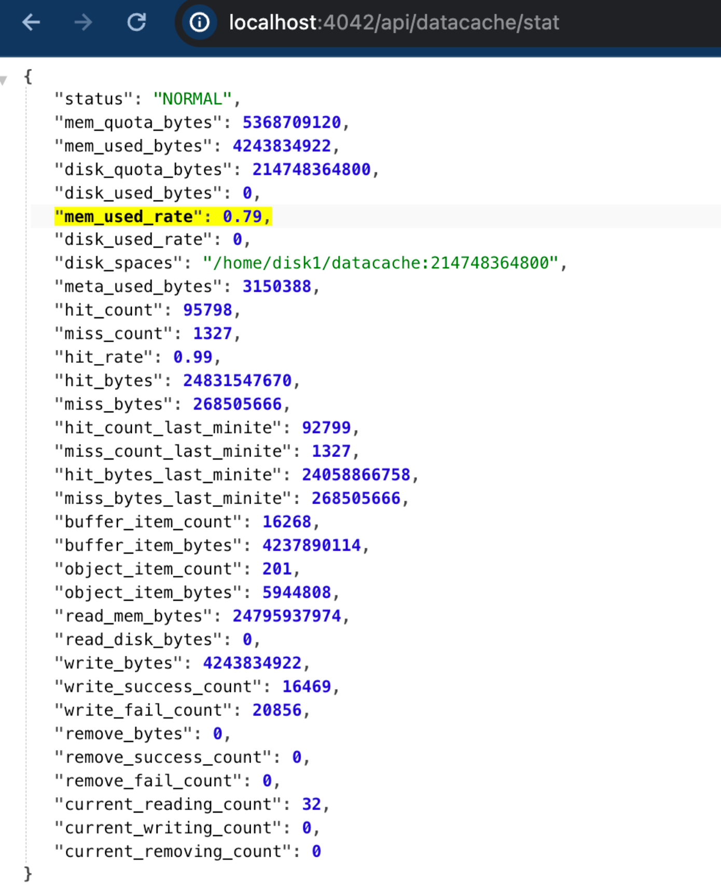

# Data Cache 常见问题解答

本主题描述了一些关于 Data Cache 的常见问题 (FAQ) ，并提供了这些问题的故障排除步骤和解决方案。

## 启用 Data Cache

### 如何确认 Data Cache 是否成功启用？

在大多数情况下，您可以通过以下任一方法检查 Data Cache 是否成功启用：

- 从您的 SQL 客户端执行 `SHOW BACKENDS`（或 `SHOW COMPUTE NODES`），并检查 `DataCacheMetrics` 的值。如果磁盘或内存缓存配额大于 0，则可以确认 Data Cache 已启用。

```SQL
mysql> show backends \G
*************************** 1. row ***************************
            BackendId: 89041
                   IP: X.X.X.X
        HeartbeatPort: 9050
               BePort: 9060
             HttpPort: 8040
             BrpcPort: 8060
        LastStartTime: 2025-05-29 14:45:37
        LastHeartbeat: 2025-05-29 19:20:32
                Alive: true
 SystemDecommissioned: false
ClusterDecommissioned: false
            TabletNum: 10
     DataUsedCapacity: 0.000 B
        AvailCapacity: 1.438 TB
        TotalCapacity: 1.718 TB
              UsedPct: 16.27 %
       MaxDiskUsedPct: 16.27 %
               ErrMsg:
              Version: main-c15b412
               Status: {"lastSuccessReportTabletsTime":"2025-05-29 19:20:30"}
    DataTotalCapacity: 1.438 TB
          DataUsedPct: 0.00 %
             CpuCores: 8
             MemLimit: 50.559GB
    NumRunningQueries: 0
           MemUsedPct: 0.50 %
           CpuUsedPct: 0.2 %
     DataCacheMetrics: Status: Normal, DiskUsage: 44MB/1TB, MemUsage: 0B/0B
             Location:
           StatusCode: OK
1 row in set (0.00 sec)
```

在上述示例中，Data Cache 的磁盘缓存配额为 1TB，当前使用了 44MB；而内存缓存配额为 0B，因此内存缓存未启用。

- 您可以访问 BE Web 控制台 (`http://${BE_HOST}:${BE_HTTP_PORT}/api/datacache/stat`) 来检查当前的 Data Cache 配额、命中率和其他指标。如果 `disk_quota_bytes` 或 `mem_quota_bytes` 大于 0，则可以确认 Data Cache 已启用。



### 为什么 Data Cache 在默认情况下未启用？

从 v3.3 开始，BE 会在启动时尝试启用 Data Cache。然而，如果当前磁盘上的可用空间不足，Data Cache 将不会自动启用。

这可能由以下情况导致：

- **百分比**：当前磁盘使用率较高。

- **剩余空间**：剩余磁盘空间较小。

因此，如果默认情况下未启用 Data Cache，您可以先检查当前磁盘使用情况，并在必要时增加磁盘容量。

或者，您可以根据当前可用磁盘空间手动配置缓存配额以启用 Data Cache。

```
# 禁用 Data Cache 自动调整
datacache_auto_adjust_enable = false
# 手动设置 Data Cache 磁盘配额
datacache_disk_size = 1T
```

## 使用 Data Cache

### Data Cache 支持哪些 Catalog 类型？

Data Cache 目前支持使用 StarRocks Native File Reader 的 External Catalog 类型（如 Parquet/ORC/CSV Reader），包括 Hive、Iceberg、Hudi、Delta Lake 和 Paimon。基于 JNI 访问数据的 Catalog（如 JDBC Catalog）尚不支持。

:::note
某些 Catalog 可能会根据特定条件（如文件类型和数据状态）使用不同的数据访问方法。例如，对于 Paimon Catalog，StarRocks 可能会根据当前数据的 Compaction 状态自动选择使用 Native File Reader 或 JNI 访问数据。当使用 JNI 访问 Paimon 数据时，不支持 Data Cache 加速。
:::

### 如何知道查询命中了缓存？

您可以在相应的 Query Profile 中查看与 Data Cache 相关的指标。指标 `DataCacheReadBytes` 和 `DataCacheReadCounter` 表示本地缓存的命中状态。

```
 - DataCacheReadBytes: 518.73 MB
   - __MAX_OF_DataCacheReadBytes: 4.73 MB
   - __MIN_OF_DataCacheReadBytes: 16.00 KB
 - DataCacheReadCounter: 684
   - __MAX_OF_DataCacheReadCounter: 4
   - __MIN_OF_DataCacheReadCounter: 0
 - DataCacheReadTimer: 737.357us
 - DataCacheWriteBytes: 7.65 GB
   - __MAX_OF_DataCacheWriteBytes: 64.39 MB
   - __MIN_OF_DataCacheWriteBytes: 0.00
 - DataCacheWriteCounter: 7.887K (7887)
   - __MAX_OF_DataCacheWriteCounter: 65
   - __MIN_OF_DataCacheWriteCounter: 0
 - DataCacheWriteTimer: 23.467ms
   - __MAX_OF_DataCacheWriteTimer: 62.280ms
   - __MIN_OF_DataCacheWriteTimer: 0ns
```

### 为什么在启用 Data Cache 时查询未命中缓存？

请按照以下步骤进行故障排除：

1. 检查 Data Cache 是否支持当前的 Catalog 类型。
2. 确认查询语句是否符合缓存填充条件。在某些情况下，Data Cache 会拒绝为某些查询填充缓存。详情请参见 [Data Cache 填充规则](./data_cache.md#填充规则)。

可以使用 `EXPLAIN VERBOSE` 命令检查查询是否触发了缓存填充。
示例：

```sql
mysql> EXPLAIN VERBOSE SELECT col1 FROM hudi_table;
|   0:HudiScanNode                        |
|      TABLE: hudi_table                  |
|      partitions=3/3                     |
|      cardinality=9084                   |
|      avgRowSize=2.0                     |
|      dataCacheOptions={populate: false} |
|      cardinality: 9084                  |
+-----------------------------------------+
```

在上述示例中，`dataCacheOptions` 部分的 `populate` 字段为 `false`，表示该查询不会填充缓存。

要为此类查询启用 Data Cache，您可以通过设置系统变量 `populate_datacache_mode` 为 `always` 来修改默认填充行为。

## Data Cache 命中

### 为什么有时同一个查询需要执行多次才能完全命中缓存？

在当前版本中，Data Cache 默认使用异步填充以减少对查询性能的影响。使用异步填充时，系统会尝试在后台缓存访问的数据，尽可能不影响读取性能。因此，单次执行查询只能缓存部分数据。您需要多次运行查询以缓存查询所需的所有数据。

您还可以通过设置 `enable_datacache_async_populate_mode=false` 使用同步缓存填充，或通过 `CACHE SELECT` 预先热身目标数据。

### 为什么当前查询中的所有数据都已缓存，但仍有少量数据被远程访问？

在当前版本中，默认启用了 I/O 适配功能，以在磁盘 I/O 负载较高时优化缓存性能，这可能导致在某些情况下少量请求直接访问远端存储。

您可以通过设置 `enable_datacache_io-adapter` 为 `false` 来禁用 I/O 适配功能。

## 其他

### 如何清除缓存的数据？

目前，Data Cache 不提供直接清除缓存数据的接口，但您可以选择以下方法之一来清除它：

- 您可以通过删除 BE/CN 节点上的 `datacache` 目录中的所有数据（包括块文件和元数据目录），然后重启节点来清理缓存数据。（推荐）

- 如果您想避免重启 BE/CN 节点，也可以在运行时通过缩小缓存配额间接清理缓存数据。例如，如果您之前将磁盘缓存配额设置为 2TB，您可以先将其缩小到 0（系统会自动清理缓存数据），然后再将其重置为 2TB。

示例：

```SQL
UPDATE be_configs SET VALUE="0" WHERE NAME="datacache_disk_size" and BE_ID=10005;
UPDATE be_configs SET VALUE="2T" WHERE NAME="datacache_disk_size" and BE_ID=10005;
```

:::note
在运行时清理缓存数据时，请谨慎使用语句中的 `WHERE` 条件，以避免意外损坏其他不相关的参数或节点。
:::

### 如何提高 Data Cache 性能？

使用 Data Cache 时，StarRocks 本质上是访问本地内存或磁盘而不是远端存储。因此，性能直接与本地缓存介质相关。如果您发现由于磁盘负载高导致缓存访问延迟较高，您可以考虑提高本地缓存介质的性能：

- 优先使用高性能 NVME 磁盘作为缓存磁盘。

- 如果没有高性能磁盘，您也可以增加磁盘数量以分担 I/O 压力。

- 增加 BE/CN 节点的服务器内存（而非 Data Cache 内存配额），使用操作系统的 Page Cache 来减少直接磁盘访问次数和磁盘 I/O 压力。
