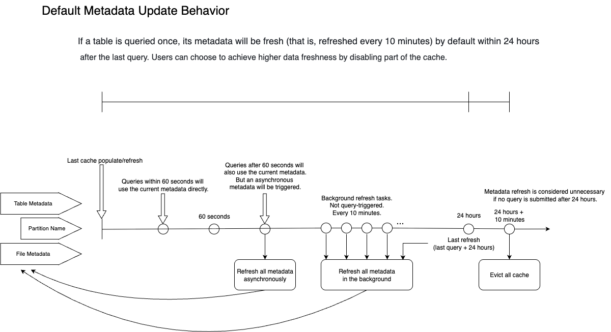

# 数据湖分析能力边界

从 v2.3 版本开始，StarRocks 支持通过 External Catalog 管理外部数据源和分析数据湖中的数据。

本文介绍了 External Catalog 的能力边界以及所涉及功能的支持版本。

## 通用功能

本节列出了 External Catalog 功能的通用功能，包括存储系统、File Reader、认证、权限和 Data Cache。

### 外部存储系统

| 存储系统                 | 支持版本 |
| :---------------------- | :------- |
| HDFS                    | v2.3+    |
| AWS S3                  | v2.3+    |
| Microsoft Azure Storage | v3.0+    |
| Google GCS              | v3.0+    |
| 阿里云 OSS               | v3.1+    |
| 华为云 OBS               | v3.1+    |
| 腾讯云 COS               | v3.1+    |
| 火山引擎 TOS             | v3.1+    |
| 金山云 KS3               | v3.1+    |
| MinIO                   | v3.1+    |
| Ceph S3                 | v3.1+    |

除了对上述存储系统的原生支持，StarRocks 还支持以下类型的对象存储：

- **兼容 HDFS 的对象存储，如 COS Cloud HDFS、OSS-HDFS 和 OBS PFS**
  - **描述**：需要在 BE 配置项 `fallback_to_hadoop_fs_list` 中指定对象存储 URI 前缀，并将云厂商提供的 .jar 包上传到目录 **/lib/hadoop/hdfs/** 中。创建 External Catalog 时需要使用在 `fallback_to_hadoop_fs_list` 中指定的前缀。
  - **支持版本**：v3.1.9+、v3.2.4+
- **其他兼容 S3 的对象存储服务**
  - **描述**：需要在 BE 配置项 `s3_compatible_fs_list` 中指定对象存储 URI 前缀。创建 External Catalog 时需要使用在`s3_compatible_fs_list`中指定的前缀。
  - **支持版本**：v3.1.9+、v3.2.4+

### 压缩格式

本节仅列出了每种文件格式支持的压缩格式。有关各 External Catalog 支持的文件格式，请参阅对应章节。

| 文件格式      | 压缩格式                                                       |
| :----------- | :----------------------------------------------------------- |
| Parquet      | NO_COMPRESSION, SNAPPY, LZ4, ZSTD, GZIP, LZO (v3.1.5+)       |
| ORC          | NO_COMPRESSION, ZLIB, SNAPPY, LZO, LZ4, ZSTD                 |
| Text         | NO_COMPRESSION, LZO (v3.1.5+)                                |
| Avro         | NO_COMPRESSION (v3.2.1+), DEFLATE (v3.2.1+), SNAPPY (v3.2.1+), BZIP2 (v3.2.1+) |
| RCFile       | NO_COMPRESSION (v3.2.1+), DEFLATE (v3.2.1+), SNAPPY (v3.2.1+), GZIP (v3.2.1+) |
| SequenceFile | NO_COMPRESSION (v3.2.1+), DEFLATE (v3.2.1+), SNAPPY (v3.2.1+), BZIP2 (v3.2.1+), GZIP (v3.2.1+) |

:::note

Avro、RCFile 和 SequenceFile 文件格式是通过 Java Native Interface（JNI）读取的，而非 StarRocks 原生 Reader。因此，对比 Parquet 和 ORC 格式，这些文件格式的读取性能可能较低。

:::

### 管理、认证和权限

| 特性                      | 描述                                                         | 支持版本 |
| :----------------------- | :----------------------------------------------------------- | :------- |
| Information Schema       | External Catalog 支持 Information Schema。                   | v3.2+    |
| 数据湖访问控制             | External Catalog 支持 StarRocks 原生 RBAC。您可以像管理 StarRocks 内部数据一样，管理 External Catalog 中数据库、表和视图（目前仅支持 Hive 视图和 Iceberg 视图）的权限。 | v3.0+    |
| 复用 Ranger 外部 Service  | 支持复用 Apache Ranger 上的外部 Service（如 Hive Service）进行访问控制。 | v3.1.9+  |
| Kerberos 认证            | 支持 HDFS 或 Hive Metastore 的 Kerberos 认证。                  | v2.3+    |

### Data Cache

| 特性                           | 描述                                                         | 支持版本 |
| :----------------------------- | :----------------------------------------------------------- | :------- |
| Data Cache (Block Cache)       | 从 v2.5 开始，StarRocks 支持基于 CacheLib 实现的 Data Cache 功能（当时称为 Block Cache）。由于其可扩展性有限，从v3.0开始，StarRocks 重构了缓存功能，并添加了新功能，使 Data Cache 的性能在每个后续版本中逐渐提升。 | v2.5+    |
| 磁盘间数据 Rebalance           | 支持数据 Rebalance 策略，确保数据倾斜控制在 10% 以内。       | v3.2+    |
| Data Cache 替换 Block Cache    | **参数变更** BE 参数：<ul><li>`datacache_enable` 取代 `block_cache_enable`</li><li>`datacache_mem_size` 取代 `block_cache_mem_size`</li><li>`datacache_disk_size` 取代 `block_cache_disk_size`</li><li>`datacache_disk_path` 取代 `block_cache_disk_path`</li><li>`datacache_meta_path` 取代 `block_cache_meta_path`</li><li>`datacache_block_size` 取代 `block_cache_block_size`</li></ul>系统变量：<ul><li>`enable_scan_datacache` 取代 `enable_scan_block_cache`</li><li>`enable_populate_datacache` 取代 `enable_populate_block_cache`</li></ul>在集群升级到支持 Data Cache 的版本后，Block Cache 参数仍然生效。但一旦启用 Data Cache，新参数将覆盖旧参数。不支持混用两组参数，否则部分参数将不生效。 | v3.2+    |
| Data Cache 监控 API 新增指标   | 支持独立的 API 监控 Data Cache，包括缓存容量和命中率。可以通过接口 `http://${BE_HOST}:${BE_HTTP_PORT}/api/datacache/stat` 查看 Data Cache 的指标。 | v3.2.3+  |
| Data Cache 支持 Memory Tracker | Data Cache 支持 Memory Tracker。可以通过接口 `http://${BE_HOST}:${BE_HTTP_PORT}/mem_tracker` 查看内存相关指标。 | v3.1.8+  |
| Data Cache Warmup              | 通过执行 CACHE SELECT，可以主动将所需数据从远程存储提前加载到缓存中，防止第一次查询时因获取数据花费过多时间。CACHE SELECT 不会打印数据或产生计算，只会拉取数据。 | v3.3+    |

## Hive Catalog

### 元数据

通过 Hive catalogs 执行对 Hive 数据的查询时，StarRocks 会缓存表的元数据，以减少频繁访问远端存储的成本。此机制在确保数据新鲜度的同时，通过异步刷新和过期策略来保证查询性能。

### 缓存的元数据

StarRocks 在查询期间将缓存以下元数据：

- **表或分区级元数据**
  - 内容：
    - 表信息：数据库、表结构、列名和分区键
    - 分区信息：分区列表和分区位置
  - 影响：检测表是否存在（表是否被删除和/或重新创建）
  - Catalog 属性：
    - `enable_metastore_cache`：控制是否启用 metastore 缓存。默认值：`true`。
    - `metastore_cache_refresh_interval_sec`：控制缓存元数据被视为新鲜的时间间隔。默认值：`60`。单位：秒。
  - 位置：Metastore (HMS 或 Glue)

- **分区名称列表**
  - 内容：用于查找和修剪分区的分区名称列表。虽然分区名称列表已作为上述部分的分区信息收集，但在某些情况下有单独的配置来启用或禁用此功能。
  - 影响：检测分区是否存在（是否有新分区或分区被删除和/或重新创建）
  - Catalog 属性：
    - `enable_cache_list_names`：控制是否启用分区名称列表缓存。默认值：`true`。
    - `metastore_cache_refresh_interval_sec`：控制缓存元数据被视为新鲜的时间间隔。默认值：`60`。单位：秒。
  - 位置：Metastore (HMS 或 Glue)

- **文件级元数据**
  - 内容：分区文件夹下的文件路径。
  - 影响：将数据加载到现有分区。
  - Catalog 属性：
    - `enable_remote_file_cache`：控制是否启用远端存储中文件的元数据缓存。默认值：`true`。
    - `remote_file_cache_refresh_interval_sec`：控制文件元数据被视为新鲜的时间间隔。默认值：`60`。单位：秒。
    - `remote_file_cache_memory_ratio`：控制可用于文件元数据缓存的内存比例。默认值：`0.1`（10%）。
  - 位置：远端存储 (HDFS 或 S3)

### 异步更新策略

以下 FE 配置项控制异步元数据更新策略：

| 配置项                                                     | 默认值                              | 描述                                                         |
| ---------------------------------------------------------- | ----------------------------------- | ------------------------------------------------------------ |
| enable_background_refresh_connector_metadata               | v3.0 中为 `true` v2.5 中为 `false` | 是否启用定期的元数据缓存刷新。启用后，StarRocks 会轮询 metastore，并刷新频繁访问的 external catalog 的缓存元数据，以感知数据变化。`true` 表示启用 Hive 元数据缓存刷新，`false` 表示禁用。此项是一个 [FE 动态参数](../administration/management/FE_configuration.md#configure-fe-dynamic-parameters)。可以使用 [ADMIN SET FRONTEND CONFIG](../sql-reference/sql-statements/cluster-management/config_vars/ADMIN_SET_CONFIG.md) 命令进行修改。 |
| background_refresh_metadata_interval_millis                | `600000`（10 分钟）                 | 两次连续元数据缓存刷新的间隔。单位：毫秒。此项是一个 [FE 动态参数](../administration/management/FE_configuration.md#configure-fe-dynamic-parameters)。可以使用 [ADMIN SET FRONTEND CONFIG](../sql-reference/sql-statements/cluster-management/config_vars/ADMIN_SET_CONFIG.md) 命令进行修改。 |
| background_refresh_metadata_time_secs_since_last_access_secs | `86400`（24 小时）                  | 元数据缓存刷新任务的过期时间。对于已访问的 external catalog，如果超过指定时间未被访问，StarRocks 将停止刷新其缓存元数据。对于未被访问的 external catalog，StarRocks 不会刷新其缓存元数据。单位：秒。此项是一个 [FE 动态参数](../administration/management/FE_configuration.md#configure-fe-dynamic-parameters)。可以使用 [ADMIN SET FRONTEND CONFIG](../sql-reference/sql-statements/cluster-management/config_vars/ADMIN_SET_CONFIG.md) 命令进行修改。 |

### 元数据缓存行为

本节使用默认行为来解释元数据在元数据更新和查询期间的行为。

默认情况下，当查询一个表时，StarRocks 会缓存该表、分区和文件的元数据，并在接下来的 24 小时内保持活跃。在这 24 小时内，系统将确保缓存至少每 10 分钟刷新一次（注意，10 分钟是元数据刷新轮次的估计时间。如果有过多的 external table 待刷新元数据，整体元数据刷新间隔可能超过 10 分钟）。如果一个表超过 24 小时未被访问，StarRocks 将丢弃相关的元数据。换句话说，您在 24 小时内进行的任何查询，最坏情况下将使用 10 分钟前的元数据。

具体来说：

1. 假设第一个查询涉及表 `A` 的分区 `P1`。StarRocks 缓存表级元数据、分区名称列表和 `P1` 下的文件路径信息。缓存在查询执行时同步填充。
2. 如果在缓存填充后 60 秒内提交第二个查询，并命中表 `A` 的分区 `P1`，StarRocks 将直接使用元数据缓存，此时 StarRocks 认为所有缓存的元数据都是新鲜的（`metastore_cache_refresh_interval_sec` 和 `remote_file_cache_refresh_interval_sec` 控制 StarRocks 认为元数据新鲜的时间窗口）。
3. 如果在 90 秒后提交第三个查询，并命中表 `A` 的分区 `P1`，StarRocks 仍将直接使用元数据缓存来完成查询。然而，由于自上次元数据刷新以来已超过 60 秒，StarRocks 将认为元数据已过期。因此，StarRocks 将启动对过期元数据的异步刷新。异步刷新不会影响当前查询的结果，因为查询仍将使用过时的元数据。
4. 由于表 `A` 的分区 `P1` 已被查询，预计在接下来的 24 小时内（由 `background_refresh_metadata_time_secs_since_last_access_secs` 控制），元数据将每 10 分钟（由 `background_refresh_metadata_interval_millis` 控制）刷新一次。元数据刷新轮次之间的实际间隔还取决于系统内的整体待刷新任务。
5. 如果表 `A` 在 24 小时内未参与任何查询，StarRocks 将在 24 小时后删除其元数据缓存。

### 最佳实践

元数据获取的性能很大程度取决于用户的 HMS 或 HDFS NameNode 的性能。请综合考虑所有因素并根据测试结果做出判断。

- **[默认设置 推荐] 性能最佳，可以容忍分钟级别的数据不一致**
  - **设置**：无需设置，默认情况下，10 分钟内更新的数据不可见。在此期间，查询将返回旧数据。
  - **优点**：查询性能最佳
  - **缺点**：延迟引起的数据不一致
  - **支持版本**：v2.5.5+（在 v2.5 中默认禁用，在 v3.0+ 中默认启用）
- **数据导入（产生新文件）立即可见，不依赖手动 Refresh**
  - **设置**：通过将 Catalog 属性 `enable_remote_file_cache` 设置为 `false` 禁用底层数据文件的元数据缓存。
  - **优点**：文件变更无延迟可见
  - **缺点**：禁用文件元数据缓存后，由于每次查询必须访问文件列表，导致性能较低。
  - **支持版本**：v2.5.5+
- **分区增减立即可见，不依赖手动 Refresh**
  - **设置**：通过将 Catalog 属性 `enable_cache_list_names` 设置为 `false` 禁用 Hive 分区名缓存。
  - **优点**：分区变更无延迟可见
  - **缺点**：禁用分区列表缓存后，由于每次查询必须访问分区列表，导致性能较低。
  - **支持版本**：v2.5.5+

:::tip

如果您在 HMS 性能不佳的情况下需要实时获取变更，可以启用缓存，禁用自动增量更新，并通过调度系统在上游数据变更时手动调用 REFRESH EXTERNAL TABLE 命令刷新元数据。

:::

### 存储系统

| **特性**       | 描述                                                         | 支持版本                                                     |
| :------------- | :----------------------------------------------------------- | :----------------------------------------------------------- |
| 递归读取子目录 | 通过将 Catalog 属性 `enable_recursive_listing` 设置为 `true` 启用递归读取子目录。启用递归读取后，StarRocks 将递归读取表或者分区目录（包括子目录）中文件的数据。该特性旨在解决文件目录嵌套多层的问题。 | v2.5.9+ v3.0.4+（v2.5 和 v3.0 版本默认禁用，v3.1+ 版本默认启用） |

### 文件格式和数据类型

#### 文件格式

| 特性 | 支持的文件格式                                 |
| :--- | :--------------------------------------------- |
| 读取 | Parquet、ORC、TEXT、Avro、RCFile、SequenceFile |
| 写入 | Parquet (v3.2+), ORC (v3.3+), TEXT (v3.3+)     |

#### 数据类型

不支持 INTERVAL、BINARY 和 UNION 类型。

TEXT 格式的 Hive 表不支持 MAP 和 STRUCT 类型。

### Hive 视图

StarRocks 从 v3.1.0 版本开始支持查询 Hive 视图。

:::note 当 StarRocks 执行 Hive 视图的查询时，会尝试使用 StarRocks 和 Trino 的语法解析视图定义。如果 StarRocks 无法解析视图定义，将返回错误。使用 Hive 或 Spark 独有函数创建的 Hive 视图可能无法被 StarRocks 解析。

:::

### 查询统计接口

| 特性                                        | 支持版本 |
| :------------------------------------------ | :------- |
| 支持通过 SHOW CREATE TABLE 查看 Hive 表结构 | v3.0+    |
| 支持通过 ANALYZE 收集统计信息               | v3.2+    |
| 支持收集直方图和 STRUCT 子字段统计信息      | v3.3+    |

### 数据写入

| 特性                   | 支持版本 | 备注                                                         |
| :--------------------- | :------- | :----------------------------------------------------------- |
| CREATE DATABASE        | v3.2+    | 可以选择为在 Hive 中创建的数据库指定 Location。如果未指定数据库的 Location，则在该数据库下建表时需要指定 Location，否则将返回错误。如果已指定数据库的 Location，则建表时未指定 Location 将继承数据库的 Location。如果同时指定了数据库和表的 Location，最终生效的是表的 Location。 |
| CREATE TABLE           | v3.2+    | 支持分区表和非分区表。                                       |
| CREATE TABLE AS SELECT | v3.2+    |                                                              |
| INSERT INTO/OVERWRITE  | v3.2+    | 支持分区表和非分区表。                                       |
| CREATE TABLE LIKE      | v3.2.4+  |                                                              |
| 写出文件大小           | v3.3+    | 可以通过变量 `connector_sink_target_max_file_size` 指定每个写出文件的大小。 |

## Iceberg Catalog

### 元数据

通过 Iceberg catalogs 执行对 Iceberg 数据的查询时，StarRocks 会缓存表的元数据，以减少频繁访问远端存储的成本。此机制在确保数据新鲜度的同时，通过异步刷新和过期策略来保证查询性能。

### 缓存的元数据

StarRocks 在查询期间将缓存以下元数据：

- **元数据指针缓存**
  - 内容：元数据指针的 JSON 文件
    - 快照 ID
    - 清单列表的位置
  - 影响：检测数据变化（如果发生数据变化，快照 ID 将更改。）
  - Catalog 属性：
    - `enable_iceberg_metadata_cache`：控制是否启用 Iceberg 元数据缓存。默认值：`true`。
    - `iceberg_table_cache_refresh_interval_sec`：控制缓存元数据被视为新鲜的时间间隔。默认值：`60`。单位：秒。

- **元数据缓存**
  - 内容：
    - 数据文件路径的清单
    - 删除文件路径的清单
    - 数据库
    - 分区（用于物化视图重写）
  - 影响：
    - 不会影响查询的数据新鲜度，因为数据或删除文件的清单不能更改。
    - 可能影响物化视图重写，导致查询错过物化视图。当快照 ID 刷新时，分区元数据将被删除。因此，新快照 ID 缺少分区元数据，导致错过物化视图重写。
  - Catalog 属性：
    - `enable_cache_list_names`：控制是否启用分区名称列表缓存。默认值：`true`。
    - `metastore_cache_refresh_interval_sec`：控制缓存元数据被视为新鲜的时间间隔。默认值：`60`。单位：秒。
    - `iceberg_data_file_cache_memory_usage_ratio`：控制可用于数据文件元数据缓存的内存比例。默认值：`0.1`（10%）。
    - `iceberg_delete_file_cache_memory_usage_ratio`：控制可用于删除文件元数据缓存的内存比例。默认值：`0.1`（10%）。

### 异步更新策略

以下 FE 配置项控制异步元数据更新策略：

| 配置项                                                     | 默认值                              | 描述                                                         |
| ---------------------------------------------------------- | ----------------------------------- | ------------------------------------------------------------ |
| enable_background_refresh_connector_metadata               | v3.0 中为 `true` v2.5 中为 `false` | 是否启用定期的元数据缓存刷新。启用后，StarRocks 会轮询 metastore，并刷新频繁访问的 external catalog 的缓存元数据，以感知数据变化。`true` 表示启用 Hive 元数据缓存刷新，`false` 表示禁用。此项是一个 [FE 动态参数](../administration/management/FE_configuration.md#configure-fe-dynamic-parameters)。可以使用 [ADMIN SET FRONTEND CONFIG](../sql-reference/sql-statements/cluster-management/config_vars/ADMIN_SET_CONFIG.md) 命令进行修改。 |
| background_refresh_metadata_interval_millis                | `600000`（10 分钟）                 | 两次连续元数据缓存刷新的间隔。单位：毫秒。此项是一个 [FE 动态参数](../administration/management/FE_configuration.md#configure-fe-dynamic-parameters)。可以使用 [ADMIN SET FRONTEND CONFIG](../sql-reference/sql-statements/cluster-management/config_vars/ADMIN_SET_CONFIG.md) 命令进行修改。 |
| background_refresh_metadata_time_secs_since_last_access_secs | `86400`（24 小时）                  | 元数据缓存刷新任务的过期时间。对于已访问的 external catalog，如果超过指定时间未被访问，StarRocks 将停止刷新其缓存元数据。对于未被访问的 external catalog，StarRocks 不会刷新其缓存元数据。单位：秒。此项是一个 [FE 动态参数](../administration/management/FE_configuration.md#configure-fe-dynamic-parameters)。可以使用 [ADMIN SET FRONTEND CONFIG](../sql-reference/sql-statements/cluster-management/config_vars/ADMIN_SET_CONFIG.md) 命令进行修改。 |

### 元数据缓存行为

本节使用默认行为来解释元数据在元数据更新和查询期间的行为。

默认情况下，当查询一个表时，StarRocks 会缓存该表的元数据，并在接下来的 24 小时内保持活跃。在这 24 小时内，系统将确保缓存至少每 10 分钟刷新一次（注意，10 分钟是元数据刷新轮次的估计时间。如果有过多的 external table 待刷新元数据，整体元数据刷新间隔可能超过 10 分钟）。如果一个表超过 24 小时未被访问，StarRocks 将丢弃相关的元数据。换句话说，您在 24 小时内进行的任何查询，最坏情况下将使用 10 分钟前的元数据。

具体来说：

1. 假设第一个查询涉及表 `A`。StarRocks 缓存其最新的快照和元数据。缓存在查询执行时同步填充。
2. 如果在缓存填充后 60 秒内提交第二个查询，并命中表 `A`，StarRocks 将直接使用元数据缓存，此时 StarRocks 认为所有缓存的元数据都是新鲜的（`iceberg_table_cache_refresh_interval_sec` 控制 StarRocks 认为元数据新鲜的时间窗口）。
3. 如果在 90 秒后提交第三个查询，并命中表 `A`，StarRocks 仍将直接使用元数据缓存来完成查询。然而，由于自上次元数据刷新以来已超过 60 秒，StarRocks 将认为元数据已过期。因此，StarRocks 将启动对过期元数据的异步刷新。异步刷新不会影响当前查询的结果，因为查询仍将使用过时的元数据。
4. 由于表 `A` 已被查询，预计在接下来的 24 小时内（由 `background_refresh_metadata_time_secs_since_last_access_secs` 控制），元数据将每 10 分钟（由 `background_refresh_metadata_interval_millis` 控制）刷新一次。元数据刷新轮次之间的实际间隔还取决于系统内的整体待刷新任务。
5. 如果表 `A` 在 24 小时内未参与任何查询，StarRocks 将在 24 小时后删除其元数据缓存。

### 最佳实践

Iceberg Catalog 支持 HMS、Glue 和 Tabular 作为其元数据服务。大多数情况下推荐使用默认配置。

请注意，为适应不同场景，变量 `enable_iceberg_metadata_cache` 的默认值已更改：

- 在 v3.2.1 到 v3.2.3 版本，该参数默认值统一为 `true`。
- 自 v3.2.4 版本起，如果 Iceberg 集群的元数据服务为 AWS Glue，该参数默认值仍为 `true`，如果 Iceberg 集群的元数据服务为 Hive Metastore 或其他，则该参数默认值变更为 `false`。
- 自 v3.3.0 起，由于 StarRocks 支持了新的 Iceberg 元数据框架，此参数默认值重新设置为 `true`。Iceberg Catalog 和 Hive Catalog 现在使用相同的元数据轮询机制和 FE 配置项`background_refresh_metadata_interval_millis`。

| 特性                                                         | 支持版本 |
| :----------------------------------------------------------- | :------- |
| Distributed metadata plan (推荐在元数据体量较大的场景使用)   | v3.3+    |
| Manifest Cache (推荐在元数据体量较小但对返回时延较为敏感的场景使用) | v3.3+    |

自 v3.3.0 起，StarRocks 支持上述的元数据读取和缓存策略。策略的选择会根据您集群的机器情况来自动调整，通常您不需要进行修改。由于开启了元数据缓存，有可能因性能牺牲了元数据新鲜度，您可以根据具体的查询要求进行调整：

- **[默认设置 推荐] 性能最佳，可以容忍分钟级别的数据不一致**
  - **设置**：无需设置，默认情况下，10 分钟内更新的数据不可见。在此期间，查询将返回旧数据。
  - **优点**：查询性能最佳
  - **缺点**：延迟引起的数据不一致
- **数据导入（产生新文件）立即可见，或者分区增减立即可见，不依赖手动 Refresh**
  - **设置**：通过将 Catalog 属性 `iceberg_table_cache_ttl_sec` 设置为 `0``，使 StarRocks 每次查询都去获取新的 snapshot。
  - **优点**：文件和分区变更无延迟可见
  - **缺点**：由于每次查询必须查找新的 snapshot，导致性能较低。

### File formats

| 特性 | 支持的文件格式 |
| :--- | :------------- |
| 读取 | Parquet、ORC   |
| 写入 | Parquet        |

- Parquet 格式和 ORC 格式的 Iceberg V1 表均支持 Position Delete 和 Equality Delete。
- ORC 格式的 Iceberg V2 表从 v3.0.0 版本开始支持 Position Delete，Parquet 格式从 v3.1.0 版本开始支持 Position Delete。
- ORC 格式的 Iceberg V2 表从 v3.1.8 和 v3.2.3 版本开始支持 Equality Delete，Parquet 格式从 v3.2.5 版本开始支持 Equality Delete。

### Iceberg 视图

StarRocks 从 v3.3.2 版本开始支持查询 Iceberg 视图，并从 v3.5 版本开始支持创建 Iceberg 视图。

目前仅支持读取通过 StarRocks 创建的视图。从 v3.5 版本开始，支持为已有的 Iceberg 视图增加 StarRocks 语法风格的定义。

### 查询统计接口

| 特性                                           | 支持版本 |
| :--------------------------------------------- | :------- |
| 支持通过 SHOW CREATE TABLE 查看 Iceberg 表结构 | v3.0+    |
| 支持通过 ANALYZE 收集统计信息                  | v3.2+    |
| 支持收集直方图和 STRUCT 子字段统计信息         | v3.3+    |

### 数据写入

| 特性                   | 支持版本 | 备注                                                         |
| :--------------------- | :------- | :----------------------------------------------------------- |
| CREATE DATABASE        | v3.1+    | 可以选择为在 Iceberg 中创建的数据库指定 Location。如果未指定数据库的 Location，则在该数据库下建表时需要指定 Location，否则将返回错误。如果已指定数据库的 Location，则建表时未指定 Location 将继承数据库的 Location。如果同时指定了数据库和表的 Location，最终生效的是表的 Location。 |
| CREATE TABLE           | v3.1+    | 支持分区表和非分区表。                                       |
| CREATE TABLE AS SELECT | v3.1+    |                                                              |
| INSERT INTO/OVERWRITE  | v3.1+    | 支持分区表和非分区表。                                       |

### 其他支持

| 特性                                                         | 支持版本                           |
| :----------------------------------------------------------- | :--------------------------------- |
| 支持读取 TIMESTAMP 类型的分区格式 `yyyy-MM-ddTHH:mm` 和 `yyyy-MM-dd HH:mm`。 | v2.5.19+ v3.1.9+ v3.2.3+ |
| 支持读取 Iceberg 元数据表。                                     | v3.4.1+                          |
| 支持 Iceberg 时间旅行。                                        | v3.4.0+                          |

## Hudi Catalog

- StarRocks 支持查询 Hudi 中 Parquet 格式的数据，Parquet 文件支持 SNAPPY、LZ4、ZSTD、GZIP 和 NO_COMPRESSION 压缩格式。
- StarRocks 完整支持 Hudi 的 Copy On Write (COW) 表和 Merge On Read (MOR) 表。
- 从 v3.0.0 开始，StarRocks 支持使用 SHOW CREATE TABLE 查看 Hudi 表结构。
- StarRocks v3.5.0 支持 Hudi 版本为 0.15.0。 

## Delta Lake Catalog

- StarRocks 支持查询 Delta Lake 中 Parquet 格式的数据，Parquet 文件支持 SNAPPY、LZ4、ZSTD、GZIP 和 NO_COMPRESSION 压缩格式。
- StarRocks 不支持查询 Delta Lake 中的 MAP 类型和 STRUCT 类型的数据。
- 从 v3.0.0 开始，StarRocks 支持使用 SHOW CREATE TABLE 查看 Delta Lake 表结构。
- 目前，Delta Lake Catalog 支持以下表功能：
  - V2 Checkpoint（从 v3.3.0 开始）
  - 无时区的时间戳（从 v3.3.1 开始）
  - 列映射（从 v3.3.6 开始）
  - Deletion Vector（从 v3.4.1 开始）

## JDBC Catalog

| Catalog 类型 | 支持版本 |
| :----------- | :------- |
| MySQL        | v3.0+    |
| PostgreSQL   | v3.0+    |
| ClickHouse   | v3.3+    |
| Oracle       | v3.2.9+  |
| SQLServer    | v3.2.9+  |

### MySQL

| 特性         | 支持版本 |
| :----------- | :------- |
| 元数据 Cache | v3.3+    |

#### 数据类型对应关系

| MySQL             | StarRocks           | 支持版本             |
| :---------------- | :------------------ | :------------------- |
| BOOLEAN           | BOOLEAN             | v2.3+                |
| BIT               | BOOLEAN             | v2.3+                |
| SIGNED TINYINT    | TINYINT             | v2.3+                |
| UNSIGNED TINYINT  | SMALLINT            | v3.0.6+ v3.1.2+ |
| SIGNED SMALLINT   | SMALLINT            | v2.3+                |
| UNSIGNED SMALLINT | INT                 | v3.0.6+ v3.1.2+ |
| SIGNED INTEGER    | INT                 | v2.3+                |
| UNSIGNED INTEGER  | BIGINT              | v3.0.6+ v3.1.2+ |
| SIGNED BIGINT     | BIGINT              | v2.3+                |
| UNSIGNED BIGINT   | LARGEINT            | v3.0.6+ v3.1.2+ |
| FLOAT             | FLOAT               | v2.3+                |
| REAL              | FLOAT               | v3.0.1+              |
| DOUBLE            | DOUBLE              | v2.3+                |
| DECIMAL           | DECIMAL32           | v2.3+                |
| CHAR              | VARCHAR(columnsize) | v2.3+                |
| VARCHAR           | VARCHAR             | v2.3+                |
| TEXT              | VARCHAR(columnsize) | v3.0.1+              |
| DATE              | DATE                | v2.3+                |
| TIME              | TIME                | v3.1.9+ v3.2.4+ |
| TIMESTAMP         | DATETIME            | v2.3+                |

### PostgreSQL

#### 数据类型对应关系

| PGGSQL     | StarRocks           | 支持版本 |
| :-------- | :------------------ | :------- |
| BIT       | BOOLEAN             | v2.3+    |
| SMALLINT  | SMALLINT            | v2.3+    |
| INTEGER   | INT                 | v2.3+    |
| BIGINT    | BIGINT              | v2.3+    |
| REAL      | FLOAT               | v2.3+    |
| DOUBLE    | DOUBLE              | v2.3+    |
| NUMERIC   | DECIMAL32           | v2.3+    |
| CHAR      | VARCHAR(columnsize) | v2.3+    |
| VARCHAR   | VARCHAR             | v2.3+    |
| TEXT      | VARCHAR(columnsize) | v2.3+    |
| DATE      | DATE                | v2.3+    |
| TIMESTAMP | DATETIME            | v2.3+    |
| UUID      | VARBINARY           | v3.5.3+  |

### ClickHouse 

自 v3.3.0 起支持。

### Oracle

自 v3.2.9 起支持。

### SQL Server

自 v3.2.9 起支持。

## Elasticsearch Catalog

Elasticsearch Catalog 自 v3.1.0 起支持。

## Paimon Catalog

Paimon Catalog 自 v3.1.0 起支持。

## MaxCompute Catalog

MaxCompute Catalog 自 v3.3.0 起支持。

## Kudu Catalog

Kudu Catalog 自 v3.3.0 起支持。

