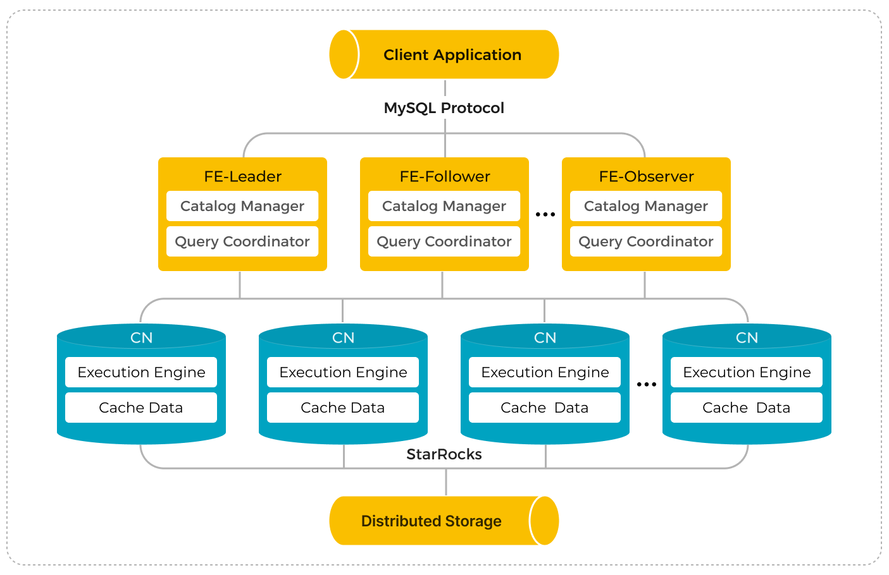

import Tabs from '@theme/Tabs';
import TabItem from '@theme/TabItem';
import ManualPrep from '../_assets/deployment/manual_prep.mdx'

# 手动部署存算分离 StarRocks

<ManualPrep />

本文介绍如何手动部署 StarRocks 存算分离集群。其他安装方式请参考[部署概览](../deployment/deployment_overview.md)。

如果要部署存算一体集群（BE 同时做数据存储和计算），参见 [手动部署存算一体 StarRocks](./deploy_manually.md)。

## 概述

StarRocks 存算分离集群采用了存储计算分离架构，特别为云存储设计。在存算分离的模式下，StarRocks 将数据存储在远程存储（例如 HDFS、AWS S3、GCS、OSS、Azure Blob、Azure Data Lake Storage 以及 MinIO）中，而本地盘作为热数据缓存，用以加速查询。通过存储计算分离架构，您可以降低存储成本并且优化资源隔离。除此之外，集群的弹性扩展能力也得以加强。在查询命中缓存的情况下，存算分离集群的查询性能与存算一体集群性能一致。

StarRocks 存算分离集群由 FE 和 CN 组成。CN 取代了存算一体集群中的 BE。

相对存算一体架构，StarRocks 的存储计算分离架构提供以下优势：

- 廉价且可无缝扩展的存储。
- 弹性可扩展的计算能力。由于数据不存储在 CN 节点中，因此集群无需进行跨节点数据迁移或 Shuffle 即可完成扩缩容。
- 热数据的本地磁盘缓存，用以提高查询性能。
- 可选异步导入数据至远程存储，提高导入效率。

存算分离集群的架构如下：



## 第一步：启动 Leader FE 节点

以下操作在 FE 实例上执行。

1. 创建元数据存储路径。建议将元数据存储在与 FE 部署文件不同的路径中。请确保此路径存在并且您拥有写入权限。

   ```Bash
   # 将 <meta_dir> 替换为您要创建的元数据目录。
   mkdir -p <meta_dir>
   ```

2. 进入先前准备好的 [StarRocks FE 部署文件](../deployment/prepare_deployment_files.md)所在路径，修改 FE 配置文件 **fe/conf/fe.conf**。


   a. 设定存算分离运行模式。

      ```YAML
      run_mode = shared_data
      ```

   b. 在配置项 `meta_dir` 中指定元数据路径。

      ```YAML
      # 将 <meta_dir> 替换为您已创建的元数据目录。
      meta_dir = <meta_dir>
      ```

   c. 如果任何在 [环境配置清单](../deployment/environment_configurations.md) 中提到的 FE 端口被占用，您必须在 FE 配置文件中为其分配其他可用端口。

      ```YAML
      http_port = aaaa               # 默认值：8030
      rpc_port = bbbb                # 默认值：9020
      query_port = cccc              # 默认值：9030
      edit_log_port = dddd           # 默认值：9010
      cloud_native_meta_port = eeee  # 默认值：6090
      ```

      > **注意**
      >
      > 如需在集群中部署多个 FE 节点，您必须为所有 FE 节点分配相同的 `http_port`。

   d. 如需为集群启用 IP 地址访问，您必须在配置文件中添加配置项 `priority_networks`，为 FE 节点分配一个专有的 IP 地址（CIDR格式）。如需为集群启用 [FQDN 访问](../administration/management/enable_fqdn.md)，则可以忽略该配置项。

      ```YAML
      priority_networks = x.x.x.x/x
      ```

      > **说明**
      >
      > - 您可以在终端中运行 `ifconfig` 以查看当前实例拥有的 IP 地址。
      > - 从 v3.3.0 开始，StarRocks 支持基于 IPv6 的部署。

   e. 如果您的实例安装了多个 JDK，并且您要使用 JDK 与环境变量 `JAVA_HOME` 中指定的不同，则必须在配置文件中添加配置项 `JAVA_HOME` 来指定所选该 JDK 的安装路径。

      ```YAML
      # 将 <path_to_JDK> 替换为所选 JDK 的安装路径。
      JAVA_HOME = <path_to_JDK>
      ```

   更多高级配置项请参考 [参数配置 - FE 配置项](../administration/management/FE_configuration.md)。

3. 启动 FE 节点。

   - 如需为集群启用 IP 地址访问，请运行以下命令启动 FE 节点：

     ```Bash
     ./fe/bin/start_fe.sh --daemon
     ```

   - 如需为集群启用 FQDN 访问，请运行以下命令启动 FE 节点：:

     ```Bash
     ./fe/bin/start_fe.sh --host_type FQDN --daemon
     ```

     您只需在第一次启动节点时指定参数 `--host_type`。

     > **注意**
     >
     > 如需启用 FQDN 访问，在启动 FE 节点之前，请确保您已经在 **/etc/hosts** 中为所有实例分配了主机名。有关详细信息，请参考 [环境配置清单 - 主机名](../deployment/environment_configurations.md#主机名)。

4. 查看 FE 日志，检查 FE 节点是否启动成功。

   ```Bash
   cat fe/log/fe.log | grep thrift
   ```

   如果日志打印以下内容，则说明该 FE 节点启动成功：

   "2022-08-10 16:12:29,911 INFO (UNKNOWN x.x.x.x_9010_1660119137253(-1)|1) [FeServer.start():52] thrift server started with port 9020."

## 第二步：启动 CN 服务

:::note

只能将 BE 节点添加到存算一体集群中，或将 CN 节点添加到存算分离集群中。否则，可能会导致无法预料的行为。

:::

以下操作在 BE 实例上执行。您可以使用 BE 部署文件部署 CN 节点。

1. 创建数据缓存路径。建议将数据存储在与 BE 部署文件不同的路径中。请确保此路径存在并且您拥有写入权限。

   ```Bash
   # 将 <storage_root_path> 替换为您要创建的数据缓存路径。
   mkdir -p <storage_root_path>
   ```

2. 进入先前准备好的 [StarRocks BE 部署文件](../deployment/prepare_deployment_files.md)所在路径，修改 CN 配置文件 **be/conf/cn.conf**。

   a.  在配置项 `storage_root_path` 中指定数据路径。多块盘配置使用分号（;）隔开。例如：`/data1;/data2`。

      ```YAML
      # 将 <storage_root_path> 替换为您创建的数据路径。
      storage_root_path = <storage_root_path>
      ```

      本地缓存在查询频率较高且被查询的数据为最新数据的情况下非常有效，但以下情况下您可以关闭本地缓存。

      - 在一个具有按需缩放的 CN pod 的 Kubernetes 环境中，pod 可能没有附加存储卷。
      - 当查询的数据大部分是位于远程存储中的旧数据时，如果查询不频繁，缓存数据的命中率可能很低，此时开启本地缓存并不能显著提升查询性能。

      如需关闭本地数据缓存：

      ```YAML
      storage_root_path =
      ```

      > **说明**
      >
      > 本地缓存数据将存储在 **`<storage_root_path>/starlet_cache`** 路径下。

   b. 如果任何在 [环境配置清单](../deployment/environment_configurations.md) 中提到的 BE 端口被占用，您必须在 BE 配置文件中为其分配其他可用端口。

      ```YAML
      be_port = vvvv                   # 默认值：9060
      be_http_port = xxxx              # 默认值：8040
      heartbeat_service_port = yyyy    # 默认值：9050
      brpc_port = zzzz                 # 默认值：8060
      starlet_port = uuuu              # 默认值：9070
      ```

   c. 如需为集群启用 IP 地址访问，您必须在配置文件中添加配置项 `priority_networks`，为 BE 节点分配一个专有的 IP 地址（CIDR格式）。如需为集群启用 FQDN 访问，则可以忽略该配置项。

      ```YAML
      priority_networks = x.x.x.x/x
      ```

      > **说明**
      >
      > - 您可以在终端中运行 `ifconfig` 以查看当前实例拥有的 IP 地址。
      > - 从 v3.3.0 开始，StarRocks 支持基于 IPv6 的部署。

   d. 如果您的实例安装了多个 JDK，并且您要使用 JDK 与环境变量 `JAVA_HOME` 中指定的不同，则必须在配置文件中添加配置项 `JAVA_HOME` 来指定所选该 JDK 的安装路径。

      ```YAML
      # 将 <path_to_JDK> 替换为所选 JDK 的安装路径。
      JAVA_HOME = <path_to_JDK>
      ```

   由于大部分 CN 参数都继承自 BE 节点，您可以参考 [参数配置 - BE 配置项](../administration/management/BE_configuration.md) 了解更多 CN 高级配置项。

3. 启动 CN 节点。

   ```Bash
   ./be/bin/start_cn.sh --daemon
   ```

   > **注意**
   >
   > - 如需启用 FQDN 访问，在启动 CN 节点之前，请确保您已经在 **/etc/hosts** 中为所有实例分配了主机名。有关详细信息，请参考 [环境配置清单 - 主机名](../deployment/environment_configurations.md#主机名)。
   > - 启动 CN 节点时无需指定参数 `--host_type`。

4. 查看 CN 日志，检查 CN 节点是否启动成功。

   ```Bash
   cat be/log/cn.INFO | grep heartbeat
   ```

   如果日志打印以下内容，则说明该 CN 节点启动成功："I0313 15:03:45.820030 412450 thrift_server.cpp:375] heartbeat has started listening port on 9050"

5. 在其他实例上重复以上步骤，即可启动新的 CN 节点。

## 第三步：搭建集群

当所有 FE 和 CN 节点启动成功后，即可搭建 StarRocks 集群。

以下过程在 MySQL 客户端实例上执行。您必须安装 MySQL 客户端（5.5.0 或更高版本）。

1. 通过 MySQL 客户端连接到 StarRocks。您需要使用初始用户 `root` 登录，密码默认为空。

   ```Bash
   # 将 <fe_address> 替换为 Leader FE 节点的 IP 地址（priority_networks）或 FQDN，
   # 并将 <query_port>（默认：9030）替换为您在 fe.conf 中指定的 query_port。
   mysql -h <fe_address> -P<query_port> -uroot
   ```

2. 执行以下 SQL 查看 Leader FE 节点状态。

   ```SQL
   SHOW PROC '/frontends'\G
   ```

   示例：

   ```Plain
   MySQL [(none)]> SHOW PROC '/frontends'\G
   *************************** 1. row ***************************
                Name: x.x.x.x_9010_1686810741121
                  IP: x.x.x.x
         EditLogPort: 9010
            HttpPort: 8030
           QueryPort: 9030
             RpcPort: 9020
                Role: LEADER
           ClusterId: 919351034
                Join: true
               Alive: true
   ReplayedJournalId: 1220
       LastHeartbeat: 2023-06-15 15:39:04
            IsHelper: true
              ErrMsg: 
           StartTime: 2023-06-15 14:32:28
             Version: 3.0.0-48f4d81
   1 row in set (0.01 sec)
   ```

   - 如果字段 `Alive` 为 `true`，说明该 FE 节点正常启动并加入集群。
   - 如果字段 `Role` 为 `FOLLOWER`，说明该 FE 节点有资格被选为 Leader FE 节点。
   - 如果字段 `Role` 为 `LEADER`，说明该 FE 节点为 Leader FE 节点。

3. 添加 CN 节点至集群。

   ```SQL
   -- 将 <cn_address> 替换为 CN 节点的 IP 地址（priority_networks）或 FQDN，
   -- 并将 <heartbeat_service_port>（默认：9050）替换为您在 cn.conf 中指定的 heartbeat_service_port。
   ALTER SYSTEM ADD COMPUTE NODE "<cn_address>:<heartbeat_service_port>", "<cn2_address>:<heartbeat_service_port>", "<cn3_address>:<heartbeat_service_port>";
   ```

   > **说明**
   >
   > 您可以通过一条 SQL 添加多个 CN 节点。每对 `<cn_address>:<heartbeat_service_port>` 代表一个 CN 节点。

4. 执行以下 SQL 查看 CN 节点状态。

   ```SQL
   SHOW PROC '/compute_nodes'\G
   ```

   示例：

   ```Plain
   MySQL [(none)]> SHOW PROC '/compute_nodes'\G
   *************************** 1. row ***************************
           ComputeNodeId: 10003
                      IP: x.x.x.x
           HeartbeatPort: 9050
                  BePort: 9060
                HttpPort: 8040
                BrpcPort: 8060
           LastStartTime: 2023-03-13 15:11:13
           LastHeartbeat: 2023-03-13 15:11:13
                   Alive: true
    SystemDecommissioned: false
   ClusterDecommissioned: false
                  ErrMsg: 
                 Version: 2.5.2-c3772fb
   1 row in set (0.00 sec)
   ```

   如果字段 `Alive` 为 `true`，说明该 CN 节点正常启动并加入集群。

## 第四步：（可选）部署高可用 FE 集群

高可用的 FE 集群需要在 StarRocks 集群中部署至少三个 Follower FE 节点。如需部署高可用的 FE 集群，您需要额外再启动两个新的 FE 节点。

1. 通过 MySQL 客户端连接到 StarRocks。您需要使用初始用户 `root` 登录，密码默认为空。

   ```Bash
   # 将 <fe_address> 替换为 Leader FE 节点的 IP 地址（priority_networks）或 FQDN，
   # 并将 <query_port>（默认：9030）替换为您在 fe.conf 中指定的 query_port。
   mysql -h <fe_address> -P<query_port> -uroot
   ```

2. 执行以下 SQL 将额外的 FE 节点添加至集群。

   ```SQL
   -- 将 <new_fe_address> 替换为您需要添加的新 FE 节点的 IP 地址（priority_networks）或 FQDN，
   -- 并将 <edit_log_port>（默认：9010）替换为您在新 FE 节点的 fe.conf 中指定的 edit_log_port。
   ALTER SYSTEM ADD FOLLOWER "<new_fe_address>:<edit_log_port>";
   ```

   > **说明**
   >
   > - 您只能通过一条 SQL 添加一个 Follower FE 节点。
   > - 如需添加更多的 Observer FE 节点，请执行 `ALTER SYSTEM ADD OBSERVER "<fe_address>:<edit_log_port>"`。有关详细说明，请参考 [ALTER SYSTEM - FE](../sql-reference/sql-statements/cluster-management/nodes_processes/ALTER_SYSTEM.md)。

3. 在新的 FE 示例上启动终端，创建元数据存储路径，进入 StarRocks 部署目录，并修改 FE 配置文件 **fe/conf/fe.conf**。详细信息，请参考 [第一步：启动 Leader FE 节点](#第一步启动-leader-fe-节点)。

   配置完成后，通过以下命令为新 Follower FE 节点分配 helper 节点，并启动新 FE 节点：

   > **说明**
   >
   > 向集群中添加新的 Follower FE 节点时，您必须在首次启动新 FE 节点时为其分配一个 helper 节点（本质上是一个现有的 Follower FE 节点）以同步所有 FE 元数据信息。

   - 如已为集群启用 IP 地址访问，请运行以下命令启动 FE 节点：

   ```Bash
   # 将 <helper_fe_ip> 替换为 Leader FE 节点的 IP 地址（priority_networks），
   # 并将 <helper_edit_log_port>（默认：9010）替换为 Leader FE 节点的 edit_log_port。
   ./fe/bin/start_fe.sh --helper <helper_fe_ip>:<helper_edit_log_port> --daemon
   ```

   您只需在第一次启动节点时指定参数 `--helper`。

   - 如已为集群启用 FQDN 访问，请运行以下命令启动 FE 节点：

   ```Bash
   # 将 <helper_fqdn> 替换为 Leader FE 节点的 FQDN，
   # 并将 <helper_edit_log_port>（默认：9010）替换为 Leader FE 节点的 edit_log_port。
   ./fe/bin/start_fe.sh --helper <helper_fqdn>:<helper_edit_log_port> \
         --host_type FQDN --daemon
   ```

   您只需在第一次启动节点时指定参数 `--helper` 和 `--host_type`。

4. 查看 FE 日志，检查 FE 节点是否启动成功。

   ```Bash
   cat fe/log/fe.log | grep thrift
   ```

   如果日志打印以下内容，则说明该 FE 节点启动成功：

   "2022-08-10 16:12:29,911 INFO (UNKNOWN x.x.x.x_9010_1660119137253(-1)|1) [FeServer.start():52] thrift server started with port 9020."

5. 重复上述步骤 2、3 和 4 直至启动所有 Follower FE 节点后，通过 MySQL 客户端查看 FE 节点状态。

   ```SQL
   SHOW PROC '/frontends'\G
   ```

   示例：

   ```Plain
   MySQL [(none)]> SHOW PROC '/frontends'\G
   *************************** 1. row ***************************
                Name: x.x.x.x_9010_1686810741121
                  IP: x.x.x.x
         EditLogPort: 9010
            HttpPort: 8030
           QueryPort: 9030
             RpcPort: 9020
                Role: LEADER
           ClusterId: 919351034
                Join: true
               Alive: true
   ReplayedJournalId: 1220
       LastHeartbeat: 2023-06-15 15:39:04
            IsHelper: true
              ErrMsg: 
           StartTime: 2023-06-15 14:32:28
             Version: 3.0.0-48f4d81
   *************************** 2. row ***************************
                Name: x.x.x.x_9010_1686814080597
                  IP: x.x.x.x
         EditLogPort: 9010
            HttpPort: 8030
           QueryPort: 9030
             RpcPort: 9020
                Role: FOLLOWER
           ClusterId: 919351034
                Join: true
               Alive: true
   ReplayedJournalId: 1219
       LastHeartbeat: 2023-06-15 15:39:04
            IsHelper: true
              ErrMsg: 
           StartTime: 2023-06-15 15:38:53
             Version: 3.0.0-48f4d81
   *************************** 3. row ***************************
                Name: x.x.x.x_9010_1686814090833
                  IP: x.x.x.x
         EditLogPort: 9010
            HttpPort: 8030
           QueryPort: 9030
             RpcPort: 9020
                Role: FOLLOWER
           ClusterId: 919351034
                Join: true
               Alive: true
   ReplayedJournalId: 1219
       LastHeartbeat: 2023-06-15 15:39:04
            IsHelper: true
              ErrMsg: 
           StartTime: 2023-06-15 15:37:52
             Version: 3.0.0-48f4d81
   3 rows in set (0.02 sec)
   ```

   - 如果字段 `Alive` 为 `true`，说明该 FE 节点正常启动并加入集群。
   - 如果字段 `Role` 为 `FOLLOWER`，说明该 FE 节点有资格被选为 Leader FE 节点。
   - 如果字段 `Role` 为 `LEADER`，说明该 FE 节点为 Leader FE 节点。

## 第五步：创建并设定默认存储卷

为了确保 StarRocks 存算分离集群有权限在远程数据源中存储数据，您必须在创建数据库或云原生表时引用存储卷。存储卷由远程数据存储系统的属性和凭证信息组成。在部署新 StarRocks 存算分离集群时，在启动后必须先创建和设置默认存储卷，然后才能在集群中创建数据库和表。

选择您的云服务提供商和相关服务，并执行相应的语句来创建并设置默认存储卷。

<Tabs groupId="cloud">

<TabItem value="s3" label="AWS S3" default>

以下示例使用 IAM User 认证为 AWS S3 存储空间 `defaultbucket` 创建存储卷 `def_volume`，激活[分区前缀](../sql-reference/sql-statements/cluster-management/storage_volume/CREATE_STORAGE_VOLUME.md#分区前缀)功能，并将其设置为默认存储卷：

```SQL
CREATE STORAGE VOLUME def_volume
TYPE = S3
LOCATIONS = ("s3://defaultbucket")
PROPERTIES
(
    "enabled" = "true",
    "aws.s3.region" = "us-west-2",
    "aws.s3.endpoint" = "https://s3.us-west-2.amazonaws.com",
    "aws.s3.use_aws_sdk_default_behavior" = "false",
    "aws.s3.use_instance_profile" = "false",
    "aws.s3.access_key" = "xxxxxxxxxx",
    "aws.s3.secret_key" = "yyyyyyyyyy",
    "aws.s3.enable_partitioned_prefix" = "true"
);

SET def_volume AS DEFAULT STORAGE VOLUME;
```

</TabItem>

<TabItem value="gcs" label="Google Cloud Storage">

以下示例使用 HMAC Access Key 以及 Secret Key 认证为 GCS 存储空间 `defaultbucket` 创建存储卷 `def_volume`，激活并将其设置为默认存储卷：

```SQL
CREATE STORAGE VOLUME def_volume
TYPE = GS
LOCATIONS = ("gs://defaultbucket")
PROPERTIES
(
    "enabled" = "true",
    "gcp.gcs.use_compute_engine_service_account" = "false",
    "gcp.gcs.service_account_email" = "<google_service_account_email>",
    "gcp.gcs.service_account_private_key_id" = "<google_service_private_key_id>",
    "gcp.gcs.service_account_private_key" = "<google_service_private_key>"
);

SET def_volume AS DEFAULT STORAGE VOLUME;
```

</TabItem>

<TabItem value="azureblob" label="Azure Blob Storage">

以下示例使用 Shared Key 认证为 Azure Blob 存储空间 `defaultbucket` 创建存储卷 `def_volume`，激活并将其设置为默认存储卷：

```SQL
CREATE STORAGE VOLUME def_volume
TYPE = AZBLOB
LOCATIONS = ("azblob://defaultbucket/test/")
PROPERTIES
(
    "enabled" = "true",
    "azure.blob.endpoint" = "<endpoint_url>",
    "azure.blob.shared_key" = "<shared_key>"
);

SET def_volume AS DEFAULT STORAGE VOLUME;
```

</TabItem>

<TabItem value="adls2" label="Azure Data Lake Storage Gen2">

以下示例使用 SAS 认证为 Azure Data Lake Storage Gen2 文件系统 `testfilesystem` 创建存储卷 `adls2`，并禁用该存储卷：

```SQL
CREATE STORAGE VOLUME adls2
    TYPE = ADLS2
    LOCATIONS = ("adls2://testfilesystem/starrocks")
    PROPERTIES (
        "enabled" = "false",
        "azure.adls2.endpoint" = "<endpoint_url>",
        "azure.adls2.sas_token" = "<sas_token>"
    );
```

</TabItem>

<TabItem value="minio" label="MinIO">

以下示例使用 Access Key 以及 Secret Key 认证为 MinIO 存储空间 `defaultbucket` 创建存储卷 `def_volume`，激活[分区前缀](../sql-reference/sql-statements/cluster-management/storage_volume/CREATE_STORAGE_VOLUME.md#分区前缀)功能，并将其设置为默认存储卷：

```SQL
CREATE STORAGE VOLUME def_volume
TYPE = S3
LOCATIONS = ("s3://defaultbucket")
PROPERTIES
(
    "enabled" = "true",
    "aws.s3.region" = "us-west-2",
    "aws.s3.endpoint" = "https://hostname.domainname.com:portnumber",
    "aws.s3.access_key" = "xxxxxxxxxx",
    "aws.s3.secret_key" = "yyyyyyyyyy",
    "aws.s3.enable_partitioned_prefix" = "true"
);

SET def_volume AS DEFAULT STORAGE VOLUME;
```

</TabItem>

<TabItem value="HDFS" label="HDFS">

以下示例为 HDFS 存储创建存储卷 `def_volume`，激活并将其设置为默认存储卷：

```SQL
CREATE STORAGE VOLUME def_volume
TYPE = HDFS
LOCATIONS = ("hdfs://127.0.0.1:9000/user/starrocks/");

SET def_volume AS DEFAULT STORAGE VOLUME;
```

</TabItem>

</Tabs>

除了上述的认证方式外，StarRocks 还支持多种用于访问远程存储的认证信息。有关详细说明，请参阅 [CREATE STORAGE VOLUME - 认证信息](../sql-reference/sql-statements/cluster-management/storage_volume/CREATE_STORAGE_VOLUME.md#认证信息)。

## 使用存算分离 StarRocks

StarRocks 存算分离集群的使用也类似于 StarRocks 存算一体集群，不同之处在于存算分离集群需要使用存储卷和云原生表才能将数据持久化到 HDFS 或远程存储。

### 创建数据库和云原生表

创建默认存储卷后，您可以使用该存储卷创建数据库和云原生表。

StarRocks 存算分离集群支持所有[表类型](../table_design/table_types/table_types.md)。

以下示例创建数据库 `cloud_db`，并创建明细表 `detail_demo`，启用本地磁盘缓存，将热数据有效期设置为一个月，并禁用异步数据导入：

```SQL
CREATE DATABASE cloud_db;
USE cloud_db;
CREATE TABLE IF NOT EXISTS detail_demo (
    recruit_date  DATE           NOT NULL COMMENT "YYYY-MM-DD",
    region_num    TINYINT        COMMENT "range [-128, 127]",
    num_plate     SMALLINT       COMMENT "range [-32768, 32767] ",
    tel           INT            COMMENT "range [-2147483648, 2147483647]",
    id            BIGINT         COMMENT "range [-2^63 + 1 ~ 2^63 - 1]",
    password      LARGEINT       COMMENT "range [-2^127 + 1 ~ 2^127 - 1]",
    name          CHAR(20)       NOT NULL COMMENT "range char(m),m in (1-255) ",
    profile       VARCHAR(500)   NOT NULL COMMENT "upper limit value 65533 bytes",
    ispass        BOOLEAN        COMMENT "true/false")
DUPLICATE KEY(recruit_date, region_num)
DISTRIBUTED BY HASH(recruit_date, region_num)
PROPERTIES (
    "storage_volume" = "def_volume",
    "datacache.enable" = "true",
    "datacache.partition_duration" = "1 MONTH"
);
```

> **说明**
>
> 当您在 StarRocks 存算分离集群中创建数据库或云原生表时，如果未指定存储卷，StarRocks 将使用默认存储卷。

#### `PROPERTIES`

除了常规表 PROPERTIES 之外，您还需要在创建表时指定以下 PROPERTIES：

#### `datacache.enable`

是否启用本地磁盘缓存。默认值：`true`。

- `true`：数据会同时导入对象存储（或 HDFS）和本地磁盘（作为查询加速的缓存）。
- `false`：数据仅导入到对象存储中。

> **说明**
>
> 如需启用本地磁盘缓存，必须在 CN 配置项 `storage_root_path` 中指定磁盘目录。

#### `datacache.partition_duration`

热数据的有效期。当启用本地磁盘缓存时，所有数据都会导入至本地磁盘缓存中。当缓存满时，StarRocks 会从缓存中删除最近较少使用（Less recently used）的数据。当有查询需要扫描已删除的数据时，StarRocks 会从当前时间开始，检查该数据是否在有效期内。如果数据在有效期内，StarRocks 会再次将数据导入至缓存中。如果数据不在有效期内，StarRocks 不会将其导入至缓存中。该属性为字符串，您可以使用以下单位指定：`YEAR`、`MONTH`、`DAY` 和 `HOUR`，例如，`7 DAY` 和 `12 HOUR`。如果不指定，StarRocks 将所有数据都作为热数据进行缓存。

> **说明**
>
> 仅当 `datacache.enable` 设置为 `true` 时，此属性可用。

### 查看表信息

您可以通过 `SHOW PROC "/dbs/<db_id>"` 查看特定数据库中的表的信息。详细信息，请参阅 [SHOW PROC](../sql-reference/sql-statements/cluster-management/nodes_processes/SHOW_PROC.md)。

示例：

```Plain
mysql> SHOW PROC "/dbs/xxxxx";
+---------+-------------+----------+---------------------+--------------+--------+--------------+--------------------------+--------------+---------------+------------------------------+
| TableId | TableName   | IndexNum | PartitionColumnName | PartitionNum | State  | Type         | LastConsistencyCheckTime | ReplicaCount | PartitionType | StoragePath                  |
+---------+-------------+----------+---------------------+--------------+--------+--------------+--------------------------+--------------+---------------+------------------------------+
| 12003   | detail_demo | 1        | NULL                | 1            | NORMAL | CLOUD_NATIVE | NULL                     | 8            | UNPARTITIONED | s3://xxxxxxxxxxxxxx/1/12003/ |
+---------+-------------+----------+---------------------+--------------+--------+--------------+--------------------------+--------------+---------------+------------------------------+
```

StarRocks 存算分离集群中表的 `Type` 为 `CLOUD_NATIVE`。`StoragePath` 字段为表在对象存储中的路径。

### 向 StarRocks 存算分离集群导入数据

StarRocks 存算分离集群支持 StarRocks 提供的所有导入方式。详细信息，请参阅 [导入方案](../loading/Loading_intro.md)。

### 在 StarRocks 存算分离集群查询

StarRocks 存算分离集群支持 StarRocks 提供的所有查询方式。详细信息，请参阅 [SELECT](../sql-reference/sql-statements/table_bucket_part_index/SELECT/SELECT.md)。

> **说明**
>
> 自 v3.4.0 起，StarRocks 存算分离集群支持[同步物化视图](../using_starrocks/Materialized_view-single_table.md)。

## 停止 StarRocks 集群

您可以通过在相应实例上运行以下命令来停止 StarRocks 集群。

- 停止 FE 节点。

  ```Bash
  ./fe/bin/stop_fe.sh
  ```

- 停止 CN 节点。

  ```Bash
  ./be/bin/stop_cn.sh
  ```

## 故障排除

如果启动 FE 或 CN 节点失败，尝试以下步骤来发现问题：

- 如果 FE 节点没有正常启动，您可以通过查看 **fe/log/fe.warn.log** 中的日志来确定问题所在。

  ```Bash
  cat fe/log/fe.warn.log
  ```

  确定并解决问题后，您首先需要终止当前 FE 进程，删除现有的 **meta** 路径，新建元数据存储路径，然后以正确的配置重启该 FE 节点。

- 如果 CN 节点没有正常启动，您可以通过查看 **be/log/cn.WARNING** 中的日志来确定问题所在。

  ```Bash
  cat be/log/cn.WARNING
  ```

  确定并解决问题后，您首先需要终止当前 CN 进程，然后以正确的配置重启该 CN 节点。

## 下一步

成功部署 StarRocks 集群后，您可以参考 [部署后设置](../deployment/post_deployment_setup.md) 以获取有关初始管理措施的说明。
