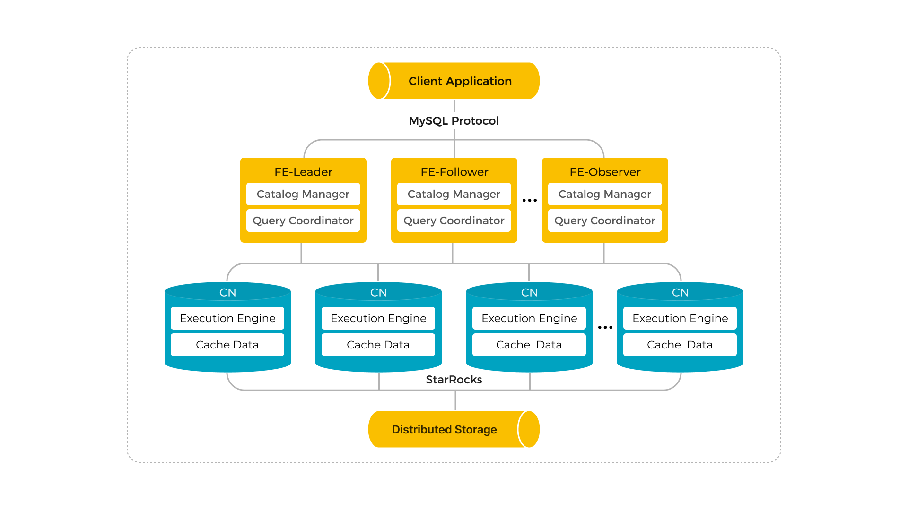

# 基于其他云存储部署

import SharedDataIntro from '../../assets/commonMarkdown/sharedDataIntro.md'
import SharedDataCNconf from '../../assets/commonMarkdown/sharedDataCNconf.md'
import SharedDataUseIntro from '../../assets/commonMarkdown/sharedDataUseIntro.md'
import SharedDataUse from '../../assets/commonMarkdown/sharedDataUse.md'

<SharedDataIntro />

## 系统架构



## 部署 StarRocks 存算分离集群

StarRocks 存算分离集群的部署方式与存算一体集群的部署方式类似，但存算分离集群需要部署 CN 节点而非 BE 节点。本小节仅列出部署 StarRocks 存算分离集群时需要添加到 FE 和 CN 配置文件 **fe.conf** 和 **cn.conf** 中的额外配置项。有关部署 StarRocks 集群的详细说明，请参阅 [部署 StarRocks](../deploy_manually.md)。

> **注意**
>
> 请勿在配置完成前启动集群。

## 存算分离部署 FE 配置

### FE 配置示例

由于 StarRocks 通过 [AWS Signature Version 4 protocol](https://docs.aws.amazon.com/AmazonS3/latest/API/sig-v4-authenticating-requests.html) 访问兼容 S3 协议的对象存储，您需要配置以 `aws_s3` 为前缀的配置项。在所有 FE 节点的配置文件 **fe.conf** 中添加以下配置项：

- 如果您使用阿里云 OSS：

  ```Properties
  run_mode = shared_data
  cloud_native_meta_port = <meta_port>
  cloud_native_storage_type = S3

  # 如 testbucket/subpath
  aws_s3_path = <s3_path>

  # 例如：cn-zhangjiakou
  aws_s3_region = <region>

  # 例如：https://oss-cn-zhangjiakou-internal.aliyuncs.com
  aws_s3_endpoint = <endpoint_url>

  aws_s3_access_key = <access_key>
  aws_s3_secret_key = <secret_key>
  ```

- 如果您使用华为云 OBS：

  ```Properties
  run_mode = shared_data
  cloud_native_meta_port = <meta_port>
  cloud_native_storage_type = S3

  # 如 testbucket/subpath
  aws_s3_path = <s3_path>

  # 例如：cn-north-4
  aws_s3_region = <region>

  # 例如：https://obs.cn-north-4.myhuaweicloud.com
  aws_s3_endpoint = <endpoint_url>

  aws_s3_access_key = <access_key>
  aws_s3_secret_key = <secret_key>
  ```

- 如果您使用腾讯云 COS：

  ```Properties
  run_mode = shared_data
  cloud_native_meta_port = <meta_port>
  cloud_native_storage_type = S3

  # 如 testbucket/subpath
  aws_s3_path = <s3_path>

  # 例如：ap-beijing
  aws_s3_region = <region>

  # 例如：https://cos.ap-beijing.myqcloud.com
  aws_s3_endpoint = <endpoint_url>

  aws_s3_access_key = <access_key>
  aws_s3_secret_key = <secret_key>
  ```

- 如果您使用火山引擎 TOS：

  ```Properties
  run_mode = shared_data
  cloud_native_meta_port = <meta_port>
  cloud_native_storage_type = S3

  # 如 testbucket/subpath
  aws_s3_path = <s3_path>

  # 例如：cn-beijing
  aws_s3_region = <region>

  # 例如：https://tos-s3-cn-beijing.ivolces.com
  aws_s3_endpoint = <endpoint_url>

  aws_s3_access_key = <access_key>
  aws_s3_secret_key = <secret_key>
  ```

- 如果您使用金山云：

  ```Properties
  run_mode = shared_data
  cloud_native_meta_port = <meta_port>
  cloud_native_storage_type = S3

  # 如 testbucket/subpath
  aws_s3_path = <s3_path>

  # 例如：BEIJING
  aws_s3_region = <region>
  
  # 注意请使用三级域名, 金山云不支持二级域名
  # 例如：jeff-test.ks3-cn-beijing.ksyuncs.com
  aws_s3_endpoint = <endpoint_url>

  aws_s3_access_key = <access_key>
  aws_s3_secret_key = <secret_key>
  ```

- 如果您使用 Ceph S3：

  ```Properties
  run_mode = shared_data
  cloud_native_meta_port = <meta_port>
  cloud_native_storage_type = S3

  # 如 testbucket/subpath
  aws_s3_path = <s3_path>
  
  # 例如：http://172.26.xx.xxx:7480
  aws_s3_endpoint = <endpoint_url>

  aws_s3_access_key = <access_key>
  aws_s3_secret_key = <secret_key>
  ```

如果您想在集群创建后手动创建默认存储卷，则只需添加以下配置项：

```Properties
run_mode = shared_data
cloud_native_meta_port = <meta_port>
enable_load_volume_from_conf = false
```

### FE 配置说明

#### run_mode

StarRocks 集群的运行模式。有效值：

- `shared_data`：在存算分离模式下运行 StarRocks。
- `shared_nothing` (默认)：在存算一体模式下运行 StarRocks。

> **说明**
>
> - StarRocks 集群不支持存算分离和存算一体模式混合部署。
> - 请勿在集群部署完成后更改 `run_mode`，否则将导致集群无法再次启动。不支持从存算一体集群转换为存算分离集群，反之亦然。

#### cloud_native_meta_port

云原生元数据服务监听端口。

- 默认值：`6090`

#### enable_load_volume_from_conf

是否允许 StarRocks 使用 FE 配置文件中指定的存储相关属性创建默认存储卷。自 v3.1.0 起支持。有效值：

- `true`（默认）：如果您在创建新的存算分离集群时指定此项为 `true`，StarRocks 将使用 FE 配置文件中存储相关属性创建内置存储卷 `builtin_storage_volume`，并将其设置为默认存储卷。但如果您没有指定存储相关的属性，StarRocks 将无法启动。
- `false`：如果您在创建新的存算分离集群时指定此项为 `false`，StarRocks 将直接启动，不会创建内置存储卷。在 StarRocks 中创建任何对象之前，您必须手动创建一个存储卷并将其设置为默认存储卷。详细信息请参见[创建默认存储卷](#使用-starrocks-存算分离集群)。

> **注意**
>
> 建议您在升级现有的 v3.0 存算分离集群时，保留此项的默认配置 `true`。如果将此项修改为 `false`，升级前创建的数据库和表将变为只读，您无法向其中导入数据。

#### cloud_native_storage_type

您使用的存储类型。在存算分离模式下，StarRocks 支持将数据存储在 HDFS 、Azure Blob（自 v3.1.1 起支持）、以及兼容 S3 协议的对象存储中（例如 AWS S3、Google GCP、阿里云 OSS 以及 MinIO）。有效值：

- `S3` (默认值)
- `AZBLOB`
- `HDFS`

> **说明**
>
> - 如果您将此项指定为 `S3`，则必须添加以 `aws_s3` 为前缀的配置项。
> - 如果您将此项指定为 `AZBLOB`，则必须添加以 `azure_blob` 为前缀的配置项。
> - 如果将此项指定为 `HDFS`，则只需指定 `cloud_native_hdfs_url`。

#### aws_s3_path

用于存储数据的存储空间路径，由存储桶的名称及其下的子路径（如有）组成，如 `testbucket/subpath`。

#### aws_s3_endpoint

访问存储空间的连接地址。

#### aws_s3_region

需访问的存储空间的地区，如 `us-west-2`。

#### aws_s3_access_key

访问存储空间的 Access Key。

#### aws_s3_secret_key

访问存储空间的 Secret Key。

> **注意**
>
> 成功创建存算分离集群后，您只能修改与安全凭证相关的配置项。如果您更改了原有存储路径相关的配置项，则在此之前创建的数据库和表将变为只读，您无法向其中导入数据。

## 存算分离部署 CN 配置

<SharedDataCNconf />

## 使用 StarRocks 存算分离集群

<SharedDataUseIntro />

以下示例使用 Access Key 以及 Secret Key 认证为 OSS 存储空间 `defaultbucket` 创建存储卷 `def_volume`，激活并将其设置为默认存储卷：

```SQL
CREATE STORAGE VOLUME def_volume
TYPE = S3
LOCATIONS = ("s3://defaultbucket/test/")
PROPERTIES
(
    "enabled" = "true",
    "aws.s3.region" = "cn-zhangjiakou",
    "aws.s3.endpoint" = "http://oss-cn-zhangjiakou-internal.aliyuncs.com",
    "aws.s3.access_key" = "<oss_access_key>",
    "aws.s3.secret_key" = "<oss_secret_key>"
);

SET def_volume AS DEFAULT STORAGE VOLUME;
```

<SharedDataUse />
