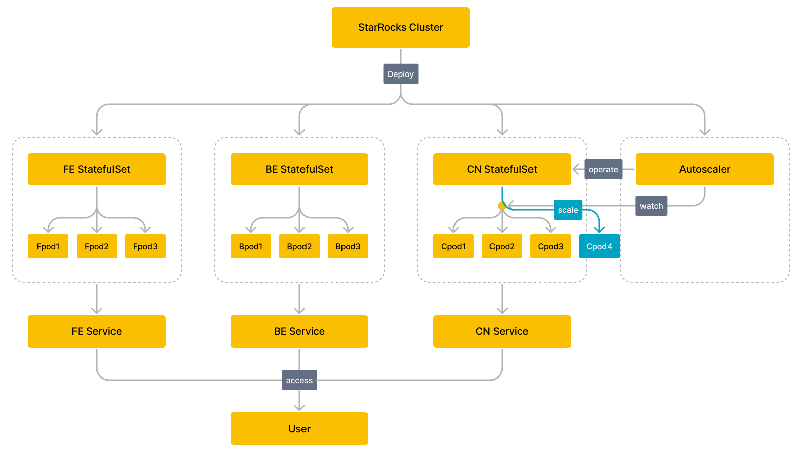

# 使用 Operator 部署 StarRocks 集群

本文介绍如何在 Kubernetes 集群上通过 StarRocks Operator 自动化部署和管理 StarRocks 集群。

## 工作原理



## **环境准备**

### **创建 Kubernetes 集群**

您可以使用云托管的 Kubernetes 服务，例如 [Amazon Elastic Kubernetes Service (EKS)](https://aws.amazon.com/cn/eks/?nc2=h_ql_prod_ct_eks) 或者 [Google Kubernetes Engine (GKE)](https://cloud.google.com/kubernetes-engine?hl=zh-cn) 集群，或者私有 Kubernetes 集群。

**创建 Amazon EKS 集群**

1. 创建 EKS 集群前，请确保[环境中已安装如下命令行工具](https://docs.aws.amazon.com/eks/latest/userguide/getting-started.html)。
   - 安装并配置 AWS 的命令行工具 AWS CLI。
   - 安装 EKS 集群命令行工具 eksctl。
   - 安装 Kubernetes 集群命令行工具 kubectl。
2. 创建 EKS 集群。支持以下两种方式：
   - [使用 eksctl 快速创建 EKS 集群](https://docs.aws.amazon.com/zh_cn/eks/latest/userguide/getting-started-eksctl.html)。
   - [使用 AWS 控制台和 AWS CLI 手动创建 EKS 集群](https://docs.aws.amazon.com/zh_cn/eks/latest/userguide/getting-started-console.html)。

**创建  GKE 集群**

创建前，请确保已经完成所有前置工作。创建步骤，请参考[创建 GKE 集群](https://cloud.google.com/kubernetes-engine/docs/deploy-app-cluster)。

**创建私有 Kubernetes 集群**

创建 [Kubernetes 集群](https://kubernetes.io/zh-cn/docs/setup/production-environment/tools/kubeadm/)。如需快速体验本特性，则可以使用 [Minikube](https://kubernetes.io/zh-cn/docs/tutorials/kubernetes-basics/create-cluster/cluster-intro/) 创建单节点 Kubernetes 集群。

### 部署 StarRocks Operator

1. 添加定制资源 StarRocksCluster。

    ```Bash
    kubectl apply -f https://raw.githubusercontent.com/StarRocks/starrocks-kubernetes-operator/main/deploy/starrocks.com_starrocksclusters.yaml
    ```

2. 部署 StarRocks Operator。您可以选择使用默认配置文件或者自定义配置文件部署 StarRocks Operator。
   1. 使用默认配置文件部署 StarRocks Operator：

      ```Bash
      kubectl apply -f https://raw.githubusercontent.com/StarRocks/starrocks-kubernetes-operator/main/deploy/operator.yaml
      ```

      StarRocks Operator 会部署至 Namespace `starrocks`，并且管理所有 Namespace 下的 StarRocks 集群。

   2. 使用自定义配置文件部署 StarRocks Operator：

      1. 下载用于部署 StarRocks Operator 的配置文件。

         ```bash
         curl -O https://raw.githubusercontent.com/StarRocks/starrocks-kubernetes-operator/main/deploy/operator.yaml
         ```

      2. 根据您的实际需要，修改配置文件 `operator.yaml`。
      3. 部署 StarRocks Operator。

         ```bash
         kubectl apply -f operator.yaml
         ```

3. 检查 StarRocks Operator 的运行状态。如果 Pod 处于 `Running` 状态且 Pod 内所有容器都 `READY`，则表示 StarRocks Operator 成功运行。

    ```bash
    $ kubectl -n starrocks get pods
    NAME                                  READY   STATUS    RESTARTS   AGE
    starrocks-controller-65bb8679-jkbtg   1/1     Running   0          5m6s
    ```

  > **说明**
  >
  > 如果您自定义 StarRocks Operator 所在 Namespace，则需要修改 `starrocks` 为自定义的 Namespace。

## 部署 StarRocks 集群

您可以直接使用 StarRocks 提供的[配置文件范例](https://github.com/StarRocks/starrocks-kubernetes-operator/tree/main/examples/starrocks)，部署 StarRocks 集群（定制资源 StarRocks Cluster 实例化的对象）。例如使用 **starrocks-fe-and-be.yaml**，部署一个 StarRocks 集群，包含三个 FE 和三个 BE 节点。

```Bash
kubectl apply -f https://raw.githubusercontent.com/StarRocks/starrocks-kubernetes-operator/main/examples/starrocks/starrocks-fe-and-be.yaml
```

主要字段说明：

| 字段     | 说明                                                         |
| -------- | ------------------------------------------------------------ |
| Kind     | 对象所属资源类型。取值必须为 `StarRocksCluster`。              |
| Metadata | 元数据。内嵌二级字段和说明如下：<ul><li>`name`：对象名称。同类资源中对象的唯一性标识。</li><li>`namespace`：对象所属 Namespace。</li></ul> |
| Spec     | 对象的期望状态，包含 `starRocksFeSpec`、`starRocksBeSpec`、`starRocksCnSpec`。 |

您也可以根据需要修改配置文件，部署 StarRocks 集群。 支持的字段和详细说明，请参见 [api.md](https://github.com/StarRocks/starrocks-kubernetes-operator/blob/main/doc/api.md) 。

部署 StarRocks 集群需要一定时间，期间，您可以执行 `kubectl -n starrocks get pods` 查看 StarRocks 集群启动状态。如果 Pod 处于 `Running` 状态且 Pod 内所有容器都 `READY`，则表示 StarRocks 集群已经成功运行。

> **说明**
>
> 如果您自定义 StarRocks 集群所在 Namespace，则需要修改 `starrocks` 为自定义的 Namespace。

```bash
$ kubectl -n starrocks get pods
NAME                                  READY   STATUS    RESTARTS   AGE
starrocks-controller-65bb8679-jkbtg   1/1     Running   0          22h
starrockscluster-sample-be-0          1/1     Running   0          23h
starrockscluster-sample-be-1          1/1     Running   0          23h
starrockscluster-sample-be-2          1/1     Running   0          22h
starrockscluster-sample-fe-0          1/1     Running   0          21h
starrockscluster-sample-fe-1          1/1     Running   0          21h
starrockscluster-sample-fe-2          1/1     Running   0          22h
```

> **说明**
>
> 如果部分 Pod 长时间仍无法启动，您可以通过 `kubectl logs -n starrocks <pod_name>` 查看日志信息或者通过 `kubectl -n starrocks describe pod <pod_name>` 查看 Event 信息，以定位问题。

## 访问 StarRocks 集群

访问 StarRocks 集群的各个组件可以通过其关联的 Service 实现，比如 FE Service。Service 的详细说明和访问地址查看，请参考 [api.md](https://github.com/StarRocks/starrocks-kubernetes-operator/blob/main/doc/api.md) 和 [Service](https://kubernetes.io/docs/concepts/services-networking/service/)。

> **说明**
>
> - 默认情况下，仅部署 FE Service。如需部署 BE Service 和 CN Service，则您需要在 StarRocks 集群配置文件 `starRocksBeSpec`、`starRocksCnSpec` 中增加配置。
> - Service 的名称默认为 `<集群名称>-<组件名称>-service`，例如 `starrockscluster-sample-fe-service`，您也可以在每个组件的 spec 中进行指定 Service 名称。

### 集群内访问 StarRocks 集群

在 Kubernetes 集群内，通过 FE Service 的 ClusterIP 访问 StarRocks 集群。

1. 查看 FE Service 内部虚拟 IP `CLUSTER-IP` 和端口 `PORT(S)`。

    ```bash
    $ kubectl -n starrocks get svc 
    NAME                                 TYPE        CLUSTER-IP       EXTERNAL-IP   PORT(S)                               AGE
    be-domain-search                     ClusterIP   None             <none>        9050/TCP                              23m
    fe-domain-search                     ClusterIP   None             <none>        9030/TCP                              25m
    starrockscluster-sample-fe-service   ClusterIP   10.100.162.xxx   <none>        8030/TCP,9020/TCP,9030/TCP,9010/TCP   25m
    ```

2. 在 Kubernetes 集群内通过 MySQL 客户端访问 StarRocks 集群。

    ```bash
    mysql -h 10.100.162.xxx -P 9030 -uroot
    ```

### 集群外访问 StarRocks 集群

在 Kubernetes 集群外，支持通过 FE Service 的 LoadBalancer 和 NodePort 访问 StarRocks 集群。本文以 LoadBalancer 为例：

1. 执行命令 `kubectl -n starrocks edit src starrockscluster-sample` 更新 StarRocks 集群配置文件，修改 `starRocksFeSpec` 的 Service 类型为 `LoadBalancer`。

    ```YAML
    starRocksFeSpec:
      image: starrocks/fe-ubuntu:3.0-latest
      replicas: 3
      requests:
        cpu: 4
        memory: 16Gi
      service:            
        type: LoadBalancer # 指定为 LoadBalancer
    ```

2. 查询 FE Service 向外部暴露的 IP 地址 `EXTERNAL-IP` 和端口 `PORT(S)`。

    ```bash
    $ kubectl -n starrocks get svc
    NAME                                 TYPE           CLUSTER-IP       EXTERNAL-IP                                                              PORT(S)                                                       AGE
    be-domain-search                     ClusterIP      None             <none>                                                                   9050/TCP                                                      127m
    fe-domain-search                     ClusterIP      None             <none>                                                                   9030/TCP                                                      129m
    starrockscluster-sample-fe-service   LoadBalancer   10.100.162.xxx   a7509284bf3784983a596c6eec7fc212-618xxxxxx.us-west-2.elb.amazonaws.com   8030:30629/TCP,9020:32544/TCP,9030:32244/TCP,9010:32024/TCP   129m               ClusterIP      None            <none>                                                                   9030/TCP                                                      23h
    ```

3. 登陆您的机器，通过 MySQL 客户端访问 StarRocks 集群。

    ```bash
    mysql -h a7509284bf3784983a596c6eec7fc212-618xxxxxx.us-west-2.elb.amazonaws.com -P9030 -uroot
    ```

## 管理 StarRocks 集群

您可以执行命令 `kubectl edit` 或者 `kubectl patch` 更新 StarRocks 集群配置文件，来管理 StarRocks 集群。

### 升级 StarRocks 集群

**升级 BE 节点**

执行如下命令，指定新的 BE 镜像文件，例如 `starrocks/be-ubuntu:latest`。

```Bash
kubectl -n starrocks patch starrockscluster starrockscluster-sample --type='merge' -p '{"spec":{"starRocksBeSpec":{"image":"starrocks/be-ubuntu:latest"}}}'
```

**升级 FE 节点**

执行如下命令，指定新的 FE 镜像文件，例如 `starrocks/fe-ubuntu:latest`。

```Bash
kubectl -n starrocks patch starrockscluster starrockscluster-sample --type='merge' -p '{"spec":{"starRocksFeSpec":{"image":"starrocks/fe-ubuntu:latest"}}}'
```

升级过程会持续一段时间，您可以通过 `kubectl -n starrocks get pods` 命令观察升级进度。

### 扩缩容 StarRocks 集群

本文以扩容 BE 集群和 FE 集群为例。

**扩容 BE 集群**

执行如下命令，扩容 BE 集群至 9 个节点。

```Bash
kubectl -n starrocks patch starrockscluster starrockscluster-sample --type='merge' -p '{"spec":{"starRocksBeSpec":{"replicas":9}}}'
```

**扩容 FE 集群**

执行如下命令，扩容 FE 集群至 4 个节点。

```Bash
kubectl -n starrocks patch starrockscluster starrockscluster-sample --type='merge' -p '{"spec":{"starRocksFeSpec":{"replicas":4}}}'
```

扩容过程会持续一段时间，您可以通过 `kubectl -n starrocks get pods` 命令观察扩容进度。

### 自动扩缩容 CN 集群

执行命令 `kubectl -n starrocks edit src starrockscluster-sample` 配置 CN 自动扩缩策略。您可以指定资源指标为 CN 的内存和 CPU 平均使用率、触发弹性伸缩的阈值、弹性伸缩上限和下限（即 CN 数量的上下限）。

> **注意**
>
> 如果配置了 CN 自动扩缩容策略，则请删除 CN 的 `replicas` 字段。

Kubernetes 还支持使用 `behavior`，根据业务场景定制扩缩容行为，实现快速扩容，缓慢缩容，禁用缩容等。更多自动扩容容策略的说明，请参见 [Pod 水平自动扩缩](https://kubernetes.io/zh-cn/docs/tasks/run-application/horizontal-pod-autoscale/)。

如下是 StarRocks 提供的 [CN 自动扩缩策略模版](https://github.com/StarRocks/starrocks-kubernetes-operator/blob/main/examples/starrocks/deploy_a_starrocks_cluster_with_cn.yaml)。

```Bash
  starRocksCnSpec:
    image: starrocks/cn-ubuntu:latest
    limits:
      cpu: 16
      memory: 64Gi
    requests:
      cpu: 16
      memory: 64Gi
    # when you use autoscalingPolicy, it is recommended that replicas removed from manifests.
    autoScalingPolicy: # Automatic scaling policy of the CN cluster.
      maxReplicas: 10 # The maximum number of CNs is set to 10.
      minReplicas: 1 # The minimum number of CNs is set to 1.
      # operator creates an HPA resource based on the following field.
      # see https://kubernetes.io/docs/tasks/run-application/horizontal-pod-autoscale/ for more information.
      hpaPolicy:
        metrics: # Resource metrics
          - type: Resource
            resource:
              name: memory  # The average memory usage of CNs is specified as a resource metric.
              target:
                # The elastic scaling threshold is 60%.
                # When the average memory utilization of CNs exceeds 60%, the number of CNs increases for scale-out.
                # When the average memory utilization of CNs is below 60%, the number of CNs decreases for scale-in.
                averageUtilization: 60
                type: Utilization
          - type: Resource
            resource:
              name: cpu # The average CPU utilization of CNs is specified as a resource metric.
              target:
                # The elastic scaling threshold is 60%.
                # When the average CPU utilization of CNs exceeds 60%, the number of CNs increases for scale-out.
                # When the average CPU utilization of CNs is below 60%, the number of CNs decreases for scale-in.
                averageUtilization: 60
                type: Utilization
        behavior: # 根据业务场景定制扩缩容行为，实现快速扩容、缓慢缩容、禁用缩容等。
          scaleUp:
            policies:
              - type: Pods
                value: 1
                periodSeconds: 10
          scaleDown:
            selectPolicy: Disabled
```

主要字段以及说明如下：

- 水平扩缩时 CN 数量的上限和下限。

  ```Bash
  maxReplicas: 10 # CN 数量上限为 10
  minReplicas: 1  # CN 数量下限为 1
  ```

- 触发水平扩缩的阈值。

  ```Bash
  # 触发水平扩缩容的阈值，例如资源指标为 Kubernetes 集群中 CN CPU 使用率。当 CPU 使用率超过 60% 时，增加 CN 数量进行扩容，低于 60% 时，减少 CN 数量进行缩容。
  - type: Resource
    resource:
      name: cpu
      target:
        averageUtilization: 60
  ```

## 常见问题

- **问题描述**：执行 `kubectl apply -f xxx` 部署定制资源 StarRocksCluster 时，报错 `The CustomResourceDefinition "starrocksclusters.starrocks.com" is invalid: metadata.annotations: Too long: must have at most 262144 bytes`。
- **原因分析**：因为每次使用 `kubectl apply -f xxx` 创建或者更新资源时，都会添加一个名为 kubectl.kubernetes.io/last-applied-configuration 的 metadata 注解。该 metadata 注解为 JSON 格式，注解值包含了用来创建对象的配置文件的内容。`kubectl apply -f xxx` 适用于大部分情况，但在极少数情况下，例如定制资源的配置文件过大，则可能会导致 metadata 注解的大小超出上限。
- **解决措施**：如果您是第一次部署定制资源 StarRocksCluster，则建议您使用 `kubectl create -f xxx`。如果环境中已经部署定制资源，您需要更新定制资源的配置，则建议您使用 `kubectl replace -f xxx`。
