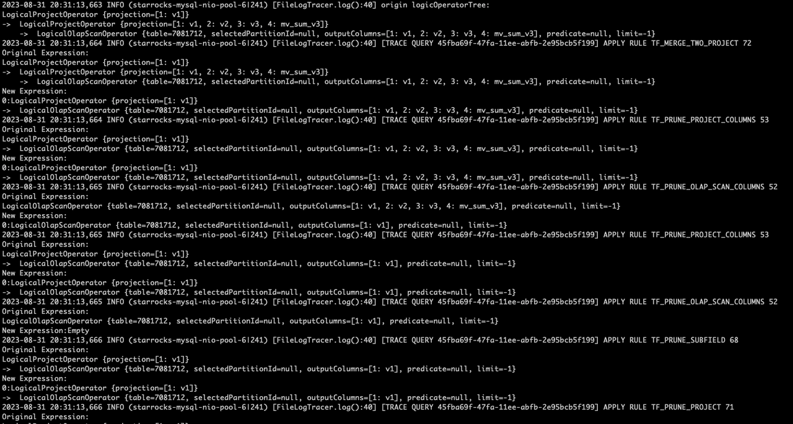

# Query Trace Profile

本文介绍如何获取和分析 Query Trace Profile。Query Trace Profile 记录了指定查询语句的 Debug 信息，包括耗时、变量值以及日志。Query Trace Profile 中的信息分为多个模块，您可以从不同的模块角度调试并识别查询性能瓶颈。该功能自 v3.2.0 起支持。

## 语法

您可以使用以下语法获取指定查询的 Query Trace Profile：

```SQL
TRACE { TIMES | VALUES | LOGS | ALL } [ <module> ] <query_statement>
```

- `TIMES`：跟踪指定查询的每个阶段事件的时间成本。
- `VALUES`：跟踪指定查询的变量及其值。
- `LOGS`：跟踪指定查询的日志记录。
- `ALL`：按时间顺序列出所有的 `TIMES`、`VALUES` 和 `LOGS` 信息。
- `<module>`：要查看信息的模块。有效值：
  - `BASE`：基础模块。
  - `MV`：物化视图模块。
  - `OPTIMIZER`：优化器模块。
  - `SCHEDULE`：调度模块。
  - `EXTERNAL`：外部模块。

  如果未指定模块，默认使用 `BASE`。

- `<query_statement>`: 要获取 Query Trace Profile 的查询语句。

## 使用场景

### 查看查询的耗时

以下示例查看指定查询的优化器模块耗时：

```Plain
MySQL > TRACE TIMES OPTIMIZER SELECT * FROM t1 JOIN t2 ON t1.v1 = t2.v1;
+---------------------------------------------------------------------+
| Explain String                                                      |
+---------------------------------------------------------------------+
|  2ms|-- Total[1] 15ms                                               |
|  2ms|    -- Analyzer[1] 1ms                                         |
|  4ms|    -- Transformer[1] 1ms                                      |
|  6ms|    -- Optimizer[1] 11ms                                       |
|  6ms|        -- preprocessMvs[1] 0                                  |
|  6ms|        -- RuleBaseOptimize[1] 3ms                             |
|  6ms|            -- RewriteTreeTask[41] 2ms                         |
|  7ms|                -- PushDownJoinOnClauseRule[1] 0               |
|  7ms|                -- PushDownPredicateProjectRule[2] 0           |
|  7ms|                -- PushDownPredicateScanRule[2] 0              |
|  8ms|                -- MergeTwoProjectRule[3] 0                    |
|  8ms|                -- PushDownJoinOnExpressionToChildProject[1] 0 |
|  8ms|                -- PruneProjectColumnsRule[6] 0                |
|  8ms|                -- PruneJoinColumnsRule[2] 0                   |
|  8ms|                -- PruneScanColumnRule[4] 0                    |
|  9ms|                -- PruneSubfieldRule[2] 0                      |
|  9ms|                -- PruneProjectRule[6] 0                       |
|  9ms|                -- PartitionPruneRule[2] 0                     |
|  9ms|                -- DistributionPruneRule[2] 0                  |
|  9ms|                -- MergeProjectWithChildRule[3] 0              |
| 10ms|        -- CostBaseOptimize[1] 6ms                             |
| 10ms|            -- OptimizeGroupTask[6] 0                          |
| 10ms|            -- OptimizeExpressionTask[9] 0                     |
| 10ms|            -- ExploreGroupTask[4] 0                           |
| 10ms|            -- DeriveStatsTask[9] 3ms                          |
| 13ms|            -- ApplyRuleTask[16] 0                             |
| 13ms|                -- OnlyScanRule[2] 0                           |
| 14ms|                -- HashJoinImplementationRule[2] 0             |
| 14ms|            -- EnforceAndCostTask[12] 1ms                      |
| 14ms|                -- OlapScanImplementationRule[2] 0             |
| 15ms|                -- OnlyJoinRule[2] 0                           |
| 15ms|                -- JoinCommutativityRule[1] 0                  |
| 16ms|        -- PhysicalRewrite[1] 0                                |
| 17ms|        -- PlanValidate[1] 0                                   |
| 17ms|            -- InputDependenciesChecker[1] 0                   |
| 17ms|            -- TypeChecker[1] 0                                |
| 17ms|            -- CTEUniqueChecker[1] 0                           |
| 17ms|    -- ExecPlanBuild[1] 0                                      |
| Tracer Cost: 273us                                                  |
+---------------------------------------------------------------------+
39 rows in set (0.029 sec)
```

在 TRACE TIMES 语句返回的 **Explain String** 中，每行（除最后一行外）都对应指定查询模块中的一个事件。最后一行的 `Tracer Cost` 记录的是 Trace 过程的耗时。

以 `|  4ms|    -- Transformer[1] 1ms` 为例：

- 左边列中记录的是事件首次执行在查询生命周期中的时间点。
- 在右边列中，连续的破折号后是事件的名称，即 `Transformer`。
- 在事件名称之后，方括号中的数字（`[1]`）表示事件执行的次数。
- 右边列的最后部分是事件的总耗时，例如 `1ms`。
- 事件按照方法栈的深度进行缩进。在当前示例中，`Transformer` 的第一次执行必然发生在 `Total` 内。

### 查看查询的变量

以下示例查看指定查询的物化视图模块的变量和值：

```Plain
MySQL > TRACE VALUES MV SELECT t1.v2, sum(t1.v3) FROM t1 JOIN t0 ON t1.v1 = t0.v1 GROUP BY t1.v2;
+----------------------------+
| Explain String             |
+----------------------------+
| 32ms| mv2: Rewrite Succeed |
| Tracer Cost: 66us          |
+----------------------------+
2 rows in set (0.045 sec)
```

TRACE VALUES 语句返回的 **Explain String** 结构与 TRACE TIMES 语句相似，不同之处在于右列记录了指定模块中事件的变量和设置。上述示例记录了物化视图改写状态为成功。

### 查看查询的日志

以下示例查看指定查询的物化视图模块的日志：

```Plain
MySQL > TRACE LOGS MV SELECT v2, sum(v3) FROM t1 GROUP BY v2;
+-------------------------------------------------------------------------------------------------------------------------------------------------------------------------------+
| Explain String                                                                                                                                                                |
+-------------------------------------------------------------------------------------------------------------------------------------------------------------------------------+
|  3ms|    [MV TRACE] [PREPARE cac571e8-47f9-11ee-abfb-2e95bcb5f199][mv2] [SYNC=false] Prepare MV mv2 success                                                                   |
|  3ms|    [MV TRACE] [PREPARE cac571e8-47f9-11ee-abfb-2e95bcb5f199][GLOBAL] [SYNC=false] RelatedMVs: [mv2], CandidateMVs: [mv2]                                                |
|  4ms|    [MV TRACE] [PREPARE cac571e8-47f9-11ee-abfb-2e95bcb5f199][GLOBAL] [SYNC=true] There are no related mvs for the query plan                                            |
| 35ms|    [MV TRACE] [REWRITE cac571e8-47f9-11ee-abfb-2e95bcb5f199 TF_MV_AGGREGATE_SCAN_RULE mv2] Rewrite ViewDelta failed: cannot compensate query by using PK/FK constraints |
| 35ms|    [MV TRACE] [REWRITE cac571e8-47f9-11ee-abfb-2e95bcb5f199 TF_MV_ONLY_SCAN_RULE mv2] MV is not applicable: mv expression is not valid                                  |
| 43ms|    Query cannot be rewritten, please check the trace logs or `set enable_mv_optimizer_trace_log=on` to find more infos.                                                 |
| Tracer Cost: 400us                                                                                                                                                            |
+-------------------------------------------------------------------------------------------------------------------------------------------------------------------------------+
7 rows in set (0.056 sec)
```

您也可以通过设置变量 `trace_log_mode` 将这些日志打印到 FE 日志文件 **fe.log** 中。如下所示：

```SQL
SET trace_log_mode='file';
```

`trace_log_mode` 的默认值为 `command`，表示日志将以上述示例中 **Explain String** 的形式返回。如果将其值设置为 `file`，则日志将以 `FileLogTracer` 为类名打印到 FE 日志文件 **fe.log** 中。

将 `trace_log_mode` 设置为 `file` 后，在执行 TRACE LOGS 语句时将不会返回任何日志。

示例：

```Plain
MySQL > TRACE LOGS OPTIMIZER SELECT v1 FROM t1 ;
+---------------------+
| Explain String      |
+---------------------+
| Tracer Cost: 3422us |
+---------------------+
1 row in set (0.023 sec)
```

日志将打印在 **fe.log** 中。



