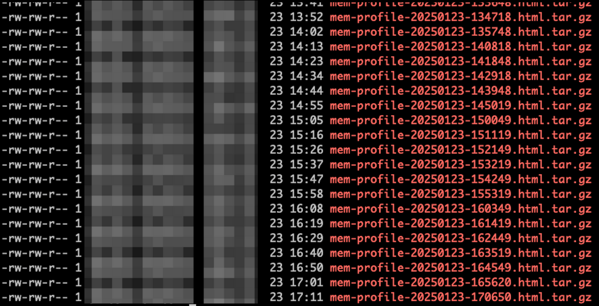
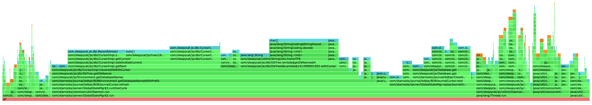

# FE 堆内存故障排查

本主题描述了如何在 StarRocks 中排查 FE 堆内存问题。

## 堆内存分配突然上涨

您可以通过检查 StarRocks 中的 Memory Profile（或 Memory Allocation Profile）来识别导致堆内存分配激增的问题。从 v3.3.6 版本开始，StarRocks 支持将 Memory Profile 以 `.tgz` 格式压缩的 HTML 文件形式打印到 **fe/log/proc_profile** 目录下。



您可以根据内存问题发生的时间找到相应的文件，解压缩并在浏览器中打开。文件中会显示堆栈内存分配的火焰图。图中的框越宽，表示该堆栈分配的内存资源越多。例如，在下面的火焰图中，`BDBEnvironment.getDatabaseNamesWithPrefix` 框的宽度超过了图形的 50%，说明该函数分配的内存资源超过了一半。



如果在激增期间没有打印 Memory Profile 文件，您可以在 FE 配置文件 **fe.conf** 中设置以下配置项，然后重启 FE，从而禁用 CPU Profile，并将 Profile 打印间隔设置为 5 分钟。

```Properties
proc_profile_cpu_enable = false
proc_profile_collect_interval_s = 300
```

### v3.3.6 版本之前的解决方法

对于 v3.3.6 之前的版本，您可以通过脚本定期打印内存分析文件。

在 **fe** 目录下运行以下 Shell 脚本：

```Bash
#!/bin/bash

mkdir -p mem_alloc_log

while true
do
    current_time=$(date +'%Y-%m-%d-%H-%M-%S')
    file_name="mem_alloc_log/alloc-profile-${current_time}.html"
    ./bin/profiler.sh -e alloc --alloc 2m -d 300 -f "$file_name" `cat bin/fe.pid`
done
```

## 堆内存用量缓慢增长

从 v3.3.7 版本开始，StarRocks 支持打印 Memory Usage Tracker 日志，以定位内存泄漏问题。内存使用跟踪器将定期记录每个模块的内存使用情况。

示例：

```Plain
2025-02-05 19:35:23.287+08:00 INFO (MemoryUsageTracker|77) [MemoryUsageTracker.trackMemory():164] (0ms) Module Agent - AgentTaskTracker estimated 0B of memory. Contains AgentTask with 0 object(s).
2025-02-05 19:35:23.287+08:00 INFO (MemoryUsageTracker|77) [MemoryUsageTracker.trackMemory():164] (0ms) Module Backup - BackupHandler estimated 0B of memory. Contains BackupOrRestoreJob with 0 object(s).
2025-02-05 19:35:23.287+08:00 INFO (MemoryUsageTracker|77) [MemoryUsageTracker.trackMemory():164] (0ms) Module Compaction - CompactionMgr estimated 0B of memory. Contains PartitionStats with 0 object(s).
2025-02-05 19:35:23.287+08:00 INFO (MemoryUsageTracker|77) [MemoryUsageTracker.trackMemory():164] (0ms) Module Coordinator - QeProcessorImpl estimated 0B of memory. Contains QueryCoordinator with 0 object(s).
2025-02-05 19:35:23.287+08:00 INFO (MemoryUsageTracker|77) [MemoryUsageTracker.trackMemory():164] (0ms) Module Delete - DeleteMgrEPack estimated 0B of memory. Contains DeleteInfo with 0 object(s). DeleteJob with 0 object(s).
2025-02-05 19:35:23.287+08:00 INFO (MemoryUsageTracker|77) [MemoryUsageTracker.trackMemory():164] (0ms) Module Dict - CacheDictManager estimated 0B of memory. Contains ColumnDict with 0 object(s).
2025-02-05 19:35:23.287+08:00 INFO (MemoryUsageTracker|77) [MemoryUsageTracker.trackMemory():164] (0ms) Module Export - ExportMgr estimated 0B of memory. Contains ExportJob with 0 object(s).
2025-02-05 19:35:23.287+08:00 INFO (MemoryUsageTracker|77) [MemoryUsageTracker.trackMemory():164] (0ms) Module Load - InsertOverwriteJobMgr estimated 0B of memory. Contains insertOverwriteJobs with 0 object(s).
2025-02-05 19:35:23.287+08:00 INFO (MemoryUsageTracker|77) [MemoryUsageTracker.trackMemory():164] (0ms) Module Load - LoadMgrEPack estimated 245.7KB of memory. Contains LoadJob with 1165 object(s).
2025-02-05 19:35:23.287+08:00 INFO (MemoryUsageTracker|77) [MemoryUsageTracker.trackMemory():164] (0ms) Module Load - RoutineLoadMgrEPack estimated 0B of memory. Contains RoutineLoad with 0 object(s).
2025-02-05 19:35:23.287+08:00 INFO (MemoryUsageTracker|77) [MemoryUsageTracker.trackMemory():164] (0ms) Module Load - StreamLoadMgrEPack estimated 0B of memory. Contains StreamLoad with 0 object(s).
2025-02-05 19:35:23.287+08:00 INFO (MemoryUsageTracker|77) [MemoryUsageTracker.trackMemory():164] (0ms) Module LocalMetastore - LocalMetastore estimated 7KB of memory. Contains Partition with 45 object(s).
2025-02-05 19:35:23.287+08:00 INFO (MemoryUsageTracker|77) [MemoryUsageTracker.trackMemory():164] (0ms) Module MV - MVTimelinessMgr estimated 0B of memory. Contains mvTimelinessMap with 0 object(s).
2025-02-05 19:35:23.287+08:00 INFO (MemoryUsageTracker|77) [MemoryUsageTracker.trackMemory():164] (0ms) Module Profile - ProfileManager estimated 96B of memory. Contains QueryProfile with 4 object(s).
2025-02-05 19:35:23.287+08:00 INFO (MemoryUsageTracker|77) [MemoryUsageTracker.trackMemory():164] (0ms) Module Query - QueryTracker estimated 0B of memory. Contains QueryDetail with 0 object(s).
2025-02-05 19:35:23.287+08:00 INFO (MemoryUsageTracker|77) [MemoryUsageTracker.trackMemory():164] (0ms) Module Report - ReportHandler estimated 0B of memory. Contains PendingTask with 0 object(s). ReportQueue with 0 object(s).
2025-02-05 19:35:23.287+08:00 INFO (MemoryUsageTracker|77) [MemoryUsageTracker.trackMemory():164] (0ms) Module Statistics - CachedStatisticStorage estimated 0B of memory. Contains TableStats with 0 object(s). ColumnStats with 0 object(s). PartitionStats with 0 object(s). HistogramStats with 0 object(s). ConnectorTableStats with 0 object(s). ConnectorHistogramStats with 0 object(s).
2025-02-05 19:35:23.287+08:00 INFO (MemoryUsageTracker|77) [MemoryUsageTracker.trackMemory():164] (0ms) Module TabletInvertedIndex - TabletInvertedIndex estimated 49.8KB of memory. Contains TabletMeta with 208 object(s). TabletCount with 208 object(s). ReplicateCount with 216 object(s).
2025-02-05 19:35:23.287+08:00 INFO (MemoryUsageTracker|77) [MemoryUsageTracker.trackMemory():164] (0ms) Module Task - TaskManager estimated 0B of memory. Contains Task with 0 object(s).
2025-02-05 19:35:23.287+08:00 INFO (MemoryUsageTracker|77) [MemoryUsageTracker.trackMemory():164] (0ms) Module Task - TaskRunManager estimated 0B of memory. Contains PendingTaskRun with 0 object(s). RunningTaskRun with 0 object(s). HistoryTaskRun with 0 object(s).
2025-02-05 19:35:23.287+08:00 INFO (MemoryUsageTracker|77) [MemoryUsageTracker.trackMemory():164] (0ms) Module Transaction - GlobalTransactionMgr estimated 311.4KB of memory. Contains Txn with 1329 object(s). TxnCallbackCount with 0 object(s).
2025-02-05 19:35:23.288+08:00 INFO (MemoryUsageTracker|77) [MemoryUsageTracker.trackMemory():111] total tracked memory: 614.2KB, jvm: Process used: 672MB, heap used: 299.9MB, non heap used: 170MB, direct buffer used: 4.2MB
```
