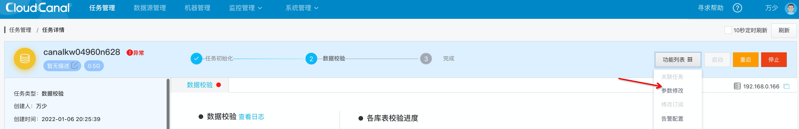
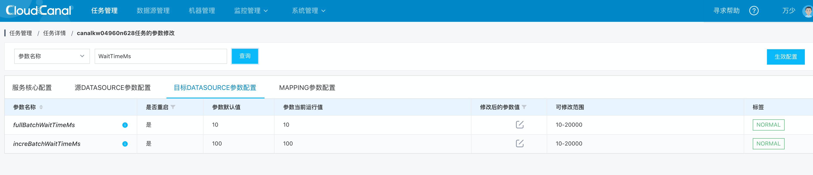

# CloudCanal 导入常见问题

## 导入时任务异常，报错 close index failed/too many tablet versions

### CloudCanal侧解决方法

- 打开任务详情
- 打开任务参数
- 调节fullBatchWaitTimeMs和increBatchWaitTimeMs参数，增加一批数据写入StarRocks之后的停顿时间，避免写入过于频繁导致的异常报错





### StarRocks侧解决办法

调整compaction策略，加快合并(调整完需要观察内存和IO)，在be.conf中修改以下内容

```properties
cumulative_compaction_num_threads_per_disk = 4
base_compaction_num_threads_per_disk = 2
cumulative_compaction_check_interval_seconds = 2
update_compaction_num_threads_per_disk = 2 （该参数属于主键表单独的compaction参数）
```
