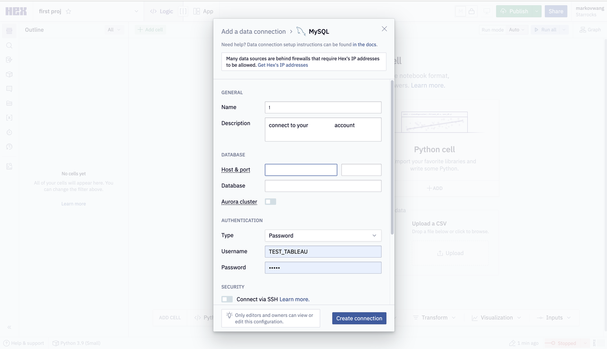

# Hex

Hex 支持对 StarRocks 中的内部数据和外部数据进行查询和可视化处理。

在 Hex 中添加数据连接。注意需要选择 MySQL 作为连接类型。

需要设置的参数说明如下：

- **Name**：数据连接的名称。
- **Host &** **port**：StarRocks 集群的 FE 主机 IP 地址和 FE 查询端口。查询端口可以设置为比如 `9030`。
- **Database**：StarRocks 集群中要访问的数据源。格式为 `<catalog_name>.<database_name>`。
  - `catalog_name`：StarRocks 集群中目标 Catalog 的名称。Internal Catalog 和 External Catalog 均支持。
  - `database_name`：StarRocks 集群中目标数据库的名称。内部数据库和外部数据库均支持。
- **Type**：鉴权方式。选择 **Password**。
- **User**：用于登录 StarRocks 集群的用户名，如 `admin`。
- **Password**：用于登录 StarRocks 集群的用户密码。
