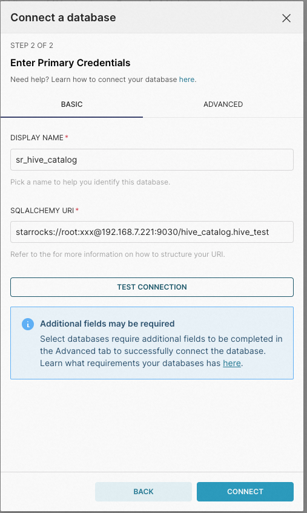

# Apache Superset

Apache Superset 支持对 StarRocks 的内部数据和外部数据进行查询和可视化处理。

## 前提条件

确保您已完成如下工具安装：

1. 在 Apache Superset 服务器上安装 StarRocks 的 Python 客户端。

   ```SQL
   pip install starrocks
   ```

2. 安装最新版本的 Apache Superset。具体参见[安装 Superset](https://superset.apache.org/docs/intro).

## 集成

在 Apache Superset 中创建数据库：




创建过程中需要注意以下几点：

- 在 **SUPPORTED DATABASES** 里选择 **StarRocks** 作为数据源。
- 在 **SQLALCHEMY** **URI** 里，按如下 StarRocks SQLAlchemy URI 格式填写 URI：

  ```SQL
  starrocks://<User>:<Password>@<Host>:<Port>/<Catalog>.<Database>
  ```

  URI 参数说明如下：

  - `User`：用于登录 StarRocks 集群的用户名，如 `admin`。
  - `Password`：用于登录 StarRocks 集群的用户密码。
  - `Host`：StarRocks 集群的 FE 主机 IP 地址。
  - `Port`：StarRocks 集群的 FE 查询端口，如 `9030`。
  - `Catalog`：StarRocks 集群中的目标 Catalog。Internal Catalog 和 External Catalog 均支持。
  - `Database`：StarRocks 集群中的目标数据库。内部数据库和外部数据库均支持。
